# Network Configurations in Microsoft Fabric

## Overview

Microsoft Fabric is a unified SaaS platform for analytics and AI, bringing together Data Factory, Data Engineering, Data Science, Data Warehousing, Real-Time Intelligence and Power BI around a single data lake: **OneLake**.

Network security in Fabric is built around three fundamental pillars:

| Pillar | Objective | Key Features |
|--------|-----------|-------------|
| **Inbound Protection** | Control who accesses Fabric | Conditional Access, Private Links (tenant/workspace), IP Firewall |
| **Secure Outbound Access** | Connect Fabric to protected data sources | Trusted Workspace Access, Managed Private Endpoints, VNet/On-prem Gateways |
| **Outbound Protection** | Prevent data exfiltration | Outbound Access Policies, allowed destination rules |

Combining **Inbound + Outbound Protection** provides complete **Data Exfiltration Protection (DEP)**.

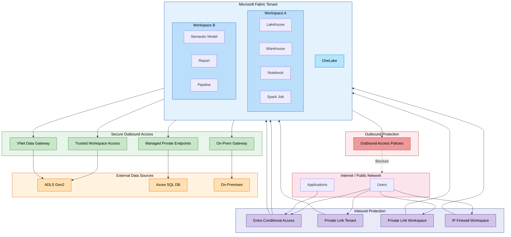

## Secure by Default

Microsoft Fabric is **secure by default** without any additional configuration:

- **Authentication**: Every interaction is authenticated via **Microsoft Entra ID**
- **Encryption in transit**: All traffic is encrypted using **TLS 1.2** minimum (TLS 1.3 negotiation when available)
- **Encryption at rest**: All data in OneLake is automatically encrypted
- **Microsoft backbone network**: Internal communications between Fabric experiences travel through the Microsoft private network, never over the public internet
- **Secure endpoints**: The Fabric backend is protected by a virtual network and is not directly accessible from the public internet

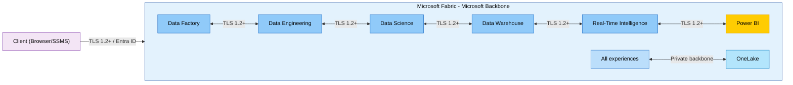

## Inbound Protection

Inbound protection controls traffic entering Fabric from the internet or corporate networks.

### Entra Conditional Access

Microsoft Entra ID Conditional Access is the **Zero Trust** approach for securing access to Fabric. Access decisions are made at authentication time by evaluating contextual signals.

**Evaluated signals:**

| Signal | Policy examples |
|--------|----------------|
| Users and groups | Target specific populations |
| Location / IP | Allow only certain IP ranges or countries |
| Devices | Require compliant devices (Intune) |
| Applications | Apply rules per Fabric application |
| Sign-in risk | Block high-risk sign-ins |

**Possible decisions:** Block, Grant, Require MFA, Require compliant device.

**Prerequisites:** Microsoft Entra ID P1 license (often included in Microsoft 365 E3/E5).

> **Note:** Conditional Access policies apply to Fabric and related Azure services (Power BI, Azure Data Explorer, Azure SQL Database, Azure Storage). This may be considered too broad for some scenarios.

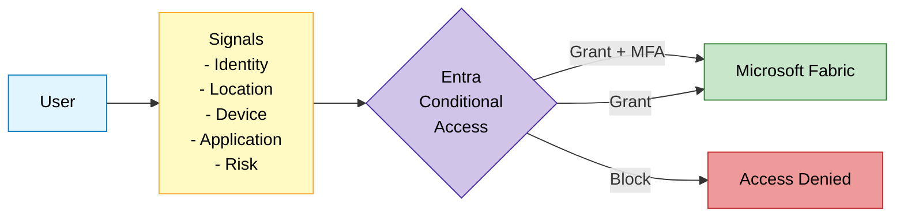

### Tenant-Level Private Link

Tenant-level Private Link provides **perimeter-based protection** for the entire Fabric tenant.

**Concept:** An Azure Private Endpoint is created in the customer's VNet, establishing a private tunnel to Fabric via the Microsoft backbone. Fabric becomes inaccessible from the public internet.

**Two key settings:**

| Setting | Effect |
|---------|--------|
| **Azure Private Links** (enabled) | Traffic from the VNet to supported endpoints goes through the Private Link |
| **Block Public Internet Access** (enabled) | Fabric is no longer accessible from the public internet; only Private Link is allowed |

**Configuration scenarios:**

| Private Link | Block Public Access | Behavior |
|:---:|:---:|---|
| Yes | Yes | Access only via Private Endpoint. Unsupported endpoints blocked. |
| Yes | No | VNet traffic via Private Link. Public internet traffic allowed. |
| No | - | Standard access via public internet. |

**Considerations:**

- **All users** must connect through the private network (VPN, ExpressRoute)
- **Bandwidth** impact: static resources (CSS, images) also transit through the Private Endpoint
- Some features have **limitations** (Publish to Web disabled, Copilot not supported, Power BI PDF/PowerPoint export disabled)
- **Spark Starter Pools** are disabled (replaced by custom pools in the managed VNet)

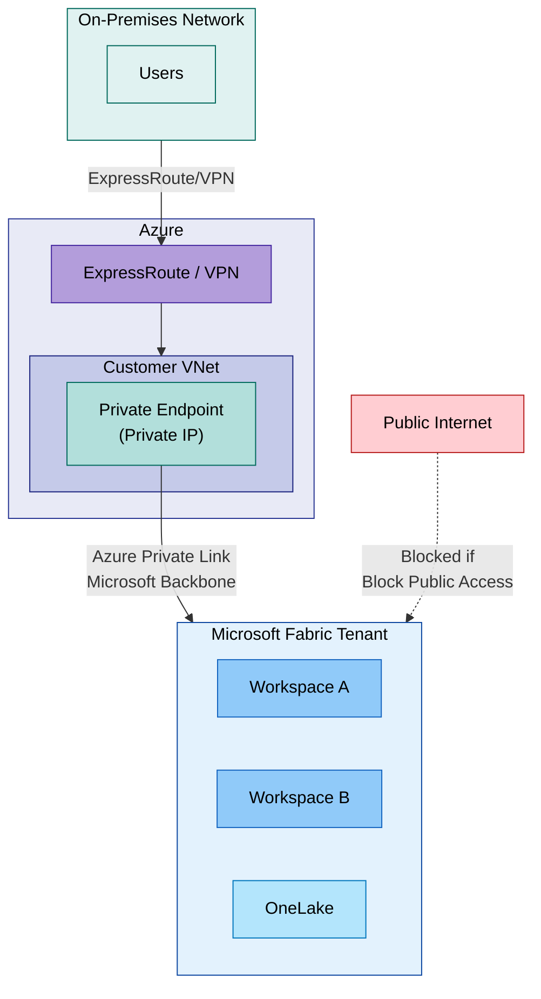

### Workspace-Level Private Link

Workspace-level Private Link offers **granular** control: specific workspaces are protected by Private Link while others remain publicly accessible.

**Key characteristics:**

- **1:1** relationship between a workspace and its Private Link Service
- A Private Link Service can have **multiple Private Endpoints** (from different VNets)
- A VNet can connect to **multiple workspaces** via separate Private Endpoints
- Public access can be restricted **independently** per workspace
- Public workspaces can be secured with Entra Conditional Access or IP Filtering

**Supported items (GA since September 2025):**
Lakehouse, Shortcut, Notebook, ML Experiment/Model, Pipeline, Warehouse, Dataflows, Eventstream, Mirrored DB. Access to workspace-level Private Link workspaces is available via both the Fabric portal and API.

> **Limitation — Unsupported item types:** Power BI reports/dashboards, Fabric databases, Data Activator, deployment pipelines, and default semantic models are **not yet covered** by workspace-level Private Link. These items remain accessible via public endpoints unless the entire tenant is secured with tenant-level Private Link or Microsoft Entra Conditional Access is used. Support for these item types is on the roadmap.

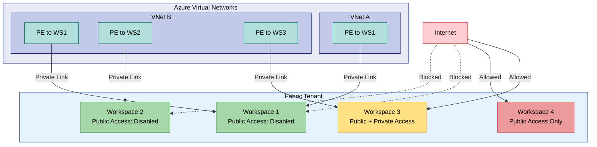

> **Key difference from Tenant-Level Private Link:** Workspace-level Private Link allows you to protect only sensitive workspaces without impacting the entire tenant. This is the recommended approach for organizations that cannot force all users onto a private network.

### Workspace IP Firewall

The workspace IP firewall is the simplest solution to restrict access to a workspace from specific public IP ranges.

**Concept:** Only explicitly allowed IP addresses or IP ranges can access the workspace. No Azure network infrastructure is required.

**Supported items (GA since Q1 2026):**
Lakehouse, Shortcut, Notebook, ML Experiment/Model, Pipeline, Warehouse, Dataflows, Eventstream, Mirrored DB. Both API and UI configuration are supported.

> **Limitation — Unsupported item types:** Power BI reports/dashboards, Fabric databases, Data Activator, deployment pipelines, and default semantic models are **not covered** by workspace IP Firewall rules. Traffic to these items bypasses the IP firewall and remains accessible from any network unless the entire tenant is locked down with tenant-level Private Link or Microsoft Entra Conditional Access. Support for these items is on the roadmap.

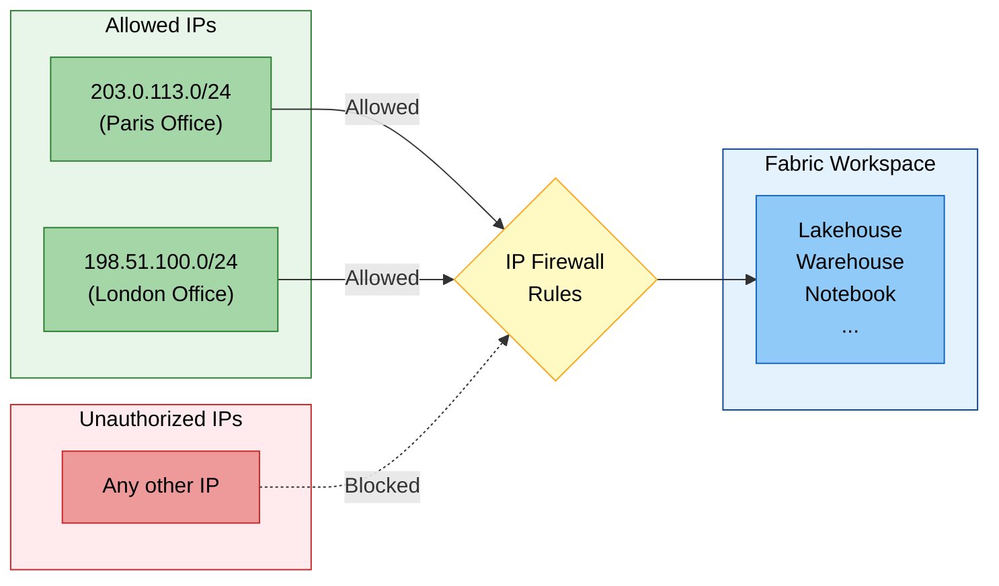

### Inbound Options Comparison

| Criteria | Conditional Access | Private Link Tenant | Private Link Workspace | IP Firewall |
|----------|:-:|:-:|:-:|:-:|
| **Granularity** | Tenant (per policy) | Tenant | Workspace | Workspace |
| **Azure infrastructure required** | No | VNet + PE | VNet + PE per WS | No |
| **Complexity** | Low | High | Medium | Low |
| **Approach** | Zero Trust (identity) | Perimeter (network) | Perimeter (network) | IP-based |
| **User impact** | Transparent (MFA) | VPN/ER mandatory | VPN/ER for protected WS | None if IP allowed |
| **Additional cost** | Entra ID P1 | VNet + PE + ER/VPN | VNet + PE | None |
| **Status** | GA | GA | GA | GA |

## Secure Outbound Access

Secure outbound access allows Fabric to connect to data sources protected by firewalls or private networks.

### Trusted Workspace Access

Trusted Workspace Access allows specific Fabric workspaces to securely access **firewall-enabled ADLS Gen2 accounts**.

**Concept:** The Fabric workspace has a **workspace identity** (managed identity). **Resource Instance Rules** are configured on the storage account to authorize only specified workspaces.

**Prerequisites:**
- Workspace associated with a **Fabric F SKU** capacity (not supported on Trial)
- **Workspace Identity** created and configured as Contributor
- Authentication principal with Azure RBAC role on the storage account (Storage Blob Data Contributor/Owner/Reader)
- Resource Instance Rule configured via **ARM Template** or **PowerShell**

**Supported scenarios:**

| Method | Description |
|--------|-------------|
| **OneLake Shortcut** | ADLS Gen2 shortcut in a Lakehouse |
| **Pipeline** | Data copy from firewall-enabled ADLS Gen2 |
| **T-SQL COPY INTO** | Ingestion into a Warehouse |
| **Semantic Model** (import) | Model connected to ADLS Gen2 |
| **AzCopy** | High-performance load to OneLake |

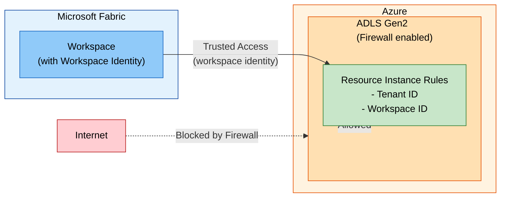

### Managed Private Endpoints

Managed Private Endpoints enable secure, private connections to Azure data sources from Fabric workloads without exposing them to the public network.

**Concept:** Microsoft Fabric creates and manages Private Endpoints in a **managed VNet** dedicated to the workspace. Workspace admins specify the resource ID of the source, the target sub-resource, and a justification.

**Supported sources:** Azure Storage, Azure SQL Database, Azure Cosmos DB, Azure Key Vault, and many more.

**Supported items:**
- Data Engineering (Spark/Python Notebooks, Lakehouses, Spark Job Definitions)
- Eventstream

**Prerequisites:**
- Supported on Fabric Trial and all F SKU capacities
- Data Engineering workload must be available in both the tenant region AND the capacity region

**Limitations:**
- OneLake shortcuts do not yet support ADLS Gen2 / Blob Storage connections via MPE
- Cross-region workspace migration not supported
- FQDN-based creation (Private Link Service) only via REST API

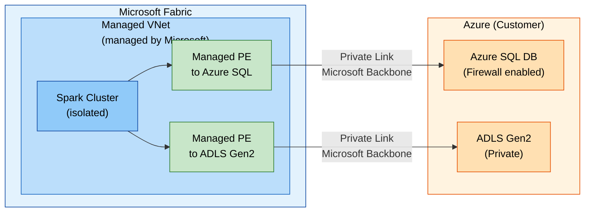

### Managed Virtual Networks

Managed VNets are virtual networks created and managed by Fabric for each workspace. They provide network isolation for Spark workloads.

**Automatically provisioned when:**
1. **Managed Private Endpoints** are added to the workspace
2. The **Private Link** setting is enabled and a Spark job is executed

**Characteristics:**
- Complete Spark cluster isolation (dedicated network)
- No need to size subnets (managed by Fabric)
- **Starter Pools** are disabled (on-demand Custom Pools, 3-5 min startup)
- Not supported in Switzerland West and West Central US regions

### Data Gateways

#### On-Premises Data Gateway

A gateway installed on a server within the corporate network, acting as a bridge between on-premises data sources and Fabric.

| Characteristic | Detail |
|---------------|--------|
| **Installation** | Windows server in the internal network |
| **Protocol** | Secure outbound channel (no inbound port opening) |
| **Sources** | Any source accessible from the gateway server |
| **Management** | Manual (updates, high availability) |

#### VNet Data Gateway

A managed gateway deployed into a customer's Azure VNet, enabling connections to Azure services within the VNet without an on-premises gateway.

| Characteristic | Detail |
|---------------|--------|
| **Deployment** | Injection into an existing Azure VNet |
| **Management** | Managed by Microsoft |
| **Sources** | Azure services in the VNet or peered VNets |
| **Workloads** | Dataflows Gen2, Semantic Models |
| **Enterprise proxy & cert auth** | GA (2026) — supports enterprise proxy servers and certificate-based authentication for corporate network compliance |

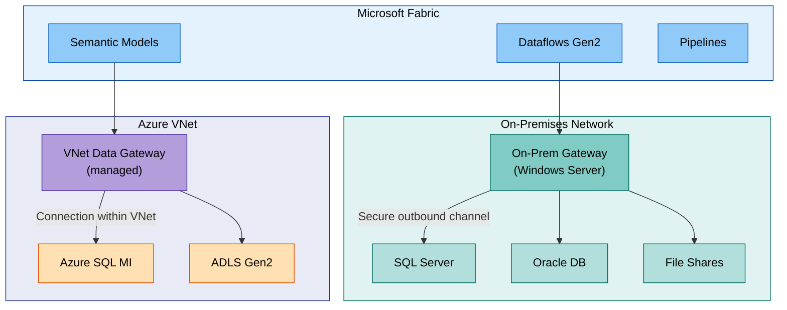

### Eventstream Private Network Support

*Preview — Q1 2026*

Fabric Eventstreams can now ingest data from private networks via a **managed VNet** and a **streaming data gateway**, enabling secure real-time data ingestion without exposing source endpoints to the public internet. This allows organizations to stream events from Azure Event Hubs, IoT Hub, or custom sources within a VNet directly into Fabric, with traffic routed entirely through the Microsoft backbone.

Key points:
- Eventstreams leverage the workspace's managed VNet for network isolation
- A streaming data gateway bridges the private network to the Eventstream ingestion endpoint
- Supports managed private endpoints for source connectivity
- Custom Endpoint as source/destination and Eventhouse direct ingestion remain unsupported

### Service Tags

Azure Service Tags are automatically managed groups of IP addresses, usable in NSGs, Azure Firewall and user-defined routes.

| Tag | Service | Direction | Regional |
|-----|---------|-----------|----------|
| `Power BI` | Power BI and Microsoft Fabric | Inbound/Outbound | Yes |
| `DataFactory` | Azure Data Factory | Inbound/Outbound | Yes |
| `DataFactoryManagement` | On-premises pipeline | Outbound | No |
| `EventHub` | Azure Event Hubs | Outbound | Yes |
| `KustoAnalytics` | Real-Time Analytics | Inbound/Outbound | No |
| `SQL` | Warehouse | Outbound | Yes |
| `PowerQueryOnline` | Power Query Online | Inbound/Outbound | No |

> **Tip:** When using regional tags, add the tag for the tenant's home region **and** the capacity region (if different), as well as the corresponding paired regions.

### Secure Outbound Connectors Matrix

| Connection Method | Supported Sources | Fabric Workloads |
|-------------------|-------------------|-----------------|
| **Trusted Workspace Access** | ADLS Gen2 (firewall) | Shortcuts, Pipelines, COPY INTO, Semantic Models |
| **Managed Private Endpoints** | Azure SQL, ADLS Gen2, Cosmos DB, Key Vault... | Spark Notebooks, Lakehouses, Spark Jobs, Eventstream |
| **VNet Data Gateway** | Azure services in a VNet | Dataflows Gen2, Semantic Models |
| **On-Premises Gateway** | SQL Server, Oracle, files, SAP... | Dataflows Gen2, Semantic Models, Pipelines |
| **Service Tags** | Azure SQL VM, SQL MI, REST APIs | Pipelines, network integration |

## Outbound Protection

### Outbound Access Policies

Outbound Access Policies allow you to **restrict outbound connections** from a Fabric workspace to unauthorized destinations.

**Objective:** Prevent malicious users from exfiltrating data to unapproved destinations.

**Characteristics:**
- **Workspace-level** control
- Destinations are allow-listed via **Managed Private Endpoints** or **Data Connections**
- Any connection to a destination not explicitly allowed is **blocked**

**Status (as of April 2026):**

| Item Type | Status |
|-----------|--------|
| Lakehouse, Spark Notebooks, Spark Jobs | **GA** (since Sept 2025) |
| Dataflows, Pipelines, Copy Jobs, Warehouse, Mirrored DBs | **GA** (since Nov 2025) |
| Power BI, Databases | Planned (roadmap) |

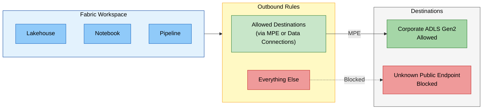

### Data Exfiltration Protection (DEP)

Complete **DEP** is achieved by combining inbound AND outbound protection:

| Component | Role |
|-----------|------|
| **Inbound** (Private Link / IP Firewall / Conditional Access) | Controls **who** can access data and **from where** |
| **Outbound** (Outbound Access Policies) | Prevents authorized users from **exfiltrating** data to unapproved destinations |

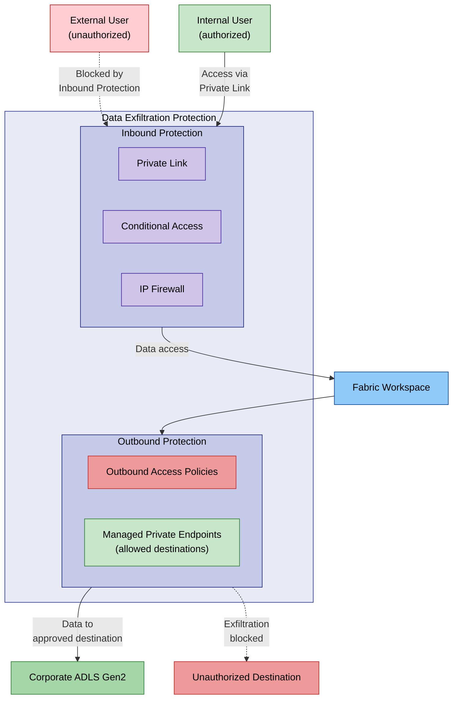

## Data Security

### Encryption

| Type | Mechanism | Detail |
|------|-----------|--------|
| **In transit** | TLS 1.2 / 1.3 | All client-to-Fabric and inter-experience traffic |
| **At rest** | Microsoft-managed keys (default) | Automatic encryption of all data in OneLake |
| **At rest (advanced)** | Customer Managed Keys (CMK) | Second layer of encryption with customer-managed Azure Key Vault keys |
| **Power BI** | BYOK | Bring Your Own Key for Power BI datasets |

### Customer Managed Keys (CMK)

CMK allows organizations to add an **additional encryption layer** with keys they manage themselves in Azure Key Vault.

**Status (as of April 2026):**

| Item Type | Status |
|-----------|--------|
| Lakehouse, Spark Job, Environment, Pipeline, Dataflow, API for GraphQL, ML Model/Experiment | **GA** (since Oct 2025) |
| Data Warehouse | **GA** (since Oct 2025) |
| Databases, Mirrored Experiences, Power BI | Planned (roadmap) |

## Data Residency and Multi-Geo

Microsoft Fabric supports **multi-geo** deployment with capacities spread across **54 data centers** worldwide.

**Characteristics:**
- Workspaces in different regions are still part of the same OneLake data lake
- The query execution layer, caches, and data remain in the Azure geography where they were created
- Some metadata and processing is stored at rest in the tenant's home geography
- **Data Residency compliant** by default

## Compliance and Certifications

Microsoft Fabric supports a wide range of compliance standards:

| Certification | Date |
|--------------|------|
| **ISO 27001, 27701, 27017, 27018** | December 2023 |
| **HIPAA** | January 2024 |
| **Australian IRAP** | February 2024 |
| **SOC 1 & 2 Type 2, SOX, CSA STAR** | May 2024 |
| **HITRUST** | September 2024 |
| **FedRAMP** (Azure Commercial) | November 2024 |
| **PCI DSS** | January 2025 |
| **K-ISMS** | May 2025 |
| **GDPR, EUDB** | Supported |

Fabric is a core **Microsoft Online Service**.

## Decision Guide

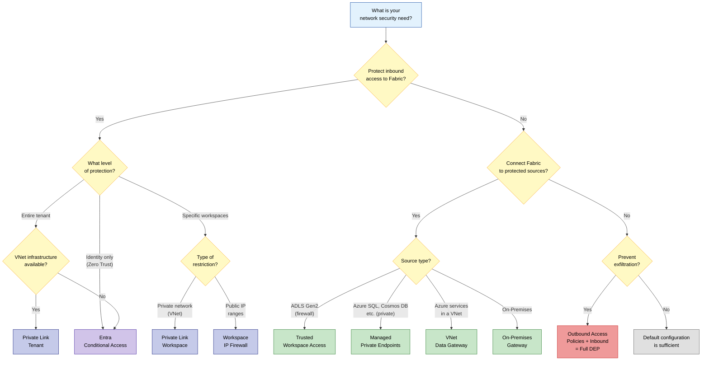

## Feature Summary and Status

*Updated as of April 2026*

| Feature | Level | Direction | Status | Primary Use Case |
|---------|-------|-----------|--------|-----------------|
| **Entra Conditional Access** | Tenant | Inbound | **GA** | Zero Trust, MFA, IP filtering |
| **Private Link Tenant** | Tenant | Inbound | **GA** | Full tenant network isolation |
| **Private Link Workspace** | Workspace | Inbound | **GA** | Granular per-workspace network isolation |
| **Workspace IP Firewall** | Workspace | Inbound | **GA** | IP-based restriction without VNet infrastructure |
| **Trusted Workspace Access** | Workspace | Outbound | **GA** | Firewall-enabled ADLS Gen2 access |
| **Managed Private Endpoints** | Workspace | Outbound | **GA** | Private connection to Azure sources |
| **Managed VNets** | Workspace | Outbound | **GA** | Spark isolation + MPE support |
| **VNet Data Gateway** | Org | Outbound | **GA** | Managed connection to Azure services in VNet; enterprise proxy & cert auth support |
| **On-Premises Gateway** | Org | Outbound | **GA** | Connection to on-premises sources |
| **Service Tags** | NSG/Firewall | Both | **GA** | Azure network rules |
| **Outbound Access Policies** | Workspace | Outbound | **GA** | Data exfiltration prevention |
| **Customer Managed Keys** | Workspace | Data | **GA** | Dual-layer encryption |
| **Eventstream Private Network** | Workspace | Outbound | **Preview** | Secure real-time ingestion from private networks |
| **Power BI Network Isolation** | Workspace | Inbound | **Planned** | WS-level Private Link and IP Firewall for Power BI items |
| **Fabric Databases Network Isolation** | Workspace | Inbound | **Planned** | WS-level Private Link and IP Firewall for Fabric databases |

## References

- [Security overview - Microsoft Fabric](https://learn.microsoft.com/en-us/fabric/security/security-overview)
- [Private Links overview](https://learn.microsoft.com/en-us/fabric/security/security-private-links-overview)
- [Workspace-level Private Links](https://learn.microsoft.com/en-us/fabric/security/security-workspace-level-private-links-overview)
- [Managed VNets overview](https://learn.microsoft.com/en-us/fabric/security/security-managed-vnets-fabric-overview)
- [Managed Private Endpoints](https://learn.microsoft.com/en-us/fabric/security/security-managed-private-endpoints-overview)
- [Trusted Workspace Access](https://learn.microsoft.com/en-us/fabric/security/security-trusted-workspace-access)
- [Protect Inbound Traffic](https://learn.microsoft.com/en-us/fabric/security/protect-inbound-traffic)
- [Conditional Access in Fabric](https://learn.microsoft.com/en-us/fabric/security/security-conditional-access)
- [Service Tags](https://learn.microsoft.com/en-us/fabric/security/security-service-tags)
- [Fabric Security Whitepaper](https://aka.ms/FabricSecurityWhitepaper)
- *End-to-end network security in Microsoft Fabric* -- Arthi Ramasubramanian Iyer & Rick Xu, FabCon 2025
