# Configurations Réseau dans Microsoft Fabric

## Vue d'ensemble

Microsoft Fabric est une plateforme SaaS unifiée pour l'analytique et l'IA, regroupant Data Factory, Data Engineering, Data Science, Data Warehousing, Real-Time Intelligence et Power BI autour d'un data lake unique : **OneLake**.

La sécurité réseau dans Fabric s'articule autour de trois axes fondamentaux :

| Axe | Objectif | Fonctionnalités clés |
|-----|----------|---------------------|
| **Protection Inbound** | Contrôler qui accède à Fabric | Conditional Access, Private Links (tenant/workspace), IP Firewall |
| **Accès Outbound sécurisé** | Connecter Fabric à des sources protégées | Trusted Workspace Access, Managed Private Endpoints, VNet/On-prem Gateways |
| **Protection Outbound** | Empêcher l'exfiltration de données | Outbound Access Policies, règles de destinations autorisées |

La combinaison **Inbound + Outbound Protection** constitue la **Data Exfiltration Protection (DEP)** complète.

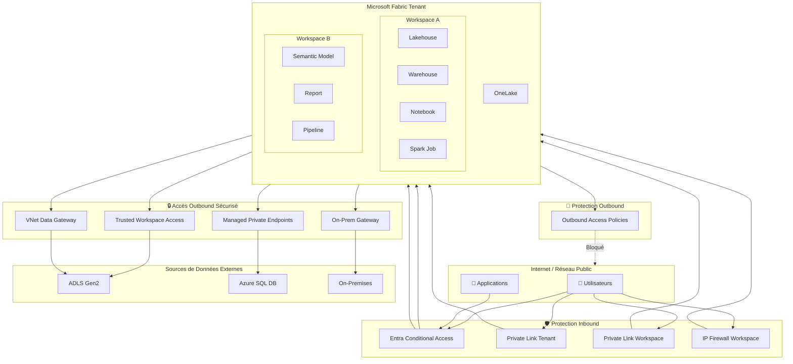

## Sécurité par défaut

Microsoft Fabric est **sécurisé par défaut** sans aucune configuration supplémentaire :

- **Authentification** : Toute interaction est authentifiée via **Microsoft Entra ID**
- **Chiffrement en transit** : Tout le trafic est chiffré via **TLS 1.2** minimum (négociation TLS 1.3 quand disponible)
- **Chiffrement au repos** : Toutes les données dans OneLake sont chiffrées automatiquement
- **Réseau backbone Microsoft** : Les communications internes entre les expériences Fabric transitent par le réseau privé Microsoft, jamais par l'internet public
- **Endpoints sécurisés** : Le backend Fabric est protégé par un réseau virtuel et n'est pas directement accessible depuis l'internet public

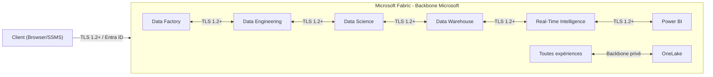

## Protection Inbound

La protection inbound contrôle le trafic entrant vers Fabric depuis l'internet ou les réseaux d'entreprise.

### Entra Conditional Access

L'accès conditionnel Microsoft Entra ID est l'approche **Zero Trust** pour sécuriser l'accès à Fabric. Les décisions d'accès sont prises au moment de l'authentification en évaluant des signaux contextuels.

**Signaux évalués :**

| Signal | Exemples de politiques |
|--------|----------------------|
| Utilisateurs et groupes | Cibler des populations spécifiques |
| Localisation / IP | Autoriser uniquement certaines plages IP ou pays |
| Appareils | Exiger des appareils conformes (Intune) |
| Applications | Appliquer des règles par application Fabric |
| Risque de connexion | Bloquer les connexions à risque élevé |

**Décisions possibles :** Bloquer, Autoriser, Exiger MFA, Exiger un appareil conforme.

**Prérequis :** Licence Microsoft Entra ID P1 (souvent incluse dans Microsoft 365 E3/E5).

> **Note :** Les politiques Conditional Access s'appliquent à Fabric et aux services Azure associés (Power BI, Azure Data Explorer, Azure SQL Database, Azure Storage). Cela peut être considéré comme trop large pour certains scénarios.

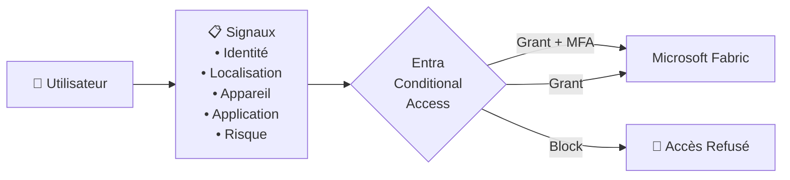

### Private Link au niveau Tenant

Le Private Link au niveau du tenant fournit une **protection périmétrique** pour l'ensemble du tenant Fabric.

**Principe :** Un Azure Private Endpoint est créé dans le VNet du client, établissant un tunnel privé vers Fabric via le backbone Microsoft. Fabric devient inaccessible depuis l'internet public.

**Deux paramètres clés :**

| Paramètre | Effet |
|-----------|-------|
| **Azure Private Links** (activé) | Le trafic depuis le VNet vers les endpoints supportés passe par le Private Link |
| **Block Public Internet Access** (activé) | Fabric n'est plus accessible depuis l'internet public ; seul le Private Link est autorisé |

**Scénarios de configuration :**

| Private Link | Block Public Access | Comportement |
|:---:|:---:|---|
| ✅ | ✅ | Accès uniquement via Private Endpoint. Endpoints non supportés bloqués. |
| ✅ | ❌ | Trafic VNet via Private Link. Trafic internet public autorisé. |
| ❌ | - | Accès standard via internet public. |

**Considérations :**

- **Tous les utilisateurs** doivent se connecter au réseau privé (VPN, ExpressRoute)
- Impact sur la **bande passante** : les ressources statiques (CSS, images) transitent aussi par le Private Endpoint
- Certaines fonctionnalités ont des **limitations** (Publish to Web désactivé, Copilot non supporté, export PDF/PowerPoint Power BI désactivé)
- Les **Starter Pools Spark** sont désactivés (remplacés par des custom pools dans le VNet managé)

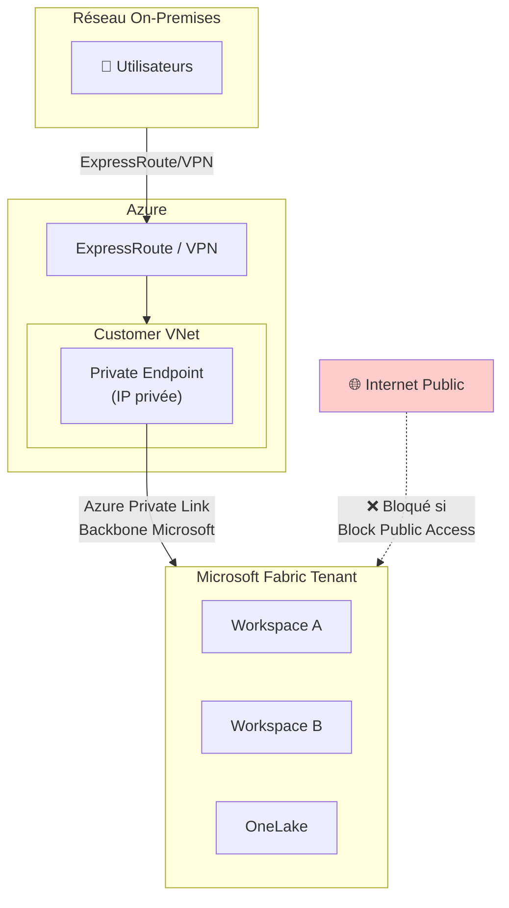

### Private Link au niveau Workspace

Le Private Link workspace offre un contrôle **granulaire** : certains workspaces sont protégés par Private Link tandis que d'autres restent accessibles publiquement.

**Caractéristiques clés :**

- Relation **1:1** entre un workspace et son Private Link Service
- Un Private Link Service peut avoir **plusieurs Private Endpoints** (depuis différents VNets)
- Un VNet peut se connecter à **plusieurs workspaces** via des Private Endpoints distincts
- L'accès public peut être restreint **indépendamment** par workspace
- Les workspaces publics peuvent être protégés par Entra Conditional Access ou IP Filtering

**Items supportés (Public Preview août 2025, GA septembre 2025) :**
Lakehouse, Shortcut, Notebook, ML Experiment/Model, Pipeline, Warehouse, Dataflows, Eventstream, Mirrored DB

**Roadmap :** Support Power BI, Databases, Data Activator et plus.

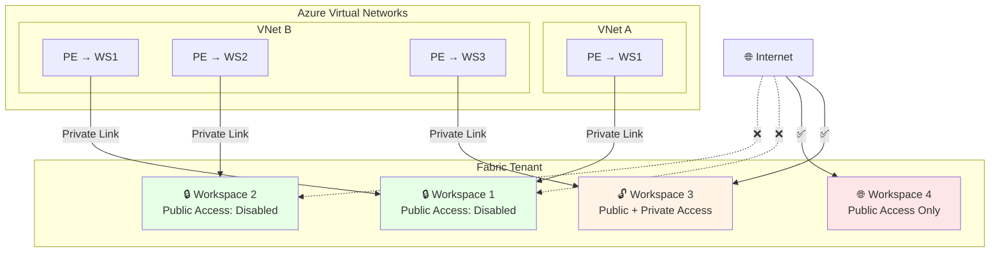

> **Différence clé avec le Private Link Tenant :** Le Private Link Workspace permet de protéger uniquement les workspaces sensibles sans impacter l'ensemble du tenant. C'est l'approche recommandée pour les organisations qui ne peuvent pas forcer tous les utilisateurs sur un réseau privé.

### Workspace IP Firewall

Le pare-feu IP workspace est la solution la plus simple pour restreindre l'accès à un workspace depuis des plages IP publiques spécifiques.

**Principe :** Seules les adresses IP ou plages IP explicitement autorisées peuvent accéder au workspace. Aucune infrastructure réseau Azure n'est requise.

**Items supportés (Public Preview octobre 2025, GA Q1 2026) :**
Lakehouse, Shortcut, Notebook, ML Experiment/Model, Pipeline, Warehouse, Dataflows, Eventstream, Mirrored DB

**Roadmap :** Support Power BI, Databases, Data Activator.

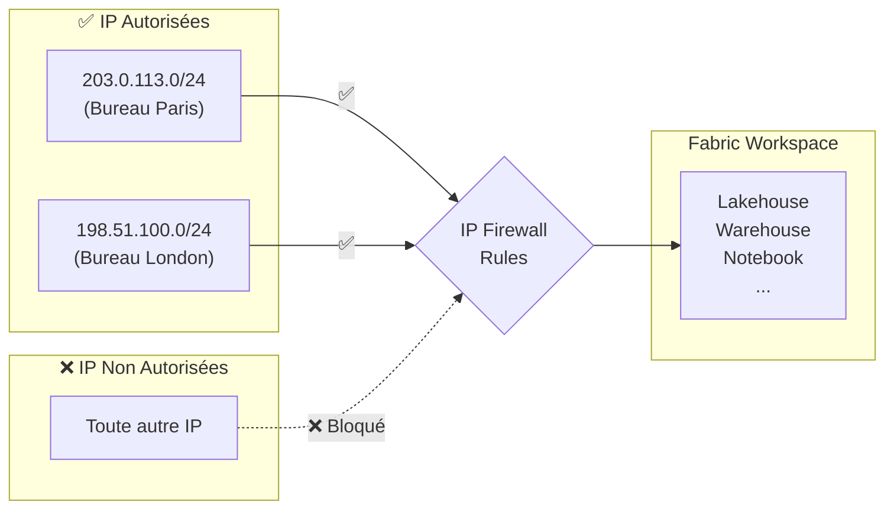

### Comparaison des options Inbound

| Critère | Conditional Access | Private Link Tenant | Private Link Workspace | IP Firewall |
|---------|:-:|:-:|:-:|:-:|
| **Granularité** | Tenant (par politique) | Tenant | Workspace | Workspace |
| **Infrastructure Azure requise** | Non | VNet + PE | VNet + PE par WS | Non |
| **Complexité** | Faible | Élevée | Moyenne | Faible |
| **Approche** | Zero Trust (identité) | Périmétrique (réseau) | Périmétrique (réseau) | IP-based |
| **Impact utilisateurs** | Transparent (MFA) | VPN/ER obligatoire | VPN/ER pour WS protégés | Aucun si IP autorisée |
| **Coût additionnel** | Entra ID P1 | VNet + PE + ER/VPN | VNet + PE | Aucun |
| **Statut** | GA | GA | GA (sept 2025) | GA (Q1 2026) |

## Accès Outbound Sécurisé

L'accès outbound sécurisé permet à Fabric de se connecter à des sources de données protégées par des firewalls ou des réseaux privés.

### Trusted Workspace Access

Le Trusted Workspace Access permet à des workspaces Fabric spécifiques d'accéder à des comptes **ADLS Gen2 protégés par firewall** de manière sécurisée.

**Principe :** Le workspace Fabric dispose d'une **identité de workspace** (managed identity). Des **Resource Instance Rules** sont configurées sur le compte de stockage pour autoriser uniquement les workspaces spécifiés.

**Prérequis :**
- Workspace associé à une capacité **Fabric F SKU** (non supporté en Trial)
- **Workspace Identity** créée et configurée comme Contributor
- Principal d'authentification avec rôle Azure RBAC sur le compte de stockage (Storage Blob Data Contributor/Owner/Reader)
- Resource Instance Rule configurée via **ARM Template** ou **PowerShell**

**Scénarios supportés :**

| Méthode | Description |
|---------|-------------|
| **OneLake Shortcut** | Shortcut ADLS Gen2 dans un Lakehouse |
| **Pipeline** | Copie de données depuis ADLS Gen2 firewall-enabled |
| **T-SQL COPY INTO** | Ingestion dans un Warehouse |
| **Semantic Model** (import) | Modèle connecté à ADLS Gen2 |
| **AzCopy** | Chargement performant vers OneLake |

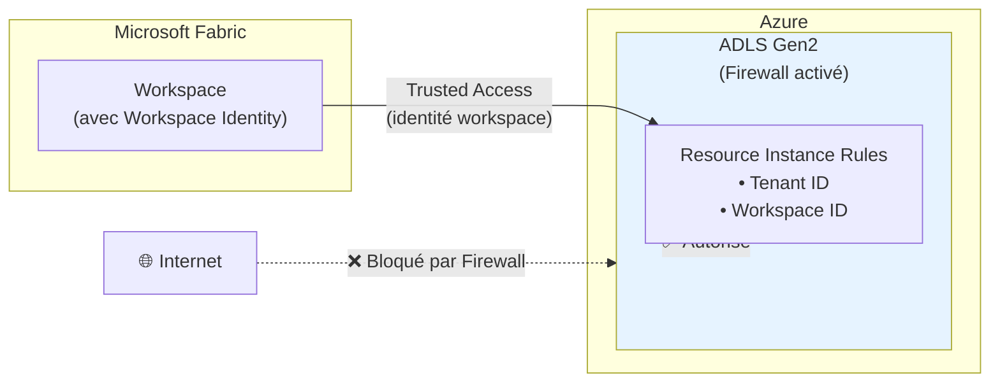

### Managed Private Endpoints

Les Managed Private Endpoints permettent des connexions sécurisées et privées vers des sources de données Azure depuis les workloads Fabric, sans les exposer au réseau public.

**Principe :** Microsoft Fabric crée et gère des Private Endpoints dans un **VNet managé** dédié au workspace. Les administrateurs de workspace spécifient le resource ID de la source, le sous-resource cible, et une justification.

**Sources supportées :** Azure Storage, Azure SQL Database, Azure Cosmos DB, Azure Key Vault, et bien d'autres.

**Items supportés :**
- Data Engineering (Notebooks Spark/Python, Lakehouses, Spark Job Definitions)
- Eventstream (Preview)

**Prérequis :**
- Supporté sur Fabric Trial et toutes les capacités F SKU
- Le workload Data Engineering doit être disponible dans la région du tenant ET de la capacité

**Limitations :**
- Les OneLake shortcuts ne supportent pas encore les connexions ADLS Gen2 / Blob Storage via MPE
- Migration de workspace inter-régions non supportée
- Création via FQDN (Private Link Service) uniquement via REST API

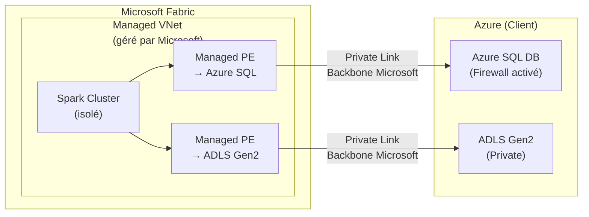

### Managed Virtual Networks

Les VNets managés sont des réseaux virtuels créés et gérés par Fabric pour chaque workspace. Ils fournissent l'isolation réseau pour les workloads Spark.

**Activation automatique quand :**
1. Des **Managed Private Endpoints** sont ajoutés au workspace
2. Le paramètre **Private Link** est activé et un job Spark est exécuté

**Caractéristiques :**
- Isolation complète des clusters Spark (réseau dédié)
- Pas besoin de dimensionner les subnets (géré par Fabric)
- Les **Starter Pools** sont désactivés (clusters Custom Pools on-demand, démarrage 3-5 min)
- Non supporté dans les régions Switzerland West et West Central US

### Data Gateways

#### On-Premises Data Gateway

Passerelle installée sur un serveur dans le réseau d'entreprise, servant de pont entre les sources on-premises et Fabric.

| Caractéristique | Détail |
|----------------|--------|
| **Installation** | Serveur Windows dans le réseau interne |
| **Protocole** | Canal sécurisé sortant (pas d'ouverture de ports entrants) |
| **Sources** | Toute source accessible depuis le serveur gateway |
| **Gestion** | Manuelle (mises à jour, haute disponibilité) |

#### VNet Data Gateway

Passerelle managée déployée dans un VNet Azure du client, permettant de se connecter aux services Azure dans le VNet sans gateway on-premises.

| Caractéristique | Détail |
|----------------|--------|
| **Déploiement** | Injection dans un VNet Azure existant |
| **Gestion** | Managée par Microsoft |
| **Sources** | Services Azure dans le VNet ou peered VNets |
| **Utilisations** | Dataflows Gen2, Semantic Models |

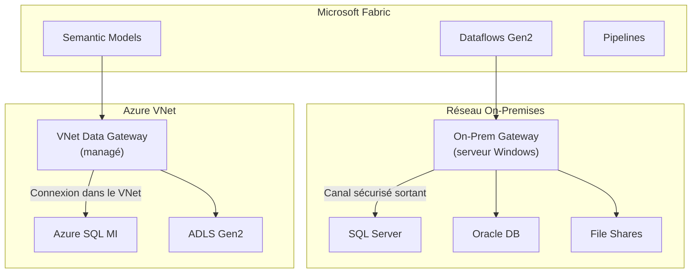

### Service Tags

Les Service Tags Azure sont des groupes d'adresses IP gérés automatiquement, utilisables dans les NSG, Azure Firewall et routes définies par l'utilisateur.

| Tag | Service | Direction | Régional |
|-----|---------|-----------|----------|
| `Power BI` | Power BI et Microsoft Fabric | Inbound/Outbound | Oui |
| `DataFactory` | Azure Data Factory | Inbound/Outbound | Oui |
| `DataFactoryManagement` | Pipeline on-premises | Outbound | Non |
| `EventHub` | Azure Event Hubs | Outbound | Oui |
| `KustoAnalytics` | Real-Time Analytics | Inbound/Outbound | Non |
| `SQL` | Warehouse | Outbound | Oui |
| `PowerQueryOnline` | Power Query Online | Inbound/Outbound | Non |

> **Conseil :** Lors de l'utilisation de tags régionaux, ajoutez le tag de la région home du tenant **et** de la région de la capacité (si différente), ainsi que les régions paired correspondantes.

### Matrice des connecteurs Outbound sécurisés

| Méthode de connexion | Sources supportées | Workloads Fabric |
|---------------------|-------------------|-----------------|
| **Trusted Workspace Access** | ADLS Gen2 (firewall) | Shortcuts, Pipelines, COPY INTO, Semantic Models |
| **Managed Private Endpoints** | Azure SQL, ADLS Gen2, Cosmos DB, Key Vault... | Spark Notebooks, Lakehouses, Spark Jobs, Eventstream |
| **VNet Data Gateway** | Services Azure dans un VNet | Dataflows Gen2, Semantic Models |
| **On-Premises Gateway** | SQL Server, Oracle, fichiers, SAP... | Dataflows Gen2, Semantic Models, Pipelines |
| **Service Tags** | Azure SQL VM, SQL MI, REST APIs | Pipelines, intégration réseau |

## Protection Outbound

### Outbound Access Policies

Les Outbound Access Policies permettent de **restreindre les connexions sortantes** d'un workspace Fabric vers des destinations non autorisées.

**Objectif :** Empêcher les utilisateurs malveillants d'exfiltrer des données vers des destinations non approuvées.

**Caractéristiques :**
- Contrôle au **niveau workspace**
- Les destinations sont autorisées via des **Managed Private Endpoints** ou des **Data Connections**
- Toute connexion vers une destination non explicitement autorisée est **bloquée**

**Disponibilité :**

| Item Type | Public Preview | GA |
|-----------|:-:|:-:|
| Lakehouse, Spark Notebooks, Spark Jobs | Sept 2025 | Sept 2025 |
| Dataflows, Pipelines, Copy Jobs, Warehouse, Mirrored DBs | Oct 2025 | Nov 2025 |
| Power BI, Databases | Roadmap | Roadmap |

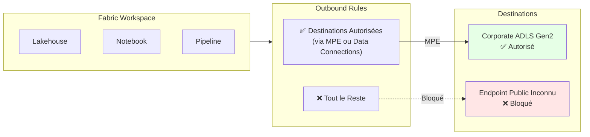

### Data Exfiltration Protection (DEP)

La **DEP complète** est obtenue en combinant la protection inbound ET outbound :

| Composante | Rôle |
|-----------|------|
| **Inbound** (Private Link / IP Firewall / Conditional Access) | Contrôle **qui** peut accéder aux données et **depuis où** |
| **Outbound** (Outbound Access Policies) | Empêche les utilisateurs autorisés d'**exfiltrer** les données vers des destinations non approuvées |

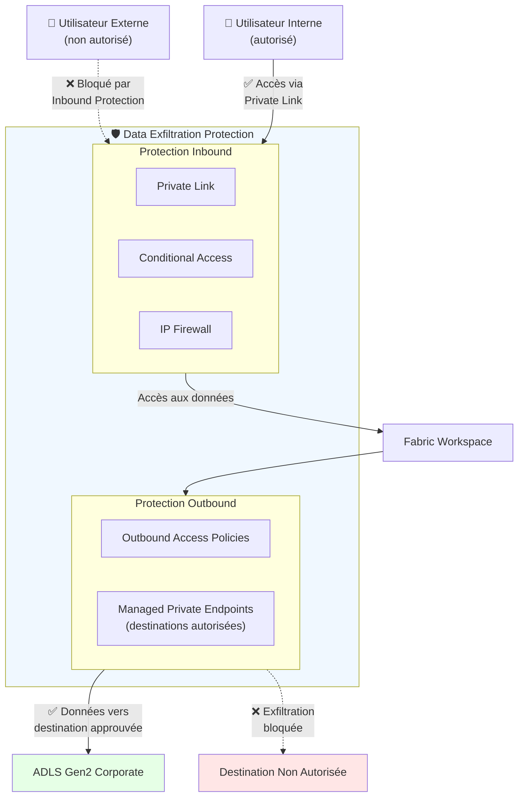

## Sécurité des Données

### Chiffrement

| Type | Mécanisme | Détail |
|------|-----------|--------|
| **En transit** | TLS 1.2 / 1.3 | Tout le trafic client-Fabric et inter-expériences |
| **Au repos** | Clés Microsoft (défaut) | Chiffrement automatique de toutes les données dans OneLake |
| **Au repos (avancé)** | Customer Managed Keys (CMK) | Second layer de chiffrement avec des clés Azure Key Vault gérées par le client |
| **Power BI** | BYOK | Bring Your Own Key pour les datasets Power BI |

### Customer Managed Keys (CMK)

Les CMK permettent aux organisations d'ajouter une **couche de chiffrement supplémentaire** avec des clés qu'elles gèrent elles-mêmes dans Azure Key Vault.

**Disponibilité :**

| Item Type | Public Preview | GA |
|-----------|:-:|:-:|
| Lakehouse, Spark Job, Environment, Pipeline, Dataflow, API for GraphQL, ML Model/Experiment | Août 2025 | Oct 2025 |
| Data Warehouse | Sept 2025 | Oct 2025 |
| Databases, Mirrored Experiences, Power BI | Roadmap | Roadmap |

## Résidences des Données et Multi-Geo

Microsoft Fabric supporte le déploiement **multi-géo** avec des capacités réparties sur **54 data centers** à travers le monde.

**Caractéristiques :**
- Les workspaces dans différentes régions font toujours partie du même data lake OneLake
- La couche d'exécution des requêtes, les caches et les données restent dans la géographie Azure de création
- Certaines métadonnées et traitements sont stockés dans la géographie home du tenant
- **Conformité Data Residency** par défaut

## Conformité et Certifications

Microsoft Fabric supporte un large éventail de standards de conformité :

| Certification | Date |
|--------------|------|
| **ISO 27001, 27701, 27017, 27018** | Décembre 2023 |
| **HIPAA** | Janvier 2024 |
| **Australian IRAP** | Février 2024 |
| **SOC 1 & 2 Type 2, SOX, CSA STAR** | Mai 2024 |
| **HITRUST** | Septembre 2024 |
| **FedRAMP** (Azure Commercial) | Novembre 2024 |
| **PCI DSS** | Janvier 2025 |
| **K-ISMS** | Mai 2025 |
| **GDPR, EUDB** | Supporté |

Fabric est un **Microsoft Online Service** de base.

## Guide de Décision

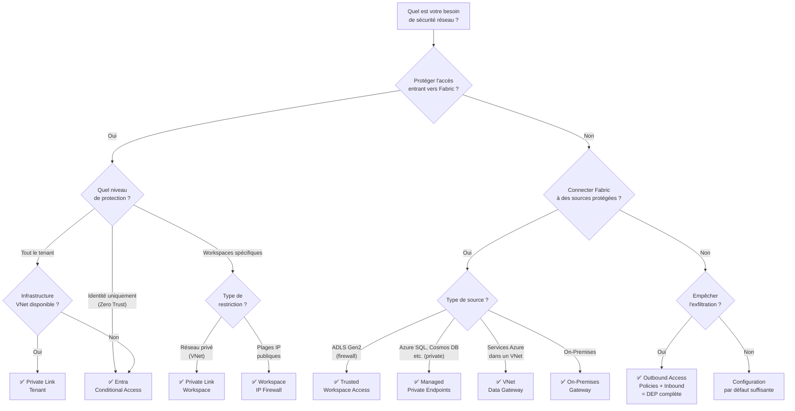

## Résumé des Fonctionnalités et Statut

| Fonctionnalité | Niveau | Direction | Statut | Cas d'usage principal |
|---------------|--------|-----------|--------|----------------------|
| **Entra Conditional Access** | Tenant | Inbound | GA | Zero Trust, MFA, IP filtering |
| **Private Link Tenant** | Tenant | Inbound | GA | Isolation réseau complète du tenant |
| **Private Link Workspace** | Workspace | Inbound | GA (Sept 2025) | Isolation réseau granulaire par workspace |
| **Workspace IP Firewall** | Workspace | Inbound | GA (Q1 2026) | Restriction par IP sans infrastructure VNet |
| **Trusted Workspace Access** | Workspace | Outbound | GA | Accès ADLS Gen2 firewall-enabled |
| **Managed Private Endpoints** | Workspace | Outbound | GA | Connexion privée aux sources Azure |
| **Managed VNets** | Workspace | Outbound | GA | Isolation Spark + support MPE |
| **VNet Data Gateway** | Org | Outbound | GA | Connexion managée aux services Azure dans VNet |
| **On-Premises Gateway** | Org | Outbound | GA | Connexion aux sources on-premises |
| **Service Tags** | NSG/Firewall | Both | GA | Règles réseau Azure |
| **Outbound Access Policies** | Workspace | Outbound | GA (Sept-Nov 2025) | Anti-exfiltration de données |
| **Customer Managed Keys** | Workspace | Data | GA (Oct 2025) | Chiffrement double couche |

## Références

- [Security overview - Microsoft Fabric](https://learn.microsoft.com/en-us/fabric/security/security-overview)
- [Private Links overview](https://learn.microsoft.com/en-us/fabric/security/security-private-links-overview)
- [Workspace-level Private Links](https://learn.microsoft.com/en-us/fabric/security/security-workspace-level-private-links-overview)
- [Managed VNets overview](https://learn.microsoft.com/en-us/fabric/security/security-managed-vnets-fabric-overview)
- [Managed Private Endpoints](https://learn.microsoft.com/en-us/fabric/security/security-managed-private-endpoints-overview)
- [Trusted Workspace Access](https://learn.microsoft.com/en-us/fabric/security/security-trusted-workspace-access)
- [Protect Inbound Traffic](https://learn.microsoft.com/en-us/fabric/security/protect-inbound-traffic)
- [Conditional Access in Fabric](https://learn.microsoft.com/en-us/fabric/security/security-conditional-access)
- [Service Tags](https://learn.microsoft.com/en-us/fabric/security/security-service-tags)
- [Fabric Security Whitepaper](https://aka.ms/FabricSecurityWhitepaper)
- *End-to-end network security in Microsoft Fabric* -- Arthi Ramasubramanian Iyer & Rick Xu, FabCon 2025
