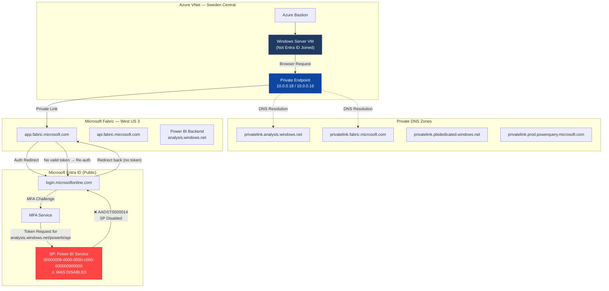
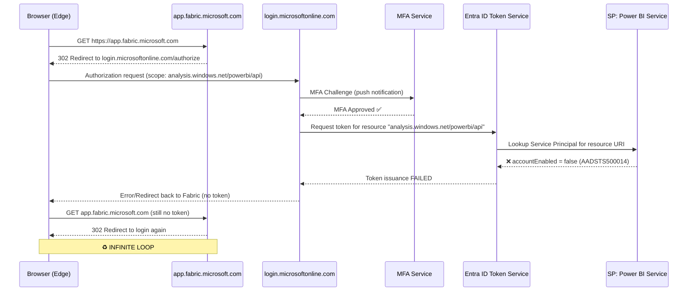
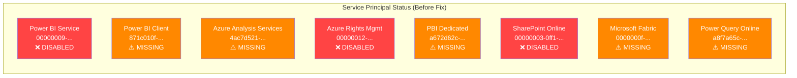
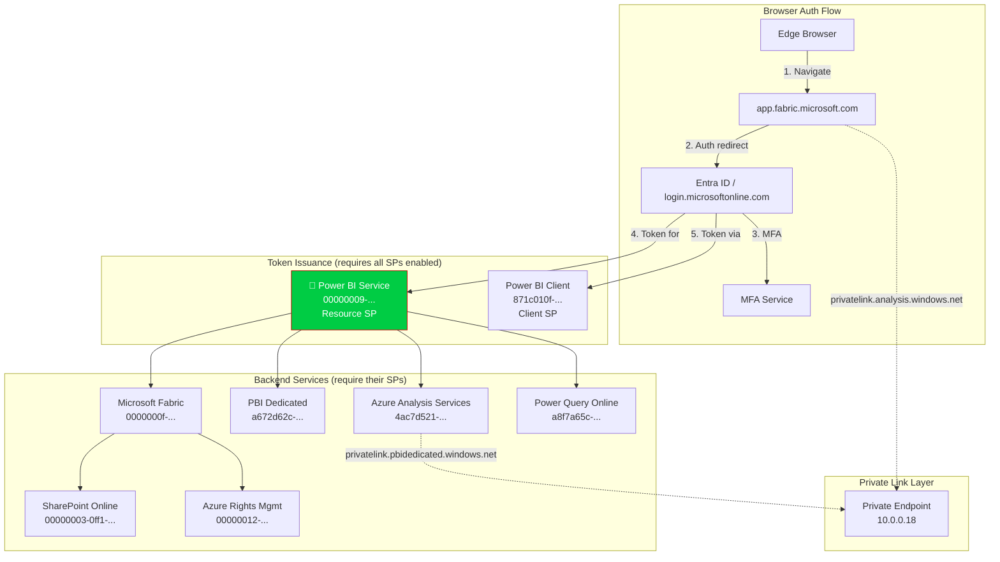

## Summary

| Item | Detail |
|------|--------|
| **Environment** | Microsoft Fabric with Azure Private Link (tenant-level) |
| **Region** | VNet: Sweden Central · Fabric Capacity: West US 3 |
| **Symptom** | Infinite MFA loop on `app.fabric.microsoft.com` via Bastion VM |
| **Root Cause** | Service Principal `Power BI Service` (`00000009-0000-0000-c000-000000000000`) was **disabled** |
| **Additional Issues** | Multiple critical Service Principals missing or disabled |
| **Resolution** | Re-enabled SP via Microsoft Graph API |
| **Date** | March 13, 2026 |

---

## 🔁 Problem Description

After configuring Azure Private Link for Microsoft Fabric following [Microsoft's documentation](https://learn.microsoft.com/en-us/fabric/security/security-private-links-use), accessing `app.fabric.microsoft.com` from a Bastion VM inside the private VNet resulted in an **infinite MFA authentication loop**.

### Observed Behavior

1. User navigates to `https://app.fabric.microsoft.com`
2. Redirect to `login.microsoftonline.com` → MFA challenge presented
3. MFA completed successfully (push notification approved)
4. Redirect back to Fabric → **immediately redirected back to login**
5. Steps 2-4 repeat indefinitely

### What Worked vs. What Didn't

| Test | Result |
|------|--------|
| `nslookup app.fabric.microsoft.com` | ✅ Resolves to private IP `10.0.0.18` |
| `Invoke-WebRequest https://app.fabric.microsoft.com` (PowerShell) | ✅ HTTP 200 OK |
| `login.microsoftonline.com` (browser) | ✅ MFA works, login succeeds |
| `app.fabric.microsoft.com` (browser) | ❌ MFA infinite loop |
| `app.powerbi.com/admin-portal` (browser) | ❌ Same MFA loop |
| Device code flow for Graph API | ✅ Works |
| Device code flow for Power BI API | ❌ `AADSTS500014` — SP disabled |

---

## 🏗️ Architecture



---

## 🔍 Authentication Flow — The Loop Explained



---

## 🔎 Diagnosis Steps Performed

### 1. DNS Verification ✅

All Fabric endpoints correctly resolved to private IPs:

```
app.fabric.microsoft.com    → 10.0.0.18 (privatelink.analysis.windows.net)
api.fabric.microsoft.com    → 10.0.0.16 (privatelink.analysis.windows.net)
app.powerbi.com             → 10.0.0.18
login.microsoftonline.com   → 40.126.53.x (public — correct)
```

### 2. Network Connectivity ✅

```powershell
# PowerShell returned 200 OK — network path is fine
Invoke-WebRequest -Uri "https://app.fabric.microsoft.com" -UseBasicParsing
# StatusCode: 200
```

### 3. Device Registration

```powershell
dsregcmd /status
# AzureAdJoined: NO
# DomainJoined: NO
# WorkplaceJoined: YES (added during troubleshooting)
```

### 4. Browser Network Trace 🔑

DevTools showed `reprocess` and `BeginAuth` → `sessionapproval` → `authorize` cycling in an infinite loop. Error code **500121** initially, then silent loop after cookie clearing.

### 5. Token Acquisition Test 🎯

```powershell
# Device code flow for Power BI API resource:
# AADSTS500014: The service principal for resource
# 'https://analysis.windows.net/powerbi/api' is disabled.
```

**This confirmed the root cause.**

### 6. Service Principal Audit



---

## ✅ Resolution

### Step 1 — Obtain Microsoft Graph Token

```powershell
# Device code flow (works even when browser auth is broken)
$body = @{
    client_id = "14d82eec-204b-4c2f-b7e8-296a70dab67e"
    scope     = "https://graph.microsoft.com/Application.ReadWrite.All offline_access"
}
$dc = Invoke-RestMethod -Method POST `
    -Uri "https://login.microsoftonline.com/organizations/oauth2/v2.0/devicecode" `
    -Body $body
# Complete MFA at https://login.microsoft.com/device

$tokenBody = @{
    client_id   = "14d82eec-204b-4c2f-b7e8-296a70dab67e"
    grant_type  = "urn:ietf:params:oauth:grant-type:device_code"
    device_code = $dc.device_code
}
$token = Invoke-RestMethod -Method POST `
    -Uri "https://login.microsoftonline.com/organizations/oauth2/v2.0/token" `
    -Body $tokenBody
$headers = @{
    Authorization  = "Bearer $($token.access_token)"
    "Content-Type" = "application/json"
}
```

### Step 2 — Re-enable Power BI Service SP (Critical Fix)

```powershell
# Find the disabled SP
$sp = Invoke-RestMethod `
    -Uri "https://graph.microsoft.com/v1.0/servicePrincipals?`$filter=appId eq '00000009-0000-0000-c000-000000000000'" `
    -Headers $headers
# accountEnabled was FALSE

# Re-enable it
Invoke-RestMethod -Method PATCH `
    -Uri "https://graph.microsoft.com/v1.0/servicePrincipals/$($sp.value[0].id)" `
    -Headers $headers `
    -Body '{"accountEnabled":true}'
```

### Step 3 — Recreate Missing SPs

```powershell
# Service Principals that were missing and needed to be created:
$missingApps = @(
    "871c010f-5e61-4fb1-83ac-98610a7e9110",  # Power BI Client
    "4ac7d521-0382-477b-b0f8-7e1d95f85ca2",  # Azure Analysis Services
    "a672d62c-fc7b-4e81-a576-e60dc46e951d",  # PBI Dedicated
    "0000000f-0000-0000-c000-000000000000",  # Microsoft Fabric
    "a8f7a65c-f5ba-4859-b2d6-df772c264e9d",  # Power Query Online
    "7f98cb04-cd1e-40df-9140-3bf7e2cea4db"   # Fabric/PBI Gateway
)
foreach ($appId in $missingApps) {
    $b = "{`"appId`":`"$appId`"}"
    Invoke-RestMethod -Method POST `
        -Uri "https://graph.microsoft.com/v1.0/servicePrincipals" `
        -Headers $headers -Body $b
}
```

### Step 4 — Re-enable Other Disabled SPs

```powershell
# Azure Rights Management & SharePoint Online were disabled
@("00000012-0000-0000-c000-000000000000","00000003-0000-0ff1-ce00-000000000000") | ForEach-Object {
    $sp = Invoke-RestMethod `
        -Uri "https://graph.microsoft.com/v1.0/servicePrincipals?`$filter=appId eq '$_'" `
        -Headers $headers
    Invoke-RestMethod -Method PATCH `
        -Uri "https://graph.microsoft.com/v1.0/servicePrincipals/$($sp.value[0].id)" `
        -Headers $headers -Body '{"accountEnabled":true}'
}
```

### Step 5 — Verify & Test

```powershell
# Clear browser cache, restart Edge, navigate to:
# https://app.fabric.microsoft.com
# ✅ MFA completes, Fabric portal loads
```

---

## 🛡️ Validation Script

Run this periodically to ensure all critical SPs remain enabled:

```powershell
# Fabric Private Link Health Check
$apps = @(
    @{id="00000009-0000-0000-c000-000000000000"; name="Power BI Service (Resource)"},
    @{id="871c010f-5e61-4fb1-83ac-98610a7e9110"; name="Power BI Client"},
    @{id="00000003-0000-0ff1-ce00-000000000000"; name="SharePoint Online"},
    @{id="00000012-0000-0000-c000-000000000000"; name="Azure Rights Mgmt"},
    @{id="4ac7d521-0382-477b-b0f8-7e1d95f85ca2"; name="Azure Analysis Services"},
    @{id="0000000f-0000-0000-c000-000000000000"; name="Microsoft Fabric"},
    @{id="a672d62c-fc7b-4e81-a576-e60dc46e951d"; name="PBI Dedicated"}
)
foreach ($app in $apps) {
    $sp = Invoke-RestMethod `
        -Uri "https://graph.microsoft.com/v1.0/servicePrincipals?`$filter=appId eq '$($app.id)'" `
        -Headers $headers
    $status = if ($sp.value.Count -eq 0) { "⚠️ MISSING" }
              elseif ($sp.value[0].accountEnabled) { "✅ ENABLED" }
              else { "❌ DISABLED" }
    Write-Host "$($app.name): $status"
}

# DNS Resolution Check
$endpoints = @(
    "app.fabric.microsoft.com",
    "api.fabric.microsoft.com",
    "app.powerbi.com",
    "onelake.dfs.fabric.microsoft.com"
)
foreach ($ep in $endpoints) {
    $r = Resolve-DnsName $ep -ErrorAction SilentlyContinue | Where-Object { $_.IP4Address }
    $ip = $r.IP4Address | Select-Object -First 1
    $priv = if ($ip -match "^10\.") { "✅ PRIVATE" } else { "⚠️ PUBLIC" }
    Write-Host "${ep}: $ip $priv"
}
```

---

## 📊 Service Principal Dependency Map



---

## ⚠️ Key Lessons

1. **The MFA loop is misleading** — the real error (`AADSTS500014`) is hidden because the browser handles the redirect silently. Always test token acquisition via PowerShell device code flow to get the real error.

2. **`00000009-0000-0000-c000-000000000000` is THE critical SP** — this is the Power BI Service *resource* SP that owns `https://analysis.windows.net/powerbi/api`. Without it, no Fabric token can be issued.

3. **Don't confuse the two Power BI SPs**:
   - `00000009-...` = **Power BI Service** (resource/API) — owns `analysis.windows.net/powerbi/api`
   - `871c010f-...` = **Microsoft Power BI** (client app) — the portal application

4. **Private Link works at the network layer** — it doesn't affect authentication. If auth is broken, the problem is in Entra ID (SPs, Conditional Access), not in DNS or Private Endpoints.

5. **Device code flow is your escape hatch** — when browser auth is broken, `https://login.microsoft.com/device` + Graph API lets you diagnose and fix from the same locked-down environment.

---

## 📎 References

- [Set up and use tenant-level private links — Microsoft Fabric](https://learn.microsoft.com/en-us/fabric/security/security-private-links-use)
- [About private links for Fabric](https://learn.microsoft.com/en-us/fabric/security/security-private-links-overview)
- [Fabric URL allowlist](https://learn.microsoft.com/en-us/fabric/security/fabric-allow-list-urls)
- [Conditional Access for Fabric](https://learn.microsoft.com/en-us/fabric/security/security-conditional-access)
- [AADSTS error codes](https://learn.microsoft.com/en-us/entra/identity-platform/reference-error-codes)
- [Microsoft Graph — Service Principals API](https://learn.microsoft.com/en-us/graph/api/resources/serviceprincipal)
