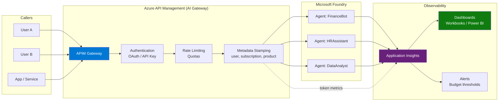
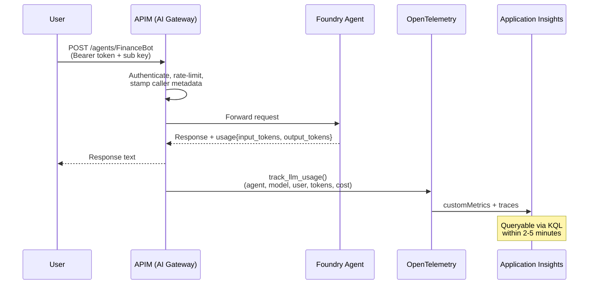

# Monitoring Foundry Agents — Per-User Token Tracking via APIM AI Gateway

> Track **who** uses **which agent**, how many **tokens** are consumed, and the **estimated cost** — all with granular, queryable telemetry in Application Insights.

---

## Table of Contents

- [Overview](#overview)
- [Architecture](#architecture)
- [Prerequisites](#prerequisites)
- [Step 1 — Connect Application Insights to Foundry](#step-1--connect-application-insights-to-foundry)
- [Step 2 — Configure APIM as AI Gateway](#step-2--configure-apim-as-ai-gateway)
- [Step 3 — Instrument Token Tracking](#step-3--instrument-token-tracking)
- [Step 4 — KQL Queries for Monitoring](#step-4--kql-queries-for-monitoring)
- [Step 5 — Dashboards and Alerts](#step-5--dashboards-and-alerts)
- [Full Python Solution](#full-python-solution)
- [References](#references)

---

## Overview

Azure AI Foundry provides built-in tracing per agent, but does **not** natively attribute usage to individual callers. By routing all agent traffic through **Azure API Management (APIM)** acting as an **AI Gateway**, every request is enriched with caller metadata (user, subscription, product) before reaching the agent.

Combined with **OpenTelemetry** and **Application Insights**, this enables:

- Per-user, per-agent token consumption tracking
- Cost estimation per request, per user, per model
- Real-time dashboards and budget alerts
- Audit trail of every agent invocation

---

## Architecture



### Data Flow — Per-Request



---

## Prerequisites

| Component | Required |
|-----------|----------|
| Azure AI Foundry project | With agents deployed (Prompt or Hosted) |
| Azure API Management | Any tier (Consumption, Standard v2, etc.) |
| Application Insights | Connected to the Foundry project |
| Python packages | `httpx`, `azure-identity`, `azure-monitor-opentelemetry`, `opentelemetry-api`, `azure-monitor-query` |
| Azure CLI | Authenticated (`az login`) |

```bash
pip install httpx azure-identity azure-monitor-opentelemetry opentelemetry-api azure-monitor-query
```

---

## Step 1 — Connect Application Insights to Foundry

1. **Azure Portal** → Microsoft Foundry → your project
2. **Management Center** → **Observability**
3. Click **Connect** → select or create an Application Insights resource
4. Assign **Log Analytics Reader** role to users who need to query traces

> This enables Foundry's native agent tracing (agent name, model, latency, errors). APIM adds the caller dimension.

---

## Step 2 — Configure APIM as AI Gateway

### 2.1 — Create API routes to Foundry agents

For each agent, create an APIM operation that proxies to the Foundry Responses API:

```
Backend URL: https://<resource>.services.ai.azure.com/api/projects/<project>
```

### 2.2 — Configure authentication

APIM authenticates users via **subscription keys** or **OAuth 2.0**. Each subscription key maps to a user or team — this is the identity dimension in your telemetry.

### 2.3 — APIM Policy for metadata enrichment

Add this inbound policy to stamp every request with caller metadata:

```xml
<inbound>
    <base />
    <!-- Extract caller identity -->
    <set-variable name="caller-id"
        value="@(context.Subscription?.DisplayName ?? context.User?.Id ?? "anonymous")" />
    <set-variable name="caller-product"
        value="@(context.Product?.DisplayName ?? "none")" />

    <!-- Forward to Foundry with managed identity -->
    <authentication-managed-identity resource="https://ai.azure.com" />

    <!-- Add trace headers -->
    <set-header name="X-Caller-Id" exists-action="override">
        <value>@((string)context.Variables["caller-id"])</value>
    </set-header>
    <set-header name="Ocp-Apim-Trace" exists-action="override">
        <value>true</value>
    </set-header>
</inbound>
```

### 2.4 — APIM Subscription per user/team

Create subscriptions in APIM for each caller:

| Subscription | Scope | Maps to |
|-------------|-------|---------|
| `sub-finance-team` | Product: Foundry Agents | Finance team |
| `sub-hr-team` | Product: Foundry Agents | HR team |
| `sub-app-crm` | Product: Foundry Agents | CRM application |

Each subscription key becomes the `caller-id` in your telemetry.

---

## Step 3 — Instrument Token Tracking

The client calling APIM extracts the `usage` object from the Foundry response and pushes metrics to Application Insights via OpenTelemetry.

### Core tracking function

```python
import logging
from azure.monitor.opentelemetry import configure_azure_monitor
from opentelemetry import metrics

# ── Initialize once at startup ─────────────────────────────────────────
configure_azure_monitor(connection_string=APP_INSIGHTS_CONN)

logger = logging.getLogger("agent.token.metrics")
logger.setLevel(logging.INFO)
logger.propagate = True  # Required for OTel handler

meter = metrics.get_meter("agent.token.metrics")
prompt_counter     = meter.create_counter("llm.prompt_tokens",     unit="tokens")
completion_counter = meter.create_counter("llm.completion_tokens", unit="tokens")
total_counter      = meter.create_counter("llm.total_tokens",      unit="tokens")
cost_counter       = meter.create_counter("llm.request_cost_usd",  unit="USD")

# Per-model pricing (USD per token)
MODEL_PRICING = {
    "gpt-4.1":     {"input": 0.002 / 1000,   "output": 0.008 / 1000},
    "gpt-4o":      {"input": 0.0025 / 1000,  "output": 0.010 / 1000},
    "gpt-4o-mini": {"input": 0.00015 / 1000, "output": 0.0006 / 1000},
    "gpt-5-mini":  {"input": 0.0003 / 1000,  "output": 0.0012 / 1000},
}


def track_llm_usage(
    prompt_tokens: int,
    completion_tokens: int,
    model: str,
    agent_name: str,
    caller_id: str = "unknown",
    operation_id: str = "unknown",
):
    """Record token metrics + log to App Insights with caller attribution."""
    total = prompt_tokens + completion_tokens
    pricing = MODEL_PRICING.get(model, {"input": 0.0, "output": 0.0})
    cost = (prompt_tokens * pricing["input"]) + (completion_tokens * pricing["output"])

    dims = {
        "agent_name": agent_name,
        "model": model,
        "caller_id": caller_id,
        "operation_id": operation_id,
    }

    # Counters → customMetrics table
    prompt_counter.add(prompt_tokens, dims)
    completion_counter.add(completion_tokens, dims)
    total_counter.add(total, dims)
    cost_counter.add(cost, dims)

    # Logger → traces table (queryable via KQL)
    logger.info(
        "llm.usage",
        extra={
            "custom_dimensions": {
                "agent_name": agent_name,
                "model": model,
                "caller_id": caller_id,
                "operation_id": operation_id,
                "prompt_tokens": str(prompt_tokens),
                "completion_tokens": str(completion_tokens),
                "total_tokens": str(total),
                "cost_usd": str(round(cost, 6)),
            }
        },
    )
```

### Agent call function with caller tracking

```python
import httpx
from azure.identity import DefaultAzureCredential, get_bearer_token_provider

credential = DefaultAzureCredential()
_token_fn = get_bearer_token_provider(credential, "https://ai.azure.com/.default")


def call_agent(
    agent_name: str,
    user_message: str,
    caller_id: str = "unknown",
) -> str:
    """Call a Foundry agent via APIM, track tokens per caller."""
    token = _token_fn()

    r = httpx.post(
        f"{APIM_BASE}/foundry/models/{agent_name}",
        headers={
            "Authorization": f"Bearer {token}",
            "Ocp-Apim-Subscription-Key": APIM_SUB_KEY,
            "Ocp-Apim-Trace": "true",
            "Content-Type": "application/json",
        },
        json={"model": "gpt-4.1", "input": user_message},
        params={"api-version": API_VERSION},
        timeout=60,
    )
    r.raise_for_status()
    data = r.json()

    # Track token usage with caller attribution
    usage = data.get("usage", {})
    if usage:
        track_llm_usage(
            prompt_tokens=usage.get("input_tokens", 0),
            completion_tokens=usage.get("output_tokens", 0),
            model=data.get("model", "gpt-4.1"),
            agent_name=agent_name,
            caller_id=caller_id,
        )

    # Extract response text
    for item in data.get("output", []):
        for part in item.get("content", []):
            if part.get("type") == "output_text":
                return part["text"]

    return str(data)
```

### Usage

```python
# Each call is attributed to a specific caller
answer = call_agent("FinanceBot", "Summarize Q4 earnings", caller_id="finance-team")
answer = call_agent("HRAssistant", "What is the PTO policy?", caller_id="hr-portal")
answer = call_agent("FinanceBot", "Project revenue for Q1", caller_id="cfo-dashboard")
```

---

## Step 4 — KQL Queries for Monitoring

Run these in **Application Insights → Logs**.

### Per-request audit trail

```kql
traces
| where message == "llm.usage"
| extend cd = parse_json(replace_string(
    tostring(customDimensions["custom_dimensions"]), "'", "\""))
| extend
    agent_name        = tostring(cd["agent_name"]),
    model             = tostring(cd["model"]),
    caller_id         = tostring(cd["caller_id"]),
    prompt_tokens     = toint(cd["prompt_tokens"]),
    completion_tokens = toint(cd["completion_tokens"]),
    total_tokens      = toint(cd["total_tokens"]),
    cost_usd          = todouble(cd["cost_usd"])
| project timestamp, caller_id, agent_name, model,
          prompt_tokens, completion_tokens, total_tokens, cost_usd
| order by timestamp desc
```

### Token consumption by user (last 30 days)

```kql
traces
| where message == "llm.usage" and timestamp > ago(30d)
| extend cd = parse_json(replace_string(
    tostring(customDimensions["custom_dimensions"]), "'", "\""))
| summarize
    total_calls  = count(),
    total_tokens = sum(toint(cd["total_tokens"])),
    total_cost   = sum(todouble(cd["cost_usd"]))
  by caller_id = tostring(cd["caller_id"])
| order by total_cost desc
```

### Token consumption by user × agent

```kql
traces
| where message == "llm.usage" and timestamp > ago(30d)
| extend cd = parse_json(replace_string(
    tostring(customDimensions["custom_dimensions"]), "'", "\""))
| summarize
    calls        = count(),
    total_tokens = sum(toint(cd["total_tokens"])),
    total_cost   = sum(todouble(cd["cost_usd"]))
  by caller_id   = tostring(cd["caller_id"]),
     agent_name  = tostring(cd["agent_name"]),
     model       = tostring(cd["model"])
| order by total_cost desc
```

### Top 10 most expensive agents

```kql
traces
| where message == "llm.usage" and timestamp > ago(7d)
| extend cd = parse_json(replace_string(
    tostring(customDimensions["custom_dimensions"]), "'", "\""))
| summarize
    total_calls  = count(),
    avg_tokens   = avg(toint(cd["total_tokens"])),
    total_cost   = sum(todouble(cd["cost_usd"]))
  by agent_name = tostring(cd["agent_name"])
| top 10 by total_cost desc
```

### Daily cost trend per agent

```kql
traces
| where message == "llm.usage" and timestamp > ago(30d)
| extend cd = parse_json(replace_string(
    tostring(customDimensions["custom_dimensions"]), "'", "\""))
| summarize
    daily_cost = sum(todouble(cd["cost_usd"]))
  by bin(timestamp, 1d),
     agent_name = tostring(cd["agent_name"])
| render timechart
```

### Prompt vs Completion token ratio (optimization signal)

```kql
traces
| where message == "llm.usage" and timestamp > ago(7d)
| extend cd = parse_json(replace_string(
    tostring(customDimensions["custom_dimensions"]), "'", "\""))
| summarize
    avg_prompt     = avg(toint(cd["prompt_tokens"])),
    avg_completion = avg(toint(cd["completion_tokens"])),
    ratio          = avg(todouble(cd["prompt_tokens"])) / avg(todouble(cd["completion_tokens"]))
  by agent_name = tostring(cd["agent_name"])
| order by ratio desc
```

> A high prompt/completion ratio may indicate verbose system prompts that could be optimized.

---

## Step 5 — Dashboards and Alerts

### Azure Workbook (recommended)

1. **Application Insights** → **Workbooks** → New
2. Add KQL query tiles for:
   - Token consumption by user (bar chart)
   - Daily cost trend (timechart)
   - Top agents by cost (table)
   - Caller × Agent matrix (heatmap)
3. Pin to Azure Dashboard for team visibility

### Budget Alerts

Create an alert rule when a caller exceeds a token budget:

```kql
traces
| where message == "llm.usage" and timestamp > ago(1d)
| extend cd = parse_json(replace_string(
    tostring(customDimensions["custom_dimensions"]), "'", "\""))
| summarize daily_cost = sum(todouble(cd["cost_usd"]))
  by caller_id = tostring(cd["caller_id"])
| where daily_cost > 5.00
```

Configure: **Application Insights → Alerts → New Alert Rule** → Custom log search → threshold = 1 result.

### Power BI Integration

Export telemetry to Power BI for executive reporting:
1. **Application Insights** → **Logs** → run your KQL query
2. Click **Export → Export to Power BI (M query)**
3. Open in Power BI Desktop → publish to workspace

---

## Full Python Solution

### Configuration (`.env`)

```env
APP_INSIGHTS_CONN=InstrumentationKey=<key>;IngestionEndpoint=<endpoint>;LiveEndpoint=<live>;ApplicationId=<id>
APP_INSIGHTS_RESOURCE_ID=/subscriptions/<sub>/resourceGroups/<rg>/providers/Microsoft.Insights/components/<name>
APIM_BASE=https://<your-apim>.azure-api.net
APIM_SUB_KEY=<your-subscription-key>
API_VERSION=2025-11-15-preview
```

### `requirements.txt`

```
httpx
azure-identity
azure-monitor-opentelemetry
opentelemetry-api
opentelemetry-sdk
azure-monitor-query
python-dotenv
```

### `agent_monitor.py`

```python
"""
Foundry Agent Monitor — Call agents via APIM with per-caller token tracking.

Usage:
    from agent_monitor import call_agent
    answer = call_agent("MyAgent", "Hello", caller_id="user@contoso.com")
"""

import os
import logging
import atexit

import httpx
from dotenv import load_dotenv
from azure.identity import DefaultAzureCredential, get_bearer_token_provider
from azure.monitor.opentelemetry import configure_azure_monitor
from opentelemetry import metrics

load_dotenv(override=True)

# ── Configuration ────────────────────────────────────────────────────────────
APP_INSIGHTS_CONN = os.environ["APP_INSIGHTS_CONN"]
APIM_BASE         = os.environ["APIM_BASE"]
APIM_SUB_KEY      = os.environ["APIM_SUB_KEY"]
API_VERSION       = os.getenv("API_VERSION", "2025-11-15-preview")

# ── OpenTelemetry + App Insights ─────────────────────────────────────────────
configure_azure_monitor(connection_string=APP_INSIGHTS_CONN)

logger = logging.getLogger("agent.token.metrics")
logger.setLevel(logging.INFO)
logger.propagate = True

meter = metrics.get_meter("agent.token.metrics")
_counters = {
    name: meter.create_counter(f"llm.{name}", unit=unit)
    for name, unit in [
        ("prompt_tokens", "tokens"),
        ("completion_tokens", "tokens"),
        ("total_tokens", "tokens"),
        ("request_cost_usd", "USD"),
    ]
}

MODEL_PRICING = {
    "gpt-4.1":     {"input": 0.002 / 1000,   "output": 0.008 / 1000},
    "gpt-4o":      {"input": 0.0025 / 1000,  "output": 0.010 / 1000},
    "gpt-4o-mini": {"input": 0.00015 / 1000, "output": 0.0006 / 1000},
    "gpt-5-mini":  {"input": 0.0003 / 1000,  "output": 0.0012 / 1000},
}

# ── Auth ─────────────────────────────────────────────────────────────────────
credential = DefaultAzureCredential()
_token_fn = get_bearer_token_provider(credential, "https://ai.azure.com/.default")


def track_llm_usage(
    prompt_tokens: int,
    completion_tokens: int,
    model: str,
    agent_name: str,
    caller_id: str = "unknown",
    operation_id: str = "request",
):
    total = prompt_tokens + completion_tokens
    pricing = MODEL_PRICING.get(model, {"input": 0.0, "output": 0.0})
    cost = (prompt_tokens * pricing["input"]) + (completion_tokens * pricing["output"])

    dims = {
        "agent_name": agent_name,
        "model": model,
        "caller_id": caller_id,
        "operation_id": operation_id,
    }

    _counters["prompt_tokens"].add(prompt_tokens, dims)
    _counters["completion_tokens"].add(completion_tokens, dims)
    _counters["total_tokens"].add(total, dims)
    _counters["request_cost_usd"].add(cost, dims)

    logger.info(
        "llm.usage",
        extra={
            "custom_dimensions": {
                "agent_name": agent_name,
                "model": model,
                "caller_id": caller_id,
                "operation_id": operation_id,
                "prompt_tokens": str(prompt_tokens),
                "completion_tokens": str(completion_tokens),
                "total_tokens": str(total),
                "cost_usd": str(round(cost, 6)),
            }
        },
    )


def call_agent(
    agent_name: str,
    user_message: str,
    caller_id: str = "unknown",
    model: str = "gpt-4.1",
) -> str:
    token = _token_fn()

    r = httpx.post(
        f"{APIM_BASE}/foundry/models/{agent_name}",
        headers={
            "Authorization": f"Bearer {token}",
            "Ocp-Apim-Subscription-Key": APIM_SUB_KEY,
            "Ocp-Apim-Trace": "true",
            "Content-Type": "application/json",
        },
        json={"model": model, "input": user_message},
        params={"api-version": API_VERSION},
        timeout=60,
    )
    r.raise_for_status()
    data = r.json()

    usage = data.get("usage", {})
    if usage:
        track_llm_usage(
            prompt_tokens=usage.get("input_tokens", 0),
            completion_tokens=usage.get("output_tokens", 0),
            model=data.get("model", model),
            agent_name=agent_name,
            caller_id=caller_id,
        )

    for item in data.get("output", []):
        for part in item.get("content", []):
            if part.get("type") == "output_text":
                return part["text"]

    return str(data)


def _shutdown():
    provider = metrics.get_meter_provider()
    if hasattr(provider, "shutdown"):
        provider.shutdown()

atexit.register(_shutdown)
```

### `query_usage.py`

```python
"""Query token usage from Application Insights."""

import os
from azure.identity import DefaultAzureCredential
from azure.monitor.query import LogsQueryClient
from dotenv import load_dotenv

load_dotenv(override=True)

APP_INSIGHTS_RESOURCE_ID = os.environ["APP_INSIGHTS_RESOURCE_ID"]

QUERIES = {
    "per_request": """
traces
| where message == "llm.usage"
| extend cd = parse_json(replace_string(
    tostring(customDimensions["custom_dimensions"]), "'", "\\""))
| project
    timestamp,
    caller_id         = tostring(cd["caller_id"]),
    agent_name        = tostring(cd["agent_name"]),
    model             = tostring(cd["model"]),
    prompt_tokens     = toint(cd["prompt_tokens"]),
    completion_tokens = toint(cd["completion_tokens"]),
    total_tokens      = toint(cd["total_tokens"]),
    cost_usd          = todouble(cd["cost_usd"])
| order by timestamp desc
""",
    "by_caller": """
traces
| where message == "llm.usage" and timestamp > ago(30d)
| extend cd = parse_json(replace_string(
    tostring(customDimensions["custom_dimensions"]), "'", "\\""))
| summarize
    total_calls  = count(),
    total_tokens = sum(toint(cd["total_tokens"])),
    total_cost   = sum(todouble(cd["cost_usd"]))
  by caller_id = tostring(cd["caller_id"])
| order by total_cost desc
""",
    "by_caller_agent": """
traces
| where message == "llm.usage" and timestamp > ago(30d)
| extend cd = parse_json(replace_string(
    tostring(customDimensions["custom_dimensions"]), "'", "\\""))
| summarize
    calls        = count(),
    total_tokens = sum(toint(cd["total_tokens"])),
    total_cost   = sum(todouble(cd["cost_usd"]))
  by caller_id  = tostring(cd["caller_id"]),
     agent_name = tostring(cd["agent_name"]),
     model      = tostring(cd["model"])
| order by total_cost desc
""",
}


def run_query(query_name: str = "per_request"):
    client = LogsQueryClient(DefaultAzureCredential())
    resp = client.query_resource(
        resource_id=APP_INSIGHTS_RESOURCE_ID,
        query=QUERIES[query_name],
        timespan=None,
    )
    if resp.status != "Success":
        raise RuntimeError(f"Query failed: {resp.status}")

    table = resp.tables[0]
    rows = [dict(zip(table.columns, r)) for r in table.rows]
    return rows


if __name__ == "__main__":
    import sys

    query = sys.argv[1] if len(sys.argv) > 1 else "per_request"
    rows = run_query(query)

    if not rows:
        print("No telemetry found.")
    else:
        print(f"Found {len(rows)} records\n")
        for r in rows[:20]:
            print(r)
```

---

## References

| Resource | Link |
|----------|------|
| Tracking Every Token — Microsoft Tech Community | [techcommunity.microsoft.com](https://techcommunity.microsoft.com/blog/azure-ai-foundry-blog/tracking-every-token-granular-cost-and-usage-metrics-for-microsoft-foundry-agent/4503143) |
| Set Up Tracing for Agents | [learn.microsoft.com](https://learn.microsoft.com/en-us/azure/foundry/observability/how-to/trace-agent-setup) |
| Agent Monitoring Dashboard | [learn.microsoft.com](https://learn.microsoft.com/en-us/azure/foundry/observability/how-to/how-to-monitor-agents-dashboard) |
| Monitor AI Agents with App Insights | [learn.microsoft.com](https://learn.microsoft.com/en-us/azure/azure-monitor/app/agents-view) |
| Full sample repo (APIM + App Insights) | [github.com/ccoellomsft](https://github.com/ccoellomsft/foundry-agents-apim-appinsights) |
| OpenTelemetry Tracing in Foundry | [willvelida.com](https://www.willvelida.com/posts/azure-ai-agents-tracing/) |

---

*Generated on 2026-04-08*
