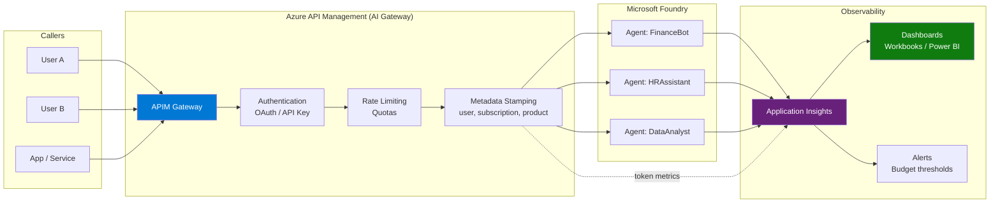
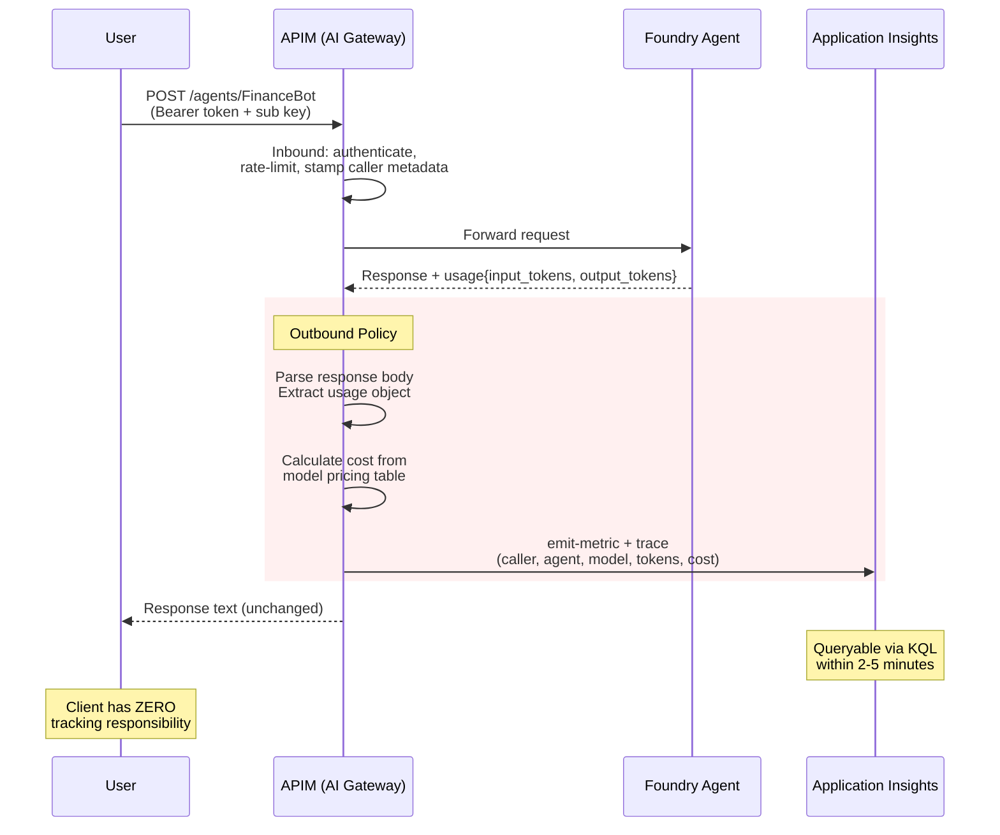
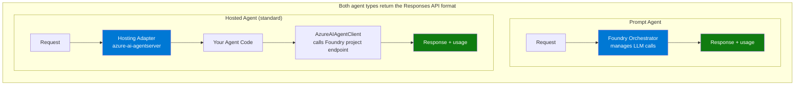
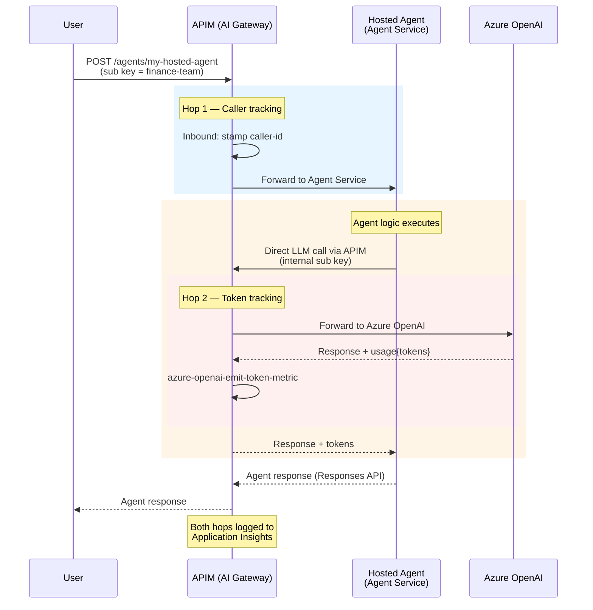

# Monitoring Foundry Agents — Per-User Token Tracking via APIM AI Gateway

> Track **who** uses **which agent**, how many **tokens** are consumed, and the **estimated cost** — all with granular, queryable telemetry in Application Insights.

---

## Table of Contents

- [Overview](#overview)
- [Architecture](#architecture)
- [Prerequisites](#prerequisites)
- [Step 1 — Connect Application Insights to Foundry](#step-1--connect-application-insights-to-foundry)
- [Step 2 — Configure APIM as AI Gateway](#step-2--configure-apim-as-ai-gateway)
- [Step 3 — Enable APIM Diagnostic Settings](#step-3--enable-apim-diagnostic-settings)
- [Step 4 — KQL Queries for Monitoring](#step-4--kql-queries-for-monitoring)
- [Step 5 — Dashboards and Alerts](#step-5--dashboards-and-alerts)
- [Prompt Agent vs Hosted Agent — Compatibility](#prompt-agent-vs-hosted-agent--compatibility)
- [Full Python Solution](#full-python-solution)
- [References](#references)

---

## Overview

Azure AI Foundry provides built-in tracing per agent, but does **not** natively attribute usage to individual callers. By routing all agent traffic through **Azure API Management (APIM)** acting as an **AI Gateway**, every request is enriched with caller metadata and — critically — **token usage is extracted server-side from the Foundry response by APIM outbound policies**, not by client code.

This means:

- **Zero client instrumentation** — callers just call APIM, no tracking SDK needed
- **Tamper-proof** — metrics are emitted by the gateway, not by the consumer
- **Universal** — any client (Python, C#, curl, Power Automate) is automatically tracked
- Per-user, per-agent token consumption with cost estimation
- Real-time dashboards, budget alerts, and full audit trail

---

## Architecture



### Data Flow — Per-Request



---

## Prerequisites

| Component | Required |
|-----------|----------|
| Azure AI Foundry project | With agents deployed (Prompt or Hosted) |
| Azure API Management | Standard v2 or Premium (for `emit-metric` policy support) |
| Application Insights | Connected to both Foundry project **and** APIM diagnostic settings |
| APIM Diagnostic Settings | Enabled → sends `ApiManagementGatewayLogs` to App Insights |
| Python packages (optional, for querying) | `azure-identity`, `azure-monitor-query`, `httpx` |
| Azure CLI | Authenticated (`az login`) |

```bash
# Client-side — only needed if you want to query usage programmatically
pip install httpx azure-identity azure-monitor-query python-dotenv
```

> **Key difference from client-side approaches**: The client does NOT need `opentelemetry`, `azure-monitor-opentelemetry`, or any tracking SDK. Token extraction and metric emission happen entirely in APIM outbound policies.

---

## Step 1 — Connect Application Insights to Foundry

1. **Azure Portal** → Microsoft Foundry → your project
2. **Management Center** → **Observability**
3. Click **Connect** → select or create an Application Insights resource
4. Assign **Log Analytics Reader** role to users who need to query traces

> This enables Foundry's native agent tracing (agent name, model, latency, errors). APIM adds the caller dimension.

---

## Step 2 — Configure APIM as AI Gateway

### 2.1 — Create API routes to Foundry agents

For each agent, create an APIM operation that proxies to the Foundry Responses API:

```
Backend URL: https://<resource>.services.ai.azure.com/api/projects/<project>
```

### 2.2 — Configure authentication

APIM authenticates users via **subscription keys** or **OAuth 2.0**. Each subscription key maps to a user or team — this is the identity dimension in your telemetry.

### 2.3 — APIM Inbound Policy — Caller Metadata

Add this **inbound** policy to stamp every request with caller metadata:

```xml
<inbound>
    <base />
    <!-- Extract caller identity -->
    <set-variable name="caller-id"
        value="@(context.Subscription?.DisplayName ?? context.User?.Id ?? "anonymous")" />
    <set-variable name="caller-product"
        value="@(context.Product?.DisplayName ?? "none")" />

    <!-- Forward to Foundry with managed identity -->
    <authentication-managed-identity resource="https://ai.azure.com" />

    <!-- Add trace headers -->
    <set-header name="X-Caller-Id" exists-action="override">
        <value>@((string)context.Variables["caller-id"])</value>
    </set-header>
    <set-header name="Ocp-Apim-Trace" exists-action="override">
        <value>true</value>
    </set-header>
</inbound>
```

### 2.4 — APIM Outbound Policy — Server-Side Token Extraction

This is the critical part. The **outbound** policy intercepts the Foundry response, parses the `usage` object, calculates cost, and emits metrics + traces to Application Insights — **without any client involvement**.

```xml
<outbound>
    <base />

    <!-- ═══ 1. Read and preserve the response body ═══ -->
    <set-variable name="responseBody"
        value="@(context.Response.Body.As<JObject>(preserveContent: true))" />

    <!-- ═══ 2. Extract token usage from Foundry response ═══ -->
    <set-variable name="input-tokens" value="@{
        var body = (JObject)context.Variables["responseBody"];
        return body["usage"]?["input_tokens"]?.ToString() ?? "0";
    }" />
    <set-variable name="output-tokens" value="@{
        var body = (JObject)context.Variables["responseBody"];
        return body["usage"]?["output_tokens"]?.ToString() ?? "0";
    }" />
    <set-variable name="total-tokens" value="@{
        var body = (JObject)context.Variables["responseBody"];
        return body["usage"]?["total_tokens"]?.ToString() ?? "0";
    }" />
    <set-variable name="model-name" value="@{
        var body = (JObject)context.Variables["responseBody"];
        return body["model"]?.ToString() ?? "unknown";
    }" />

    <!-- ═══ 3. Calculate estimated cost (USD) ═══ -->
    <set-variable name="cost-usd" value="@{
        var inTok  = int.Parse((string)context.Variables["input-tokens"]);
        var outTok = int.Parse((string)context.Variables["output-tokens"]);
        var model  = (string)context.Variables["model-name"];

        // Per-token pricing (USD) — update as pricing changes
        var inputPrice  = 0.002  / 1000.0;  // default
        var outputPrice = 0.008  / 1000.0;
        if (model.Contains("4o-mini"))  { inputPrice = 0.00015 / 1000.0; outputPrice = 0.0006 / 1000.0; }
        else if (model.Contains("4o")) { inputPrice = 0.0025  / 1000.0; outputPrice = 0.010  / 1000.0; }
        else if (model.Contains("5-mini")) { inputPrice = 0.0003 / 1000.0; outputPrice = 0.0012 / 1000.0; }

        var cost = (inTok * inputPrice) + (outTok * outputPrice);
        return cost.ToString("F6");
    }" />

    <!-- ═══ 4. Emit custom metrics to Azure Monitor ═══ -->
    <emit-metric name="FoundryAgent.TokenUsage"
                 value="@(int.Parse((string)context.Variables["total-tokens"]))"
                 namespace="FoundryAgents">
        <dimension name="CallerID"
                   value="@(context.Subscription?.DisplayName ?? context.User?.Id ?? "anonymous")" />
        <dimension name="AgentName" value="@(context.Api.Name)" />
        <dimension name="Model" value="@((string)context.Variables["model-name"])" />
    </emit-metric>

    <emit-metric name="FoundryAgent.CostUSD"
                 value="@(double.Parse((string)context.Variables["cost-usd"]))"
                 namespace="FoundryAgents">
        <dimension name="CallerID"
                   value="@(context.Subscription?.DisplayName ?? context.User?.Id ?? "anonymous")" />
        <dimension name="AgentName" value="@(context.Api.Name)" />
        <dimension name="Model" value="@((string)context.Variables["model-name"])" />
    </emit-metric>

    <!-- ═══ 5. Emit structured trace for per-request audit trail ═══ -->
    <trace source="foundry.agent.usage" severity="information">
        <message>@{
            return new JObject(
                new JProperty("caller_id",         context.Subscription?.DisplayName ?? "anonymous"),
                new JProperty("agent_name",        context.Api.Name),
                new JProperty("model",             (string)context.Variables["model-name"]),
                new JProperty("input_tokens",      (string)context.Variables["input-tokens"]),
                new JProperty("output_tokens",     (string)context.Variables["output-tokens"]),
                new JProperty("total_tokens",      (string)context.Variables["total-tokens"]),
                new JProperty("cost_usd",          (string)context.Variables["cost-usd"]),
                new JProperty("operation_id",      context.RequestId.ToString()),
                new JProperty("subscription_name", context.Subscription?.Name ?? "none"),
                new JProperty("product_name",      context.Product?.DisplayName ?? "none"),
                new JProperty("client_ip",         context.Request.IpAddress)
            ).ToString();
        }</message>
    </trace>
</outbound>
```

> **Why this is better than client-side tracking:**
>
> | Aspect | Client-side (old) | APIM Outbound (new) |
> |--------|-------------------|---------------------|
> | **Bypass risk** | Any client that skips the SDK → no tracking | Every request through APIM is tracked |
> | **Client complexity** | Must install OTel SDK + configure | Just call the API — zero instrumentation |
> | **Trust model** | Client reports its own usage (honor system) | Gateway extracts from actual response |
> | **Language support** | Python only (or rewrite per language) | Any HTTP client (curl, C#, JS, Power Automate) |
> | **Tamper-proof** | Client can lie about token counts | APIM reads the real Foundry response |

### 2.5 — APIM Subscription per user/team

Create subscriptions in APIM for each caller:

| Subscription | Scope | Maps to |
|-------------|-------|---------|
| `sub-finance-team` | Product: Foundry Agents | Finance team |
| `sub-hr-team` | Product: Foundry Agents | HR team |
| `sub-app-crm` | Product: Foundry Agents | CRM application |

Each subscription key becomes the `caller-id` in your telemetry.

---

## Step 3 — Enable APIM Diagnostic Settings

For APIM to emit the `trace` and `emit-metric` data to Application Insights, you must configure diagnostic settings.

### 3.1 — Connect App Insights to APIM

1. **Azure Portal** → API Management → your APIM instance
2. **Application Insights** blade → **+ Add**
3. Select the same App Insights resource connected to Foundry
4. Set **Sampling** to `100%` for full audit trail (reduce in high-volume production)

### 3.2 — Enable API-level diagnostics

For each API (agent), enable Application Insights logging:

1. **APIs** → select your Foundry agent API
2. **Settings** → **Diagnostics** → select the App Insights logger
3. Enable **Request body** and **Response body** logging (optional, for debugging)

### 3.3 — Rate Limiting and Quotas (recommended)

Add rate limiting per subscription to prevent abuse:

```xml
<inbound>
    <!-- ... existing inbound policies ... -->

    <!-- Rate limit: max 100 calls per minute per subscription -->
    <rate-limit-by-key calls="100" renewal-period="60"
        counter-key="@(context.Subscription.Id)" />

    <!-- Quota: max 5000 calls and 50MB per day per subscription -->
    <quota-by-key calls="5000" bandwidth="50000" renewal-period="86400"
        counter-key="@(context.Subscription.Id)" />
</inbound>
```

### 3.4 — OAuth 2.0 Authentication (production)

For production deployments, replace subscription keys with **Entra ID OAuth 2.0**:

```xml
<inbound>
    <base />
    <!-- Validate JWT from Entra ID -->
    <validate-azure-ad-token tenant-id="{{tenant-id}}"
                             output-token-variable-name="jwt-token">
        <client-application-ids>
            <application-id>{{allowed-client-app-id}}</application-id>
        </client-application-ids>
    </validate-azure-ad-token>

    <!-- Extract caller from JWT claims -->
    <set-variable name="caller-id"
        value="@(((Jwt)context.Variables["jwt-token"]).Claims.GetValueOrDefault("preferred_username", "anonymous"))" />
    <set-variable name="caller-oid"
        value="@(((Jwt)context.Variables["jwt-token"]).Claims.GetValueOrDefault("oid", ""))" />

    <!-- Continue with managed identity to Foundry -->
    <authentication-managed-identity resource="https://ai.azure.com" />
</inbound>
```

> With OAuth, the `caller-id` dimension in your metrics is the actual Entra ID user principal name — no ambiguity.

---

## Step 4 — KQL Queries for Monitoring

Run these in **Application Insights → Logs**. The data comes from APIM outbound `trace` policy — no client instrumentation needed.

### Per-request audit trail

```kql
traces
| where message has "foundry.agent.usage"
| extend payload = parse_json(message)
| extend
    agent_name        = tostring(payload["agent_name"]),
    model             = tostring(payload["model"]),
    caller_id         = tostring(payload["caller_id"]),
    input_tokens      = toint(payload["input_tokens"]),
    output_tokens     = toint(payload["output_tokens"]),
    total_tokens      = toint(payload["total_tokens"]),
    cost_usd          = todouble(payload["cost_usd"]),
    client_ip         = tostring(payload["client_ip"]),
    subscription_name = tostring(payload["subscription_name"]),
    product_name      = tostring(payload["product_name"])
| project timestamp, caller_id, agent_name, model,
          input_tokens, output_tokens, total_tokens, cost_usd,
          client_ip, subscription_name, product_name
| order by timestamp desc
```

### Token consumption by user (last 30 days)

```kql
traces
| where message has "foundry.agent.usage" and timestamp > ago(30d)
| extend payload = parse_json(message)
| summarize
    total_calls  = count(),
    total_tokens = sum(toint(payload["total_tokens"])),
    total_cost   = sum(todouble(payload["cost_usd"]))
  by caller_id = tostring(payload["caller_id"])
| order by total_cost desc
```

### Token consumption by user × agent

```kql
traces
| where message has "foundry.agent.usage" and timestamp > ago(30d)
| extend payload = parse_json(message)
| summarize
    calls        = count(),
    total_tokens = sum(toint(payload["total_tokens"])),
    total_cost   = sum(todouble(payload["cost_usd"]))
  by caller_id   = tostring(payload["caller_id"]),
     agent_name  = tostring(payload["agent_name"]),
     model       = tostring(payload["model"])
| order by total_cost desc
```

### Top 10 most expensive agents

```kql
traces
| where message has "foundry.agent.usage" and timestamp > ago(7d)
| extend payload = parse_json(message)
| summarize
    total_calls  = count(),
    avg_tokens   = avg(toint(payload["total_tokens"])),
    total_cost   = sum(todouble(payload["cost_usd"]))
  by agent_name = tostring(payload["agent_name"])
| top 10 by total_cost desc
```

### Daily cost trend per agent

```kql
traces
| where message has "foundry.agent.usage" and timestamp > ago(30d)
| extend payload = parse_json(message)
| summarize
    daily_cost = sum(todouble(payload["cost_usd"]))
  by bin(timestamp, 1d),
     agent_name = tostring(payload["agent_name"])
| render timechart
```

### Prompt vs Completion token ratio (optimization signal)

```kql
traces
| where message has "foundry.agent.usage" and timestamp > ago(7d)
| extend payload = parse_json(message)
| summarize
    avg_input      = avg(toint(payload["input_tokens"])),
    avg_output     = avg(toint(payload["output_tokens"])),
    ratio          = avg(todouble(payload["input_tokens"])) / avg(todouble(payload["output_tokens"]))
  by agent_name = tostring(payload["agent_name"])
| order by ratio desc
```

> A high prompt/completion ratio may indicate verbose system prompts that could be optimized.

---

## Step 5 — Dashboards and Alerts

### Azure Workbook (recommended)

1. **Application Insights** → **Workbooks** → New
2. Add KQL query tiles for:
   - Token consumption by user (bar chart)
   - Daily cost trend (timechart)
   - Top agents by cost (table)
   - Caller × Agent matrix (heatmap)
3. Pin to Azure Dashboard for team visibility

### Budget Alerts

Create an alert rule when a caller exceeds a token budget:

```kql
traces
| where message has "foundry.agent.usage" and timestamp > ago(1d)
| extend payload = parse_json(message)
| summarize daily_cost = sum(todouble(payload["cost_usd"]))
  by caller_id = tostring(payload["caller_id"])
| where daily_cost > 5.00
```

Configure: **Application Insights → Alerts → New Alert Rule** → Custom log search → threshold = 1 result.

### Power BI Integration

Export telemetry to Power BI for executive reporting:
1. **Application Insights** → **Logs** → run your KQL query
2. Click **Export → Export to Power BI (M query)**
3. Open in Power BI Desktop → publish to workspace

---

## Prompt Agent vs Hosted Agent — Compatibility

The APIM outbound policy approach works with **both** agent types, but with important nuances. This section explains the differences and edge cases.

### What Are Hosted Agents in Foundry?

Hosted Agents are **not** raw containers you manage yourself. They are containerized agents that run on **Foundry Agent Service** with a managed hosting adapter (`azure-ai-agentserver-*`). The hosting adapter provides:

- **Automatic protocol translation** — wraps your agent code to expose the standard **Responses API** (same as Prompt Agents)
- **Built-in OpenTelemetry** — traces, metrics, and logs are exported automatically
- **Conversation orchestration** — message serialization, streaming, state management
- **Identity management** — runs with the project managed identity (or a dedicated agent identity when published)

The hosting adapter supports three frameworks:

| Framework | Python | C# |
|-----------|--------|-----|
| Microsoft Agent Framework | Yes | Yes |
| LangGraph | Yes | No |
| Custom code | Yes | Yes |

### How Hosted Agents Make LLM Calls

In the standard pattern, hosted agents call models through the **Foundry project endpoint** — not directly to Azure OpenAI:

```python
# Standard hosted agent code — uses Foundry project endpoint
from agent_framework import ChatAgent
from agent_framework.azure import AzureAIAgentClient

agent = ChatAgent(
    chat_client=AzureAIAgentClient(
        project_endpoint=PROJECT_ENDPOINT,         # Foundry project endpoint
        model_deployment_name="gpt-4.1",
        credential=DefaultAzureCredential(),
    ),
    instructions="You are a helpful assistant...",
    tools=[my_tool],
)
```

Since the LLM calls go through **Foundry's infrastructure** (not direct Azure OpenAI), and the hosting adapter returns responses in the standard **Responses API format**, the response includes the `usage` object — just like Prompt Agents.

### Prompt Agent — Full Compatibility

**Prompt Agents** are fully orchestrated by Foundry. The Responses API always returns `usage`:

```json
{
  "id": "resp_abc123",
  "output": [{ "content": [{ "type": "output_text", "text": "..." }] }],
  "usage": {
    "input_tokens": 230,
    "output_tokens": 512,
    "total_tokens": 742
  },
  "model": "gpt-4.1"
}
```

The APIM outbound policy parses this response and emits metrics — **no changes needed**.

### Hosted Agent (Standard Pattern) — Full Compatibility

When using the hosting adapter with `AzureAIAgentClient` (or any adapter-supported framework), the response is also returned in the **Responses API format**. Since the hosting adapter handles protocol translation, the `usage` object is included in the response.



**Result**: The same APIM outbound policy works for both Prompt and Hosted agents.

### Edge Case: Hosted Agent with External LLM Calls

The only scenario where token tracking breaks is when a hosted agent **bypasses** the Foundry project endpoint and calls LLMs directly (e.g., direct Azure OpenAI, Anthropic API, or a self-hosted model):

```python
# ⚠️ Edge case — hosted agent bypasses Foundry
from openai import AzureOpenAI
client = AzureOpenAI(
    azure_endpoint="https://my-aoai.openai.azure.com",  # Direct call, bypasses Foundry
    api_key=os.environ["AOAI_KEY"],
)
```

In this case:
1. The hosting adapter cannot report `usage` for calls it doesn't manage
2. The Responses API response may have **partial or missing** `usage` data
3. APIM outbound policy has incomplete information

### Solution for Edge Cases: Double-Hop APIM Pattern

If your hosted agent must call LLMs directly (not through the Foundry project endpoint), route those calls through APIM:



**Hop 2 APIM Policy** — use the built-in `azure-openai-emit-token-metric`:

```xml
<!-- API: Azure OpenAI (internal, called by hosted agents with direct LLM calls) -->
<inbound>
    <base />
    <set-variable name="caller-agent"
        value="@(context.Request.Headers.GetValueOrDefault("X-Agent-Name", "unknown-agent"))" />
    <authentication-managed-identity resource="https://cognitiveservices.azure.com" />
</inbound>

<outbound>
    <base />
    <azure-openai-emit-token-metric namespace="FoundryAgents.LLM">
        <dimension name="AgentName"
                   value="@(context.Request.Headers.GetValueOrDefault("X-Agent-Name", "unknown"))" />
        <dimension name="CallerID"
                   value="@(context.Subscription?.DisplayName ?? "anonymous")" />
        <dimension name="Model"
                   value="@(context.Request.MatchedParameters["deployment-id"])" />
    </azure-openai-emit-token-metric>
</outbound>
```

**Container configuration** — point direct LLM calls to APIM:

```python
# In your hosted agent code — redirect direct LLM calls through APIM
from openai import AzureOpenAI
client = AzureOpenAI(
    azure_endpoint=os.environ["APIM_BASE"],           # APIM, not direct AOAI
    api_key=os.environ["APIM_INTERNAL_SUB_KEY"],       # APIM subscription key
    default_headers={
        "X-Agent-Name": os.environ.get("AGENT_NAME", "my-hosted-agent"),
    },
)
```

Set these **environment variables** in your hosted agent definition:

```python
agent = client.agents.create_version(
    agent_name="my-agent",
    definition=HostedAgentDefinition(
        # ... image, cpu, memory ...
        environment_variables={
            "AZURE_AI_PROJECT_ENDPOINT": PROJECT_ENDPOINT,
            "APIM_BASE": "https://my-apim.azure-api.net",
            "APIM_INTERNAL_SUB_KEY": "<subscription-key>",    # Use Key Vault connection instead
            "AGENT_NAME": "my-agent",
        }
    )
)
```

> **Security note**: Don't put the APIM subscription key directly in environment variables. Use a [Key Vault connection](https://learn.microsoft.com/en-us/azure/foundry/how-to/set-up-key-vault-connection) as recommended by the Foundry documentation.

### KQL: Correlating Both Hops (Edge Case Only)

When a hosted agent uses the double-hop pattern, correlate caller identity (Hop 1) with token usage (Hop 2):

```kql
// Hop 1: Caller -> Agent (from custom outbound trace)
let hop1 = traces
| where message has "foundry.agent.usage"
| extend p = parse_json(message)
| project timestamp, caller_id = tostring(p["caller_id"]),
          agent_name = tostring(p["agent_name"]),
          operation_id;

// Hop 2: Agent -> Azure OpenAI (from azure-openai-emit-token-metric)
let hop2 = customMetrics
| where name == "FoundryAgents.LLM.TokenUsage"
| extend agent = tostring(customDimensions["AgentName"]),
         model = tostring(customDimensions["Model"]),
         tokens = valueSum;

// Combine
hop2
| summarize total_tokens = sum(tokens) by agent, model
| join kind=inner (
    hop1 | summarize calls = count() by caller_id, agent_name
) on $left.agent == $right.agent_name
| project caller_id, agent_name, model, calls, total_tokens
| order by total_tokens desc
```

### Summary: Compatibility Matrix

| Scenario | Responses API `usage`? | APIM Outbound Works? | Action Required |
|----------|----------------------|---------------------|-----------------|
| **Prompt Agent** | Always present | Yes | None |
| **Hosted Agent** (standard — AzureAIAgentClient) | Present (hosting adapter) | Yes | None |
| **Hosted Agent** (LangGraph via adapter) | Present (hosting adapter) | Yes | None |
| **Hosted Agent** (direct Azure OpenAI calls) | May be missing | Partial | Route LLM calls through APIM (double-hop) |
| **Hosted Agent** (external LLM — Anthropic, etc.) | Missing | No | Route through APIM or implement custom logging |

---

## Full Python Solution

Since token tracking is handled entirely by APIM outbound policies, the client code is a **thin wrapper** — no OTel SDK, no tracking logic, just call the API.

### Configuration (`.env`)

```env
APIM_BASE=https://<your-apim>.azure-api.net
APIM_SUB_KEY=<your-subscription-key>
API_VERSION=2025-11-15-preview
APP_INSIGHTS_RESOURCE_ID=/subscriptions/<sub>/resourceGroups/<rg>/providers/Microsoft.Insights/components/<name>
```

### `requirements.txt`

```
httpx
azure-identity
azure-monitor-query
python-dotenv
```

### `agent_client.py` — Thin client (no tracking SDK)

```python
"""
Foundry Agent Client — Call agents via APIM.
Token tracking is handled server-side by APIM outbound policies.

Usage:
    from agent_client import call_agent
    answer = call_agent("MyAgent", "Hello")
"""

import os
import httpx
from dotenv import load_dotenv
from azure.identity import DefaultAzureCredential, get_bearer_token_provider

load_dotenv(override=True)

# ── Configuration ────────────────────────────────────────────────────────────
APIM_BASE    = os.environ["APIM_BASE"]
APIM_SUB_KEY = os.environ["APIM_SUB_KEY"]
API_VERSION  = os.getenv("API_VERSION", "2025-11-15-preview")

# ── Auth ─────────────────────────────────────────────────────────────────────
credential = DefaultAzureCredential()
_token_fn = get_bearer_token_provider(credential, "https://ai.azure.com/.default")


def call_agent(
    agent_name: str,
    user_message: str,
    model: str = "gpt-4.1",
) -> str:
    """
    Call a Foundry agent via APIM.

    Token usage is automatically extracted and tracked by the APIM
    outbound policy — no client-side instrumentation needed.
    """
    token = _token_fn()

    r = httpx.post(
        f"{APIM_BASE}/foundry/models/{agent_name}",
        headers={
            "Authorization": f"Bearer {token}",
            "Ocp-Apim-Subscription-Key": APIM_SUB_KEY,
            "Content-Type": "application/json",
        },
        json={"model": model, "input": user_message},
        params={"api-version": API_VERSION},
        timeout=60,
    )
    r.raise_for_status()
    data = r.json()

    # Extract response text
    for item in data.get("output", []):
        for part in item.get("content", []):
            if part.get("type") == "output_text":
                return part["text"]

    return str(data)
```

### Usage

```python
# Just call the agent — APIM handles all tracking
answer = call_agent("FinanceBot", "Summarize Q4 earnings")
answer = call_agent("HRAssistant", "What is the PTO policy?")
answer = call_agent("FinanceBot", "Project revenue for Q1")

# The APIM subscription key identifies who you are.
# Token metrics are automatically emitted by the gateway.
# No OpenTelemetry. No tracking SDK. No client-side logic.
```

### `query_usage.py` — Query token metrics from App Insights

```python
"""Query token usage from Application Insights (emitted by APIM policies)."""

import os
from azure.identity import DefaultAzureCredential
from azure.monitor.query import LogsQueryClient
from dotenv import load_dotenv

load_dotenv(override=True)

APP_INSIGHTS_RESOURCE_ID = os.environ["APP_INSIGHTS_RESOURCE_ID"]

QUERIES = {
    "per_request": """
traces
| where message has "foundry.agent.usage"
| extend payload = parse_json(message)
| project
    timestamp,
    caller_id         = tostring(payload["caller_id"]),
    agent_name        = tostring(payload["agent_name"]),
    model             = tostring(payload["model"]),
    input_tokens      = toint(payload["input_tokens"]),
    output_tokens     = toint(payload["output_tokens"]),
    total_tokens      = toint(payload["total_tokens"]),
    cost_usd          = todouble(payload["cost_usd"]),
    client_ip         = tostring(payload["client_ip"])
| order by timestamp desc
""",
    "by_caller": """
traces
| where message has "foundry.agent.usage" and timestamp > ago(30d)
| extend payload = parse_json(message)
| summarize
    total_calls  = count(),
    total_tokens = sum(toint(payload["total_tokens"])),
    total_cost   = sum(todouble(payload["cost_usd"]))
  by caller_id = tostring(payload["caller_id"])
| order by total_cost desc
""",
    "by_caller_agent": """
traces
| where message has "foundry.agent.usage" and timestamp > ago(30d)
| extend payload = parse_json(message)
| summarize
    calls        = count(),
    total_tokens = sum(toint(payload["total_tokens"])),
    total_cost   = sum(todouble(payload["cost_usd"]))
  by caller_id  = tostring(payload["caller_id"]),
     agent_name = tostring(payload["agent_name"]),
     model      = tostring(payload["model"])
| order by total_cost desc
""",
}


def run_query(query_name: str = "per_request"):
    client = LogsQueryClient(DefaultAzureCredential())
    resp = client.query_resource(
        resource_id=APP_INSIGHTS_RESOURCE_ID,
        query=QUERIES[query_name],
        timespan=None,
    )
    if resp.status != "Success":
        raise RuntimeError(f"Query failed: {resp.status}")

    table = resp.tables[0]
    rows = [dict(zip(table.columns, r)) for r in table.rows]
    return rows


if __name__ == "__main__":
    import sys

    query = sys.argv[1] if len(sys.argv) > 1 else "per_request"
    rows = run_query(query)

    if not rows:
        print("No telemetry found.")
    else:
        print(f"Found {len(rows)} records\n")
        for r in rows[:20]:
            print(r)
```

---

## References

| Resource | Link |
|----------|------|
| Tracking Every Token — Microsoft Tech Community | [techcommunity.microsoft.com](https://techcommunity.microsoft.com/blog/azure-ai-foundry-blog/tracking-every-token-granular-cost-and-usage-metrics-for-microsoft-foundry-agent/4503143) |
| Set Up Tracing for Agents | [learn.microsoft.com](https://learn.microsoft.com/en-us/azure/foundry/observability/how-to/trace-agent-setup) |
| Agent Monitoring Dashboard | [learn.microsoft.com](https://learn.microsoft.com/en-us/azure/foundry/observability/how-to/how-to-monitor-agents-dashboard) |
| Monitor AI Agents with App Insights | [learn.microsoft.com](https://learn.microsoft.com/en-us/azure/azure-monitor/app/agents-view) |
| Full sample repo (APIM + App Insights) | [github.com/ccoellomsft](https://github.com/ccoellomsft/foundry-agents-apim-appinsights) |
| OpenTelemetry Tracing in Foundry | [willvelida.com](https://www.willvelida.com/posts/azure-ai-agents-tracing/) |

---

*Generated on 2026-04-08*
