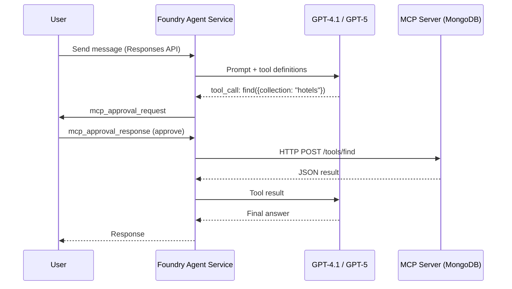
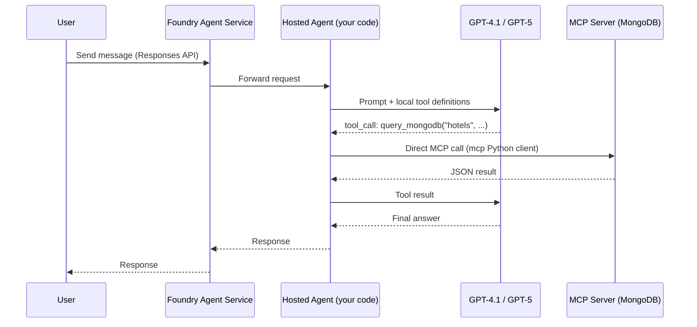
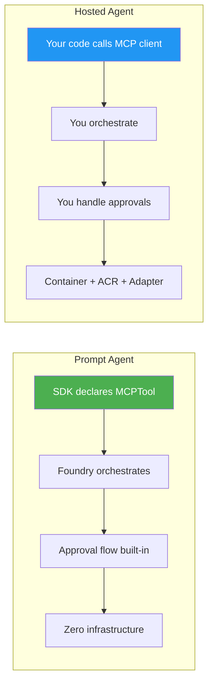

> How to integrate MCP (Model Context Protocol) tools — such as MongoDB — with Azure AI Foundry agents.  
> Covers both **Prompt Agents** (managed by Foundry) and **Hosted Agents** (your own containerized code).

---

## Table of Contents

- [Overview](#overview)
- [Architecture](#architecture)
- [Prompt Agent with MCP Tool](#prompt-agent-with-mcp-tool)
- [Hosted Agent with MCP Tool](#hosted-agent-with-mcp-tool)
- [Comparison](#comparison)
- [MCP Authentication via Project Connection](#mcp-authentication-via-project-connection)
- [References](#references)

---

## Overview

Azure AI Foundry Agent Service supports two agent hosting models, each with a different way to consume MCP tools:

| Model | Description | MCP Integration |
|-------|-------------|-----------------|
| **Prompt Agent** | Declarative agent defined via SDK. Foundry orchestrates everything. | `MCPTool()` in `PromptAgentDefinition` — Foundry manages MCP calls |
| **Hosted Agent** | Your own code (Agent Framework, LangGraph, custom) packaged in a container. | You call the MCP server directly from your code via the `mcp` Python client |

---

## Architecture

### Prompt Agent Flow



### Hosted Agent Flow



---

## Prompt Agent with MCP Tool

The simplest approach — Foundry handles the MCP orchestration, including tool discovery and approval flow.

### Prerequisites

```bash
pip install azure-ai-projects azure-identity
```

### Code Example

```python
import json
from azure.identity import DefaultAzureCredential
from azure.ai.projects import AIProjectClient
from azure.ai.projects.models import PromptAgentDefinition, MCPTool
from openai.types.responses.response_input_param import McpApprovalResponse

PROJECT_ENDPOINT = "https://<resource>.ai.azure.com/api/projects/<project>"
MCP_CONNECTION_NAME = "mongo-mcp-connection"  # Project Connection name

project = AIProjectClient(
    endpoint=PROJECT_ENDPOINT,
    credential=DefaultAzureCredential(),
)
openai = project.get_openai_client()

# Declare the MCP tool — Foundry handles discovery & invocation
tool = MCPTool(
    server_label="mongodb",
    server_url="https://<your-mcp-mongo-server>/mcp",
    require_approval="always",
    project_connection_id=MCP_CONNECTION_NAME,
    allowed_tools=["find", "aggregate", "insertOne"],
)

# Create the agent
agent = project.agents.create_version(
    agent_name="MongoAnalyst",
    definition=PromptAgentDefinition(
        model="gpt-4.1",
        instructions="You are a data analyst. Use MongoDB tools to answer questions.",
        tools=[tool],
    ),
)

# Conversation
conversation = openai.conversations.create()
response = openai.responses.create(
    conversation=conversation.id,
    input="How many documents are in the hotels collection?",
    extra_body={"agent_reference": {"name": agent.name, "type": "agent_reference"}},
)

# Handle MCP approval requests
input_list = []
for item in response.output:
    if item.type == "mcp_approval_request":
        print(f"  Tool: {getattr(item, 'name', '?')}")
        print(f"  Args: {json.dumps(getattr(item, 'arguments', None), indent=2)}")
        input_list.append(McpApprovalResponse(
            type="mcp_approval_response",
            approve=True,
            approval_request_id=item.id,
        ))

if input_list:
    response = openai.responses.create(
        input=input_list,
        previous_response_id=response.id,
        extra_body={"agent_reference": {"name": agent.name, "type": "agent_reference"}},
    )

print(response.output_text)

# Cleanup
project.agents.delete_version(agent_name=agent.name, agent_version=agent.version)
```

---

## Hosted Agent with MCP Tool

For full control — you bring your own code, call the MCP server directly, and deploy as a container.

### Prerequisites

```bash
pip install azure-ai-agentserver-agentframework agent-framework mcp azure-identity
```

### Code Example

```python
import os, json
from dotenv import load_dotenv
load_dotenv(override=True)

from agent_framework import ai_function, ChatAgent
from agent_framework.azure import AzureAIAgentClient
from azure.ai.agentserver.agentframework import from_agent_framework
from azure.identity import DefaultAzureCredential
from mcp import ClientSession
from mcp.client.streamable_http import streamablehttp_client

PROJECT_ENDPOINT = os.getenv("PROJECT_ENDPOINT")
MODEL = os.getenv("MODEL_DEPLOYMENT_NAME", "gpt-4.1")
MONGO_MCP_URL = os.getenv("MONGO_MCP_URL")


@ai_function
async def query_mongodb(collection: str, filter_json: str) -> str:
    """Query a MongoDB collection via MCP server.

    Args:
        collection: Collection name (e.g. "hotels")
        filter_json: JSON filter (e.g. '{"city": "Paris"}')
    """
    async with streamablehttp_client(MONGO_MCP_URL) as (r, w, _):
        async with ClientSession(r, w) as session:
            await session.initialize()
            result = await session.call_tool(
                "find",
                arguments={"collection": collection, "filter": filter_json},
            )
            return str(result.content)


@ai_function
async def aggregate_mongodb(collection: str, pipeline_json: str) -> str:
    """Run an aggregation pipeline on a MongoDB collection via MCP.

    Args:
        collection: Collection name
        pipeline_json: JSON aggregation pipeline
    """
    async with streamablehttp_client(MONGO_MCP_URL) as (r, w, _):
        async with ClientSession(r, w) as session:
            await session.initialize()
            result = await session.call_tool(
                "aggregate",
                arguments={"collection": collection, "pipeline": pipeline_json},
            )
            return str(result.content)


agent = ChatAgent(
    chat_client=AzureAIAgentClient(
        project_endpoint=PROJECT_ENDPOINT,
        model_deployment_name=MODEL,
        credential=DefaultAzureCredential(),
    ),
    instructions=(
        "You are a data analyst. Use query_mongodb and aggregate_mongodb "
        "to answer user questions about data stored in MongoDB."
    ),
    tools=[query_mongodb, aggregate_mongodb],
)

if __name__ == "__main__":
    # Hosting adapter exposes agent on localhost:8088
    from_agent_framework(agent).run()
```

### Dockerfile

```dockerfile
FROM python:3.12-slim
WORKDIR /app
COPY requirements.txt .
RUN pip install --no-cache-dir -r requirements.txt
COPY . .
EXPOSE 8088
CMD ["python", "agent.py"]
```

### Deploy

```bash
# Build & push to ACR
az acr build --registry <your-acr> --image mongo-agent:v1 .

# Create hosted agent via Azure Developer CLI
azd ai agent create \
    --name MongoAnalyst \
    --image <your-acr>.azurecr.io/mongo-agent:v1 \
    --project <project-name>
```

---

## Comparison



| Aspect | Prompt Agent | Hosted Agent |
|--------|-------------|--------------|
| **MCP declaration** | `MCPTool()` in SDK | `mcp` Python client in your code |
| **Orchestration** | Foundry manages | You manage |
| **Approval flow** | Built-in (`mcp_approval_request`) | Custom implementation |
| **Deployment** | API call only | Container → ACR → Foundry |
| **Frameworks** | N/A (declarative) | Agent Framework, LangGraph, custom |
| **Networking** | Standard or Basic setup | Preview (no VNet yet) |
| **Complexity** | Low | Medium-High |
| **Flexibility** | Limited to SDK features | Full control |
| **Best for** | Quick integrations, simple tools | Complex logic, multi-tool orchestration |

---

## MCP Authentication via Project Connection

Both approaches can leverage Foundry **Project Connections** for secure MCP authentication:

1. **Azure Portal** → Microsoft Foundry → Management Center → Connected Resources
2. Create a **Custom Keys** connection
3. Set key = `Authorization`, value = `Bearer <your_mcp_server_token>`
4. Name it (e.g., `mongo-mcp-connection`)

- **Prompt Agent**: pass `project_connection_id="mongo-mcp-connection"` in `MCPTool()`
- **Hosted Agent**: retrieve the connection secret via Foundry SDK or environment variable

> ⚠️ **Never hard-code secrets in your container image or code.** Use managed identities and Project Connections.

---

## References

| Resource | Link |
|----------|------|
| Official docs — MCP tool for agents | [learn.microsoft.com](https://learn.microsoft.com/en-us/azure/foundry/agents/how-to/tools/model-context-protocol) |
| Official docs — Hosted agents | [learn.microsoft.com](https://learn.microsoft.com/en-us/azure/foundry/agents/concepts/hosted-agents) |
| MCP authentication | [learn.microsoft.com](https://learn.microsoft.com/en-us/azure/foundry/agents/how-to/mcp-authentication) |
| Sample: Foundry + MCP Python | [github.com/Azure-Samples](https://github.com/Azure-Samples/foundry-agent-service-remote-mcp-python) |
| Sample: AI Foundry Agent MCP | [github.com/ccoellomsft](https://github.com/ccoellomsft/AI-Foundry-Agent-MCP) |
| MongoDB + Foundry blog | [mongodb.com](https://www.mongodb.com/company/blog/innovation/building-next-gen-ai-agents-mongodb-atlas-integration-microsoft-foundry) |
| MCP for Beginners | [github.com/microsoft](https://github.com/microsoft/mcp-for-beginners) |

---

*Generated on 2026-03-17*
