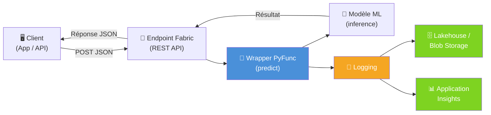
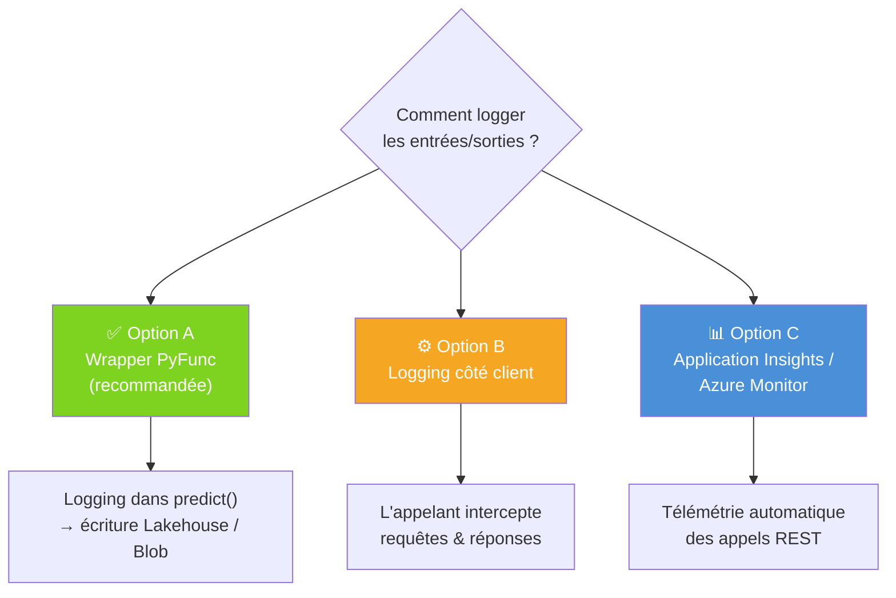
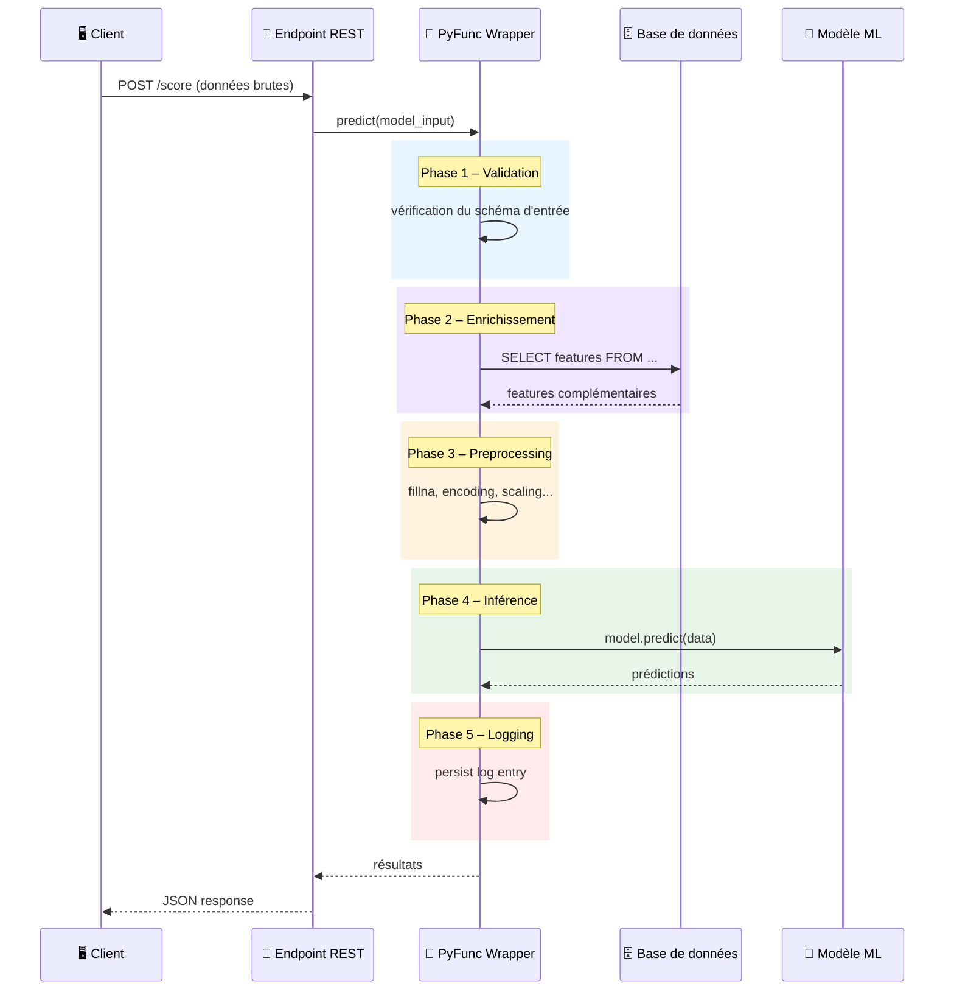
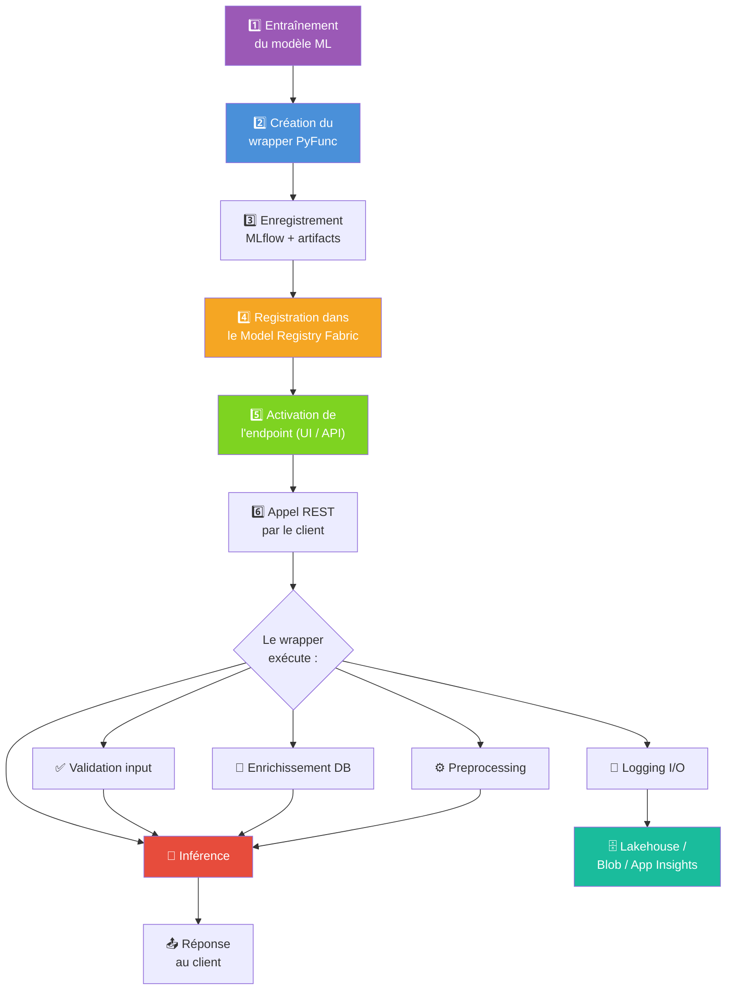
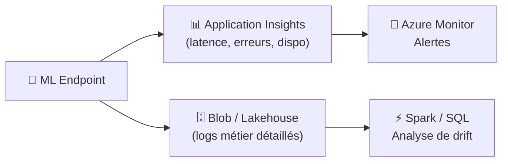

# 🤖 Microsoft Fabric – ML Endpoints : Bonnes Pratiques

> **Contexte** : Ce document répond aux questions fréquentes sur l'utilisation des **ML Model Endpoints (Preview)** dans Microsoft Fabric pour l'inférence en temps réel. Il couvre le logging systématique des entrées/sorties, la personnalisation des endpoints via un wrapper MLflow PyFunc, et fournit des exemples de code complets prêts à adapter.

---

## 💬 Questions traitées dans ce document

> *« Pour nos endpoints auto-déployés à partir des ML Model, nous souhaiterions mettre en place un logging systématique des entrées/sorties. Quelle est la méthode préconisée dans Fabric pour persister ces logs ? »*
>
> *« Nous avons besoin de surcharger le comportement de certains endpoints, soit pour intégrer des appels DB, soit pour du preprocessing à la volée. La méthode officielle consiste-t-elle à utiliser un wrapper MLflow PyFunc ? »*
>
> *« Est-ce que tu aurais des exemples à nous partager ? »*

**Réponses courtes** :
- ✅ **Logging I/O** → La méthode préconisée est d'utiliser un **wrapper `mlflow.pyfunc.PythonModel`** qui intercepte les entrées/sorties dans la méthode `predict()` et les persiste vers un **Lakehouse**, **Azure Blob Storage** ou **Application Insights**.
- ✅ **Personnalisation (preprocessing, appels DB)** → Oui, la méthode officielle est bien le **wrapper MLflow PyFunc**. C'est le point d'extension principal dans l'architecture des ML Model Endpoints de Fabric.
- ✅ **Exemples** → Ce document contient des exemples de code complets et commentés.

---

## 📌 Sommaire

1. [Logging des entrées/sorties des endpoints](#1--logging-des-entréessorties-des-endpoints)
2. [Personnalisation des endpoints (preprocessing, appels DB)](#2--personnalisation-des-endpoints-preprocessing-appels-db)
3. [Workflow complet de bout en bout](#3--workflow-complet-de-bout-en-bout)
4. [Bonnes pratiques de production](#4--bonnes-pratiques-de-production)
5. [Appel REST de l'endpoint](#5--appel-rest-de-lendpoint)

---

## 1. 📋 Logging des entrées/sorties des endpoints

### Pourquoi logger ?

| Raison | Détail |
|---|---|
| **Audit & conformité** | Tracer qui a demandé quoi, quand, avec quelle version du modèle |
| **Debugging** | Reproduire un résultat inattendu en rejouant l'entrée |
| **Monitoring de drift** | Détecter un changement dans la distribution des inputs ou outputs |
| **Facturation / métriques** | Compter les appels, mesurer la latence |

### Architecture recommandée



### Les 3 options possibles



| Option | Avantages | Inconvénients |
|---|---|---|
| **A – Wrapper PyFunc** ⭐ | Contrôle total, accès aux données brutes et transformées, même workspace | Ajoute de la latence si écriture synchrone |
| **B – Côté client** | Pas de modification du modèle | Ne capture pas les transformations internes |
| **C – Application Insights** | Télémétrie automatique, alertes Azure Monitor | Moins de détail sur le payload, coût éventuel |

> 💡 **Recommandation** : Combiner A + C. Le wrapper pour le logging métier détaillé, Application Insights pour le monitoring infra (latence, erreurs HTTP, disponibilité).

### Exemple de code – Option A (recommandée)

```python
import mlflow.pyfunc
import pandas as pd
import json
import datetime
import uuid
import logging

logger = logging.getLogger(__name__)

class LoggedModel(mlflow.pyfunc.PythonModel):
    """
    Wrapper PyFunc qui :
    1. Charge le modèle depuis les artifacts
    2. Exécute l'inférence
    3. Persiste un log structuré (entrées + sorties) dans Azure Blob Storage
    """

    def load_context(self, context):
        import joblib
        self.model = joblib.load(context.artifacts["model"])
        logger.info("✅ Modèle chargé avec succès")

    def predict(self, context, model_input: pd.DataFrame):
        request_id = str(uuid.uuid4())
        start_time = datetime.datetime.utcnow()

        # --- Inférence ---
        predictions = self.model.predict(model_input)

        # --- Construction du log ---
        log_entry = {
            "request_id": request_id,
            "timestamp": start_time.isoformat(),
            "duration_ms": (datetime.datetime.utcnow() - start_time).total_seconds() * 1000,
            "model_name": "MyModel",
            "input_shape": list(model_input.shape),
            "input": model_input.to_dict(orient="records"),
            "output": predictions.tolist()
        }

        # --- Persistance asynchrone (best-effort) ---
        try:
            self._persist_log(log_entry)
        except Exception as e:
            logger.error(f"❌ Échec du logging pour {request_id}: {e}")

        return predictions

    def _persist_log(self, log_entry):
        """Écrit le log en JSON dans Azure Blob Storage."""
        from azure.storage.blob import BlobServiceClient

        # ⚠️ En production, utiliser un secret manager (Key Vault)
        # et non une chaîne de connexion en dur
        conn_str = self._get_connection_string()
        client = BlobServiceClient.from_connection_string(conn_str)

        # Partitionnement par date pour faciliter les requêtes
        ts = log_entry["timestamp"][:10]  # YYYY-MM-DD
        blob_name = f"inference/{{ts}}/{{log_entry['request_id']}}.json"

        blob = client.get_blob_client("logs", blob_name)
        blob.upload_blob(json.dumps(log_entry, default=str), overwrite=True)

    def _get_connection_string(self):
        """
        Récupère la chaîne de connexion depuis Azure Key Vault.
        En production, remplacer par un appel Key Vault ou une variable d'environnement.
        """
        import os
        return os.environ.get("BLOB_CONN_STRING", "DefaultEndpointsProtocol=https;...")
```

### Variante – Logging vers le Lakehouse Fabric

```python
def _persist_log_lakehouse(self, log_entry):
    """Écrit le log directement dans une table Delta du Lakehouse Fabric.
    Utile si vous voulez requêter les logs avec SQL / Spark.
    """
    from pyspark.sql import SparkSession
    spark = SparkSession.builder.getOrCreate()

    df = spark.createDataFrame([log_entry])
    df.write.format("delta").mode("append").save(
        "Tables/inference_logs"
    )
```

---

## 2. 🔧 Personnalisation des endpoints (preprocessing, appels DB)

### Pourquoi un wrapper PyFunc ?

Les ML Model Endpoints de Fabric exécutent un modèle MLflow. Pour personnaliser le comportement (enrichissement, preprocessing, post-processing), la méthode officielle est de **wraper le modèle dans une classe `mlflow.pyfunc.PythonModel`** et de surcharger la méthode `predict()`.

Cela permet de :
- 🔌 **Enrichir** les données en appelant une base de données ou une API
- ⚙️ **Transformer** les features (fillna, encoding, scaling…)
- 📝 **Logger** les entrées/sorties
- 🛡️ **Valider** les inputs avant inférence
- 📊 **Post-traiter** les prédictions (calibration, seuils, business rules)

### Flux d'exécution dans le wrapper



### Structure du wrapper


### Exemple de code complet

```python
import mlflow.pyfunc
import pandas as pd
import datetime
import uuid
import logging

logger = logging.getLogger(__name__)

class CustomEndpointModel(mlflow.pyfunc.PythonModel):
    """
    Wrapper complet qui :
    1. Valide les inputs
    2. Enrichit les données depuis SQL Server
    3. Applique un preprocessing
    4. Exécute l'inférence
    5. Logue le tout
    """

    def load_context(self, context):
        import joblib
        import pyodbc

        # Chargement du modèle
        self.model = joblib.load(context.artifacts["model"])

        # Connexion DB (initialisée une seule fois au chargement)
        # ⚠️ En production : utiliser Key Vault pour les credentials
        self.conn = pyodbc.connect(
            "DRIVER={ODBC Driver 18 for SQL Server};"
            "SERVER=myserver.database.windows.net;"
            "DATABASE=mydb;"
            "Authentication=ActiveDirectoryMsi"  # Authentification managée
        )
        logger.info("✅ Modèle et connexion DB initialisés")

    def _validate_input(self, df: pd.DataFrame) -> pd.DataFrame:
        """Vérifie que les colonnes attendues sont présentes."""
        required_cols = {"customer_id", "col_a", "col_b"}
        missing = required_cols - set(df.columns)
        if missing:
            raise ValueError(f"❌ Colonnes manquantes : {missing}")
        return df

    def _enrich_from_db(self, df: pd.DataFrame) -> pd.DataFrame:
        """Récupère des features complémentaires depuis la base."""
        ids = tuple(df["customer_id"].tolist())
        if len(ids) == 1:
            ids = f"({ids[0]})"  # Gestion du cas tuple à un élément

        query = f"""
            SELECT customer_id, segment, credit_score
            FROM customers
            WHERE customer_id IN {ids}
        """
        extra_features = pd.read_sql(query, self.conn)
        return df.merge(extra_features, on="customer_id", how="left")

    def _preprocess(self, df: pd.DataFrame) -> pd.DataFrame:
        """Transformations avant inférence."""
        df = df.fillna(0)
        df["ratio"] = df["col_a"] / (df["col_b"] + 1)
        return df

    def predict(self, context, model_input: pd.DataFrame):
        request_id = str(uuid.uuid4())
        start = datetime.datetime.utcnow()

        # Pipeline complet
        validated = self._validate_input(model_input)
        enriched  = self._enrich_from_db(validated)
        processed = self._preprocess(enriched)
        predictions = self.model.predict(processed)

        # Logging best-effort
        duration_ms = (datetime.datetime.utcnow() - start).total_seconds() * 1000
        log_entry = {
            "request_id": request_id,
            "timestamp": start.isoformat(),
            "duration_ms": duration_ms,
            "input_rows": len(model_input),
            "input": model_input.to_dict(orient="records"),
            "output": predictions.tolist()
        }
        try:
            self._persist_log(log_entry)
        except Exception as e:
            logger.error(f"Logging failed for {request_id}: {e}")

        return predictions

    def _persist_log(self, log_entry):
        """Persistance du log vers Azure Blob (ou Lakehouse)."""
        import json
        from azure.storage.blob import BlobServiceClient
        import os

        conn_str = os.environ.get("BLOB_CONN_STRING")
        client = BlobServiceClient.from_connection_string(conn_str)
        ts = log_entry["timestamp"][:10]
        blob_name = f"inference/{{ts}}/{{log_entry['request_id']}}.json"
        blob = client.get_blob_client("logs", blob_name)
        blob.upload_blob(json.dumps(log_entry, default=str), overwrite=True)
```

### Enregistrement et déploiement

```python
import mlflow

# 1. Définir les artifacts (modèle entraîné + éventuellement un scaler, encoder, etc.)
artifacts = {
    "model": "path/to/trained_model.joblib"
}

# 2. Sauvegarder le modèle wrappé
mlflow.pyfunc.save_model(
    path="custom_endpoint_model",
    python_model=CustomEndpointModel(),
    artifacts=artifacts,
    pip_requirements=[
        "pandas",
        "scikit-learn",
        "pyodbc",
        "joblib",
        "azure-storage-blob"
    ]
)

# 3. Enregistrer dans le Model Registry de Fabric
mlflow.register_model(
    "runs:/<run_id>/custom_endpoint_model",
    "MyCustomModel"
)

# 4. Activer l'endpoint depuis l'UI Fabric :
#    Model Registry → MyCustomModel → "Create ML Model Endpoint"
#    Ou via l'API REST Fabric
```

---

## 3. 🚀 Workflow complet de bout en bout



### Étapes détaillées

| Étape | Action | Outil |
|---|---|---|
| 1️⃣ | Entraîner le modèle (scikit-learn, XGBoost, etc.) | Notebook Fabric + MLflow autolog |
| 2️⃣ | Créer la classe `CustomEndpointModel(PythonModel)` | Notebook Fabric |
| 3️⃣ | `mlflow.pyfunc.save_model(...)` avec artifacts et dépendances | MLflow |
| 4️⃣ | `mlflow.register_model(...)` dans le Model Registry | MLflow / UI Fabric |
| 5️⃣ | Créer l'endpoint depuis l'UI ou l'API REST | Fabric UI / API |
| 6️⃣ | Appeler via `POST https://<endpoint-url>/score` | Client HTTP |

---

## 4. 🛡️ Bonnes pratiques de production

### Sécurité

| Pratique | Détail |
|---|---|
| **Ne pas stocker de secrets dans le code** | Utiliser Azure Key Vault ou les variables d'environnement Fabric |
| **Authentification managée** | Préférer `Authentication=ActiveDirectoryMsi` pour les connexions DB |
| **Masquage PII** | Ne pas logger de données personnelles en clair (noms, emails, etc.) |
| **RBAC** | Configurer les rôles Contributor+ pour l'accès aux endpoints |

### Performance & fiabilité

| Pratique | Détail |
|---|---|
| **Logging asynchrone / best-effort** | Ne pas bloquer l'inférence si le logging échoue |
| **Connection pooling** | Initialiser la connexion DB dans `load_context()`, pas dans `predict()` |
| **Auto-sleep** | Les endpoints Fabric passent en veille après inactivité (~15 min). Le premier appel après veille prend ~30s. Prévoir un health check / warm-up si critique |
| **Timeouts** | Ajouter des timeouts sur les appels DB pour éviter les blocages |
| **Signature MLflow** | Toujours définir `infer_signature()` pour éviter les erreurs de schéma à l'inférence |

### Logging – Champs recommandés

```json
{
  "request_id": "uuid-v4",
  "timestamp": "2026-03-12T14:30:00.000Z",
  "model_name": "MyModel",
  "model_version": "3",
  "duration_ms": 42.5,
  "input_rows": 1,
  "input": [{"customer_id": 123, "col_a": 10, "col_b": 5}],
  "output": [0.87],
  "status": "success",
  "error": null
}
```

### Monitoring recommandé



---

## 5. 📡 Appel REST de l'endpoint

### Exemple Python (client)

```python
import requests

# URL de l'endpoint (visible dans l'UI Fabric après activation)
url = "https://<workspace>.fabric.microsoft.com/api/v1/workspaces/<ws-id>/mlmodels/<model-id>/score"

# Authentification via token Azure AD
headers = {
    "Authorization": "Bearer <access-token>",
    "Content-Type": "application/json"
}

# Payload d'inférence
payload = {
    "input_data": {
        "columns": ["customer_id", "col_a", "col_b"],
        "data": [[123, 10.0, 5.0]]
    }
}

response = requests.post(url, json=payload, headers=headers)
print(response.json())
```

### Exemple cURL

```bash
curl -X POST \
  "https://<workspace>.fabric.microsoft.com/api/v1/workspaces/<ws-id>/mlmodels/<model-id>/score" \
  -H "Authorization: Bearer <access-token>" \
  -H "Content-Type: application/json" \
  -d '{
    "input_data": {
        "columns": ["customer_id", "col_a", "col_b"],
        "data": [[123, 10.0, 5.0]]
    }
  }'
```

---

## 📚 Ressources

| Ressource | Lien |
|---|---|
| ML Model Endpoints (doc officielle) | [learn.microsoft.com](https://learn.microsoft.com/en-us/fabric/data-science/model-endpoints) |
| Blog – Real-time predictions | [blog.fabric.microsoft.com](https://blog.fabric.microsoft.com/en-us/blog/serve-real-time-predictions-seamlessly-with-ml-model-endpoints/) |
| PREDICT – Batch scoring | [learn.microsoft.com](https://learn.microsoft.com/en-us/fabric/data-science/model-scoring-predict) |
| Deploy MLflow models | [learn.microsoft.com](https://learn.microsoft.com/en-us/azure/machine-learning/how-to-deploy-mlflow-models) |
| MLflow dans Fabric | [community.fabric.microsoft.com](https://community.fabric.microsoft.com/t5/Data-Science-Community-Blog/Getting-Started-with-MLflow-in-Microsoft-Fabric/ba-p/4729188) |
| Dataflow Gen2 + ML Endpoints | [learn.microsoft.com](https://learn.microsoft.com/en-us/fabric/data-factory/dataflow-gen2-machine-learning-model-endpoints) |

---

## ✅ Synthèse

| Besoin | Solution | Section |
|---|---|---|
| **Logging I/O** | Wrapper `PythonModel` → Lakehouse / Blob / App Insights | [§1](#1--logging-des-entréessorties-des-endpoints) |
| **Preprocessing / appels DB** | Wrapper `PythonModel` → logique custom dans `predict()` | [§2](#2--personnalisation-des-endpoints-preprocessing-appels-db) |
| **Déploiement** | Model Registry Fabric → activation endpoint → REST API | [§3](#3--workflow-complet-de-bout-en-bout) |
| **Sécurité** | Key Vault, MSI auth, masquage PII, RBAC | [§4](#4--bonnes-pratiques-de-production) |
| **Appel client** | `POST /score` avec Bearer token Azure AD | [§5](#5--appel-rest-de-lendpoint) |

---

*Document mis à jour le 12/03/2026*