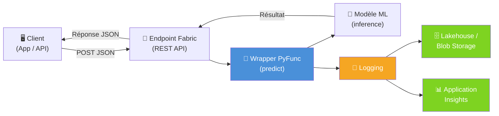
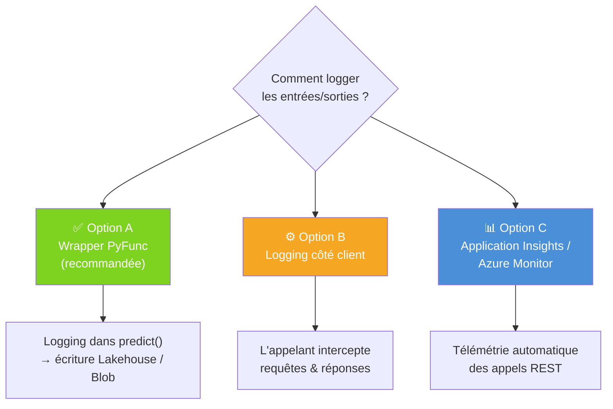
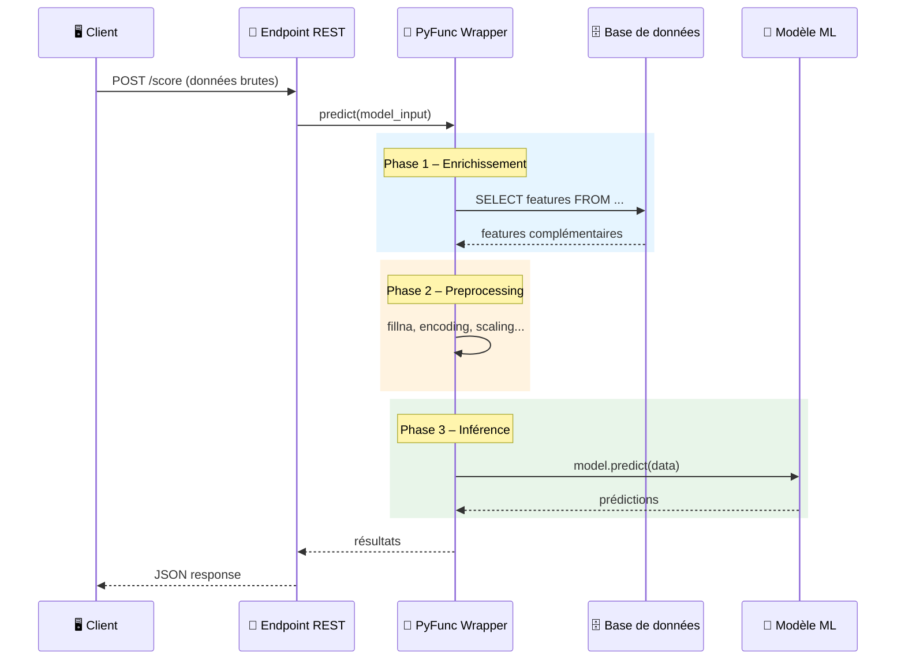
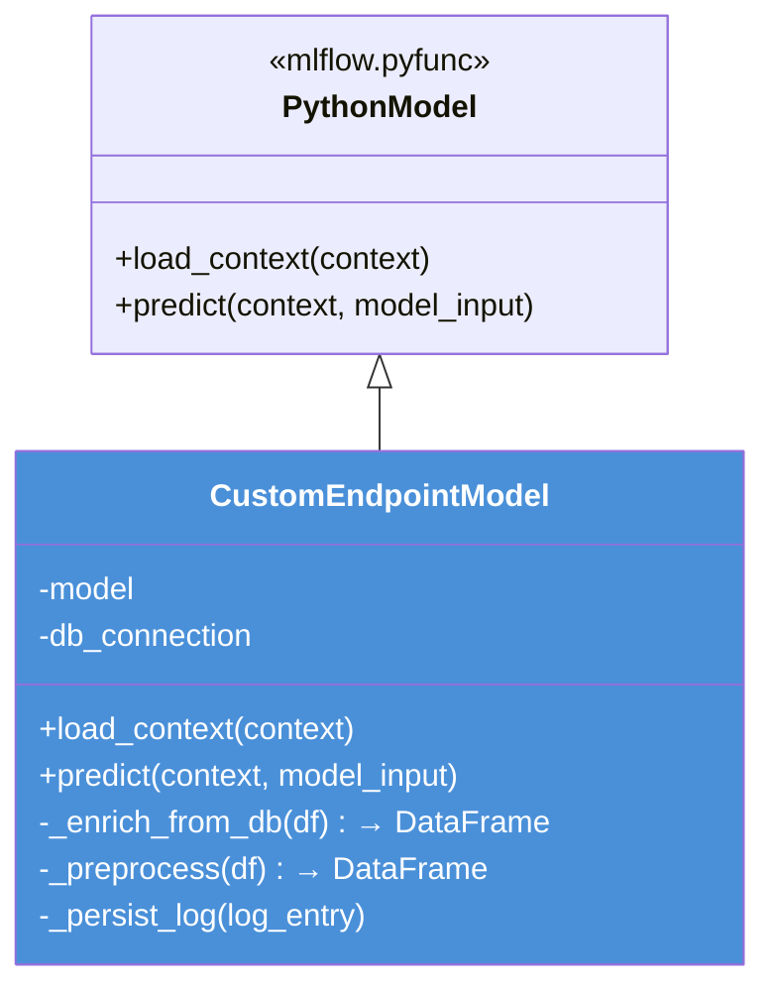
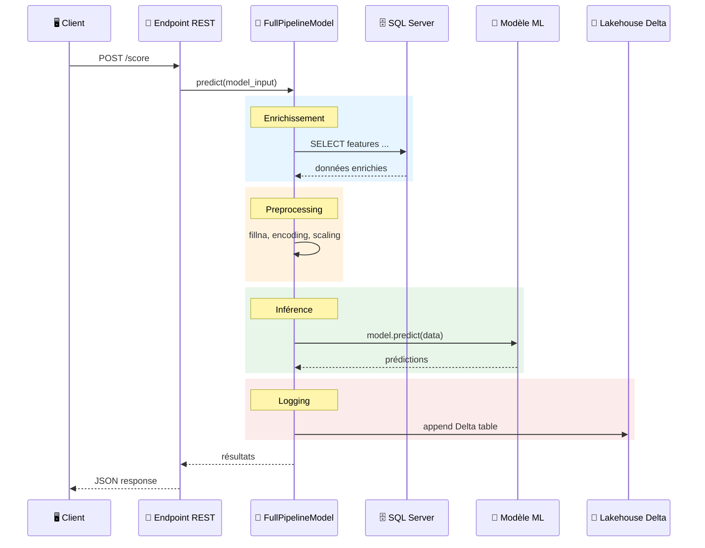
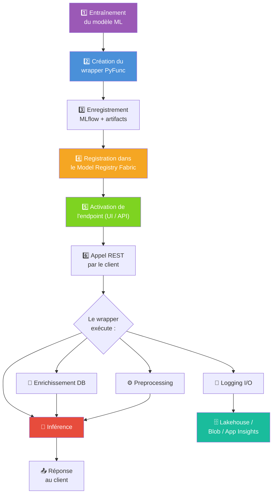

# 🤖 Microsoft Fabric – ML Endpoints : Bonnes Pratiques

> **Contexte** : Nous utilisons Microsoft Fabric pour déployer des modèles ML en temps réel via les ML Model Endpoints (Preview).

---

## 📌 Sommaire

1. [FAQ – Réponses rapides](#faq--réponses-rapides)
2. [Logging des entrées/sorties des endpoints](#1--logging-des-entréessorties-des-endpoints)
3. [Personnalisation des endpoints (preprocessing, appels DB)](#2--personnalisation-des-endpoints-preprocessing-appels-db)
4. [Exemple combiné : wrapper complet (logging + DB + preprocessing)](#3--exemple-combiné--wrapper-complet-logging--db--preprocessing)
5. [Appel REST du endpoint](#4--appel-rest-du-endpoint)
6. [Workflow complet de bout en bout](#5--workflow-complet-de-bout-en-bout)

---

## FAQ – Réponses rapides

| Question | Réponse courte |
|---|---|
| **Comment persister les logs d'entrées/sorties des endpoints Fabric ?** | La méthode préconisée est d'encapsuler votre modèle dans un **wrapper `mlflow.pyfunc.PythonModel`** et de logger dans la méthode `predict()`. Les logs peuvent être persistés vers un **Lakehouse (Delta table)**, un **Azure Blob Storage**, ou **Application Insights**. Voir [Section 1](#1--logging-des-entréessorties-des-endpoints). |
| **Faut-il utiliser un wrapper MLflow PyFunc pour surcharger le comportement des endpoints ?** | **Oui, c'est la méthode officielle.** En héritant de `mlflow.pyfunc.PythonModel`, vous surchargez `load_context()` (initialisation des connexions DB, chargement du modèle) et `predict()` (preprocessing, enrichissement DB, inférence, logging). Voir [Section 2](#2--personnalisation-des-endpoints-preprocessing-appels-db). |
| **Existe-t-il des exemples d'implémentation ?** | Oui ! Ce document fournit : un exemple de logging vers Blob Storage et Lakehouse Delta, un exemple de wrapper custom avec appels DB et preprocessing, et un **exemple combiné complet** intégrant les deux. Voir [Section 3](#3--exemple-combiné--wrapper-complet-logging--db--preprocessing). |

---

## 1. 📋 Logging des entrées/sorties des endpoints

### Architecture recommandée



### Les 3 options possibles



### Exemple de code (Option A – recommandée)

```python
import mlflow.pyfunc
import pandas as pd
import json, datetime

class LoggedModel(mlflow.pyfunc.PythonModel):

    def load_context(self, context):
        import joblib
        self.model = joblib.load(context.artifacts["model"])

    def predict(self, context, model_input: pd.DataFrame):
        predictions = self.model.predict(model_input)

        log_entry = {
            "timestamp": str(datetime.datetime.utcnow()),
            "input": model_input.to_dict(orient="records"),
            "output": predictions.tolist()
        }
        self._persist_log(log_entry)
        return predictions

    def _persist_log(self, log_entry):
        from azure.storage.blob import BlobServiceClient
        client = BlobServiceClient.from_connection_string("CONN_STRING")
        blob = client.get_blob_client("logs", f"inference/{{log_entry['timestamp']}}.json")
        blob.upload_blob(json.dumps(log_entry))
```

### Exemple de code (Option A bis – Lakehouse Delta, natif Fabric)

> Dans Fabric, la persistance la plus naturelle est l'écriture directe dans une **Delta table** du Lakehouse.

```python
import mlflow.pyfunc
import pandas as pd
import json, datetime

class LoggedModelLakehouse(mlflow.pyfunc.PythonModel):

    def load_context(self, context):
        import joblib
        self.model = joblib.load(context.artifacts["model"])

    def predict(self, context, model_input: pd.DataFrame):
        predictions = self.model.predict(model_input)

        log_df = pd.DataFrame([{
            "timestamp": str(datetime.datetime.utcnow()),
            "input": json.dumps(model_input.to_dict(orient="records")),
            "output": json.dumps(predictions.tolist()),
            "model_name": "my_model",
            "endpoint": "my_endpoint"
        }])

        # Écriture dans une Delta table du Lakehouse Fabric
        from delta.tables import DeltaTable
        spark = self._get_spark()
        spark_df = spark.createDataFrame(log_df)
        spark_df.write.format("delta").mode("append").save(
            "Tables/inference_logs"
        )

        return predictions

    @staticmethod
    def _get_spark():
        from pyspark.sql import SparkSession
        return SparkSession.builder.getOrCreate()
```

---

## 2. 🔧 Personnalisation des endpoints (preprocessing, appels DB)

### Flux d'exécution dans le wrapper



### Structure du wrapper



### Exemple de code complet

```python
import mlflow.pyfunc
import pandas as pd

class CustomEndpointModel(mlflow.pyfunc.PythonModel):

    def load_context(self, context):
        import joblib, pyodbc
        self.model = joblib.load(context.artifacts["model"])
        self.conn = pyodbc.connect(
            "DRIVER={ODBC Driver 18 for SQL Server};"
            "SERVER=myserver.database.windows.net;"
            "DATABASE=mydb;UID=user;PWD=pass"
        )

    def _enrich_from_db(self, df: pd.DataFrame) -> pd.DataFrame:
        ids = tuple(df["customer_id"].tolist())
        query = f"SELECT customer_id, segment, credit_score FROM customers WHERE customer_id IN {{ids}}"
        return df.merge(pd.read_sql(query, self.conn), on="customer_id", how="left")

    def _preprocess(self, df: pd.DataFrame) -> pd.DataFrame:
        df = df.fillna(0)
        df["ratio"] = df["col_a"] / (df["col_b"] + 1)
        return df

    def predict(self, context, model_input: pd.DataFrame):
        enriched  = self._enrich_from_db(model_input)
        processed = self._preprocess(enriched)
        return self.model.predict(processed)
```

### Enregistrement et déploiement

```python
import mlflow

artifacts = {"model": "path/to/trained_model.joblib"}

mlflow.pyfunc.save_model(
    path="custom_endpoint_model",
    python_model=CustomEndpointModel(),
    artifacts=artifacts,
    pip_requirements=["pandas", "scikit-learn", "pyodbc", "joblib"]
)

mlflow.register_model("runs:/<run_id>/custom_endpoint_model", "MyCustomModel")
```

---

## 3. 🔗 Exemple combiné : wrapper complet (logging + DB + preprocessing)

> Cet exemple montre un wrapper unique qui **combine** enrichissement DB, preprocessing, inférence et logging I/O.



### Code complet

```python
import mlflow.pyfunc
import pandas as pd
import json, datetime

class FullPipelineModel(mlflow.pyfunc.PythonModel):
    """
    Wrapper complet combinant :
    - Enrichissement depuis une base SQL
    - Preprocessing des features
    - Inférence du modèle
    - Logging des entrées/sorties dans un Lakehouse Delta
    """

    def load_context(self, context):
        import joblib, pyodbc
        # Chargement du modèle sérialisé
        self.model = joblib.load(context.artifacts["model"])
        # Connexion à la base de données (initialisée une seule fois)
        self.conn = pyodbc.connect(
            "DRIVER={ODBC Driver 18 for SQL Server};"
            "SERVER=myserver.database.windows.net;"
            "DATABASE=mydb;UID=user;PWD=pass"
        )

    def predict(self, context, model_input: pd.DataFrame):
        # 1. Enrichissement DB
        enriched = self._enrich_from_db(model_input)
        # 2. Preprocessing
        processed = self._preprocess(enriched)
        # 3. Inférence
        predictions = self.model.predict(processed)
        # 4. Logging
        self._persist_log(model_input, predictions)

        return predictions

    def _enrich_from_db(self, df: pd.DataFrame) -> pd.DataFrame:
        ids = tuple(df["customer_id"].tolist())
        query = f"SELECT customer_id, segment, credit_score FROM customers WHERE customer_id IN {ids}"
        extra = pd.read_sql(query, self.conn)
        return df.merge(extra, on="customer_id", how="left")

    def _preprocess(self, df: pd.DataFrame) -> pd.DataFrame:
        df = df.fillna(0)
        df["ratio"] = df["col_a"] / (df["col_b"] + 1)
        return df

    def _persist_log(self, model_input: pd.DataFrame, predictions):
        log_df = pd.DataFrame([{
            "timestamp": str(datetime.datetime.utcnow()),
            "input": json.dumps(model_input.to_dict(orient="records")),
            "output": json.dumps(predictions.tolist()),
        }])
        from delta.tables import DeltaTable
        from pyspark.sql import SparkSession
        spark = SparkSession.builder.getOrCreate()
        spark.createDataFrame(log_df).write.format("delta").mode("append").save(
            "Tables/inference_logs"
        )
```

### Enregistrement et déploiement du wrapper combiné

```python
import mlflow

artifacts = {"model": "path/to/trained_model.joblib"}

mlflow.pyfunc.save_model(
    path="full_pipeline_model",
    python_model=FullPipelineModel(),
    artifacts=artifacts,
    pip_requirements=["pandas", "scikit-learn", "pyodbc", "joblib", "delta-spark"]
)

mlflow.register_model("runs:/<run_id>/full_pipeline_model", "FullPipelineModel")
```

---

## 4. 🌐 Appel REST du endpoint

> Une fois le endpoint activé dans Fabric, il expose une API REST que vous pouvez appeler depuis n'importe quel client.

### Exemple Python (requests)

```python
import requests
import json

url = "https://<workspace>.fabric.microsoft.com/api/v1/endpoints/<endpoint_name>/score"
headers = {
    "Authorization": "Bearer <access_token>",
    "Content-Type": "application/json"
}

payload = {
    "input_data": {
        "columns": ["customer_id", "col_a", "col_b"],
        "data": [
            [1001, 45.2, 12.8],
            [1002, 30.1, 8.5]
        ]
    }
}

response = requests.post(url, headers=headers, json=payload)
print(response.status_code)
print(response.json())
```

### Exemple cURL

```bash
curl -X POST \
  "https://<workspace>.fabric.microsoft.com/api/v1/endpoints/<endpoint_name>/score" \
  -H "Authorization: Bearer <access_token>" \
  -H "Content-Type: application/json" \
  -d '{
    "input_data": {
      "columns": ["customer_id", "col_a", "col_b"],
      "data": [[1001, 45.2, 12.8]]
    }
  }'
```

---

## 5. 🚀 Workflow complet de bout en bout



---

## 📚 Ressources

| Ressource | Lien |
|---|---|
| ML Model Endpoints | [learn.microsoft.com](https://learn.microsoft.com/en-us/fabric/data-science/model-endpoints) |
| Blog – Real-time predictions | [blog.fabric.microsoft.com](https://blog.fabric.microsoft.com/en-us/blog/serve-real-time-predictions-seamlessly-with-ml-model-endpoints/) |
| PREDICT – Batch scoring | [learn.microsoft.com](https://learn.microsoft.com/en-us/fabric/data-science/model-scoring-predict) |
| Deploy MLflow models | [learn.microsoft.com](https://learn.microsoft.com/en-us/azure/machine-learning/how-to-deploy-mlflow-models) |

---

## ✅ Synthèse

| Besoin | Solution | Section |
|---|---|---|
| **Logging I/O** | Wrapper `PythonModel` → Lakehouse Delta / Blob / App Insights | [Section 1](#1--logging-des-entréessorties-des-endpoints) |
| **Preprocessing / appels DB** | Wrapper `PythonModel` → logique custom dans `predict()` | [Section 2](#2--personnalisation-des-endpoints-preprocessing-appels-db) |
| **Exemple combiné complet** | Wrapper unique intégrant logging + DB + preprocessing | [Section 3](#3--exemple-combiné--wrapper-complet-logging--db--preprocessing) |
| **Appel du endpoint** | REST API (Python `requests` / cURL) | [Section 4](#4--appel-rest-du-endpoint) |
| **Déploiement** | Model Registry Fabric → activation endpoint → REST API | [Section 5](#5--workflow-complet-de-bout-en-bout) |

---

*Document généré le 12/03/2026*