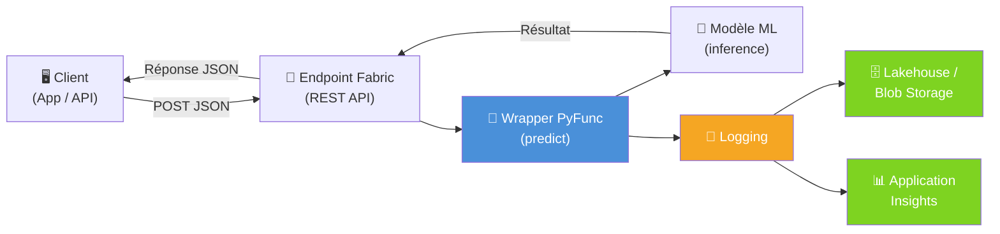
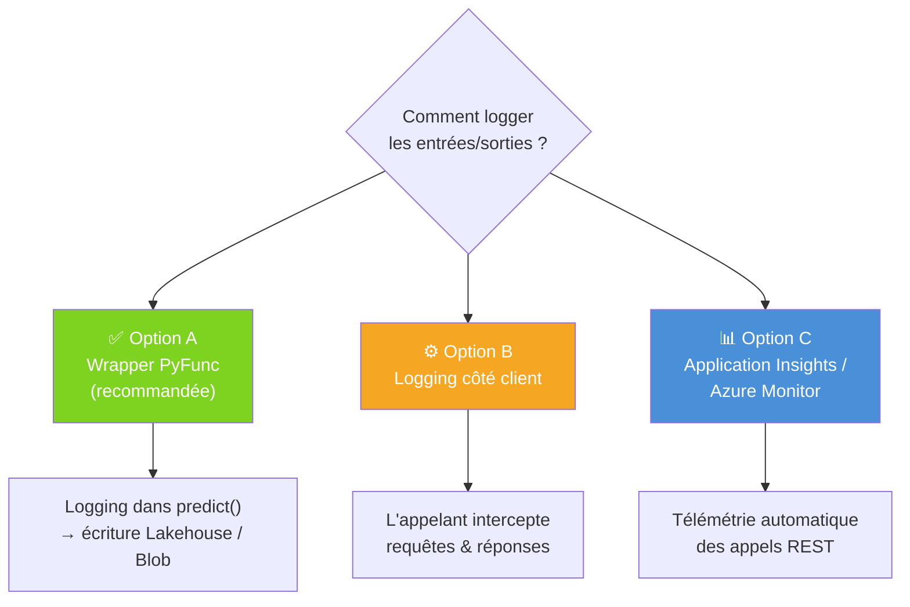
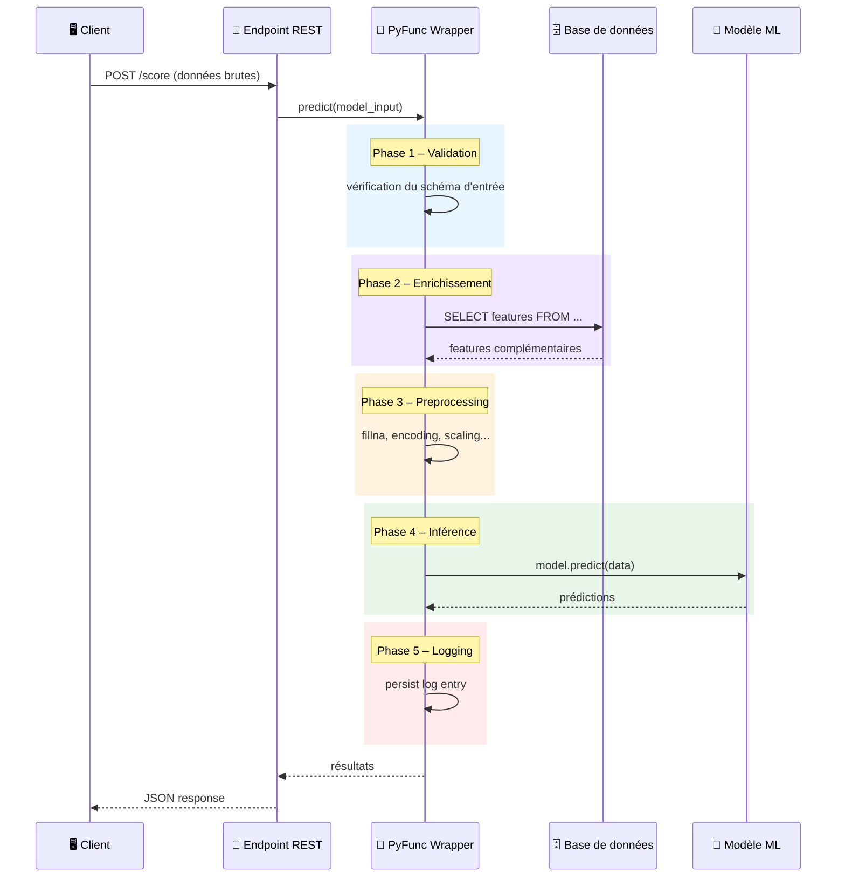
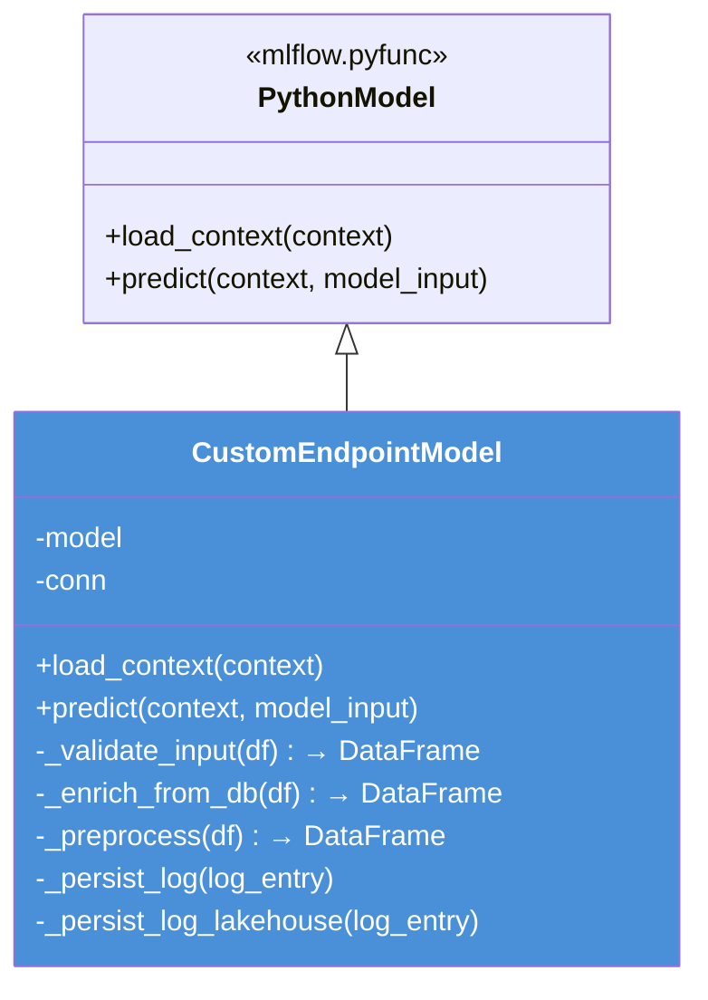
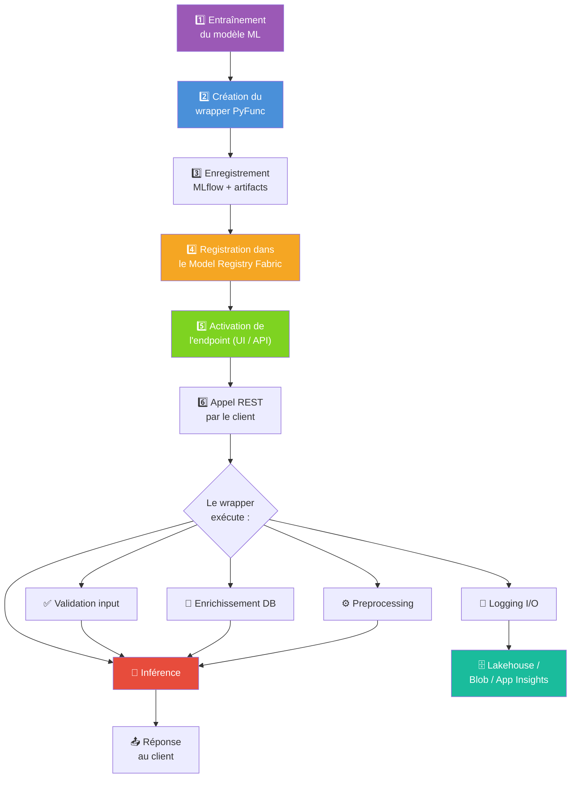
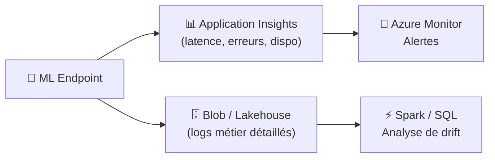

# 🤖 Microsoft Fabric – ML Endpoints : Bonnes Pratiques

> **Contexte** : Ce document répond aux questions fréquentes sur l'utilisation des **ML Model Endpoints (Preview)** dans Microsoft Fabric pour l'inférence en temps réel. Il couvre le logging systématique des entrées/sorties, la personnalisation des endpoints via un wrapper MLflow PyFunc, et fournit des exemples de code complets prêts à adapter.

---

## 💬 Contexte

> Ce document adresse trois problématiques clés rencontrées lors de l'utilisation des **ML Model Endpoints (Preview)** dans Microsoft Fabric :
>
> 1. **Comment mettre en place un logging systématique des entrées/sorties** des endpoints auto-déployés, et quelle méthode de persistance privilégier dans Fabric.
> 2. **Comment personnaliser le comportement des endpoints** pour y intégrer du preprocessing, des appels à une base de données, ou toute autre logique métier autour de l'inférence.
> 3. **Quels exemples de code concrets** permettent d'implémenter ces solutions de bout en bout.

**Réponses courtes** :
- ✅ **Logging I/O** → La méthode préconisée est d'utiliser un **wrapper `mlflow.pyfunc.PythonModel`** qui intercepte les entrées/sorties dans la méthode `predict()` et les persiste vers un **Lakehouse**, **Azure Blob Storage** ou **Application Insights**.
- ✅ **Personnalisation (preprocessing, appels DB)** → Oui, la méthode officielle est bien le **wrapper MLflow PyFunc**. C'est le point d'extension principal dans l'architecture des ML Model Endpoints de Fabric.
- ✅ **Exemples** → Ce document contient des exemples de code complets et commentés.

---

## 📌 Sommaire

1. [Logging des entrées/sorties des endpoints](#1--logging-des-entréessorties-des-endpoints)
2. [Personnalisation des endpoints (preprocessing, appels DB)](#2--personnalisation-des-endpoints-preprocessing-appels-db)
3. [Workflow complet de bout en bout](#3--workflow-complet-de-bout-en-bout)
4. [Bonnes pratiques de production](#4--bonnes-pratiques-de-production)
5. [Appel REST de l'endpoint](#5--appel-rest-de-lendpoint)
6. [Tests unitaires (PyTest)](#6--tests-unitaires-pytest)

---

## 1. 📋 Logging des entrées/sorties des endpoints

### Pourquoi logger ?

| Raison | Détail |
|---|---|
| **Audit & conformité** | Tracer qui a demandé quoi, quand, avec quelle version du modèle |
| **Debugging** | Reproduire un résultat inattendu en rejouant l'entrée |
| **Monitoring de drift** | Détecter un changement dans la distribution des inputs ou outputs |
| **Facturation / métriques** | Compter les appels, mesurer la latence |

### Architecture recommandée



### Les 3 options possibles



| Option | Avantages | Inconvénients |
|---|---|---|
| **A – Wrapper PyFunc** ⭐ | Contrôle total, accès aux données brutes et transformées, même workspace | Ajoute de la latence si écriture synchrone |
| **B – Côté client** | Pas de modification du modèle | Ne capture pas les transformations internes |
| **C – Application Insights** | Télémétrie automatique, alertes Azure Monitor | Moins de détail sur le payload, coût éventuel |

> 💡 **Recommandation** : Combiner A + C. Le wrapper pour le logging métier détaillé, Application Insights pour le monitoring infra (latence, erreurs HTTP, disponibilité).

### Exemple de code – Option A (recommandée)

```python
import mlflow.pyfunc
import pandas as pd
import json
import datetime
import uuid
import logging

logger = logging.getLogger(__name__)

class LoggedModel(mlflow.pyfunc.PythonModel):
    """
    Wrapper PyFunc qui :
    1. Charge le modèle depuis les artifacts
    2. Exécute l'inférence
    3. Persiste un log structuré (entrées + sorties) dans Azure Blob Storage
    """

    def load_context(self, context):
        import joblib
        self.model = joblib.load(context.artifacts["model"])
        logger.info("✅ Modèle chargé avec succès")

    def predict(self, context, model_input: pd.DataFrame):
        request_id = str(uuid.uuid4())
        start_time = datetime.datetime.utcnow()

        # --- Inférence ---
        predictions = self.model.predict(model_input)

        # --- Construction du log ---
        log_entry = {
            "request_id": request_id,
            "timestamp": start_time.isoformat(),
            "duration_ms": (datetime.datetime.utcnow() - start_time).total_seconds() * 1000,
            "model_name": "MyModel",
            "input_shape": list(model_input.shape),
            "input": model_input.to_dict(orient="records"),
            "output": predictions.tolist()
        }

        # --- Persistance asynchrone (best-effort) ---
        try:
            self._persist_log(log_entry)
        except Exception as e:
            logger.error(f"❌ Échec du logging pour {request_id}: {e}")

        return predictions

    def _persist_log(self, log_entry):
        """Écrit le log en JSON dans Azure Blob Storage."""
        from azure.storage.blob import BlobServiceClient

        # ⚠️ En production, utiliser un secret manager (Key Vault)
        # et non une chaîne de connexion en dur
        conn_str = self._get_connection_string()
        client = BlobServiceClient.from_connection_string(conn_str)

        # Partitionnement par date pour faciliter les requêtes
        ts = log_entry["timestamp"][:10]  # YYYY-MM-DD
        blob_name = f"inference/{ts}/{log_entry['request_id']}.json"

        blob = client.get_blob_client("logs", blob_name)
        blob.upload_blob(json.dumps(log_entry, default=str), overwrite=True)

    def _get_connection_string(self):
        """
        Récupère la chaîne de connexion depuis Azure Key Vault.
        En production, remplacer par un appel Key Vault ou une variable d'environnement.
        """
        import os
        return os.environ.get("BLOB_CONN_STRING", "DefaultEndpointsProtocol=https;...")
```

### Variante – Logging vers le Lakehouse Fabric

> ℹ️ Cette méthode est désormais intégrée directement dans la classe `CustomEndpointModel` via `_persist_log_lakehouse()` (voir [§2](#2--personnalisation-des-endpoints-preprocessing-appels-db)). Voici la version standalone pour référence :

```python
def _persist_log_lakehouse(self, log_entry):
    """Écrit le log directement dans une table Delta du Lakehouse Fabric.
    Utile si vous voulez requêter les logs avec SQL / Spark.
    """
    from pyspark.sql import SparkSession
    spark = SparkSession.builder.getOrCreate()

    df = spark.createDataFrame([log_entry])
    df.write.format("delta").mode("append").save(
        "Tables/inference_logs"
    )
```

---

## 2. 🔧 Personnalisation des endpoints (preprocessing, appels DB)

### Pourquoi un wrapper PyFunc ?

Les ML Model Endpoints de Fabric exécutent un modèle MLflow. Pour personnaliser le comportement (enrichissement, preprocessing, post-processing), la méthode officielle est de **wraper le modèle dans une classe `mlflow.pyfunc.PythonModel`** et de surcharger la méthode `predict()`.

Cela permet de :
- 🔌 **Enrichir** les données en appelant une base de données ou une API
- ⚙️ **Transformer** les features (fillna, encoding, scaling…)
- 📝 **Logger** les entrées/sorties
- 🛡️ **Valider** les inputs avant inférence
- 📊 **Post-traiter** les prédictions (calibration, seuils, business rules)

### Flux d'exécution dans le wrapper



### Les 10 exigences de conception de la classe `CustomEndpointModel`

La classe `CustomEndpointModel` hérite de `mlflow.pyfunc.PythonModel` et implémente un pipeline d'inférence complet. Voici les 10 exigences que cette classe doit respecter :

| # | Exigence | Méthode concernée | Description |
|---|---|---|---|
| 1 | **Validation des entrées** | `_validate_input()` | Vérifie que toutes les colonnes attendues (`customer_id`, `col_a`, `col_b`) sont présentes dans le DataFrame d'entrée. Lève une `ValueError` explicite si des colonnes sont manquantes. |
| 2 | **Enrichissement SQL via identité managée** | `_enrich_from_db()` | Interroge une base SQL Server via `pyodbc` en utilisant l'authentification `ActiveDirectoryMsi` (identité managée Azure). Récupère des features complémentaires (`segment`, `credit_score`) et les fusionne avec les données d'entrée. |
| 3 | **Prétraitement des données** | `_preprocess()` | Applique des transformations avant l'inférence : remplacement des valeurs manquantes (`fillna(0)`) et calcul de nouvelles features (ex : `ratio = col_a / (col_b + 1)`). |
| 4 | **Inférence scikit-learn** | `predict()` + `load_context()` | Charge le modèle scikit-learn depuis les artifacts MLflow via `joblib.load()` dans `load_context()`, puis appelle `model.predict()` dans `predict()`. |
| 5 | **Logging vers Azure Blob Storage** | `_persist_log()` | Persiste un log structuré au format JSON dans Azure Blob Storage. Chaque log contient : `request_id`, `timestamp`, `duration_ms`, les entrées, les sorties, le statut et les erreurs éventuelles. Le partitionnement se fait par date (`inference/YYYY-MM-DD/<uuid>.json`). |
| 6 | **Traçabilité via `logging`** | Toutes les méthodes | Utilise la bibliothèque standard `logging` pour tracer les étapes clés : chargement du modèle, initialisation de la connexion DB, début/fin de l'inférence, erreurs rencontrées. |
| 7 | **Gestion robuste des erreurs** | `predict()`, `_enrich_from_db()`, `_persist_log()` | Encapsule les appels critiques (DB, enrichissement, logging) dans des blocs `try/except`. Le logging est en mode *best-effort* : un échec de logging ne bloque pas la réponse. Les erreurs d'enrichissement DB sont également capturées et tracées. |
| 8 | **Logging alternatif Lakehouse Fabric** | `_persist_log_lakehouse()` | Méthode alternative qui écrit les logs dans une table Delta du Lakehouse Fabric via Spark, permettant ensuite de les requêter avec SQL/Spark. |
| 9 | **Docstrings explicatifs** | Toutes les méthodes | Chaque méthode dispose d'une docstring décrivant son rôle, ses paramètres, ses valeurs de retour et les exceptions levées. |
| 10 | **Test unitaire PyTest** | `test_validate_input()` | Un test PyTest valide le comportement de `_validate_input()` : cas nominal (colonnes présentes) et cas d'erreur (colonnes manquantes → `ValueError`). Voir [§6](#6--tests-unitaires-pytest). |

### Structure du wrapper



### Exemple de code complet

> ℹ️ Ce code implémente les **10 exigences** décrites ci-dessus. Chaque méthode est documentée et les blocs `try/except` garantissent une gestion robuste des erreurs.

```python
import mlflow.pyfunc
import pandas as pd
import datetime
import uuid
import json
import logging

logger = logging.getLogger(__name__)

class CustomEndpointModel(mlflow.pyfunc.PythonModel):
    """
    Wrapper MLflow PyFunc pour un endpoint personnalisé dans Microsoft Fabric.

    Cette classe hérite de mlflow.pyfunc.PythonModel et implémente un pipeline
    d'inférence complet avec :
      1. Validation des données d'entrée (colonnes attendues).
      2. Enrichissement via une base SQL Server (identité managée Azure / pyodbc).
      3. Prétraitement (fillna, calcul de ratio).
      4. Inférence avec un modèle scikit-learn chargé depuis les artifacts.
      5. Logging structuré (JSON) vers Azure Blob Storage.
      6. Traçabilité via la bibliothèque logging.
      7. Gestion robuste des erreurs (try/except best-effort).
      8. Méthode alternative _persist_log_lakehouse() pour écrire dans un Lakehouse Fabric.

    Attributes:
        model: Le modèle scikit-learn chargé depuis les artifacts.
        conn: La connexion pyodbc vers SQL Server (identité managée).
    """

    def load_context(self, context):
        """
        Charge le modèle scikit-learn et initialise la connexion à la base de données.

        Cette méthode est appelée une seule fois par MLflow lors du chargement
        de l'endpoint. Elle charge le modèle depuis les artifacts (joblib) et
        ouvre une connexion persistante vers SQL Server via l'authentification
        ActiveDirectoryMsi (identité managée Azure).

        Args:
            context: Contexte MLflow contenant les artifacts et la configuration.

        Raises:
            FileNotFoundError: Si l'artifact du modèle est introuvable.
            pyodbc.Error: Si la connexion à la base de données échoue.
        """
        import joblib
        import pyodbc

        # Chargement du modèle scikit-learn depuis les artifacts
        logger.info("⏳ Chargement du modèle depuis les artifacts...")
        self.model = joblib.load(context.artifacts["model"])
        logger.info("✅ Modèle scikit-learn chargé avec succès")

        # Connexion DB avec identité managée Azure (initialisée une seule fois)
        # ⚠️ En production : utiliser Key Vault pour les paramètres de connexion
        try:
            self.conn = pyodbc.connect(
                "DRIVER={ODBC Driver 18 for SQL Server};"
                "SERVER=myserver.database.windows.net;"
                "DATABASE=mydb;"
                "Authentication=ActiveDirectoryMsi"  # Authentification via identité managée
            )
            logger.info("✅ Connexion DB initialisée (ActiveDirectoryMsi)")
        except Exception as e:
            logger.error(f"❌ Échec de la connexion DB : {e}")
            self.conn = None  # Le modèle peut fonctionner sans enrichissement DB

    def _validate_input(self, df: pd.DataFrame) -> pd.DataFrame:
        """
        Valide que le DataFrame d'entrée contient toutes les colonnes attendues.

        Vérifie la présence des colonnes requises : 'customer_id', 'col_a', 'col_b'.
        Lève une ValueError avec la liste des colonnes manquantes si la validation
        échoue.

        Args:
            df (pd.DataFrame): Le DataFrame d'entrée à valider.

        Returns:
            pd.DataFrame: Le DataFrame validé (inchangé si la validation réussit).

        Raises:
            ValueError: Si une ou plusieurs colonnes requises sont absentes.
        """
        required_cols = {"customer_id", "col_a", "col_b"}
        missing = required_cols - set(df.columns)
        if missing:
            logger.error(f"❌ Colonnes manquantes : {missing}")
            raise ValueError(f"❌ Colonnes manquantes : {missing}")
        logger.info("✅ Validation des colonnes d'entrée réussie")
        return df

    def _enrich_from_db(self, df: pd.DataFrame) -> pd.DataFrame:
        """
        Enrichit les données en interrogeant une base SQL Server via identité managée.

        Récupère les features complémentaires (segment, credit_score) depuis la table
        'customers' et les fusionne (LEFT JOIN) avec le DataFrame d'entrée. Si la
        connexion DB n'est pas disponible ou si la requête échoue, retourne le
        DataFrame d'origine sans enrichissement (mode dégradé).

        Args:
            df (pd.DataFrame): Le DataFrame contenant au minimum la colonne 'customer_id'.

        Returns:
            pd.DataFrame: Le DataFrame enrichi avec les colonnes 'segment' et 'credit_score',
                          ou le DataFrame d'origine en cas d'erreur.
        """
        if self.conn is None:
            logger.warning("⚠️ Pas de connexion DB – enrichissement ignoré")
            return df

        try:
            ids = tuple(df["customer_id"].tolist())
            if len(ids) == 1:
                ids = f"({ids[0]})"  # Gestion du cas tuple à un seul élément

            query = f"""
                SELECT customer_id, segment, credit_score
                FROM customers
                WHERE customer_id IN {ids}
            """
            extra_features = pd.read_sql(query, self.conn)
            enriched = df.merge(extra_features, on="customer_id", how="left")
            logger.info(f"✅ Enrichissement DB réussi ({len(extra_features)} lignes récupérées)")
            return enriched
        except Exception as e:
            logger.error(f"❌ Erreur lors de l'enrichissement DB : {e}")
            return df  # Mode dégradé : on continue sans enrichissement

    def _preprocess(self, df: pd.DataFrame) -> pd.DataFrame:
        """
        Applique les transformations de prétraitement avant l'inférence.

        Opérations effectuées :
          - Remplacement des valeurs manquantes par 0 (fillna).
          - Calcul d'une feature dérivée : ratio = col_a / (col_b + 1).

        Args:
            df (pd.DataFrame): Le DataFrame enrichi à prétraiter.

        Returns:
            pd.DataFrame: Le DataFrame prétraité, prêt pour l'inférence.
        """
        df = df.fillna(0)
        df["ratio"] = df["col_a"] / (df["col_b"] + 1)
        logger.info("✅ Prétraitement appliqué (fillna + ratio)")
        return df

    def predict(self, context, model_input: pd.DataFrame):
        """
        Exécute le pipeline complet : validation → enrichissement → preprocessing → inférence → logging.

        Orchestre les 5 phases du pipeline. Chaque phase critique est encapsulée dans
        un bloc try/except pour garantir la robustesse. Le logging est en mode best-effort :
        un échec de persistance des logs ne bloque pas la réponse au client.

        Args:
            context: Contexte MLflow (non utilisé directement dans predict).
            model_input (pd.DataFrame): Les données d'entrée envoyées par le client.

        Returns:
            numpy.ndarray: Les prédictions du modèle.

        Raises:
            ValueError: Si la validation des entrées échoue (colonnes manquantes).
        """
        request_id = str(uuid.uuid4())
        start = datetime.datetime.utcnow()
        error_msg = None
        predictions = None

        try:
            # Phase 1 – Validation
            validated = self._validate_input(model_input)

            # Phase 2 – Enrichissement (best-effort, mode dégradé si DB indisponible)
            enriched = self._enrich_from_db(validated)

            # Phase 3 – Prétraitement
            processed = self._preprocess(enriched)

            # Phase 4 – Inférence
            predictions = self.model.predict(processed)
            logger.info(f"✅ Inférence réussie pour {request_id} ({len(predictions)} prédictions)")

        except ValueError:
            raise  # Erreur de validation → remonter au client
        except Exception as e:
            error_msg = str(e)
            logger.error(f"❌ Erreur dans le pipeline pour {request_id}: {e}")
            raise

        finally:
            # Phase 5 – Logging (best-effort, ne bloque jamais la réponse)
            duration_ms = (datetime.datetime.utcnow() - start).total_seconds() * 1000
            log_entry = {
                "request_id": request_id,
                "timestamp": start.isoformat(),
                "duration_ms": duration_ms,
                "input_rows": len(model_input),
                "input": model_input.to_dict(orient="records"),
                "output": predictions.tolist() if predictions is not None else None,
                "status": "success" if error_msg is None else "error",
                "error": error_msg
            }
            try:
                self._persist_log(log_entry)
            except Exception as log_err:
                logger.error(f"❌ Échec du logging pour {request_id}: {log_err}")

        return predictions

    def _persist_log(self, log_entry):
        """
        Persiste le log d'inférence au format JSON dans Azure Blob Storage.

        Le log est partitionné par date (YYYY-MM-DD) et nommé par request_id
        pour faciliter les requêtes et l'audit.

        Structure du blob : inference/<YYYY-MM-DD>/<request_id>.json

        Args:
            log_entry (dict): Dictionnaire contenant les données de log
                              (request_id, timestamp, duration_ms, input, output, status, error).

        Raises:
            Exception: Si l'écriture dans le Blob Storage échoue.
        """
        from azure.storage.blob import BlobServiceClient
        import os

        conn_str = os.environ.get("BLOB_CONN_STRING")
        if not conn_str:
            logger.warning("⚠️ BLOB_CONN_STRING non définie – logging Blob ignoré")
            return

        client = BlobServiceClient.from_connection_string(conn_str)
        ts = log_entry["timestamp"][:10]  # YYYY-MM-DD
        blob_name = f"inference/{ts}/{log_entry['request_id']}.json"
        blob = client.get_blob_client("logs", blob_name)
        blob.upload_blob(json.dumps(log_entry, default=str), overwrite=True)
        logger.info(f"✅ Log persisté dans Blob Storage : {blob_name}")

    def _persist_log_lakehouse(self, log_entry):
        """
        Méthode alternative : persiste le log dans une table Delta du Lakehouse Fabric.

        Utilise PySpark pour écrire le log dans la table 'Tables/inference_logs'
        au format Delta, en mode append. Cela permet ensuite de requêter les logs
        avec SQL Analytics ou Spark dans Fabric.

        Args:
            log_entry (dict): Dictionnaire contenant les données de log
                              (request_id, timestamp, duration_ms, input, output, status, error).

        Raises:
            Exception: Si l'écriture dans le Lakehouse échoue.
        """
        try:
            from pyspark.sql import SparkSession
            spark = SparkSession.builder.getOrCreate()

            df = spark.createDataFrame([log_entry])
            df.write.format("delta").mode("append").save("Tables/inference_logs")
            logger.info("✅ Log persisté dans le Lakehouse Fabric (Delta)")
        except Exception as e:
            logger.error(f"❌ Échec de l'écriture Lakehouse : {e}")
```

### Enregistrement et déploiement

```python
import mlflow

# 1. Définir les artifacts (modèle entraîné + éventuellement un scaler, encoder, etc.)
artifacts = {
    "model": "path/to/trained_model.joblib"
}

# 2. Sauvegarder le modèle wrappé
mlflow.pyfunc.save_model(
    path="custom_endpoint_model",
    python_model=CustomEndpointModel(),
    artifacts=artifacts,
    pip_requirements=[
        "pandas",
        "scikit-learn",
        "pyodbc",
        "joblib",
        "azure-storage-blob"
    ]
)

# 3. Enregistrer dans le Model Registry de Fabric
mlflow.register_model(
    "runs:/<run_id>/custom_endpoint_model",
    "MyCustomModel"
)

# 4. Activer l'endpoint depuis l'UI Fabric :
#    Model Registry → MyCustomModel → "Create ML Model Endpoint"
#    Ou via l'API REST Fabric
```

---

## 3. 🚀 Workflow complet de bout en bout



### Étapes détaillées

| Étape | Action | Outil |
|---|---|---|
| 1️⃣ | Entraîner le modèle (scikit-learn, XGBoost, etc.) | Notebook Fabric + MLflow autolog |
| 2️⃣ | Créer la classe `CustomEndpointModel(PythonModel)` | Notebook Fabric |
| 3️⃣ | `mlflow.pyfunc.save_model(...)` avec artifacts et dépendances | MLflow |
| 4️⃣ | `mlflow.register_model(...)` dans le Model Registry | MLflow / UI Fabric |
| 5️⃣ | Créer l'endpoint depuis l'UI ou l'API REST | Fabric UI / API |
| 6️⃣ | Appeler via `POST https://<endpoint-url>/score` | Client HTTP |

---

## 4. 🛡️ Bonnes pratiques de production

### Sécurité

| Pratique | Détail |
|---|---|
| **Ne pas stocker de secrets dans le code** | Utiliser Azure Key Vault ou les variables d'environnement Fabric |
| **Authentification managée** | Préférer `Authentication=ActiveDirectoryMsi` pour les connexions DB |
| **Masquage PII** | Ne pas logger de données personnelles en clair (noms, emails, etc.) |
| **RBAC** | Configurer les rôles Contributor+ pour l'accès aux endpoints |

### Performance & fiabilité

| Pratique | Détail |
|---|---|
| **Logging asynchrone / best-effort** | Ne pas bloquer l'inférence si le logging échoue |
| **Connection pooling** | Initialiser la connexion DB dans `load_context()`, pas dans `predict()` |
| **Auto-sleep** | Les endpoints Fabric passent en veille après inactivité (~15 min). Le premier appel après veille prend ~30s. Prévoir un health check / warm-up si critique |
| **Timeouts** | Ajouter des timeouts sur les appels DB pour éviter les blocages |
| **Signature MLflow** | Toujours définir `infer_signature()` pour éviter les erreurs de schéma à l'inférence |

### Logging – Champs recommandés

```json
{
  "request_id": "uuid-v4",
  "timestamp": "2026-03-12T14:30:00.000Z",
  "model_name": "MyModel",
  "model_version": "3",
  "duration_ms": 42.5,
  "input_rows": 1,
  "input": [{"customer_id": 123, "col_a": 10, "col_b": 5}],
  "output": [0.87],
  "status": "success",
  "error": null
}
```

### Monitoring recommandé



---

## 5. 📡 Appel REST de l'endpoint

### Exemple Python (client)

```python
import requests

# URL de l'endpoint (visible dans l'UI Fabric après activation)
url = "https://<workspace>.fabric.microsoft.com/api/v1/workspaces/<ws-id>/mlmodels/<model-id>/score"

# Authentification via token Azure AD
headers = {
    "Authorization": "Bearer <access-token>",
    "Content-Type": "application/json"
}

# Payload d'inférence
payload = {
    "input_data": {
        "columns": ["customer_id", "col_a", "col_b"],
        "data": [[123, 10.0, 5.0]]
    }
}

response = requests.post(url, json=payload, headers=headers)
print(response.json())
```

### Exemple cURL

```bash
curl -X POST \
  "https://<workspace>.fabric.microsoft.com/api/v1/workspaces/<ws-id>/mlmodels/<model-id>/score" \
  -H "Authorization: Bearer <access-token>" \
  -H "Content-Type: application/json" \
  -d '{
    "input_data": {
        "columns": ["customer_id", "col_a", "col_b"],
        "data": [[123, 10.0, 5.0]]
    }
  }'
```

---

---

## 6. 🧪 Tests unitaires (PyTest)

### Pourquoi tester `_validate_input()` ?

La validation des entrées est la première ligne de défense de l'endpoint. Un test unitaire permet de :
- ✅ Vérifier que les colonnes valides sont acceptées sans erreur.
- ✅ Vérifier qu'une `ValueError` claire est levée quand des colonnes sont manquantes.
- ✅ S'assurer que le message d'erreur contient le nom des colonnes manquantes.
- ✅ Garantir la non-régression lors des évolutions du schéma.

### Exemple de test PyTest

> ℹ️ **Prérequis** : Enregistrez le code de la classe `CustomEndpointModel` dans un fichier nommé `custom_endpoint_model.py` dans le même répertoire que le fichier de test.

```python
import pytest
import pandas as pd
from custom_endpoint_model import CustomEndpointModel


@pytest.fixture
def model_instance():
    """Crée une instance de CustomEndpointModel sans charger de modèle ni de connexion DB."""
    instance = CustomEndpointModel()
    instance.model = None  # Pas besoin du modèle pour tester la validation
    instance.conn = None
    return instance


class TestValidateInput:
    """Tests unitaires pour la méthode _validate_input() de CustomEndpointModel."""

    def test_valid_input(self, model_instance):
        """Vérifie que _validate_input accepte un DataFrame avec toutes les colonnes requises."""
        df = pd.DataFrame({
            "customer_id": [1, 2, 3],
            "col_a": [10.0, 20.0, 30.0],
            "col_b": [5.0, 15.0, 25.0]
        })
        result = model_instance._validate_input(df)
        assert result.equals(df), "Le DataFrame retourné doit être identique à l'entrée"

    def test_valid_input_with_extra_columns(self, model_instance):
        """Vérifie que des colonnes supplémentaires ne provoquent pas d'erreur."""
        df = pd.DataFrame({
            "customer_id": [1],
            "col_a": [10.0],
            "col_b": [5.0],
            "extra_col": ["foo"]
        })
        result = model_instance._validate_input(df)
        assert "extra_col" in result.columns

    def test_missing_single_column(self, model_instance):
        """Vérifie qu'une ValueError est levée quand une colonne est manquante."""
        df = pd.DataFrame({
            "customer_id": [1],
            "col_a": [10.0]
            # col_b manquante
        })
        with pytest.raises(ValueError, match="Colonnes manquantes"):
            model_instance._validate_input(df)

    def test_missing_multiple_columns(self, model_instance):
        """Vérifie qu'une ValueError est levée quand plusieurs colonnes sont manquantes."""
        df = pd.DataFrame({
            "customer_id": [1]
            # col_a et col_b manquantes
        })
        with pytest.raises(ValueError, match="Colonnes manquantes"):
            model_instance._validate_input(df)

    def test_empty_dataframe_with_correct_columns(self, model_instance):
        """Vérifie qu'un DataFrame vide mais avec les bonnes colonnes est accepté."""
        df = pd.DataFrame(columns=["customer_id", "col_a", "col_b"])
        result = model_instance._validate_input(df)
        assert len(result) == 0

    def test_all_columns_missing(self, model_instance):
        """Vérifie qu'une ValueError est levée quand le DataFrame n'a aucune colonne attendue."""
        df = pd.DataFrame({"x": [1], "y": [2]})
        with pytest.raises(ValueError, match="Colonnes manquantes"):
            model_instance._validate_input(df)
```

### Exécution des tests

```bash
# Depuis le répertoire du projet
pytest test_custom_endpoint_model.py -v
```

Sortie attendue :

```
test_custom_endpoint_model.py::TestValidateInput::test_valid_input PASSED
test_custom_endpoint_model.py::TestValidateInput::test_valid_input_with_extra_columns PASSED
test_custom_endpoint_model.py::TestValidateInput::test_missing_single_column PASSED
test_custom_endpoint_model.py::TestValidateInput::test_missing_multiple_columns PASSED
test_custom_endpoint_model.py::TestValidateInput::test_empty_dataframe_with_correct_columns PASSED
test_custom_endpoint_model.py::TestValidateInput::test_all_columns_missing PASSED
```

---

## 📚 Ressources

| Ressource | Lien |
|---|---|
| ML Model Endpoints (doc officielle) | [learn.microsoft.com](https://learn.microsoft.com/en-us/fabric/data-science/model-endpoints) |
| Blog – Real-time predictions | [blog.fabric.microsoft.com](https://blog.fabric.microsoft.com/en-us/blog/serve-real-time-predictions-seamlessly-with-ml-model-endpoints/) |
| PREDICT – Batch scoring | [learn.microsoft.com](https://learn.microsoft.com/en-us/fabric/data-science/model-scoring-predict) |
| Deploy MLflow models | [learn.microsoft.com](https://learn.microsoft.com/en-us/azure/machine-learning/how-to-deploy-mlflow-models) |
| MLflow dans Fabric | [community.fabric.microsoft.com](https://community.fabric.microsoft.com/t5/Data-Science-Community-Blog/Getting-Started-with-MLflow-in-Microsoft-Fabric/ba-p/4729188) |
| Dataflow Gen2 + ML Endpoints | [learn.microsoft.com](https://learn.microsoft.com/en-us/fabric/data-factory/dataflow-gen2-machine-learning-model-endpoints) |

---

## ✅ Synthèse

| Besoin | Solution | Section |
|---|---|---|
| **Logging I/O** | Wrapper `PythonModel` → Lakehouse / Blob / App Insights | [§1](#1--logging-des-entréessorties-des-endpoints) |
| **Preprocessing / appels DB** | Wrapper `PythonModel` → logique custom dans `predict()` | [§2](#2--personnalisation-des-endpoints-preprocessing-appels-db) |
| **Déploiement** | Model Registry Fabric → activation endpoint → REST API | [§3](#3--workflow-complet-de-bout-en-bout) |
| **Sécurité** | Key Vault, MSI auth, masquage PII, RBAC | [§4](#4--bonnes-pratiques-de-production) |
| **Appel client** | `POST /score` avec Bearer token Azure AD | [§5](#5--appel-rest-de-lendpoint) |
| **Tests unitaires** | PyTest pour valider `_validate_input()` et le schéma d'entrée | [§6](#6--tests-unitaires-pytest) |

---

*Document mis à jour le 12/03/2026*