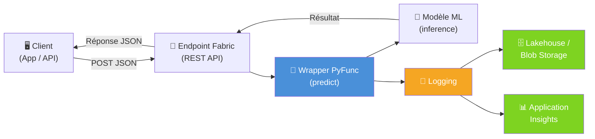
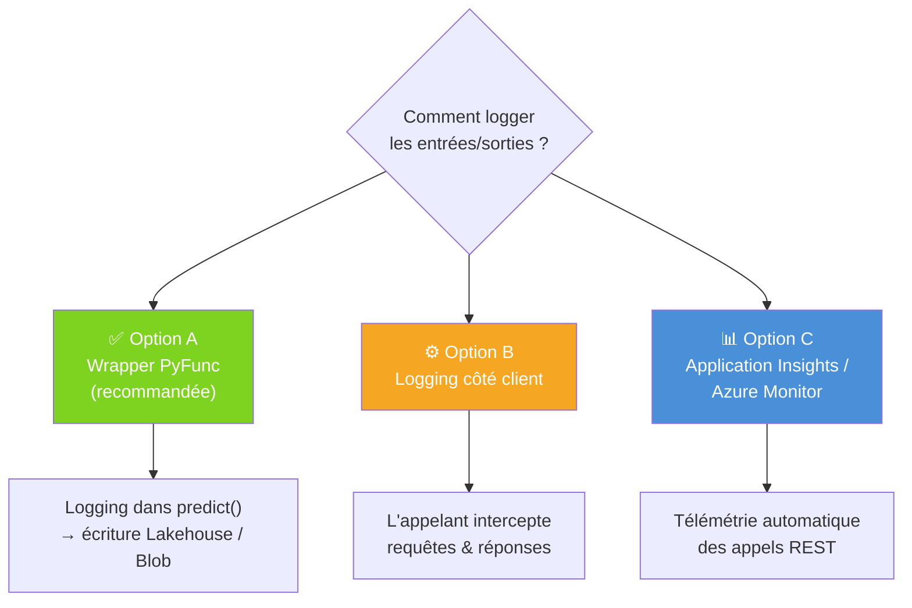
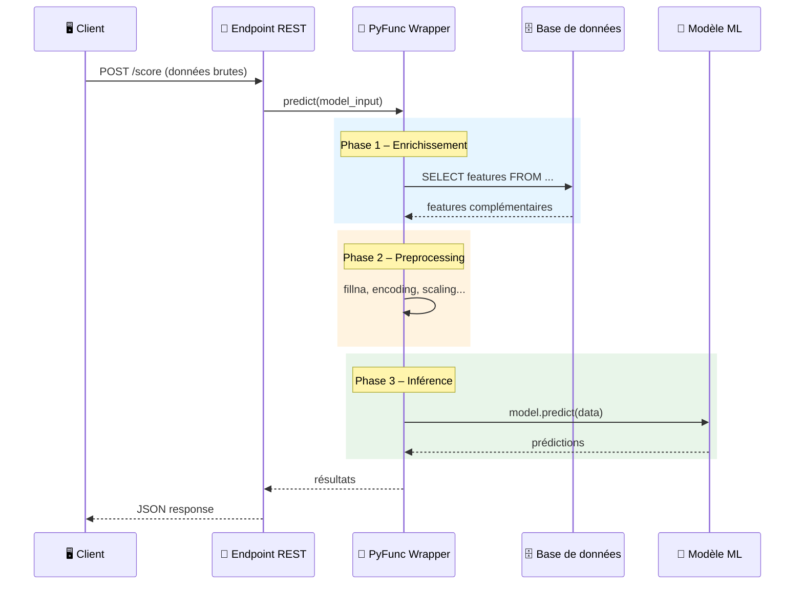
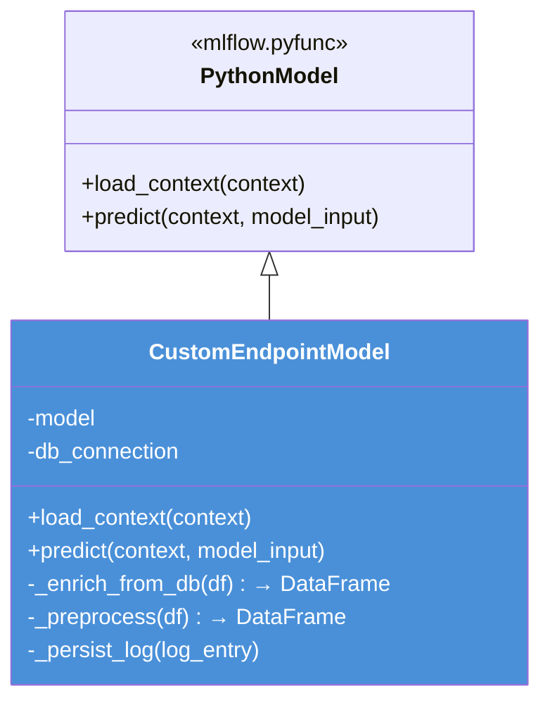
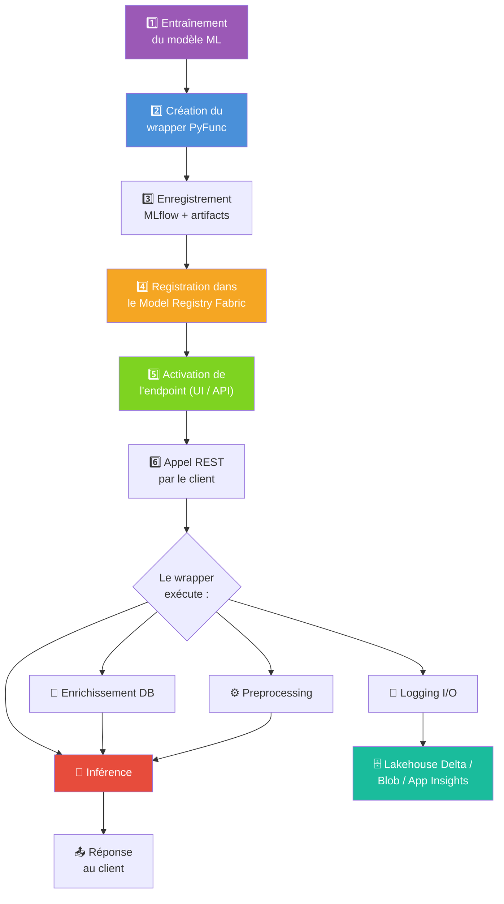

# 🤖 Microsoft Fabric – ML Endpoints : Bonnes Pratiques

> **Contexte** : Nous utilisons Microsoft Fabric pour déployer des modèles ML en temps réel via les ML Model Endpoints (Preview).

---

## 💬 Réponses aux questions

### ❓ Question 1 – Logging systématique des entrées/sorties d'endpoints

> *"Pour nos endpoints auto-déployés à partir des ML Model, nous souhaiterions mettre en place un logging systématique des entrées/sorties. Quelle est la méthode préconisée dans Fabric pour persister ces logs ?"*

**Réponse :** Il n'existe pas de mécanisme de logging natif et automatique des I/O dans les ML Model Endpoints Fabric (Preview). La méthode recommandée est d'**encapsuler votre modèle dans un wrapper `mlflow.pyfunc.PythonModel`** et d'y implémenter la logique de logging dans la méthode `predict()`. Pour la persistance, **le Lakehouse Fabric (tables Delta) est l'option la plus native** ; Azure Blob Storage et Application Insights sont également des alternatives valides.

> ⚠️ **Limitation Preview** : Les endpoints Fabric ne proposent pas encore de solution de data capture / logging out-of-the-box comme Azure ML (qui offre une option "data collection"). Tout doit être géré dans le code du wrapper.

---

### ❓ Question 2 – Surcharge du comportement (preprocessing, appels DB)

> *"Nous avons besoin de surcharger le comportement de certains endpoints, soit pour intégrer des appels DB, soit pour du preprocessing à la volée. La méthode officielle consiste-t-elle à utiliser un wrapper MLflow PyFunc (mlflow.pyfunc.PythonModel) ?"*

**Réponse :** **Oui, c'est exactement la méthode officielle.** Le wrapper `mlflow.pyfunc.PythonModel` est le point d'extension prévu par MLflow (et donc par Fabric) pour personnaliser le comportement d'un endpoint :

- `load_context()` → initialisation des ressources au démarrage (connexion DB, chargement d'artefacts, etc.)
- `predict()` → logique complète d'inférence : enrichissement, preprocessing, appel du modèle, logging

Il n'existe pas d'autre mécanisme officiel supporté par les endpoints Fabric pour injecter du code custom.

---

### ❓ Question 3 – Exemples d'implémentation

> *"Est-ce que tu aurais des exemples à partager pour qu'on puisse voir comment c'est implémenté ?"*

**Réponse :** Oui, les sections ci-dessous présentent des exemples complets et progressifs :
- **Section 1** : logging I/O vers Lakehouse Delta et Blob Storage
- **Section 2** : preprocessing et appels DB dans le wrapper
- **Section 3** : exemple combiné intégrant logging + enrichissement DB + preprocessing
- **Section 4** : workflow de déploiement de bout en bout

---

## 📌 Sommaire

1. [Logging des entrées/sorties des endpoints](#1--logging-des-entréessorties-des-endpoints)
2. [Personnalisation des endpoints (preprocessing, appels DB)](#2--personnalisation-des-endpoints-preprocessing-appels-db)
3. [Exemple complet combiné](#3--exemple-complet-combiné)
4. [Workflow complet de bout en bout](#4--workflow-complet-de-bout-en-bout)

---

## 1. 📋 Logging des entrées/sorties des endpoints

### Architecture recommandée



### Les 3 options possibles



### Exemple de code – Option A.1 : Logging vers Lakehouse Fabric (recommandé)

> 💡 **Méthode la plus native dans Fabric** : écriture directe dans une table Delta du Lakehouse via `notebookutils` ou `pyspark`.

```python
import mlflow.pyfunc
import pandas as pd
import datetime

class LoggedModelLakehouse(mlflow.pyfunc.PythonModel):

    def load_context(self, context):
        import joblib
        self.model = joblib.load(context.artifacts["model"])
        # Chemin de la table Delta de logs dans le Lakehouse Fabric
        # Remplacez <workspace> par l'ID de workspace, <storage> par le nom du compte ADLS Gen2,
        # et <lakehouse> par le nom de votre Lakehouse (ex. "mylakehouse")
        self.log_table_path = "abfss://<workspace>@<storage>.dfs.core.windows.net/<lakehouse>.Lakehouse/Tables/inference_logs"

    def predict(self, context, model_input: pd.DataFrame):
        predictions = self.model.predict(model_input)

        log_df = pd.DataFrame([{
            "timestamp": datetime.datetime.utcnow().isoformat(),
            "input_json": model_input.to_json(orient="records"),
            "output_json": pd.Series(predictions).to_json(orient="values"),
            "num_rows": len(model_input)
        }])
        self._persist_log_lakehouse(log_df)
        return predictions

    def _persist_log_lakehouse(self, log_df: pd.DataFrame):
        from pyspark.sql import SparkSession
        spark = SparkSession.builder.getOrCreate()
        spark_df = spark.createDataFrame(log_df)
        spark_df.write.format("delta").mode("append").save(self.log_table_path)
```

### Exemple de code – Option A.2 : Logging vers Azure Blob Storage

```python
import mlflow.pyfunc
import pandas as pd
import json, datetime

class LoggedModelBlob(mlflow.pyfunc.PythonModel):

    def load_context(self, context):
        import joblib
        self.model = joblib.load(context.artifacts["model"])

    def predict(self, context, model_input: pd.DataFrame):
        predictions = self.model.predict(model_input)

        log_entry = {
            "timestamp": datetime.datetime.utcnow().isoformat(),
            "input": model_input.to_dict(orient="records"),
            "output": predictions.tolist()
        }
        self._persist_log(log_entry)
        return predictions

    def _persist_log(self, log_entry: dict):
        from azure.storage.blob import BlobServiceClient
        client = BlobServiceClient.from_connection_string("CONN_STRING")
        # Sanitisation robuste du timestamp pour un nom de blob valide
        safe_ts = log_entry['timestamp'].replace(':', '-').replace('+', '').replace(' ', '_')
        blob_name = f"inference/{safe_ts}.json"
        blob = client.get_blob_client(container="logs", blob=blob_name)
        blob.upload_blob(json.dumps(log_entry))
```

---

## 2. 🔧 Personnalisation des endpoints (preprocessing, appels DB)

### Flux d'exécution dans le wrapper



### Structure du wrapper



### Exemple de code complet

```python
import mlflow.pyfunc
import pandas as pd

class CustomEndpointModel(mlflow.pyfunc.PythonModel):

    def load_context(self, context):
        import joblib, pyodbc
        self.model = joblib.load(context.artifacts["model"])
        self.conn = pyodbc.connect(
            "DRIVER={ODBC Driver 18 for SQL Server};"
            "SERVER=myserver.database.windows.net;"
            "DATABASE=mydb;UID=user;PWD=pass"
        )

    def _enrich_from_db(self, df: pd.DataFrame) -> pd.DataFrame:
        ids = tuple(df["customer_id"].tolist())
        query = (
            f"SELECT customer_id, segment, credit_score "
            f"FROM customers WHERE customer_id IN {ids}"
        )
        return df.merge(pd.read_sql(query, self.conn), on="customer_id", how="left")

    def _preprocess(self, df: pd.DataFrame) -> pd.DataFrame:
        df = df.fillna(0)
        df["ratio"] = df["col_a"] / (df["col_b"] + 1)
        return df

    def predict(self, context, model_input: pd.DataFrame):
        enriched  = self._enrich_from_db(model_input)
        processed = self._preprocess(enriched)
        return self.model.predict(processed)
```

### Enregistrement et déploiement

```python
import mlflow

artifacts = {"model": "path/to/trained_model.joblib"}

with mlflow.start_run():
    mlflow.pyfunc.log_model(
        artifact_path="custom_endpoint_model",
        python_model=CustomEndpointModel(),
        artifacts=artifacts,
        pip_requirements=["pandas", "scikit-learn", "pyodbc", "joblib"]
    )
    run_id = mlflow.active_run().info.run_id

mlflow.register_model(f"runs:/{run_id}/custom_endpoint_model", "MyCustomModel")
```

> 💡 Pour un exemple intégrant également le logging I/O, voir la **Section 3** ci-dessous.

---

## 3. 🔗 Exemple complet combiné

> Cet exemple intègre les trois besoins en un seul wrapper : **enrichissement DB + preprocessing + logging I/O vers Lakehouse**.

```python
import mlflow.pyfunc
import pandas as pd
import datetime

class FullCustomEndpointModel(mlflow.pyfunc.PythonModel):
    """
    Wrapper PyFunc complet intégrant :
    - Enrichissement depuis une base de données SQL
    - Preprocessing à la volée
    - Logging des entrées/sorties vers un Lakehouse Fabric (table Delta)
    """

    def load_context(self, context):
        import joblib, pyodbc
        # Chargement du modèle entraîné
        self.model = joblib.load(context.artifacts["model"])
        # Connexion à la base de données
        # ⚠️ En production, utilisez des variables d'environnement ou Azure Key Vault
        # pour les credentials (évitez les valeurs en dur)
        self.conn = pyodbc.connect(
            "DRIVER={ODBC Driver 18 for SQL Server};"
            "SERVER=myserver.database.windows.net;"
            "DATABASE=mydb;UID=user;PWD=pass"
        )
        # Chemin de la table Delta de logs dans le Lakehouse
        # Remplacez <workspace>, <storage> et <lakehouse> par vos valeurs Fabric
        self.log_table_path = (
            "abfss://<workspace>@<storage>.dfs.core.windows.net"
            "/<lakehouse>.Lakehouse/Tables/inference_logs"
        )

    # ------------------------------------------------------------------ #
    #  Phase 1 – Enrichissement depuis la DB                              #
    # ------------------------------------------------------------------ #
    def _enrich_from_db(self, df: pd.DataFrame) -> pd.DataFrame:
        ids = tuple(df["customer_id"].tolist())
        query = (
            f"SELECT customer_id, segment, credit_score "
            f"FROM customers WHERE customer_id IN {ids}"
        )
        extra = pd.read_sql(query, self.conn)
        return df.merge(extra, on="customer_id", how="left")

    # ------------------------------------------------------------------ #
    #  Phase 2 – Preprocessing                                            #
    # ------------------------------------------------------------------ #
    def _preprocess(self, df: pd.DataFrame) -> pd.DataFrame:
        df = df.fillna(0)
        df["ratio"] = df["col_a"] / (df["col_b"] + 1)
        return df

    # ------------------------------------------------------------------ #
    #  Phase 3 – Logging vers Lakehouse (table Delta)                     #
    # ------------------------------------------------------------------ #
    def _persist_log(self, model_input: pd.DataFrame, predictions) -> None:
        log_df = pd.DataFrame([{
            "timestamp": datetime.datetime.utcnow().isoformat(),
            "input_json": model_input.to_json(orient="records"),
            "output_json": pd.Series(predictions).to_json(orient="values"),
            "num_rows": len(model_input),
        }])
        try:
            from pyspark.sql import SparkSession
            spark = SparkSession.builder.getOrCreate()
            spark.createDataFrame(log_df).write \
                .format("delta").mode("append").save(self.log_table_path)
        except Exception as e:
            # Dégradation gracieuse : ne pas bloquer l'inférence si le log échoue
            # En production, remplacez par un logger configuré (logging.getLogger(__name__))
            import logging
            logging.getLogger(__name__).warning("Logging failed: %s", e)

    # ------------------------------------------------------------------ #
    #  Point d'entrée principal                                           #
    # ------------------------------------------------------------------ #
    def predict(self, context, model_input: pd.DataFrame):
        enriched  = self._enrich_from_db(model_input)
        processed = self._preprocess(enriched)
        predictions = self.model.predict(processed)
        self._persist_log(model_input, predictions)   # log entrée brute + sortie
        return predictions
```

### Enregistrement et déploiement du wrapper complet

```python
import mlflow

artifacts = {"model": "path/to/trained_model.joblib"}

with mlflow.start_run():
    mlflow.pyfunc.log_model(
        artifact_path="custom_endpoint_model",
        python_model=FullCustomEndpointModel(),
        artifacts=artifacts,
        pip_requirements=["pandas", "scikit-learn", "pyodbc", "joblib", "azure-storage-blob"]
    )
    run_id = mlflow.active_run().info.run_id

# Enregistrement dans le Model Registry Fabric
mlflow.register_model(f"runs:/{run_id}/custom_endpoint_model", "MyFullCustomModel")
```

---

## 4. 🚀 Workflow complet de bout en bout



---

## 📚 Ressources

| Ressource | Lien |
|---|---|
| ML Model Endpoints | [learn.microsoft.com](https://learn.microsoft.com/en-us/fabric/data-science/model-endpoints) |
| Blog – Real-time predictions | [blog.fabric.microsoft.com](https://blog.fabric.microsoft.com/en-us/blog/serve-real-time-predictions-seamlessly-with-ml-model-endpoints/) |
| PREDICT – Batch scoring | [learn.microsoft.com](https://learn.microsoft.com/en-us/fabric/data-science/model-scoring-predict) |
| Deploy MLflow models | [learn.microsoft.com](https://learn.microsoft.com/en-us/azure/machine-learning/how-to-deploy-mlflow-models) |
| MLflow PythonModel API | [mlflow.org](https://mlflow.org/docs/latest/python_api/mlflow.pyfunc.html#mlflow.pyfunc.PythonModel) |
| Delta Lake write (PySpark) | [docs.delta.io](https://docs.delta.io/latest/delta-batch.html) |

---

## ✅ Synthèse

| Besoin | Solution recommandée | Alternative |
|---|---|---|
| **Logging I/O** | Wrapper `PythonModel` → table Delta Lakehouse | Blob Storage / App Insights |
| **Preprocessing à la volée** | Logique custom dans `predict()` du wrapper | — |
| **Appels DB** | Connexion initialisée dans `load_context()` | — |
| **Combinaison logging + DB + preprocessing** | Un seul wrapper `PythonModel` (voir Section 3) | — |
| **Déploiement** | Model Registry Fabric → activation endpoint → REST API | — |

---

*Document généré le 12/03/2026*