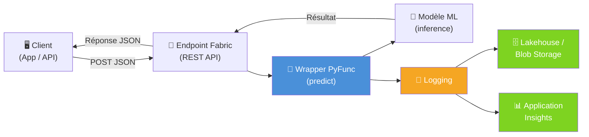
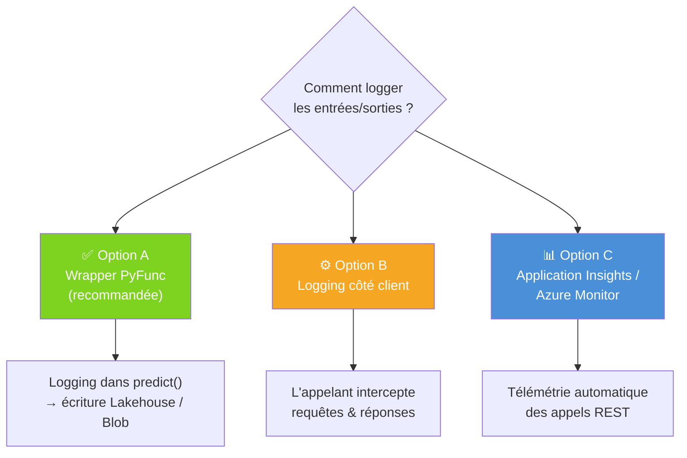
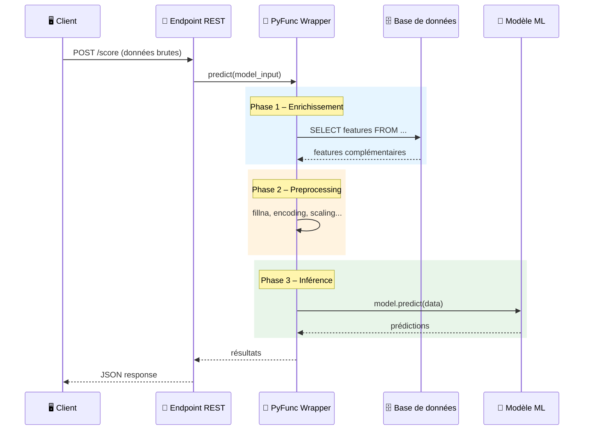
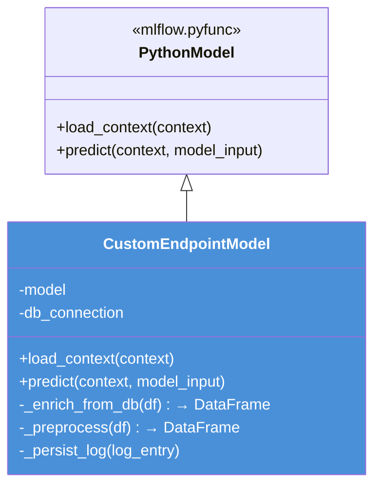
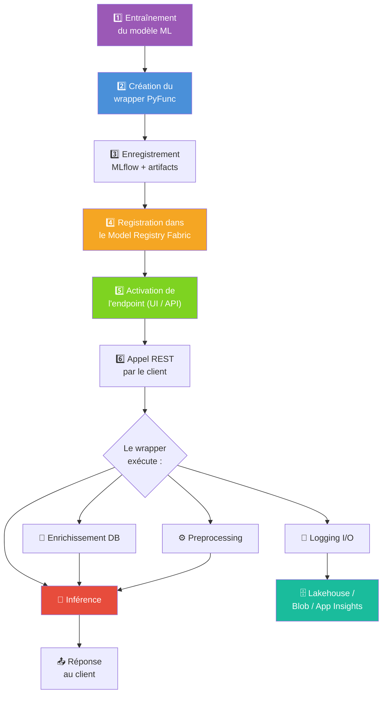

# 🤖 Microsoft Fabric – ML Endpoints : Bonnes Pratiques

> **Contexte** : Nous utilisons Microsoft Fabric pour déployer des modèles ML en temps réel via les ML Model Endpoints (Preview).

---

## 📌 Sommaire

1. [Logging des entrées/sorties des endpoints](#1--logging-des-entréessorties-des-endpoints)
2. [Personnalisation des endpoints (preprocessing, appels DB)](#2--personnalisation-des-endpoints-preprocessing-appels-db)
3. [Workflow complet de bout en bout](#3--workflow-complet-de-bout-en-bout)

---

## 1. 📋 Logging des entrées/sorties des endpoints

### Architecture recommandée



### Les 3 options possibles



### Exemple de code (Option A – recommandée)

```python
import mlflow.pyfunc
import pandas as pd
import json, datetime

class LoggedModel(mlflow.pyfunc.PythonModel):

    def load_context(self, context):
        import joblib
        self.model = joblib.load(context.artifacts["model"])

    def predict(self, context, model_input: pd.DataFrame):
        predictions = self.model.predict(model_input)

        log_entry = {
            "timestamp": str(datetime.datetime.utcnow()),
            "input": model_input.to_dict(orient="records"),
            "output": predictions.tolist()
        }
        self._persist_log(log_entry)
        return predictions

    def _persist_log(self, log_entry):
        from azure.storage.blob import BlobServiceClient
        client = BlobServiceClient.from_connection_string("CONN_STRING")
        blob = client.get_blob_client("logs", f"inference/{{log_entry['timestamp']}}.json")
        blob.upload_blob(json.dumps(log_entry))
```

---

## 2. 🔧 Personnalisation des endpoints (preprocessing, appels DB)

### Flux d'exécution dans le wrapper



### Structure du wrapper



### Exemple de code complet

```python
import mlflow.pyfunc
import pandas as pd

class CustomEndpointModel(mlflow.pyfunc.PythonModel):

    def load_context(self, context):
        import joblib, pyodbc
        self.model = joblib.load(context.artifacts["model"])
        self.conn = pyodbc.connect(
            "DRIVER={ODBC Driver 18 for SQL Server};"
            "SERVER=myserver.database.windows.net;"
            "DATABASE=mydb;UID=user;PWD=pass"
        )

    def _enrich_from_db(self, df: pd.DataFrame) -> pd.DataFrame:
        ids = tuple(df["customer_id"].tolist())
        query = f"SELECT customer_id, segment, credit_score FROM customers WHERE customer_id IN {{ids}}"
        return df.merge(pd.read_sql(query, self.conn), on="customer_id", how="left")

    def _preprocess(self, df: pd.DataFrame) -> pd.DataFrame:
        df = df.fillna(0)
        df["ratio"] = df["col_a"] / (df["col_b"] + 1)
        return df

    def predict(self, context, model_input: pd.DataFrame):
        enriched  = self._enrich_from_db(model_input)
        processed = self._preprocess(enriched)
        return self.model.predict(processed)
```

### Enregistrement et déploiement

```python
import mlflow

artifacts = {"model": "path/to/trained_model.joblib"}

mlflow.pyfunc.save_model(
    path="custom_endpoint_model",
    python_model=CustomEndpointModel(),
    artifacts=artifacts,
    pip_requirements=["pandas", "scikit-learn", "pyodbc", "joblib"]
)

mlflow.register_model("runs:/<run_id>/custom_endpoint_model", "MyCustomModel")
```

---

## 3. 🚀 Workflow complet de bout en bout



---

## 📚 Ressources

| Ressource | Lien |
|---|---|
| ML Model Endpoints | [learn.microsoft.com](https://learn.microsoft.com/en-us/fabric/data-science/model-endpoints) |
| Blog – Real-time predictions | [blog.fabric.microsoft.com](https://blog.fabric.microsoft.com/en-us/blog/serve-real-time-predictions-seamlessly-with-ml-model-endpoints/) |
| PREDICT – Batch scoring | [learn.microsoft.com](https://learn.microsoft.com/en-us/fabric/data-science/model-scoring-predict) |
| Deploy MLflow models | [learn.microsoft.com](https://learn.microsoft.com/en-us/azure/machine-learning/how-to-deploy-mlflow-models) |

---

## ✅ Synthèse

| Besoin | Solution |
|---|---|
| **Logging I/O** | Wrapper `PythonModel` → Lakehouse / Blob / App Insights |
| **Preprocessing / appels DB** | Wrapper `PythonModel` → logique custom dans `predict()` |
| **Déploiement** | Model Registry Fabric → activation endpoint → REST API |

---

*Document généré le 12/03/2026*