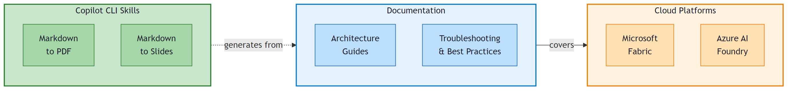

# Fabric, Foundry & Databases — Knowledge Base

> **Technical reference guides, architecture deep-dives, and developer tooling for Microsoft Fabric and Azure AI Foundry.**



A collection of field-tested technical documents covering **network security**, **data connectivity**, **ML operations**, and **AI agent architectures** on the Microsoft cloud platform. Each guide includes detailed Mermaid diagrams, decision matrices, and actionable configuration steps — built for **architects, platform engineers, and developers**.

The repository also ships two **GitHub Copilot CLI skills** (`md2pdf` and `md2prez`) that automate document and presentation generation from Markdown.

## Contents

### Technical Guides

| Document | PDF | Description |
|----------|-----|-------------|
| [Fabric_Network_Security](markdown/Fabric_Network_Security.md) | [PDF](pdf/Fabric_Network_Security.pdf) | Network configurations in Microsoft Fabric — Inbound protection (Private Links, IP Firewall, Conditional Access), secure outbound (Trusted Workspace Access, Managed Private Endpoints, Gateways), data exfiltration prevention, DNS, monitoring, and 16 colored Mermaid diagrams |
| [Fabric_PrivateLink_MFA_Loop_Resolution](markdown/Fabric_PrivateLink_MFA_Loop_Resolution.md) | [PDF](pdf/Fabric_PrivateLink_MFA_Loop_Resolution.pdf) | Troubleshooting guide: MFA authentication loop when accessing Microsoft Fabric via Azure Private Link. Root cause analysis, Mermaid diagrams, and reusable validation scripts |
| [Fabric_Workspace_MPE_Prerequisites](markdown/Fabric_Workspace_MPE_Prerequisites.md) | [PDF](pdf/Fabric_Workspace_MPE_Prerequisites.pdf) | Quick reference for Workspace **Managed Private Endpoint (MPE)** prerequisites — capacity (F64+), tenant settings, subscription/RP, permissions, target resource requirements, approval workflow, item-level compatibility, limits and pre-deployment checklist |
| [MLinFabric](markdown/MLinFabric.md) | [PDF](pdf/MLinFabric.pdf) | Best practices for ML Model Endpoints in Microsoft Fabric |
| [Foundry_Agents_MCP_Tools](markdown/Foundry_Agents_MCP_Tools.md) | [PDF](pdf/Foundry_Agents_MCP_Tools.pdf) | Azure AI Foundry Agents & MCP Tools — Prompt Agent vs Hosted Agent comparison with MongoDB MCP examples, architecture diagrams, and deployment guide |
| [Foundry_Agent_Monitoring_APIM](markdown/Foundry_Agent_Monitoring_APIM.md) | [PDF](pdf/Foundry_Agent_Monitoring_APIM.pdf) | Monitoring Foundry agents via APIM AI Gateway — per-user/per-agent token and cost tracking with Application Insights, KQL queries, dashboards, and alerts |
| [APIM_AI_Gateway_Multi_Foundry](markdown/APIM_AI_Gateway_Multi_Foundry.md) | [PDF](pdf/APIM_AI_Gateway_Multi_Foundry.pdf) | Scaling multiple Foundry resources behind a single APIM AI Gateway — named backends, Backend Pool with weighted/priority load balancing & circuit breaker, semantic routing (preview), centralized Bicep IaC, mid-chat throttling and agent-to-agent quota patterns |
| [Complete_Agent_Development_Guide](markdown/Complete_Agent_Development_Guide.md) | [PDF](pdf/Complete_Agent_Development_Guide.pdf) | End-to-end industrialization guide for AI agents on Microsoft Foundry — Microsoft Agent Framework v1.0, Foundry Toolkit for VS Code, agent harness patterns, **Memory** (preview), **Toolbox** (preview, single MCP endpoint), the refreshed **Hosted Agents** (per-session VM-isolated sandbox, scale-to-zero, BYO VNet, Entra Agent ID), reference architecture, CI/CD with `azd`, security/observability/FinOps, production checklist. Companion drawio architecture in [`drawio/Foundry_Agent_Reference_Architecture.drawio`](drawio/Foundry_Agent_Reference_Architecture.drawio) |
| [SAP_Fabric_Connectivity](markdown/SAP_Fabric_Connectivity.md) | [PDF](pdf/SAP_Fabric_Connectivity.pdf) | SAP connectivity in Microsoft Fabric — all connection methods (8 connectors, Mirroring GA, Copy Job CDC, decision guide) |
| [FromSItoSystemAgency](markdown/FromSItoSystemAgency.md) | [PDF](pdf/FromSItoSystemAgency.pdf) | From SI to System Agency — Fabric Storyboard Copilot case study: a PowerPoint × Microsoft Fabric add-in built in 13.3 hours by one developer with a Squad of 8 Copilot agents (vs 43 man-days estimated traditionally). Architecture, methodology, cost model, and the shift from selling man-days to selling outcomes |

### Presentations

| Presentation | Description |
|-------------|-------------|
| [prez/fabric-network-security-standard/](prez/fabric-network-security-standard/) | Marp slide deck — Network Security in Microsoft Fabric. Standard layout: 20+ slides, pre-rendered Mermaid diagrams, callout boxes. Run with `cd prez/fabric-network-security-standard && npm install && npm run dev` |
| [prez/fabric-network-security-editorial/](prez/fabric-network-security-editorial/) | Same topic — **editorial redesign**. Magazine-style theme (cards, big stats, chapter markers, asymmetric layouts, dark closing). More visual, less dense. Run with `cd prez/fabric-network-security-editorial && npm install && npm run dev` |
| [prez/sap-fabric-connectivity-editorial/](prez/sap-fabric-connectivity-editorial/) | **SAP × Microsoft Fabric** — editorial deck covering all 8 integration patterns (batch, mirroring, CDC, federation, events, BDC Connect). Same magazine-style theme. Run with `cd prez/sap-fabric-connectivity-editorial && npm install && npm run dev` |
| [prez/from-si-to-system-agency-editorial/](prez/from-si-to-system-agency-editorial/) | **From SI to System Agency** — case study deck for the Fabric Storyboard Copilot project (PowerPoint × Microsoft Fabric add-in built in 13.3 h with a Squad of 8 agents). Covers project, methodology (Spec Kit · Agent Forge · Squad · Copilot CLI · Agent Store), cost model, and the SI→Agency thesis. Run with `cd prez/from-si-to-system-agency-editorial && npm install && npm run dev` |

### Copilot CLI Skills

| Skill | Description |
|-------|-------------|
| [skills/md2pdf](skills/md2pdf) | Generate professional PDFs from Markdown with Mermaid diagram support (pandoc + xelatex) |
| [skills/md2prez](skills/md2prez) | Generate HTML slide presentations from Markdown with Marp CLI, custom CSS themes, and pre-rendered Mermaid diagrams |
| [skills/drawio2png](skills/drawio2png) | Render `.drawio` files to PNG without clipping. Bypasses the draw.io desktop CLI bbox bug (content beyond x≈1370px gets cropped) by exporting to SVG and rasterising via Puppeteer |

## Generating PDFs

PDFs are generated via **pandoc** with Mermaid diagrams pre-rendered to PNG via `mmdc`.

### Prerequisites

```bash
# pandoc + LaTeX (XeLaTeX)
sudo apt-get install pandoc texlive-xetex texlive-fonts-recommended \
                     texlive-fonts-extra texlive-latex-extra lmodern fonts-dejavu

# Mermaid CLI (diagram rendering)
npm install -g @mermaid-js/mermaid-cli
```

### Commands

```bash
make          # Generate PDFs
make clean    # Remove generated PDFs
```

## Installing Copilot CLI Skills

<details>
<summary><strong>md2pdf — Markdown to PDF</strong></summary>

Automatically generates PDFs from any Markdown file with Mermaid support. Once installed, just ask: *"generate a PDF from this markdown"*.

##### System Requirements

| Tool | Installation |
|------|-------------|
| pandoc | `winget install JohnMacFarlane.Pandoc` (Windows) or `apt install pandoc` (Linux) |
| XeLaTeX | [MiKTeX](https://miktex.org/download) (Windows) or `apt install texlive-xetex` (Linux) |
| mmdc | `npm install -g @mermaid-js/mermaid-cli` |

##### Setup

**1. Copy the plugin to the Copilot CLI directory:**

```bash
git clone https://github.com/fredgis/Divers.git
cp -r Divers/skills/md2pdf ~/.copilot/installed-plugins/local/md2pdf
```

Windows (PowerShell):

```powershell
git clone https://github.com/fredgis/Divers.git
Copy-Item -Recurse "Divers\skills\md2pdf" "$env:USERPROFILE\.copilot\installed-plugins\local\md2pdf"
```

**2. Register the plugin in `~/.copilot/config.json`:**

Add this entry to the `installed_plugins` array:

```json
{
  "name": "md2pdf",
  "marketplace": "local",
  "version": "1.0.0",
  "installed_at": "2026-03-17T00:00:00.000Z",
  "enabled": true,
  "cache_path": "~/.copilot/installed-plugins/local/md2pdf"
}
```

> Replace `~` with the full path (`/home/user` or `C:\\Users\\user`) in `cache_path`.

**3. Restart Copilot CLI** (`/restart`) and verify with `/skills`.

##### Usage

```
Generate a PDF from my_file.md
```

Copilot CLI will automatically:
1. Detect and render Mermaid diagrams to PNG via `mmdc`
2. Generate the PDF via `pandoc + xelatex` with table of contents, numbering, and syntax highlighting
3. Clean up temporary files

</details>

<details>
<summary><strong>md2prez — Markdown to Slides</strong></summary>

Automatically generates HTML slide presentations from Markdown via **Marp CLI**, with Mermaid support and custom CSS themes. Once installed, just ask: *"create a presentation from this document"*.

##### System Requirements

| Tool | Installation |
|------|-------------|
| @marp-team/marp-cli | `npm install -g @marp-team/marp-cli` or locally via `package.json` |
| mmdc | `npm install -g @mermaid-js/mermaid-cli` |

##### Setup

**1. Copy the plugin to the Copilot CLI directory:**

```bash
git clone https://github.com/fredgis/Divers.git
cp -r Divers/skills/md2prez ~/.copilot/installed-plugins/local/md2prez
```

Windows (PowerShell):

```powershell
git clone https://github.com/fredgis/Divers.git
Copy-Item -Recurse "Divers\skills\md2prez" "$env:USERPROFILE\.copilot\installed-plugins\local\md2prez"
```

**2. Register the plugin in `~/.copilot/config.json`:**

Add this entry to the `installed_plugins` array:

```json
{
  "name": "md2prez",
  "marketplace": "local",
  "version": "1.0.0",
  "installed_at": "2026-04-15T00:00:00.000Z",
  "enabled": true,
  "cache_path": "~/.copilot/installed-plugins/local/md2prez"
}
```

> Replace `~` with the full path (`/home/user` or `C:\\Users\\user`) in `cache_path`.

**3. Restart Copilot CLI** (`/restart`) and verify with `/skills`.

##### Usage

```
Create a presentation from my_document.md
```

Copilot CLI will automatically:
1. Create the Marp project (package.json, theme.css, project structure)
2. Pre-render Mermaid diagrams to PNG via `mmdc`
3. Generate slides with custom theme, styled tables, and callout boxes
4. Start the dev server at `http://localhost:8080` or build to HTML/PDF

</details>

<details>
<summary><strong>drawio2png — draw.io to PNG (clip-free)</strong></summary>

Renders any `.drawio` file to a complete PNG, even when the diagram extends beyond the draw.io desktop CLI's PNG bounding-box bug (≈ x > 1370 px gets silently cropped). Once installed, just ask: *"export this drawio to PNG"* or *"my drawio PNG is clipped, fix it"*.

##### The Bug

The `drawio.exe -x -f png` command silently clips elements whose `x` coordinate exceeds ~1370 px — wide multi-lane architectures lose their right side. SVG export is unaffected. This skill exports SVG, then rasterises it via headless Chromium (Puppeteer) to produce a complete PNG.

##### System Requirements

| Tool | Installation |
|------|-------------|
| draw.io Desktop | [Download from GitHub releases](https://github.com/jgraph/drawio-desktop/releases) |
| Node.js | `winget install OpenJS.NodeJS.LTS` (Windows) or `apt install nodejs` (Linux) |
| Puppeteer | bundled with `@mermaid-js/mermaid-cli` — `npm install -g @mermaid-js/mermaid-cli` |

##### Setup

**1. Copy the plugin to the Copilot CLI directory:**

```bash
git clone https://github.com/fredgis/fabric-foundry-kb.git
cp -r fabric-foundry-kb/skills/drawio2png ~/.copilot/installed-plugins/local/drawio2png
```

Windows (PowerShell):

```powershell
git clone https://github.com/fredgis/fabric-foundry-kb.git
Copy-Item -Recurse "fabric-foundry-kb\skills\drawio2png" "$env:USERPROFILE\.copilot\installed-plugins\local\drawio2png"
```

**2. Register the plugin in `~/.copilot/config.json`:**

Add this entry to the `installed_plugins` array:

```json
{
  "name": "drawio2png",
  "marketplace": "local",
  "version": "1.0.0",
  "installed_at": "2026-04-20T00:00:00.000Z",
  "enabled": true,
  "cache_path": "~/.copilot/installed-plugins/local/drawio2png"
}
```

> Replace `~` with the full path (`/home/user` or `C:\\Users\\user`) in `cache_path`.

**3. Restart Copilot CLI** (`/restart`) and verify with `/skills`.

##### Usage

```
Export images/architecture.drawio to PNG
```

or

```
The PNG export of my drawio is clipped on the right — fix it
```

Copilot CLI will automatically:
1. Export the `.drawio` to SVG via the draw.io Desktop CLI (always complete)
2. Rasterise the SVG to PNG via Puppeteer at the requested scale (default 2× retina)
3. Verify dimensions match `viewBox × scale`
4. Clean up the temporary SVG and renderer script

</details>
