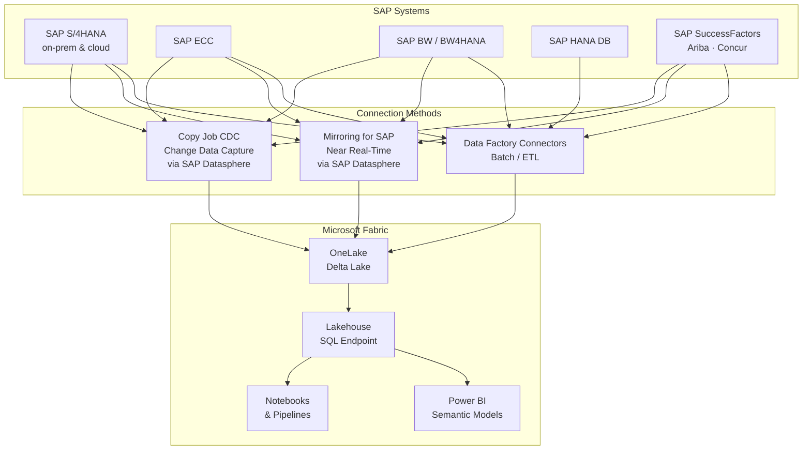
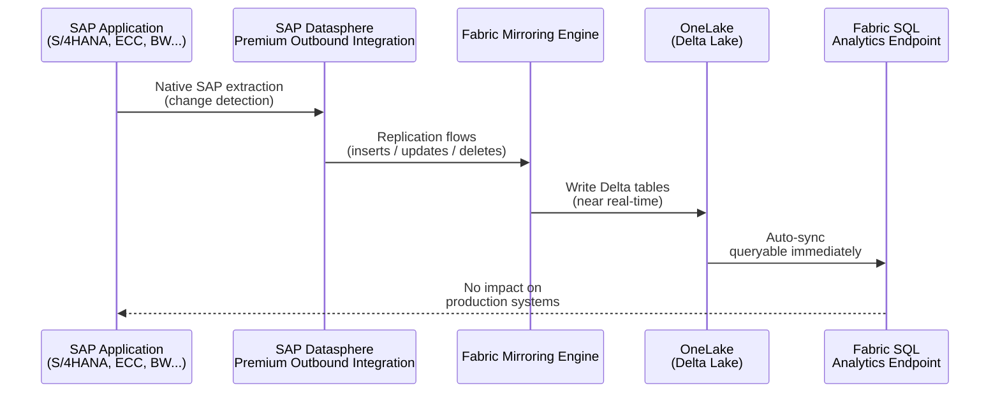
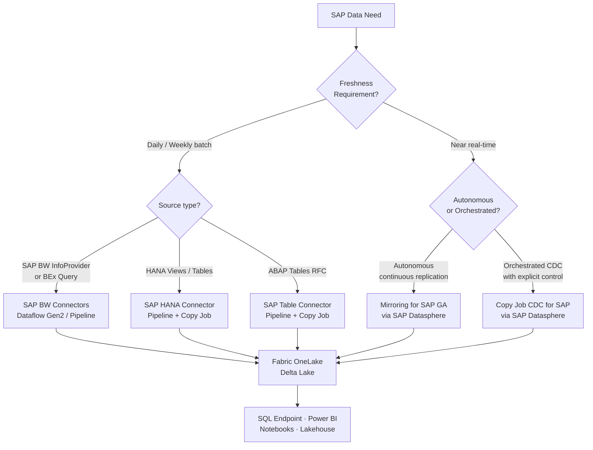

# SAP Connectivity in Microsoft Fabric

**Last updated:** April 2026  
**Sources:** Official Microsoft Fabric documentation, Fabric November 2025 Feature Summary (Ignite 2025), Fabric March 2026 Feature Summary (FabCon 2026)

---

## Overview

Microsoft Fabric offers multiple ways to connect to SAP systems, ranging from traditional batch/ETL connectors in Data Factory to near real-time replication via Mirroring. The right approach depends on freshness requirements, SAP source system, and the desired analytics pattern.

---

## Method 1 — Data Factory Connectors (Batch / ETL)

Seven dedicated SAP connectors are available in Microsoft Fabric Data Factory for scheduled or on-demand data extraction.

### Connector Reference Table

| Connector | Dataflow Gen2 | Pipeline (Copy) | Copy Job | Gateway Required |
|-----------|:-------------:|:---------------:|:--------:|-----------------|
| **SAP BW Application Server** | ✅ Import + DirectQuery | ❌ | ❌ | On-premises *(SAP .NET Connector 3.0/3.1 required)* |
| **SAP BW Message Server** | ✅ Import + DirectQuery | ❌ | ❌ | On-premises *(SAP .NET Connector 3.0/3.1 required)* |
| **SAP BW Open Hub – App. Server** | ✅ | ✅ | ❌ | None / On-premises / VNet |
| **SAP BW Open Hub – Msg. Server** | ✅ | ✅ | ❌ | On-premises |
| **SAP HANA Database** | ✅ | ✅ Lookup + Copy | ✅ | On-premises (Basic / Windows auth) |
| **SAP Table – App. Server** | ❌ | ✅ | ✅ | None / On-premises |
| **SAP Table – Message Server** | ❌ | ✅ | ❌ | None / On-premises |

### When to Use

- **SAP BW connectors** — best for extracting data from BW InfoProviders, BEx queries, and Open Hub destinations. Support BW 7.3, 7.5, BW/4HANA 2.0.
- **SAP HANA** — direct read from HANA views, tables, and stored procedures. Supports Copy job for scalable ingestion.
- **SAP Table** — generic ABAP table/view extraction via RFC. Ideal for custom or standard SAP tables (e.g., `VBAK`, `MARA`, `KNA1`).

> ⚠️ **Limitation:** These connectors perform batch copies. They require manual watermark management or full reload for incremental patterns. No native CDC.

---

## Method 2 — Mirroring for SAP (Near Real-Time)

Mirroring for SAP provides **continuous, near real-time replication** of SAP data into Microsoft Fabric's OneLake, without any custom ETL pipeline to maintain.

### Architecture

**Technology stack:**
- **SAP Datasphere Premium Outbound Integration** — acts as the bridge between SAP source systems and Fabric, leveraging SAP's native data extraction technologies (SLT, ODP, CDS Views).
- **Fabric Mirroring Engine** — continuously replicates change data into OneLake in Delta Lake format.
- **SQL Analytics Endpoint** — automatically created, allowing immediate SQL queries over mirrored tables.

### Supported SAP Sources

| SAP System | Deployment | Support |
|-----------|-----------|---------|
| SAP S/4HANA | On-premises | ✅ |
| SAP S/4HANA Cloud | Cloud (public + private) | ✅ |
| SAP ECC | On-premises | ✅ |
| SAP BW | On-premises | ✅ |
| SAP BW/4HANA | On-premises & cloud | ✅ |
| SAP SuccessFactors | SaaS | ✅ |
| SAP Ariba | SaaS | ✅ |
| SAP Concur | SaaS | ✅ |

### Key Benefits

- **No ETL code to maintain** — schema evolution is handled automatically
- **Near real-time freshness** — changes flow continuously into OneLake
- **End-to-end lineage** — full data governance and audit trail
- **Native Fabric integration** — SQL endpoint, Power BI, Notebooks, and Lakehouses all consume mirrored data directly
- **No impact on SAP production** — extraction runs through SAP Datasphere, not directly on the OLTP system

### Prerequisites

1. **SAP Datasphere** license with **Premium Outbound Integration** add-on
2. SAP Datasphere configured with replication flows pointing to the SAP source systems
3. Fabric capacity (F2 or higher recommended for production)
4. Network connectivity: SAP Datasphere → Fabric (outbound HTTPS)

---

## Method 3 — Copy Job CDC for SAP

Introduced at **Ignite 2025**, Copy Job now supports **Change Data Capture (CDC)** for SAP via Datasphere.

| Feature | Details |
|---------|---------|
| Change types captured | Inserts, Updates, Deletes |
| Watermark column needed | ❌ No |
| Manual refresh needed | ❌ No |
| Merge destination | Fabric Lakehouse |
| Monitoring | Run-level stats: load type, row counts per insert/update/delete |

> **Difference vs. Mirroring:** CDC in Copy Job runs on a scheduled trigger (not continuous streaming). It is best suited for near-real-time scenarios that need explicit orchestration control, while Mirroring is fully autonomous and continuous.

---

## Decision Guide

---

## 📢 Key Announcements

### Ignite 2025 — November 2025

| Feature | Status | Coverage |
|---------|--------|---------|
| **Mirroring for SAP** | 🔵 **Preview** | S/4HANA, BW, BW/4HANA, SuccessFactors, Ariba |
| **Copy Job CDC for SAP** via Datasphere | ✅ **GA** | SAP via Datasphere → Lakehouse |

**What it meant:** For the first time, Fabric offered a near real-time, no-ETL path for SAP data. The preview validated the architecture with early adopters across the SAP customer base.

---

### FabCon 2026 — March 2026

| Feature | Status | What's New |
|---------|--------|-----------|
| **Mirroring for SAP** | ✅ **Generally Available** | Added SAP ECC + SAP Concur. Production-ready for enterprise. |

**What it means:** Mirroring for SAP is now a fully supported, enterprise-grade capability in Fabric. Organizations can confidently migrate from custom SAP-to-Fabric ETL pipelines to the native Mirroring approach.

> 📄 Official documentation: [Microsoft Fabric Mirrored Databases From SAP](https://learn.microsoft.com/fabric/mirroring/sap)

---

## Comparison Summary

| | Batch Connectors | Copy Job CDC | Mirroring for SAP |
|--|:---:|:---:|:---:|
| **Freshness** | Hourly to daily | Minutes (scheduled) | Near real-time (continuous) |
| **Custom ETL** | Yes (watermark logic) | Minimal | None |
| **SAP Datasphere needed** | ❌ | ✅ | ✅ |
| **Supported SAP sources** | BW, HANA, ABAP Tables | SAP via Datasphere | Full SAP landscape |
| **DirectQuery from Power BI** | BW only (Dataflow Gen2) | ❌ | Via SQL Endpoint |
| **CDC (insert/update/delete)** | ❌ | ✅ | ✅ (continuous) |
| **GA status** | ✅ All GA | ✅ GA | ✅ GA (March 2026) |

---

## References

1. [Fabric Data Factory Connector Overview](https://learn.microsoft.com/fabric/data-factory/connector-overview)
2. [Microsoft Fabric Mirrored Databases From SAP](https://learn.microsoft.com/fabric/mirroring/sap)
3. [SAP HANA Connector — Fabric](https://learn.microsoft.com/fabric/data-factory/connector-sap-hana-database-overview)
4. [SAP BW Open Hub Connector — Fabric](https://learn.microsoft.com/fabric/data-factory/connector-sap-bw-open-hub-overview)
5. [SAP Table Connector — Fabric](https://learn.microsoft.com/fabric/data-factory/connector-sap-table-overview)
6. [Fabric November 2025 Feature Summary (Ignite 2025)](https://blog.fabric.microsoft.com/en-us/blog/fabric-november-2025-feature-summary)
7. [Fabric March 2026 Feature Summary (FabCon 2026)](https://blog.fabric.microsoft.com/en-us/blog/fabric-march-2026-feature-summary)
8. [Mirroring Overview in Microsoft Fabric](https://learn.microsoft.com/fabric/mirroring/overview)
