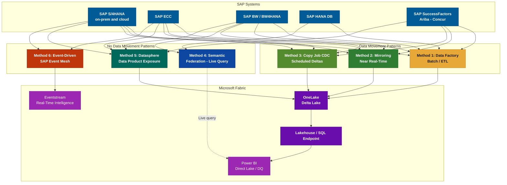
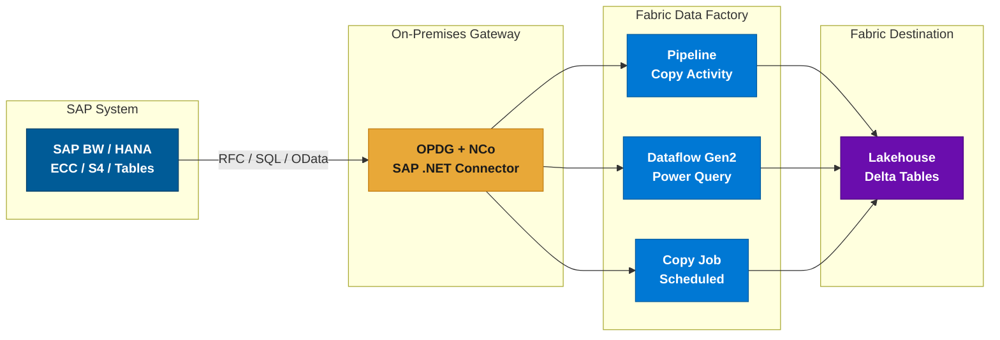
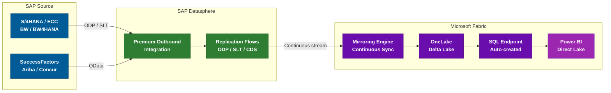
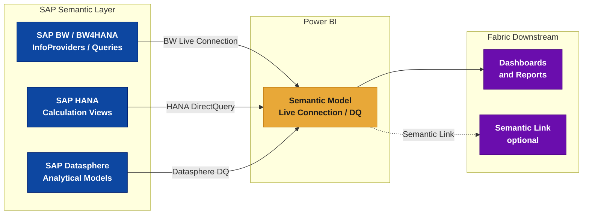
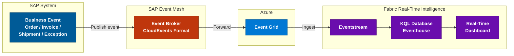
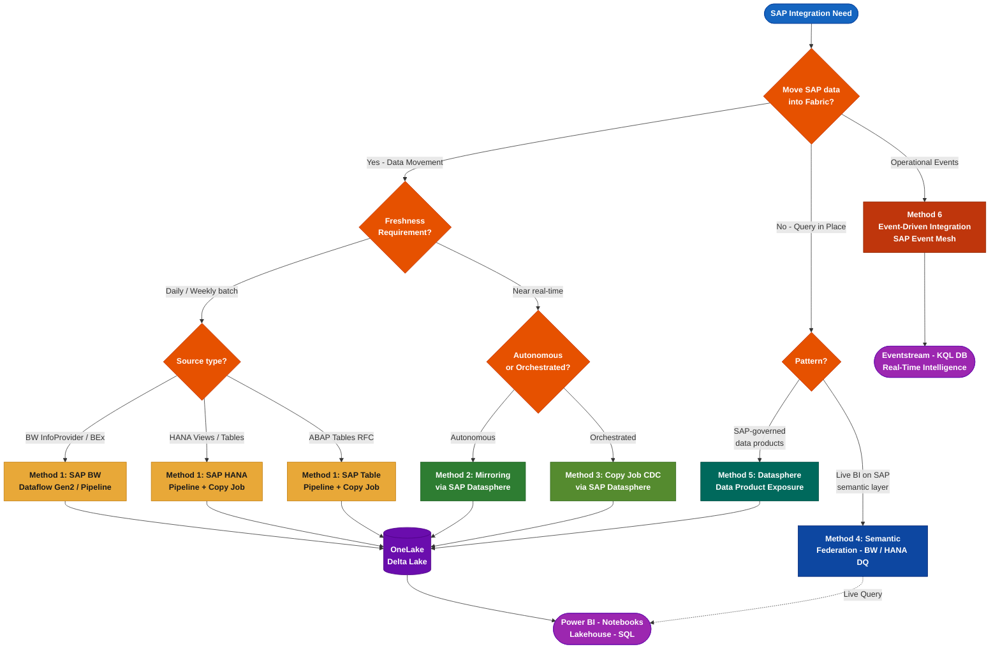

```mermaid
graph LR
    subgraph SAP["SAP Source"]
        A[S/4HANA / ECC<br/>BW / SaaS]
    end
    subgraph DS["SAP Datasphere"]
        B[Replication Flows<br/>ODP / SLT]
    end
    subgraph Stage["Staging"]
        C[ADLS Gen2<br/>Parquet files]
    end
    subgraph DF["Fabric Data Factory"]
        D[Copy Job<br/>Scheduled CDC]
    end
    subgraph Dest["Fabric"]
        E[Lakehouse<br/>Delta merge]
        F[Power BI<br/>Direct Lake]
    end

    A -->|Extract deltas| B
    B -->|Deposit files| C
    C -->|Read deltas| D
    D -->|Merge I/U/D| E
    E --> F

    classDef sapStyle fill:#005B97,stroke:#003D66,color:#ffffff,font-weight:bold
    classDef dsStyle fill:#2E7D32,stroke:#1B5E20,color:#ffffff,font-weight:bold
    classDef stageStyle fill:#E8A838,stroke:#C07C10,color:#1a1a1a,font-weight:bold
    classDef dfStyle fill:#558B2F,stroke:#33691E,color:#ffffff,font-weight:bold
    classDef destStyle fill:#6A0DAD,stroke:#4A0080,color:#ffffff,font-weight:bold

    class A sapStyle
    class B dsStyle
    class C stageStyle
    class D dfStyle
    class E,F destStyle
```

# SAP Connectivity in Microsoft Fabric

\begin{center}
{\large April 2026 -- Complete Reference Guide}\\[4pt]
{\small Based on: Microsoft Fabric Documentation, Ignite 2025, FabCon 2026}
\end{center}

\vspace{8pt}

## Overview

Microsoft Fabric offers multiple ways to connect to SAP systems. These range from data-movement patterns (batch ETL, CDC, Mirroring) to federation patterns where SAP data remains in place and is queried live, as well as event-driven patterns for operational analytics. The right approach depends on freshness requirements, data governance ownership, SAP source system, availability of SAP Datasphere, and whether data movement into OneLake is acceptable or required.

> **Power BI Direct Lake (GA March 2026):** Data ingested into OneLake -- whether via connectors, Copy Job, or Mirroring -- can be consumed by Power BI using Direct Lake mode. This eliminates the need for data import or intermediate semantic models, ensuring dashboards reflect the latest data with near-in-memory performance.

\newpage
\tableofcontents
\newpage

---

## Method 1 -- Data Factory Connectors (Batch / ETL)

Seven dedicated SAP connectors are available in Microsoft Fabric Data Factory for scheduled or on-demand data extraction. An **OData connector** is also available for SAP SaaS applications (SuccessFactors, S/4HANA Cloud, C4C) that expose OData APIs.

### Connector Reference Table

| Connector | Dataflow Gen2 | Pipeline (Copy) | Copy Job | Gateway |
|-----------|:---:|:---:|:---:|---------|
| **SAP BW Application Server** | ✔ Import + DQ | ✘ | ✘ | OPDG + NCo 3.x |
| **SAP BW Message Server** | ✔ Import + DQ | ✘ | ✘ | OPDG + NCo 3.x |
| **SAP BW Open Hub -- App Server** | ✔ | ✔ | ✘ | OPDG |
| **SAP BW Open Hub -- Msg Server** | ✔ | ✔ | ✘ | OPDG |
| **SAP HANA Database** | ✔ incl. DQ | ✔ Lookup + Copy | ✔ | OPDG |
| **SAP Table -- App Server** | ✘ | ✔ | ✔ | OPDG + NCo |
| **SAP Table -- Msg Server** | ✘ | ✔ | ✘ | OPDG |
| **OData (generic)** | ✔ | ✔ | ✘ | None / OPDG |

> **Legend:** ✔ = Supported | ✘ = Not supported | DQ = DirectQuery

### When to Use

- **SAP BW connectors** -- BW InfoProviders, BEx queries, Open Hub destinations. BW 7.3, 7.5, BW/4HANA 2.0. Best for aggregated datasets.
- **SAP HANA** -- HANA views, tables, stored procedures. Also supports DirectQuery via Dataflow Gen2.
- **SAP Table** -- ABAP table/view extraction via RFC (`VBAK`, `MARA`, `KNA1`). Medium-volume extractions.
- **OData** -- SAP apps exposing OData APIs (SuccessFactors, S/4HANA Cloud, C4C). Small-to-medium volumes.

### Infrastructure Prerequisites

All SAP connectors (except OData) require this infrastructure, **even when SAP runs in the cloud**:

1. **On-Premises Data Gateway (OPDG)** deployed near the SAP system
2. **SAP .NET Connector (NCo) 3.0 or 3.1** installed on the gateway server
3. **Network access** to SAP: RFC ports (33XX), HANA port (30015), via VPN/VNet or ExpressRoute
4. **SAP technical account** with appropriate authorizations (`S_RFC`, `S_TABU_DIS`)

> **Important limitations:**
>
> - **No Fabric-managed CDC** -- relies on SAP-native delta mechanisms such as ODP extractors or BW Open Hub delta queues. Fabric itself does not track SAP-side changes; you must manage incremental logic through SAP-provided capabilities.
> - **No dedicated connector for SAP SaaS** -- SuccessFactors, Ariba, Concur require OData or Mirroring/CDC.
> - **Performance impact on SAP** -- large RFC/BW extractions consume SAP resources. For massive tables, prefer HANA direct or Mirroring.

---

## Method 2 -- Mirroring for SAP (Near Real-Time)

Mirroring for SAP provides **continuous, near real-time replication** of SAP data into OneLake, without any custom ETL. It operates as a Fabric item ("mirrored database"), fully managed by the platform.

### Supported SAP Sources

| SAP System | Deployment | Supported |
|-----------|-----------|:---:|
| SAP S/4HANA | On-premises | ✔ |
| SAP S/4HANA Cloud | Cloud (public + private) | ✔ |
| SAP ECC | On-premises | ✔ |
| SAP BW | On-premises | ✔ |
| SAP BW/4HANA | On-premises and cloud | ✔ |
| SAP SuccessFactors | SaaS | ✔ |
| SAP Ariba | SaaS | ✔ |
| SAP Concur | SaaS | ✔ |

> **Other SAP systems** (CRM, SRM, SCM) based on NetWeaver ABAP are covered via ODP/SLT, same as ECC. Any SAP system supporting ODP extraction is eligible.

### Key Benefits

- **Zero ETL** -- schema evolution handled automatically; raw replication (transforms applied downstream)
- **Near real-time** -- latency typically seconds to a few minutes
- **End-to-end lineage** -- full governance and audit trail
- **Native Fabric integration** -- SQL endpoint, Power BI Direct Lake, Notebooks, Lakehouses
- **Limited impact on SAP when SLT-based ODP extraction is already operational** -- if SLT triggers and ODP queues are pre-configured, Mirroring adds marginal load. However, initial SLT configuration introduces logging overhead on source tables (trigger installation, change-log table creation). Plan the initial setup during low-activity windows.
- **Up to 1,000 tables** per mirrored database (increased from ~100 at FabCon 2026)

### Prerequisites

1. **SAP Datasphere** with **Premium Outbound Integration** (mandatory)
2. Replication Flows configured in Datasphere
3. **On-premises SAP:** Data Provisioning Agent or SAP Cloud Connector on-site
4. **SAP Cloud sources:** OData connections activated and registered in Datasphere
5. Fabric capacity (F2+ recommended)
6. Network: SAP Datasphere to Fabric (outbound HTTPS)

> **SAP licensing note:** SAP requires official extraction products (Datasphere, Data Intelligence) for ODP-based extraction. This reinforces Mirroring as the strategic SAP-endorsed path.

---

## Method 3 -- Copy Job CDC for SAP

Introduced at **Ignite 2025**, Copy Job supports **Change Data Capture (CDC)** for SAP via Datasphere. Unlike Mirroring (autonomous), Copy Job CDC provides **explicit orchestration control** within a Data Factory pipeline.

### How It Works

Two-stage mechanism:

1. **SAP Datasphere** extracts initial data then delta changes (ODP/SLT) and deposits Parquet files on **Azure Data Lake Storage Gen2**.
2. **Fabric Copy Job** reads those files and merges inserts/updates/deletes into the Fabric Lakehouse (Delta).

### Feature Summary

| Feature | Value |
|---------|:---:|
| Change types captured | Inserts, Updates, Deletes |
| Watermark column needed | ✘ Not required |
| Manual refresh needed | ✘ Scheduled trigger |
| Merge destination | Lakehouse (Delta) |
| Intermediate storage | ADLS Gen2 / S3 / GCS |

### Prerequisites

1. **SAP Datasphere** with **Premium Outbound Integration** (same as Mirroring)
2. Data Provisioning Agent for on-premises sources
3. Replication Flows targeting a cloud storage container (ADLS Gen2)
4. Fabric Copy Job configured to read from that container

### When to Prefer over Mirroring

- **Control the schedule** (e.g., every 15 min during business hours, pause at night)
- **Multi-source pipeline** with additional transforms, validations, or joins
- **Limit continuous load** -- scheduled bursts vs. 24/7 streaming
- **Monitoring** is split: Datasphere (replication health) + Fabric (Copy Job runs)

> **Latency** depends on scheduled frequency. A 5-minute interval = up to 5 minutes stale. For continuous freshness, use Mirroring.

### Copy Job Optimizations (FabCon 2026)

- **Auto-partitioning** for better performance on large copies
- **Automatic audit columns** for load tracking
- **Zero CU cost** when no data changes exist

---

## Method 4 -- Semantic Federation (No Data Movement)

Power BI within Microsoft Fabric can connect **live** to SAP semantic layers without replicating any data into OneLake. This is **federation, not ingestion** -- SAP remains the system of record and the query engine.

### Connection Types

| Connection | SAP Source | Protocol | Data Movement |
|------------|-----------|----------|:---:|
| **BW Live Connection** | SAP BW / BW4HANA | MDX via OPDG | ✘ None |
| **HANA DirectQuery** | SAP HANA Calculation Views | SQL via OPDG | ✘ None |
| **Datasphere DirectQuery** | Datasphere Analytical Models | OData / SQL | ✘ None |

### Key Benefits

- **Zero data replication** -- no SAP data enters OneLake; all queries are executed on SAP infrastructure
- **SAP-governed security enforcement** -- row-level security, authorizations, and data classifications defined in SAP are enforced at query time
- **SAP business logic reuse** -- CDS views, BW hierarchies, currency conversions, and calculated key figures are executed on the SAP engine, not re-implemented in Fabric
- **Regulatory compliance** -- suitable for regulated industries (banking, pharma, public sector) where data residency or extraction restrictions apply
- **Hybrid virtualization** -- Power BI semantic models can combine live SAP connections with imported data from other sources in a single report

### Limitations

- **Query performance depends on SAP infrastructure** -- response time is bounded by SAP system capacity and network latency
- **No offline access** -- if SAP is unavailable, dashboards are unavailable
- **Requires On-Premises Data Gateway** for BW and HANA connections
- **Not suitable for large-scale data science / notebook workloads** -- federation is optimized for BI consumption, not for Spark-based analytics

### When to Use

- Data must remain in SAP for regulatory or contractual reasons
- SAP business logic (hierarchies, currencies, authorizations) must be enforced at the source
- Dashboard consumption only -- no downstream Spark/notebook processing needed
- SAP infrastructure has sufficient capacity to handle concurrent BI queries

---

## Method 5 -- Datasphere-Mediated Data Product Exposure

In this architecture, **SAP Datasphere acts as a governed data product layer**. Rather than Fabric extracting data directly from SAP operational systems, Datasphere curates, governs, and exposes analytical data products that Fabric consumes.

```mermaid
graph LR
    subgraph SAP["SAP Operational Systems"]
        A[S/4HANA / ECC<br/>BW / SaaS]
    end
    subgraph DS["SAP Datasphere"]
        B[Replication and<br/>Transformation]
        C[Curated Data Products<br/>Analytical Models]
        D[Export to<br/>Cloud Storage]
    end
    subgraph Storage["Cloud Storage"]
        E[ADLS Gen2<br/>Delta / Parquet]
    end
    subgraph Fabric["Microsoft Fabric"]
        F[OneLake Shortcut]
        G[Direct Lake<br/>Consumption]
    end

    A --> B
    B --> C
    C --> D
    D --> E
    E -->|Shortcut| F
    F --> G

    classDef sapStyle fill:#005B97,stroke:#003D66,color:#ffffff,font-weight:bold
    classDef dsStyle fill:#00695C,stroke:#004D40,color:#ffffff,font-weight:bold
    classDef storageStyle fill:#E8A838,stroke:#C07C10,color:#1a1a1a,font-weight:bold
    classDef fabricStyle fill:#6A0DAD,stroke:#4A0080,color:#ffffff,font-weight:bold

    class A sapStyle
    class B,C,D dsStyle
    class E storageStyle
    class F,G fabricStyle
```

### How It Works

1. SAP operational systems replicate data into **SAP Datasphere** using standard mechanisms (ODP, SLT, CDS)
2. Datasphere applies **transformations, business rules, and governance** to produce curated analytical models (data products)
3. Datasphere exports these data products to a cloud storage layer (ADLS Gen2, S3) as Delta or Parquet
4. Fabric accesses this storage via **OneLake Shortcuts** -- no additional copy into OneLake
5. Power BI consumes the data through **Direct Lake** mode

### Impact on Architecture

| Aspect | Implication |
|--------|------------|
| **Data ownership** | SAP team owns the data product definition and quality; Fabric team consumes |
| **Extraction licensing** | Compliant with SAP licensing -- extraction is performed by SAP Datasphere (an SAP product), not by a third-party tool |
| **Governance boundary** | Data governance and business rules are enforced in Datasphere before data leaves SAP's perimeter |
| **SAP strategic direction** | Aligns with SAP's recommended architecture where Datasphere is the authorized data sharing layer |

### When to Use

- Organization has invested in SAP Datasphere as a strategic data platform
- SAP data team produces governed data products consumed by multiple downstream platforms (not just Fabric)
- Strict data governance requires that business logic and quality rules are applied before data leaves SAP
- SAP extraction licensing mandates that only SAP-approved tools perform outbound data replication

---

## Method 6 -- Event-Driven Integration (Operational Analytics)

SAP business events can flow into Microsoft Fabric for **real-time operational analytics** without bulk data extraction. This pattern targets individual business transactions, not full tables.

### Supported Event Patterns

| SAP Event Source | Event Examples | Latency |
|-----------------|----------------|---------|
| S/4HANA Business Events | Order created, Invoice posted, Delivery shipped | Sub-second |
| SAP ECC (via BTP) | Goods receipt, Production order exception | Seconds |
| SAP Integration Suite | Composite events from multiple SAP systems | Seconds |

### Architecture Components

- **SAP Event Mesh** (part of SAP BTP) -- publishes business events in CloudEvents format
- **Azure Event Grid** -- receives events from SAP Event Mesh and routes to Fabric
- **Fabric Eventstream** -- ingests, transforms, and routes events within Fabric
- **KQL Database / Eventhouse** -- stores event data for time-series analysis and anomaly detection
- **Real-Time Dashboards** -- visualize operational KPIs with sub-minute refresh

### When to Use

- Operational monitoring: detect exceptions, SLA breaches, or anomalies in SAP business processes
- Event-triggered automation: SAP order → Fabric enrichment → downstream action
- Real-time KPIs: live order-to-cash metrics, production throughput, logistics tracking
- Complement to bulk integration -- events for freshness, Mirroring/CDC for completeness

> **This pattern supports operational analytics, not bulk historical ingestion.** For complete datasets (all orders, all materials), use Methods 1-3 or 5. Event-driven integration captures individual business transactions as they occur.

### Prerequisites

1. **SAP BTP** subscription with **SAP Event Mesh** enabled
2. SAP business events activated in S/4HANA or ECC (requires SAP Basis configuration)
3. Azure Event Grid subscription configured to receive from SAP Event Mesh
4. Fabric capacity with Real-Time Intelligence workload enabled

---

## Alternative Approaches

### OneLake Shortcuts

If SAP data already exists in external storage (ADLS, S3), create a **OneLake Shortcut** to make it available in Fabric without re-copying.

### Third-Party ETL Tools

Informatica, Boomi, Theobald, and others offer SAP connectors writing to OneLake. Microsoft's strategic direction favors native connectors and SAP Datasphere.

### Logic Apps / Power Automate

For event-driven micro-integrations (e.g., SAP order creation triggers a Fabric action). Not suitable for bulk data.

---

## Decision Guide

---

## Key Announcements

### Ignite 2025 -- November 2025

| Feature | Status | Coverage |
|---------|:---:|---------|
| **Mirroring for SAP** | ◑ Preview | S/4HANA, BW, BW/4HANA, SuccessFactors, Ariba |
| **Copy Job CDC for SAP** | ✔ GA | SAP via Datasphere to Lakehouse |

### FabCon 2026 -- March 2026

| Feature | Status | What's New |
|---------|:---:|-----------|
| **Mirroring for SAP** | ✔ GA | + SAP ECC, + Concur. Up to 1,000 tables. |
| **Copy Job enhancements** | ✔ GA | Auto-partitioning, audit columns, zero-cost |
| **Direct Lake for Power BI** | ✔ GA | Dashboards read Delta directly from OneLake |

> **Docs:** [Microsoft Fabric Mirrored Databases From SAP](https://learn.microsoft.com/fabric/mirroring/sap)

---

## Comparison Summary

| Criteria | Batch Connectors | Copy Job CDC | Mirroring | Semantic Federation | Datasphere Products | Event-Driven |
|----------|:---:|:---:|:---:|:---:|:---:|:---:|
| **Data movement** | ✔ To OneLake | ✔ To OneLake | ✔ To OneLake | ✘ None | ✔ To storage | ✘ Events only |
| **Freshness** | Hourly to daily | Minutes | Near real-time | Live query | Export schedule | Sub-second |
| **Custom ETL needed** | Required | Minimal | None | None | Datasphere-side | Event routing |
| **SAP Datasphere** | ✘ Not required | ✔ Required | ✔ Required | ✘ Optional | ✔ Required | ✘ Not required |
| **SAP BTP** | ✘ | ✘ | ✘ | ✘ | ✘ | ✔ Required |
| **Native CDC** | ✘ SAP-side only | ✔ Scheduled | ✔ Continuous | N/A | N/A | N/A (events) |
| **SAP sources** | BW, HANA, Tables | Full landscape | Full landscape | BW, HANA, DSphere | Full landscape | S/4, ECC |
| **Power BI access** | DQ + Import | Direct Lake | SQL EP + Direct Lake | Live Connection / DQ | Direct Lake | RT Dashboard |
| **Governance owner** | Fabric team | Fabric team | Fabric team | SAP team | SAP team | Shared |
| **Use case** | Analytical | Analytical | Analytical | Analytical (BI) | Analytical | Operational |
| **GA status** | All GA (2023) | GA (Nov 2025) | GA (Mar 2026) | GA | GA | GA (components) |

> **Legend:** ✔ Yes / Required | ✘ No / Not required | N/A = Not applicable

---

## Recommendations by Scenario

**Historical bulk load** (migrating years of data):
Use **Method 1 -- batch connectors** (SAP HANA or SAP Table via Pipeline Copy job with partitioning).

**Regular analytics refresh** (daily/hourly dashboards):
Use **Method 1** for simple cases, or **Method 3 -- Copy Job CDC** for incremental deltas.

**Real-time operational analytics** (live sales, inventory):
Use **Method 2 -- Mirroring** + Power BI Direct Lake for continuous dashboard freshness.

**SAP SaaS without Datasphere** (SuccessFactors, Ariba):
Use the **OData connector** (Method 1) for moderate volumes; invest in Datasphere for scale.

**Multi-source orchestrated pipeline** (SAP + other sources):
Use **Method 3 -- Copy Job CDC** in a Data Factory pipeline with transforms and validations.

**Data must stay in SAP** (regulatory, contractual, or governance constraints):
Use **Method 4 -- Semantic Federation** for BI consumption via Power BI Live Connection / DirectQuery.

**SAP team owns data products** (governed exposure model):
Use **Method 5 -- Datasphere Data Products** exported to cloud storage, consumed via OneLake Shortcuts.

**Real-time business event monitoring** (order tracking, SLA alerting):
Use **Method 6 -- Event-Driven** via SAP Event Mesh + Azure Event Grid + Fabric Eventstream.

**No SAP Datasphere available:**
Use **Method 1 -- batch connectors** + OPDG. For BI without data movement, consider **Method 4 -- Semantic Federation** via BW Live Connection or HANA DirectQuery.

---

## Appendix A -- References

### Mirroring for SAP

| Resource | Link |
|----------|------|
| Mirrored Databases from SAP | <https://learn.microsoft.com/fabric/mirroring/sap> |
| Mirroring Overview | <https://learn.microsoft.com/fabric/mirroring/overview> |
| Extended Capabilities (CDF, Views) | <https://learn.microsoft.com/fabric/mirroring/extended-capabilities> |
| Troubleshooting Guide | <https://learn.microsoft.com/fabric/mirroring/troubleshooting> |

### Data Factory SAP Connectors

| Resource | Link |
|----------|------|
| Connector Overview (all) | <https://learn.microsoft.com/fabric/data-factory/connector-overview> |
| SAP BW Open Hub | <https://learn.microsoft.com/fabric/data-factory/connector-sap-bw-open-hub-overview> |
| SAP HANA | <https://learn.microsoft.com/fabric/data-factory/connector-sap-hana-database-overview> |
| SAP Table | <https://learn.microsoft.com/fabric/data-factory/connector-sap-table-overview> |
| SAP BW Application Server | <https://learn.microsoft.com/power-query/connectors/sap-bw/application-setup-and-connect> |
| OData Connector | <https://learn.microsoft.com/fabric/data-factory/connector-odata-overview> |

### Copy Job and CDC

| Resource | Link |
|----------|------|
| What is Copy Job | <https://learn.microsoft.com/fabric/data-factory/what-is-copy-job> |
| CDC in Copy Job | <https://learn.microsoft.com/fabric/data-factory/copy-job-change-data-capture> |
| Copy Job Monitoring | <https://learn.microsoft.com/fabric/data-factory/copy-job-workspace-monitoring> |

### Power BI and OneLake

| Resource | Link |
|----------|------|
| Direct Lake Mode | <https://learn.microsoft.com/fabric/fundamentals/direct-lake-overview> |
| OneLake Shortcuts | <https://learn.microsoft.com/fabric/onelake/onelake-shortcuts> |

### Announcements

| Resource | Link |
|----------|------|
| Ignite 2025 Feature Summary | <https://blog.fabric.microsoft.com/en-us/blog/fabric-november-2025-feature-summary> |
| FabCon 2026 Feature Summary | <https://blog.fabric.microsoft.com/en-us/blog/fabric-march-2026-feature-summary> |
| FabCon 2026 Hero Blog | <https://aka.ms/FabCon-SQLCon-2026-news> |
| SAP in Fabric Blog (Sept 2024) | <https://blog.fabric.microsoft.com/en-us/blog/connecting-to-sap-data-in-microsoft-fabric> |

### SAP Datasphere

| Resource | Link |
|----------|------|
| SAP Datasphere Docs | <https://help.sap.com/docs/SAP_DATASPHERE> |
| Premium Outbound Integration | <https://help.sap.com/docs/SAP_DATASPHERE/be5967d099974c69b77f4549425ca4c0/eb7ff31> |
| Data Provisioning Agent | <https://help.sap.com/docs/SAP_DATASPHERE/935116dd7c324355803d4b85809cec97> |

### Infrastructure

| Resource | Link |
|----------|------|
| On-Premises Data Gateway | <https://learn.microsoft.com/data-integration/gateway/service-gateway-onprem> |
| SAP .NET Connector (NCo) | <https://support.sap.com/en/product/connectors/msnet.html> |

### Semantic Federation and Live Connections

| Resource | Link |
|----------|------|
| SAP BW Connector (Power Query) | <https://learn.microsoft.com/power-query/connectors/sap-bw/application-setup-and-connect> |
| SAP HANA DirectQuery in Power BI | <https://learn.microsoft.com/power-bi/connect-data/desktop-directquery-sap-hana> |
| Power BI Live Connection Overview | <https://learn.microsoft.com/power-bi/connect-data/desktop-directquery-about> |

### Event-Driven Integration

| Resource | Link |
|----------|------|
| SAP Event Mesh | <https://help.sap.com/docs/SAP_EM> |
| Azure Event Grid | <https://learn.microsoft.com/azure/event-grid/overview> |
| Fabric Eventstream | <https://learn.microsoft.com/fabric/real-time-intelligence/event-streams/overview> |
| Fabric Real-Time Intelligence | <https://learn.microsoft.com/fabric/real-time-intelligence/overview> |

---

## Appendix B -- Glossary

| Acronym | Definition |
|---------|-----------|
| **CDC** | Change Data Capture -- track inserts, updates, and deletes |
| **CDS** | Core Data Services -- SAP data modeling framework |
| **ODP** | Operational Data Provisioning -- SAP delta extraction framework |
| **SLT** | SAP Landscape Transformation -- trigger-based real-time replication |
| **OPDG** | On-Premises Data Gateway -- Microsoft gateway for on-prem data |
| **NCo** | SAP .NET Connector -- library for SAP RFC communication |
| **RFC** | Remote Function Call -- SAP native inter-system protocol |
| **Direct Lake** | Power BI mode reading Delta files directly from OneLake |
| **DQ** | DirectQuery -- live query mode in Power BI |

