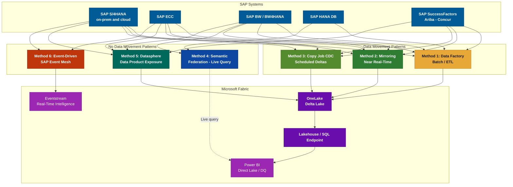
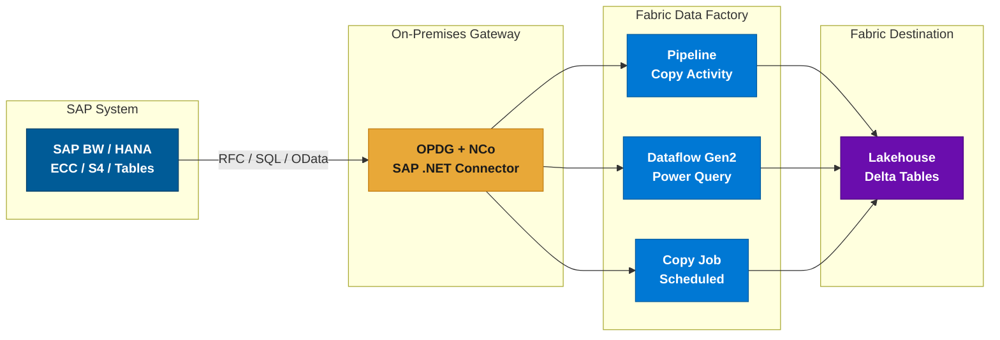
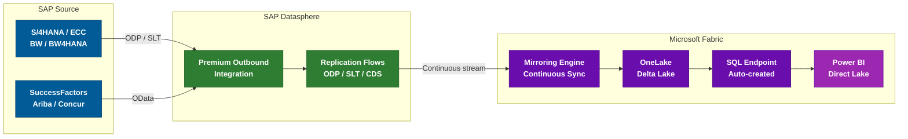
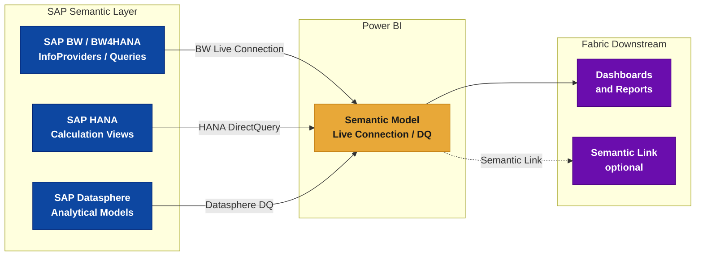
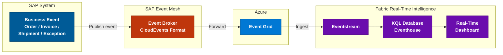
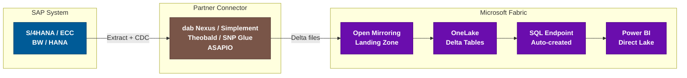
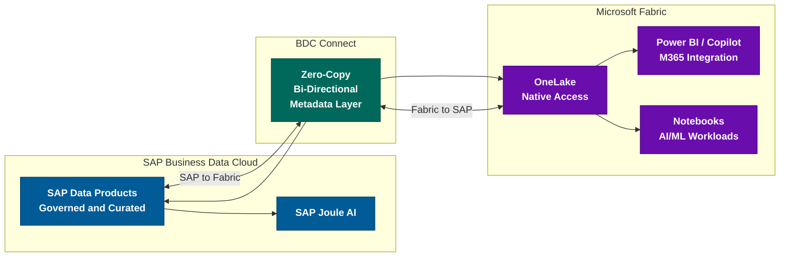

# Microsoft SAP to Fabric Connectivity Architecture Patterns (2026)

\begin{center}
{\large April 2026 -- Complete Reference Guide}\\[4pt]
{\small Based on: Microsoft Fabric Documentation, Ignite 2025, FabCon 2026}
\end{center}

\vspace{8pt}

## Overview

Microsoft Fabric offers multiple ways to connect to SAP systems. These range from data-movement patterns (batch ETL, CDC, Mirroring) to federation patterns where SAP data remains in place and is queried live, as well as event-driven patterns for operational analytics. The right approach depends on freshness requirements, data governance ownership, SAP source system, availability of SAP Datasphere, and whether data movement into OneLake is acceptable or required.

This document describes the primary architectural patterns available in 2026 for integrating SAP systems with Microsoft Fabric. These patterns range from full data ingestion into OneLake to semantic federation and event-driven operational analytics, enabling organizations to select the appropriate integration model based on governance, licensing, and performance constraints.

> **Power BI Direct Lake mode (GA March 2026):** Direct Lake is a storage mode for tables within a Power BI semantic model. It reads Delta Lake files directly from OneLake without importing data into the model's in-memory cache, combining the performance of Import mode with the freshness of DirectQuery. Data ingested into OneLake -- whether via connectors, Copy Job, or Mirroring -- can be consumed through semantic models using Direct Lake mode, ensuring dashboards reflect the latest data with near-in-memory performance while keeping a single copy of the data in OneLake.

\newpage
\tableofcontents
\newpage

---

## Method 1 -- Data Factory Connectors (Batch / ETL)

Seven dedicated SAP connectors are available in Microsoft Fabric Data Factory for scheduled or on-demand data extraction. An **OData connector** is also available for SAP SaaS applications (SuccessFactors, S/4HANA Cloud, C4C) that expose OData APIs.

### Connector Reference Table

| Connector | Dataflow Gen2 | Pipeline (Copy) | Copy Job | Gateway |
|-----------|:---:|:---:|:---:|---------|
| **SAP BW Application Server** | ✔ Import + DQ | ✘ | ✘ | OPDG + NCo 3.x |
| **SAP BW Message Server** | ✔ Import + DQ | ✘ | ✘ | OPDG + NCo 3.x |
| **SAP BW Open Hub -- App Server** | ✔ | ✔ | ✘ | OPDG |
| **SAP BW Open Hub -- Msg Server** | ✔ | ✔ | ✘ | OPDG |
| **SAP HANA Database** | ✔ incl. DQ | ✔ Lookup + Copy | ✔ | OPDG |
| **SAP Table -- App Server** | ✘ | ✔ | ✔ | OPDG + NCo |
| **SAP Table -- Msg Server** | ✘ | ✔ | ✘ | OPDG |
| **OData (generic)** | ✔ | ✔ | ✔ Full load | None / OPDG |

> **Legend:** ✔ = Supported | ✘ = Not supported | DQ = DirectQuery

### When to Use

- **SAP BW connectors** -- BW InfoProviders, BEx queries, Open Hub destinations. BW 7.3, 7.5, BW/4HANA 2.0. Best for aggregated datasets. Also applicable to the **embedded analytics layer in S/4HANA**, which exposes BW-like query capabilities via CDS analytical queries.
- **SAP HANA** -- HANA views, tables, stored procedures. Also supports DirectQuery via Dataflow Gen2.
- **SAP Table** -- ABAP table/view extraction via RFC (`VBAK`, `MARA`, `KNA1`). Medium-volume extractions.
- **OData** -- SAP applications exposing OData services via SAP Gateway. Covers not only SaaS applications (SuccessFactors, S/4HANA Cloud, C4C) but also **SAP ECC and S/4HANA on-premises** when OData services are activated. Standard and custom CDS Views exposed as OData endpoints are supported. Best for small-to-medium volumes.

### Typical Scenarios

| Scenario | Approach |
|----------|----------|
| **Historical data migration** -- load 5 years of financial postings into a Fabric Lakehouse for trend analysis | SAP Table connector (pipeline Copy activity with partitioning on fiscal year) |
| **Weekly HR reporting** -- extract headcount snapshots from SuccessFactors | OData connector scheduled weekly in Dataflow Gen2 |
| **Material master refresh** -- nightly sync of `MARA`/`MAKT` for a product catalog | SAP Table via Copy Job with date-based watermark |

### Infrastructure Prerequisites

All SAP connectors (except OData) require this infrastructure, **even when SAP runs in the cloud**:

1. **On-Premises Data Gateway (OPDG)** deployed near the SAP system
2. **SAP .NET Connector (NCo) 3.0 or 3.1** installed on the gateway server
3. **Network access** to SAP: RFC ports (33XX), HANA port (30015), via VPN/VNet or ExpressRoute
4. **SAP technical account** with appropriate authorizations (`S_RFC`, `S_TABU_DIS`)

> **Important limitations:**
>
> - **No Fabric-managed CDC** -- relies on SAP-native delta mechanisms such as ODP extractors or BW Open Hub delta queues. Fabric itself does not track SAP-side changes; you must manage incremental logic through SAP-provided capabilities.
> - **No dedicated connector for SAP SaaS** -- SuccessFactors, Ariba, Concur require OData or Mirroring/CDC.
> - **Performance impact on SAP** -- large RFC/BW extractions consume SAP resources. For massive tables, prefer HANA direct or Mirroring.

---

## Method 2 -- Mirroring for SAP (Near Real-Time)

Mirroring for SAP provides **continuous, near real-time replication** of SAP data into OneLake, without any custom ETL. It operates as a Fabric item ("mirrored database"), fully managed by the platform.

### Supported SAP Sources

| SAP System | Deployment | Supported |
|-----------|-----------|:---:|
| SAP S/4HANA | On-premises | ✔ |
| SAP S/4HANA Cloud | Cloud (public + private) | ✔ |
| SAP ECC | On-premises | ✔ |
| SAP BW | On-premises | ✔ |
| SAP BW/4HANA | On-premises and cloud | ✔ |
| SAP SuccessFactors | SaaS | ✔ |
| SAP Ariba | SaaS | ✔ |
| SAP Concur | SaaS | ✔ |

> **Other SAP systems** (CRM, SRM, SCM) based on NetWeaver ABAP are covered via ODP/SLT, same as ECC. Any SAP system supporting ODP extraction is eligible. **SAP Datasphere itself** can also serve as a mirroring source, allowing organizations to mirror curated Datasphere views and models into OneLake. The solution supports all source types offered by SAP Datasphere.

### Key Benefits

- **Zero ETL** -- schema evolution handled automatically; raw replication (transforms applied downstream)
- **Near real-time** -- latency typically seconds to a few minutes
- **End-to-end lineage** -- full governance and audit trail
- **Native Fabric integration** -- SQL endpoint, Power BI Direct Lake, Notebooks, Lakehouses
- **Limited impact on SAP when SLT-based ODP extraction is already operational** -- if SLT triggers and ODP queues are pre-configured, Mirroring adds marginal load. However, initial SLT configuration introduces logging overhead on source tables (trigger installation, change-log table creation). Plan the initial setup during low-activity windows.
- **Up to 1,000 tables** per mirrored database (increased from 500 at FabCon 2026)

### Prerequisites

1. **SAP Datasphere** with **Premium Outbound Integration** (mandatory)
2. Replication Flows configured in Datasphere
3. **On-premises SAP:** Data Provisioning Agent or SAP Cloud Connector on-site
4. **SAP Cloud sources:** OData connections activated and registered in Datasphere
5. Fabric capacity (F2+ recommended)
6. Network: SAP Datasphere to Fabric (outbound HTTPS)

> **SAP licensing note:** SAP requires official extraction products (Datasphere, Data Intelligence) for ODP-based extraction. This reinforces Mirroring as the strategic SAP-endorsed path.

### Typical Scenarios

| Scenario | Details |
|----------|---------|
| **Real-time sales dashboard** -- live order-to-cash KPIs refreshed every few minutes from S/4HANA | Mirror `VBAK`/`VBAP`/`VBRK` tables; Power BI Direct Lake for sub-minute dashboard refresh |
| **Supply chain visibility** -- continuous stock level monitoring across plants | Mirror `MARD`/`MSEG` with SLT triggers; Fabric notebooks for anomaly detection |

---

## Method 3 -- Copy Job CDC for SAP

Introduced at **Ignite 2025**, Copy Job supports **Change Data Capture (CDC)** for SAP via Datasphere. This capability is currently in **Preview** (as of April 2026). Unlike Mirroring (autonomous), Copy Job CDC provides **explicit orchestration control** within a Data Factory pipeline.

```mermaid
graph LR
    subgraph SAP["SAP Source"]
        A[S/4HANA / ECC<br/>BW / SaaS]
    end
    subgraph DS["SAP Datasphere"]
        B[Replication Flows<br/>ODP / SLT]
    end
    subgraph Stage["Staging"]
        C[ADLS Gen2<br/>Parquet files]
    end
    subgraph DF["Fabric Data Factory"]
        D[Copy Job<br/>Scheduled CDC]
    end
    subgraph Dest["Fabric"]
        E[Lakehouse<br/>Delta merge]
        F[Power BI<br/>Direct Lake]
    end

    A -->|Extract deltas| B
    B -->|Deposit files| C
    C -->|Read deltas| D
    D -->|Merge I/U/D| E
    E --> F

    classDef sapStyle fill:#005B97,stroke:#003D66,color:#ffffff,font-weight:bold
    classDef dsStyle fill:#2E7D32,stroke:#1B5E20,color:#ffffff,font-weight:bold
    classDef stageStyle fill:#E8A838,stroke:#C07C10,color:#1a1a1a,font-weight:bold
    classDef dfStyle fill:#558B2F,stroke:#33691E,color:#ffffff,font-weight:bold
    classDef destStyle fill:#6A0DAD,stroke:#4A0080,color:#ffffff,font-weight:bold

    class A sapStyle
    class B dsStyle
    class C stageStyle
    class D dfStyle
    class E,F destStyle
```

### How It Works

Two-stage mechanism:

1. **SAP Datasphere** extracts initial data then delta changes (ODP/SLT) and deposits Parquet files on **Azure Data Lake Storage Gen2**.
2. **Fabric Copy Job** reads those files and merges inserts/updates/deletes into the Fabric Lakehouse (Delta).

### Feature Summary

| Feature | Value |
|---------|:---:|
| Change types captured | Inserts, Updates, Deletes |
| Watermark column needed | ✘ Not required |
| Manual refresh needed | ✘ Scheduled trigger |
| Merge destination | Lakehouse (Delta) |
| Intermediate storage | ADLS Gen2 / S3 / GCS |

### Prerequisites

1. **SAP Datasphere** with **Premium Outbound Integration** (same as Mirroring)
2. Data Provisioning Agent for on-premises sources
3. Replication Flows targeting a cloud storage container (ADLS Gen2)
4. Fabric Copy Job configured to read from that container

### When to Prefer over Mirroring

- **Control the schedule** (e.g., every 15 min during business hours, pause at night)
- **Multi-source pipeline** with additional transforms, validations, or joins
- **Limit continuous load** -- scheduled bursts vs. 24/7 streaming
- **Monitoring** is split: Datasphere (replication health) + Fabric (Copy Job runs)

> **Latency** depends on scheduled frequency. A 5-minute interval = up to 5 minutes stale. For continuous freshness, use Mirroring.

### Copy Job Optimizations (FabCon 2026)

- **Auto-partitioning** for better performance on large copies
- **Automatic audit columns** for load tracking
- **Zero CU cost** when no data changes exist

### Typical Scenarios

| Scenario | Details |
|----------|---------|
| **Controlled financial close** -- sync SAP G/L postings every 15 min during close period, pause overnight | Copy Job CDC with business-hours schedule; Lakehouse merge into `factfinance` |
| **Multi-source analytics** -- combine SAP sales with Salesforce CRM in a single pipeline | Copy Job CDC for SAP + Salesforce connector in same Data Factory pipeline |

---

## Method 4 -- Semantic Federation (No Data Movement)

Microsoft Fabric semantic models (via the Power BI engine) can connect **live** to SAP semantic layers without replicating any data into OneLake. This is **federation, not ingestion** -- SAP remains the system of record and the query engine.

### Connection Types

| Connection | SAP Source | Protocol | Data Movement |
|------------|-----------|----------|:---:|
| **BW Live Connection** | SAP BW / BW4HANA | MDX via OPDG | ✘ None |
| **HANA DirectQuery** | SAP HANA Calculation Views | SQL via OPDG | ✘ None |
| **Datasphere DirectQuery** | Datasphere Analytical Models | OData / SQL | ✘ None |

### Key Benefits

- **Zero data replication** -- no SAP data enters OneLake; all queries are executed on SAP infrastructure
- **SAP-governed security enforcement** -- row-level security, authorizations, and data classifications defined in SAP are enforced at query time
- **SAP business logic reuse** -- CDS views, BW hierarchies, currency conversions, and calculated key figures are executed on the SAP engine, not re-implemented in Fabric
- **Regulatory compliance** -- suitable for regulated industries (banking, pharma, public sector) where data residency or extraction restrictions apply
- **Hybrid virtualization** -- Power BI semantic models can combine live SAP connections with imported data from other sources in a single report

### Limitations

- **Query performance depends on SAP infrastructure** -- response time is bounded by SAP system capacity and network latency
- **No offline access** -- if SAP is unavailable, dashboards are unavailable
- **Requires On-Premises Data Gateway** for BW and HANA connections
- **Not suitable for large-scale batch data science workloads** -- Power BI federation (Live Connection / DirectQuery) is optimized for BI consumption, not for Spark-based bulk analytics. However, **SAP Datasphere views can be consumed from Fabric Spark notebooks via ODBC** without replication, enabling data engineering and data science use cases in a virtualized mode (see note below)

> **Notebook access via ODBC:** Microsoft documents the consumption of SAP Datasphere analytical views directly from Fabric Spark notebooks using ODBC drivers. This extends the federation pattern beyond BI-only scenarios, enabling data engineers to query SAP data from notebooks for feature engineering, data validation, or exploratory analysis -- without replicating data into OneLake. Performance depends on SAP Datasphere capacity and network latency.

### When to Use

- Data must remain in SAP for regulatory or contractual reasons
- SAP business logic (hierarchies, currencies, authorizations) must be enforced at the source
- Dashboard consumption only -- no downstream Spark/notebook processing needed
- SAP infrastructure has sufficient capacity to handle concurrent BI queries

### Typical Scenarios

| Scenario | Details |
|----------|---------|
| **Regulated financial reporting** -- bank must not extract SAP data; auditors require SAP-enforced row-level security | BW Live Connection to BW/4HANA financial cubes; Power BI report with SAP authorizations |
| **Executive hybrid dashboard** -- combine live SAP revenue with imported market data | HANA DirectQuery for SAP actuals + imported Excel forecasts in a single Power BI composite model |

---

## Method 5 -- Datasphere-Mediated Data Product Exposure

In this architecture, **SAP Datasphere acts as a governed data product layer**. Rather than Fabric extracting data directly from SAP operational systems, Datasphere curates, governs, and exposes analytical data products that Fabric consumes.

```mermaid
graph LR
    subgraph SAP["SAP Operational Systems"]
        A[S/4HANA / ECC<br/>BW / SaaS]
    end
    subgraph DS["SAP Datasphere"]
        B[Replication and<br/>Transformation]
        C[Curated Data Products<br/>Analytical Models]
        D[Export to<br/>Cloud Storage]
    end
    subgraph Storage["Cloud Storage"]
        E[ADLS Gen2<br/>Delta / Parquet]
    end
    subgraph Fabric["Microsoft Fabric"]
        F[OneLake Shortcut]
        G[Direct Lake<br/>Consumption]
    end

    A --> B
    B --> C
    C --> D
    D --> E
    E -->|Shortcut| F
    F --> G

    classDef sapStyle fill:#005B97,stroke:#003D66,color:#ffffff,font-weight:bold
    classDef dsStyle fill:#00695C,stroke:#004D40,color:#ffffff,font-weight:bold
    classDef storageStyle fill:#E8A838,stroke:#C07C10,color:#1a1a1a,font-weight:bold
    classDef fabricStyle fill:#6A0DAD,stroke:#4A0080,color:#ffffff,font-weight:bold

    class A sapStyle
    class B,C,D dsStyle
    class E storageStyle
    class F,G fabricStyle
```

### How It Works

1. SAP operational systems replicate data into **SAP Datasphere** using standard mechanisms (ODP, SLT, CDS)
2. Datasphere applies **transformations, business rules, and governance** to produce curated analytical models (data products)
3. Datasphere exports these data products to a cloud storage layer (ADLS Gen2, S3), typically using columnar analytical formats such as Parquet
4. Fabric accesses this storage via **OneLake Shortcuts** -- no additional copy into OneLake
5. Power BI consumes the data through **Direct Lake** mode

### Impact on Architecture

| Aspect | Implication |
|--------|------------|
| **Data ownership** | SAP team owns the data product definition and quality; Fabric team consumes |
| **Extraction licensing** | Compliant with SAP licensing -- extraction is performed by SAP Datasphere (an SAP product), not by a third-party tool |
| **Governance boundary** | Data governance and business rules are enforced in Datasphere before data leaves SAP's perimeter |
| **SAP strategic direction** | Aligns with SAP's recommended architecture where Datasphere is the authorized data sharing layer |

### When to Use

- Organization has invested in SAP Datasphere as a strategic data platform
- SAP data team produces governed data products consumed by multiple downstream platforms (not just Fabric)
- Strict data governance requires that business logic and quality rules are applied before data leaves SAP
- SAP extraction licensing mandates that only SAP-approved tools perform outbound data replication

### Typical Scenarios

| Scenario | Details |
|----------|---------|
| **Enterprise data mesh** -- SAP finance team publishes governed "Revenue by Region" data product consumed by Fabric, Databricks, and Snowflake | Datasphere curates CDS views into analytical model; exports to ADLS; Fabric reads via Shortcut |
| **Advanced data science** -- data scientists need SAP material/supplier data for ML without direct SAP access | Datasphere exports governed Parquet; Fabric notebooks access via Direct Lake for feature engineering |

---

## Method 6 -- Event-Driven Integration (Operational Analytics)

SAP business events can flow into Microsoft Fabric for **real-time operational analytics** without bulk data extraction. This pattern targets individual business transactions, not full tables.

### Supported Event Patterns

| SAP Event Source | Event Examples | Latency |
|-----------------|----------------|---------|
| S/4HANA Business Events | Order created, Invoice posted, Delivery shipped | Sub-second |
| SAP ECC (via BTP) | Goods receipt, Production order exception | Seconds |
| SAP Integration Suite | Composite events from multiple SAP systems | Seconds |

### Architecture Components

**Sub-pattern A: SAP Event Mesh → Azure Event Grid → Fabric Eventstream**

- **SAP Event Mesh** (part of SAP BTP) -- publishes business events in CloudEvents format
- **Azure Event Grid** -- receives events from SAP Event Mesh and routes to Fabric
- **Fabric Eventstream** -- ingests, transforms, and routes events within Fabric
- **KQL Database / Eventhouse** -- stores event data for time-series analysis and anomaly detection
- **Real-Time Dashboards** -- visualize operational KPIs with sub-minute refresh

**Sub-pattern B: SAP Datasphere Replication Flow → Fabric Eventstream via Kafka**

Since February 2026, Microsoft documents a complementary pattern where **SAP Datasphere replication flows** push change data to a Kafka-compatible endpoint, which Fabric Eventstream ingests for near-real-time dashboards and alerting. This pattern is relevant when SAP Datasphere is already in place and the organization wants to leverage its existing replication infrastructure for operational analytics with second-level latency.

- **SAP Datasphere** -- replication flows configured with a Kafka-compatible target
- **Fabric Eventstream** -- consumes Kafka topics as a source
- **KQL Database / Eventhouse** -- stores and queries the change stream
- **Real-Time Dashboards / Activator** -- visualize and alert on SAP changes

### When to Use

- Operational monitoring: detect exceptions, SLA breaches, or anomalies in SAP business processes
- Event-triggered automation: SAP order → Fabric enrichment → downstream action
- Real-time KPIs: live order-to-cash metrics, production throughput, logistics tracking
- Complement to bulk integration -- events for freshness, Mirroring/CDC for completeness

> **This pattern supports operational analytics, not bulk historical ingestion.** For complete datasets (all orders, all materials), use Methods 1-3 or 5. Event-driven integration captures individual business transactions as they occur.

### Prerequisites

1. **SAP BTP** subscription with **SAP Event Mesh** enabled
2. SAP business events activated in S/4HANA or ECC (requires SAP Basis configuration)
3. Azure Event Grid subscription configured to receive from SAP Event Mesh
4. Fabric capacity with Real-Time Intelligence workload enabled

### Typical Scenarios

| Scenario | Details |
|----------|---------|
| **Order-to-cash monitoring** -- detect overdue invoices in real time and alert finance team via Teams | S/4HANA invoice-posted event → Event Mesh → Fabric Eventstream → KQL anomaly rule → Activator alert |
| **Production exception tracking** -- shop-floor exceptions trigger real-time dashboard updates | S/4HANA production-order-exception event → Eventhouse → Real-Time Dashboard with 15-second refresh |

---

## Method 7 -- Open Mirroring (Partner-Led Replication)

Open Mirroring is a Fabric extensibility framework that allows **certified ISV partners** to replicate data from SAP systems into OneLake using the same mirroring infrastructure as native Fabric Mirroring, but with partner-built connectors. This is particularly relevant for organizations that cannot use SAP Datasphere (required by Methods 2 and 3) or need to bypass SAP's ODP restrictions.

### How It Works

1. The partner tool (e.g., dab Nexus, Theobald Xtract Universal) connects to SAP using its own extraction protocol (RFC, BAPI, Table CDC, or proprietary mechanisms -- not necessarily ODP)
2. Initial data load and incremental changes are written as Delta Lake files into a Fabric-managed **landing zone**
3. The Fabric mirroring engine picks up these files and merges them into a **mirrored database** in OneLake
4. A SQL analytics endpoint is automatically created for the mirrored database, providing immediate SQL query access. Note: since September 2025, default semantic models are no longer auto-created for mirrored databases -- create one explicitly if needed for Power BI consumption.

### Certified SAP Partners (Examples)

The Open Mirroring partner ecosystem continues to grow. The following are notable partners with SAP-specific connectors:

| Partner | Product | Extraction Method | Key Differentiator |
|---------|---------|-------------------|-------------------|
| **dab** | dab Nexus | RFC / BAPI direct | No SAP ODP dependency; no intermediate staging |
| **Simplement** | Simplement for Fabric | SAP-native extraction | Broad SAP module coverage |
| **Theobald Software** | Xtract Universal | Table CDC / DeltaQ | Independent of SAP ODP restrictions; low SAP footprint |
| **SNP** | SNP Glue | SAP-native triggers | Enterprise-grade transformation capabilities |
| **ASAPIO** | ASAPIO Connector | RFC / OData | Specialized in S/4HANA Cloud |
| **AecorSoft** | AecorSoft for Fabric | SAP-native | SAP-certified extraction with Open Mirroring support |

> For the full partner list, see [Open Mirroring Partner Ecosystem](https://learn.microsoft.com/fabric/mirroring/open-mirroring-partners-ecosystem).

### When to Use

- **No SAP Datasphere available** -- Open Mirroring does not require SAP Datasphere licensing
- **SAP ODP restrictions** -- some partners (notably Theobald) extract data without relying on SAP's ODP framework, which SAP is progressively restricting for third-party tools
- **Existing partner investment** -- organization already uses one of these tools and wants to leverage Fabric's mirroring UX and auto-created SQL endpoint
- **Simplified architecture** -- eliminates intermediate staging databases (no SQL Server or ADLS between SAP and Fabric)

### Limitations

- Partner licensing costs apply in addition to Fabric capacity
- Each partner has its own SAP version/module support matrix -- verify coverage before selecting
- Fabric treats the data as an opaque mirrored database -- limited control over ingestion timing compared to Copy Job

### Typical Scenarios

| Scenario | Details |
|----------|---------|
| **Mid-market S/4 analytics** -- company without Datasphere wants near-real-time SAP data in Fabric | dab Nexus extracts sales/finance tables → Open Mirroring → Power BI Direct Lake |
| **Legacy ECC migration** -- Theobald already in place for existing pipelines | Redirect Xtract Universal output to Fabric Open Mirroring instead of SQL Server |

> **Source:** [Open Mirroring Partner Ecosystem](https://learn.microsoft.com/fabric/mirroring/open-mirroring-partners-ecosystem), [Open Mirroring for SAP -- dab and Simplement (Fabric Blog)](https://blog.fabric.microsoft.com/en-us/blog/open-mirroring-for-sap-sources-dab-and-simplement-2/)

---

## Method 8 -- SAP Business Data Cloud Connect for Fabric (Preview -- GA Q3 2026)

SAP Business Data Cloud (BDC) Connect for Microsoft Fabric is a **joint SAP-Microsoft capability** that enables **bi-directional, zero-copy data sharing** between SAP BDC and OneLake. Announced at **Ignite 2025**, it is expected to reach general availability in Q3 2026.

This represents a paradigm shift: rather than extracting or replicating SAP data, Fabric and SAP BDC share a **unified data foundation** where SAP data products are natively accessible in OneLake, and conversely, OneLake datasets can be consumed by SAP applications.

### Zero-Copy Model

Unlike all other methods in this document, BDC Connect does not physically move or replicate data between SAP and Fabric. Instead:

- **SAP data products** (governed, semantically enriched datasets curated in SAP BDC) are exposed to OneLake via metadata registration -- Fabric can query them as if they were native OneLake tables
- **OneLake datasets** are similarly exposed to SAP BDC, enabling SAP applications (including SAP Joule AI) to consume Fabric-managed data without extraction
- Data remains in its source system; only metadata and query federation traverse the boundary

### Impact on Architecture

| Aspect | Implication |
|--------|------------|
| **Governance** | Dual governance -- SAP governs SAP data products; Fabric governs Fabric data products. Each platform enforces its own security, lineage, and access controls |
| **Licensing** | Requires SAP Business Data Cloud license (distinct from Datasphere). No SAP extraction fees since no data is replicated |
| **SAP strategic direction** | Represents SAP and Microsoft's joint long-term vision. Announced jointly by SAP CEO and Microsoft CEO at Ignite 2025 |
| **AI enablement** | Enables cross-platform AI: Microsoft Copilot can reason over SAP data products; SAP Joule can consume OneLake datasets |

### Prerequisites

1. **SAP Business Data Cloud** subscription (Q3 2026+)
2. BDC Connect for Microsoft Fabric enabled (configuration in both SAP and Fabric admin portals)
3. Open Resource Discovery (ORD) metadata configured for SAP data products
4. Fabric capacity with appropriate workloads enabled
5. Identity federation between SAP and Microsoft Entra ID

### Limitations (Preview Phase)

- Feature is in **Preview** as of April 2026 -- not yet recommended for production workloads
- Supported SAP data product types may be limited during preview
- Query performance depends on cross-platform network latency
- Bi-directional writes may have eventual consistency semantics

### Typical Scenarios

| Scenario | Details |
|----------|---------|
| **Cross-platform AI** -- Microsoft Copilot enriches answers with SAP financial data without extraction | BDC Connect exposes SAP revenue data products; Copilot queries them via OneLake |
| **Democratized SAP access** -- business users query SAP data from Excel/Teams without SAP GUI | SAP data products appear in OneLake; Excel users access via Power BI semantic models |

> **Sources:** [SAP News Center -- BDC Connect Announcement](https://news.sap.com/2025/11/sap-bdc-connect-for-microsoft-fabric-business-insights-ai-innovation/), [Microsoft Fabric Blog -- SAP BDC Connect](https://blog.fabric.microsoft.com/en-us/blog/29410)

---

## Data Factory Evolutions (2025-2026)

Microsoft Fabric Data Factory has received significant enhancements across 2025 and 2026 that improve SAP integration scenarios. These improvements apply primarily to Methods 1 and 3 but benefit the overall platform.

### Copy Job Enhancements

| Enhancement | Description | Impact on SAP |
|-------------|-------------|---------------|
| **Auto-partitioning** (Preview 2026) | Automatically identifies partition columns and computes balanced boundaries for parallel reads | Up to 2x faster large SAP table loads without manual tuning |
| **Zero CU cost when idle** | No compute consumed when no new data changes exist | Cost-efficient for SAP CDC jobs during off-hours |
| **Automatic audit columns** | Tracks load timestamp, batch ID, and source metadata per row | Simplifies SAP data lineage and debugging |
| **SCD Type 2 support** | Historical-tracking writes that preserve previous versions of changed rows | Enables slowly-changing dimension patterns for SAP master data |
| **V-Order disabled during ingestion** | Reduces overhead during initial load, re-applies optimization post-load | Faster initial SAP data migration |

### Dataflow Gen2 Improvements

| Enhancement | Description |
|-------------|-------------|
| **AI Prompt Transform** (GA) | Natural language prompts to enrich or classify data columns during transformation | Useful for SAP text field enrichment (e.g., classify material descriptions) |
| **Variable Library integration** (GA) | Reference workspace variables in Dataflow transformations | Parameterize SAP connection strings across dev/test/prod |
| **Schema support in destinations** (GA) | Write to specific schemas in Lakehouse/Warehouse | Organize SAP data by domain (finance, logistics, HR) |
| **Preview-only steps** (GA) | Limit sample data during authoring without affecting production execution | Faster development iteration on large SAP datasets |

### Pipeline Orchestration

| Enhancement | Description |
|-------------|-------------|
| **Copilot expression builder** (GA) | Generate pipeline expressions from natural language | Simplifies SAP-specific date/string transformations |
| **Workspace monitoring for pipelines** (Preview) | Workspace-wide view of pipeline and Copy Job health | Unified SAP pipeline observability |
| **Interval-based schedules** | Run pipelines at sub-hourly intervals (e.g., every 5 min) | Enables near-real-time SAP batch patterns without full CDC |
| **SSIS package invocation** (Preview) | Execute existing SSIS packages from Fabric pipelines | Lift-and-shift legacy SAP ETL without rewrite |

> **Sources:** [Copy Job Auto-Partitioning Blog](https://blog.fabric.microsoft.com/en-US/blog/higher-performance-with-copy-job-in-fabric-data-factory-auto-partitioning-preview/), [Copy Job UX Improvements](https://blog.fabric.microsoft.com/en/blog/enhancing-the-copy-job-experience-in-microsoft-fabric-new-ux-improvements), [FabCon 2026 Feature Summary](https://blog.fabric.microsoft.com/en-us/blog/fabric-march-2026-feature-summary)

---

## Alternative Approaches

### Azure Data Factory SAP CDC Connector to OneLake

Organizations already using **Azure Data Factory (ADF)** or **Azure Synapse Analytics** can leverage the **SAP CDC connector** to replicate SAP data with change tracking directly into OneLake. This is not a Fabric-native capability but a well-documented hybrid pattern.

**How it works:**

1. ADF SAP CDC connector connects to SAP via a **Self-Hosted Integration Runtime (SHIR)** with **SAP .NET Connector** installed
2. The connector uses SAP's ODP framework to extract initial loads and delta changes
3. Data is written to a Fabric Lakehouse or OneLake-compatible storage as the destination

**When to consider:**

- Organization has existing ADF/Synapse pipelines and SAP CDC expertise
- Fabric-native Copy Job CDC (Method 3) is still in Preview and not yet validated for production
- Need full ODP-based CDC without SAP Datasphere (the ADF connector communicates directly with SAP ODP, not via Datasphere)

**Constraints:**

- Requires SHIR infrastructure (VM with SAP .NET Connector 3.0)
- SAP ODP extraction licensing applies -- verify with SAP that third-party ODP consumption is permitted under your license agreement
- Not serverless -- SHIR must be provisioned and maintained

> **Source:** [SAP CDC connector in Azure Data Factory](https://learn.microsoft.com/azure/data-factory/connector-sap-change-data-capture)

### OneLake Shortcuts

If SAP data already exists in external storage (ADLS, S3), create a **OneLake Shortcut** to make it available in Fabric without re-copying.

### Third-Party ETL Tools

Informatica, Boomi, Theobald, and others offer SAP connectors writing to OneLake. Microsoft's strategic direction favors native connectors and SAP Datasphere.

### Logic Apps / Power Automate

For event-driven micro-integrations (e.g., SAP order creation triggers a Fabric action). Not suitable for bulk data.

---

## Licensing and Constraints Checklist

When selecting an SAP-to-Fabric integration pattern, verify the following constraints systematically:

| Constraint | Affected Methods | What to Check |
|-----------|-----------------|---------------|
| **SAP ODP extraction licensing** | Methods 2, 3, ADF CDC | SAP restricts ODP consumption to authorized products. Verify your SAP contract allows the chosen extraction tool to use ODP. Datasphere is always authorized. Third-party tools (ADF CDC, partner connectors) may require explicit SAP approval. |
| **SAP Datasphere licensing** | Methods 2, 3, 5 | Requires SAP Datasphere with Premium Outbound Integration add-on. This is a separate SAP subscription with its own cost model. |
| **SAP BTP licensing** | Method 6 | SAP Event Mesh requires an SAP BTP subscription. Event activation in S/4HANA may require additional configuration effort. |
| **SAP BDC licensing** | Method 8 | SAP Business Data Cloud is a distinct product from Datasphere. Verify availability and pricing for your SAP contract tier. |
| **Fabric capacity sizing** | All methods | Mirroring and CDC consume Fabric CU. Size capacity based on data volume, refresh frequency, and concurrent users. Method 4 (federation) consumes no Fabric CU for data ingestion but does consume Power BI query capacity. |
| **Network requirements** | Methods 1, 2, 3, 4, 7 | On-premises SAP requires either OPDG, SHIR, VNet peering, or ExpressRoute. Plan firewall rules for RFC (33XX), HANA (30015), and HTTPS (443). |
| **Data residency** | All methods | Methods involving data movement (1, 2, 3, 5, 7, 8) place SAP data in OneLake regions. Methods 4 and 6 keep data in SAP. Evaluate against regulatory requirements. |

---

## Decision Guide

---

## Key Announcements

### Ignite 2025 -- November 2025

| Feature | Status | Coverage |
|---------|:---:|---------|
| **Mirroring for SAP** | ◑ Preview | S/4HANA, BW, BW/4HANA, SuccessFactors, Ariba |
| **Copy Job CDC for SAP** | ◑ Preview | SAP via Datasphere to Lakehouse (CDC in Copy Job remains Preview as of April 2026) |

### FabCon 2026 -- March 2026

| Feature | Status | What's New |
|---------|:---:|-----------|
| **Mirroring for SAP** | ✔ GA | + SAP ECC, + Concur. Up to 1,000 tables. |
| **Copy Job enhancements** | ✔ GA | Auto-partitioning, audit columns, zero-cost |
| **Direct Lake in OneLake** | ✔ GA | Semantic models read Delta tables directly from OneLake |

> **Docs:** [Microsoft Fabric Mirrored Databases From SAP](https://learn.microsoft.com/fabric/mirroring/sap)

---

## Comparison Summary

| Criteria | Batch | Copy Job CDC | Mirroring | Sem. Federation | DS Products | Event-Driven | Open Mirroring | BDC Connect |
|----------|:---:|:---:|:---:|:---:|:---:|:---:|:---:|:---:|
| **Data movement** | ✔ OneLake | ✔ OneLake | ✔ OneLake | ✘ None | ✔ Storage | ✘ Events | ✔ OneLake | ✘ Zero-copy |
| **Freshness** | Hours/daily | Minutes | Near RT | Live query | Export sched. | Sub-second | Near RT | Live query |
| **Custom ETL** | Required | Minimal | None | None | DS-side | Event routing | None | None |
| **SAP Datasphere** | ✘ | ✔ | ✔ | ✘ Optional | ✔ | ✘ | ✘ | ✘ |
| **SAP BDC** | ✘ | ✘ | ✘ | ✘ | ✘ | ✘ | ✘ | ✔ |
| **SAP BTP** | ✘ | ✘ | ✘ | ✘ | ✘ | ✔ | ✘ | ✘ |
| **Native CDC** | ✘ SAP-side | ✔ Scheduled | ✔ Continuous | N/A | N/A | N/A | ✔ Partner | N/A |
| **Governance** | Fabric | Fabric | Fabric | SAP | SAP | SAP (events) / Fabric (analytics) | Fabric | Dual |
| **Use case** | Analytical | Analytical | Analytical | BI | Analytical | Operational | Analytical | Analytical+AI |
| **GA status** | GA (2023) | Preview | GA (2026) | GA | GA | GA | GA (partners) | Preview |

> **Legend:** ✔ Supported/Required | ✘ Not required | N/A = Not applicable | RT = Real-time | DS = Datasphere

---

## Recommendations by Scenario

**Historical bulk load** (migrating years of data):
Use **Method 1 -- batch connectors** (SAP HANA or SAP Table via Pipeline Copy job with partitioning).

**Regular analytics refresh** (daily/hourly dashboards):
Use **Method 1** for simple cases, or **Method 3 -- Copy Job CDC** for incremental deltas.

**Real-time operational analytics** (live sales, inventory):
Use **Method 2 -- Mirroring** + Power BI Direct Lake for continuous dashboard freshness.

**SAP SaaS without Datasphere** (SuccessFactors, Ariba):
Use the **OData connector** (Method 1) for moderate volumes; invest in Datasphere for scale.

**Multi-source orchestrated pipeline** (SAP + other sources):
Use **Method 3 -- Copy Job CDC** in a Data Factory pipeline with transforms and validations.

**Data must stay in SAP** (regulatory, contractual, or governance constraints):
Use **Method 4 -- Semantic Federation** for BI consumption via Power BI Live Connection / DirectQuery.

**SAP team owns data products** (governed exposure model):
Use **Method 5 -- Datasphere Data Products** exported to cloud storage, consumed via OneLake Shortcuts.

**Real-time business event monitoring** (order tracking, SLA alerting):
Use **Method 6 -- Event-Driven** via SAP Event Mesh + Azure Event Grid + Fabric Eventstream.

**No SAP Datasphere available:**
Use **Method 1 -- batch connectors** + OPDG, or **Method 7 -- Open Mirroring** via a certified partner (dab Nexus, Theobald, etc.) for near-real-time without Datasphere. For BI without data movement, consider **Method 4 -- Semantic Federation**.

**Near-real-time without Datasphere** (mid-market, existing partner tooling):
Use **Method 7 -- Open Mirroring** with a certified partner connector. Provides the same Fabric mirroring UX and auto-created SQL endpoint without SAP Datasphere licensing.

**Cross-platform AI and zero-copy** (Q3 2026+):
Use **Method 8 -- SAP BDC Connect** for bi-directional, zero-copy data sharing between SAP BDC and OneLake. Enables Microsoft Copilot + SAP Joule collaboration.

---

## Appendix A -- References

### Mirroring for SAP

| Resource | Link |
|----------|------|
| Mirrored Databases from SAP | <https://learn.microsoft.com/fabric/mirroring/sap> |
| Mirroring Overview | <https://learn.microsoft.com/fabric/mirroring/overview> |
| Extended Capabilities (CDF, Views) | <https://learn.microsoft.com/fabric/mirroring/extended-capabilities> |
| Troubleshooting Guide | <https://learn.microsoft.com/fabric/mirroring/troubleshooting> |

### Data Factory SAP Connectors

| Resource | Link |
|----------|------|
| Connector Overview (all) | <https://learn.microsoft.com/fabric/data-factory/connector-overview> |
| SAP BW Open Hub | <https://learn.microsoft.com/fabric/data-factory/connector-sap-bw-open-hub-overview> |
| SAP HANA | <https://learn.microsoft.com/fabric/data-factory/connector-sap-hana-database-overview> |
| SAP Table | <https://learn.microsoft.com/fabric/data-factory/connector-sap-table-overview> |
| SAP BW Application Server | <https://learn.microsoft.com/power-query/connectors/sap-bw/application-setup-and-connect> |
| OData Connector | <https://learn.microsoft.com/fabric/data-factory/connector-odata-overview> |

### Copy Job and CDC

| Resource | Link |
|----------|------|
| What is Copy Job | <https://learn.microsoft.com/fabric/data-factory/what-is-copy-job> |
| CDC in Copy Job | <https://learn.microsoft.com/fabric/data-factory/copy-job-change-data-capture> |
| Copy Job Monitoring | <https://learn.microsoft.com/fabric/data-factory/copy-job-workspace-monitoring> |

### Power BI and OneLake

| Resource | Link |
|----------|------|
| Direct Lake Mode | <https://learn.microsoft.com/fabric/fundamentals/direct-lake-overview> |
| OneLake Shortcuts | <https://learn.microsoft.com/fabric/onelake/onelake-shortcuts> |

### Announcements

| Resource | Link |
|----------|------|
| Ignite 2025 Feature Summary | <https://blog.fabric.microsoft.com/en-us/blog/fabric-november-2025-feature-summary> |
| FabCon 2026 Feature Summary | <https://blog.fabric.microsoft.com/en-us/blog/fabric-march-2026-feature-summary> |
| FabCon 2026 Hero Blog | <https://aka.ms/FabCon-SQLCon-2026-news> |
| SAP in Fabric Blog (Sept 2024) | <https://blog.fabric.microsoft.com/en-us/blog/connecting-to-sap-data-in-microsoft-fabric> |

### SAP Datasphere

| Resource | Link |
|----------|------|
| SAP Datasphere Docs | <https://help.sap.com/docs/SAP_DATASPHERE> |
| Premium Outbound Integration | <https://help.sap.com/docs/SAP_DATASPHERE/be5967d099974c69b77f4549425ca4c0/eb7ff31> |
| Data Provisioning Agent | <https://help.sap.com/docs/SAP_DATASPHERE/935116dd7c324355803d4b85809cec97> |

### Infrastructure

| Resource | Link |
|----------|------|
| On-Premises Data Gateway | <https://learn.microsoft.com/data-integration/gateway/service-gateway-onprem> |
| SAP .NET Connector (NCo) | <https://support.sap.com/en/product/connectors/msnet.html> |

### Semantic Federation and Live Connections

| Resource | Link |
|----------|------|
| SAP BW Connector (Power Query) | <https://learn.microsoft.com/power-query/connectors/sap-bw/application-setup-and-connect> |
| SAP HANA DirectQuery in Power BI | <https://learn.microsoft.com/power-bi/connect-data/desktop-directquery-sap-hana> |
| Power BI Live Connection Overview | <https://learn.microsoft.com/power-bi/connect-data/desktop-directquery-about> |

### Event-Driven Integration

| Resource | Link |
|----------|------|
| SAP Event Mesh | <https://help.sap.com/docs/SAP_EM> |
| Azure Event Grid | <https://learn.microsoft.com/azure/event-grid/overview> |
| Fabric Eventstream | <https://learn.microsoft.com/fabric/real-time-intelligence/event-streams/overview> |
| Fabric Real-Time Intelligence | <https://learn.microsoft.com/fabric/real-time-intelligence/overview> |

### Open Mirroring

| Resource | Link |
|----------|------|
| Open Mirroring Overview | <https://learn.microsoft.com/fabric/mirroring/open-mirroring> |
| Open Mirroring Partner Ecosystem | <https://learn.microsoft.com/fabric/mirroring/open-mirroring-partners-ecosystem> |
| Open Mirroring for SAP -- dab and Simplement | <https://blog.fabric.microsoft.com/en-us/blog/open-mirroring-for-sap-sources-dab-and-simplement-2/> |
| Theobald -- Fabric Open Mirroring | <https://theobald-software.com/en/blog/microsoft-fabric-open-mirroring> |
| dab Europe -- Open Mirroring | <https://www.dab-europe.com/en/articles/microsoft-fabric-open-mirroring-opens-up-new-possibilities-for-data-integration/> |

### SAP Business Data Cloud Connect

| Resource | Link |
|----------|------|
| SAP News Center -- BDC Connect Announcement | <https://news.sap.com/2025/11/sap-bdc-connect-for-microsoft-fabric-business-insights-ai-innovation/> |
| Microsoft Fabric Blog -- SAP BDC Connect | <https://blog.fabric.microsoft.com/en-us/blog/29410> |
| IBSolution -- BDC Connect Architecture | <https://www.ibsolution.com/academy/blog_en/sap-bdc-connect-for-microsoft-fabric-data-exchange-without-replication> |

### Data Factory Evolutions

| Resource | Link |
|----------|------|
| Copy Job Auto-Partitioning | <https://blog.fabric.microsoft.com/en-US/blog/higher-performance-with-copy-job-in-fabric-data-factory-auto-partitioning-preview/> |
| Copy Job UX Improvements | <https://blog.fabric.microsoft.com/en/blog/enhancing-the-copy-job-experience-in-microsoft-fabric-new-ux-improvements> |
| CDC in Copy Job | <https://learn.microsoft.com/fabric/data-factory/cdc-copy-job> |

---

## Appendix B -- Glossary

| Acronym | Definition |
|---------|-----------|
| **CDC** | Change Data Capture -- track inserts, updates, and deletes |
| **CDS** | Core Data Services -- SAP data modeling framework |
| **ODP** | Operational Data Provisioning -- SAP delta extraction framework |
| **SLT** | SAP Landscape Transformation -- trigger-based real-time replication |
| **OPDG** | On-Premises Data Gateway -- Microsoft gateway for on-prem data |
| **NCo** | SAP .NET Connector -- library for SAP RFC communication |
| **RFC** | Remote Function Call -- SAP native inter-system protocol |
| **Direct Lake** | Power BI mode reading Delta files directly from OneLake |
| **DQ** | DirectQuery -- live query mode in Power BI |
| **BDC** | SAP Business Data Cloud -- SAP's governed data sharing platform |
| **BTP** | SAP Business Technology Platform -- SAP's cloud development and integration platform |
| **ORD** | Open Resource Discovery -- SAP metadata protocol for data product registration |

