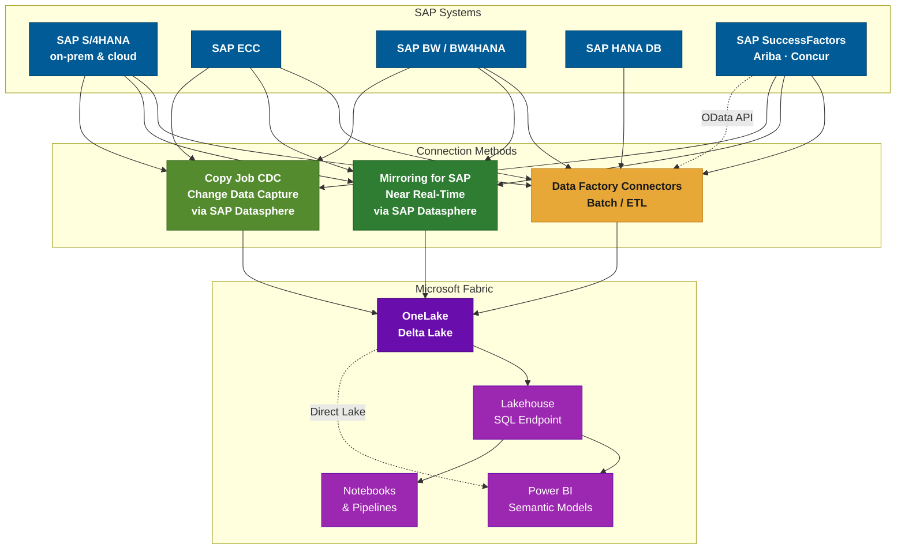
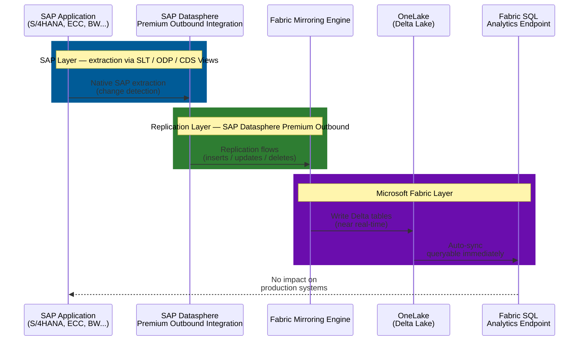

# SAP Connectivity in Microsoft Fabric

**Last updated:** April 2026  
**Sources:** Official Microsoft Fabric documentation, Fabric November 2025 Feature Summary (Ignite 2025), Fabric March 2026 Feature Summary (FabCon 2026)

---

## Glossary

| Acronym | Definition |
|---------|-----------|
| **CDC** | Change Data Capture — mechanism to track inserts, updates, and deletes |
| **CDS** | Core Data Services — SAP data modeling framework exposing ABAP entities as views |
| **ODP** | Operational Data Provisioning — SAP's standard delta extraction framework |
| **SLT** | SAP Landscape Transformation — trigger-based real-time replication within SAP |
| **OPDG** | On-Premises Data Gateway — Microsoft gateway for secure on-prem data access |
| **NCo** | SAP .NET Connector — library required to communicate with SAP via RFC |
| **RFC** | Remote Function Call — SAP's native protocol for inter-system communication |
| **Direct Lake** | Power BI mode reading Delta Lake files directly from OneLake (no import) |

---

## Overview

Microsoft Fabric offers multiple ways to connect to SAP systems, ranging from traditional batch/ETL connectors in Data Factory to near real-time replication via Mirroring. The right approach depends on freshness requirements, SAP source system, availability of SAP Datasphere, and the desired analytics pattern.

> **Power BI Direct Lake (GA March 2026):** Data ingested into OneLake — whether via connectors, Copy Job, or Mirroring — can be consumed by Power BI using Direct Lake mode. This eliminates the need for data import or intermediate semantic models, ensuring dashboards reflect the latest data with near-in-memory performance.

---

## Method 1 -- Data Factory Connectors (Batch / ETL)

Seven dedicated SAP connectors are available in Microsoft Fabric Data Factory for scheduled or on-demand data extraction. An **OData connector** is also available for SAP SaaS applications (SuccessFactors, S/4HANA Cloud, C4C) that expose OData APIs.

### Connector Reference Table

| Connector | Dataflow Gen2 | Pipeline (Copy) | Copy Job | Gateway Required |
|-----------|:-------------:|:---------------:|:--------:|-----------------|
| **SAP BW Application Server** | Yes (Import + DirectQuery) | No | No | On-premises *(NCo 3.0/3.1 required)* |
| **SAP BW Message Server** | Yes (Import + DirectQuery) | No | No | On-premises *(NCo 3.0/3.1 required)* |
| **SAP BW Open Hub -- App. Server** | Yes | Yes | No | On-premises *(gateway hosts SAP drivers)* |
| **SAP BW Open Hub -- Msg. Server** | Yes | Yes | No | On-premises |
| **SAP HANA Database** | Yes (incl. DirectQuery) | Yes (Lookup + Copy) | Yes | On-premises (Basic / Windows auth) |
| **SAP Table -- App. Server** | No | Yes | Yes | On-premises *(NCo required)* |
| **SAP Table -- Message Server** | No | Yes | No | On-premises |
| **OData (generic)** | Yes | Yes | No | None / On-premises |

### When to Use

- **SAP BW connectors** -- best for extracting data from BW InfoProviders, BEx queries, and Open Hub destinations. Supports BW 7.3, 7.5, BW/4HANA 2.0. Ideal for aggregated datasets rather than full transactional tables.
- **SAP HANA** -- direct read from HANA views, tables, and stored procedures. Also supports DirectQuery for calculation views via Dataflow Gen2. Supports Copy job for scalable ingestion of large datasets.
- **SAP Table** -- generic ABAP table/view extraction via RFC. Ideal for standard SAP tables (e.g., `VBAK`, `MARA`, `KNA1`). Suitable for medium-volume extractions.
- **OData** -- generic REST connector for SAP applications exposing OData APIs. Alternative for SAP SuccessFactors, S/4HANA Cloud, or C4C when SAP Datasphere is not available. Best for small-to-medium volumes (master data, config tables).

### Infrastructure Prerequisites

All SAP connectors (except OData) require the following infrastructure, **even when SAP runs in the cloud (Azure, BTP)**:

1. **On-Premises Data Gateway (OPDG)** deployed on a server near the SAP system
2. **SAP .NET Connector (NCo) 3.0 or 3.1** installed on the gateway server
3. **Network access** to SAP: RFC ports (33XX), HANA port (30015), secured via VPN/VNet or ExpressRoute
4. **SAP technical account** with appropriate authorizations (e.g., `S_RFC` for RFC, `S_TABU_DIS` for table reads)

> **Important limitations:**
>
> - **No native CDC** -- these connectors perform full or watermark-based incremental copies only. Deletions in SAP are not tracked; you must manage incremental logic manually (via date columns, change pointers, or full reloads).
> - **No dedicated connector for SAP SaaS apps** -- SuccessFactors, Ariba, and Concur do not have SAP-specific Fabric connectors. Use the OData connector or the Mirroring/Copy Job CDC approach via SAP Datasphere.
> - **Performance impact on SAP** -- extracting large volumes via RFC or BW queries consumes SAP resources. BW connectors are best for aggregated data; for massive transactional tables, consider SAP HANA direct or Mirroring.

---

## Method 2 -- Mirroring for SAP (Near Real-Time)

Mirroring for SAP provides **continuous, near real-time replication** of SAP data into Microsoft Fabric's OneLake, without any custom ETL pipeline to maintain. It operates as a Fabric item ("mirrored database"), fully managed by the platform.

### Architecture

**Technology stack:**
- **SAP Datasphere Premium Outbound Integration** — acts as the bridge between SAP source systems and Fabric, leveraging SAP's native data extraction technologies (SLT, ODP, CDS Views).
- **Fabric Mirroring Engine** — continuously replicates change data into OneLake in Delta Lake format.
- **SQL Analytics Endpoint** — automatically created, allowing immediate SQL queries over mirrored tables.

### Supported SAP Sources

| SAP System | Deployment | Support |
|-----------|-----------|---------|
| SAP S/4HANA | On-premises | Yes |
| SAP S/4HANA Cloud | Cloud (public + private) | Yes |
| SAP ECC | On-premises | Yes |
| SAP BW | On-premises | Yes |
| SAP BW/4HANA | On-premises & cloud | Yes |
| SAP SuccessFactors | SaaS | Yes |
| SAP Ariba | SaaS | Yes |
| SAP Concur | SaaS | Yes |

> **Other SAP systems** (SAP CRM, SRM, SCM, etc.) are typically based on the NetWeaver ABAP stack and are therefore covered through the same ODP/SLT mechanisms as SAP ECC. Any SAP system supporting ODP extraction is eligible for Mirroring via Datasphere.

### Key Benefits

- **No ETL code to maintain** -- schema evolution is handled automatically; data is replicated as-is (no in-flight transformation -- any transforms must be applied downstream in Fabric)
- **Near real-time freshness** -- changes flow continuously into OneLake (latency typically seconds to a few minutes depending on SAP/Datasphere throughput)
- **End-to-end lineage** -- full data governance and audit trail
- **Native Fabric integration** -- SQL endpoint, Power BI (including Direct Lake mode), Notebooks, and Lakehouses all consume mirrored data directly
- **Minimal impact on SAP production** -- extraction runs through SAP Datasphere using standard SAP mechanisms (ODP/SLT), not custom queries. Impact is controlled and optimized, though not zero (change journal reads and network transfers do occur)
- **Up to 1,000 tables** per mirrored database (increased from ~100 during preview at FabCon 2026)

### Prerequisites

1. **SAP Datasphere** license with **Premium Outbound Integration** add-on (mandatory -- without this, Mirroring is not available)
2. SAP Datasphere configured with Replication Flows pointing to the SAP source systems
3. **For on-premises SAP sources:** SAP Data Provisioning Agent (or SAP Cloud Connector) installed on-site to connect SAP ECC/BW/S4 to Datasphere
4. **For SAP Cloud sources:** OData connections activated in S/4HANA Cloud, SuccessFactors, etc., and registered in Datasphere
5. Fabric capacity (F2 or higher recommended for production)
6. Network connectivity: SAP Datasphere to Fabric (outbound HTTPS)

> **Note on SAP licensing:** SAP increasingly requires the use of official extraction products (Datasphere, Data Intelligence) rather than third-party tools for ODP-based extraction. This reinforces the Mirroring approach as the strategic, SAP-endorsed path.

---

## Method 3 -- Copy Job CDC for SAP

Introduced at **Ignite 2025**, Copy Job now supports **Change Data Capture (CDC)** for SAP via Datasphere. Unlike Mirroring (which is autonomous), Copy Job CDC provides **explicit orchestration control** within a Data Factory pipeline.

### How It Works

The mechanism operates in two stages:

1. **SAP Datasphere** extracts initial data then delta changes from the SAP source (via ODP/SLT replication flows) and deposits them as files (e.g., Parquet) on an intermediate cloud storage (typically **Azure Data Lake Storage Gen2**).
2. **Fabric Copy Job** reads those files from ADLS Gen2 and merges inserts/updates/deletes into the target Fabric Lakehouse (Delta tables).

SAP Datasphere acts as the "CDC staging layer" -- the same Replication Flows used for Mirroring can serve Copy Job CDC as well.

### Feature Summary

| Feature | Details |
|---------|---------|
| Change types captured | Inserts, Updates, Deletes |
| Watermark column needed | No |
| Manual refresh needed | No (scheduled trigger) |
| Merge destination | Fabric Lakehouse |
| Monitoring | Run-level stats: load type, row counts per insert/update/delete |
| Intermediate storage | ADLS Gen2 (or S3/GCS) configured in Datasphere |

### Prerequisites

1. **SAP Datasphere** license with **Premium Outbound Integration** (same as Mirroring)
2. SAP Data Provisioning Agent for on-premises sources (same as Mirroring)
3. Replication Flows configured in Datasphere targeting a cloud storage container (ADLS Gen2)
4. Fabric Copy Job configured to read from that storage container
5. Fabric capacity for the Copy Job execution

### When to Prefer Copy Job CDC over Mirroring

- You need to **control the synchronization schedule** (e.g., every 15 min during business hours, pause at night)
- You want to **integrate SAP CDC into a larger pipeline** with additional steps (transformations, validations, multi-source joins)
- You need to **limit continuous load** on infrastructure -- scheduled bursts instead of 24/7 streaming
- **Monitoring** is split across two systems: SAP Datasphere (replication health) and Fabric (Copy Job runs) -- plan accordingly

> **Latency:** Depends entirely on the scheduled frequency. A 5-minute interval means data can be up to 5 minutes stale. This is near-real-time but not streaming. For continuous freshness, use Mirroring.

### Copy Job Optimizations (FabCon 2026)

Since March 2026, Copy Job includes enhancements that benefit SAP CDC workflows:
- **Auto-partitioning** of large copies for better performance
- **Automatic audit columns** for tracking load history
- **Zero CU cost when no data changes** -- if no new deltas exist, no compute is consumed

---

## Alternative Approaches

Beyond the three primary methods, additional options exist for specific scenarios:

### OneLake Shortcuts

If your organization has already extracted SAP data into an external storage (e.g., Azure Data Lake via a legacy ETL or via SAP Datasphere itself), you can create a **OneLake Shortcut** pointing to that data. This avoids re-copying and makes existing SAP data immediately available across Fabric workloads without ingestion.

### Third-Party ETL Tools

Partners such as Informatica, Boomi, Theobald, and others offer SAP connectors that can write to OneLake. These are not covered here, but they exist as alternatives -- Microsoft's strategic direction favors native connectors and SAP Datasphere.

### Logic Apps / Power Automate

For event-driven micro-integrations (e.g., triggering a Fabric action when an SAP sales order is created), Azure Logic Apps or Power Automate with SAP connectors can push small payloads into Fabric. This is not suitable for bulk data movement but can complement the main methods for real-time event scenarios.

---

## Decision Guide

---

## Key Announcements

### Ignite 2025 -- November 2025

| Feature | Status | Coverage |
|---------|--------|---------|
| **Mirroring for SAP** | **Preview** | S/4HANA, BW, BW/4HANA, SuccessFactors, Ariba |
| **Copy Job CDC for SAP** via Datasphere | **GA** | SAP via Datasphere to Lakehouse |

**What it meant:** For the first time, Fabric offered a near real-time, no-ETL path for SAP data. The preview validated the architecture with early adopters across the SAP customer base.

---

### FabCon 2026 -- March 2026

| Feature | Status | What's New |
|---------|--------|-----------|
| **Mirroring for SAP** | **Generally Available** | Added SAP ECC + SAP Concur. Up to 1,000 tables. Production-ready. |
| **Copy Job enhancements** | **GA** | Auto-partitioning, audit columns, zero-cost when no changes |
| **Direct Lake for Power BI** | **GA** | Dashboards read Delta Lake directly from OneLake |

**What it means:** Mirroring for SAP is now a fully supported, enterprise-grade capability. Combined with Direct Lake, data flows from SAP to Power BI dashboards with minimal latency and zero intermediate copies.

> Official documentation: [Microsoft Fabric Mirrored Databases From SAP](https://learn.microsoft.com/fabric/mirroring/sap)

---

## Comparison Summary

| Criteria | Batch Connectors | Copy Job CDC | Mirroring for SAP |
|----------|:---:|:---:|:---:|
| **Freshness** | Hourly to daily | Minutes (scheduled) | Near real-time (continuous) |
| **Custom ETL** | Yes (watermark logic) | Minimal (schedule only) | None (zero-ETL) |
| **SAP Datasphere needed** | No | Yes | Yes |
| **Intermediate storage** | No | Yes (ADLS Gen2) | No (direct to OneLake) |
| **Supported SAP sources** | BW, HANA, ABAP Tables | Full SAP landscape via Datasphere | Full SAP landscape via Datasphere |
| **Power BI access** | DirectQuery for BW + HANA; Import for others | Direct Lake on Lakehouse | DirectQuery via SQL Endpoint + Direct Lake |
| **CDC (insert/update/delete)** | No | Yes (scheduled) | Yes (continuous) |
| **Max tables** | N/A (per pipeline) | N/A (per job) | 1,000 per mirrored database |
| **In-flight transformation** | Via Dataflow Gen2 | Post-copy only | No (raw replication) |
| **GA status** | All GA (since 2023) | GA (Nov 2025) | GA (March 2026) |

---

## Recommendations by Scenario

**Historical bulk load** (e.g., migrating years of financial data):
Use **batch connectors** -- SAP HANA or SAP Table via Pipeline Copy job with partitioning. For very large volumes, consider a staged approach via ADLS Gen2.

**Regular analytics refresh** (daily/hourly dashboards):
Use **batch connectors** for simple cases, or **Copy Job CDC** if you need incremental deltas without full reloads. Copy Job CDC is ideal when you already have SAP Datasphere.

**Real-time operational analytics** (live sales, inventory, supply chain):
Use **Mirroring for SAP** -- the most integrated approach, providing continuous data freshness with zero ETL maintenance. Combine with Power BI Direct Lake for instant dashboard updates.

**SAP SaaS applications without Datasphere** (SuccessFactors, Ariba):
Use the **OData connector** in Data Factory for moderate volumes. For larger needs, invest in SAP Datasphere to unlock Mirroring/CDC.

**Multi-source orchestrated pipeline** (SAP + other sources in a controlled flow):
Use **Copy Job CDC** within a Data Factory pipeline that also handles other sources, transformations, and validations in a unified orchestration.

**No SAP Datasphere available:**
Use **batch connectors** (BW, HANA, Table) with On-Premises Gateway. Consider **OneLake Shortcuts** if data already exists in an external Data Lake. Plan for SAP Datasphere adoption to unlock CDC and Mirroring capabilities.

---

## Appendix -- References

### Mirroring for SAP

| Resource | Link |
|----------|------|
| Mirrored Databases from SAP -- Official Docs | <https://learn.microsoft.com/fabric/mirroring/sap> |
| Mirroring Overview in Microsoft Fabric | <https://learn.microsoft.com/fabric/mirroring/overview> |
| Extended Capabilities in Mirroring (CDF, Views) | <https://learn.microsoft.com/fabric/mirroring/extended-capabilities> |
| Mirroring Troubleshooting Guide | <https://learn.microsoft.com/fabric/mirroring/troubleshooting> |

### Data Factory SAP Connectors

| Resource | Link |
|----------|------|
| Fabric Connector Overview (all connectors) | <https://learn.microsoft.com/fabric/data-factory/connector-overview> |
| SAP BW Open Hub Connector | <https://learn.microsoft.com/fabric/data-factory/connector-sap-bw-open-hub-overview> |
| SAP HANA Connector | <https://learn.microsoft.com/fabric/data-factory/connector-sap-hana-database-overview> |
| SAP Table Connector | <https://learn.microsoft.com/fabric/data-factory/connector-sap-table-overview> |
| SAP BW Application Server (Power Query) | <https://learn.microsoft.com/power-query/connectors/sap-bw/application-setup-and-connect> |
| OData Connector (usable for SAP SaaS) | <https://learn.microsoft.com/fabric/data-factory/connector-odata-overview> |

### Copy Job and CDC

| Resource | Link |
|----------|------|
| What is Copy Job in Data Factory | <https://learn.microsoft.com/fabric/data-factory/what-is-copy-job> |
| Change Data Capture (CDC) in Copy Job | <https://learn.microsoft.com/fabric/data-factory/copy-job-change-data-capture> |
| Copy Job Workspace Monitoring | <https://learn.microsoft.com/fabric/data-factory/copy-job-workspace-monitoring> |

### Power BI and OneLake

| Resource | Link |
|----------|------|
| Direct Lake Mode in Power BI | <https://learn.microsoft.com/fabric/fundamentals/direct-lake-overview> |
| OneLake Shortcuts | <https://learn.microsoft.com/fabric/onelake/onelake-shortcuts> |

### Announcements and Blogs

| Resource | Link |
|----------|------|
| Fabric November 2025 Feature Summary (Ignite 2025) | <https://blog.fabric.microsoft.com/en-us/blog/fabric-november-2025-feature-summary> |
| Fabric March 2026 Feature Summary (FabCon 2026) | <https://blog.fabric.microsoft.com/en-us/blog/fabric-march-2026-feature-summary> |
| FabCon and SQLCon 2026 Hero Blog (Arun Ulag) | <https://aka.ms/FabCon-SQLCon-2026-news> |
| SAP Data Integration in Fabric -- Blog (Sept 2024) | <https://blog.fabric.microsoft.com/en-us/blog/connecting-to-sap-data-in-microsoft-fabric> |

### SAP Datasphere

| Resource | Link |
|----------|------|
| SAP Datasphere Documentation | <https://help.sap.com/docs/SAP_DATASPHERE> |
| SAP Datasphere Premium Outbound Integration | <https://help.sap.com/docs/SAP_DATASPHERE/be5967d099974c69b77f4549425ca4c0/eb7ff31> |
| SAP Data Provisioning Agent (for on-premises) | <https://help.sap.com/docs/SAP_DATASPHERE/935116dd7c324355803d4b85809cec97> |

### Infrastructure

| Resource | Link |
|----------|------|
| On-Premises Data Gateway | <https://learn.microsoft.com/data-integration/gateway/service-gateway-onprem> |
| SAP .NET Connector (NCo) Download | <https://support.sap.com/en/product/connectors/msnet.html> |

### SAP Datasphere

| Resource | Link |
|----------|------|
| SAP Datasphere Documentation | <https://help.sap.com/docs/SAP_DATASPHERE> |
| SAP Datasphere Premium Outbound Integration | <https://help.sap.com/docs/SAP_DATASPHERE/be5967d099974c69b77f4549425ca4c0/eb7ff31> |
| SAP Data Provisioning Agent (for on-premises) | <https://help.sap.com/docs/SAP_DATASPHERE/935116dd7c324355803d4b85809cec97> |

