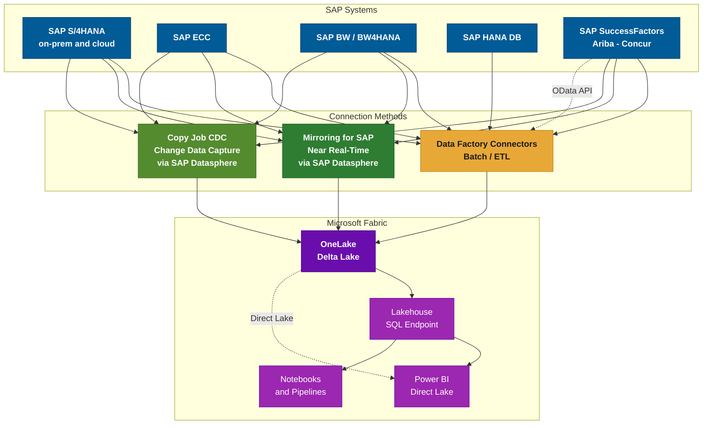
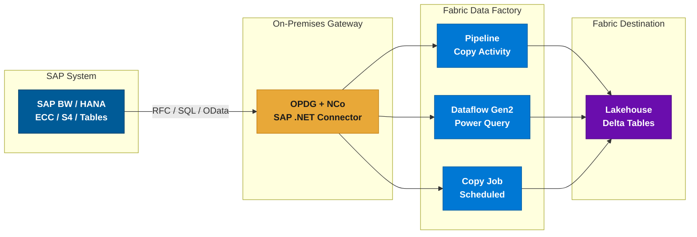
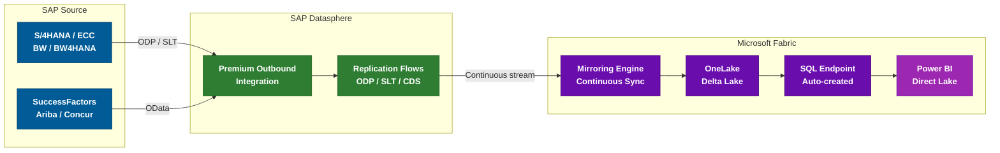
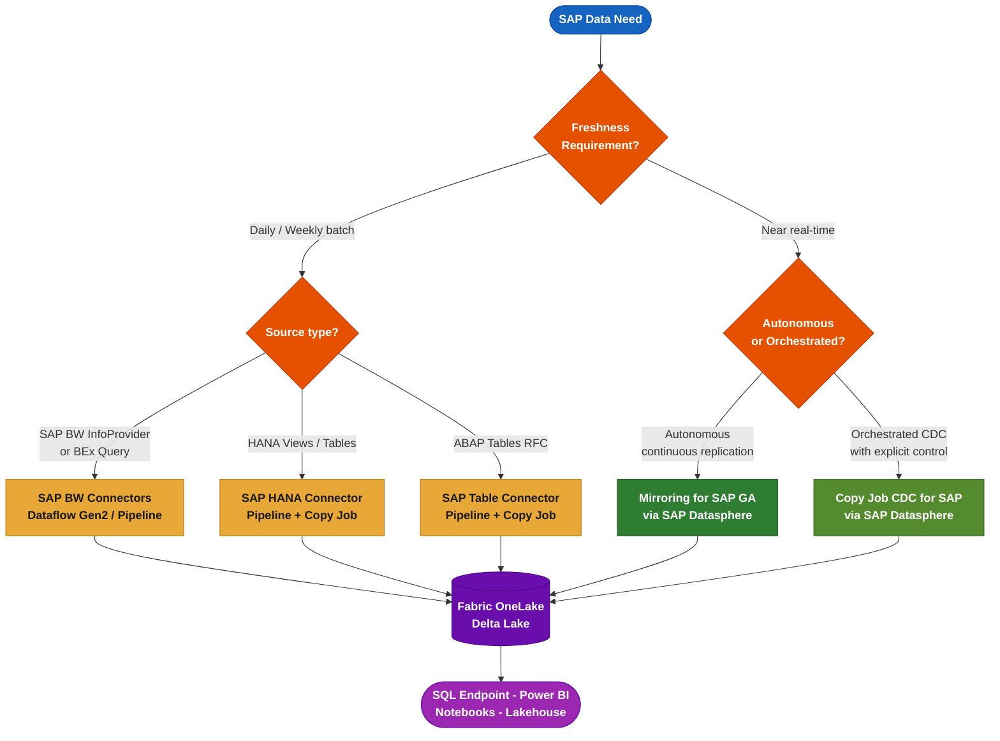

# SAP Connectivity in Microsoft Fabric

**Last updated:** April 2026  
**Sources:** Microsoft Fabric Documentation, Ignite 2025, FabCon 2026

---

## Overview

Microsoft Fabric offers multiple ways to connect to SAP systems, ranging from traditional batch/ETL connectors in Data Factory to near real-time replication via Mirroring. The right approach depends on freshness requirements, SAP source system, availability of SAP Datasphere, and the desired analytics pattern.

> **Power BI Direct Lake (GA March 2026):** Data ingested into OneLake -- whether via connectors, Copy Job, or Mirroring -- can be consumed by Power BI using Direct Lake mode. This eliminates the need for data import or intermediate semantic models, ensuring dashboards reflect the latest data with near-in-memory performance.

---

## Method 1 -- Data Factory Connectors (Batch / ETL)

Seven dedicated SAP connectors are available in Microsoft Fabric Data Factory for scheduled or on-demand data extraction. An **OData connector** is also available for SAP SaaS applications (SuccessFactors, S/4HANA Cloud, C4C) that expose OData APIs.

### Connector Reference Table

| Connector | Dataflow Gen2 | Pipeline (Copy) | Copy Job | Gateway |
|-----------|:---:|:---:|:---:|---------|
| **SAP BW Application Server** | &#9679; Import + DQ | &#9675; | &#9675; | OPDG + NCo 3.x |
| **SAP BW Message Server** | &#9679; Import + DQ | &#9675; | &#9675; | OPDG + NCo 3.x |
| **SAP BW Open Hub -- App Server** | &#9679; | &#9679; | &#9675; | OPDG |
| **SAP BW Open Hub -- Msg Server** | &#9679; | &#9679; | &#9675; | OPDG |
| **SAP HANA Database** | &#9679; incl. DQ | &#9679; Lookup + Copy | &#9679; | OPDG |
| **SAP Table -- App Server** | &#9675; | &#9679; | &#9679; | OPDG + NCo |
| **SAP Table -- Msg Server** | &#9675; | &#9679; | &#9675; | OPDG |
| **OData (generic)** | &#9679; | &#9679; | &#9675; | None / OPDG |

> **Legend:** &#9679; = Supported | &#9675; = Not supported | DQ = DirectQuery

### When to Use

- **SAP BW connectors** -- BW InfoProviders, BEx queries, Open Hub destinations. BW 7.3, 7.5, BW/4HANA 2.0. Best for aggregated datasets.
- **SAP HANA** -- HANA views, tables, stored procedures. Also supports DirectQuery via Dataflow Gen2.
- **SAP Table** -- ABAP table/view extraction via RFC (`VBAK`, `MARA`, `KNA1`). Medium-volume extractions.
- **OData** -- SAP apps exposing OData APIs (SuccessFactors, S/4HANA Cloud, C4C). Small-to-medium volumes.

### Infrastructure Prerequisites

All SAP connectors (except OData) require this infrastructure, **even when SAP runs in the cloud**:

1. **On-Premises Data Gateway (OPDG)** deployed near the SAP system
2. **SAP .NET Connector (NCo) 3.0 or 3.1** installed on the gateway server
3. **Network access** to SAP: RFC ports (33XX), HANA port (30015), via VPN/VNet or ExpressRoute
4. **SAP technical account** with appropriate authorizations (`S_RFC`, `S_TABU_DIS`)

> **Important limitations:**
>
> - **No native CDC** -- full or watermark-based incremental only. SAP deletions are not tracked.
> - **No dedicated connector for SAP SaaS** -- SuccessFactors, Ariba, Concur require OData or Mirroring/CDC.
> - **Performance impact on SAP** -- large RFC/BW extractions consume SAP resources. For massive tables, prefer HANA direct or Mirroring.

---

## Method 2 -- Mirroring for SAP (Near Real-Time)

Mirroring for SAP provides **continuous, near real-time replication** of SAP data into OneLake, without any custom ETL. It operates as a Fabric item ("mirrored database"), fully managed by the platform.

### Supported SAP Sources

| SAP System | Deployment | Supported |
|-----------|-----------|:---:|
| SAP S/4HANA | On-premises | &#9679; |
| SAP S/4HANA Cloud | Cloud (public + private) | &#9679; |
| SAP ECC | On-premises | &#9679; |
| SAP BW | On-premises | &#9679; |
| SAP BW/4HANA | On-premises and cloud | &#9679; |
| SAP SuccessFactors | SaaS | &#9679; |
| SAP Ariba | SaaS | &#9679; |
| SAP Concur | SaaS | &#9679; |

> **Other SAP systems** (CRM, SRM, SCM) based on NetWeaver ABAP are covered via ODP/SLT, same as ECC. Any SAP system supporting ODP extraction is eligible.

### Key Benefits

- **Zero ETL** -- schema evolution handled automatically; raw replication (transforms applied downstream)
- **Near real-time** -- latency typically seconds to a few minutes
- **End-to-end lineage** -- full governance and audit trail
- **Native Fabric integration** -- SQL endpoint, Power BI Direct Lake, Notebooks, Lakehouses
- **Minimal impact on SAP** -- uses standard ODP/SLT mechanisms via Datasphere (not custom queries)
- **Up to 1,000 tables** per mirrored database (increased from ~100 at FabCon 2026)

### Prerequisites

1. **SAP Datasphere** with **Premium Outbound Integration** (mandatory)
2. Replication Flows configured in Datasphere
3. **On-premises SAP:** Data Provisioning Agent or SAP Cloud Connector on-site
4. **SAP Cloud sources:** OData connections activated and registered in Datasphere
5. Fabric capacity (F2+ recommended)
6. Network: SAP Datasphere to Fabric (outbound HTTPS)

> **SAP licensing note:** SAP requires official extraction products (Datasphere, Data Intelligence) for ODP-based extraction. This reinforces Mirroring as the strategic SAP-endorsed path.

---

## Method 3 -- Copy Job CDC for SAP

Introduced at **Ignite 2025**, Copy Job supports **Change Data Capture (CDC)** for SAP via Datasphere. Unlike Mirroring (autonomous), Copy Job CDC provides **explicit orchestration control** within a Data Factory pipeline.

```mermaid
graph LR
    subgraph SAP["SAP Source"]
        A[S/4HANA / ECC<br/>BW / SaaS]
    end
    subgraph DS["SAP Datasphere"]
        B[Replication Flows<br/>ODP / SLT]
    end
    subgraph Stage["Staging"]
        C[ADLS Gen2<br/>Parquet files]
    end
    subgraph DF["Fabric Data Factory"]
        D[Copy Job<br/>Scheduled CDC]
    end
    subgraph Dest["Fabric"]
        E[Lakehouse<br/>Delta merge]
        F[Power BI<br/>Direct Lake]
    end

    A -->|Extract deltas| B
    B -->|Deposit files| C
    C -->|Read deltas| D
    D -->|Merge I/U/D| E
    E --> F

    classDef sapStyle fill:#005B97,stroke:#003D66,color:#ffffff,font-weight:bold
    classDef dsStyle fill:#2E7D32,stroke:#1B5E20,color:#ffffff,font-weight:bold
    classDef stageStyle fill:#E8A838,stroke:#C07C10,color:#1a1a1a,font-weight:bold
    classDef dfStyle fill:#558B2F,stroke:#33691E,color:#ffffff,font-weight:bold
    classDef destStyle fill:#6A0DAD,stroke:#4A0080,color:#ffffff,font-weight:bold

    class A sapStyle
    class B dsStyle
    class C stageStyle
    class D dfStyle
    class E,F destStyle
```

### How It Works

Two-stage mechanism:

1. **SAP Datasphere** extracts initial data then delta changes (ODP/SLT) and deposits Parquet files on **Azure Data Lake Storage Gen2**.
2. **Fabric Copy Job** reads those files and merges inserts/updates/deletes into the Fabric Lakehouse (Delta).

### Feature Summary

| Feature | Value |
|---------|:---:|
| Change types captured | Inserts, Updates, Deletes |
| Watermark column needed | &#9675; Not required |
| Manual refresh needed | &#9675; Scheduled trigger |
| Merge destination | Lakehouse (Delta) |
| Intermediate storage | ADLS Gen2 / S3 / GCS |

### Prerequisites

1. **SAP Datasphere** with **Premium Outbound Integration** (same as Mirroring)
2. Data Provisioning Agent for on-premises sources
3. Replication Flows targeting a cloud storage container (ADLS Gen2)
4. Fabric Copy Job configured to read from that container

### When to Prefer over Mirroring

- **Control the schedule** (e.g., every 15 min during business hours, pause at night)
- **Multi-source pipeline** with additional transforms, validations, or joins
- **Limit continuous load** -- scheduled bursts vs. 24/7 streaming
- **Monitoring** is split: Datasphere (replication health) + Fabric (Copy Job runs)

> **Latency** depends on scheduled frequency. A 5-minute interval = up to 5 minutes stale. For continuous freshness, use Mirroring.

### Copy Job Optimizations (FabCon 2026)

- **Auto-partitioning** for better performance on large copies
- **Automatic audit columns** for load tracking
- **Zero CU cost** when no data changes exist

---

## Alternative Approaches

### OneLake Shortcuts

If SAP data already exists in external storage (ADLS, S3), create a **OneLake Shortcut** to make it available in Fabric without re-copying.

### Third-Party ETL Tools

Informatica, Boomi, Theobald, and others offer SAP connectors writing to OneLake. Microsoft's strategic direction favors native connectors and SAP Datasphere.

### Logic Apps / Power Automate

For event-driven micro-integrations (e.g., SAP order creation triggers a Fabric action). Not suitable for bulk data.

---

## Decision Guide

---

## Key Announcements

### Ignite 2025 -- November 2025

| Feature | Status | Coverage |
|---------|:---:|---------|
| **Mirroring for SAP** | &#9673; Preview | S/4HANA, BW, BW/4HANA, SuccessFactors, Ariba |
| **Copy Job CDC for SAP** | &#9679; GA | SAP via Datasphere to Lakehouse |

### FabCon 2026 -- March 2026

| Feature | Status | What's New |
|---------|:---:|-----------|
| **Mirroring for SAP** | &#9679; GA | + SAP ECC, + Concur. Up to 1,000 tables. |
| **Copy Job enhancements** | &#9679; GA | Auto-partitioning, audit columns, zero-cost |
| **Direct Lake for Power BI** | &#9679; GA | Dashboards read Delta directly from OneLake |

> **Docs:** [Microsoft Fabric Mirrored Databases From SAP](https://learn.microsoft.com/fabric/mirroring/sap)

---

## Comparison Summary

| Criteria | Batch Connectors | Copy Job CDC | Mirroring for SAP |
|----------|:---:|:---:|:---:|
| **Freshness** | Hourly to daily | Minutes (scheduled) | Near real-time (continuous) |
| **Custom ETL needed** | Required | Minimal | None (zero-ETL) |
| **SAP Datasphere** | &#9675; Not required | &#9679; Required | &#9679; Required |
| **Intermediate storage** | &#9675; | &#9679; ADLS Gen2 | &#9675; Direct to OneLake |
| **SAP sources** | BW, HANA, Tables | Full landscape | Full landscape |
| **Power BI access** | DQ (BW/HANA) + Import | Direct Lake | SQL Endpoint + Direct Lake |
| **Native CDC** | &#9675; Not supported | &#9679; Scheduled | &#9679; Continuous |
| **Max tables** | Per pipeline | Per job | 1,000 per mirrored DB |
| **In-flight transform** | Via Dataflow Gen2 | Post-copy | &#9675; Raw replication |
| **GA status** | All GA (2023) | GA (Nov 2025) | GA (March 2026) |

> **Legend:** &#9679; = Yes / Supported | &#9675; = No / Not supported | &#9673; = Preview

---

## Recommendations by Scenario

**Historical bulk load** (migrating years of data):
Use **batch connectors** -- SAP HANA or SAP Table via Pipeline Copy job with partitioning.

**Regular analytics refresh** (daily/hourly dashboards):
Use **batch connectors** for simple cases, or **Copy Job CDC** for incremental deltas.

**Real-time operational analytics** (live sales, inventory):
Use **Mirroring for SAP** + Power BI Direct Lake for continuous dashboard freshness.

**SAP SaaS without Datasphere** (SuccessFactors, Ariba):
Use the **OData connector** for moderate volumes; invest in Datasphere for scale.

**Multi-source orchestrated pipeline** (SAP + other sources):
Use **Copy Job CDC** in a Data Factory pipeline with transforms and validations.

**No SAP Datasphere available:**
Use **batch connectors** + OPDG. Consider **OneLake Shortcuts** for existing data lakes.

---

## Appendix A -- References

### Mirroring for SAP

| Resource | Link |
|----------|------|
| Mirrored Databases from SAP | <https://learn.microsoft.com/fabric/mirroring/sap> |
| Mirroring Overview | <https://learn.microsoft.com/fabric/mirroring/overview> |
| Extended Capabilities (CDF, Views) | <https://learn.microsoft.com/fabric/mirroring/extended-capabilities> |
| Troubleshooting Guide | <https://learn.microsoft.com/fabric/mirroring/troubleshooting> |

### Data Factory SAP Connectors

| Resource | Link |
|----------|------|
| Connector Overview (all) | <https://learn.microsoft.com/fabric/data-factory/connector-overview> |
| SAP BW Open Hub | <https://learn.microsoft.com/fabric/data-factory/connector-sap-bw-open-hub-overview> |
| SAP HANA | <https://learn.microsoft.com/fabric/data-factory/connector-sap-hana-database-overview> |
| SAP Table | <https://learn.microsoft.com/fabric/data-factory/connector-sap-table-overview> |
| SAP BW Application Server | <https://learn.microsoft.com/power-query/connectors/sap-bw/application-setup-and-connect> |
| OData Connector | <https://learn.microsoft.com/fabric/data-factory/connector-odata-overview> |

### Copy Job and CDC

| Resource | Link |
|----------|------|
| What is Copy Job | <https://learn.microsoft.com/fabric/data-factory/what-is-copy-job> |
| CDC in Copy Job | <https://learn.microsoft.com/fabric/data-factory/copy-job-change-data-capture> |
| Copy Job Monitoring | <https://learn.microsoft.com/fabric/data-factory/copy-job-workspace-monitoring> |

### Power BI and OneLake

| Resource | Link |
|----------|------|
| Direct Lake Mode | <https://learn.microsoft.com/fabric/fundamentals/direct-lake-overview> |
| OneLake Shortcuts | <https://learn.microsoft.com/fabric/onelake/onelake-shortcuts> |

### Announcements

| Resource | Link |
|----------|------|
| Ignite 2025 Feature Summary | <https://blog.fabric.microsoft.com/en-us/blog/fabric-november-2025-feature-summary> |
| FabCon 2026 Feature Summary | <https://blog.fabric.microsoft.com/en-us/blog/fabric-march-2026-feature-summary> |
| FabCon 2026 Hero Blog | <https://aka.ms/FabCon-SQLCon-2026-news> |
| SAP in Fabric Blog (Sept 2024) | <https://blog.fabric.microsoft.com/en-us/blog/connecting-to-sap-data-in-microsoft-fabric> |

### SAP Datasphere

| Resource | Link |
|----------|------|
| SAP Datasphere Docs | <https://help.sap.com/docs/SAP_DATASPHERE> |
| Premium Outbound Integration | <https://help.sap.com/docs/SAP_DATASPHERE/be5967d099974c69b77f4549425ca4c0/eb7ff31> |
| Data Provisioning Agent | <https://help.sap.com/docs/SAP_DATASPHERE/935116dd7c324355803d4b85809cec97> |

### Infrastructure

| Resource | Link |
|----------|------|
| On-Premises Data Gateway | <https://learn.microsoft.com/data-integration/gateway/service-gateway-onprem> |
| SAP .NET Connector (NCo) | <https://support.sap.com/en/product/connectors/msnet.html> |

---

## Appendix B -- Glossary

| Acronym | Definition |
|---------|-----------|
| **CDC** | Change Data Capture -- track inserts, updates, and deletes |
| **CDS** | Core Data Services -- SAP data modeling framework |
| **ODP** | Operational Data Provisioning -- SAP delta extraction framework |
| **SLT** | SAP Landscape Transformation -- trigger-based real-time replication |
| **OPDG** | On-Premises Data Gateway -- Microsoft gateway for on-prem data |
| **NCo** | SAP .NET Connector -- library for SAP RFC communication |
| **RFC** | Remote Function Call -- SAP native inter-system protocol |
| **Direct Lake** | Power BI mode reading Delta files directly from OneLake |
| **DQ** | DirectQuery -- live query mode in Power BI |
