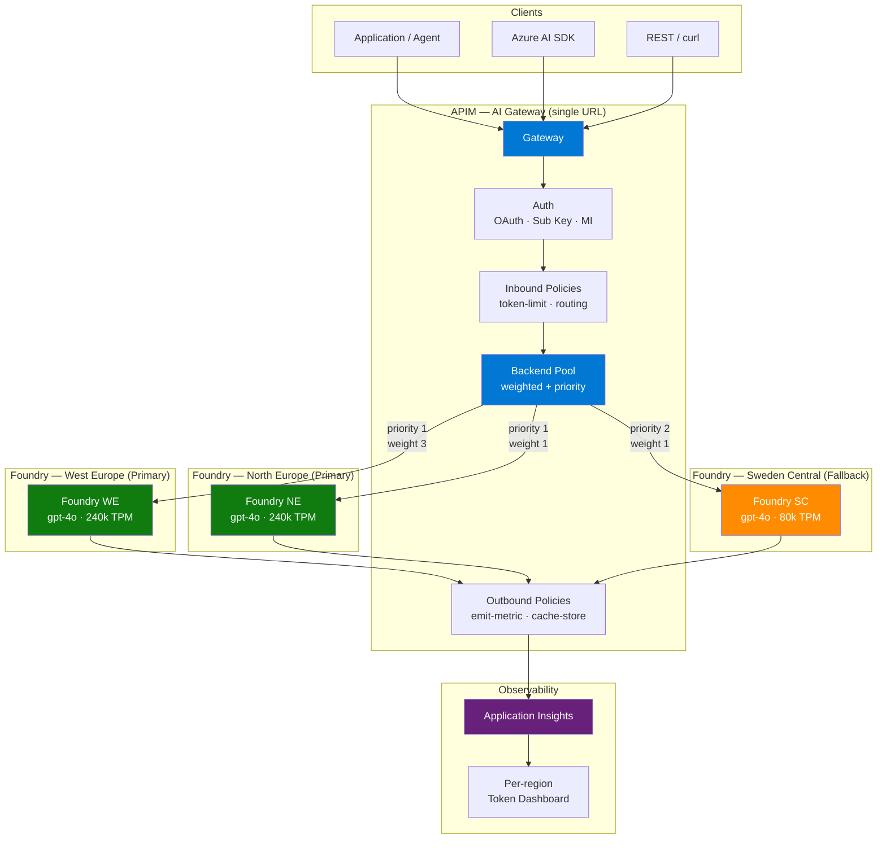
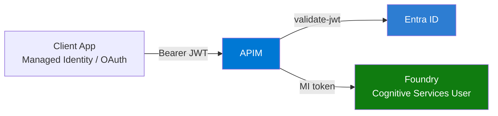
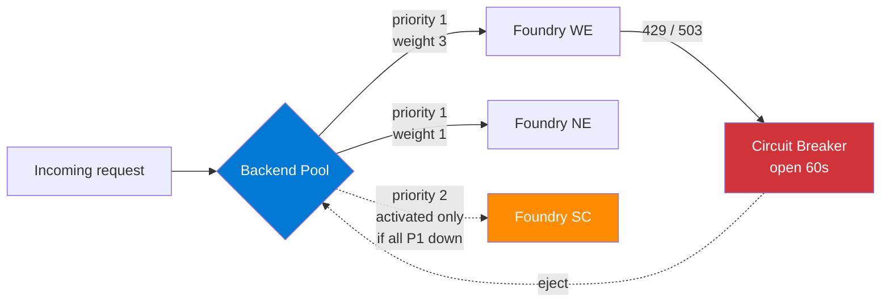
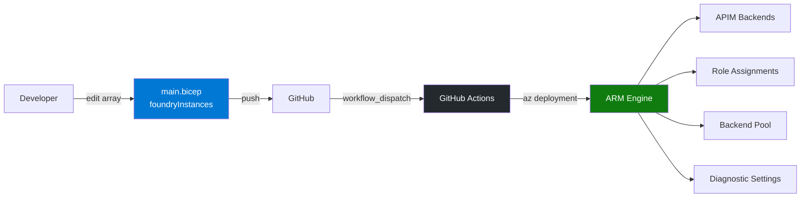
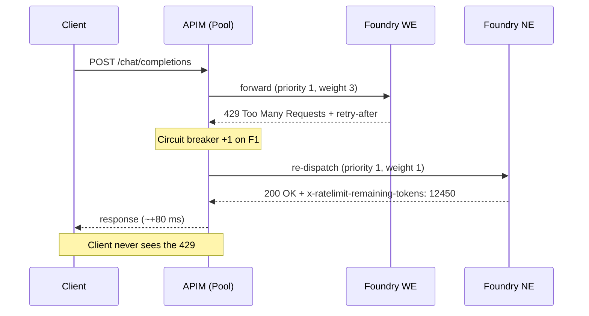
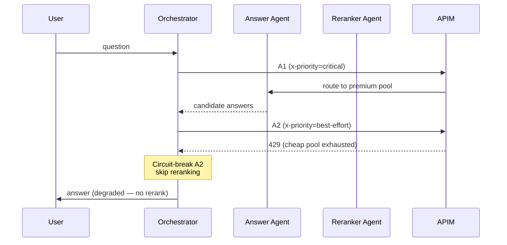
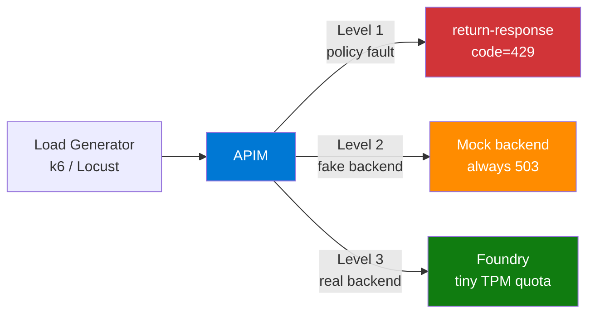
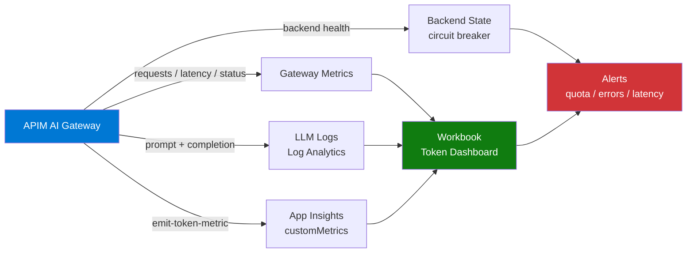

> Scale **multiple Azure AI Foundry resources** behind a single **Azure API Management (APIM) AI Gateway** — multi-region failover, weighted load balancing, semantic routing, centralized infrastructure-as-code, and resilient quota handling for streaming and agent-to-agent workloads.

---

## Table of Contents

- [Overview](#overview)
- [Architecture](#architecture)
- [Security & Governance](#security--governance)
- [Pattern 1 — Multi-Endpoint Exposure (Named Backends)](#pattern-1--multi-endpoint-exposure-named-backends)
- [Pattern 2 — Backend Pool with Load Balancing & Circuit Breaker](#pattern-2--backend-pool-with-load-balancing--circuit-breaker)
- [Pattern 3 — Semantic Routing (Preview)](#pattern-3--semantic-routing-preview)
- [Centralized Bicep IaC for Multi-Foundry](#centralized-bicep-iac-for-multi-foundry)
- [Quota Flow — How APIM Knows a Backend Is Saturated](#quota-flow--how-apim-knows-a-backend-is-saturated)
- [Mid-Chat Throttling — What Happens During a Conversation](#mid-chat-throttling--what-happens-during-a-conversation)
- [Agent-to-Agent Throttling Patterns](#agent-to-agent-throttling-patterns)
- [Test & Simulation — Validating the Circuit Breaker](#test--simulation--validating-the-circuit-breaker)
- [Observability & Operations](#observability--operations)
- [Cost & FinOps](#cost--finops)
- [Decision Matrix](#decision-matrix)
- [References](#references)

---

## Overview

The companion document [Foundry_Agent_Monitoring_APIM](Foundry_Agent_Monitoring_APIM.md) describes how a **single** Foundry resource can be exposed via APIM for per-user token tracking. This guide answers the next question: **what happens when one Foundry instance is no longer enough?**

Common scaling triggers:

- **Quota exhaustion** — a single AOAI / Foundry deployment hits its TPM (tokens-per-minute) ceiling per region.
- **Multi-region resiliency** — fail over to another region when the primary is throttled or unavailable.
- **Multi-model exposure** — expose `gpt-4o`, `gpt-4o-mini`, `o4-mini`, `text-embedding-3-large`, etc. through one stable URL.
- **Cost optimization** — route cheap prompts to a cheap model, expensive prompts to a frontier model.
- **Tenant / team isolation** — different APIM Products consume different backend pools.

APIM acting as an **AI Gateway** solves all of these without requiring any change in the calling application — clients keep talking to a single URL.

> **Foundry context** — A "Foundry resource" exposes its inference endpoint at `https://<resource>.services.ai.azure.com/api/projects/<project>`. Inside, deployments can be Azure OpenAI, Azure AI Inference, Cohere, Mistral, Llama, or any model from the catalog. APIM treats each one as a backend.

### What APIM AI Gateway adds

| Capability | Benefit |
|------------|---------|
| **Backend Pool** (GA, October 2024) | Round-robin / weighted / priority load balancing across N backends |
| **Circuit Breaker** | Auto-eviction on `429` / `5xx` for a configurable cooldown |
| **`azure-openai-token-limit` policy** | TPM enforcement per subscription / user / IP |
| **`azure-openai-emit-token-metric` policy** | Per-caller token + cost metrics in Application Insights |
| **`llm-semantic-cache-lookup/store`** | Embedding-based response cache (cuts cost ~30-50% on FAQ workloads) |
| **`llm-semantic-routing` (preview)** | Route by **prompt meaning**, not by URL or header |
| **Managed Identity** | No keys to rotate — APIM authenticates to Foundry with its system-assigned identity |

---

## Architecture



**Key idea** — clients see one URL. APIM owns the routing logic, the keys, the metrics, and the resilience. Foundry resources can be added or removed without changing client code.

---

## Security & Governance

A multi-Foundry gateway is also a **single point of policy enforcement**. Centralizing security and governance there avoids re-implementing them in every client.

### Authentication — kill the API keys



| Hop | Recommended | Avoid |
|-----|-------------|-------|
| Client → APIM | OAuth2 / OIDC bearer token (Entra ID) — validated by `<validate-jwt>` | Long-lived `Ocp-Apim-Subscription-Key` in source code |
| APIM → Foundry | System-assigned **Managed Identity** + RBAC `Cognitive Services User` | Foundry API keys stored in named-values |
| Service-to-service | Workload identity federation (GitHub / Argo / AKS) | Service principal client secret |

Inbound policy:

```xml
<inbound>
  <base />
  <validate-jwt header-name="Authorization" failed-validation-httpcode="401">
    <openid-config url="https://login.microsoftonline.com/{{tenant-id}}/v2.0/.well-known/openid-configuration" />
    <required-claims>
      <claim name="aud"><value>{{api-app-id}}</value></claim>
    </required-claims>
  </validate-jwt>
  <set-backend-service backend-id="foundry-pool" />
  <authentication-managed-identity resource="https://cognitiveservices.azure.com" />
</inbound>
```

### Content Safety — filter prompts and completions

Add the [`llm-content-safety`](https://learn.microsoft.com/azure/api-management/llm-content-safety-policy) policy to forward every prompt (and optionally completion) to **Azure AI Content Safety** before it reaches the model. Requests that exceed the configured severity thresholds are rejected at the gateway with `403`, never billed to Foundry.

```xml
<inbound>
  <base />
  <llm-content-safety
      backend-id="content-safety"
      shield-prompt="true">
    <categories>
      <category name="Hate"     threshold="4" />
      <category name="Violence" threshold="4" />
      <category name="Sexual"   threshold="4" />
      <category name="SelfHarm" threshold="4" />
    </categories>
  </llm-content-safety>
</inbound>
```

> **Prompt-shield** also catches indirect prompt injection (poisoned RAG documents, untrusted tool outputs). Recommended on any agent that can call tools or fetch external content.

### Governance — quotas, products, attribution

APIM **Products** are the unit of governance. Each consuming team subscribes to a Product, which carries its own subscription key, quota, and allowed APIs.

```xml
<inbound>
  <base />
  <llm-token-limit
      counter-key="@(context.Subscription.Id)"
      tokens-per-minute="60000"
      tokens-per-day="2000000"
      estimate-prompt-tokens="true"
      tokens-consumed-header-name="x-tokens-consumed"
      remaining-tokens-header-name="x-tokens-remaining" />
</inbound>
```

| Lever | What it gives you |
|-------|-------------------|
| `llm-token-limit` per `context.Subscription.Id` | Hard TPM/TPD ceiling per team |
| Per-Product policy | Different quotas for `team-marketing` vs `team-research` |
| `azure-openai-emit-token-metric` with `user-id` dimension | Per-user attribution in App Insights |
| APIM Developer Portal | Self-service onboarding — teams request access, get a key, view their quota |
| Subscription approval workflow | Manual gate for sensitive Products (e.g. legal, HR) |

> **Cross-link** — per-user / per-agent attribution mechanics (KQL queries, dashboards) are detailed in [Foundry_Agent_Monitoring_APIM](Foundry_Agent_Monitoring_APIM.md).

---

## Pattern 1 — Multi-Endpoint Exposure (Named Backends)

The simplest pattern. Each model or region is a **named backend**; the routing decision is made by reading a request property (header, query parameter, or body field).

### Backend definition (Bicep)

```bicep
resource backendGpt4o 'Microsoft.ApiManagement/service/backends@2024-05-01' = {
  name: 'foundry-gpt-4o'
  parent: apim
  properties: {
    url: 'https://foundry-we.services.ai.azure.com/openai/deployments/gpt-4o'
    protocol: 'http'
    credentials: {
      header: { 'api-key': [ '{{foundry-we-key}}' ] }
    }
  }
}

resource backendGpt4oMini 'Microsoft.ApiManagement/service/backends@2024-05-01' = {
  name: 'foundry-gpt-4o-mini'
  parent: apim
  properties: {
    url: 'https://foundry-we.services.ai.azure.com/openai/deployments/gpt-4o-mini'
    protocol: 'http'
  }
}
```

### Routing policy (header-based)

```xml
<policies>
  <inbound>
    <base />
    <choose>
      <when condition="@(context.Request.Headers.GetValueOrDefault("x-model","").Equals("gpt-4o-mini"))">
        <set-backend-service backend-id="foundry-gpt-4o-mini" />
      </when>
      <when condition="@(context.Request.Headers.GetValueOrDefault("x-model","").Equals("gpt-4o"))">
        <set-backend-service backend-id="foundry-gpt-4o" />
      </when>
      <otherwise>
        <set-backend-service backend-id="foundry-gpt-4o-mini" />
      </otherwise>
    </choose>
  </inbound>
</policies>
```

> **When to use** — small number of models, deterministic routing, no resiliency requirements. Each backend is a single point of failure.

---

## Pattern 2 — Backend Pool with Load Balancing & Circuit Breaker

The recommended pattern for **resilient multi-region** deployments. APIM's `Pool` backend type combines several backends into one logical target; APIM automatically distributes traffic according to **priority** and **weight** and ejects unhealthy backends via a **circuit breaker**.

### Concept



- **Priority** — backends with priority `1` receive all traffic; priority `2` activates only when all priority-1 backends are tripped.
- **Weight** — within a priority tier, traffic is split proportionally (here `3:1` ratio between WE and NE).
- **Circuit breaker** — after N consecutive failures, the backend is taken out of rotation for a cooldown period. Native trigger on `429` and `5xx`.

### Bicep — pool with circuit breaker

```bicep
resource foundryWE 'Microsoft.ApiManagement/service/backends@2024-05-01' = {
  name: 'foundry-we'
  parent: apim
  properties: {
    url: 'https://foundry-we.services.ai.azure.com/api/projects/default'
    protocol: 'http'
    circuitBreaker: {
      rules: [
        {
          name: 'aoai-throttle'
          failureCondition: {
            count: 3
            interval: 'PT1M'
            statusCodeRanges: [ { min: 429, max: 429 }, { min: 500, max: 599 } ]
          }
          tripDuration: 'PT1M'
        }
      ]
    }
  }
}

resource foundryNE 'Microsoft.ApiManagement/service/backends@2024-05-01' = {
  name: 'foundry-ne'
  parent: apim
  properties: {
    url: 'https://foundry-ne.services.ai.azure.com/api/projects/default'
    protocol: 'http'
  }
}

resource foundrySC 'Microsoft.ApiManagement/service/backends@2024-05-01' = {
  name: 'foundry-sc'
  parent: apim
  properties: {
    url: 'https://foundry-sc.services.ai.azure.com/api/projects/default'
    protocol: 'http'
  }
}

resource pool 'Microsoft.ApiManagement/service/backends@2024-05-01' = {
  name: 'foundry-pool'
  parent: apim
  properties: {
    type: 'Pool'
    pool: {
      services: [
        { id: foundryWE.id, weight: 3, priority: 1 }
        { id: foundryNE.id, weight: 1, priority: 1 }
        { id: foundrySC.id, weight: 1, priority: 2 }
      ]
    }
  }
}
```

### Policy

```xml
<policies>
  <inbound>
    <base />
    <set-backend-service backend-id="foundry-pool" />
    <authentication-managed-identity resource="https://cognitiveservices.azure.com" />
  </inbound>
</policies>
```

That's it. APIM handles failover transparently — the client never sees a `429`.

---

## Pattern 3 — Semantic Routing (Preview)

`llm-semantic-routing` (and its Azure-OpenAI-specific cousin `azure-openai-semantic-routing`) routes a request to a backend based on the **embedding similarity** between the prompt and a set of route definitions. It uses an embedding model to convert the user's prompt into a vector, then picks the route whose anchor phrase is closest in cosine distance.

### Example — route by intent

```xml
<policies>
  <inbound>
    <base />
    <azure-openai-semantic-routing
        embeddings-backend-id="text-embedding-3-small"
        threshold="0.75">
      <route backend-id="foundry-codegen">
        <phrase>write code · refactor · debug · explain function</phrase>
      </route>
      <route backend-id="foundry-summarize">
        <phrase>summarize · TL;DR · extract key points</phrase>
      </route>
      <route backend-id="foundry-creative">
        <phrase>write a story · poem · marketing copy · brainstorm</phrase>
      </route>
      <default-route backend-id="foundry-pool" />
    </azure-openai-semantic-routing>
  </inbound>
</policies>
```

### Cost & latency

| Factor | Impact |
|--------|--------|
| Extra embedding call | `text-embedding-3-small` ≈ $0.02 / 1M tokens — negligible for short prompts |
| Added latency | +50 to +150 ms (one embedding round-trip per request) |
| Threshold tuning | Below `0.7` → too many false positives; above `0.85` → most requests fall to `<default-route>` |

> **Always declare a `<default-route>`** — otherwise unmatched prompts fail with `503`. In preview, also pin a max-results-per-route to avoid pathological hot spots.

---

## Centralized Bicep IaC for Multi-Foundry

A single declarative file drives the whole topology. Adding a new region or model becomes **a one-line change** — backends, RBAC and the pool regenerate automatically.



### `main.bicep` — full pattern

```bicep
@description('Declarative list of Foundry instances behind the gateway')
param foundryInstances array = [
  { name: 'foundry-we', region: 'westeurope',     priority: 1, weight: 3 }
  { name: 'foundry-ne', region: 'northeurope',    priority: 1, weight: 1 }
  { name: 'foundry-sc', region: 'swedencentral',  priority: 2, weight: 1 }
]

resource apim 'Microsoft.ApiManagement/service@2024-05-01' existing = {
  name: 'apim-ai-gateway'
}

// 0. Foundry resources (or 'existing' if pre-provisioned)
resource foundryRes 'Microsoft.CognitiveServices/accounts@2024-10-01' = [for f in foundryInstances: {
  name: f.name
  location: f.region
  kind: 'AIServices'
  sku: { name: 'S0' }
  identity: { type: 'SystemAssigned' }
  properties: { customSubDomainName: f.name }
}]

// 1. Backends auto-created
resource backends 'Microsoft.ApiManagement/service/backends@2024-05-01' = [for (f, i) in foundryInstances: {
  name: 'be-${f.name}'
  parent: apim
  properties: {
    url: 'https://${f.name}.services.ai.azure.com/api/projects/default'
    protocol: 'http'
    circuitBreaker: {
      rules: [ {
        name: 'aoai-throttle'
        failureCondition: {
          count: 3
          interval: 'PT1M'
          statusCodeRanges: [ { min: 429, max: 429 }, { min: 500, max: 599 } ]
        }
        tripDuration: 'PT1M'
      } ]
    }
  }
}]

// 2. RBAC auto-grant — APIM MI gets 'Cognitive Services User' on each Foundry
var cognitiveServicesUserRoleId = 'a97b65f3-24c7-4388-baec-2e87135dc908'

resource roleAssignments 'Microsoft.Authorization/roleAssignments@2022-04-01' = [for (f, i) in foundryInstances: {
  name: guid(f.name, apim.id, cognitiveServicesUserRoleId)
  scope: foundryRes[i]
  properties: {
    principalId: apim.identity.principalId
    principalType: 'ServicePrincipal'
    roleDefinitionId: subscriptionResourceId('Microsoft.Authorization/roleDefinitions', cognitiveServicesUserRoleId)
  }
}]

// 3. Backend Pool — rebuilt on every deployment
resource pool 'Microsoft.ApiManagement/service/backends@2024-05-01' = {
  name: 'foundry-pool'
  parent: apim
  properties: {
    type: 'Pool'
    pool: {
      services: [for (f, i) in foundryInstances: {
        id: backends[i].id
        weight: f.weight
        priority: f.priority
      }]
    }
  }
}
```

### Add an instance — workflow

1. Append one row to `foundryInstances`.
2. `git push` → GitHub Actions triggers `az deployment group create`.
3. APIM is up to date — new backend, RBAC, pool, monitoring — **no portal click required**.

> **Sample reference** — the full module (with policies, monitoring and KQL workbooks) is published in the official [`Azure-Samples/AI-Gateway`](https://github.com/Azure-Samples/AI-Gateway) repo.

---

## Quota Flow — How APIM Knows a Backend Is Saturated

Azure OpenAI / Foundry returns three relevant signals on every response. APIM uses these to decide when to fail over.

| Header / Status | Meaning | APIM Reaction |
|-----------------|---------|---------------|
| `x-ratelimit-remaining-tokens` | Tokens left in the current TPM window | Informational — surfaced in `azure-openai-emit-token-metric` |
| `x-ratelimit-remaining-requests` | Requests left in the current RPM window | Informational |
| `429 Too Many Requests` | Quota exceeded, request rejected | **Circuit breaker counter +1** + Foundry returns `retry-after` |
| `503 Service Unavailable` | Backend transient failure | **Circuit breaker counter +1** |

### Sequence — one request, multiple backends



After three `429`s in 60 seconds, F1 is **opened** for 60 s and all traffic shifts to F2 — and to F3 (priority 2) if both P1 backends are open.

---

## Mid-Chat Throttling — What Happens During a Conversation

A conversation is **N independent requests** correlated by `thread_id` (Foundry Agents) or by `messages[]` history (raw Chat Completions). APIM re-evaluates routing at **every call** — but a stream that has already started cannot be re-routed.

### Three cases

| Case | When the 429 lands | APIM behavior | UX impact |
|------|--------------------|---------------|-----------|
| **Pre-stream** | Before the first SSE chunk | APIM swaps backend silently | Invisible (~+80 ms) |
| **Mid-stream** | After the first chunk | Stream is **interrupted** with a network-style error | Client must retry — usually with a "continue" prompt |
| **Multi-turn** | Between turn N and N+1 | Next call routed to a healthy backend | Invisible — conversation continues |

### Mitigation — continuation pattern

```python
def safe_chat(client, messages, max_continuations=2):
    for _ in range(1 + max_continuations):
        try:
            chunks = list(client.chat_stream(messages))
            yield from chunks
            if not is_truncated(chunks): return
            messages.append({"role": "user", "content": "Continue."})
        except RateLimitError:
            time.sleep(1)
```

Foundry's **Threads API** stores conversation state server-side — when a stream fails mid-flight, you re-issue the same `thread_id` and the agent resumes at the last assistant message.

---

## Agent-to-Agent Throttling Patterns

When agents call other agents (multi-agent orchestration), throttling no longer affects a single user request — it can **cascade** across the whole workflow. Five techniques to keep this under control:

### 1. Budget per conversation, not per call

```xml
<azure-openai-token-limit
    counter-key="@(context.Request.Headers.GetValueOrDefault("x-conversation-id","anon"))"
    tokens-per-minute="60000"
    estimate-prompt-tokens="true"
    remaining-tokens-header-name="x-tokens-remaining" />
```

A 5-agent collaboration with `counter-key="@(thread_id)"` shares the same budget — no agent can starve the others.

### 2. Required headers from the orchestrator

| Header | Purpose |
|--------|---------|
| `x-conversation-id` | Token budget scope |
| `x-agent-id` | Per-agent metric splitting |
| `x-priority` | `critical` / `best-effort` — used for throttle policies |
| `x-correlation-id` | End-to-end tracing in App Insights |

### 3. Best-effort vs critical

```xml
<choose>
  <when condition="@(context.Request.Headers.GetValueOrDefault("x-priority","")=="best-effort")">
    <set-backend-service backend-id="foundry-pool-cheap" />
  </when>
  <otherwise>
    <set-backend-service backend-id="foundry-pool-premium" />
  </otherwise>
</choose>
```

Non-critical agents (logging, summarization, reranking) get cheap models; the user-facing answer agent stays on the premium pool.

### 4. Circuit breaker at orchestrator level

Don't only rely on APIM. The orchestrator (Semantic Kernel, AutoGen, LangGraph...) should track per-agent failure rates and **stop calling** an agent that returned `429` more than X times in T seconds — falling back to a degraded response.

### 5. Idempotency keys

Every A2A call carries `Idempotency-Key: <uuid>`. APIM caches the response for 5 minutes (`llm-semantic-cache-store`) so retries are free.

### Sequence — A2A with degradation



The user gets a slightly less polished answer, but the system **never returns an error**.

---

## Test & Simulation — Validating the Circuit Breaker

Before going to production, you must **prove** that the failover actually triggers. Real `429`s from Azure OpenAI are unpredictable and expensive to reproduce — instead, **inject** synthetic errors at the gateway, the backend, or the policy layer.

### Three injection levels



| Level | Injection point | Pros | Cons |
|-------|-----------------|------|------|
| **1 — Policy fault** | APIM `<return-response>` on a target backend | Instant, free, deterministic | Doesn't exercise the real network path |
| **2 — Mock backend** | Dedicated APIM backend that always returns `503` / `429` | Realistic transport, controllable | Adds a fake backend resource |
| **3 — Real throttling** | Provision a Foundry deployment with **tiny TPM** (e.g. 1k) and hammer it | Truest test | Slowest, costs real tokens |

### Level 1 — Inject 429 via APIM policy

Add a temporary `<choose>` block on one backend in the pool — toggled by an `x-fault` header so prod traffic is unaffected:

```xml
<inbound>
  <base />
  <choose>
    <when condition="@(context.Request.Headers.GetValueOrDefault("x-fault","")=="429" 
                    && context.Request.Url.Host.Contains("foundry-we"))">
      <return-response>
        <set-status code="429" reason="Too Many Requests" />
        <set-header name="retry-after" exists-action="override">
          <value>10</value>
        </set-header>
        <set-body>{"error":{"code":"throttle","message":"injected"}}</set-body>
      </return-response>
    </when>
  </choose>
  <set-backend-service backend-id="foundry-pool" />
</inbound>
```

### Level 2 — Mock backend "always 429"

```bicep
resource backendChaos 'Microsoft.ApiManagement/service/backends@2024-05-01' = {
  name: 'be-chaos-429'
  parent: apim
  properties: {
    url: 'https://httpstat.us/429'
    protocol: 'http'
  }
}

resource poolChaos 'Microsoft.ApiManagement/service/backends@2024-05-01' = {
  name: 'foundry-pool-chaos'
  parent: apim
  properties: {
    type: 'Pool'
    pool: {
      services: [
        { id: backendChaos.id, weight: 1, priority: 1 }
        { id: foundryWE.id,    weight: 1, priority: 2 }
      ]
    }
  }
}
```

Switch one API operation to `foundry-pool-chaos` — every call hits the broken backend first, the circuit opens, and traffic flips to the priority-2 real Foundry. Watch the tripping happen live.

### Validation script (k6 + jq)

The same script proves three things in one run: (1) the circuit opens after N failures, (2) the cooldown lasts T seconds, (3) end-to-end latency stays acceptable during failover.

```javascript
// chaos.js — run with: k6 run chaos.js
import http from 'k6/http';
import { check, sleep } from 'k6';

const APIM_URL = __ENV.APIM_URL;        // https://apim.../chat/completions
const APIM_KEY = __ENV.APIM_KEY;

export const options = {
  scenarios: {
    inject_429: {
      executor: 'constant-arrival-rate',
      rate: 20, timeUnit: '1s', duration: '90s',
      preAllocatedVUs: 30,
    },
  },
  thresholds: {
    'checks{tag:failover}':  ['rate>0.95'],   // ≥95% requests succeed despite injection
    'http_req_duration{tag:failover}': ['p(95)<3000'],
  },
};

export default function () {
  const res = http.post(APIM_URL,
    JSON.stringify({ messages: [{ role: 'user', content: 'ping' }], max_tokens: 5 }),
    { headers: {
        'Ocp-Apim-Subscription-Key': APIM_KEY,
        'Content-Type': 'application/json',
        'x-fault': '429',                       // triggers the injected fault
      },
      tags: { tag: 'failover' },
    });

  check(res, {
    'status is 200': (r) => r.status === 200,
    'served by failover backend': (r) => r.headers['X-Apim-Backend'] !== 'foundry-we',
  });
  sleep(0.05);
}
```

Expected outcome (read in Application Insights, KQL):

```kusto
ApiManagementGatewayLogs
| where TimeGenerated > ago(5m)
| summarize
    requests   = count(),
    success    = countif(ResponseCode == 200),
    throttled  = countif(ResponseCode == 429),
    failover   = countif(BackendId != "be-foundry-we" and ResponseCode == 200)
  by bin(TimeGenerated, 10s)
| render timechart
```

You should see: a burst of `429` for ~3 seconds, the circuit breaker opens, the `failover` count climbs and `success` stays > 95%.

### Reset between runs

```bash
# Force-close the circuit by clearing the breaker state via Azure CLI
az rest --method POST --url \
  "https://management.azure.com/subscriptions/$SUB/resourceGroups/$RG/providers/Microsoft.ApiManagement/service/$APIM/backends/be-foundry-we/reconnect?api-version=2024-05-01"
```

> **Tip — chaos toolkits** — the [Azure Chaos Studio](https://learn.microsoft.com/azure/chaos-studio/) supports network faults on APIM and can pause an outbound NSG rule to simulate a regional outage end-to-end, beyond what `<return-response>` covers.

---

## Observability & Operations

What you cannot measure, you cannot govern. APIM emits four signal categories that, combined, give Ops teams full visibility into the AI Gateway.



### What to enable

| Signal | How | Use |
|--------|-----|-----|
| **LLM logs** (full prompt + completion) | APIM diagnostic setting → `LLMLogs` table in Log Analytics | Audit, replay, quality analysis, internal billing |
| **Token metrics** | `azure-openai-emit-token-metric` policy — emits `prompt_tokens`, `completion_tokens`, `total_tokens` to App Insights with dimensions (subscription, user, model, region) | Per-team / per-user usage breakdown |
| **Gateway logs** | `ApiManagementGatewayLogs` — request/response code, backend id, duration | SLA monitoring, error-rate dashboards |
| **Backend health** | Backend resource state (`available` / `circuit-open`) via Azure Monitor | Page on-call when a region trips |
| **AI Foundry traces** | Foundry → App Insights connection (see companion doc) | Per-agent token + tool usage |

Enable LLM logging on the API:

```xml
<inbound>
  <base />
  <llm-emit-token-metric namespace="ai-gateway">
    <dimension name="subscription-id" value="@(context.Subscription.Id)" />
    <dimension name="api-id"          value="@(context.Api.Id)" />
    <dimension name="user-id"         value="@(context.User.Id ?? "anon")" />
    <dimension name="model"           value="@((string)context.Variables["model"])" />
  </llm-emit-token-metric>
</inbound>
```

### Built-in workbook & alerts

APIM ships a **GenAI APIs dashboard** (Azure portal → APIM → Monitoring → Workbooks → *AI Gateway*) showing token consumption trends, top consumers, error rates, latency p50/p95/p99 — out of the box.

Recommended alerts (Azure Monitor):

| Trigger | Threshold |
|---------|-----------|
| Subscription ≥ 90 % of daily token quota | per `subscription-id` dimension |
| Backend error rate > 5 % over 5 min | per `BackendId` |
| Circuit breaker opened | any backend transitions to `circuit-open` |
| p95 latency > 8 s over 5 min | per `Operation` |
| Cost burn-rate > €X / hour | computed metric (tokens × price) |

> **Cross-link** — KQL queries, retention strategy and dashboard JSON are in [Foundry_Agent_Monitoring_APIM](Foundry_Agent_Monitoring_APIM.md). This section adds the **multi-backend dimensions** (`BackendId`, `region`) that single-Foundry monitoring doesn't need.

---

## Cost & FinOps

The AI Gateway adds two cost lines (APIM units + log storage) but unlocks several **savings levers** that usually pay for themselves.

### Cost decomposition

| Item | Order of magnitude | Lever |
|------|--------------------|-------|
| **APIM service** (Standard v2 / Premium) | from a few hundred €/month per unit, scaled by RPS | Pick the right tier — see below |
| **Log Analytics ingestion** | ~ €2.30 / GB ingested | Sample LLM logs (10 % in prod), shorten retention |
| **App Insights metrics** | minimal — custom metrics are cheap | n/a |
| **Foundry tokens** | the dominant line | **Semantic cache + quotas** |
| **Egress + Private Link** | low | Co-locate APIM and Foundry in the same region |

### Levers — how the gateway lowers your bill

#### 1. Semantic cache — 30-50 % token savings on FAQ workloads

```xml
<inbound>
  <base />
  <llm-semantic-cache-lookup
      score-threshold="0.05"
      embeddings-backend-id="text-embedding-3-small">
    <vary-by>@(context.Subscription.Id)</vary-by>
  </llm-semantic-cache-lookup>
</inbound>
<outbound>
  <base />
  <llm-semantic-cache-store duration="3600" />
</outbound>
```

A "what's the leave policy?" prompt asked 50 ways a day → only the first call hits the model. Pricing: a cached hit costs ~ one cheap embedding call (`text-embedding-3-small` ≈ $0.02 / 1M tokens) instead of a `gpt-4o` round-trip (~ $5 / 1M input + $15 / 1M output). Break-even ≈ 1 cache hit per 250 misses.

#### 2. Quotas — turn surprise bills into predictable ones

Per-team `llm-token-limit` (covered in *Security & Governance*) caps how much each Product can spend, which directly maps to a monthly budget cap.

#### 3. Route cheap → expensive

Use Pattern 1 or Pattern 3 to send simple prompts to `gpt-4o-mini` (cost factor ~15× lower than `gpt-4o`) and reserve frontier models for complex requests. Even a 70/30 split typically halves the bill.

#### 4. Provisioned Throughput Units (PTU) first

Mix priorities so that a flat-fee **PTU deployment** is consumed first (`priority: 1, weight: 10`), with pay-as-you-go regions as overflow (`priority: 2`). This drives PTU utilization to ~95 % — the only way PTUs are cheaper than PAYG.

```bicep
{ id: foundryPTU.id,    weight: 10, priority: 1 }   // flat fee, use first
{ id: foundryPaygWE.id, weight: 1,  priority: 2 }   // overflow
{ id: foundryPaygNE.id, weight: 1,  priority: 2 }
```

#### 5. APIM tier sizing

| Tier | When |
|------|------|
| **Developer** | dev / sandbox only — no SLA |
| **Standard v2** | most production AI Gateway workloads up to ~ 1 000 RPS, supports VNet integration |
| **Premium** | required for multi-region APIM, availability zones, > 1 000 RPS, large enterprises |

Avoid over-provisioning — APIM scales horizontally with **gateway units**, but every extra unit is €€€. Start at 1 unit, watch the *Capacity* metric, scale only when it crosses ~ 60 %.

### Cost monitoring

Add a computed metric in App Insights workbook:

```kusto
customMetrics
| where name == "total_tokens"
| extend price_per_1k =
      case(model == "gpt-4o",      0.005,
           model == "gpt-4o-mini", 0.00015,
           model startswith "text-embedding", 0.00002,
           0.0)
| extend cost_eur = (toreal(value) / 1000.0) * price_per_1k
| summarize cost = sum(cost_eur) by bin(timestamp, 1h), tostring(customDimensions.["subscription-id"])
| render timechart
```

Combined with an alert at 80 % of monthly budget, you get a hard FinOps guardrail.

---

## Decision Matrix

| Question | Recommended pattern |
|----------|---------------------|
| One model, one region, < 100 RPS | Direct call to Foundry — no APIM needed |
| Multiple models exposed via one URL | **Pattern 1** — Named backends + header routing |
| Multi-region resilience required | **Pattern 2** — Backend Pool + circuit breaker |
| Cost optimization (route cheap vs frontier) | **Pattern 3** — Semantic routing (preview) |
| Several Foundry resources to provision and govern | **Centralized Bicep IaC** + GitHub Actions |
| User-facing chat with intermittent 429s | Pattern 2 + continuation prompts |
| Multi-agent orchestration with budget | Per-conversation `counter-key` + best-effort priority tier |

---

## References

### Microsoft Learn

- [Backends in API Management](https://learn.microsoft.com/azure/api-management/backends) — types, pools, circuit breaker
- [Backends — load-balanced pool](https://learn.microsoft.com/azure/api-management/backends#load-balanced-pool)
- [Tutorial: load-balance Azure OpenAI traffic](https://learn.microsoft.com/azure/api-management/azure-openai-enable-load-balancing)
- [GenAI Gateway capabilities](https://learn.microsoft.com/azure/api-management/genai-gateway-capabilities)
- [`azure-openai-token-limit` policy](https://learn.microsoft.com/azure/api-management/azure-openai-token-limit-policy)
- [`azure-openai-emit-token-metric` policy](https://learn.microsoft.com/azure/api-management/azure-openai-emit-token-metric-policy)
- [`llm-semantic-cache-lookup` policy](https://learn.microsoft.com/azure/api-management/llm-semantic-cache-lookup-policy)
- [`llm-semantic-routing` policy (preview)](https://learn.microsoft.com/azure/api-management/llm-semantic-routing-policy)
- [`llm-content-safety` policy](https://learn.microsoft.com/azure/api-management/llm-content-safety-policy) — prompt shield + content moderation at the gateway
- [Azure AI Content Safety](https://learn.microsoft.com/azure/ai-services/content-safety/overview) — categories, severity thresholds, prompt-shield
- [Authenticate APIM to Azure OpenAI with managed identity](https://learn.microsoft.com/azure/api-management/api-management-authenticate-authorize-azure-openai)
- [ARM/Bicep template — `service/backends`](https://learn.microsoft.com/azure/templates/microsoft.apimanagement/service/backends)
- [Bicep loops](https://learn.microsoft.com/azure/azure-resource-manager/bicep/loops)
- [Built-in role — Cognitive Services User](https://learn.microsoft.com/azure/role-based-access-control/built-in-roles/ai-machine-learning#cognitive-services-user)
- [Azure AI Foundry RBAC](https://learn.microsoft.com/azure/ai-foundry/concepts/rbac-azure-ai-foundry)
- [Foundry quotas, limits & regions](https://learn.microsoft.com/azure/foundry/agents/concepts/limits-quotas-regions)

### AI Gateway design patterns

- [Designing your AI Gateway with APIM](https://techcommunity.microsoft.com/blog/azurearchitectureblog/designing-your-ai-gateway-with-azure-api-management/4292941) — Tech Community reference design
- [Smart load-balancing for OpenAI endpoints with APIM](https://techcommunity.microsoft.com/blog/azurearchitectureblog/smart-load-balancing-for-openai-endpoints-and-azure-api-management/4173395) — original pattern that pre-dated the Pool feature
- [GenAI Gateway capabilities — overview](https://learn.microsoft.com/azure/api-management/genai-gateway-capabilities)
- [Azure AI Gateway architecture (CAF)](https://learn.microsoft.com/azure/cloud-adoption-framework/scenarios/ai/architectures/api-management) — Cloud Adoption Framework reference

### Network injection & private connectivity

- [Use a virtual network with API Management](https://learn.microsoft.com/azure/api-management/virtual-network-concepts) — Internal vs External VNet modes
- [Inject APIM into a VNet — internal mode](https://learn.microsoft.com/azure/api-management/api-management-using-with-internal-vnet)
- [Connect privately to API Management with Private Link](https://learn.microsoft.com/azure/api-management/private-endpoint) — inbound private endpoint
- [Configure outbound access through Private Endpoint](https://learn.microsoft.com/azure/api-management/how-to-configure-outbound-private-endpoints) — APIM → Foundry over a private link
- [APIM v2 networking model (stv2)](https://learn.microsoft.com/azure/api-management/migrate-stv1-to-stv2) — required for newest features
- [Foundry / AI Services with Private Endpoint](https://learn.microsoft.com/azure/ai-services/cognitive-services-virtual-networks) — locking down the Foundry side
- [DNS for Private Link in Hub-Spoke](https://learn.microsoft.com/azure/private-link/private-endpoint-dns) — the common pitfall

### Security best practices

- [APIM security baseline (Microsoft Cloud Security Benchmark)](https://learn.microsoft.com/security/benchmark/azure/baselines/api-management-security-baseline)
- [Mitigate OWASP API Top-10 with APIM](https://learn.microsoft.com/azure/api-management/mitigate-owasp-api-threats)
- [Landing Zone accelerator for APIM](https://learn.microsoft.com/azure/cloud-adoption-framework/scenarios/app-platform/api-management/landing-zone-accelerator)
- [Defender for APIs](https://learn.microsoft.com/azure/defender-for-cloud/defender-for-apis-introduction) — runtime threat detection
- [Validate JWT in APIM policies](https://learn.microsoft.com/azure/api-management/validate-jwt-policy)
- [Managed identities in APIM](https://learn.microsoft.com/azure/api-management/api-management-howto-use-managed-service-identity) — no keys for backends

### Resilience & chaos testing

- [Azure Chaos Studio](https://learn.microsoft.com/azure/chaos-studio/) — fault injection service
- [Resilience patterns for AI workloads](https://learn.microsoft.com/azure/architecture/ai-ml/guide/manage-azure-openai-quota) — quota & failover guidance
- [k6 — load testing toolkit](https://k6.io/docs/) — used in the Test & Simulation chapter

### Sample repositories

- [`Azure-Samples/AI-Gateway`](https://github.com/Azure-Samples/AI-Gateway) — full Bicep modules for backend pools, semantic routing, monitoring
  - [`labs/backend-pool-load-balancing/`](https://github.com/Azure-Samples/AI-Gateway/tree/main/labs/backend-pool-load-balancing)
  - [`labs/backend-pool-circuit-breaker/`](https://github.com/Azure-Samples/AI-Gateway/tree/main/labs/backend-pool-circuit-breaker)
  - [`labs/semantic-routing/`](https://github.com/Azure-Samples/AI-Gateway/tree/main/labs)

### Companion document

- [Foundry_Agent_Monitoring_APIM](Foundry_Agent_Monitoring_APIM.md) — single-Foundry per-user token tracking, KQL queries, dashboards
