> **Guide d'architecture** pour un site web Azure **critique**, distribué sur **plusieurs régions** (paired ou non-paired), avec séparation **Front / API / Back**, base de données distribuée, et résilience **edge** au-delà de Front Door.
>
> Public visé : architectes cloud, platform engineers, SRE, équipes responsables de SLA 99,99 %+.

---

## Objectifs & contraintes

Un site web **critique** se caractérise par :

| Dimension | Cible typique |
|---|---|
| Disponibilité | SLA composite **99,99 %+** end-to-end |
| RTO | < 5 minutes en cas de panne régionale |
| RPO | < 1 minute (idéalement 0 pour les écritures critiques) |
| Latence utilisateur | < 200 ms p95 perçue |
| Surface d'exposition | **aucune** IP publique sur les backends |
| Conformité | ISO 27001 / SOC 2 / RGPD / éventuellement PCI-DSS |
| Audit & traçabilité | Logs centralisés, immuables, ≥ 1 an |

Trois axes d'architecture en découlent :

1. **Topologie multi-régions** (au moins deux, parfois trois plaques)
2. **Couche edge résiliente** (au-delà du seul Front Door)
3. **Données distribuées** avec un modèle de cohérence assumé

> Le **maillon faible compte plus que le maillon fort** : il ne sert à rien de mettre du Premium partout sauf à l'entrée.

---

## Architecture de référence — vue à 8 couches

### Vue d'ensemble

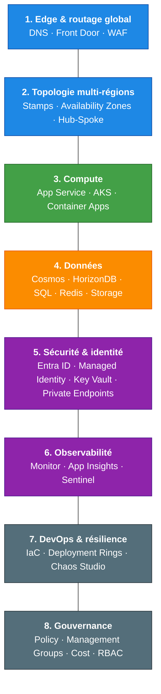

### Détail par couche

#### Edge & routage global

- **Azure Front Door Premium** (anycast global, WAF managé, TLS 1.3, cache CDN)
- Routage **latency-based** + **priority failover** entre régions
- **Health probes** agressifs (10–30 s) sur endpoint `/health`
- **Azure DNS** + (optionnel) **Traffic Manager** en secours DNS
- **WAF** : règles OWASP managées + bot protection + rate limiting
- **DDoS Protection Standard** sur les VNets exposés

#### Topologie multi-régions

- **Pattern Active/Active** ou **Active/Passive** selon coût et besoin de write multi-région
- 2 à 3 régions (paired ou non-paired — voir section dédiée)
- **Availability Zones** dans chaque région (3 zones minimum)
- Pattern **deployment stamps** : chaque région est un stamp indépendant et autonome

#### Compute

- **Azure Container Apps** ou **AKS** (multi-zone, autoscale KEDA) pour microservices
- **App Service Premium v3** si stack PaaS classique (slots, zone-redundant)
- **Min 3 instances par zone**, autoscale CPU + custom metrics (queue depth, RPS)

#### Données

| Service | Usage |
|---|---|
| **Cosmos DB** | Catalogue, sessions, données multi-write global |
| **Azure SQL Hyperscale** | OLTP transactionnel ACID |
| **Azure HorizonDB** | PostgreSQL distribué, storage disaggregé (voir section dédiée) |
| **Redis Enterprise Active-Active** | Cache distribué, sessions, compteurs |
| **Storage GZRS / RA-GZRS** | Blobs, fichiers, exports |
| **Service Bus Premium** + **Event Hubs** | Messagerie async, eventing |

#### Sécurité & identité

- **Entra ID** + **Managed Identities** partout (zéro secret en clair)
- **Key Vault Premium** + HSM + Private Endpoints + réplication régionale
- **Private Endpoints** sur tous les PaaS — **pas d'IP publique** sauf Front Door
- **Hub-and-spoke VNet** avec Azure Firewall Premium + NSG + ASG
- **Defender for Cloud** (CSPM + workload protection)
- Rotation auto des secrets, scan SAST/DAST en CI

#### Observabilité

- **Application Insights** + **Log Analytics** (workspace régional + central)
- **Azure Monitor** : alertes multi-dimensionnelles, action groups
- **Distributed tracing** OpenTelemetry, W3C trace-context
- **SLO/SLI** par service, error budget tracking
- **Synthetic monitoring** depuis plusieurs régions externes

#### DevOps & résilience

- **IaC** : Bicep ou Terraform, **un seul code** pour tous les stamps
- **CI/CD** : GitHub Actions / Azure DevOps avec deployment rings (canary → 1 région → all)
- **Blue/Green** ou slot swap par région
- **Chaos Engineering** : Azure Chaos Studio (test failover régional mensuel)
- **Backups** geo-redundants, restore testé trimestriellement
- **Runbooks** automatisés (Azure Automation / Logic Apps)

#### Gouvernance

- **Management Groups** + **Azure Policy** (deny non-compliant, audit)
- **Landing Zones** (ALZ Microsoft) si plusieurs équipes
- **Cost Management** : budgets + alertes, tags obligatoires
- **Defender + Sentinel** pour SIEM/SOAR

---

## Le rôle d'APIM (et où ne pas le mettre)

### Pourquoi APIM dans une archi critique

| Fonction | Apport |
|---|---|
| Façade unifiée | Une seule surface d'API pour tous les backends |
| Sécurité | OAuth2/JWT validation, mTLS, IP filtering, subscription keys |
| Gouvernance | Versioning, deprecation, contrats OpenAPI, developer portal |
| Politiques | Rate limiting, quotas, throttling, transformation |
| Observabilité | Logs détaillés par API/produit/consommateur |
| Monétisation | Produits, plans, abonnements partenaires |
| Caching | Réponses cachées (réduction charge backend) |

### Choix de SKU & topologie

**APIM Premium** (obligatoire pour le critique) :

- **Multi-région** (gateway répliqué dans chaque plaque, sync auto)
- **Zone-redundant** dans chaque région
- **VNet injection** (mode Internal ou External+VNet)
- **SLA 99,99 %**

### APIM **n'est pas** un CDN pour le contenu statique

| Type de trafic | Caractéristiques | Outil adapté |
|---|---|---|
| HTML / JS / CSS / images | Statique, cacheable agressif | **Front Door + CDN** |
| Appels API (JSON/XML) | Auth, rate limit, contrats, versioning | **APIM** |

Mettre APIM **devant le front statique** apporterait :

- Latence inutile (~10–50 ms par hop)
- Coût (APIM facturé à la gateway unit, pas fait pour servir du statique massif)
- Aucun bénéfice fonctionnel (un `.js` n'a pas besoin de JWT validation)
- Cache moins efficace que le CDN Front Door (POPs partout dans le monde)

### Le bon pattern : deux chemins parallèles sous Front Door

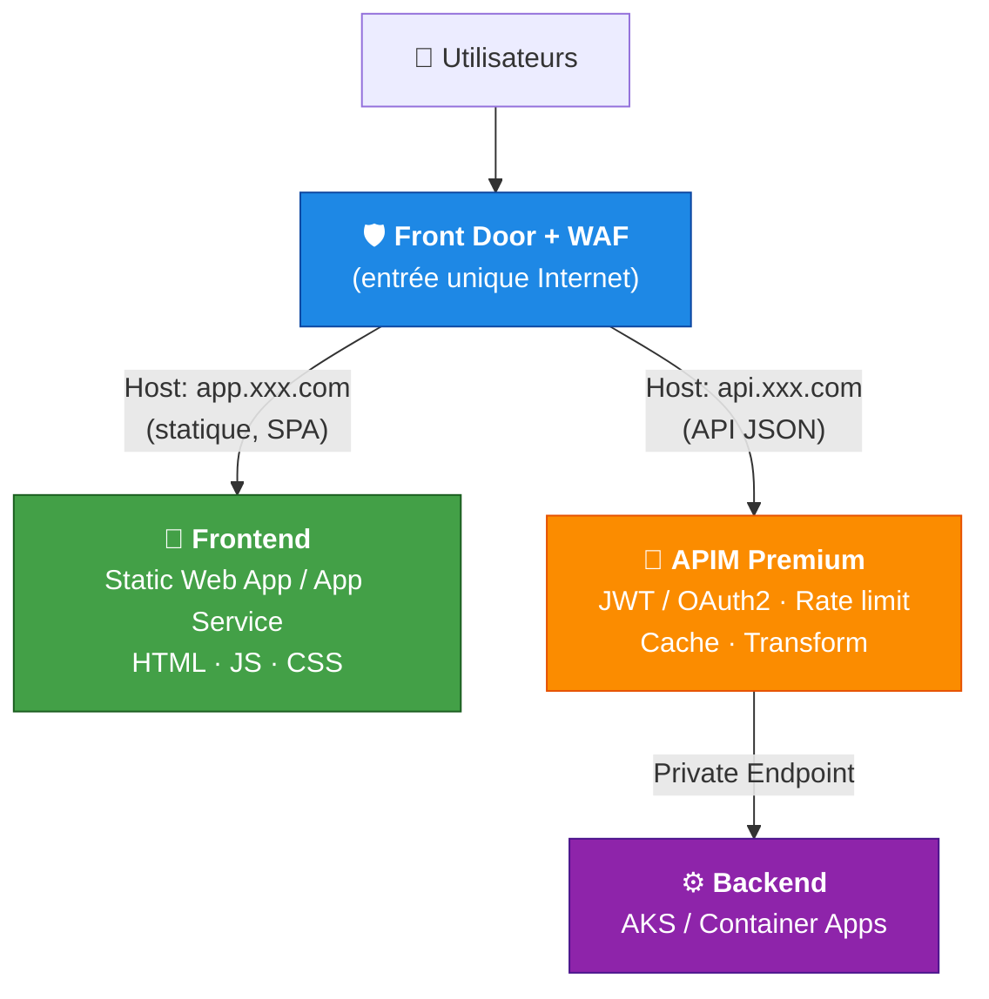

Côté Front Door, deux origin groups :

- **Route 1** `app.contoso.com/*` → Static Web App / App Service (caching aggressive, WAF "browser")
- **Route 2** `api.contoso.com/*` → APIM (caching off, WAF "API" anti-injection)

### Policies APIM clés

```xml
<policies>
  <inbound>
    <cors allow-credentials="true">...</cors>
    <validate-jwt header-name="Authorization" require-scheme="Bearer">
      <openid-config url="https://login.microsoftonline.com/{tenant}/v2.0/.well-known/openid-configuration"/>
    </validate-jwt>
    <rate-limit-by-key calls="100" renewal-period="60"
                       counter-key="@(context.Subscription.Id)"/>
    <quota-by-key calls="1000000" renewal-period="2592000"
                   counter-key="@(context.Subscription.Id)"/>
    <cache-lookup vary-by-developer="false"/>
    <set-header name="x-correlation-id" exists-action="skip">
      <value>@(Guid.NewGuid().ToString())</value>
    </set-header>
  </inbound>
  <backend>
    <forward-request timeout="30"/>
  </backend>
  <outbound>
    <cache-store duration="60"/>
    <set-header name="x-powered-by" exists-action="delete"/>
  </outbound>
</policies>
```

### Pièges APIM à éviter

- APIM Developer/Basic en prod → pas de SLA suffisant, pas de VNet
- Single region APIM → SPOF malgré Front Door
- Policies trop lourdes → latence ajoutée (> 50 ms par appel)
- Secrets en clair dans les policies → toujours via **Named Values** liés à Key Vault
- Oublier la résolution DNS privée → APIM doit résoudre les backends en Private Endpoint

---

## Séparation Front / API / Back

### Tiers et responsabilités

| Front Door (Edge) | Frontend SWA (Présentation) | APIM (Contrat API) | Backend (Implémentation) |
|---|---|---|---|
| TLS termination | Sert HTML / JS / CSS | Valide JWT | Logique métier |
| WAF global | SPA routing | Rate limit | Accès DB |
| DDoS L3-L7 | Auth redirect OIDC | Quotas | Events |
| CDN cache | CSP headers | Transformation | Transactions |
| Geo-routing | — | Cache API | — |
| Health probes | — | Versioning | — |

### Flux d'authentification (OAuth2 PKCE)

Le SPA fait un **redirect OIDC vers Entra ID** (PKCE, pas de secret côté client), récupère un access token, et l'envoie sur les appels API :

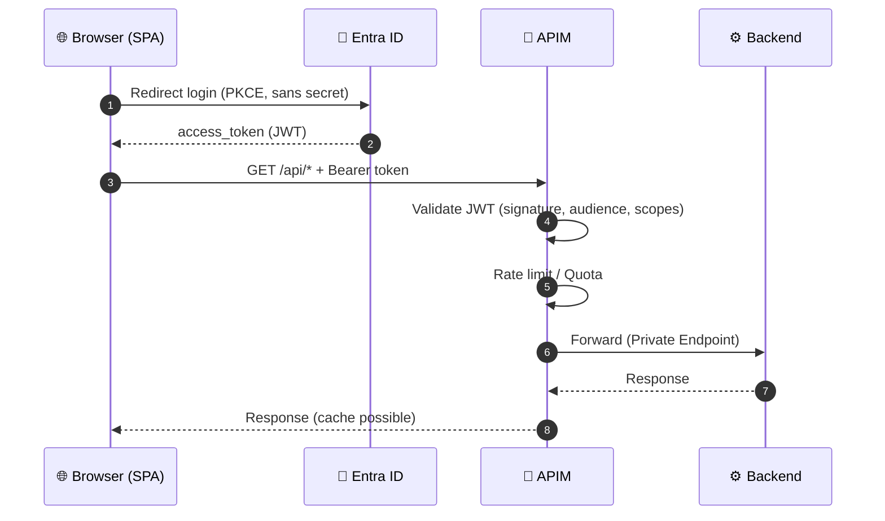

### Schéma complet 4-tiers avec data layer

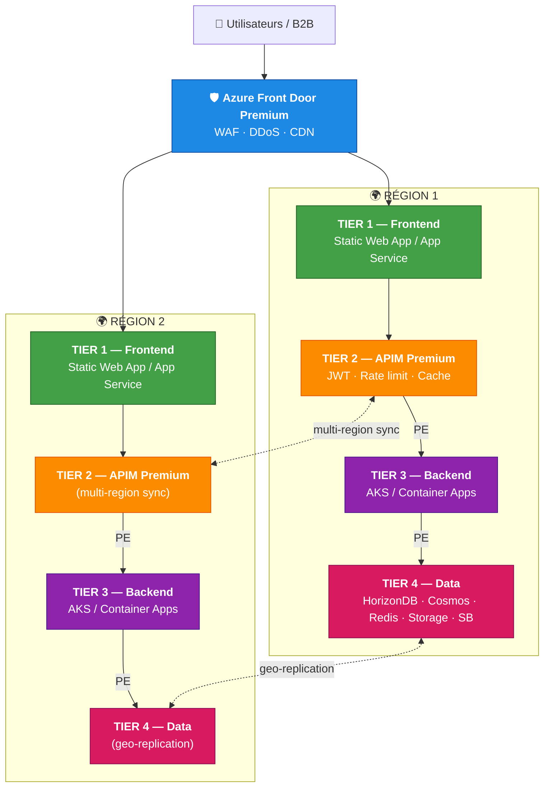

---

## Couche données : Azure HorizonDB et alternatives

### Qu'est-ce que HorizonDB

**Azure HorizonDB** est le service **PostgreSQL distribué cloud-native** de Microsoft, positionné face à Aurora / AlloyDB / Spanner. Architecture **storage-compute disaggregée**, scaling horizontal, compatible PostgreSQL.

### Quand HorizonDB est un excellent choix

| Critère | HorizonDB |
|---|---|
| Compatibilité PostgreSQL (extensions, drivers, ORM) | Natif |
| Scaling read massif | Replicas multiples low-latency |
| Storage élastique (pas de pré-provisioning) | Oui |
| Workloads OLTP transactionnels classiques | Oui |
| Backups continus, PITR | Oui |
| Couplage Entra ID / Managed Identity | Oui |

### Points de vigilance pour du critique multi-région

1. **Statut GA** : vérifier la disponibilité GA dans **les régions cibles** et le SLA contractuel
2. **Multi-région active/active** : HorizonDB privilégie **multi-zone + read replicas cross-region**. Le multi-write géo-distribué n'est pas son point fort — pour du write actif partout, **Cosmos DB** reste plus mature.
3. **Failover régional** : modes supportés (auto-failover groups ?) à valider pour un RTO < 5 min
4. **Écosystème outils** : monitoring, backup tiers, migration tooling encore en construction
5. **Coût** : modèle storage + compute séparés, à modéliser selon profil de charge

### Choix de datastore selon le profil

| Profil | DB recommandée |
|---|---|
| Lecture-intensive, écriture régionale, stack PostgreSQL | **HorizonDB** (read replicas cross-région) |
| Multi-write global, faible latence partout, schéma souple | **Cosmos DB** (multi-master) |
| OLTP fort, transactions ACID, stack SQL Server | **Azure SQL Hyperscale** + auto-failover groups |
| Analytique temps réel + transactionnel | **Fabric / Cosmos DB + Synapse Link** |

### Pattern hybride pragmatique

- **HorizonDB** pour le transactionnel principal (PostgreSQL)
- **Cosmos DB** pour catalogue / sessions / données multi-region active-active
- **Redis Enterprise A/A** pour cache distribué global, compteurs, sessions
- **Storage RA-GZRS** pour blobs et fichiers
- **Service Bus Premium** + **Event Hubs Geo-DR** pour la messagerie

> Pour du critique, prévoir un **POC HorizonDB dédié** : test failover régional réel + injection de panne + benchmark de charge **avant** engagement architectural.

---

## Multi-région non-pairée — failover et lectures multi-régions

### Pourquoi choisir des régions non-pairées

Exemple : **West Europe** (primaire) + **Sweden Central** (secondaire) — non pairées.

Motivations :

- **Conformité / résidence des données** (contraintes pays)
- **Latence utilisateurs** mieux distribuée
- **Diversité de risque** (ne pas dépendre du même cluster physique pairé)

### Conséquences à connaître

| Impact | Détail | Mitigation |
|---|---|---|
| Pas de mises à jour Azure séquentielles | Risque théorique de patch simultané | Tests réguliers, fenêtres de maintenance |
| Pas de GRS automatique sur Storage | GRS/RA-GRS impose la région pairée | **GZRS local + Object Replication custom** |
| Geo-replication SQL/Cosmos OK | Configurables vers n'importe quelle région | OK |
| Recovery prioritaire | Pas de garantie d'ordre de récupération Azure | Plan B documenté, runbooks testés |
| Latence inter-région plus élevée | À mesurer (typ. +5 à +15 ms) | Async replication, RPO > 0 assumé |

### Schéma Active/Passive (write) + Multi-Read

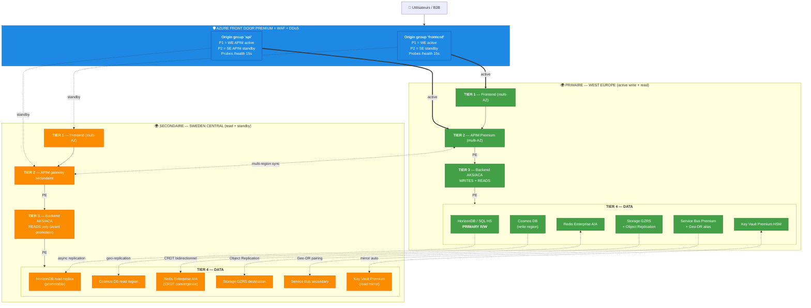

### Modes de fonctionnement

#### Mode nominal

- Front Door route 100 % vers la région primaire (priority 1, health OK)
- Écritures vers la région primaire uniquement
- Lectures critiques sur la primary DB
- Lectures non-critiques routées **localement** (Cosmos / Redis / read replica HorizonDB)
- Redis Active-Active : R/W local des deux côtés (CRDT, convergence)
- Réplication continue primaire → secondaire (RPO ~ secondes pour Redis/Cosmos, ~ minutes pour SQL)

#### Mode failover

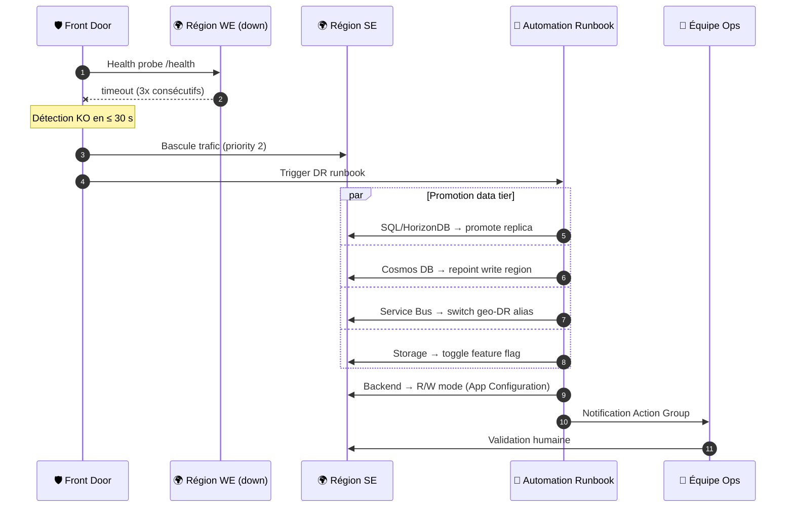

**RTO cible** : 5–10 min · **RPO** : 0–60 s (selon datastore)

#### Failback

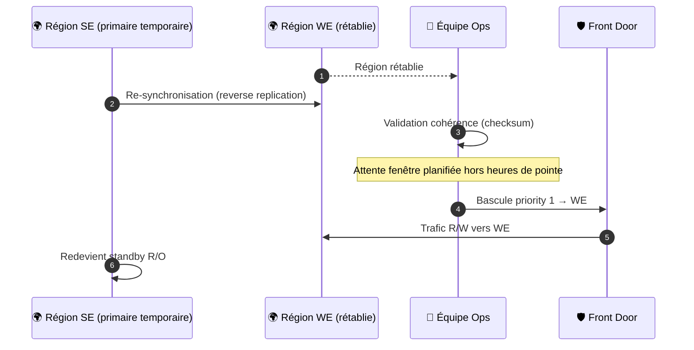

### Tableau des datastores multi-read

| Datastore | Multi-read | Multi-write | Promotion DR |
|---|---|---|---|
| HorizonDB / Azure SQL HS | Replica async | Non (1 primary) | Auto-failover-group, 30 s – 2 min |
| Cosmos DB | Natif partout | Optionnel (multi-master) | API call ou auto-failover |
| Redis Enterprise A/A | Partout | CRDT (conflict-free) | Aucune promotion |
| Storage GZRS | Lecture locale | Non (1 primary) | Manuel via Object Replication |
| Service Bus Premium | Non (1 primaire) | Non | Alias geo-DR, script |

> Le **Redis Active-Active** est l'allié principal en non-pairé : pas de promotion, pas de RPO, lecture/écriture locale partout. Idéal pour sessions, cache, compteurs, leaderboards.

### Pièges spécifiques au non-pairé

1. **Storage GRS/RA-GRS impossible** → GZRS local + Object Replication asynchrone (RPO ~15 min)
2. **Recovery Services Vault** : vérifier que les régions cibles supportent la réplication
3. **Quotas séparés par région** → réserver capacité (Capacity Reservations) dans les **deux**
4. **Latence inter-région plus élevée** → mesurer en amont, accepter RPO accru
5. **Patch Azure** : risque (faible) de fenêtre commune → demander maintenance différenciée via support
6. **DNS Private Zones** : à lier dans les deux VNets, sinon résolution Private Endpoint casse au failover

---

## Front Door Premium — justification

### Comparatif des SKU Front Door

| Fonctionnalité | Standard | Premium | Décisif pour critique ? |
|---|---|---|---|
| Anycast global, TLS, routing | Oui | Oui | — |
| Caching CDN | Oui | Oui | — |
| WAF managé | Custom rules only | **Managed rules OWASP + bot protection** | Oui |
| DRS (Default Rule Set Microsoft) | Non | Oui | Oui |
| Bot Manager Rule Set | Non | Oui | Oui |
| **Private Link vers les origines** | Non | Oui | **Critique** |
| Microsoft Threat Intelligence | Non | Oui | Oui |
| Rate limiting WAF | Oui | Oui | — |
| Geo-filtering | Oui | Oui | — |
| Custom domains + TLS managé | Oui | Oui | — |
| Security analytics & reports | Limité | Détaillé | Utile |
| SLA | 99,99 % | 99,99 % | — |
| Coût (base) | ~ 35 €/mois | ~ 330 €/mois | Delta |

### Les trois raisons qui justifient Premium

#### Private Link vers les origines (la plus importante)

- En **Standard** : Front Door appelle ton backend via **Internet public** (même si protégé par firewall/IP allowlist)
- En **Premium** : Front Door se connecte aux origines (App Service, APIM, Storage, Load Balancer) via **Private Link** → **aucune IP publique exposée**

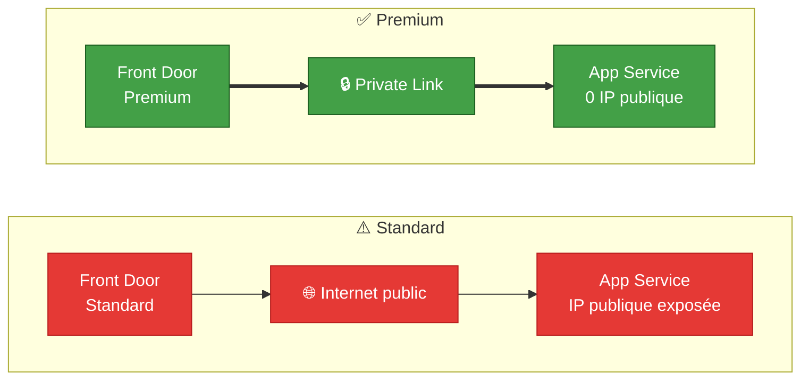

Sur du critique, exposer une IP publique sortie de backend = non-conforme à la plupart des politiques sécu (CIS, ISO 27001, PCI-DSS).

#### WAF managé OWASP + Bot Protection

- **Standard** : tu écris **toi-même** chaque règle (SQL injection, XSS, etc.)
- **Premium** :
  - **DRS 2.x** : règles OWASP **maintenues par Microsoft**, mises à jour automatiquement face aux nouvelles CVE
  - **Bot Manager Rule Set** : détecte bots malveillants vs bots légitimes
  - **Threat Intelligence** : blocage automatique des IPs/réseaux malveillants (feed MSFT)

#### Conformité & audit

- Rapports de sécurité détaillés (ISO, SOC 2, PCI)
- Visibilité sur attaques bloquées, top règles, géo des attaquants

### Quand Standard suffit

| Contexte | SKU |
|---|---|
| Site vitrine, blog, app non-critique | Standard |
| App SaaS avec sécu modérée | Standard + WAF custom |
| App critique, B2B, données sensibles, conformité | **Premium** |
| Backends qui doivent être **privés** | **Premium** (Private Link) |
| Forte volumétrie d'attaques | **Premium** (bot protection) |

### Coût comparé

- **Standard** : ~ 35 €/mois base + $0.01/GB sortant + WAF requests
- **Premium** : ~ 330 €/mois base + $0.01/GB sortant + WAF requests
- Delta : ~ +295 €/mois (≈ 3 500 €/an)

Un seul incident sécu (data leak, downtime, ransom) coûte **bien plus** que ce delta annuel. Pour la plupart des apps critiques, Premium = sweet spot.

---

## Résilience edge — si Front Door tombe

Front Door a un SLA 99,99 % mais peut tomber (incidents 2022, 2023, 2024). Sur du critique, ta couche edge ne doit pas être un SPOF.

### Stratégie 1 — Dual Edge Azure (recommandée pour la plupart)

Traffic Manager arbitre entre **Front Door** (chemin nominal) et **Application Gateway** régionaux (chemin de secours).

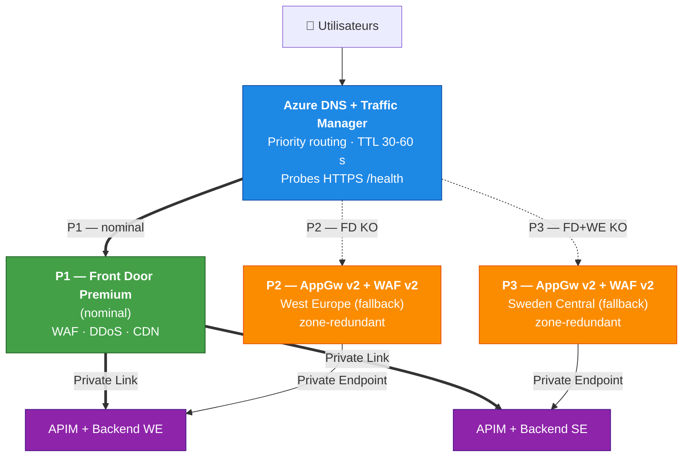

#### Mode opératoire

1. Nominal : DNS → CNAME vers Front Door → backends via Private Link
2. Front Door KO : Traffic Manager bascule (~30–60 s health probes) → IP publique AppGw WE
3. Si WE aussi KO : bascule sur AppGw SE
4. Clients résolvent vers le nouvel endpoint après expiration TTL DNS (max 60 s configuré, **2–5 min réel**)

#### Limites

- **TTL DNS** : caches client/proxy plus longs que le TTL configuré
- **Pas de cache CDN** sur le chemin de secours → backends prennent toute la charge
- **WAF dupliqué** : règles à maintenir dans Front Door **et** AppGw (Bicep partagé)
- **IPs publiques exposées** sur AppGw → protégées par WAF + NSG + restrictions IP éventuelles
- Coût : ~ +500 à 800 €/mois pour 2 AppGw v2 WAF v2 zone-redundant

### Stratégie 2 — Multi-CDN (top mais cher)

Traffic Manager arbitre entre **Front Door** et un **CDN tiers** (Akamai, Cloudflare, Fastly).

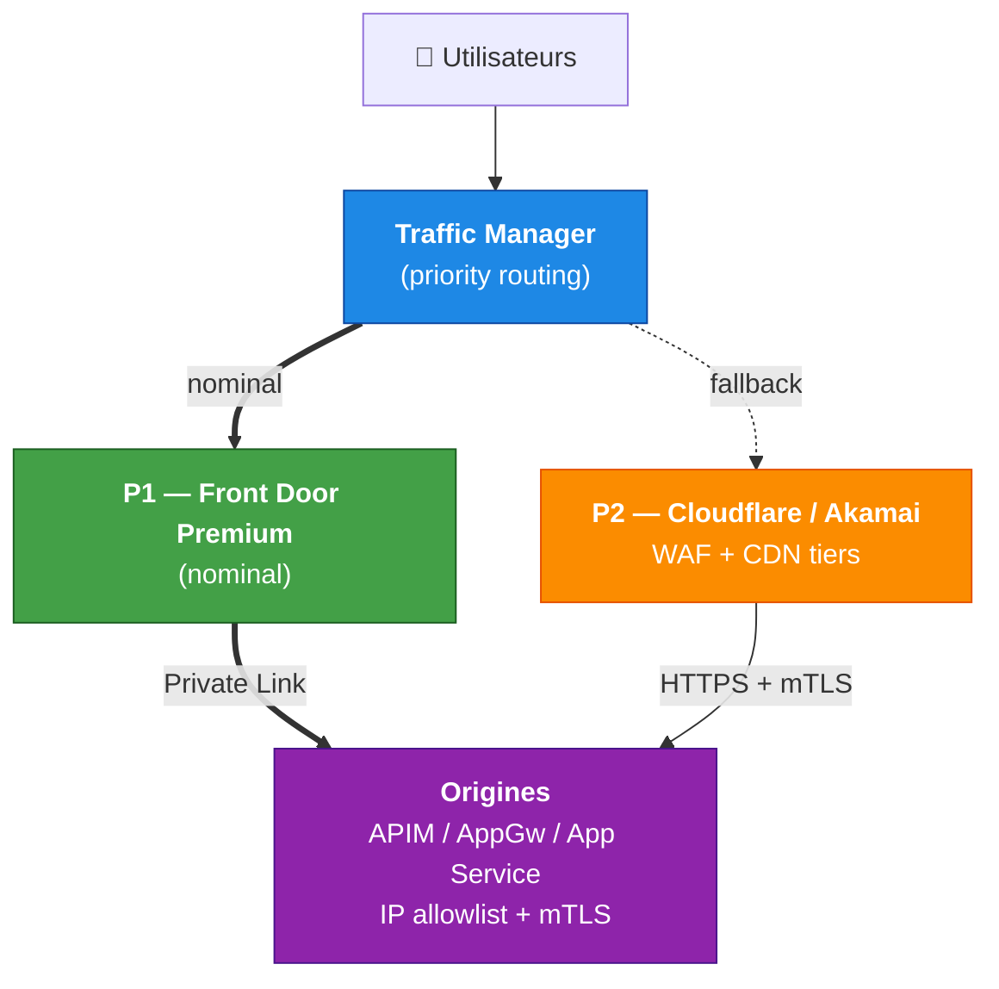

#### Avantages

- Diversité fournisseur (Microsoft + tiers) → résilience à une panne Azure globale
- CDN de secours opérationnel mondialement
- Vrai zéro-SPOF edge

#### Inconvénients

- Complexité opérationnelle (deux WAF, deux configs, deux contrats)
- Coût : Cloudflare/Akamai = +500 à +5 000 €/mois selon volume
- Synchronisation des certificats, des règles WAF, des routes
- Exiger des origines compatibles (IP allowlist + mTLS) pour empêcher bypass

> Pattern utilisé par banques, e-commerce mondiaux, services gouvernementaux.

### Stratégie 3 — DNS direct vers AppGw (simple)

Pas de Front Door : Traffic Manager fait le routage géo entre AppGw par région.

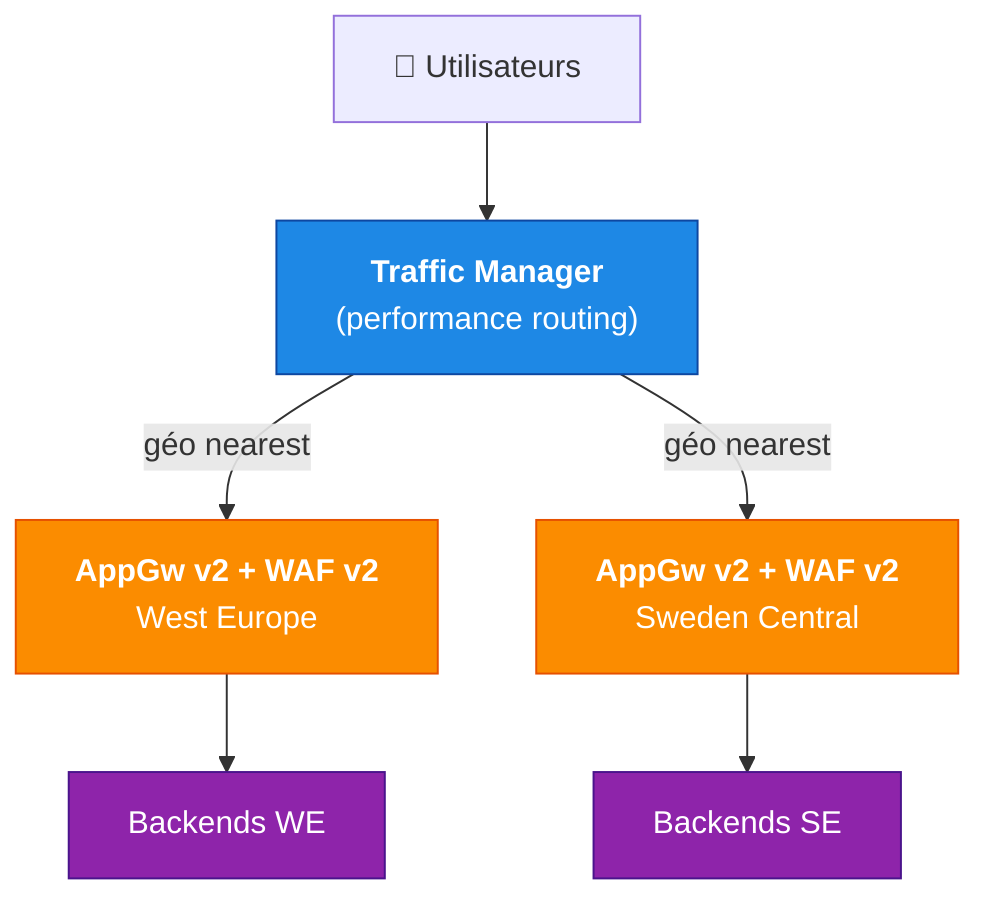

#### Quand l'envisager

- Front Door sur-dimensionné (peu de trafic global, audience régionale)
- Forte contrainte de coût
- Audience géographiquement concentrée

#### Inconvénients

- Pas de cache CDN (perte 30–70 % d'accélération perçue)
- Pas de DDoS L7 mutualisé → AppGw + DDoS Protection Standard nécessaires
- TTL DNS = RTO de plusieurs minutes en cas de bascule
- Pas de routing intelligent (anycast)

### Le piège du DNS Azure SPOF

Traffic Manager dépend lui-même d'Azure DNS. Si paranoïaque :

- Azure DNS + DNS secondaire (NS1, Route 53, Dyn) via zone transfer (AXFR)
- Ou utiliser Cloudflare DNS / Route 53 comme primaire avec failover vers les endpoints Azure

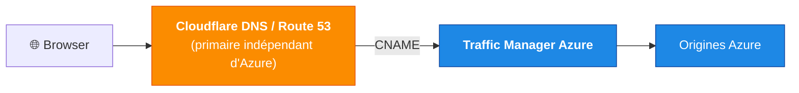

### Recommandation par niveau de criticité

| Niveau | Stratégie | Coût delta | RTO edge |
|---|---|---|---|
| Critique métier (banking, santé, e-commerce majeur) | Multi-CDN (Stratégie 2) | +500 à +5 000 €/mois | ~30–60 s |
| **Critique standard (B2B SaaS, réglementé)** | **Dual Edge Azure (Stratégie 1)** | +500 à +800 €/mois | ~1–3 min |
| Critique léger (interne, faible audience) | Traffic Manager + AppGw (Stratégie 3) | Base | ~3–5 min |

### Config Traffic Manager type (Stratégie 1)

```yaml
Profile name: tm-app-contoso
Routing method: Priority
DNS TTL: 30 s
Monitor:
  Protocol: HTTPS
  Port: 443
  Path: /health
  Interval: 10 s
  Tolerated failures: 3
  Timeout: 5 s
Endpoints:
  - name: front-door-primary
    type: Azure Endpoint (Front Door)
    priority: 1
  - name: appgw-we-backup
    type: External Endpoint
    target: appgw-we.contoso.com
    priority: 2
    location: West Europe
  - name: appgw-se-backup
    type: External Endpoint
    target: appgw-se.contoso.com
    priority: 3
    location: Sweden Central
```

---

## Opérabilité, tests et FinOps

### Tests de failover impératifs

- Couper Front Door (désactiver endpoint) → vérifier bascule Traffic Manager en < 2 min
- Couper AppGw région primaire → bascule vers AppGw secondaire
- Mesurer le **TTL effectif côté client** (browsers, proxies corporate, opérateurs)
- Tester l'attaque DDoS sur le chemin direct AppGw (capacité suffisante sans Front Door ?)
- Vérifier certificats TLS valides et auto-renouvelés
- Promotion HorizonDB / SQL chronométrée (auto-failover-group)
- Redis A/A : kill région primaire, vérifier R/W secondaire sans interruption
- Service Bus : bascule alias, perte de messages non-checkpointés ?
- App Configuration : feature flag region-primary appliqué
- **Runbook complet exécuté trimestriellement** (Chaos Studio)
- **Retour à la normale testé aussi** (souvent oublié)

### Observabilité indispensable

- Synthetic monitoring depuis 3+ régions externes
- Dashboards SLO/SLI par tier (Front Door, APIM, backend, data)
- Alertes corrélées (corrélation incident → bascule auto)
- Logs immuables centralisés (Sentinel SIEM)

### Modèle de coût approximatif (référence)

| Composant | Coût mensuel approx. (2 régions) |
|---|---|
| Front Door Premium | ~ 330 €/mois |
| APIM Premium (multi-région, 2 units) | ~ 5 000 €/mois |
| AKS (backend, 3 nodes/région) | ~ 1 500 €/mois |
| HorizonDB (primary + replica) | ~ 2 000 à 5 000 €/mois selon charge |
| Cosmos DB (2 régions, RU provisioned) | ~ 1 000 à 5 000 €/mois |
| Redis Enterprise A/A | ~ 1 500 €/mois |
| Application Gateway v2 WAF (x2) | ~ 600 €/mois |
| Storage RA-GZRS, Service Bus Premium, Key Vault, Monitor | ~ 500 à 1 000 €/mois |
| **Total ordre de grandeur** | **~ 12 000 à 20 000 €/mois** |

> À pondérer par le coût d'un incident critique (data leak, downtime e-commerce, atteinte à l'image), qui dépasse souvent l'année de plateforme.

---

## Récapitulatif & décisions clés

### Les décisions structurantes

1. **Front Door Premium** — pour Private Link, WAF managé, conformité
2. **APIM Premium multi-région** — façade API obligatoire, gateway sync auto
3. **Séparation Front / API / Back** — 2 routes parallèles sous Front Door, pas d'APIM devant le statique
4. **Datastore : pattern hybride** — HorizonDB (transactionnel PostgreSQL) + Cosmos DB (multi-write global) + Redis A/A (cache distribué)
5. **Multi-région non-pairée acceptable** si conformité l'exige, mais GRS Storage à remplacer par Object Replication
6. **Edge résiliente** — Dual Edge Azure (Traffic Manager → Front Door + Application Gateway) pour 99 % des cas critiques
7. **Tout via Private Endpoints** — zéro IP publique sauf Front Door (et AppGw en secours)
8. **Tests de bascule trimestriels** non négociables — Chaos Studio + runbooks Automation

### Anti-patterns à éviter

- APIM Developer/Basic ou single-region en prod critique
- APIM devant le contenu statique
- Backend exposé en IP publique (même via WAF) sur du critique
- Backups non testés en restore
- Failover non testé en conditions réelles
- DNS Azure unique comme primaire si paranoïa élevée
- Front Door Standard avec backends privés (impossible sans Private Link)

---

## Références

- [Azure Front Door Premium overview](https://learn.microsoft.com/azure/frontdoor/front-door-overview)
- [Azure Front Door Premium WAF managed rule sets](https://learn.microsoft.com/azure/web-application-firewall/afds/waf-front-door-drs)
- [Azure Front Door Private Link to origin](https://learn.microsoft.com/azure/frontdoor/private-link)
- [Azure API Management Premium multi-region deployment](https://learn.microsoft.com/azure/api-management/api-management-howto-deploy-multi-region)
- [Azure SQL auto-failover groups](https://learn.microsoft.com/azure/azure-sql/database/auto-failover-group-overview)
- [Azure Cosmos DB multi-region writes](https://learn.microsoft.com/azure/cosmos-db/how-to-multi-master)
- [Azure Cache for Redis Enterprise Active-Active](https://learn.microsoft.com/azure/azure-cache-for-redis/cache-how-to-active-geo-replication)
- [Azure Storage Object Replication](https://learn.microsoft.com/azure/storage/blobs/object-replication-overview)
- [Azure Service Bus Geo-disaster recovery](https://learn.microsoft.com/azure/service-bus-messaging/service-bus-geo-dr)
- [Azure paired regions](https://learn.microsoft.com/azure/reliability/cross-region-replication-azure)
- [Azure Chaos Studio](https://learn.microsoft.com/azure/chaos-studio/chaos-studio-overview)
- [Mission-critical workloads on Azure (Well-Architected)](https://learn.microsoft.com/azure/well-architected/mission-critical/mission-critical-overview)
- [Azure Front Door + Traffic Manager (dual-edge pattern)](https://learn.microsoft.com/azure/architecture/guide/networking/global-web-applications/overview)
- [Azure HorizonDB documentation](https://learn.microsoft.com/azure/horizondb/) *(vérifier statut GA dans les régions cibles)*
