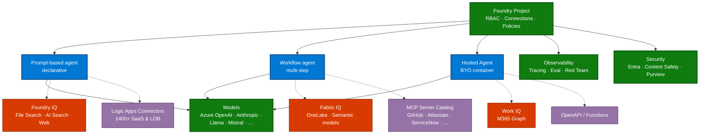
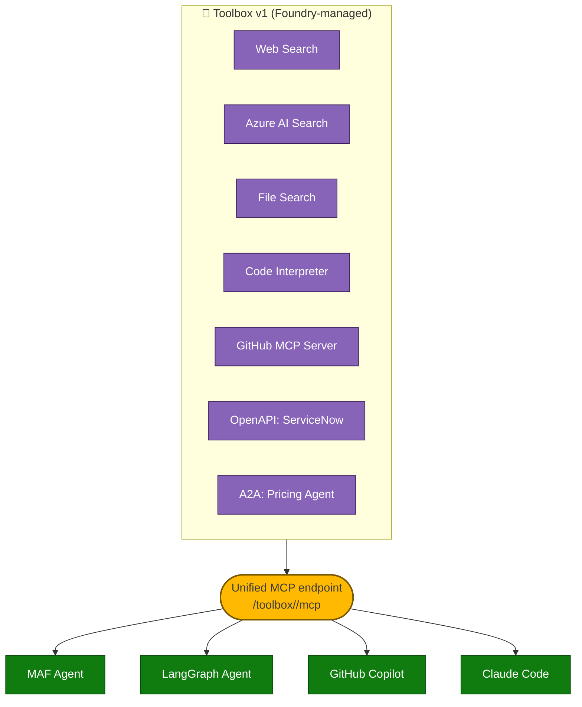
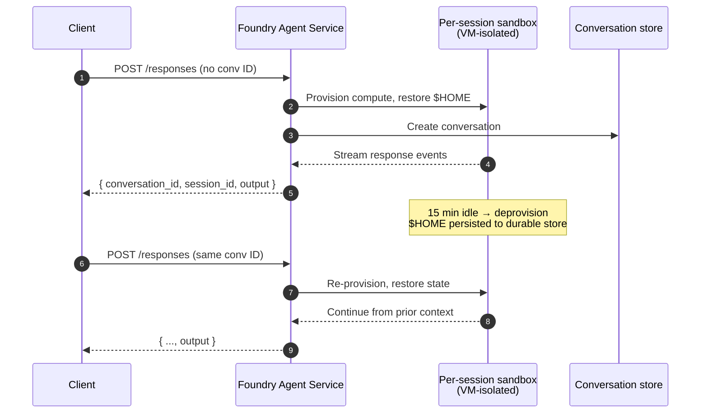
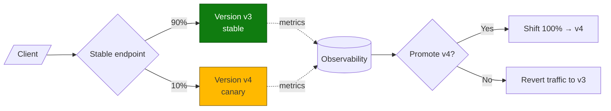
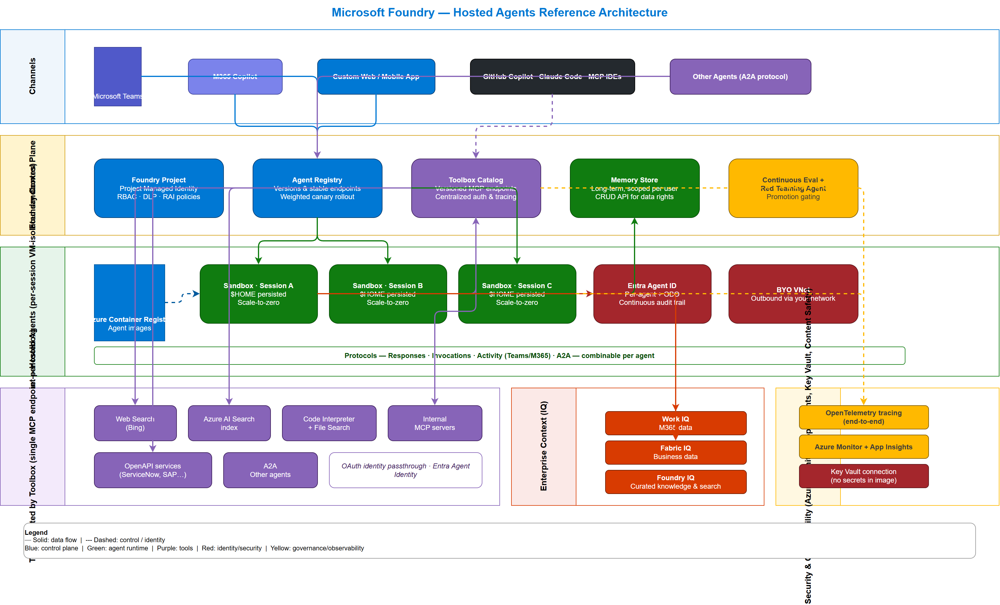
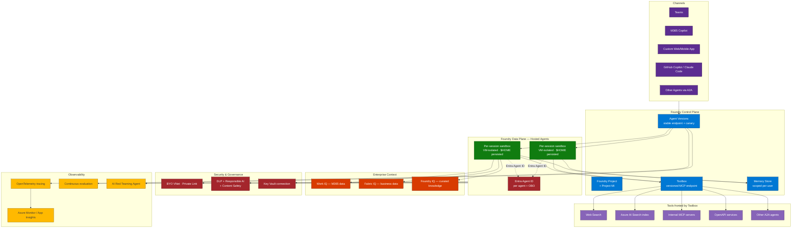
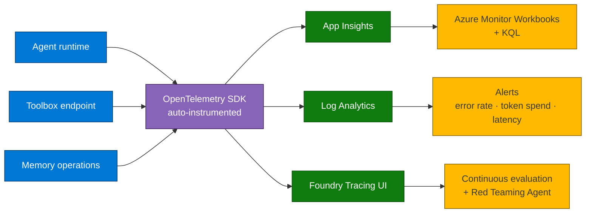
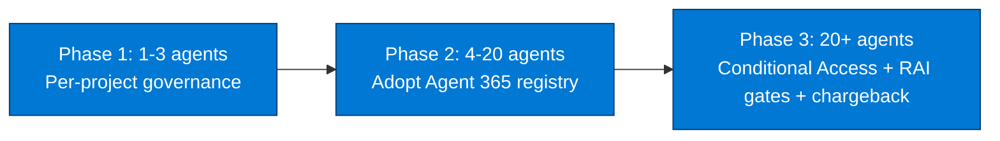

# The Complete Agent Development Guide

*Industrializing AI agents on Microsoft Foundry — from local prototype to production-grade enterprise deployment.*

---

## Overview

Building a working agent on a developer laptop is no longer the hard part. The hard part is taking that same agent and operating it for **thousands of users**, with **per-session isolation**, **enterprise identity**, **governed tools**, **persistent memory**, **observability**, and **scale-to-zero economics** — without rebuilding the platform every time.

Microsoft Foundry now offers an end-to-end story for that journey, structured around five capabilities that landed (or stabilized) together:

| Capability | Status | What it changes |
|---|---|---|
| Microsoft Agent Framework v1.0 | **GA** | Stable Python + .NET runtime that unifies Semantic Kernel & AutoGen |
| Foundry Toolkit for VS Code | **GA** | Local create / debug / deploy loop with traces |
| Memory in Foundry Agent Service | **Public Preview** | Managed long-term memory, no DB to provision |
| Toolbox in Foundry | **Public Preview** | One MCP endpoint exposing many tools, governed centrally |
| Hosted Agents in Foundry Agent Service (refresh) | **Public Preview** | Per-session VM-isolated sandbox, scale-to-zero, persistent FS, per-agent Entra ID |
| Observability in Foundry Control Plane | **GA on core** | End-to-end OpenTelemetry tracing, Red Teaming Agent, continuous evaluation |

This guide walks through the full industrialization pipeline, with code samples, an end-to-end reference architecture, governance and FinOps controls, and a production checklist.

---

## The Industrialization Journey at a Glance

```mermaid
flowchart LR
    classDef step fill:#0078d4,stroke:#003a6e,color:#fff,stroke-width:2px
    classDef artifact fill:#fff4ce,stroke:#d4a017,color:#3a3a3a
    classDef platform fill:#107c10,stroke:#054a05,color:#fff,stroke-width:2px

    A["1. Build locally<br/>MAF v1.0 + Foundry Toolkit"]:::step
    B["2. Add agent harness<br/>Shell · Files · Compaction"]:::step
    C["3. Make it stateful<br/>Foundry Memory"]:::step
    D["4. Wire tools once<br/>Foundry Toolbox"]:::step
    E["5. Host & operate<br/>Hosted Agents in FAS"]:::step

    Code[("Dockerfile<br/>+ agent.yaml")]:::artifact
    Endpoint(["Per-agent endpoint<br/>+ Entra Agent ID"]):::platform
    Channels(["Teams · M365 Copilot<br/>· Custom apps · A2A"]):::platform

    A --> B --> C --> D --> E
    E --> Code --> Endpoint --> Channels
```



Each step is **independent and reversible** — you can adopt them in any order — but they reinforce each other and are designed around a single deployment artifact: a container image plus an `agent.yaml` declaration deployable in one `azd deploy`.

---

## Foundry Platform & Agent Types Decoded

Before the deep-dives, anchor the mental model: **Microsoft Foundry is a single project-scoped workspace** that unifies models, tools, agents, knowledge, identity, and observability behind one RBAC plane. An agent is never a stand-alone artifact — it always lives inside a Foundry **project**, inherits the project's connections (model deployments, Azure AI Search indexes, Storage, Key Vault), and is governed by the project's RBAC and policies.

### The three agent types — pick one consciously

Foundry exposes **three agent flavours** with different authoring surfaces, runtime models and trade-offs. Most enterprises end up using all three for different use-cases.

| Type | Authoring | Runtime | When to choose |
|---|---|---|---|
| **Prompt-based agent** (declarative) | Foundry portal **Agent Playground** or `agent.yaml` | Foundry-managed **serverless** (no container) | Fast start; chat-style agents; minimal custom code; no per-session filesystem needed |
| **Workflow agent** (multi-step) | Foundry portal designer or MAF `Workflow` (declarative or programmatic) | Foundry-managed serverless with deterministic step graph | Multi-step orchestrations with conditional branches, parallel fan-out, hand-offs; observable per step |
| **Hosted Agent** (BYO container) | `Dockerfile` + `agent.yaml` (`azd deploy`) | **Per-session VM-isolated sandbox**, scale-to-zero, persistent FS | Custom code, custom harness (MAF / LangGraph / Copilot SDK / your own), need shell + filesystem, BYO VNet |

> §12 Decision Matrix expands this with concrete capability comparisons.



### The tool & knowledge ecosystem

A Foundry agent reaches outside through **three connector surfaces**, all callable directly or — recommended — through a Toolbox (§5) for reuse and governance:

- **Foundry IQ** — built-in retrieval primitives: `file_search` (Foundry-managed vector index), `azure_ai_search` (your existing index), `web_search` (Bing-grounded with custom domains).
- **Logic Apps connectors** — **1,400+** Microsoft-curated SaaS & LOB connectors (Salesforce, SAP, ServiceNow, Workday, Dynamics, Office 365, GitHub, Jira, Confluence, …) exposed natively to agents with no custom code.
- **MCP server catalog** — open Model Context Protocol servers (GitHub Copilot MCP, Atlassian, Notion, your own) callable through Toolbox with OAuth pass-through or MI.
- **OpenAPI / Azure Functions / A2A** — wrap any HTTP API or another agent as a tool.

### The unified project plane (what you get for free)

Inside one Foundry project, **the platform itself supplies**:

| Capability | Built-in mechanism |
|---|---|
| **RBAC** | Azure RBAC + Entra Agent ID — same model as any Azure resource |
| **Connections** | Centrally configured (Storage, Key Vault, AI Search, Logic Apps, MCP) — agents reference by name |
| **Tracing** | OpenTelemetry auto-instrumentation across model · tool · agent calls |
| **Evaluations** | Built-in evaluators + AI Red Teaming Agent |
| **Content Safety** | Prompt Shields, jailbreak detection, harmful content filtering at the project level |
| **Cost & quota** | Per-project token budgets, Azure Cost Management integration |
| **Lifecycle** | Agent versioning, weighted rollouts, stable endpoints |

**Implication for the rest of this guide**: every code sample below assumes you have one Foundry project with at least one model deployment and one connection (Storage or Key Vault). All §-numbered sections build on this foundation.

---

## Build Locally with Microsoft Agent Framework v1.0

### What's stable in v1.0

Microsoft Agent Framework (MAF) is the open-source SDK and runtime that unifies the enterprise foundations of **Semantic Kernel** with the multi-agent orchestration patterns of **AutoGen**. Migration guides are published for both predecessors so existing investments carry forward.

| Pillar | What you get |
|---|---|
| **Multi-model** | Azure OpenAI, Anthropic, Google Gemini, Amazon Bedrock, Ollama, OpenAI direct, and more |
| **Workflows** | Programmatic *and* declarative multi-step pipelines, visualizable in DevUI |
| **Native Foundry integration** | Memory, hosted agents, Observability, and Foundry Tools as first-class building blocks |
| **Open standards** | MCP, A2A, OpenAPI built in |
| **Languages** | Python and .NET, identical concepts |

### Hello agent (Python)

```python
import asyncio
from agent_framework.azure import AzureOpenAIResponsesClient
from azure.identity import AzureCliCredential

async def main():
    agent = AzureOpenAIResponsesClient(
        credential=AzureCliCredential(),
    ).as_agent(
        name="SupportTriageBot",
        instructions="You are an expert support triage agent.",
    )
    response = await agent.run("Analyze this ticket and classify its priority.")
    print(response.text)

asyncio.run(main())
```

### Foundry Toolkit for VS Code

The Toolkit (formerly *AI Toolkit for VS Code*) is now **GA** and gives you:

- Project scaffolding from templates or from GitHub Copilot prompts
- Local run + step-through debugging with **trace visualization**
- Direct `Deploy to Foundry Agent Service` action — no leaving VS Code
- Pre-release channel for the newest Hosted Agents experience

This is the recommended inner loop for any agent destined for Foundry hosting.

### Other supported authoring paths

You are **not locked into MAF**. Foundry meets developers where they are:

| Path | When | Notes |
|---|---|---|
| **Agent Playground** (Foundry portal UI) | POC, business-author "no-code" agents, prompt iteration | Declarative; outputs an `agent.yaml` you can promote to a hosted agent later |
| **Microsoft Agent Framework v1.0** | Production custom agents in Python or .NET | First-class Foundry integration; this guide's default |
| **LangChain / LangGraph** | Existing LangChain investments | Use the Foundry Inference SDK + Toolbox MCP client; observability still flows through OpenTelemetry |
| **LlamaIndex** | RAG-first agents already on LlamaIndex | Foundry connections (AI Search, file_search) usable through standard LlamaIndex retrievers |
| **Semantic Kernel** | Migrating apps | First-class migration path → MAF (see §23 Migration) |
| **AutoGen** | Multi-agent research code | First-class migration path → MAF (see §23 Migration) |
| **Custom / no framework** | Special runtime constraints | Hosted Agent + your own HTTP loop; Toolbox still callable via MCP HTTP |

The constant across all paths is the **Foundry project + agent.yaml + Entra Agent ID** triple — the framework above the `azd deploy` line is your choice.

---

## Agent Harness — Shell, Files, and Long Sessions

Orchestrating *multiple* agents is half the picture; the other half is what one agent does autonomously over a long task: run shell commands, read/write files, manage context across hours of work without losing coherence. MAF ships three foundational harness patterns.

### 2.1 Local Shell Harness with approval flows

```python
@tool(approval_mode="always_require")
def run_bash(command: str) -> str:
    """Execute a shell command and return the result."""
    result = subprocess.run(command, shell=True, capture_output=True, text=True)
    return result.stdout

local_shell_tool = client.get_shell_tool(func=run_bash)
agent = Agent(
    client=client,
    instructions="You are a helpful assistant that can run shell commands.",
    tools=[local_shell_tool],
)
```

> ⚠️ Always run local shell execution in an isolated environment with approval enabled.

### 2.2 Hosted Shell Harness — same code, sandbox runtime

```python
shell_tool = client.get_shell_tool()  # execution runs in provider-managed sandbox
agent = Agent(client=client, instructions="...", tools=shell_tool)
```

A **single-line change** moves command execution from the laptop to the VM-isolated sandbox that powers Hosted Agents — no Dockerfile changes, no infrastructure rewiring.

### 2.3 Context Compaction for long-running sessions

```python
from agent_framework import (
    Agent, InMemoryHistoryProvider,
    CompactionProvider, SlidingWindowStrategy,
)

agent = Agent(
    client=client,
    instructions="You are a helpful assistant.",
    tools=[get_weather],
    context_providers=[
        InMemoryHistoryProvider(),
        CompactionProvider(
            before_strategy=SlidingWindowStrategy(keep_last_groups=3)
        ),
    ],
)
```

Keeps the agent inside its token budget while preserving the most recent meaningful conversation groups — essential for sessions that run for hours or days.

### 2.4 Multi-agent composition with the GitHub Copilot SDK

MAF acts as the **orchestration backbone** while delegating heavy code-related work (MCP tools, shell, file ops) to a Copilot-SDK-powered sub-agent. Sequential, concurrent, hand-off, and coding agent patterns are all supported, with checkpointing, middleware pipelines, and human-in-the-loop control built into the execution layer.

---

## Make Agents Stateful — Memory in Foundry

Production agents need to remember user preferences, prior context, and domain facts across sessions — without forcing every team to provision their own database.

```python
from agent_framework import InMemoryHistoryProvider
from agent_framework.azure import AzureOpenAIResponsesClient, FoundryMemoryProvider
from azure.ai.projects import AIProjectClient
from azure.identity import AzureCliCredential
import os

project_client = AIProjectClient(
    endpoint=os.environ["AZURE_AI_PROJECT_ENDPOINT"],
    credential=AzureCliCredential(),
)

agent = AzureOpenAIResponsesClient(
    credential=AzureCliCredential(),
).as_agent(
    name="CustomerSuccessAgent",
    instructions="You are a proactive customer success agent.",
    context_providers=[
        InMemoryHistoryProvider(),
        FoundryMemoryProvider(
            project_client=project_client,
            memory_store_name=memory_store.name,
            scope="user_123",  # segments memory per user
        ),
    ],
)
```

### What's new in this refresh

| Capability | Why it matters |
|---|---|
| **Native MAF & LangGraph integration** | No middleware glue — memory works out of the box in either framework |
| **Memory item CRUD API** | Inspect, edit, delete specific facts the agent stored — full transparency for users and DPO requests |
| **Custom user scope header** | Segment memory by your own `userId`, not necessarily Entra — works with any IAM system |

### Pricing (consumption begins June 1, 2026)

| Component | Price |
|---|---|
| Short-term memory | $0.25 per 1K events stored |
| Long-term memory | $0.25 per 1K memories per month |
| Memory retrieval | $0.50 per 1K retrievals |

Memory is **free during preview** before billing begins.

---

## Toolbox in Foundry — One Endpoint, Any Agent

### The problem Toolbox solves

A single onboarding agent might call five tools (Entra account creation, GitHub repo access, cloud provisioning, ADO tasks, Teams welcome). That means **five auth models, five owning teams, five integration codebases**. Multiply by every agent in the org and you get duplicated credentials, inconsistent governance, and zero discoverability.

### The four pillars

| Pillar | Available | What you get |
|---|---|---|
| **Discover** | Coming soon | Find approved tools without browsing catalogs |
| **Build** | **Today** | Curate tools into a named, versioned, reusable bundle |
| **Consume** | **Today** | One MCP-compatible endpoint for the whole bundle |
| **Govern** | Coming soon | Centralized auth + observability across every tool call |

### Anatomy



### Endpoint shape

```
https://<resource>.services.ai.azure.com/api/projects/<project>/toolbox/<toolbox-name>/mcp?api-version=v1
```

A toolbox is **versioned**: you can iterate freely on a `v2` while consumers stay pinned to `v1`. Promote a version to be the default once it's production-ready, and existing consumers automatically pick it up at the unversioned endpoint.

### Build a toolbox (Python)

```python
toolbox_version = client.beta.toolboxes.create_toolbox_version(
    toolbox_name="customer-feedback-triaging-toolbox",
    description="Search docs and triage feedback; act in GitHub.",
    tools=[
        {
            "type": "web_search",
            "description": "Retrieve public docs on official websites",
            "custom_search_configuration": {
                "project_connection_id": "<BING_CONNECTION>",
                "instance_name": "<BING_INSTANCE>"
            }
        },
        {
            "type": "azure_ai_search",
            "name": "product-manuals-ai-search",
            "description": "Search internal product documentation",
            "azure_ai_search": {
                "indexes": [
                    {"index_name": "<INDEX>",
                     "project_connection_id": "<CONNECTION>"}
                ]
            }
        },
        {
            "type": "mcp",
            "server_label": "github",
            "server_url": "https://api.githubcopilot.com/mcp",
            "project_connection_id": "<CONNECTION>"
        }
    ],
)
print(toolbox_version.mcp_endpoint)
```

### Consume from any framework

```python
mcp_tool = MCPStreamableHTTPTool(
    name="toolbox",
    url=TOOLBOX_ENDPOINT,
    http_client=httpx.AsyncClient(
        auth=_ToolboxAuth(token_provider),  # injects Entra bearer per request
        headers={"Foundry-Features": "Toolboxes=V1Preview"},
        timeout=120.0,
    ),
    load_prompts=False,
)
agent = chat_client.as_agent(
    name=AGENT_NAME,
    instructions=SYSTEM_PROMPT,
    tools=[mcp_tool],
)
```

The agent **discovers all bundled tools dynamically** at runtime — no per-tool wiring, no custom SDK per integration. Authentication options include **OAuth identity passthrough** and **Microsoft Entra Agent Identity**.

> 🔓 **Foundry-homed, not Foundry-bound.** Toolboxes are configured and governed in Foundry, but consumed by any MCP-capable runtime — Microsoft Agent Framework, LangGraph, custom Python, **GitHub Copilot, Claude Code, MCP-enabled IDEs**, and so on.

### Promote to default

```python
client.beta.toolboxes.update(
    toolbox_name="customer-feedback-triaging-toolbox",
    default_version="<version_id>",
)
```

---

## Hosted Agents in Foundry Agent Service

This is the production runtime. The 2026 refresh is **fundamentally different** from the original Ignite preview — it now provides **per-session VM-isolated sandboxes**, **persistent filesystem**, **scale-to-zero with state resume**, and **dedicated Entra Agent IDs** out of the box.

### Why traditional compute doesn't fit agents

Containers, App Service, serverless functions were designed for **shared multi-tenant web traffic**. Agents have a fundamentally different access pattern:

| Concern | Traditional compute | Hosted Agents |
|---|---|---|
| **Isolation** | Multiple sessions share a container | Every session gets a dedicated VM-isolated sandbox |
| **Cold start** | Seconds to minutes (high variance) | Seconds (low variance, predictable) |
| **Idle cost** | Always-on billing or slow scale-from-zero | Scale-to-zero with FS-preserving resume |
| **State persistence** | You build it (DBs, blob, …) | Built in — files & disk survive scale-to-zero |
| **Identity** | Shared service account | Per-agent Entra ID + per-user (OBO) |
| **Observability** | You build it | Built in (agent / session / fleet) |

### Core capabilities (2026 refresh)

- **Predictable cold starts** — sessions spin up in **<100 ms** in your custom Docker environment
- **Scale to zero** — pay nothing while idle; agents suspend between turns
- **Resume with filesystem intact** — `$HOME` and uploaded `/files` survive scale-to-zero events
- **Per-session isolation** — every session gets a dedicated, hypervisor-isolated sandbox; isolation keys to namespace end-user sessions
- **BYO VNet** — pin outbound traffic through your own virtual network for private connectivity
- **Production endpoints** — built-in version management with **stable endpoints** + **weighted rollout** between versions
- **Multiple protocols** — Responses (OpenAI-compatible) + Activity (Teams/M365) + Invocations (custom JSON / AG-UI / webhooks) + A2A — all combinable in one agent

### Container model

You package your agent as a **container image**, push it to **Azure Container Registry**, and reference it from `agent.yaml`. The platform pulls the image, provisions compute on demand, assigns a per-agent **Entra Agent ID**, and exposes a dedicated endpoint:

```
Responses   : {project_endpoint}/agents/{name}/endpoint/protocols/openai/v1/responses
Invocations : {project_endpoint}/agents/{name}/endpoint/protocols/invocations
```

Active endpoints depend on the protocols declared in the version definition (`agent.yaml` when using `azd`, or `container_protocol_versions` via the SDK).

### Identities involved

| Identity | Scope | Purpose |
|---|---|---|
| **Agent Entra identity** (per agent) | Created automatically at deploy | Runtime auth — model invocation, tool access, downstream Azure |
| **Project managed identity** (per project) | System-assigned on the Foundry project | Platform infrastructure ops (e.g., ACR Repository Reader) |

When you deploy with `azd`, the **Azure AI User** role is assigned automatically to the agent's Entra identity at account scope. For **external resources** (your own Storage, Cosmos, Key Vault), you assign RBAC manually to that same agent identity.

### Sessions vs Conversations

This is a critical distinction. They serve different concerns and behave differently per protocol.

| Concept | What it is | Where it lives | Lifetime |
|---|---|---|---|
| **Session** | Logical session with persisted compute state — `$HOME`, uploaded files | Tied to compute (provisioned/deprovisioned automatically) | Up to **30 days**; idle timeout **15 min** |
| **Conversation** | Durable record of messages, tool calls, responses | Stored in Foundry; independent of compute | As long as you keep it |



**Responses protocol** — conversation ID is primary; the platform manages history; session ID is returned for `/files` uploads.
**Invocations protocol** — session ID is primary; you manage state; no platform conversation history.

### Choosing a protocol

| Scenario | Protocol | Reason |
|---|---|---|
| Conversational chatbot or assistant | **Responses** | Platform-managed history, streaming, lifecycle |
| Multi-turn Q&A with RAG or tools | **Responses** | Built-in conversation threading + tool result handling |
| Background / async processing | **Responses** | `background: true` with platform-managed polling |
| Agent published to Teams or M365 | **Responses + Activity** | Responses for logic; Activity for the channel |
| Webhook receiver (GitHub, Stripe, Jira) | **Invocations** | Caller's payload format, can't be reshaped |
| Classification / extraction / batch | **Invocations** | Structured-data in / structured-data out |
| Custom streaming protocol (AG-UI) | **Invocations** | Raw SSE control needed |
| Protocol bridge / proprietary clients | **Invocations** | Caller defines the contract |

> 💡 Not sure? Start with **Responses**. You can always add an Invocations endpoint later in the same agent.

### Versioning, canary, and blue/green

Every `create version` produces an **immutable agent version** — a snapshot of the image, resources, env vars, and protocol config. Deployments reference a specific version. To update, you create a new version; to roll out gradually, you split traffic.



### One-command deployment

```bash
azd deploy
```

That single command:
- Builds the container image and pushes to ACR
- Creates a new immutable agent version
- Provisions the per-agent Entra identity
- Assigns the Azure AI User role
- Wires up the stable endpoint
- Configures autoscaling and the CI/CD promotion gates declared in `azd-pipelines.yaml`

---

## End-to-End Reference Architecture

The diagram below — built with Azure & Foundry icons in draw.io — captures the full reference architecture: channels, control plane (Foundry project, Toolbox, Memory), the hosted-agent runtime in a BYO VNet, governed data and tools, and the observability backbone. The editable source is at `drawio/Foundry_Agent_Reference_Architecture.drawio`.

{width=100%}

The mermaid view below captures the same flow as a quick-reference for in-document reading.



### Layer responsibilities

| Layer | What it owns |
|---|---|
| **Channels** | User-facing entry points — published once, consumed many ways |
| **Foundry Control Plane** | Project, agent registry/versions, Toolbox catalog, Memory store config |
| **Hosted Agents (data plane)** | Per-session VM-isolated sandboxes with `$HOME` persistence + per-agent Entra ID |
| **Toolbox** | Single MCP endpoint exposing curated, governed, multi-protocol tools |
| **Enterprise Context** | Work IQ (M365), Fabric IQ (business data), Foundry IQ (curated knowledge & search) |
| **Security & Governance** | BYO VNet, DLP, Responsible AI, Content Safety, Key Vault |
| **Observability** | OpenTelemetry, evaluation, red-teaming, Azure Monitor / App Insights |

---

## Industrialization with `azd` and CI/CD

### Repository layout

```
my-agent/
├── src/
│   ├── agent.py             # MAF / LangGraph code
│   ├── responses_handler.py # Responses protocol entrypoint
│   └── tools/               # local tool wrappers
├── Dockerfile               # custom runtime + dependencies
├── agent.yaml               # protocols, resources, env vars, version
├── azure.yaml               # azd service mapping
└── infra/
    ├── main.bicep           # Foundry project, ACR, VNet, RBAC
    └── modules/
```

### Key pieces of `agent.yaml`

```yaml
name: customer-success-agent
container:
  image: ${AGENT_IMAGE}
  protocols:
    - responses
    - activity
  resources:
    cpu: 1
    memory: 2Gi
env:
  - name: FOUNDRY_PROJECT_ENDPOINT
    value: ${PROJECT_ENDPOINT}
  - name: FOUNDRY_TOOLBOX_ENDPOINT
    value: ${TOOLBOX_ENDPOINT}
  - name: AZURE_OPENAI_DEPLOYMENT
    value: gpt-4o
networking:
  vnet:
    subnet_id: ${AGENT_SUBNET_ID}
versioning:
  rollout:
    strategy: weighted
    canary_percent: 10
```

### Promotion workflow (GitHub Actions)

```mermaid
flowchart LR
    classDef stage fill:#0078d4,stroke:#003a6e,color:#fff
    classDef gate fill:#ffb900,stroke:#7a5800,color:#3a3a3a
    classDef prod fill:#107c10,stroke:#054a05,color:#fff

    PR[PR opened] --> Build[azd package<br/>+ image scan]:::stage
    Build --> Eval[Continuous evaluation<br/>+ Red Teaming]:::gate
    Eval --> Dev[Deploy to dev project]:::stage
    Dev --> IT[Integration tests]:::gate
    IT --> Stg[Deploy to staging<br/>10% canary]:::stage
    Stg --> A[Auto-rollback if<br/>error rate &gt; 2%]:::gate
    A --> Prod[Promote to 100%<br/>in prod project]:::prod
```



### One-command developer flow

```bash
# Bootstrap + deploy a fresh agent
azd init --template foundry-hosted-agent-quickstart
azd up

# Iterate
git commit -am "improve triage prompt"
azd deploy             # builds, pushes, creates new version

# Canary
azd agent rollout --canary 10

# Promote
azd agent promote --version v4
```

---

## Security & Governance

Treat a hosted agent as **production application code**.

### Identity & access (no shared service accounts)

| Layer | Mechanism |
|---|---|
| Agent → Foundry models | Per-agent **Entra Agent ID** (auto-assigned at deploy) |
| Agent → user data | **OBO (On-Behalf-Of)** flow — auditable, revocable per user |
| Agent → Azure resources (Storage, KV, Cosmos…) | Manual RBAC to the agent's Entra identity |
| Agent → Toolbox | Bearer token via Entra; toolbox forwards via OAuth passthrough or its own MI |
| Tool → external SaaS | OAuth identity passthrough configured **once** in Toolbox |

### Network isolation

- **BYO VNet** — outbound agent traffic flows through your VNet, enabling Private Endpoints to data sources
- **Private Link** to Foundry, ACR, Key Vault, Storage, Cosmos
- No public egress required for data-plane calls

### Content safety & DLP

- **Azure AI Content Safety** policies applied at the agent level (Prompt Shield, jailbreak detection, harmful content filtering)
- **DLP policies** centrally applied in Foundry Control Plane
- **Responsible AI guardrails** (system metaprompts, content filters, abuse monitoring) enforced platform-wide

### Secrets

> ❌ Never put secrets in container images or env vars.
> ✅ Use **Foundry Key Vault connections** + Managed Identity for any secret-bearing dependency.

### Third-party tool risk

If your agent calls non-Microsoft tools or models, **review what data flows out** — retention, location, governance. Microsoft makes no representation about third-party data handling. Apply DLP and Content Safety at the agent boundary.

### Defending against LLM-specific attacks

Prompt-based threats need prompt-aware defenses — RBAC and network isolation alone are not enough.

| Attack class | Defense in Foundry |
|---|---|
| **Direct prompt injection** | **Azure AI Content Safety – Prompt Shields** (jailbreak detection) enabled at the agent level — blocks user attempts to override system instructions |
| **Indirect prompt injection** (poisoned doc / web page / tool output) | Prompt Shields **document-protection mode** scans tool responses and grounded content for injected instructions before they reach the model |
| **Data exfiltration via tool calls** | Toolbox enforces **allow-listed tools per agent**; Purview DLP at the project boundary intercepts disallowed payloads |
| **Hallucination / ungrounded output** | **Groundedness evaluator** in CI/CD (§22); Content Safety **groundedness detection** at runtime can flag or block low-grounded responses |
| **Excessive agency / unintended actions** | Mark high-impact tools as **`requires_approval: true`** in `agent.yaml` → forces human-in-the-loop confirmation through Foundry Approvals |
| **Token abuse / cost-of-service** | Per-project token budget alerts (§11); per-agent rate limiting at API Management front-door |

### Per-agent least privilege — concrete pattern

Treat the **Entra Agent ID** as you would an Azure VM identity:

1. One agent = one Entra Agent ID (auto-issued at deploy)
2. Grant **only the Foundry connections** the agent must reach (named connections, not wildcards)
3. For each Azure resource (Storage, Cosmos, Key Vault, AI Search): Azure RBAC role with the **smallest applicable scope** (resource > resource group > subscription) and the **smallest applicable role** (`Storage Blob Data Reader` ≠ `Contributor`)
4. **No long-lived secrets in `agent.yaml`** — declare a `keyvault_connection:` and reference secret names; agent fetches at boot via MI
5. Rotate model API keys via Key Vault references; agents never see the raw key

### Audit trail per tool call

OpenTelemetry traces (§10) capture **every tool invocation** with: agent version, Entra principal, tool name, input/output (subject to DLP redaction), latency, status. Sink to Log Analytics with **immutable retention** (Azure Storage immutability policy or Microsoft Sentinel archive) for forensic-grade audit. KQL query example:

```kql
AppTraces
| where Properties.['ai.operation.name'] startswith "tool."
| project TimeGenerated, AgentVersion=Properties.agent_version,
          Tool=Properties.tool_name, Caller=Properties.user_oid,
          Status=Properties.status, LatencyMs=DurationMs
| where Status != "success"
| summarize Failures=count() by AgentVersion, Tool, bin(TimeGenerated, 5m)
```

---

## Observability & Operations

Observability is GA on core capabilities and is built around **OpenTelemetry**.



### What's in scope

| Signal | Captured by | Use |
|---|---|---|
| **End-to-end traces** | OpenTelemetry auto-instrumentation across agent, toolbox, model calls | Debug latency, follow a request through a multi-agent workflow |
| **Per-tool invocation traces** | Toolbox MCP layer | Spot tool errors, slowness, governance violations |
| **Token & cost metrics** | Foundry tracing | Per-agent, per-conversation cost attribution |
| **Continuous evaluation** | Foundry Control Plane | Quality regressions caught before promotion |
| **Adversarial coverage** | AI Red Teaming Agent | Automated attack scenarios on each version |
| **Alerts** | Azure Monitor | Error spikes, token-budget exhaustion, model unavailability |

### Recommended baseline alerts

1. Agent version error rate > 2% over 5 min
2. Tool call P95 latency > 10 s sustained
3. Token spend per project > 80% of monthly budget
4. Memory retrieval failure rate > 1%
5. Red-teaming regression on any new version (block promotion)

---

## Cost & FinOps

Hosted Agents cost economics are fundamentally different from traditional compute, **largely in your favor**.

| Cost lever | Mechanism | Impact |
|---|---|---|
| **Scale-to-zero** | Compute deprovisioned after 15 min idle; you pay $0 | Removes always-on baseline cost |
| **Per-session sandbox** | You pay only for active execution per session | Linear cost per real user activity |
| **Per-agent right-sizing** | `cpu` / `memory` declared per version | Avoid over-provisioning; tune by workload |
| **Toolbox reuse** | One implementation per tool, shared across agents | Removes duplicated dev cost & duplicated egress |
| **Memory-as-a-service** | Foundry-managed; you pay $0.25/1K events + retrievals | No DB to provision, scale, secure |
| **Model selection per agent** | Multi-model — pick the cheapest model that meets quality | Cost per 1K tokens varies 10× across models |
| **Continuous eval gating** | Block costly low-quality versions before promotion | Quality-cost optimization in CI/CD |

### Memory pricing reminder (effective June 1, 2026)

| Component | Price |
|---|---|
| Short-term memory | $0.25 per 1K events stored |
| Long-term memory | $0.25 per 1K memories per month |
| Memory retrieval | $0.50 per 1K retrievals |

### Patterns to adopt early

- **Tag agents and conversations** with cost-center metadata for chargeback
- Set **per-project token budgets** in Azure Monitor with alerts at 80% / 100%
- Use **canary rollouts** to detect cost regressions before they hit 100% of traffic
- **Compact context** aggressively for long sessions — token cost grows quadratically without it

---

## Decision Matrix — Hosted Agent vs Prompt-Based Agent

| You need to… | Choose | Why |
|---|---|---|
| Define an agent in prompts + tool config only | **Prompt-based agent** | No-code, stays in the portal |
| Bring your own framework (MAF, LangGraph, SK, custom) | **Hosted Agent** | Containerized — bring any code |
| Accept webhooks or non-OpenAI payloads | **Hosted Agent** + Invocations | Custom payload contract |
| Specify CPU/memory for the sandbox | **Hosted Agent** | Resource control per version |
| Persist files/state across turns (`$HOME`, `/files`) | **Hosted Agent** | Per-session FS persistence |
| Run inside your own VNet | **Hosted Agent** | BYO VNet supported |
| Need per-agent Entra ID + OBO | **Hosted Agent** | Built-in; not available to prompt agents |

---

## Test & Simulation

Before promoting a new version, exercise the rough paths.

### Inject failures at the protocol layer

```python
# Force a model 429 in a test environment
import httpx, pytest
from agent_framework.testing import MockResponsesClient

mock_client = MockResponsesClient(
    responses=[httpx.Response(429, json={"error": "rate_limit_exceeded"})]
)
agent = mock_client.as_agent(name="triage", instructions="...")

with pytest.raises(RetryableError):
    await agent.run("test prompt")
```

### Validate canary metrics with KQL

```kusto
AppInsights_Traces
| where customDimensions.agent_name == "customer-success-agent"
| where customDimensions.agent_version in ("v3", "v4")
| summarize
    error_rate = countif(customDimensions.outcome == "error") * 100.0 / count(),
    p95_latency = percentile(durationMs, 95)
  by tostring(customDimensions.agent_version)
```

### Adversarial coverage

Wire the **AI Red Teaming Agent** into your promotion gate. Each candidate version is exercised with attack scenarios; promotion is blocked on regression. Combine with continuous evaluation suites for quality regressions.

### Chaos for downstream services

Use **Azure Chaos Studio** to inject faults in dependent services (model regional outage, Toolbox tool 503, memory store throttling) to validate that the agent degrades gracefully — surfaces a useful error to the user, retries with backoff, and emits actionable telemetry.

---

## Production Readiness Checklist

### Architecture

- [ ] Hosted Agent packaged as a versioned container image in **ACR**
- [ ] Two protocols at most per agent (avoid sprawl); justify each
- [ ] Stable endpoint exposed; canary slot configured
- [ ] BYO VNet enabled; outbound goes through Private Endpoints

### Identity & Security

- [ ] Per-agent **Entra Agent ID** with least-privilege RBAC
- [ ] User actions flow via **OBO**, not via the agent identity
- [ ] No secrets in image or env vars; **Key Vault connection** in place
- [ ] Content Safety + Prompt Shield enabled
- [ ] DLP and Responsible AI policies applied at the project

### Tools

- [ ] Toolboxes for any tool used by ≥ 2 agents
- [ ] Toolbox versioned; consumers point at the unversioned default endpoint
- [ ] OAuth passthrough or Entra Agent ID auth configured per tool
- [ ] Per-tool tracing visible in App Insights

### State

- [ ] Memory store provisioned with explicit `scope` per user / tenant
- [ ] CRUD operations exposed for user data-rights requests (read / delete)
- [ ] Context compaction strategy chosen (sliding window or summarization)

### Operations

- [ ] OpenTelemetry traces flowing to App Insights and Foundry tracing UI
- [ ] Continuous evaluation suite gating promotions
- [ ] Red Teaming Agent gating promotions
- [ ] Cost alerts at 80% / 100% of monthly budget per project
- [ ] Runbook for rollback (`azd agent rollout --version <prev>`)

### Distribution

- [ ] Activity protocol enabled if published to Teams or M365 Copilot
- [ ] A2A endpoint exposed if other agents will delegate to this one

---

## Required Personas for Industrialization

A successful agent platform involves more roles than the agent developer alone. The following RACI shows the minimum set.

| Persona | Owns | Typical seat |
|---|---|---|
| **Foundry Project Owner** | Project lifecycle, RBAC at project scope | Platform team |
| **Agent Developer** | Agent code, prompts, tools, evaluation suites | Product / app team |
| **Tools Owner** | Toolbox curation, tool auth config, governance policies | Platform / integration team |
| **Identity Engineer** | Entra Agent ID, OBO flows, conditional access | Security / IAM |
| **Network/Security Engineer** | VNet, Private Endpoints, DNS, DLP | Cloud Network team |
| **MLOps / FinOps** | CI/CD, cost dashboards, alerts, model selection | Platform / FinOps |
| **Responsible AI advisor** | Content Safety policies, Red Teaming review, RAI sign-off | Compliance / Legal / Risk |
| **Service / Product Owner** | Roadmap, business metrics, channel publication | Business |
| **End-user Support** | Triage, escalation, feedback loop into evaluation | Support / Ops |

---

---

## Service Limits & Quotas

These caps shape capacity planning and protect your tenant from runaway agents. Always check the latest figures in the official quotas page before sizing — Foundry is evolving fast and limits are raised regularly.

| Dimension | Default ceiling (preview) | Notes / mitigation |
|---|---|---|
| Concurrent hosted-agent **sessions** per project | Soft quota — request increase via Azure support | Use isolation keys to namespace per-tenant traffic |
| **Cold-start sandboxes** burst | Predictable but throttled per project | Pre-warm with a synthetic ping during business hours |
| **Sandbox disk** per session | 10 GB persistent (subject to change) | Offload large artifacts to Blob / OneLake; keep only working set |
| Inbound **request size** | 100 MB (file uploads via Files API) | Stream large files from a connected Storage account |
| **Tool calls per turn** | Capped by model (e.g. 128 parallel tool calls on GPT-5) | Compose with Toolbox to avoid context bloat |
| **Memory items** per scope | Soft cap, billed per 1K | Run a periodic `memory.delete` job for stale facts |
| **Toolbox** tools per version | 30+ tools per toolbox supported | Split by domain (e.g., `crm-toolbox`, `ops-toolbox`) for least privilege |
| **Throughput** to model deployment | Bound by PTU / TPM you provisioned on the Foundry deployment | See §17 for PTU vs PAYG sizing |

> **Practical rule**: model-side TPM/RPM (provisioned on the Foundry model deployment) is almost always the first wall you hit — not the agent platform. Provision a PTU pool for predictable workloads and front it with APIM (see Foundry_Agent_Monitoring_APIM guide).

### Concrete defaults to plan around (preview, double-check before prod)

| Surface | Default value to plan against |
|---|---|
| **Files attached** to a single agent (Files API) | up to **10,000** files per agent |
| **File size** per upload | **512 MB** per file (chunked upload required above) |
| **Vector store** size per index (Foundry-managed `file_search`) | **10 GB** active; archive older content to AI Search |
| **Messages** per thread before context compaction recommended | **~100 turns** (depends on model context window) |
| **Tools attached** per agent declaration | **128 tools** (matches model parallel-tool-call ceiling) |
| **Toolbox** size | **30+ tools** per Toolbox; split by domain |
| **Memory items** per scope | thousands; soft-capped, billed per 1K |
| **Sandbox idle** before scale-to-zero | **15 minutes** of no activity |
| **Sandbox max wall-clock** per session | hours (per session); long-running jobs → externalize to Durable Functions |
| **Throughput** rate-limit responses | **HTTP 429** with `Retry-After` header — implement exponential backoff with jitter |

### Quota-increase workflow

1. Open an **Azure support request** of type *Service and subscription limits (quotas)*
2. Resource provider: **Microsoft.CognitiveServices** (Foundry) or **Microsoft.MachineLearningServices** (legacy AI Hub projects)
3. Justify with **measured TPM/RPM** from Azure Monitor (not estimates)
4. Allow 24–72 h for approval; quotas raise per-region, per-subscription

---

## Regional Availability & SLA

Hosted Agents and Toolbox are rolling out region-by-region. Pin both your **Foundry project** and your **model deployments** to the same region to avoid cross-region egress, then plan multi-region for HA.

### Region selection checklist

- **Hosted Agents (preview)** — initial regions are a subset of Foundry regions (East US 2, Sweden Central, West US 3 typically light up first). Verify with `az cognitiveservices account list-skus` and the [Foundry region availability page](https://learn.microsoft.com/azure/ai-foundry/reference/region-support).
- **Models** — not every model is in every region. GPT-5 family and o-series often launch in East US 2 / Sweden Central before others.
- **Data residency** — choose an EU region (e.g., Sweden Central, France Central, West Europe) when EU Data Boundary is required.
- **Multi-region HA pattern** — deploy two Foundry projects in paired regions (e.g., West Europe + Sweden Central), front with APIM Premium multi-region, and replicate Memory + Toolbox config via IaC. Failover is *active-passive* today; active-active for stateful agents is on the roadmap.

### SLA reference (preview vs GA)

| Capability | Status (today) | SLA |
|---|---|---|
| Foundry Agent Service control plane | GA | 99.9% |
| Hosted Agents compute | Public Preview | **No SLA during preview** — do not commit external production SLAs until GA |
| Toolbox | Public Preview | No SLA |
| Memory | Public Preview | No SLA |
| Microsoft Agent Framework v1.0 (SDK) | GA | N/A (client SDK) |

> Track GA dates in the [Foundry release notes](https://learn.microsoft.com/azure/ai-foundry/whats-new) and lock your production cutover to the GA milestone.

---

## Hosted Agent Execution Pricing Detail

Section 10 covered the FinOps levers; this section gives the per-unit numbers so you can build a credible cost model. **Always re-validate against the [Azure pricing page](https://azure.microsoft.com/pricing/details/ai-foundry/)** — preview pricing changes.

### Hosted Agent compute (preview pricing)

| Resource | Unit | Approx. preview price | Comment |
|---|---|---|---|
| Sandbox **vCPU** | per vCPU·hour active | ~$0.04 | Billed only while session is active (scale-to-zero) |
| Sandbox **memory** | per GiB·hour active | ~$0.005 | |
| Sandbox **storage** (persisted disk) | per GB·month | ~$0.10 | Even when scaled to zero |
| **Cold-start** | included | $0 | No extra fee for the warm-up |
| **Egress via BYO VNet** | standard Azure egress | varies | Same as any VNet-bound workload |

### Memory (billing starts **June 1, 2026**)

| Item | Price |
|---|---|
| Short-term memory | $0.25 per 1K events stored |
| Long-term memory | $0.25 per 1K memories per month |
| Memory retrieval | $0.50 per 1K retrievals |

### Worked example — a typical "support triage" agent

Assumptions: 200 sessions/day, avg 3 minutes active, 0.5 vCPU + 1 GiB, 50K tokens/session on GPT-5 PAYG.

| Cost line | Daily | Monthly |
|---|---|---|
| Compute (200 × 3 min × 0.5 vCPU × $0.04) | $0.20 | ~$6 |
| Memory + storage | negligible | ~$5 |
| Model tokens (GPT-5 PAYG, 50K × 200) | ~$60 | ~$1,800 |
| **Total** | **~$60** | **~$1,810** |

> **The model dominates.** Switching the chat path to a PTU pool, or routing simple intents to a smaller model via APIM, has 100× more impact than tuning sandbox compute.

---

## Fine-Tuning & Custom Models

Industrialization isn't only about wiring agents — sometimes the right move is to specialize a model.

### When fine-tuning beats prompting + RAG

| Signal | Action |
|---|---|
| Fixed format / DSL output | Fine-tune (SFT) — saves tokens and is more reliable |
| Brand-specific tone / style | Fine-tune on a few hundred examples |
| Knowledge that changes weekly | **Stay with RAG** (Foundry IQ / Azure AI Search) |
| Deterministic policy enforcement | Function-calling + Toolbox, *not* fine-tuning |
| Reasoning improvement on niche domain | DPO / RFT on o-series (preview) |

### How to do it on Foundry

1. **Prepare** a JSONL dataset (system + user + assistant) and validate with the Foundry dataset CLI.
2. **Submit** a fine-tune job from the Foundry portal or via `azure-ai-projects` SDK (`client.fine_tuning.jobs.create(...)`). Supported families today: GPT-4.1-mini SFT, GPT-4o-mini SFT, Llama-3 SFT, several Phi variants.
3. **Deploy** the resulting checkpoint as a regular Foundry deployment — agents reference it like any other model.
4. **Evaluate** the fine-tuned model in the same eval pipeline as the base (see §22) before promotion.
5. **Govern** — fine-tuned weights are tenant-isolated and never leave the Foundry boundary; tag deployments with `model-lineage` in IaC for audit.

> Combine fine-tuning with RAG: fine-tune for **format and tone**, retrieve for **facts**. This pattern is used by most production agents at scale.

---

## Enterprise Context — Work IQ, Fabric IQ, Foundry IQ

The reference architecture (§6) shows three context layers. Here's how an agent actually reaches them.

### Foundry IQ — curated knowledge & vector search

Wire an Azure AI Search index as a Toolbox tool (already shown in §4). Agents query it transparently via the Toolbox MCP endpoint.

### Fabric IQ — business data via Microsoft Fabric

Expose Fabric items (semantic models, OneLake tables, KQL DBs) as MCP servers and add them to a toolbox. Use the OneLake / Fabric REST APIs behind the MCP server, with Entra **on-behalf-of** so the user's Fabric permissions are honored.

```python
client.beta.toolboxes.add_tool(
    toolbox_name="finance-toolbox",
    tool={
        "type": "mcp",
        "server_label": "fabric-onelake",
        "server_url": "https://fabric-mcp.contoso.com/mcp",
        "project_connection_id": "<FABRIC_OBO_CONN>"
    },
)
```

### Work IQ — Microsoft 365 graph (mail, files, chats, meetings)

Use the **Microsoft 365 Copilot APIs** (Work IQ retrieval and Search APIs) inside a thin MCP server that authenticates via Entra OBO. This guarantees the agent only ever sees content the calling user could see in M365.

```python
agent = Agent(
    client=client,
    name="MeetingPrepAgent",
    instructions="Summarize tomorrow's meetings and pull related docs from M365.",
    tools=[client.get_toolbox_tool(name="m365-workiq-toolbox")],
)
```

### Pattern: chain Foundry IQ → Fabric IQ → Work IQ in a single agent

A "morning briefing" agent typically (1) retrieves curated playbooks from **Foundry IQ**, (2) joins KPIs from **Fabric IQ**, and (3) personalizes with **Work IQ** (calendar, recent mail). Connected Agents (A2A) is the right pattern when each layer has its own owner team.

---

## Compliance, Data Residency & Sovereignty

Production agents handle sensitive data — design for the regulatory perimeter from day one.

| Requirement | Foundry mechanism |
|---|---|
| **GDPR / EU Data Boundary** | Deploy Foundry projects in EU regions; enable EU Data Boundary on the parent subscription; Microsoft 365 Copilot data stays in the boundary by default |
| **Data residency for memory** | Memory is co-located with the project region; verify in `Project → Settings → Region` |
| **PII redaction** | Apply Azure AI Content Safety (Prompt Shields + PII detection) at APIM ingress *and* in a Toolbox pre-tool policy |
| **Right to erasure** | Use the Memory CRUD API to surface and delete user-scoped memories on request |
| **Audit & traceability** | OpenTelemetry traces → Log Analytics with 1+ year retention; Entra Agent ID logs → Microsoft Purview |
| **Model provenance** | Tag every deployment with `model.family`, `model.version`, `data.classification` in IaC; enforce via Azure Policy |
| **Certifications** | Foundry inherits Azure compliance offerings — ISO 27001/27017/27018, SOC 1/2/3, HIPAA, FedRAMP High (regional). See the [Microsoft Trust Center](https://www.microsoft.com/trust-center/compliance/compliance-overview) |
| **Sovereign clouds** | Foundry availability in Azure Government / Azure China is on the roadmap — check the trust portal before committing |

> **Document the data flow** in a one-page DPIA per agent: who is the data subject, where the data is stored, retention, model used, transfer mechanism. This is the artifact your DPO will ask for.

---

## Advanced Quality Evaluation — Coherence, Groundedness, Hallucination

Section 12 covered chaos and resilience tests. This section adds **semantic** evaluation — the only way to catch silent regressions in an LLM-driven system.

### Built-in evaluators (Azure AI Evaluation SDK)

| Evaluator | What it scores | Use in pipeline |
|---|---|---|
| `RelevanceEvaluator` | Answer addresses the question | PR gate, threshold ≥ 4/5 |
| `CoherenceEvaluator` | Logical flow & readability | PR gate |
| `GroundednessEvaluator` | Answer derives from retrieved context (anti-hallucination) | PR gate, threshold ≥ 4/5 |
| `FluencyEvaluator` | Linguistic quality | Optional |
| `SimilarityEvaluator` | Match against a golden answer | Regression suite |
| `ContentSafetyEvaluator` | Hate, sexual, violence, self-harm | **Mandatory gate** |
| `ProtectedMaterialEvaluator` | Copyright leakage | Mandatory gate for public-facing agents |
| `IndirectAttackEvaluator` | Prompt injection robustness | Run after every Toolbox change |

### Example — wire a continuous eval into CI

```python
from azure.ai.evaluation import evaluate, GroundednessEvaluator, RelevanceEvaluator
from azure.ai.projects import AIProjectClient
from azure.identity import DefaultAzureCredential

project = AIProjectClient(endpoint=os.environ["FOUNDRY_PROJECT_ENDPOINT"],
                         credential=DefaultAzureCredential())

results = evaluate(
    data="eval/golden_dataset.jsonl",       # 50–500 curated Q/A/context rows
    target=lambda row: agent.run(row["question"]),
    evaluators={
        "relevance": RelevanceEvaluator(model_config=project.connections.get_default_llm()),
        "groundedness": GroundednessEvaluator(model_config=project.connections.get_default_llm()),
    },
    output_path="eval/results.json",
)
assert results["metrics"]["groundedness.mean"] >= 4.0, "Groundedness regression — block deploy"
```

### Red Team Agent (preview)

Schedule the **AI Red Teaming Agent** weekly against your stable endpoint to surface jailbreaks, indirect injection vectors, and unsafe completions before customers do.

### Build your golden dataset from production traces

Curate 50–200 high-value traces per release from App Insights → label them in the Foundry data labeling UI → use as the regression baseline. Refresh quarterly.

---

## Migration Paths & .NET Parity

### From Semantic Kernel to MAF v1.0

| SK concept | MAF v1.0 equivalent |
|---|---|
| `Kernel` + `KernelPlugin` | `Agent` + `Tool` |
| `IChatCompletionService` | `ChatClient` (Azure OpenAI / Anthropic / etc.) |
| `KernelFunction` decorator | `@tool` decorator |
| Planners (Sequential/Stepwise) | `Workflow` with sequential / hand-off patterns |
| `Memory` plugin | `FoundryMemoryProvider` / `InMemoryHistoryProvider` |
| Filters / Hooks | Middleware pipeline |

Use the [official MAF migration guide](https://learn.microsoft.com/agent-framework/migration-guide/) — most ports are mechanical and can be done one agent at a time, while keeping the rest of the SK app untouched.

### From AutoGen to MAF v1.0

AutoGen's `GroupChat` and `Society of Mind` map directly to MAF **multi-agent workflows** (concurrent / hand-off / sequential). Conversation state is preserved via the `InMemoryHistoryProvider`; long-running orchestrations move to `CompactionProvider` + Memory for persistence.

### .NET parity

MAF v1.0 ships with full feature parity in .NET (NuGet `Microsoft.Agents.AI`) — same agent / workflow / tool / middleware concepts. The differences are idiomatic, not functional:

```csharp
var client = new AzureOpenAIClient(endpoint, new AzureCliCredential());
var agent = client.AsAgent(
    name: "SupportTriage",
    instructions: "You are an expert triage agent.");

var run = await agent.RunAsync("Classify this ticket: ...");
Console.WriteLine(run.Text);
```

Tooling: hosted-agent deployment via `azd` is identical for .NET projects (just a different `Dockerfile` base image). The Foundry Toolkit for VS Code supports both runtimes.

### Update / lifecycle policy

- **Preview → GA window**: typically 3–6 months; subscribe to the [Foundry release notes RSS](https://learn.microsoft.com/azure/ai-foundry/whats-new).
- **MAF SDK** follows semver — pin the minor version in `pyproject.toml` / `Directory.Packages.props` and update via Dependabot.
- **Hosted-agent runtime image** is patched by Microsoft; rebuild and redeploy your container monthly to pick up base-image CVE fixes.
- **Deprecation policy**: Azure AI services give 12 months notice before retiring a model deployment. Track via Azure Service Health alerts.

---

## Lifecycle Management — Versioning, Rollback, Decommissioning

A production agent is a **long-lived asset**, not a one-shot deployment. Foundry treats every promoted agent as a versioned resource — and so should you.

### Versioning model

| Version axis | Mechanism | Promotion gate |
|---|---|---|
| **Agent code** | Container image tag `agent:<git-sha>` pushed to ACR by CI | Build green + unit tests + plugin tests |
| **Agent declaration** | `agent.yaml` revision (instructions, model, tools, memory cfg) | Diff review; no model downgrade without sign-off |
| **Underlying model** | Pinned model deployment name + version (e.g. `gpt-4.1-2025-04-14`) | Eval suite (§22) + Red-Team Agent regression must not regress |
| **Tool / Toolbox version** | Tool manifest `version` field; Toolbox honors per-agent pin | Contract tests on tool input/output schemas |
| **Memory schema** | Long-term memory `schema_version` in metadata | Backward-compat check before any breaking change |

### Rollouts and rollback

Foundry exposes **stable agent endpoints** with weighted routing across versions — the same primitive used by Azure App Service slots, applied to agents:

```yaml
# excerpt of agent.yaml
deployment:
  strategy: weighted
  versions:
    - tag: v1.4.2   # stable, current production
      weight: 90
    - tag: v1.5.0   # canary
      weight: 10
rollback:
  on_eval_regression: true        # auto-rollback if eval gate fails post-promotion
  on_error_rate_above: 0.02       # 2% over 5 min
  retain_n_previous: 5            # keep last 5 versions warm for instant rollback
```

Rollback is a **traffic-weight change** — no redeployment, no cold start.

### Continuous improvement loop

Treat production as an evaluation set:

1. **Sample** 1–5% of production conversations daily into Foundry **Tracing UI**
2. **Auto-label** with built-in evaluators (groundedness, coherence, safety) and human SME review for the long-tail
3. Failed traces feed **a regression dataset** — appended to the eval suite so the bug never returns
4. Retrain prompts / fine-tune (§19) on the curated set when patterns emerge
5. Promote through the same azd + canary pipeline → loop back to step 1

### Model upgrade strategy

Microsoft **announces model deprecations** on Azure with a 6-month advance notice (typical). Build the upgrade muscle:

- Schedule a **quarterly model sweep** — re-run the eval suite against newer model versions of the same family (e.g., `gpt-4.1` → `gpt-4.5` → `gpt-5`)
- Track **cost-quality trade-offs** in a comparison report — sometimes a smaller / cheaper model wins after prompt-tuning
- Prefer **deployment aliases** (`prod-chat-model`) over hardcoded version strings in `agent.yaml` so swap = config change

### Decommissioning checklist

Retiring an agent is a documented event, not a delete-and-forget:

1. Announce **end-of-life date** to consumers (Teams notice, M365 admin center, in-channel deprecation banner)
2. Switch the stable endpoint to **read-only mode** (returns a polite "this agent is retired — use X instead" message)
3. Drain weighted traffic to **0%** over the grace period (typically 30–90 days)
4. **Snapshot** Memory store, traces, and audit logs to long-term archive (immutable storage) per data-retention policy
5. **Revoke** the Entra Agent ID and all RBAC role assignments
6. **Remove** Toolbox bindings and Logic Apps connections
7. **Decommission** ACR image tags after the audit-retention window (don't delete sooner — you may need to re-deploy for forensic replay)
8. Update the **agent registry / Agent 365 catalog** (§25) to mark the agent **Retired** and document the replacement

---

## Agent 365 & Enterprise Control Plane

Once you have **more than three agents** in production — or any agent that crosses department boundaries — the per-agent operational model breaks down. **Agent 365** is Microsoft's enterprise-wide control plane for the agent estate, layered on top of Foundry projects.

### What Agent 365 provides

| Capability | What it gives the IT / security org |
|---|---|
| **Centralized agent registry** | Single inventory of every agent across every Foundry project + Copilot Studio + Microsoft 365 — owners, business unit, data classifications, certification status |
| **Identity governance for agents** | Lifecycle of Entra Agent IDs as a managed resource — provisioning, attestation, revocation; integrates with Entra Privileged Identity Management |
| **Conditional Access for agents** | Apply **Entra Conditional Access policies** to agent invocations — restrict by location, device compliance, risk score, MFA-on-behalf-of-user |
| **Usage policies & approvals** | Centrally enforce: human-in-the-loop required for X tool families; agent allowed to spend ≤ Y tokens/day; agent can or cannot be invoked from public channels |
| **Cost & quota at portfolio level** | Roll-up of Foundry project costs by business unit, with chargeback metadata |
| **Data residency & DLP enforcement** | Project-level constraints (region, allowed connectors, Purview labels) enforced before deployment |
| **Cross-agent observability** | Aggregate dashboards: failure-rate heatmap, top-N expensive agents, regression alerts, compliance drift |
| **Responsible AI evidence collection** | Automated capture of eval reports, Red-Team results, content-safety incidents — exportable for regulator / audit committee |

### Governance with Azure Policy

Beyond Agent 365's policy engine, **Azure Policy** rules can be attached to the resource group hosting Foundry projects to enforce:

- Disallow agent deployment if **no `keyvault_connection`** is declared
- Require **`tags.costCenter`** and **`tags.dataClassification`** on every Foundry project
- Block deployment in non-approved **regions** (data residency)
- Require **OpenTelemetry export** to the central Log Analytics workspace
- Require minimum **Content Safety policy strictness** per project

### Responsible AI gating

For agents touching regulated data or interacting with end customers, Microsoft recommends an internal **Responsible AI Impact Assessment** (template available from Microsoft) covering: intended use, harms taxonomy, fairness, transparency, accountability, human oversight. Agent 365 lets you **block deployment** until the RAI assessment is signed off and attached to the agent record.

### Adoption pattern



The earlier you onboard Agent 365, the cheaper compliance becomes — retro-tagging an estate of 50 agents is painful.

---


### Source articles (this guide synthesizes and extends them)

- [Introducing the new Hosted Agents in Foundry Agent Service](https://devblogs.microsoft.com/foundry/introducing-the-new-hosted-agents-in-foundry-agent-service-secure-scalable-compute-built-for-agents/)
- [Introducing Toolboxes in Foundry](https://devblogs.microsoft.com/foundry/introducing-toolboxes-in-foundry/)
- [Deploying Production-Grade Agents on Microsoft Foundry — end-to-end developer journey](https://aka.ms/DeployingAgents-blog)
- [Microsoft Agent Framework v1.0 announcement](https://devblogs.microsoft.com/foundry/introducing-microsoft-agent-framework-the-open-source-engine-for-agentic-ai-apps/)
- [Agent Harness in Microsoft Agent Framework](https://devblogs.microsoft.com/agent-framework/agent-harness-in-agent-framework/)
- [Build AI agents with GitHub Copilot SDK and Microsoft Agent Framework](https://devblogs.microsoft.com/agent-framework/build-ai-agents-with-github-copilot-sdk-and-microsoft-agent-framework/)
- [Microsoft Foundry Toolkit for VS Code is now Generally Available](https://techcommunity.microsoft.com/blog/azuredevcommunityblog/microsoft-foundry-toolkit-for-vs-code-is-now-generally-available/4511831)

### Microsoft Learn

- [Hosted agents — concept docs](https://learn.microsoft.com/en-us/azure/foundry/agents/concepts/hosted-agents?view=foundry)
- [Hosted agent quickstart with `azd`](https://learn.microsoft.com/en-us/azure/foundry/agents/quickstarts/quickstart-hosted-agent?pivots=azd)
- [Toolbox in Foundry — how-to](https://learn.microsoft.com/en-us/azure/foundry/agents/how-to/tools/toolbox)
- [Memory in Foundry Agent Service](https://learn.microsoft.com/en-us/azure/foundry/agents/concepts/what-is-memory?view=foundry&tabs=conversational-agent)
- [Microsoft Agent Framework documentation](https://learn.microsoft.com/en-us/agent-framework/)
- [Set up a Key Vault connection in Foundry](https://learn.microsoft.com/en-us/azure/foundry/agents/how-to/set-up-key-vault-connection)
- [Foundry quotas & limits](https://learn.microsoft.com/en-us/azure/ai-foundry/quotas-limits)
- [Foundry region availability](https://learn.microsoft.com/en-us/azure/ai-foundry/reference/region-support)
- [Foundry what's new / release notes](https://learn.microsoft.com/en-us/azure/ai-foundry/whats-new)
- [Fine-tuning models on Azure AI Foundry](https://learn.microsoft.com/en-us/azure/ai-foundry/concepts/fine-tuning-overview)
- [Azure AI Evaluation SDK](https://learn.microsoft.com/en-us/azure/ai-foundry/how-to/develop/evaluate-sdk)
- [AI Red Teaming Agent](https://learn.microsoft.com/en-us/azure/ai-foundry/concepts/ai-red-teaming-agent)
- [MAF migration guide (Semantic Kernel & AutoGen → MAF v1.0)](https://learn.microsoft.com/en-us/agent-framework/migration-guide/)
- [Microsoft Agent Framework for .NET](https://learn.microsoft.com/en-us/agent-framework/?pivots=programming-language-csharp)
- [EU Data Boundary for Microsoft Cloud services](https://learn.microsoft.com/en-us/privacy/eudb/eu-data-boundary-learn)
- [Azure SLA — AI Foundry](https://www.microsoft.com/licensing/docs/view/Service-Level-Agreements-SLA-for-Online-Services)
- [Azure pricing — AI Foundry](https://azure.microsoft.com/pricing/details/ai-foundry/)

### Tooling

- [`azd` (Azure Developer CLI) for Foundry hosted agents](https://aka.ms/foundry-toolbox-azd)
- [Foundry Toolkit for VS Code](https://aka.ms/foundrytk)
- Sample code — Toolbox + Hosted Agents:
  - [Microsoft Agent Framework](https://aka.ms/foundry-toolbox-maf)
  - [LangGraph](https://aka.ms/foundry-toolbox-langgraph)
  - [Copilot SDK](https://aka.ms/foundry-toolbox-copilotsdk)

### Community

- [Foundry Discord](https://aka.ms/foundry/discord)
- [Foundry GitHub forum](https://aka.ms/foundry/forum)
- [Microsoft Mechanics — Hosted Agents (12-min video)](https://www.youtube.com/watch?v=iR7_57lJOz8)
- [Live series — *Host your agents on Foundry*](https://developer.microsoft.com/en-us/reactor/series/S-1655/)
