> **Audience.** Data architects, ML platform leads, data scientists and ML engineers who need a defensible operating model for running ML on top of Microsoft Fabric.
>
> **Reading order.** Part 1 builds the mental model from scratch (what is a feature, what is a feature store, why two products and not one). Part 2 is the deep dive: physical contract on ADLS Gen2, the two authoring paths, the end-to-end flow, governance, and the production checklist.

---

> The PDF table of contents is generated automatically. Reading order: Part 1 builds the mental model from scratch (what is a feature, what is a feature store, why two products and not one). Part 2 is the deep dive: physical contract on ADLS Gen2, the two complementary authoring paths, the end-to-end flow, governance, the decision trees and the production checklist. The Annex lists every public reference used to write this document.

---

# Part 1 — Foundations

## Executive summary

Microsoft Fabric and Azure Machine Learning solve **different problems** and are designed to **share the same data, not duplicate it**.

- **Fabric** is the unified data platform: ingestion, Lakehouses, Warehouses, Power BI, notebooks, governance via OneLake, identity via Entra ID. It is where data engineers, data scientists and analysts live.
- **Azure Machine Learning** is the industrial ML control plane: feature store, model registry, training pipelines, managed online and batch endpoints, MLflow, monitoring, RBAC on ML assets.
- The **physical contract** between them is **Azure Data Lake Storage Gen2** (ADLS Gen2) — a single storage account that Fabric sees through a OneLake shortcut and Azure ML sees through a datastore. **Same bytes, two logical views, no copy.**

| Capability | Status (April 2026) | Implication |
|---|---|---|
| Microsoft Fabric (workspaces, OneLake, Lakehouse, Notebooks, Spark) | GA | Production-ready data platform. |
| Azure ML Managed Feature Store | GA | Production-ready for feature lifecycle. |
| Azure ML managed online & batch endpoints | GA | Production-ready for serving. |
| OneLake shortcut to ADLS Gen2 | GA | Production-ready zero-copy share. |
| **Azure ML OneLake datastore** (point AML directly at a Fabric Lakehouse) | **Public preview** | Architectural simplicity, but restricted to the `Files` area of the Lakehouse. Stay on the GA shared-ADLS-Gen2 pattern for production. |
| **Fabric Data Factory pipeline activity calling an AML batch endpoint** | **Public preview** | Usable for non-critical batches; do not back external SLAs on it yet. |
| Azure Cache for Redis (online store) | Retirement announced | New designs should use **Azure Managed Redis**. |

**The 30-second narrative.**

> *This guide describes the **best current production pattern as of April 2026** — the configuration Microsoft documents and supports today. It will evolve as the OneLake datastore reaches GA, as Fabric ships a native feature store (mentioned at Ignite 2023, not yet shipped), and as the Fabric Data Factory `Azure Machine Learning` activity exits Public preview.*

> Data scientists work in Fabric, close to the governed data, and produce a feature table. The Azure ML Feature Store registers the *definition* of these features (`FeatureSetSpec.yaml` + transformation code), versions it, materializes it to ADLS Gen2 and serves it to training and inference jobs. The same physical ADLS Gen2 is mounted as a OneLake shortcut in Fabric and as an AML datastore in Azure ML. Predictions flow back to OneLake as Gold data products consumed by Power BI, applications and agents.

---

## What is a feature?

A **feature** is an input variable consumed by a machine learning model.

| Use case | Examples of features |
|---|---|
| Customer churn | `nb_transactions_7d`, `total_amount_30d`, `nb_complaints_90d` |
| Predictive maintenance | `vibration_avg_1h`, `temperature_max_24h`, `runtime_hours_total` |
| Pricing | `order_volume_12m`, `avg_margin_customer`, `price_volatility_30d` |
| Fraud detection | `nb_failed_logins_15min`, `geo_velocity_score`, `merchant_risk_score` |

A column in a Lakehouse table is **not** automatically a feature. To be production-grade, a feature must carry five attributes:

1. **An entity** — the business object the feature describes (customer, asset, product, site).
2. **An index key** — the identifier of that entity (`customer_id`, `asset_id`, `material_id`).
3. **A timestamp** — when the feature was *valid*. Without it, you cannot answer the question *"what did this customer's profile look like the day the model was scored?"* and you risk **data leakage** (training on data that did not yet exist at prediction time).
4. **A stable definition** — exactly how the value is computed (formula, window, source).
5. **A version** — because definitions evolve, and a model trained six months ago must keep using the version of features it was trained on.

**Concrete example of leakage.** A churn model uses `total_complaints_lifetime` as a feature. A customer churns on March 15. If `total_complaints_lifetime` is recomputed daily and stored without a timestamp, the training dataset will include complaints filed *after* March 15. The model will look brilliant in offline evaluation and collapse in production.

The ability to perform a **point-in-time join** — *"give me each feature as it was known at the observation timestamp"* — is one of the main reasons a feature store exists.

---

## What is a feature store?

A **feature store** is a system that manages the lifecycle of features used by machine learning models. It performs four functions that a plain table cannot:

1. **Catalog and govern** the definitions, owners, versions, lineage, sensitivity, access policy.
2. **Materialize** the values — pre-compute and persist features in a store optimized for either offline (training) or online (low-latency inference) access.
3. **Serve** features consistently to training and inference, guaranteeing **training/serving parity**.
4. **Reproduce** historical states — point-in-time joins for training, audit and EU AI Act traceability.

> **A feature store is an Azure ML capability today.** As of April 2026, there is **no Fabric-native feature store**. A Lakehouse table — even Delta, even partitioned — is still a plain table; it becomes a *feature set* only when registered in the Azure ML Managed Feature Store. Microsoft mentioned a Fabric-native feature store as a future direction at Ignite 2023, but no such product has shipped. Plan accordingly: Fabric is where features are *computed*; Azure ML is where they are *registered, versioned, materialized and served*.

### The Azure ML object model

| Object | Role |
|---|---|
| **Feature Store** | A specialized Azure ML workspace that hosts the features. |
| **Entity** | The definition of a business key (customer, asset, product). Reused across feature sets. |
| **Feature Set** | A logical group of features computed together from one source by one transformation. |
| **Feature Set Spec** | The declarative definition: source, transformation code, index columns, timestamp column, output schema. |
| **Materialization** | The pre-computation of feature values on a schedule, written to the materialization store. |
| **Offline store** | ADLS Gen2 location for training and batch inference. |
| **Online store** | Low-latency key-value store (Redis-based) for real-time inference. |
| **Feature Retrieval Spec** | The list of features (by name + version) that a specific model uses. Packaged with the model artifact. |

A `FeatureSetSpec.yaml` looks like this:

```yaml
$schema: http://azureml/sdk-2-0/FeatureSetSpec.json
source:
  type: parquet
  path: abfss://ml-data@<storage>.dfs.core.windows.net/transactions/
  timestamp_column:
    name: event_ts
feature_transformation_code:
  path: ./transformation_code
  transformer_class: transform.CustomerFeatures
features:
  - name: avg_spend_30d
    type: float
  - name: nb_tx_30d
    type: integer
index_columns:
  - name: customer_id
    type: string
source_lookback:
  days: 30
```

This spec is **declarative**. The Feature Store does not just register a pointer to a table: it owns the *definition* and re-executes the transformation itself at materialization time. That's what guarantees offline/online parity and a complete audit trail — and that's what a Lakehouse Delta table alone cannot give you.

### A Lakehouse table is not a feature store

You can certainly write a Delta table called `customer_features_v1` in a Fabric Lakehouse and call it a feature table. For a one-off batch model with one consumer, that is fine. What you lose by not using a feature store:

- versioning of the *definition* (not just the data)
- packaged feature retrieval spec inscribed in the model
- managed point-in-time joins
- managed online store
- materialization scheduling and monitoring
- declared lineage between model version → feature set version → source data
- consistent training/serving guarantees

> **Rule of thumb.** A Delta table is acceptable for **one model, batch only, one team, no real-time, no audit obligation**. As soon as two of these conditions are violated, the cost of *not* having a feature store usually exceeds the cost of adopting one.

---

## The fundamental insight: storage ≠ contract ≠ execution

A common confusion is to think the feature store *is* the link between Fabric and Azure ML. It is not. The link is a **three-layer stack**:

| Layer | What it is | Concrete artifact |
|---|---|---|
| **Storage** | The shared physical layer where features actually live | ADLS Gen2 / OneLake / Delta |
| **Contract** | The declarative definition of features, entities, versions | `FeatureSetSpec.yaml` + `transform.py` |
| **Execution** | The runtime that materializes, trains, serves and monitors | Azure ML compute, endpoints, jobs |

The **feature store** is the **governance and serving layer on top of the contract** — not the physical storage. The physical storage is ADLS Gen2 (visible in Fabric via OneLake shortcut). The execution is Azure ML.

Once you internalize this split, several apparent paradoxes disappear:

- *"Why do we need both Fabric and Azure ML?"* → Fabric owns the **storage** and the human-facing data plane; Azure ML owns the **execution** plane for ML; the **contract** is shared between them.
- *"Can I work entirely from Fabric?"* → You can author and register feature sets from a Fabric notebook with the SDK, but the **execution** still happens in Azure ML.
- *"Can I work entirely from Azure ML?"* → Yes for industrialization, but you lose the productivity of being colocated with the governed data, the semantic models and Power BI.

---

## Why Fabric and Azure ML are complementary, not redundant

| Concern | Fabric | Azure ML |
|---|---|---|
| Ingestion, ETL, Lakehouse, Warehouse | **Native** | Limited |
| Notebooks for human exploration | **Native (Spark, Python)** | Studio notebooks exist but are SDK-first |
| Governance of business data (Purview, sensitivity labels, OneLake security) | **Native** | Inherits via shared storage |
| Power BI integration | **Native** | None |
| Direct access by data analysts | **Native** | None |
| Feature store with versioning, materialization, retrieval spec | None | **Native (GA)** |
| Model registry with MLflow | Limited (Fabric Data Science) | **Native, with stages, signatures** |
| Managed compute clusters with quotas | Limited | **Native** |
| Managed online endpoints with autoscaling, blue/green | None | **Native** |
| Managed batch endpoints | None | **Native** |
| Production model monitoring (drift, perf) | Limited | **Native** |
| CI/CD with `az ml` and `azure-ai-ml` SDK | Some | **Native** |

The two environments are also **asymmetric in how humans use them**:

- **Fabric is interactive.** Data scientists and analysts open it in a browser, click, write notebooks, share Power BI reports.
- **Azure ML is mostly headless.** ML engineers manipulate it through SDK, YAML, CLI and CI/CD pipelines. The Azure ML Studio UI is useful for exploration, debugging and inspecting runs, but the system is designed to be driven by code.

This asymmetry is healthy. A data scientist should not have to learn Azure DevOps pipelines to publish a feature; an ML engineer should not have to learn Power BI to ship a model. The shared ADLS Gen2 is the seam.

---

## Who does what (Data Eng / DS / MLE / Platform)

Four roles cooperate around the Fabric ↔ Azure ML pattern:

- **Data Engineering** — owns the ingestion and the Gold data products in Fabric.
- **Data Scientist (DS)** — works in Fabric, explores data, prototypes features and models.
- **ML Engineer (MLE)** — works in Azure ML, owns industrialization, deployment, monitoring.
- **Platform team** — owns the cloud foundation: ADLS Gen2 account, networking, RBAC, Key Vault, Purview wiring.

### RACI table

R = Responsible · A = Accountable · C = Consulted · I = Informed

| Activity | Data Eng | DS | MLE | Platform |
|---|---|---|---|---|
| Source ingestion → Bronze/Silver/Gold | **R/A** | I | I | C |
| Curated Gold data products in OneLake | **R/A** | C | I | C |
| Feature exploration in a Fabric notebook | I | **R/A** | C | I |
| Drafting `FeatureSetSpec.yaml` + `transform.py` | I | **R** | **A** | I |
| PR review of the feature spec | I | C | **R/A** | C |
| Registering the FeatureSet in Azure ML | I | R (via SDK) | **A** | I |
| Materialization schedule, compute, monitoring | I | I | **R/A** | C |
| Training pipeline definition | I | C | **R/A** | I |
| Model registration, stages, signatures | I | I | **R/A** | I |
| Online endpoint deployment + scaling | I | I | **R/A** | C |
| Batch endpoint deployment | I | I | **R/A** | C |
| Drift and performance monitoring | I | C | **R/A** | C |
| Calling AML batch endpoints from Fabric pipelines | C | I | C | C / **R** depending on org |
| Republishing predictions to OneLake Gold | C | I | **R** | I |
| ADLS Gen2 account, private endpoints, CMK | I | I | C | **R/A** |
| RBAC on workspaces, Managed Identities | I | I | C | **R/A** |
| Purview lineage wiring | I | I | C | **R/A** |

### Handoffs that fail in practice if not named

1. **Who owns the source data quality?** The MLE assumes the DS validated the Gold table; the DS assumes Data Engineering certified it. Name an owner per Gold data product **and run a data-contract validation job** (Fabric data quality rules or Great Expectations) before each materialization — see *Data contracts* below.
2. **Who promotes features Dev → Staging → Prod?** Use a PR gate: the DS opens the PR, the MLE approves and merges. Document the SLA.
3. **Who pays the materialization compute?** Default to the AML workspace cost center; chargeback only if scale demands it.
4. **Who decides the online store sizing?** MLE proposes, Platform validates; never let the MLE provision a high-tier Redis without architecture review.

---

# Part 2 — Industrialization

## Reference architecture

The architecture is presented at two levels of detail. Read the **simple view** first; it is the version to put in front of a steering committee or a non-technical sponsor. Read the **detailed view** when you need to defend the design at an architecture review.

> **What is officially documented vs derived.** The Microsoft Learn page [`how-to-use-batch-fabric`](https://learn.microsoft.com/en-us/azure/machine-learning/how-to-use-batch-fabric?view=azureml-api-2) covers exactly **one** thing: how a Fabric Data Factory pipeline calls an already-deployed Azure ML batch endpoint, with the shared ADLS Gen2 (OneLake shortcut + AML datastore) as the data exchange layer. **Feature Store integration with Fabric is not natively documented by Microsoft as of April 2026** — it is a derived pattern that reuses the same shared-storage and identity primitives. This guide is honest about that distinction: the storage and orchestration layers are GA-supported; the Feature Store layer above them requires the AML SDK or CLI and is your own integration work.

### Simple view

A single storage account in ADLS Gen2 is shared between Fabric (via a OneLake shortcut) and Azure ML (via a datastore). Both products see the same physical bytes. Predictions written by Azure ML reappear in Fabric through the same shortcut. Identity is Entra; secrets live in Key Vault; lineage is unified in Purview.

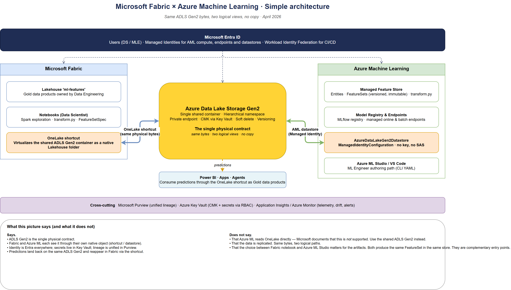{ width=95% }

### Detailed view

The detailed reference adds the four planes that an architecture review will ask about: data sources, authoring entry points, the shared physical layer, the Azure ML execution plane, and the cross-cutting identity / network / observability columns.

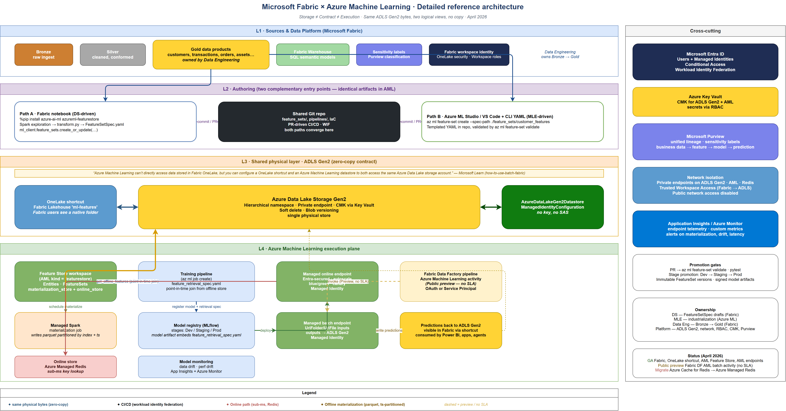{ width=100% }

- **Plane 1 — Sources & Data Platform (Fabric).** Lakehouses, Warehouses and Gold data products, governed by Fabric workspace roles, OneLake security and Purview.
- **Plane 2 — Authoring.** Two complementary entry points: the **Fabric notebook** with the `azure-ai-ml` and `azureml-featurestore` SDKs, and **Azure ML Studio / VS Code + CLI YAML**. Both produce identical artifacts in the AML Feature Store and target the same ADLS Gen2.
- **Plane 3 — Shared physical layer (ADLS Gen2).** Single storage account. **OneLake shortcut** on the Fabric side, **AzureDataLakeGen2Datastore** on the Azure ML side. This is the only place feature bytes physically live.
- **Plane 4 — Azure ML execution plane.** The Feature Store workspace with registered Entities and Feature Sets; training pipelines and the model registry; managed online and batch endpoints. Predictions are written back to the same ADLS Gen2 and re-surface in Fabric via the shortcut.
- **Cross-cutting — Identity & Network.** Entra ID for users, Managed Identity for AML compute and endpoints, private endpoints on ADLS Gen2 and the AML workspace, Trusted Workspace Access for Fabric → ADLS egress.
- **Cross-cutting — Governance & Observability.** Purview for unified lineage, Key Vault for secrets and CMKs, Application Insights and Azure Monitor for runtime telemetry.

The two arrows that matter most are:

1. The **register-spec arrow** from the authoring side (Fabric notebook *or* Azure ML Studio) to the AML Feature Store. The `FeatureSetSpec.yaml` and the `transform.py` are stored as immutable versioned artifacts.
2. The **materialize arrow** from the AML Feature Store back to ADLS Gen2. AML re-executes the transformation on its own compute and writes parquet partitioned by index keys + timestamp.

---

## Recommended target architecture

If you take only one page from this guide, take this one. The rest of the document explains the why; this section states the what. The pattern below is the **best current production pattern as of April 2026**, aligned with what Microsoft documents and supports today. It will evolve when the OneLake datastore reaches GA, when Fabric ships a native feature store, and when the Fabric Data Factory `Azure Machine Learning` activity exits Public preview — but until then, this is the defensible default.

| Domain | Recommendation |
|---|---|
| **Storage** | One ADLS Gen2 account per environment (Dev / Staging / Prod), seen by Fabric via a OneLake shortcut and by Azure ML via an `AzureDataLakeGen2Datastore`. No double-write, no sync job. Hierarchical namespace, soft delete, **CMK** via Key Vault. **Do not enable blob versioning** on containers that hold Delta tables — Delta manages history through its transaction log, and account-level versioning conflicts with it (see Storage anti-patterns). |
| **Authoring** | Two paths coexist — Path A (Fabric notebook + SDK) for exploratory and Spark-heavy features, Path B (Azure ML Studio / VS Code + CLI YAML) for MLE/CI-first teams. **Both produce the exact same artifacts in the AML Feature Store.** |
| **Feature lifecycle** | Azure ML Managed Feature Store is the **single source of truth** for feature definitions, versions, materialization and retrieval specs. A Fabric Lakehouse table is *not* a feature set until it is registered. |
| **Serving** | Offline store by default. Online store (Azure Managed Redis) only when a synchronous endpoint is required and the latency budget cannot be met by the offline path. |
| **Orchestration** | Azure ML pipelines or ADF for any critical or contractually-bound batch (GA, supported SLAs). Fabric Data Factory's `Azure Machine Learning` activity (Public preview) for non-critical, data-centric triggers only. |
| **Identity** | Managed Identity for all Azure ML compute, endpoints and datastore credentials. Entra ID for human users. Federated workload identity (GitHub OIDC → Entra) for CI/CD. **No SAS, no storage keys, no long-lived secrets.** |
| **Network** | Private endpoints on ADLS Gen2, Azure ML workspace and online store. Trusted Workspace Access for Fabric egress to ADLS Gen2. Public network access disabled on storage. |
| **Governance** | Purview ingests both Fabric and Azure ML lineage. Sensitivity labels propagate from Fabric items to ADLS Gen2 to AML datasets. Each model carries a documented owner, business case and retrieval spec embedded in its artifact. |

The remaining sections of this guide validate each row of this table against Microsoft documentation, decision criteria and operational evidence.

---

## The ADLS Gen2 + OneLake shortcut contract

The single most important sentence in the entire Microsoft documentation set on this topic comes from `how-to-use-batch-fabric`:

> *"Azure Machine Learning can't directly access data stored in Fabric OneLake, but you can configure a OneLake shortcut and an Azure Machine Learning datastore to both access the same Azure Data Lake storage account."*
>
> — Microsoft Learn, [Use Microsoft Fabric to access models deployed to Azure Machine Learning batch endpoints](https://learn.microsoft.com/en-us/azure/machine-learning/how-to-use-batch-fabric?view=azureml-api-2)

Read it twice. It rules out the tempting but unsupported pattern of giving Azure ML a direct connector to OneLake, and it prescribes the supported pattern: a **dedicated ADLS Gen2 account** seen in parallel by the two products.

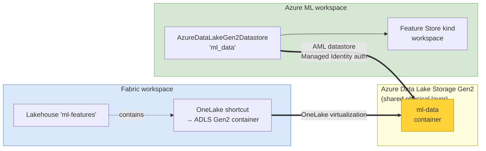

### Provisioning, in order

1. **Platform team** creates the ADLS Gen2 account (`hierarchical namespace = enabled`), one container per environment (`ml-data-dev`, `ml-data-prod`), enables **soft delete** (blobs and containers), and enforces **CMK** via Key Vault. **Do not enable blob versioning** on containers that hold Delta tables (the Lakehouse `Tables` area, materialized parquet folders): Delta Lake manages history via its `_delta_log/` transaction log and account-level versioning either duplicates that history at the storage layer or breaks `OPTIMIZE` / `VACUUM` semantics. Soft delete is the right safety net for accidental deletes; blob versioning is not.
2. **Platform team** enables **private endpoints** on the storage account and on the AML workspace; opens **Trusted Workspace Access** for Fabric egress to the storage account.
3. **Platform team** assigns the **Managed Identity of the AML workspace** the role `Storage Blob Data Contributor` on the container.
4. **Platform team** creates the **Lakehouse** in the Fabric ML workspace and creates the **OneLake shortcut** to the ADLS Gen2 container — once, for all DS users.
5. **Platform team** registers the **AzureDataLakeGen2Datastore** in the AML workspace using `ManagedIdentityConfiguration` (no account key, no SAS token).

```python
# AML side — datastore registration with Managed Identity
from azure.ai.ml.entities import AzureDataLakeGen2Datastore, ManagedIdentityConfiguration

datastore = AzureDataLakeGen2Datastore(
    name="ml_data",
    description="Shared ADLS Gen2 between Fabric and Azure ML",
    account_name="contosomldata",
    filesystem="ml-data",
    credentials=ManagedIdentityConfiguration(),
)
ml_client.datastores.create_or_update(datastore)
```

After this is done, the DS in Fabric sees a folder under `Files/` of the Lakehouse and reads/writes Delta tables on it as if it were native OneLake. The MLE in Azure ML reads the same bytes through the datastore. Neither side ever copies the data.

### Alternative: the OneLake datastore (Public preview)

Azure ML now ships an [**OneLake datastore**](https://learn.microsoft.com/en-us/azure/machine-learning/how-to-datastore?view=azureml-api-2#create-a-onelake-microsoft-fabric-datastore-preview) type, currently in **Public preview**, that lets the AML workspace point directly at a Fabric Lakehouse without the intermediate ADLS Gen2 account. Under the hood it is still ABFS — Azure ML resolves the OneLake artifact URL and treats it as ADLS — but the user sees one fewer storage account. The corresponding SDK class, [`azure.ai.ml.entities.OneLakeDatastore`](https://learn.microsoft.com/en-us/python/api/azure-ai-ml/azure.ai.ml.entities.onelakedatastore?view=azure-python), is marked **experimental**, which confirms the preview status. A [UI walkthrough](https://learn.microsoft.com/en-us/azure/machine-learning/create-datastore-with-user-interface?view=azureml-api-2) is also available in the Azure ML Studio docs.

| Pattern | Status (April 2026) | Strengths | Limits |
|---|---|---|---|
| **Shared ADLS Gen2 + OneLake shortcut + AML AzureDataLakeGen2Datastore** | **GA** — recommended for production | Mature, supported, works for files **and** Delta tables, identity via Managed Identity, no preview risk. | One extra storage account to provision and govern. |
| **OneLake datastore** (`AzureMLOneLakeDatastore` pointing at a Lakehouse artifact) | **Public preview** | Architectural simplicity — one fewer storage account; the AML workspace targets the Lakehouse directly. | Preview, **no SLA**; currently restricted to the **`Files`** area of the Lakehouse (not the registered tables); requires the workspace/artifact GUIDs in the URL; production validation not warranted yet. |

**Recommendation:** stay on the GA pattern (shared ADLS Gen2 + shortcut + datastore) for any production workload until the OneLake datastore reaches GA and lifts the `Files`-only restriction. Use the OneLake datastore in Dev / lab environments where the simplicity payoff matters and the preview risk is acceptable.

### What "zero-copy" actually means

The same physical bytes are addressable through two different logical paths:

- Fabric: `/lakehouse/default/Files/ml_features/customer_features_v3/...`
- Azure ML: `azureml://datastores/ml_data/paths/customer_features_v3/...`

There is no replication, no synchronization job, no eventual consistency. The reads on the AML side and on the Fabric side hit the same Delta files. This is the whole point.

What is **not** automatically zero-copy:

- The materialized output of the Azure ML Feature Store is a *new* set of parquet files (partitioned by `index_columns` + `timestamp_column`) written to its own folder on the same ADLS Gen2. It is derived from the source feature tables — by design, because materialization is what guarantees training/serving parity. **Materialization is, however, optional for the offline path**: if the source Gold table on the Lakehouse already meets the read-throughput requirements of the training job, an Azure ML training script can read it directly through the shared datastore without going through `get_offline_features`. That is a true zero-copy training path, at the cost of giving up point-in-time joins, the retrieval spec contract and the FeatureSet versioning. It is a defensible choice for one-shot models, ad-hoc backfills and exploratory training; it is not the right default for an industrialized model with multiple consumers and audit obligations.
- The online store (Redis) holds a separate copy optimized for sub-millisecond lookup. Cost and TTL of this copy are deliberate.

---

## Two complementary authoring paths

There are two officially supported entry points to register a feature set. They produce **identical artifacts in Azure ML** and they consume **identical infrastructure**. The difference is the human who drives them and the local context (notebook environment vs YAML/CLI). They are not in opposition; in real organizations, both paths coexist, sometimes for the same team across different feature sets.

### Underlying architecture of each path

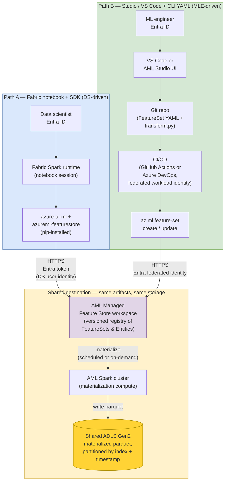

The two paths differ only in the **authoring environment** and the **identity context**. From the AML control plane's perspective, both arrive as `POST /featurestore/featuresets` calls authenticated by an Entra token; the resulting `FeatureSet:version`, `FeatureSetSpec.yaml` and `transform.py` are byte-identical. Materialization is always done by AML Spark, regardless of which side authored the spec — Fabric Spark is **never** the materialization runtime, even in Path A.

### Path A — From a Fabric notebook (DS-driven, SDK)

The DS stays in Fabric. After installing `azure-ai-ml` and `azureml-featurestore` in the Fabric Spark environment, they can register a feature set directly from their notebook.

```python
%pip install azure-ai-ml azureml-featurestore

from azure.ai.ml import MLClient
from azure.ai.ml.entities import FeatureSet
from azure.identity import DefaultAzureCredential

ml_client = MLClient(
    DefaultAzureCredential(),
    subscription_id="<sub>",
    resource_group_name="contoso-ml-rg",
    workspace_name="contoso-feature-store",
)

ml_client.feature_sets.create_or_update(
    FeatureSet(
        name="customer_features",
        version="3",
        specification={"path": "./feature_sets/customer_features"},
        entities=["azureml:customer:1"],
        stage="Development",
    )
)
```

**Pros**
- DS productivity is preserved: same tool, same data, same identity.
- No context switch between Fabric and Azure ML Studio.
- The DS owns the spec; the spec is co-authored with the exploration code in the same notebook.

**Cons**
- Requires the DS to install Python packages in the Fabric environment (use **environments** rather than `%pip install` for stability across sessions).
- Requires the DS Entra identity to have Azure ML RBAC (`AzureML Data Scientist` role on the Feature Store workspace, at minimum).
- Network reachability from Fabric Spark to the AML control plane must be open (or routed via private endpoints if the AML workspace is private).

### Path B — From Azure ML Studio / VS Code + CLI YAML (MLE-driven)

The MLE works from Azure ML Studio (UI) or VS Code with the Azure ML extension. They author the same `FeatureSetSpec.yaml` and `transform.py` and register the feature set with `az ml feature-set create` or the SDK.

```bash
az ml feature-set create \
  --name customer_features \
  --version 3 \
  --feature-store-name contoso-feature-store \
  --resource-group contoso-ml-rg \
  --spec-path ./feature_sets/customer_features
```

**Pros**
- All-in-one inside Azure ML; native to CI/CD.
- Best for MLE-led teams or first-time onboarding (the Studio UI guides through the spec).
- Independent of Fabric environment management.

**Cons**
- The MLE is one step removed from the source data exploration; risk of the spec drifting from the actual data semantics.
- Requires either the source data to be visible to AML (via the same ADLS Gen2 datastore) or a separate exploration loop.

### Decision tree: which path for this feature set?

Both paths can be active in the same organization. The choice is per feature set, not per team, and it is reversible (the artifacts in AML are identical).

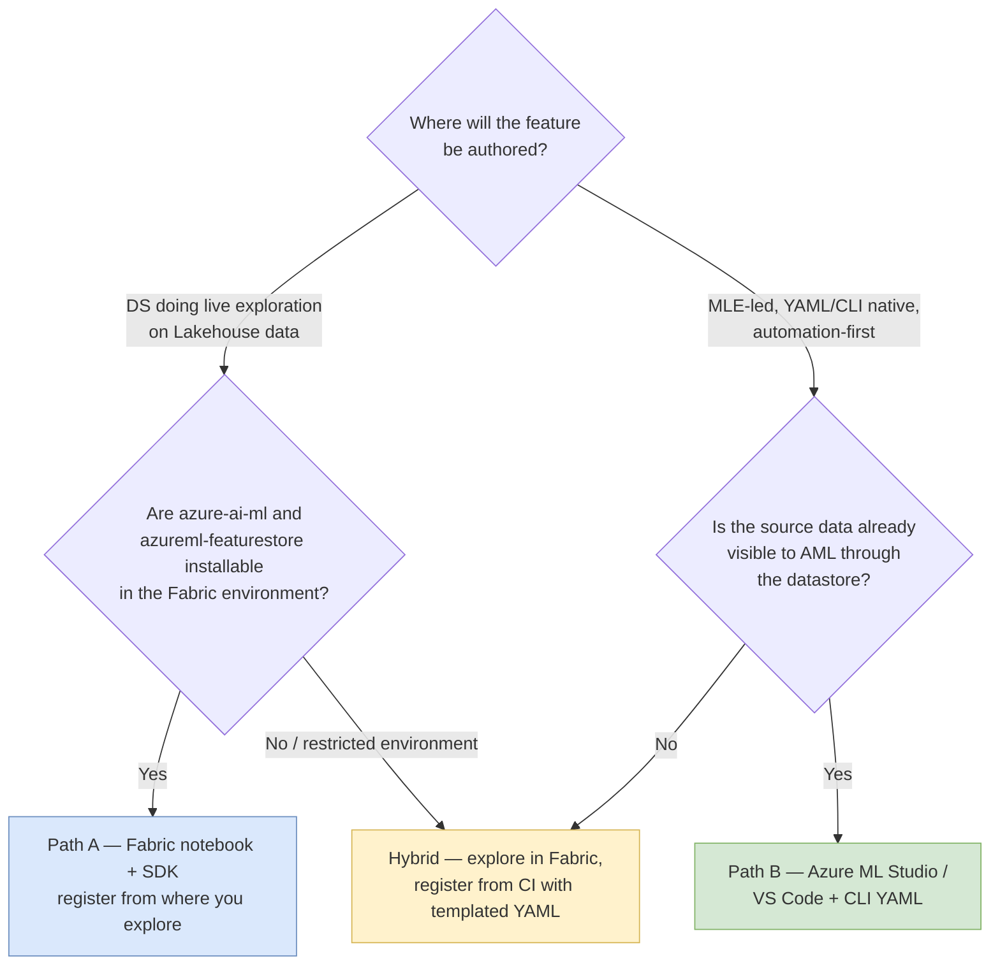

### Decision criteria (reference table)

| Criterion | Lean Path A (Fabric notebook + SDK) | Lean Path B (Azure ML Studio/CLI) |
|---|---|---|
| Feature requires interactive Spark exploration on Lakehouse data | **Yes** | |
| Feature is essentially "wrap an existing Delta table" | | **Yes** |
| Team profile is mostly DS, less MLE | **Yes** | |
| Team profile is mostly MLE, automation-first | | **Yes** |
| First feature set, onboarding the team | | **Yes** (UI guidance) |
| 50+ feature sets, automated PR-driven publishing | **Yes** (notebooks templated) | **Yes** (CLI in CI) |
| Fabric workspace has restricted egress and AML packages are not pre-approved | | **Yes** |
| DS already proficient with Azure ML SDK | **Yes** | **Yes** |
| Feature transformation is complex (windows, multi-source joins) | **Yes** | (possible but heavier) |
| Feature is a simple aggregation on one table | | **Yes** |

**Recommendation.** Do not enforce a single path. Templated notebooks for Path A and templated YAML for Path B should both be available in your platform repo. The OneLake shortcut on Fabric and the AML datastore on Azure ML guarantee that **the underlying artifacts are identical** regardless of who authored them. Letting users choose preserves productivity without compromising the contract.

---

## End-to-end flow: from a Fabric notebook to production

The flow below is the canonical Path A version. Path B is the same artifacts authored from the AML side; the steps after step 4 are identical.

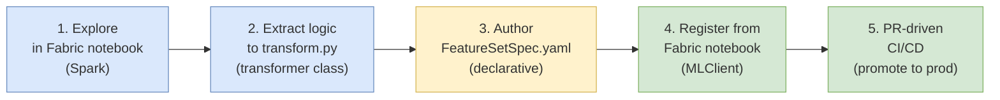

### Step 1 — Interactive exploration in a Fabric notebook

```python
# Fabric notebook — native Spark
customers = spark.read.table("DataPlatform.customers")
transactions = spark.read.table("DataPlatform.transactions")

from pyspark.sql import functions as F
from pyspark.sql.window import Window

window_30d = (Window
    .partitionBy("customer_id")
    .orderBy("event_ts")
    .rangeBetween(-30 * 86400, 0))

features = (transactions
    .withColumn("avg_spend_30d", F.avg("amount").over(window_30d))
    .withColumn("nb_tx_30d",     F.count("*").over(window_30d))
    .join(customers, "customer_id"))

features.display()
```

### Step 2 — Extract the logic into a transformer class

The goal is to make the transformation **callable by the Feature Store** at materialization time. The contract is a class with a `_transform(df)` method.

```python
# feature_sets/customer_features/transformation_code/transform.py
from pyspark.sql import functions as F
from pyspark.sql.window import Window

class CustomerFeatures:
    def _transform(self, df):
        w = (Window
            .partitionBy("customer_id")
            .orderBy("event_ts")
            .rangeBetween(-30 * 86400, 0))
        return (df
            .withColumn("avg_spend_30d", F.avg("amount").over(w))
            .withColumn("nb_tx_30d",     F.count("*").over(w)))
```

### Step 3 — Author the FeatureSetSpec

```yaml
# feature_sets/customer_features/FeatureSetSpec.yaml
$schema: http://azureml/sdk-2-0/FeatureSetSpec.json
source:
  type: parquet
  path: abfss://ml-data@contosomldata.dfs.core.windows.net/transactions/
  timestamp_column:
    name: event_ts
feature_transformation_code:
  path: ./transformation_code
  transformer_class: transform.CustomerFeatures
features:
  - name: avg_spend_30d
    type: float
  - name: nb_tx_30d
    type: integer
index_columns:
  - name: customer_id
    type: string
source_lookback:
  days: 30
```

The `source.path` points to the **ADLS Gen2** path — the same physical bytes the Fabric DS sees through the OneLake shortcut. Use a config variable, not a hard-coded URL.

### Step 4 — Register from the Fabric notebook

```python
from azure.ai.ml import MLClient
from azure.ai.ml.entities import FeatureSet
from azure.identity import DefaultAzureCredential

ml_client = MLClient(
    DefaultAzureCredential(),
    subscription_id="<sub>",
    resource_group_name="contoso-ml-rg",
    workspace_name="contoso-feature-store",
)

ml_client.feature_sets.create_or_update(
    FeatureSet(
        name="customer_features",
        version="3",
        specification={"path": "./feature_sets/customer_features"},
        entities=["azureml:customer:1"],
        stage="Development",
    )
)
```

At this point the spec and the transformation code are versioned and **immutable** in the AML Feature Store. Any subsequent change requires a new version (`v4`, `v5`…). This is what guarantees that `model_v12` trained on `customer_features:3` today will still get the same features in six months.

### Step 5 — PR-driven CI/CD promotion

The DS does not push to production directly. The flow is:

1. The DS commits the spec + transformation code to the Git repo.
2. The DS opens a **Pull Request**.
3. The CI pipeline runs `az ml feature-set validate` and unit tests on `transform.py`.
4. The MLE reviews and approves.
5. On merge to `main`, the CD pipeline runs `az ml feature-set create --stage Staging`, then on tag release `--stage Production`.

```yaml
# .github/workflows/feature-set-promote.yml (excerpt)
name: feature-set promote
on:
  pull_request:
    paths: ['feature_sets/**']
jobs:
  validate:
    steps:
      - uses: actions/checkout@v4
      - uses: azure/login@v2
        with:
          client-id: ${{ secrets.AZURE_CLIENT_ID }}
          tenant-id: ${{ secrets.AZURE_TENANT_ID }}
          subscription-id: ${{ secrets.AZURE_SUBSCRIPTION_ID }}
      - name: Install az ml
        run: az extension add -n ml -y
      - name: Validate spec
        run: az ml feature-set validate --spec-path feature_sets/customer_features
      - name: Unit test transformer
        run: pytest feature_sets/customer_features/tests
```

---

## Materialization: offline vs online stores

A registered FeatureSet is just a *definition* until it is **materialized**. Materialization is the act of running the `transform.py` against the source data on a schedule and writing the output to a store optimized for fast reads.

| Store | Where | What it serves | Latency profile |
|---|---|---|---|
| **Offline store** | ADLS Gen2 (parquet partitioned by index + timestamp) | Training, batch inference, exploration, backfills | Seconds (Spark scan) |
| **Online store** | Redis-based key-value store | Real-time inference (one entity at a time) | Sub-millisecond |

### Offline store

Configured at the Feature Store workspace level: `materialization_store: <ADLS Gen2 path>`. The Feature Store writes parquet files partitioned by `index_columns` and `timestamp_column`. Time-travel queries (point-in-time joins) are served from this layout.

Materialization can be triggered:

- **On-demand** — `ml_client.feature_sets.begin_materialize(...)` for backfills.
- **On a schedule** — daily, hourly, or any cron expression. AML provisions a managed Spark compute cluster transiently for each run.

Cost levers for the offline store:

- **Materialization frequency** — every minute will be expensive; align with the freshness the model actually needs.
- **Compute size** — start small (`Standard_E4s_v3` × 2) and scale only when materialization SLA misses.
- **Source lookback window** (`source_lookback.days` in the spec) — how far back to read each run. Set it to the rolling window you actually need.

### Online store

Configured at the Feature Store workspace level: `online_store: <Redis cache resource ID>`. Microsoft's current guidance for new architectures is **Azure Managed Redis** rather than Azure Cache for Redis (which has had a retirement announcement). Validate the exact Azure Managed Redis tier supported by your AML region before committing.

Online materialization is enabled per feature set via `materialization_settings` and runs on the same schedule as the offline materialization (or a separate one, if the freshness requirements differ).

When to enable the online store:

- The model is served via a synchronous online endpoint.
- The end-to-end latency budget is below ~500 ms.
- The lookup is by primary key (`customer_id = 123`) and you cannot afford a Spark scan per request.

When **not** to enable it:

- Batch-only models. The online store will sit there empty and bill you.
- Models scoring ≤ a few requests per minute. A direct read of the materialized parquet from a small compute will be cheaper.

### Decision tree: enable the online store?

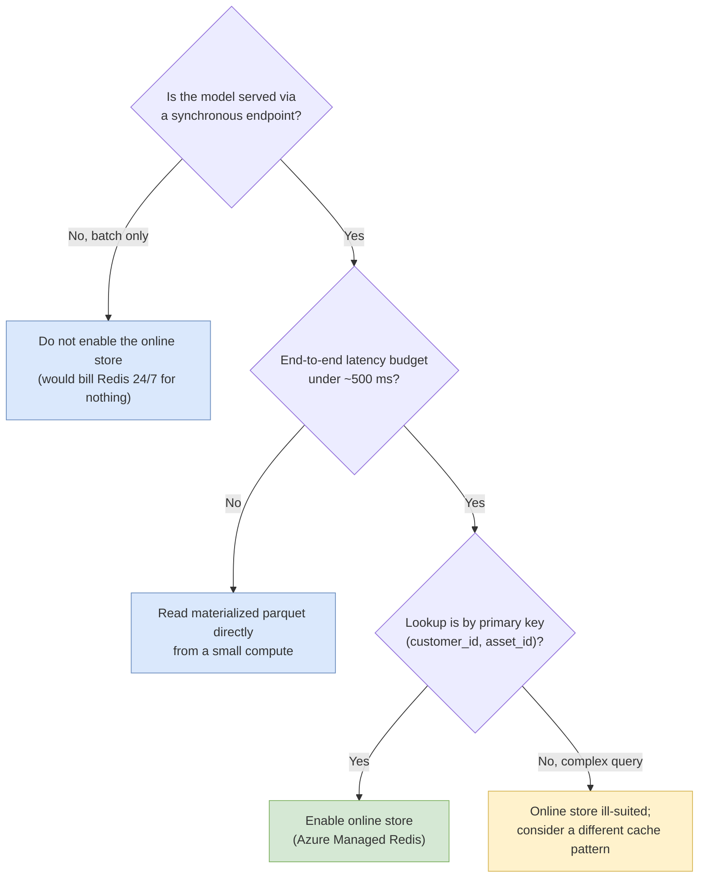

### Real-time / streaming ingestion of features

The default materialization path is batch (Spark on a schedule). Some use cases — fraud detection, anomaly scoring, recommendation, IoT — need features whose latest value is seconds-old, not hours-old. Microsoft Fabric's **Real-Time Intelligence** (RTI) and **Eventstream** components are the natural producers for this case; the Azure ML Feature Store is the natural consumer.

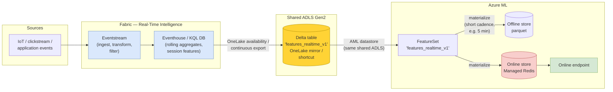

**Two production patterns are valid today:**

1. **Eventstream → Eventhouse → Delta on shared ADLS → AML FeatureSet (recommended for now).** Eventstream ingests the source, Eventhouse maintains the rolling/window aggregates as a KQL database, OneLake availability or a continuous export writes the aggregated state to a Delta table on the shared ADLS Gen2, and the AML FeatureSet is materialized from that Delta table on a short cadence (5–15 minutes typically). This keeps the **same storage contract** as the batch path — same ADLS, same datastore, same retrieval spec. It uses the products in their GA roles and avoids preview-only paths.
2. **Eventstream → custom writer → AML online store directly.** A push pipeline (Stream Analytics job, custom Spark Structured Streaming, or a Function) writes feature rows directly into the Managed Redis online store. This skips the FeatureSet abstraction and gives the lowest latency, at the cost of bypassing point-in-time joins, retrieval spec versioning and Purview lineage. Use it only when sub-second freshness is non-negotiable and the feature has no offline consumer.

**Architecture rules for the streaming path:**

- Materialization cadence on streaming-backed FeatureSets should **not** be tighter than the actual data refresh cadence on the source Delta table. Materializing every minute when the source updates every five minutes only costs Spark, it does not add freshness.
- The online store remains optional even on streaming features; enable it only when an online endpoint actually consumes the FeatureSet.
- **Schema and null-ratio validation on the Delta sink** is mandatory before materialization (see *Data contracts*) — streaming sources are noisier than batch sources, and a malformed event burst can poison hours of features without any obvious failure.
- For anything below ~5 minutes of freshness, validate that the AML Feature Store materialization scheduler in your region supports the cadence you need; some tiers and regions cap the schedule frequency. If it does not, fall back to pattern 2 (direct push to the online store).

---

## Training: feature retrieval spec and point-in-time joins

A training job does not consume features by their physical path. It consumes them through a **Feature Retrieval Spec**, which lists the features (by name + version) that the model uses.

```python
# Training side — generate the retrieval spec from the registered features
from azureml.featurestore import FeatureStoreClient, get_feature_set
from azure.identity import AzureMLOnBehalfOfCredential

featurestore = FeatureStoreClient(
    credential=AzureMLOnBehalfOfCredential(),
    subscription_id="<sub>",
    resource_group_name="contoso-ml-rg",
    name="contoso-feature-store",
)

customer_features = featurestore.feature_sets.get(
    name="customer_features", version="3"
)

features = [
    customer_features.get_feature("avg_spend_30d"),
    customer_features.get_feature("nb_tx_30d"),
]

# This generates feature_retrieval_spec.yaml inside the model artifact
featurestore.generate_feature_retrieval_spec(
    path="./model_artifact",
    features=features,
)
```

The retrieval spec is then **packaged with the model**. When the model is later loaded by an online endpoint or a batch job, the scoring code uses the retrieval spec to fetch features without re-implementing any feature logic. This is what guarantees that the same value of `avg_spend_30d` is used at training time and at serving time.

### Point-in-time joins

The killer feature of a feature store is the **point-in-time join**. You provide an *observations* table:

```
customer_id | observation_time | label
1001        | 2026-03-12 14:00 | 1
1002        | 2026-03-13 09:00 | 0
...
```

You ask the feature store: *"give me the values of `avg_spend_30d` and `nb_tx_30d` as they were at `observation_time` for each row"*. The store returns the right values, never values from the future.

```python
training_df = featurestore.get_offline_features(
    features=features,
    observation_data=observations_spark_df,
    timestamp_column="observation_time",
)
```

Without point-in-time joins, you write that logic by hand and you eventually get it wrong. That is the single most common cause of *"the model worked great offline and collapsed in production"*.

---

## Serving the model

Three serving modes are available, and they are not interchangeable.

### Online inference (Azure ML managed online endpoint)

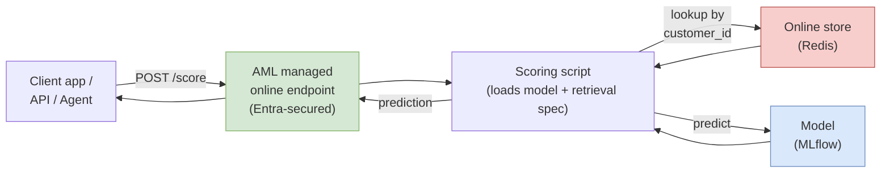

- The client never calls the feature store directly. It calls the AML endpoint with the entity key.
- The scoring script uses the **feature retrieval spec packaged with the model** to look up features in the online store.
- Authentication: Entra ID (recommended) or key-based auth.
- Autoscaling, blue/green, canary and traffic split are managed by AML.

### Batch inference from Azure ML

When the orchestration logic naturally lives in the ML world (re-training pipelines, offline scoring jobs triggered by `az ml job create`), use a **managed batch endpoint** with a **feature retrieval component** that runs the point-in-time join from the offline store.

```python
# Batch inference job — feature retrieval is a built-in AML component
from azure.ai.ml import command, Input, Output

job = command(
    code="./score",
    command="python score.py --features ${{inputs.features}}",
    environment="azureml://registries/azureml/environments/sklearn-1.5/versions/1",
    compute="cpu-cluster",
    inputs={
        "features": Input(
            type="uri_folder",
            path="azureml://datastores/ml_data/paths/customer_features_v3/",
        ),
    },
    outputs={
        "scores": Output(
            type="uri_folder",
            path="azureml://datastores/ml_data/paths/predictions/",
        ),
    },
)
```

Outputs land back on the shared ADLS Gen2 → reappear in the Fabric Lakehouse via the OneLake shortcut → are consumed by Power BI, downstream pipelines and applications.

### Batch inference triggered from a Fabric pipeline (Public preview)

When the orchestration naturally lives in the data world (a Fabric Data Factory pipeline that triggers scoring at the end of a daily ETL), use the built-in **Azure Machine Learning** activity in the Fabric pipeline.

> **Status — Public preview.** The Fabric Data Factory **Azure Machine Learning** activity is currently in public preview. It does **not** carry a service-level agreement and is not recommended for production workloads that need guaranteed availability. (Source: Microsoft Learn — `how-to-use-batch-fabric`.) Plan accordingly: use it for non-critical batches, monitor its behavior, and have a fallback orchestrator (Azure ML pipeline triggered by Azure Data Factory or AML schedule) for production-grade SLAs.

```mermaid
flowchart LR
    SCH["Fabric pipeline<br/>schedule"] --> PIPE["Fabric Data Factory<br/>pipeline"]
    PIPE --> ACT["Azure Machine Learning<br/>activity (Preview)"]
    ACT -->|"OAuth or SP"| EP["AML batch endpoint"]
    EP --> COMP["Batch compute<br/>cluster"]
    COMP -->|"read inputs"| ADLS[("ADLS Gen2<br/>(shared)")]
    COMP -->|"write predictions.csv"| ADLS
    ADLS -->|"OneLake shortcut"| LH["Fabric Lakehouse<br/>'predictions'"]
    LH --> PBI["Power BI report"]
    style ACT fill:#fff2cc,stroke:#d6b656
    style EP fill:#d5e8d4,stroke:#82b366
    style ADLS fill:#ffd335,stroke:#a88b00
```

Per Microsoft Learn, the activity:

- Connects to the AML workspace via **Organizational account** (interactive OAuth) or **Service Principal** (recommended for production).
- Calls the **default deployment** of the chosen batch endpoint, unless a specific deployment is selected.
- Accepts inputs as `JobInputType=UriFolder` (or `UriFile`, or `Literal`) with the data path in `azureml://datastores/<name>/paths/...` form.
- Requires outputs to point at a **datastore path** (not an arbitrary Lakehouse path) — `@concat('azureml://datastores/trusted_blob/paths/endpoints/', pipeline().RunId, '/predictions.csv')`.
- Supports both AML **model deployments** and AML **pipeline deployments**.

The output predictions land on ADLS Gen2 → become visible in Fabric via the OneLake shortcut → consumed by Power BI.

### Decision tree for placing the orchestration

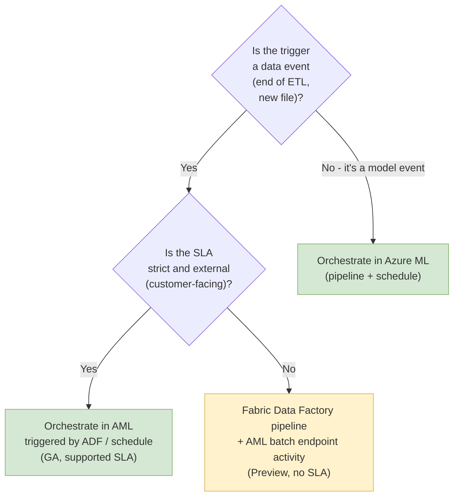

**Architecture rule (to record in the ADR).**

> *Orchestrate in **Fabric Data Factory** for data-centric, non-critical batches that have no external SLA. Orchestrate in **Azure ML pipelines** (triggered by AML schedule or by Azure Data Factory) for any batch that is critical, contractually bound, or runs against a tenant-wide quota that must not collide with ad-hoc DS work. Until the Fabric `Azure Machine Learning` pipeline activity exits Public preview, treat it as best-effort: usable, but with a fallback orchestrator declared in the runbook.*

---

## Feature lifecycle: versioning, deprecation, decommissioning

Versioning is where a feature platform either stays trustworthy or quietly becomes a liability. The Azure ML Feature Store enforces the right primitive — FeatureSets are immutable per version — but the **operating policy** around it must be made explicit.

### Compatibility contract

| Artifact | Versioned | Bound to |
|---|---|---|
| `FeatureSet` (definition + `transform.py`) | Yes — every change is a new version | Source schema, business semantics |
| Materialized data on ADLS Gen2 | Implicitly versioned by partition path | The `FeatureSet` version that produced it |
| `feature_retrieval_spec.yaml` | Embedded inside the model artifact at training time | Specific `FeatureSet:version` references |
| Model artifact in the AML registry | Yes — every training run produces a new candidate | Its embedded `feature_retrieval_spec.yaml` |
| Online endpoint deployment | Versioned by deployment slot (blue / green / canary) | A specific model version |

**The rule:** a model in production is bound to the exact `FeatureSet:version` references in its embedded retrieval spec. A new `FeatureSet:version` does **not** silently propagate to a deployed model — re-training and re-deployment are required.

### Deprecation policy

A FeatureSet version moves through three states: **Active → Deprecated → Decommissioned**. The transitions are governed, not improvised.

| Stage | Trigger | Required actions |
|---|---|---|
| **Active** | Default at registration. | Materialization runs on schedule; consumed by training and serving. |
| **Deprecated** | A newer version supersedes it, or a defect is found. | Stage moved to `Deprecated` in the registry; materialization continues; no new model trained on this version may be promoted to Production; consumers receive a 90-day migration notice. |
| **Decommissioned** | All consumers migrated; deprecation grace period elapsed. | Materialization disabled; offline parquet retained per audit policy (typically 5 years for EU AI Act high-risk); registry entry kept for lineage. |

**Minimum grace period:** 90 days from `Deprecated` to `Decommissioned`, longer if a deployed model still references the version. The grace period is not a soft guideline — a model whose retrieval spec points to a decommissioned FeatureSet will fail at inference.

### Schema evolution rules

Not every change is a major version bump. Use the following table to decide:

| Change | Version impact | Rationale |
|---|---|---|
| Add a new feature column | **Minor** version (`1.0` → `1.1`) | Backward compatible: existing retrieval specs still resolve. |
| Remove a feature column | **Major** version (`1.x` → `2.0`) | Breaks every retrieval spec that references it. |
| Rename a feature column | **Major** version | Breaks every retrieval spec that references it. |
| Change the transformation logic of an existing column | **Major** version | Same name, different value — silent corruption otherwise. |
| Change `index_columns` or `timestamp_column` | **New FeatureSet** (not a version) | These define the join contract; changing them is not an evolution. |
| Change the source path | **New version** (minor or major depending on data semantics) | Lineage clarity. |
| Tighten data types (e.g., `double` → `float`) | **Major** version | Downstream models may overflow. |

### Producer–consumer notification

Every FeatureSet has a documented owner and a registered consumer list. Deprecation notices flow through the same channel as model owners (typically a service ticket or a Teams notification driven by an Azure Function on registry events). The CI/CD pipeline blocks promotion of any model whose retrieval spec references a `Deprecated` FeatureSet without an owner-approved exception, recorded in the PR.

---

## Governance: identity, network, lineage, EU AI Act

### Identity

| Surface | Identity | Authority |
|---|---|---|
| Fabric users (DS, analysts) | **Entra ID user** | Fabric workspace role + OneLake security |
| Fabric notebook calling Azure ML | **Entra ID user** (interactive) or workspace identity | Azure ML RBAC |
| Azure ML compute clusters | **System-assigned Managed Identity** of the AML workspace | Storage, Key Vault, ACR roles |
| Azure ML online & batch endpoints | **System-assigned Managed Identity** of the endpoint | Storage, Key Vault, online store roles |
| Azure ML datastore for ADLS Gen2 | **Managed Identity** (`ManagedIdentityConfiguration`) | `Storage Blob Data Contributor` on container |
| CI/CD pipelines | **Workload identity** federation (GitHub OIDC → Entra) | Azure ML, ADLS Gen2, Key Vault |

**Rules:**

- No service principal with a stored secret unless absolutely required.
- No account key on the storage account.
- No SAS token in notebooks.
- Conditional Access enforced on all human identities accessing Fabric and Azure ML.

### Network

| Component | Posture |
|---|---|
| ADLS Gen2 | Private endpoint mandatory; public network access disabled. |
| Azure ML workspace | Private endpoint mandatory for production; managed virtual network if using Studio compute. |
| Online store (Managed Redis) | Private endpoint; restricted to AML endpoint subnet. |
| Fabric workspace egress to ADLS Gen2 | **Trusted Workspace Access** on the storage account, scoped to the Fabric workspace. |
| Cross-tenant access | Disabled by default; audited if enabled. |

#### Minimum-viable production network flow

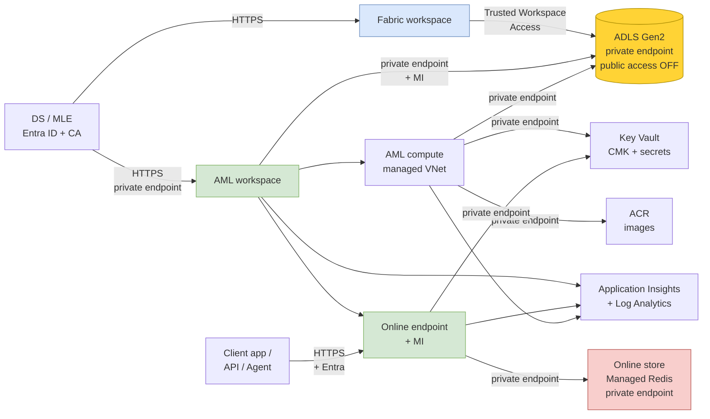

The diagram captures the **mandatory** dependencies between components and the identities used on each edge. A production deployment that lacks any of the private endpoints above, or that exposes ADLS Gen2 publicly, fails an architecture review on day one.

### Encryption and key management

- **CMK** on ADLS Gen2 via Key Vault.
- **CMK** on the AML workspace via Key Vault (one-time setup at workspace creation).
- **Soft delete** enabled on the ADLS Gen2 container (blobs and containers, 14- to 30-day retention). **Blob versioning is intentionally disabled** on containers holding Delta tables — see Storage anti-patterns. For ancillary, non-Delta containers (raw drops, exports), versioning is allowed.
- Key Vault access policies replaced by **RBAC** (`Key Vault Secrets User`, `Key Vault Crypto Service Encryption User`).

### RBAC summary

| Principal | ADLS Gen2 container | Fabric ML workspace | AML workspace | Feature Store workspace |
|---|---|---|---|---|
| DS | (via Fabric workspace) | Contributor | AzureML Data Scientist | Reader |
| MLE | Reader (debug) | Reader | Contributor | AzureML Data Scientist |
| Platform team | Owner | Admin | Owner | Owner |
| AML workspace MI | Storage Blob Data Contributor | n/a | n/a | n/a |
| Endpoint MI | Storage Blob Data Reader | n/a | n/a | (read features) |
| CI/CD identity | Storage Blob Data Contributor | (deploy artifacts) | Contributor | Contributor |

### Lineage and audit

- **Fabric** records the production of each feature table: which notebook, which user, which source business tables.
- **Azure ML** records the consumption: which `FeatureSet:version` is read by which training run (MLflow), which model artifact is registered, which endpoint serves which version.
- **Microsoft Purview** ingests both lineage feeds and produces a unified graph: business data → feature → model → prediction → consumer.
- **Sensitivity labels** on Fabric items (Lakehouse, table, column) propagate to the underlying ADLS Gen2 objects and inherit on AML datasets.

This unified lineage is what makes the design defensible under the **EU AI Act**: for any prediction served, you can answer *"which model version, trained on which feature versions, computed from which source data, owned by which team, governed by which policy"*.

### Reproducibility

- FeatureSets are immutable per version. A new transformation requires a new version.
- Models in the AML registry are signed and embed their `feature_retrieval_spec.yaml`.
- Point-in-time joins from the offline store let you regenerate an exact training dataset months later.
- Source data on ADLS Gen2 has soft delete enabled; on Delta-formatted containers, history is provided by the Delta `_delta_log/` (time travel via `versionAsOf` / `timestampAsOf`), not by blob versioning.

### Data contracts: validation gate before the Feature Store

A feature is only as good as the Gold table it reads from. The split of responsibility between Data Engineering, Data Science and ML Engineering creates a recurring failure mode: **the Gold table silently degrades** (a column starts to be 30 % null, an entity disappears, a schema field changes nullability) and the FeatureSet keeps materializing happily on noise, propagating the regression to every downstream model and prediction.

A data contract is a machine-checkable description of what a Gold table must satisfy in order to be a valid input to a FeatureSet. It is owned by the Data Engineering team that publishes the table; it is enforced by the platform before each materialization run.

**Minimum data contract per Gold table feeding a FeatureSet:**

| Check | Example | Tooling |
|---|---|---|
| **Schema** | `customer_id` is `string`, non-nullable; `last_purchase_ts` is `timestamp`, non-nullable | Native Fabric Lakehouse data quality rules; Great Expectations `expect_column_values_to_be_of_type`, `expect_column_values_to_not_be_null` |
| **Freshness** | `MAX(last_event_ts)` ≥ `now() - 24h` | KQL or SQL probe scheduled with the materialization job |
| **Cardinality** | `COUNT(DISTINCT customer_id)` is within ±10 % of the 7-day rolling average | Great Expectations `expect_column_unique_value_count_to_be_between` |
| **Null ratio per column** | Per column, null ratio is within `baseline ± 5 pp` | Great Expectations `expect_column_values_to_not_be_null` with `mostly` |
| **Distribution** | KS-statistic vs the previous run's distribution is below threshold | Great Expectations custom expectation; or AML Data Drift detector on the source |
| **Referential integrity** | Every `customer_id` exists in the `customers` dimension | Great Expectations `expect_column_values_to_be_in_set` (where feasible); or a SQL probe |

**Where the validation runs:** as a Fabric notebook step (or a Data Factory activity) **before** the AML Feature Store materialization is triggered. A failed contract halts the materialization, raises an alert to the Gold table owner, and the FeatureSet keeps serving the previous valid materialization until the contract is met again.

**Contract versioning rule:** the contract is committed in Git next to the FeatureSetSpec, with the same versioning policy. A contract change that loosens a check (e.g., raising a null-ratio threshold) requires the same PR review as a code change.

This sub-section is the operational counterpart of the *pre-promotion test gate* in §Operational excellence: that gate validates the FeatureSet itself before promotion to Production; this gate validates the Gold source before each materialization. Together, they bracket the FeatureSet on both sides — the input is contract-checked at every run, the output is test-gated at every promotion.

---

## FinOps: cost structure and levers

The integration is built on five paid Azure components. Knowing which one moves the bill helps a steering committee make informed trade-offs without going dark on architecture choices.

### Cost map

| Component | Cost driver | Lever |
|---|---|---|
| **ADLS Gen2 storage** | GB stored × redundancy tier × hot/cool/archive | Lifecycle policy: move materialized partitions older than N months to *cool*. Soft delete adds an overhead proportional to its retention window — calibrate (14–30 days is usually enough). Blob versioning is *off* on Delta containers, so it does not contribute to the bill. |
| **AML materialization compute** | Spark cluster size × runtime per run × frequency | Align frequency with the model's actual freshness need. A churn model rarely needs minute-level features. Right-size compute via auto-scale; consider spot nodes for non-critical materialization. |
| **AML training compute** | GPU hours × cluster size × experiments per week | Cap experiment quotas per DS; auto-shutdown idle clusters; prefer scheduled training over ad-hoc bursts. |
| **AML online endpoint** | vCPU/RAM provisioned × hours × instances | Set realistic min/max instances; turn off canary deployments after rollout; keep the autoscale ceiling explicit, not "unlimited". Consider serverless online endpoints for spiky low-volume traffic. |
| **Online store (Azure Managed Redis)** | Tier × shard count × hours (always-on) | Enable only when an online endpoint is in place. Tune Redis eviction policy and TTL to bound memory. |
| **AML batch endpoint** | Per-job compute hours | No standing cost; only pays during runs. Cheapest serving mode for non-real-time scoring. |
| **Network** | Private endpoints (per hour, per endpoint) and egress | One private endpoint per service per environment; egress is dominated by the cross-region case — keep ADLS, AML and Fabric in the same region. |
| **Purview, Key Vault, App Insights, Log Analytics** | Mostly per-asset and per-GB-ingested | Set retention on Log Analytics aggressively (30–90 days for hot logs, archive beyond). |

### Three structural levers

1. **Disable the online store unless a real-time endpoint is deployed.** This is the single biggest avoidable cost on a feature platform. A batch-only model does not need Redis.
2. **Right-frequency materialization.** Materializing every minute costs 60× materializing every hour. Tie the frequency to the model's actual decision cadence.
3. **One ADLS Gen2 account per environment, not per team or per use case.** Every additional storage account adds private endpoints, role assignments and observability scope.

### Two anti-patterns that pad the bill

- **"Always-on" online endpoint with `min_instances=2` for a model called twice a week.** Use serverless online endpoints or scheduled scale-down.
- **Materializing every FeatureSet on the same hourly cron.** Materialization windows should reflect the source data refresh cadence, not be uniform.

### Chargeback model: Fabric CUs vs Azure ML compute

Fabric and Azure ML have **different billing units**, and a steering committee that does not understand the difference will see the bill move and not know which platform is responsible.

| Platform | Unit | Billing granularity | Who pays in the recommended chargeback |
|---|---|---|---|
| **Microsoft Fabric** | Capacity Units (CUs) on a Fabric capacity (F-SKU or Premium per User) | Per-second, against a shared capacity that hosts many workloads | The **business domain** that owns the Lakehouse and the Gold tables. Feature engineering on Fabric Spark consumes Fabric CUs against that capacity. |
| **Azure ML** | Compute hours on dedicated clusters (CPU/GPU), per-job for batch endpoints, per-instance-hour for online endpoints, per-tier-hour for the online store | Per-second on dedicated clusters, no shared envelope | The **AML workspace cost center** by default; chargeback to the model owner only if a single model dominates the bill. |
| **Shared infrastructure** | ADLS Gen2, Key Vault, Purview, Application Insights, private endpoints | Per-GB or per-asset, hour-based | The **platform team** budget. Cross-charge by container / by environment if the platform team needs to recover cost. |

**Three chargeback rules to keep the bill explainable:**

1. **Author features close to the cheaper compute.** Exploratory work, ad-hoc analytics and Spark-heavy transformations on Gold data should run on Fabric (Path A) when the team's Fabric capacity has headroom — capacity-based pricing makes incremental usage essentially free up to the SKU ceiling. **Production materialization** runs on AML Spark, where compute is per-cluster and right-sizable per FeatureSet.
2. **Tag every AML compute target with `cost_center`, `model_name`, `feature_set`.** Without those tags, the AML cost report is opaque and chargeback becomes a negotiation. Same on Fabric for capacity reports — tag the workspace and the items.
3. **Cap the Fabric capacity for the ML workspace.** A runaway Spark notebook (a DS who left a session running over a weekend) can saturate a capacity used by other Fabric workloads (Power BI, warehousing). Either dedicate a capacity to the ML workspace or set workspace-level item limits.

**Anti-pattern: routing every feature computation through AML compute "to consolidate the bill".** AML dedicated clusters are billed per second of cluster uptime; running short ad-hoc Spark jobs there costs significantly more per CPU-second than the same job on a Fabric capacity that is already paid for. Use the right compute for the right workload, even if it splits the bill.

---

## Operational excellence: SLOs, alerts, run evidence

A platform that cannot prove what it did under load is not in production. The artifacts below are the minimum to claim "production-grade" without ambiguity.

### Per-FeatureSet SLOs

| SLO | Target (suggested default) | Why |
|---|---|---|
| **Materialization success rate** | ≥ 99 % over 30 days | Primary indicator that the offline store is fresh. |
| **Materialization end-to-end latency** | P95 ≤ 2× the scheduled interval | A run that takes longer than the cadence will pile up and miss SLAs. |
| **Feature freshness** (max age of latest partition) | ≤ scheduled interval + 15 min | The contract DS and consumers depend on. |
| **Null ratio per feature column** | ≤ baseline + 5 pp | A surge of NULLs is the most common silent feature regression. |
| **Distinct entity count** | within ±10 % of 7-day baseline | Detects upstream filter changes that break joins. |

### Per-model SLOs

| SLO | Target (suggested default) | Why |
|---|---|---|
| **Online endpoint availability** | ≥ 99.9 % monthly | Standard for customer-facing endpoints. |
| **Online endpoint P95 latency** | Defined per use case (e.g., < 200 ms) | Bound the budget for online store + scoring. |
| **Online endpoint error rate** | < 0.5 % | Catches spec / model mismatches. |
| **Data drift score** (per top-10 features) | Within trained distribution range | Early warning for re-training. |
| **Prediction drift** | Within historic prediction distribution | Catches downstream changes the inputs missed. |

### Minimum alert set (day one in production)

- Materialization job failure (Azure Monitor on AML pipeline runs).
- Materialization run duration > 2× scheduled interval.
- Online endpoint 5xx rate > 1 % over 5 minutes.
- Online endpoint P95 latency above SLO for 10 minutes.
- Online store memory > 80 % capacity.
- ADLS Gen2 throttling errors above threshold.
- Failed Entra token acquisitions on AML compute MI.
- AML quota approaching limit (CPU / GPU cores per region).

### Pre-promotion test gate (CI before stage = Production)

Beyond unit tests on `transform.py` and `az ml feature-set validate`, the CI pipeline must enforce, for any FeatureSet promoted to `Production`:

- **Point-in-time correctness test.** A regenerated training dataset for a fixed observation set must match the dataset captured at the previous trained model — within tolerance for floating-point arithmetic.
- **Null ratio test.** Per-column null ratio on a sample is within `baseline ± 5 pp`.
- **Entity cardinality test.** Number of distinct `index_columns` values in the latest partition is within `±10 %` of the 7-day rolling average.
- **Distribution drift test.** Per top-10 features, KS-statistic vs the previous version is below threshold (e.g., 0.1).
- **Schema test.** Column names, types and nullability match the registered FeatureSetSpec exactly.

A FeatureSet version that fails any of these tests cannot be promoted to `Production` in the registry without an owner-approved exception, recorded in the PR.

### Audit evidence to retain

| Evidence | Retention | Source |
|---|---|---|
| Every model version, its embedded `feature_retrieval_spec.yaml`, training run ID, training dataset hash | ≥ 5 years (EU AI Act high-risk) | AML model registry + MLflow |
| Every FeatureSet version, its `transform.py` and source path | ≥ 5 years | AML Feature Store + Git |
| Materialization run logs and outputs | ≥ 1 year hot, archive beyond | Log Analytics + ADLS |
| Online endpoint request/response samples (sampled per privacy policy) | Per regulatory regime | Application Insights |
| Lineage graph snapshot (Purview) | Quarterly export | Purview |
| Access reviews on Feature Store and ADLS Gen2 | Quarterly | Entra ID Access Reviews |

---

## Decision matrix: feature store vs plain Delta table

A feature store is not a dogma. For a single batch model with 15 simple columns and one consumer, a well-governed Delta table in a Fabric Lakehouse is enough. For an industrial AI platform with multiple models, real-time serving, and audit obligations, the feature store earns its keep.

### Decision tree: do I need a feature store?

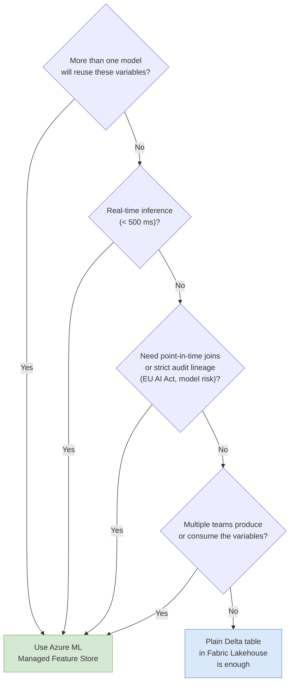

### Reference table

Use a feature store when **at least two of the following** apply:

| Condition | Why it matters |
|---|---|
| Two or more models reuse the same variables | Avoid divergent recomputations and parallel definitions. |
| The model is served in real time or near real time | Online lookup by key, sub-second SLA. |
| You need to avoid training/serving skew | The store guarantees parity by re-executing the same transformation. |
| You need point-in-time joins for training | Avoid leakage; reproduce any historical training set. |
| Multiple teams produce or consume features | A catalog and ownership model become necessary. |
| You have audit obligations (EU AI Act, internal model risk) | Lineage, versioning, signed models. |

Stay on a Delta table when **none of the above apply** and you have:

- A one-shot batch model.
- A single owner team.
- No external SLA, no audit obligation.
- Simple feature logic (one source, one aggregation).

A pragmatic rule: start with Delta tables, refactor into a feature store when the second model reuses a feature.

---

## Interfacing best practices

The Fabric ↔ Azure ML interface lives at three layers. Each must be explicit and tested before going to production. Skipping any of them turns a clean architecture into an operational liability within a few months.

### Storage layer — single physical contract

- **One ADLS Gen2 storage account per environment** (Dev / Staging / Prod). Do not mix environments in one account.
- **Hierarchical namespace enabled**, soft delete on, **blob versioning off** on Delta containers (handled by Delta's `_delta_log`), **CMK** via Key Vault.
- **OneLake shortcut on the Fabric side, AzureDataLakeGen2Datastore on the Azure ML side** — both pointing to the same container. Never two stores synchronized via a job.
- **Predictions are written back to the same ADLS Gen2** in a dedicated folder, then consumed by Fabric via the same shortcut. No second copy.

### Identity layer — Managed Identity, no secrets

- **AML workspace MI** has `Storage Blob Data Contributor` on the container. No account key. No SAS token.
- **AML endpoint MIs** have `Storage Blob Data Reader` on the container and the role required on the online store.
- **CI/CD identities** use **workload identity federation** (GitHub OIDC → Entra). No long-lived secret in any pipeline variable.
- **DS users in Fabric** authenticate with their Entra identity to call Azure ML; they receive `AzureML Data Scientist` on the Feature Store workspace, no more.

### Lineage and observability layer — Purview as the single graph

- **Purview connectors** for Fabric and for Azure ML enabled and scheduled.
- **Sensitivity labels** flow from Fabric items to ADLS Gen2 to AML datasets without manual re-tagging.
- **MLflow runs** in AML capture the FeatureSet versions consumed; each model artifact embeds its `feature_retrieval_spec.yaml`.
- **Application Insights / Azure Monitor** capture endpoint telemetry; alerts on materialization failures, on drift, and on endpoint latency or error rates.

### Rules of thumb

| Rule | Reason |
|---|---|
| **One physical store per environment, not per product.** | The whole point of the architecture is *no copy*. Two stores mean two truths and one will drift. |
| **Managed Identity everywhere; Entra ID for users.** | Removes the operational burden of secret rotation and the audit risk of stored credentials. |
| **Versioned, immutable artifacts only.** | A FeatureSet is registered with a version; mutating it in place breaks every model trained on the prior version. |
| **PR gate on `feature_sets/**` and `pipelines/**`.** | A DS notebook is not a deployment surface; the Git repo is. |
| **Two authoring paths, one storage contract.** | Letting users choose Path A or Path B preserves productivity; the contract on ADLS Gen2 + the AML registry preserves consistency. |
| **Preview features behind a fallback.** | The Fabric pipeline AML batch activity is in Public preview; production-grade SLAs need an AML-side orchestrator as a backup path. |
| **Drift monitoring on every model in production.** | Without it, you only learn about a feature regression from the business, not from the platform. |
| **Document the contract, not the tooling.** | Architecture review will ask "what is the integration?" — answer "shared ADLS Gen2 + Managed Identity"; not "we use the SDK". |

---

## Anti-patterns

| **Anti-pattern** | Why it is tempting | Why it bites |
|---|---|---|
| *"We don't need a feature store, our Lakehouse table is enough"* (for a real-time multi-model platform) | Lower upfront effort. | No retrieval spec, no point-in-time join, no online serving, no lineage. |
| Computing features one way for training and another way for serving | Two different teams, two different stacks. | Training/serving skew. The model collapses in production. |
| Storing features in both Fabric and Azure ML separately, with sync jobs | Each side keeps its tooling. | Two truths, one will drift. Eventually nobody knows which is canonical. |
| Backing a production workload on the OneLake datastore (Preview) | Architecturally cleaner — one fewer storage account. | Public preview, no SLA, restricted to the `Files` area of the Lakehouse. Use the GA shared-ADLS-Gen2 + shortcut pattern instead. |
| **Enabling ADLS Gen2 blob versioning on containers that hold Delta tables** | Generic storage best practice; "history is good." | Conflicts with Delta's own transaction log: every Delta write produces version churn at the blob layer, `OPTIMIZE`/`VACUUM` semantics break, storage cost can rise 2–10×. Use Delta time travel for history, soft delete for accidental deletes. |
| Account keys / SAS tokens in notebooks | Quick to make things work. | Security review will block production. |
| Service principal with a long-lived secret in CI/CD | Familiar pattern. | Use **workload identity federation** (GitHub OIDC → Entra) instead. |
| No timestamp column on a feature table | Saves a column. | Leakage. Audit failure. |
| Mutating a feature's definition in place without bumping the version | "It's a small change." | Breaks reproducibility for every model trained on the prior version. |
| Materializing every feature set every minute | "Freshness can't hurt." | Compute bill explodes. Align frequency with the model's actual freshness need. |
| Enabling the online store for a batch-only model | "We might need it later." | Pays Redis 24/7 for nothing. Enable on demand. |
| Direct DS push to production without a PR gate | Faster iteration. | No review, no audit, regulatory exposure. |
| Backing an external production SLA on the Fabric → AML batch endpoint activity (Preview) | Convenient orchestration. | Preview features carry no SLA. Use AML pipelines for SLA-bound batches. |
| Registering a Gold table as a FeatureSet **without a data-contract validation gate** (schema, null ratio, freshness) | "The DE team certified the table, that's enough." | Silent data quality regressions in Gold propagate to every model that consumes the FeatureSet. The audit trail says "the model is fine, the data is fine"; the customer says otherwise. Run a validation job (Fabric data quality rules or Great Expectations) before each materialization. |

---

## Production checklist

**Storage (ADLS Gen2)**

- [ ] Hierarchical namespace enabled.
- [ ] Private endpoint enabled, public access disabled.
- [ ] CMK via Key Vault enabled.
- [ ] Soft delete enabled (blobs and containers, 14–30 day retention).
- [ ] Blob versioning **disabled** on containers holding Delta tables (Lakehouse `Tables` area, materialized parquet) — Delta `_delta_log` is the source of truth for history.
- [ ] Trusted Workspace Access configured for the Fabric ML workspace.
- [ ] Managed Identity of the AML workspace has `Storage Blob Data Contributor` on the container.

**Fabric workspace**

- [ ] Lakehouse created with the OneLake shortcut to the ADLS Gen2 container.
- [ ] Workspace roles assigned (DS = Contributor, MLE = Reader, Platform = Admin).
- [ ] Sensitivity labels applied to source Gold tables.
- [ ] Network egress to ADLS Gen2 limited to the Trusted Workspace Access path.

**Azure ML workspace + Feature Store workspace**

- [ ] Both workspaces deployed with private endpoints and CMK.
- [ ] AzureDataLakeGen2Datastore registered with `ManagedIdentityConfiguration`.
- [ ] Feature Store workspace configured with `materialization_store` (offline) and, if needed, `online_store` (Managed Redis).
- [ ] At least one Entity registered (`customer`, `asset`, …).
- [ ] At least one FeatureSet registered with stage = Production.

**Per FeatureSet**

- [ ] `FeatureSetSpec.yaml` includes `timestamp_column` and `index_columns`.
- [ ] `transform.py` is unit tested.
- [ ] Source path is parameterized per environment (Dev/Staging/Prod).
- [ ] Materialization schedule defined and aligned with model freshness needs.
- [ ] Materialization runs are monitored (Azure Monitor alerts on failure).
- [ ] Pre-promotion test gate enforced (point-in-time correctness, null ratio, entity cardinality, distribution drift, schema — see *Operational excellence*).
- [ ] Documented owner and registered consumer list for deprecation notifications.

**Per model**

- [ ] `feature_retrieval_spec.yaml` packaged inside the model artifact.
- [ ] Model registered with stage transitions in the AML model registry.
- [ ] Online endpoint (if applicable) deployed with Managed Identity, blue/green or canary configured.
- [ ] Drift monitoring (data + performance) enabled with alerts.
- [ ] Predictions written to ADLS Gen2 path that is exposed to Fabric via the shortcut.
- [ ] SLOs declared for availability, latency, error rate; alerts wired to Azure Monitor.

**Identity and CI/CD**

- [ ] No service principal with stored secret in CI/CD; workload identity federation configured.
- [ ] PR gates enforced on `feature_sets/**` and `pipelines/**`.
- [ ] CI runs `az ml feature-set validate` and unit tests on every PR.
- [ ] CD promotes Dev → Staging → Production by environment, not by long-lived secrets.
- [ ] CI blocks promotion of any model whose retrieval spec references a `Deprecated` FeatureSet without a recorded exception.

**Governance and audit**

- [ ] Purview ingests both Fabric and Azure ML lineage.
- [ ] Sensitivity labels propagate from Fabric to ADLS Gen2 to AML datasets.
- [ ] Each model has documented owner, business case, training data, retrieval spec, monitoring plan.
- [ ] Audit log retention configured for at least the regulatory retention period (typically 5 years for EU AI Act high-risk systems).
- [ ] Quarterly access reviews on the Feature Store workspace and on the ADLS Gen2 container.
- [ ] **Data contract** (schema, freshness, null ratio, cardinality, distribution) defined per Gold table feeding a FeatureSet, committed in Git, enforced before each materialization run.

**FinOps**

- [ ] Every AML compute target tagged with `cost_center`, `model_name`, `feature_set`.
- [ ] Fabric workspace and items tagged for capacity-usage reporting.
- [ ] Fabric capacity ceiling for the ML workspace defined and monitored.
- [ ] Materialization frequency aligned per FeatureSet with the consuming model's actual freshness need (no uniform hourly cron).
- [ ] Online store enabled only on FeatureSets consumed by an active synchronous endpoint.

---

## Annex — Public references

### A. Microsoft Learn — primary integration sources

- [Use Microsoft Fabric to access models deployed to Azure Machine Learning batch endpoints](https://learn.microsoft.com/en-us/azure/machine-learning/how-to-use-batch-fabric?view=azureml-api-2) — **the** canonical page for the Fabric × Azure ML integration. Documents the OneLake / ADLS Gen2 shortcut pattern, the Public-preview status of the Fabric Data Factory `Azure Machine Learning` pipeline activity, and the input/output contract for the activity.
- [Create datastores in Azure Machine Learning — *OneLake (Microsoft Fabric) datastore (preview)*](https://learn.microsoft.com/en-us/azure/machine-learning/how-to-datastore?view=azureml-api-2#create-a-onelake-microsoft-fabric-datastore-preview) — official documentation of the OneLake datastore type: Preview status, required workspace/artifact GUIDs, supported lakehouse `Files` area only, Python SDK and CLI examples.
- [`azure.ai.ml.entities.OneLakeDatastore` (Python SDK reference, experimental)](https://learn.microsoft.com/en-us/python/api/azure-ai-ml/azure.ai.ml.entities.onelakedatastore?view=azure-python) — class reference, marked experimental — the SDK proof of preview status.
- [Linking tables in OneLake to Azure Machine Learning through the UI](https://learn.microsoft.com/en-us/azure/machine-learning/create-datastore-with-user-interface?view=azureml-api-2) — UI walkthrough for the same OneLake datastore preview flow in Azure ML Studio.
- [What is managed feature store?](https://learn.microsoft.com/en-us/azure/machine-learning/concept-what-is-managed-feature-store?view=azureml-api-2)
- [Manage feature sets in managed feature store (CLI v2 and SDK v2)](https://learn.microsoft.com/en-us/azure/machine-learning/how-to-manage-feature-sets?view=azureml-api-2)
- [Tutorial — Develop and register a feature set with managed feature store](https://learn.microsoft.com/en-us/azure/machine-learning/tutorial-get-started-with-feature-store?view=azureml-api-2)
- [Tutorial — Develop a feature set with custom source](https://learn.microsoft.com/en-us/azure/machine-learning/tutorial-develop-feature-set-with-custom-source?view=azureml-api-2)
- [Tutorial — Enable recurrent materialization and run batch inference](https://learn.microsoft.com/en-us/azure/machine-learning/tutorial-enable-recurrent-materialization-run-batch-inference?view=azureml-api-2)

### B. Microsoft Learn — Azure ML data and identity

- [Azure Machine Learning datastore concepts](https://learn.microsoft.com/en-us/azure/machine-learning/concept-data?view=azureml-api-2#datastore)
- [Create an Azure Data Lake Storage Gen2 datastore](https://learn.microsoft.com/en-us/azure/machine-learning/how-to-datastore?view=azureml-api-2)
- [Identity-based access to storage from Azure ML](https://learn.microsoft.com/en-us/azure/machine-learning/how-to-identity-based-service-authentication?view=azureml-api-2#access-storage-services)
- [Managed identities for Azure resources with Azure Machine Learning](https://learn.microsoft.com/en-us/azure/machine-learning/how-to-identity-based-data-access?view=azureml-api-2)
- [Azure Machine Learning workspace — customer-managed keys](https://learn.microsoft.com/en-us/azure/machine-learning/concept-customer-managed-keys?view=azureml-api-2)

### C. Microsoft Learn — Azure ML serving and operations

- [Deploy and score a machine learning model with a managed online endpoint](https://learn.microsoft.com/en-us/azure/machine-learning/how-to-deploy-online-endpoints?view=azureml-api-2)
- [Use batch endpoints for batch scoring](https://learn.microsoft.com/en-us/azure/machine-learning/how-to-use-batch-endpoint?view=azureml-api-2)
- [Train and deploy MLflow models](https://learn.microsoft.com/en-us/azure/machine-learning/how-to-use-mlflow-cli-runs?view=azureml-api-2)
- [Monitor models in production (data and prediction drift)](https://learn.microsoft.com/en-us/azure/machine-learning/how-to-monitor-model-performance?view=azureml-api-2)
- [Workload identity federation with GitHub Actions](https://learn.microsoft.com/en-us/entra/workload-id/workload-identity-federation-create-trust)

### D. Microsoft Learn — Microsoft Fabric

- [What is Microsoft Fabric?](https://learn.microsoft.com/en-us/fabric/fundamentals/microsoft-fabric-overview)
- [What is OneLake?](https://learn.microsoft.com/en-us/fabric/onelake/onelake-overview)
- [OneLake shortcuts](https://learn.microsoft.com/en-us/fabric/onelake/onelake-shortcuts)
- [Create an ADLS Gen2 shortcut in OneLake](https://learn.microsoft.com/en-us/fabric/onelake/create-adls-shortcut)
- [Fabric workspace identity](https://learn.microsoft.com/en-us/fabric/security/workspace-identity)
- [Trusted workspace access in Microsoft Fabric](https://learn.microsoft.com/en-us/fabric/security/security-trusted-workspace-access)
- [Sensitivity labels in Microsoft Fabric](https://learn.microsoft.com/en-us/fabric/governance/information-protection)
- [Microsoft Purview integration with Microsoft Fabric](https://learn.microsoft.com/en-us/purview/microsoft-fabric)
- [Use Microsoft Fabric notebooks for data science](https://learn.microsoft.com/en-us/fabric/data-science/python-guide/python-notebooks)
- [Manage Apache Spark libraries in Microsoft Fabric](https://learn.microsoft.com/en-us/fabric/data-engineering/library-management)

### E. Microsoft Learn — storage and online store

- [Azure Data Lake Storage Gen2 — hierarchical namespace](https://learn.microsoft.com/en-us/azure/storage/blobs/data-lake-storage-namespace)
- [Soft delete for blobs](https://learn.microsoft.com/en-us/azure/storage/blobs/soft-delete-blob-overview)
- [Customer-managed keys for Azure Storage](https://learn.microsoft.com/en-us/azure/storage/common/customer-managed-keys-overview)
- [What is Azure Managed Redis?](https://learn.microsoft.com/en-us/azure/redis/overview)
- [Migrate from Azure Cache for Redis to Azure Managed Redis](https://learn.microsoft.com/en-us/azure/redis/migrate-overview)
- [Delta Lake — table history and time travel](https://docs.delta.io/latest/delta-batch.html#-deltatimetravel)
- [Delta Lake — VACUUM (and why blob versioning conflicts with it)](https://docs.delta.io/latest/delta-utility.html#-delta-vacuum)

### F. Microsoft Learn — Fabric Real-Time Intelligence and streaming

- [What is Real-Time Intelligence in Microsoft Fabric?](https://learn.microsoft.com/en-us/fabric/real-time-intelligence/overview)
- [What is Eventstream in Microsoft Fabric?](https://learn.microsoft.com/en-us/fabric/real-time-intelligence/event-streams/overview)
- [Eventhouse and KQL databases overview](https://learn.microsoft.com/en-us/fabric/real-time-intelligence/eventhouse)
- [OneLake availability for Eventhouse](https://learn.microsoft.com/en-us/fabric/real-time-intelligence/event-house-onelake-availability)
- [Continuous export to Delta from Eventhouse](https://learn.microsoft.com/en-us/fabric/real-time-intelligence/event-house-export-data)

### G. Data quality and contracts

- [Microsoft Fabric — data quality rules in Lakehouse](https://learn.microsoft.com/en-us/fabric/data-engineering/data-quality-overview)
- [Great Expectations — open-source data validation framework](https://greatexpectations.io/)
- [Great Expectations — Spark / PySpark integration](https://docs.greatexpectations.io/docs/oss/guides/connecting_to_your_data/in_memory/spark/)
- [DataHub / OpenLineage — data contract patterns](https://datahubproject.io/docs/data-contract/)

### H. Reference architectures and background

- [Microsoft Tech Community — Build your feature engineering system on AML Managed Feature Store and Microsoft Fabric (2024)](https://techcommunity.microsoft.com/blog/azurearchitectureblog/build-your-feature-engineering-system-on-aml-managed-feature-store-and-microsoft/4076722) — original public reference architecture for the integration.
- [Microsoft Cloud Adoption Framework — AI workloads on Azure](https://learn.microsoft.com/en-us/azure/cloud-adoption-framework/scenarios/ai/)
- [Azure Architecture Center — Machine learning operations (MLOps)](https://learn.microsoft.com/en-us/azure/architecture/ai-ml/guide/mlops-technical-paper)
- [Azure Well-Architected Framework — Machine learning workload](https://learn.microsoft.com/en-us/azure/well-architected/ai/)

### I. Standards and compliance

- [EU AI Act — official text (Regulation 2024/1689)](https://eur-lex.europa.eu/eli/reg/2024/1689/oj)
- [European Commission — AI Act overview](https://digital-strategy.ec.europa.eu/en/policies/regulatory-framework-ai)
- [NIST AI Risk Management Framework (AI RMF 1.0)](https://www.nist.gov/itl/ai-risk-management-framework)
- [ISO/IEC 23894:2023 — AI risk management](https://www.iso.org/standard/77304.html)

### J. Companion documents in this knowledge base

- `MLinFabric.md` — Best practices for Fabric ML Model Endpoints.
- `Fabric_Network_Security.md` — Network configurations in Microsoft Fabric (private links, MPE, trusted workspace access).
- `Fabric_Workspace_MPE_Prerequisites.md` — Workspace Managed Private Endpoint prerequisites.
- `Foundry_Agent_Development_Guide.md` — Microsoft Foundry agent development patterns.

### K. Status as of April 2026

| Item | Status |
|---|---|
| Fabric × Azure ML integration via shared ADLS Gen2 (OneLake shortcut + AML datastore) | GA |
| Azure ML Managed Feature Store (offline + online) | GA |
| Azure ML managed online & batch endpoints | GA |
| Fabric Data Factory **Azure Machine Learning** pipeline activity (calling AML batch endpoints from a Fabric pipeline) | **Public preview** — no SLA |
| Azure ML **OneLake datastore** (AML pointing directly at a Fabric Lakehouse) | **Public preview** — no SLA, restricted to the `Files` area of the Lakehouse |
| Online store on Azure Cache for Redis | Retirement announced — migrate to **Azure Managed Redis** |

> **Note on private sources.** Two internal architecture documents informed the early thinking for this guide. They are **not** referenced here, by design: this annex is meant to be reproducible by any reader using public Microsoft documentation alone. If a claim in this guide cannot be traced back to the references above, please open an issue on the knowledge-base repository.

---

*This document is part of the Fabric, Foundry & Databases knowledge base. Diagrams are authored in `drawio/` and `mermaid` and rendered to PNG and PDF via the `drawio2png` and `md2pdf` Copilot CLI skills.*

