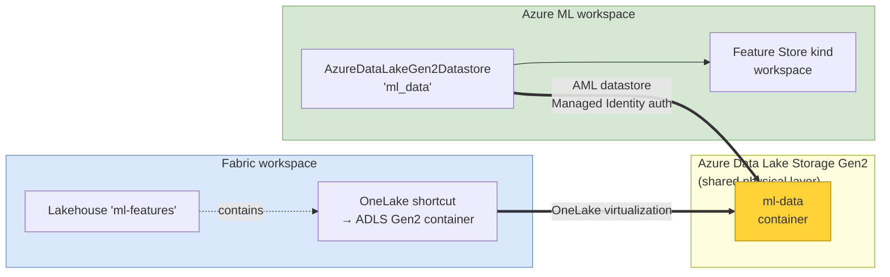
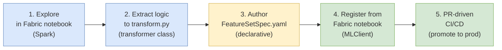
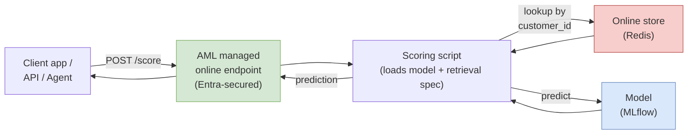

> **Audience.** Data architects, ML platform leads, data scientists and ML engineers who need a defensible operating model for running ML on top of Microsoft Fabric.
>
> **Reading order.** Part 1 builds the mental model from scratch (what is a feature, what is a feature store, why two products and not one). Part 2 is the deep dive: physical contract on ADLS Gen2, the two authoring paths, the end-to-end flow, governance, and the production checklist.

---

## Table of Contents

**Part 1 — Foundations**

1. [Executive summary](#1-executive-summary)
2. [What is a feature?](#2-what-is-a-feature)
3. [What is a feature store?](#3-what-is-a-feature-store)
4. [The fundamental insight: storage ≠ contract ≠ execution](#4-the-fundamental-insight-storage--contract--execution)
5. [Why Fabric and Azure ML are not redundant](#5-why-fabric-and-azure-ml-are-not-redundant)
6. [Who does what (Data Eng / DS / MLE / Platform)](#6-who-does-what-data-eng--ds--mle--platform)

**Part 2 — Industrialization**

7. [Reference architecture](#7-reference-architecture)
8. [The ADLS Gen2 + OneLake shortcut contract](#8-the-adls-gen2--onelake-shortcut-contract)
9. [Two authoring paths and how to choose](#9-two-authoring-paths-and-how-to-choose)
10. [End-to-end flow: from a Fabric notebook to production](#10-end-to-end-flow-from-a-fabric-notebook-to-production)
11. [Materialization: offline vs online stores](#11-materialization-offline-vs-online-stores)
12. [Training: feature retrieval spec and point-in-time joins](#12-training-feature-retrieval-spec-and-point-in-time-joins)
13. [Serving the model](#13-serving-the-model)
14. [Governance: identity, network, lineage, EU AI Act](#14-governance-identity-network-lineage-eu-ai-act)
15. [Decision matrix: feature store vs plain Delta table](#15-decision-matrix-feature-store-vs-plain-delta-table)
16. [Anti-patterns](#16-anti-patterns)
17. [Production checklist](#17-production-checklist)
18. [References](#18-references)

---

# Part 1 — Foundations

## 1. Executive summary

> **What you will learn**
>
> - The pattern Microsoft officially supports for combining Fabric and Azure ML.
> - Which capabilities are **GA** today and which are still **public preview**.
> - The 30-second mental model you can give to a steering committee.

Microsoft Fabric and Azure Machine Learning solve **different problems** and are designed to **share the same data, not duplicate it**.

- **Fabric** is the unified data platform: ingestion, Lakehouses, Warehouses, Power BI, notebooks, governance via OneLake, identity via Entra ID. It is where data engineers, data scientists and analysts live.
- **Azure Machine Learning** is the industrial ML control plane: feature store, model registry, training pipelines, managed online and batch endpoints, MLflow, monitoring, RBAC on ML assets.
- The **physical contract** between them is **Azure Data Lake Storage Gen2** (ADLS Gen2) — a single storage account that Fabric sees through a OneLake shortcut and Azure ML sees through a datastore. **Same bytes, two logical views, no copy.**

| Capability | Status (April 2026) | Implication |
|---|---|---|
| Microsoft Fabric (workspaces, OneLake, Lakehouse, Notebooks, Spark) | GA | Production-ready data platform. |
| Azure ML Managed Feature Store | GA | Production-ready for feature lifecycle. |
| Azure ML managed online & batch endpoints | GA | Production-ready for serving. |
| OneLake shortcut to ADLS Gen2 | GA | Production-ready zero-copy share. |
| **Fabric Data Factory pipeline activity calling an AML batch endpoint** | **Public preview** | Usable for non-critical batches; do not back external SLAs on it yet. |
| Azure Cache for Redis (online store) | Retirement announced | New designs should use **Azure Managed Redis**. |

**The 30-second narrative.**

> Data scientists work in Fabric, close to the governed data, and produce a feature table. The Azure ML Feature Store registers the *definition* of these features (`FeatureSetSpec.yaml` + transformation code), versions it, materializes it to ADLS Gen2 and serves it to training and inference jobs. The same physical ADLS Gen2 is mounted as a OneLake shortcut in Fabric and as an AML datastore in Azure ML. Predictions flow back to OneLake as Gold data products consumed by Power BI, applications and agents.

---

## 2. What is a feature?

> **What you will learn**
>
> - The minimum information a feature must carry to be usable in production ML.
> - Why a timestamp is not optional.
> - The difference between a column in a table and a feature ready for a model.

A **feature** is an input variable consumed by a machine learning model.

| Use case | Examples of features |
|---|---|
| Customer churn | `nb_transactions_7d`, `total_amount_30d`, `nb_complaints_90d` |
| Predictive maintenance | `vibration_avg_1h`, `temperature_max_24h`, `runtime_hours_total` |
| Pricing | `order_volume_12m`, `avg_margin_customer`, `price_volatility_30d` |
| Fraud detection | `nb_failed_logins_15min`, `geo_velocity_score`, `merchant_risk_score` |

A column in a Lakehouse table is **not** automatically a feature. To be production-grade, a feature must carry five attributes:

1. **An entity** — the business object the feature describes (customer, asset, product, site).
2. **An index key** — the identifier of that entity (`customer_id`, `asset_id`, `material_id`).
3. **A timestamp** — when the feature was *valid*. Without it, you cannot answer the question *"what did this customer's profile look like the day the model was scored?"* and you risk **data leakage** (training on data that did not yet exist at prediction time).
4. **A stable definition** — exactly how the value is computed (formula, window, source).
5. **A version** — because definitions evolve, and a model trained six months ago must keep using the version of features it was trained on.

**Concrete example of leakage.** A churn model uses `total_complaints_lifetime` as a feature. A customer churns on March 15. If `total_complaints_lifetime` is recomputed daily and stored without a timestamp, the training dataset will include complaints filed *after* March 15. The model will look brilliant in offline evaluation and collapse in production.

The ability to perform a **point-in-time join** — *"give me each feature as it was known at the observation timestamp"* — is one of the main reasons a feature store exists.

---

## 3. What is a feature store?

> **What you will learn**
>
> - The four functions a feature store performs.
> - The Azure ML object model (Feature Store, Entity, Feature Set, Feature Set Spec, retrieval spec).
> - Why a Lakehouse table is not a feature store.

A **feature store** is a system that manages the lifecycle of features used by machine learning models. It performs four functions that a plain table cannot:

1. **Catalog and govern** the definitions, owners, versions, lineage, sensitivity, access policy.
2. **Materialize** the values — pre-compute and persist features in a store optimized for either offline (training) or online (low-latency inference) access.
3. **Serve** features consistently to training and inference, guaranteeing **training/serving parity**.
4. **Reproduce** historical states — point-in-time joins for training, audit and EU AI Act traceability.

### The Azure ML object model

| Object | Role |
|---|---|
| **Feature Store** | A specialized Azure ML workspace that hosts the features. |
| **Entity** | The definition of a business key (customer, asset, product). Reused across feature sets. |
| **Feature Set** | A logical group of features computed together from one source by one transformation. |
| **Feature Set Spec** | The declarative definition: source, transformation code, index columns, timestamp column, output schema. |
| **Materialization** | The pre-computation of feature values on a schedule, written to the materialization store. |
| **Offline store** | ADLS Gen2 location for training and batch inference. |
| **Online store** | Low-latency key-value store (Redis-based) for real-time inference. |
| **Feature Retrieval Spec** | The list of features (by name + version) that a specific model uses. Packaged with the model artifact. |

A `FeatureSetSpec.yaml` looks like this:

```yaml
$schema: http://azureml/sdk-2-0/FeatureSetSpec.json
source:
  type: parquet
  path: abfss://ml-data@<storage>.dfs.core.windows.net/transactions/
  timestamp_column:
    name: event_ts
feature_transformation_code:
  path: ./transformation_code
  transformer_class: transform.CustomerFeatures
features:
  - name: avg_spend_30d
    type: float
  - name: nb_tx_30d
    type: integer
index_columns:
  - name: customer_id
    type: string
source_lookback:
  days: 30
```

This spec is **declarative**. The Feature Store does not just register a pointer to a table: it owns the *definition* and re-executes the transformation itself at materialization time. That's what guarantees offline/online parity and a complete audit trail — and that's what a Lakehouse Delta table alone cannot give you.

### A Lakehouse table is not a feature store

You can certainly write a Delta table called `customer_features_v1` in a Fabric Lakehouse and call it a feature table. For a one-off batch model with one consumer, that is fine. What you lose by not using a feature store:

- versioning of the *definition* (not just the data)
- packaged feature retrieval spec inscribed in the model
- managed point-in-time joins
- managed online store
- materialization scheduling and monitoring
- declared lineage between model version → feature set version → source data
- consistent training/serving guarantees

> **Rule of thumb.** A Delta table is acceptable for **one model, batch only, one team, no real-time, no audit obligation**. As soon as two of these conditions are violated, the cost of *not* having a feature store usually exceeds the cost of adopting one.

---

## 4. The fundamental insight: storage ≠ contract ≠ execution

> **What you will learn**
>
> - The three layers that connect Fabric to Azure ML.
> - Why thinking in those three layers prevents most architecture debates.
> - Where the "feature store" actually sits — and where it does not.

A common confusion is to think the feature store *is* the link between Fabric and Azure ML. It is not. The link is a **three-layer stack**:

| Layer | What it is | Concrete artifact |
|---|---|---|
| **Storage** | The shared physical layer where features actually live | ADLS Gen2 / OneLake / Delta |
| **Contract** | The declarative definition of features, entities, versions | `FeatureSetSpec.yaml` + `transform.py` |
| **Execution** | The runtime that materializes, trains, serves and monitors | Azure ML compute, endpoints, jobs |

The **feature store** is the **governance and serving layer on top of the contract** — not the physical storage. The physical storage is ADLS Gen2 (visible in Fabric via OneLake shortcut). The execution is Azure ML.

Once you internalize this split, several apparent paradoxes disappear:

- *"Why do we need both Fabric and Azure ML?"* → Fabric owns the **storage** and the human-facing data plane; Azure ML owns the **execution** plane for ML; the **contract** is shared between them.
- *"Can I work entirely from Fabric?"* → You can author and register feature sets from a Fabric notebook with the SDK, but the **execution** still happens in Azure ML.
- *"Can I work entirely from Azure ML?"* → Yes for industrialization, but you lose the productivity of being colocated with the governed data, the semantic models and Power BI.

---

## 5. Why Fabric and Azure ML are not redundant

> **What you will learn**
>
> - The honest list of what each product does well.
> - The asymmetry between the two work environments.
> - Why this asymmetry is a feature, not a bug.

| Concern | Fabric | Azure ML |
|---|---|---|
| Ingestion, ETL, Lakehouse, Warehouse | **Native** | Limited |
| Notebooks for human exploration | **Native (Spark, Python)** | Studio notebooks exist but are SDK-first |
| Governance of business data (Purview, sensitivity labels, OneLake security) | **Native** | Inherits via shared storage |
| Power BI integration | **Native** | None |
| Direct access by data analysts | **Native** | None |
| Feature store with versioning, materialization, retrieval spec | None | **Native (GA)** |
| Model registry with MLflow | Limited (Fabric Data Science) | **Native, with stages, signatures** |
| Managed compute clusters with quotas | Limited | **Native** |
| Managed online endpoints with autoscaling, blue/green | None | **Native** |
| Managed batch endpoints | None | **Native** |
| Production model monitoring (drift, perf) | Limited | **Native** |
| CI/CD with `az ml` and `azure-ai-ml` SDK | Some | **Native** |

The two environments are also **asymmetric in how humans use them**:

- **Fabric is interactive.** Data scientists and analysts open it in a browser, click, write notebooks, share Power BI reports.
- **Azure ML is mostly headless.** ML engineers manipulate it through SDK, YAML, CLI and CI/CD pipelines. The Azure ML Studio UI is useful for exploration, debugging and inspecting runs, but the system is designed to be driven by code.

This asymmetry is healthy. A data scientist should not have to learn Azure DevOps pipelines to publish a feature; an ML engineer should not have to learn Power BI to ship a model. The shared ADLS Gen2 is the seam.

---

## 6. Who does what (Data Eng / DS / MLE / Platform)

> **What you will learn**
>
> - The four roles involved and what each owns.
> - A RACI table that survives a steering committee review.
> - The specific handoffs that fail in practice if you don't name them.

Four roles cooperate around the Fabric ↔ Azure ML pattern:

- **Data Engineering** — owns the ingestion and the Gold data products in Fabric.
- **Data Scientist (DS)** — works in Fabric, explores data, prototypes features and models.
- **ML Engineer (MLE)** — works in Azure ML, owns industrialization, deployment, monitoring.
- **Platform team** — owns the cloud foundation: ADLS Gen2 account, networking, RBAC, Key Vault, Purview wiring.

### RACI table

R = Responsible · A = Accountable · C = Consulted · I = Informed

| Activity | Data Eng | DS | MLE | Platform |
|---|---|---|---|---|
| Source ingestion → Bronze/Silver/Gold | **R/A** | I | I | C |
| Curated Gold data products in OneLake | **R/A** | C | I | C |
| Feature exploration in a Fabric notebook | I | **R/A** | C | I |
| Drafting `FeatureSetSpec.yaml` + `transform.py` | I | **R** | **A** | I |
| PR review of the feature spec | I | C | **R/A** | C |
| Registering the FeatureSet in Azure ML | I | R (via SDK) | **A** | I |
| Materialization schedule, compute, monitoring | I | I | **R/A** | C |
| Training pipeline definition | I | C | **R/A** | I |
| Model registration, stages, signatures | I | I | **R/A** | I |
| Online endpoint deployment + scaling | I | I | **R/A** | C |
| Batch endpoint deployment | I | I | **R/A** | C |
| Drift and performance monitoring | I | C | **R/A** | C |
| Calling AML batch endpoints from Fabric pipelines | C | I | C | C / **R** depending on org |
| Republishing predictions to OneLake Gold | C | I | **R** | I |
| ADLS Gen2 account, private endpoints, CMK | I | I | C | **R/A** |
| RBAC on workspaces, Managed Identities | I | I | C | **R/A** |
| Purview lineage wiring | I | I | C | **R/A** |

### Handoffs that fail in practice if not named

1. **Who owns the source data quality?** The MLE assumes the DS validated the Gold table; the DS assumes Data Engineering certified it. Name an owner per Gold data product.
2. **Who promotes features Dev → Staging → Prod?** Use a PR gate: the DS opens the PR, the MLE approves and merges. Document the SLA.
3. **Who pays the materialization compute?** Default to the AML workspace cost center; chargeback only if scale demands it.
4. **Who decides the online store sizing?** MLE proposes, Platform validates; never let the MLE provision a high-tier Redis without architecture review.

---

# Part 2 — Industrialization

## 7. Reference architecture

> **What you will learn**
>
> - The four planes you need to draw on every architecture review.
> - Where identity, network, lineage and observability cross those planes.
> - What "zero-copy" actually means in this design.

{ width=100% }

The diagram has four horizontal planes plus two cross-cutting columns:

- **Plane 1 — Sources & Data Platform (Fabric).** Lakehouses, Warehouses and the Gold data products, governed by Fabric workspace roles, OneLake security and Purview.
- **Plane 2 — Authoring.** Two co-equal entry points: the **Fabric notebook** (for the DS, with the `azure-ai-ml` and `azureml-featurestore` SDKs installed) and **Azure ML Studio / VS Code + CLI YAML** (for the MLE). Both write to the same Git repo and the same ADLS Gen2.
- **Plane 3 — Shared physical layer (ADLS Gen2).** Single storage account. **OneLake shortcut** on the Fabric side, **AzureDataLakeGen2Datastore** on the Azure ML side. This is the only place feature bytes physically live.
- **Plane 4 — Azure ML execution plane.** The Feature Store (a kind of AML workspace) with its registered Entities and Feature Sets; training pipelines and the model registry; managed online endpoints; managed batch endpoints. Predictions are written back to the same ADLS Gen2 and re-surface in Fabric via the shortcut.
- **Cross-cutting — Identity & Network.** Entra ID for Fabric users, Managed Identity for AML compute and endpoints, private endpoints on ADLS Gen2 and the AML workspace, Trusted Workspace Access for Fabric → ADLS egress.
- **Cross-cutting — Governance & Observability.** Purview for unified lineage, Key Vault for secrets and CMKs, Application Insights and Azure Monitor for runtime telemetry.

The two arrows that matter most are:

1. The **register-spec arrow** from the Fabric notebook to the AML Feature Store: the `FeatureSetSpec.yaml` and the `transform.py` are pushed to AML by the DS; AML stores them as immutable versioned artifacts.
2. The **materialize arrow** from AML Feature Store back to ADLS Gen2: AML re-executes the transformation on its own compute and writes the materialized features as parquet partitioned by index keys + timestamp.

---

## 8. The ADLS Gen2 + OneLake shortcut contract

> **What you will learn**
>
> - The exact integration pattern Microsoft documents and supports today.
> - The literal Microsoft quote you can use in an architecture review to settle debates.
> - How to wire the shortcut on the Fabric side and the datastore on the Azure ML side.

The single most important sentence in the entire Microsoft documentation set on this topic comes from `how-to-use-batch-fabric`:

> *"Azure Machine Learning can't directly access data stored in Fabric OneLake, but you can configure a OneLake shortcut and an Azure Machine Learning datastore to both access the same Azure Data Lake storage account."*
>
> — Microsoft Learn, [Use Microsoft Fabric to access models deployed to Azure Machine Learning batch endpoints](https://learn.microsoft.com/en-us/azure/machine-learning/how-to-use-batch-fabric?view=azureml-api-2)

Read it twice. It rules out the tempting but unsupported pattern of giving Azure ML a direct connector to OneLake, and it prescribes the supported pattern: a **dedicated ADLS Gen2 account** seen in parallel by the two products.



### Provisioning, in order

1. **Platform team** creates the ADLS Gen2 account (`hierarchical namespace = enabled`), one container per environment (`ml-data-dev`, `ml-data-prod`), enables soft delete and blob versioning, and enforces **CMK** via Key Vault.
2. **Platform team** enables **private endpoints** on the storage account and on the AML workspace; opens **Trusted Workspace Access** for Fabric egress to the storage account.
3. **Platform team** assigns the **Managed Identity of the AML workspace** the role `Storage Blob Data Contributor` on the container.
4. **Platform team** creates the **Lakehouse** in the Fabric ML workspace and creates the **OneLake shortcut** to the ADLS Gen2 container — once, for all DS users.
5. **Platform team** registers the **AzureDataLakeGen2Datastore** in the AML workspace using `ManagedIdentityConfiguration` (no account key, no SAS token).

```python
# AML side — datastore registration with Managed Identity
from azure.ai.ml.entities import AzureDataLakeGen2Datastore, ManagedIdentityConfiguration

datastore = AzureDataLakeGen2Datastore(
    name="ml_data",
    description="Shared ADLS Gen2 between Fabric and Azure ML",
    account_name="contosomldata",
    filesystem="ml-data",
    credentials=ManagedIdentityConfiguration(),
)
ml_client.datastores.create_or_update(datastore)
```

After this is done, the DS in Fabric sees a folder under `Files/` of the Lakehouse and reads/writes Delta tables on it as if it were native OneLake. The MLE in Azure ML reads the same bytes through the datastore. Neither side ever copies the data.

### What "zero-copy" actually means

The same physical bytes are addressable through two different logical paths:

- Fabric: `/lakehouse/default/Files/ml_features/customer_features_v3/...`
- Azure ML: `azureml://datastores/ml_data/paths/customer_features_v3/...`

There is no replication, no synchronization job, no eventual consistency. The reads on the AML side and on the Fabric side hit the same Delta files. This is the whole point.

What is **not** zero-copy:

- The materialized output of the Azure ML Feature Store is a *new* set of parquet files (partitioned by `index_columns` + `timestamp_column`) written to its own folder on the same ADLS Gen2. It is derived from the source feature tables — by design, because materialization is what guarantees training/serving parity.
- The online store (Redis) holds a separate copy optimized for sub-millisecond lookup. Cost and TTL of this copy are deliberate.

---

## 9. Two authoring paths and how to choose

> **What you will learn**
>
> - The two supported ways to register feature sets, with code on each side.
> - When to pick which path, based on team profile and feature complexity.
> - Why offering both is more pragmatic than enforcing one.

There are two officially supported entry points to register a feature set. They produce **identical artifacts in Azure ML** and they consume **identical infrastructure**. The difference is only the human who drives them.

### Path A — From a Fabric notebook (DS-driven, SDK)

The DS stays in Fabric. After installing `azure-ai-ml` and `azureml-featurestore` in the Fabric Spark environment, they can register a feature set directly from their notebook.

```python
%pip install azure-ai-ml azureml-featurestore

from azure.ai.ml import MLClient
from azure.ai.ml.entities import FeatureSet
from azure.identity import DefaultAzureCredential

ml_client = MLClient(
    DefaultAzureCredential(),
    subscription_id="<sub>",
    resource_group_name="contoso-ml-rg",
    workspace_name="contoso-feature-store",
)

ml_client.feature_sets.create_or_update(
    FeatureSet(
        name="customer_features",
        version="3",
        specification={"path": "./feature_sets/customer_features"},
        entities=["azureml:customer:1"],
        stage="Development",
    )
)
```

**Pros**
- DS productivity is preserved: same tool, same data, same identity.
- No context switch between Fabric and Azure ML Studio.
- The DS owns the spec; the spec is co-authored with the exploration code in the same notebook.

**Cons**
- Requires the DS to install Python packages in the Fabric environment (use **environments** rather than `%pip install` for stability across sessions).
- Requires the DS Entra identity to have Azure ML RBAC (`AzureML Data Scientist` role on the Feature Store workspace, at minimum).
- Network reachability from Fabric Spark to the AML control plane must be open (or routed via private endpoints if the AML workspace is private).

### Path B — From Azure ML Studio / VS Code + CLI YAML (MLE-driven)

The MLE works from Azure ML Studio (UI) or VS Code with the Azure ML extension. They author the same `FeatureSetSpec.yaml` and `transform.py` and register the feature set with `az ml feature-set create` or the SDK.

```bash
az ml feature-set create \
  --name customer_features \
  --version 3 \
  --feature-store-name contoso-feature-store \
  --resource-group contoso-ml-rg \
  --spec-path ./feature_sets/customer_features
```

**Pros**
- All-in-one inside Azure ML; native to CI/CD.
- Best for MLE-led teams or first-time onboarding (the Studio UI guides through the spec).
- Independent of Fabric environment management.

**Cons**
- The MLE is one step removed from the source data exploration; risk of the spec drifting from the actual data semantics.
- Requires either the source data to be visible to AML (via the same ADLS Gen2 datastore) or a separate exploration loop.

### Decision criteria

| Criterion | Lean Path A (Fabric notebook + SDK) | Lean Path B (Azure ML Studio/CLI) |
|---|---|---|
| Feature requires interactive Spark exploration on Lakehouse data | **Yes** | |
| Feature is essentially "wrap an existing Delta table" | | **Yes** |
| Team profile is mostly DS, less MLE | **Yes** | |
| Team profile is mostly MLE, automation-first | | **Yes** |
| First feature set, onboarding the team | | **Yes** (UI guidance) |
| 50+ feature sets, automated PR-driven publishing | **Yes** (notebooks templated) | **Yes** (CLI in CI) |
| Fabric workspace has restricted egress and AML packages are not pre-approved | | **Yes** |
| DS already proficient with Azure ML SDK | **Yes** | **Yes** |
| Feature transformation is complex (windows, multi-source joins) | **Yes** | (possible but heavier) |
| Feature is a simple aggregation on one table | | **Yes** |

**Recommendation.** Do not enforce a single path. Templated notebooks for Path A and templated YAML for Path B should both be available in your platform repo. The OneLake shortcut on Fabric and the AML datastore on Azure ML guarantee that **the underlying artifacts are identical** regardless of who authored them. Letting users choose preserves productivity without compromising the contract.

---

## 10. End-to-end flow: from a Fabric notebook to production

> **What you will learn**
>
> - The five concrete steps that take a feature from idea to production.
> - The exact code at each step (Path A; Path B is a YAML mirror of the same artifacts).
> - The PR gate that converts an exploration notebook into a governed feature.

The flow below is the canonical Path A version. Path B is the same artifacts authored from the AML side; the steps after step 4 are identical.



### Step 1 — Interactive exploration in a Fabric notebook

```python
# Fabric notebook — native Spark
customers = spark.read.table("DataPlatform.customers")
transactions = spark.read.table("DataPlatform.transactions")

from pyspark.sql import functions as F
from pyspark.sql.window import Window

window_30d = (Window
    .partitionBy("customer_id")
    .orderBy("event_ts")
    .rangeBetween(-30 * 86400, 0))

features = (transactions
    .withColumn("avg_spend_30d", F.avg("amount").over(window_30d))
    .withColumn("nb_tx_30d",     F.count("*").over(window_30d))
    .join(customers, "customer_id"))

features.display()
```

### Step 2 — Extract the logic into a transformer class

The goal is to make the transformation **callable by the Feature Store** at materialization time. The contract is a class with a `_transform(df)` method.

```python
# feature_sets/customer_features/transformation_code/transform.py
from pyspark.sql import functions as F
from pyspark.sql.window import Window

class CustomerFeatures:
    def _transform(self, df):
        w = (Window
            .partitionBy("customer_id")
            .orderBy("event_ts")
            .rangeBetween(-30 * 86400, 0))
        return (df
            .withColumn("avg_spend_30d", F.avg("amount").over(w))
            .withColumn("nb_tx_30d",     F.count("*").over(w)))
```

### Step 3 — Author the FeatureSetSpec

```yaml
# feature_sets/customer_features/FeatureSetSpec.yaml
$schema: http://azureml/sdk-2-0/FeatureSetSpec.json
source:
  type: parquet
  path: abfss://ml-data@contosomldata.dfs.core.windows.net/transactions/
  timestamp_column:
    name: event_ts
feature_transformation_code:
  path: ./transformation_code
  transformer_class: transform.CustomerFeatures
features:
  - name: avg_spend_30d
    type: float
  - name: nb_tx_30d
    type: integer
index_columns:
  - name: customer_id
    type: string
source_lookback:
  days: 30
```

The `source.path` points to the **ADLS Gen2** path — the same physical bytes the Fabric DS sees through the OneLake shortcut. Use a config variable, not a hard-coded URL.

### Step 4 — Register from the Fabric notebook

```python
from azure.ai.ml import MLClient
from azure.ai.ml.entities import FeatureSet
from azure.identity import DefaultAzureCredential

ml_client = MLClient(
    DefaultAzureCredential(),
    subscription_id="<sub>",
    resource_group_name="contoso-ml-rg",
    workspace_name="contoso-feature-store",
)

ml_client.feature_sets.create_or_update(
    FeatureSet(
        name="customer_features",
        version="3",
        specification={"path": "./feature_sets/customer_features"},
        entities=["azureml:customer:1"],
        stage="Development",
    )
)
```

At this point the spec and the transformation code are versioned and **immutable** in the AML Feature Store. Any subsequent change requires a new version (`v4`, `v5`…). This is what guarantees that `model_v12` trained on `customer_features:3` today will still get the same features in six months.

### Step 5 — PR-driven CI/CD promotion

The DS does not push to production directly. The flow is:

1. The DS commits the spec + transformation code to the Git repo.
2. The DS opens a **Pull Request**.
3. The CI pipeline runs `az ml feature-set validate` and unit tests on `transform.py`.
4. The MLE reviews and approves.
5. On merge to `main`, the CD pipeline runs `az ml feature-set create --stage Staging`, then on tag release `--stage Production`.

```yaml
# .github/workflows/feature-set-promote.yml (excerpt)
name: feature-set promote
on:
  pull_request:
    paths: ['feature_sets/**']
jobs:
  validate:
    steps:
      - uses: actions/checkout@v4
      - uses: azure/login@v2
        with:
          client-id: ${{ secrets.AZURE_CLIENT_ID }}
          tenant-id: ${{ secrets.AZURE_TENANT_ID }}
          subscription-id: ${{ secrets.AZURE_SUBSCRIPTION_ID }}
      - name: Install az ml
        run: az extension add -n ml -y
      - name: Validate spec
        run: az ml feature-set validate --spec-path feature_sets/customer_features
      - name: Unit test transformer
        run: pytest feature_sets/customer_features/tests
```

---

## 11. Materialization: offline vs online stores

> **What you will learn**
>
> - The difference between offline and online stores and when each is needed.
> - How materialization scheduling works and what it costs.
> - The current Microsoft guidance on the online store technology choice.

A registered FeatureSet is just a *definition* until it is **materialized**. Materialization is the act of running the `transform.py` against the source data on a schedule and writing the output to a store optimized for fast reads.

| Store | Where | What it serves | Latency profile |
|---|---|---|---|
| **Offline store** | ADLS Gen2 (parquet partitioned by index + timestamp) | Training, batch inference, exploration, backfills | Seconds (Spark scan) |
| **Online store** | Redis-based key-value store | Real-time inference (one entity at a time) | Sub-millisecond |

### Offline store

Configured at the Feature Store workspace level: `materialization_store: <ADLS Gen2 path>`. The Feature Store writes parquet files partitioned by `index_columns` and `timestamp_column`. Time-travel queries (point-in-time joins) are served from this layout.

Materialization can be triggered:

- **On-demand** — `ml_client.feature_sets.begin_materialize(...)` for backfills.
- **On a schedule** — daily, hourly, or any cron expression. AML provisions a managed Spark compute cluster transiently for each run.

Cost levers for the offline store:

- **Materialization frequency** — every minute will be expensive; align with the freshness the model actually needs.
- **Compute size** — start small (`Standard_E4s_v3` × 2) and scale only when materialization SLA misses.
- **Source lookback window** (`source_lookback.days` in the spec) — how far back to read each run. Set it to the rolling window you actually need.

### Online store

Configured at the Feature Store workspace level: `online_store: <Redis cache resource ID>`. Microsoft's current guidance for new architectures is **Azure Managed Redis** rather than Azure Cache for Redis (which has had a retirement announcement). Validate the exact Azure Managed Redis tier supported by your AML region before committing.

Online materialization is enabled per feature set via `materialization_settings` and runs on the same schedule as the offline materialization (or a separate one, if the freshness requirements differ).

When to enable the online store:

- The model is served via a synchronous online endpoint.
- The end-to-end latency budget is below ~500 ms.
- The lookup is by primary key (`customer_id = 123`) and you cannot afford a Spark scan per request.

When **not** to enable it:

- Batch-only models. The online store will sit there empty and bill you.
- Models scoring ≤ a few requests per minute. A direct read of the materialized parquet from a small compute will be cheaper.

---

## 12. Training: feature retrieval spec and point-in-time joins

> **What you will learn**
>
> - How to consume registered features in a training job.
> - What the `feature_retrieval_spec.yaml` is and why it ships with the model.
> - The single concept that prevents most training/serving mistakes: the point-in-time join.

A training job does not consume features by their physical path. It consumes them through a **Feature Retrieval Spec**, which lists the features (by name + version) that the model uses.

```python
# Training side — generate the retrieval spec from the registered features
from azureml.featurestore import FeatureStoreClient, get_feature_set
from azure.identity import AzureMLOnBehalfOfCredential

featurestore = FeatureStoreClient(
    credential=AzureMLOnBehalfOfCredential(),
    subscription_id="<sub>",
    resource_group_name="contoso-ml-rg",
    name="contoso-feature-store",
)

customer_features = featurestore.feature_sets.get(
    name="customer_features", version="3"
)

features = [
    customer_features.get_feature("avg_spend_30d"),
    customer_features.get_feature("nb_tx_30d"),
]

# This generates feature_retrieval_spec.yaml inside the model artifact
featurestore.generate_feature_retrieval_spec(
    path="./model_artifact",
    features=features,
)
```

The retrieval spec is then **packaged with the model**. When the model is later loaded by an online endpoint or a batch job, the scoring code uses the retrieval spec to fetch features without re-implementing any feature logic. This is what guarantees that the same value of `avg_spend_30d` is used at training time and at serving time.

### Point-in-time joins

The killer feature of a feature store is the **point-in-time join**. You provide an *observations* table:

```
customer_id | observation_time | label
1001        | 2026-03-12 14:00 | 1
1002        | 2026-03-13 09:00 | 0
...
```

You ask the feature store: *"give me the values of `avg_spend_30d` and `nb_tx_30d` as they were at `observation_time` for each row"*. The store returns the right values, never values from the future.

```python
training_df = featurestore.get_offline_features(
    features=features,
    observation_data=observations_spark_df,
    timestamp_column="observation_time",
)
```

Without point-in-time joins, you write that logic by hand and you eventually get it wrong. That is the single most common cause of *"the model worked great offline and collapsed in production"*.

---

## 13. Serving the model

> **What you will learn**
>
> - The three serving modes and which one to use when.
> - The official Microsoft pattern for calling a batch endpoint from a Fabric pipeline (Preview).
> - The decision tree for placing the orchestration in Fabric vs Azure ML.

Three serving modes are available, and they are not interchangeable.

### 13.1. Online inference (Azure ML managed online endpoint)



- The client never calls the feature store directly. It calls the AML endpoint with the entity key.
- The scoring script uses the **feature retrieval spec packaged with the model** to look up features in the online store.
- Authentication: Entra ID (recommended) or key-based auth.
- Autoscaling, blue/green, canary and traffic split are managed by AML.

### 13.2. Batch inference from Azure ML

When the orchestration logic naturally lives in the ML world (re-training pipelines, offline scoring jobs triggered by `az ml job create`), use a **managed batch endpoint** with a **feature retrieval component** that runs the point-in-time join from the offline store.

```python
# Batch inference job — feature retrieval is a built-in AML component
from azure.ai.ml import command, Input, Output

job = command(
    code="./score",
    command="python score.py --features ${{inputs.features}}",
    environment="azureml://registries/azureml/environments/sklearn-1.5/versions/1",
    compute="cpu-cluster",
    inputs={
        "features": Input(
            type="uri_folder",
            path="azureml://datastores/ml_data/paths/customer_features_v3/",
        ),
    },
    outputs={
        "scores": Output(
            type="uri_folder",
            path="azureml://datastores/ml_data/paths/predictions/",
        ),
    },
)
```

Outputs land back on the shared ADLS Gen2 → reappear in the Fabric Lakehouse via the OneLake shortcut → are consumed by Power BI, downstream pipelines and applications.

### 13.3. Batch inference triggered from a Fabric pipeline (Public preview)

When the orchestration naturally lives in the data world (a Fabric Data Factory pipeline that triggers scoring at the end of a daily ETL), use the built-in **Azure Machine Learning** activity in the Fabric pipeline.

> **Status — Public preview.** The Fabric Data Factory **Azure Machine Learning** activity is currently in public preview. It does **not** carry a service-level agreement and is not recommended for production workloads that need guaranteed availability. (Source: Microsoft Learn — `how-to-use-batch-fabric`.) Plan accordingly: use it for non-critical batches, monitor its behavior, and have a fallback orchestrator (Azure ML pipeline triggered by Azure Data Factory or AML schedule) for production-grade SLAs.

```mermaid
flowchart LR
    SCH["Fabric pipeline<br/>schedule"] --> PIPE["Fabric Data Factory<br/>pipeline"]
    PIPE --> ACT["Azure Machine Learning<br/>activity (Preview)"]
    ACT -->|"OAuth or SP"| EP["AML batch endpoint"]
    EP --> COMP["Batch compute<br/>cluster"]
    COMP -->|"read inputs"| ADLS[("ADLS Gen2<br/>(shared)")]
    COMP -->|"write predictions.csv"| ADLS
    ADLS -->|"OneLake shortcut"| LH["Fabric Lakehouse<br/>'predictions'"]
    LH --> PBI["Power BI report"]
    style ACT fill:#fff2cc,stroke:#d6b656
    style EP fill:#d5e8d4,stroke:#82b366
    style ADLS fill:#ffd335,stroke:#a88b00
```



Per Microsoft Learn, the activity:

- Connects to the AML workspace via **Organizational account** (interactive OAuth) or **Service Principal** (recommended for production).
- Calls the **default deployment** of the chosen batch endpoint, unless a specific deployment is selected.
- Accepts inputs as `JobInputType=UriFolder` (or `UriFile`, or `Literal`) with the data path in `azureml://datastores/<name>/paths/...` form.
- Requires outputs to point at a **datastore path** (not an arbitrary Lakehouse path) — `@concat('azureml://datastores/trusted_blob/paths/endpoints/', pipeline().RunId, '/predictions.csv')`.
- Supports both AML **model deployments** and AML **pipeline deployments**.

The output predictions land on ADLS Gen2 → become visible in Fabric via the OneLake shortcut → consumed by Power BI.

### Decision tree for placing the orchestration

```mermaid
flowchart TD
    Q1{"Is the trigger<br/>a data event<br/>(end of ETL,<br/>new file)?"}
    Q1 -->|Yes| Q2{"Is the SLA<br/>strict and external<br/>(customer-facing)?"}
    Q1 -->|No, it's a model event<br/>(re-training, drift)| AML["Orchestrate in Azure ML<br/>(pipeline + schedule)"]
    Q2 -->|Yes| AML2["Orchestrate in AML<br/>triggered by ADF / schedule<br/>(GA, supported SLA)"]
    Q2 -->|No| FAB["Fabric Data Factory pipeline<br/>+ AML batch endpoint activity<br/>(Preview, no SLA)"]
    style FAB fill:#fff2cc,stroke:#d6b656
    style AML fill:#d5e8d4,stroke:#82b366
    style AML2 fill:#d5e8d4,stroke:#82b366
```

---

## 14. Governance: identity, network, lineage, EU AI Act

> **What you will learn**
>
> - The minimum security posture required for production.
> - How identity flows across the two products without service-principal sprawl.
> - How Purview unifies lineage between the data and ML worlds.

### 14.1. Identity

| Surface | Identity | Authority |
|---|---|---|
| Fabric users (DS, analysts) | **Entra ID user** | Fabric workspace role + OneLake security |
| Fabric notebook calling Azure ML | **Entra ID user** (interactive) or workspace identity | Azure ML RBAC |
| Azure ML compute clusters | **System-assigned Managed Identity** of the AML workspace | Storage, Key Vault, ACR roles |
| Azure ML online & batch endpoints | **System-assigned Managed Identity** of the endpoint | Storage, Key Vault, online store roles |
| Azure ML datastore for ADLS Gen2 | **Managed Identity** (`ManagedIdentityConfiguration`) | `Storage Blob Data Contributor` on container |
| CI/CD pipelines | **Workload identity** federation (GitHub OIDC → Entra) | Azure ML, ADLS Gen2, Key Vault |

**Rules:**

- No service principal with a stored secret unless absolutely required.
- No account key on the storage account.
- No SAS token in notebooks.
- Conditional Access enforced on all human identities accessing Fabric and Azure ML.

### 14.2. Network

| Component | Posture |
|---|---|
| ADLS Gen2 | Private endpoint mandatory; public network access disabled. |
| Azure ML workspace | Private endpoint mandatory for production; managed virtual network if using Studio compute. |
| Online store (Managed Redis) | Private endpoint; restricted to AML endpoint subnet. |
| Fabric workspace egress to ADLS Gen2 | **Trusted Workspace Access** on the storage account, scoped to the Fabric workspace. |
| Cross-tenant access | Disabled by default; audited if enabled. |

### 14.3. Encryption and key management

- **CMK** on ADLS Gen2 via Key Vault.
- **CMK** on the AML workspace via Key Vault (one-time setup at workspace creation).
- Soft delete enabled on the ADLS Gen2 container; blob versioning enabled.
- Key Vault access policies replaced by **RBAC** (`Key Vault Secrets User`, `Key Vault Crypto Service Encryption User`).

### 14.4. RBAC summary

| Principal | ADLS Gen2 container | Fabric ML workspace | AML workspace | Feature Store workspace |
|---|---|---|---|---|
| DS | (via Fabric workspace) | Contributor | AzureML Data Scientist | Reader |
| MLE | Reader (debug) | Reader | Contributor | AzureML Data Scientist |
| Platform team | Owner | Admin | Owner | Owner |
| AML workspace MI | Storage Blob Data Contributor | n/a | n/a | n/a |
| Endpoint MI | Storage Blob Data Reader | n/a | n/a | (read features) |
| CI/CD identity | Storage Blob Data Contributor | (deploy artifacts) | Contributor | Contributor |

### 14.5. Lineage and audit

- **Fabric** records the production of each feature table: which notebook, which user, which source business tables.
- **Azure ML** records the consumption: which `FeatureSet:version` is read by which training run (MLflow), which model artifact is registered, which endpoint serves which version.
- **Microsoft Purview** ingests both lineage feeds and produces a unified graph: business data → feature → model → prediction → consumer.
- **Sensitivity labels** on Fabric items (Lakehouse, table, column) propagate to the underlying ADLS Gen2 objects and inherit on AML datasets.

This unified lineage is what makes the design defensible under the **EU AI Act**: for any prediction served, you can answer *"which model version, trained on which feature versions, computed from which source data, owned by which team, governed by which policy"*.

### 14.6. Reproducibility

- FeatureSets are immutable per version. A new transformation requires a new version.
- Models in the AML registry are signed and embed their `feature_retrieval_spec.yaml`.
- Point-in-time joins from the offline store let you regenerate an exact training dataset months later.
- Source data on ADLS Gen2 has soft delete and blob versioning enabled.

---

## 15. Decision matrix: feature store vs plain Delta table

> **What you will learn**
>
> - A concrete checklist to decide whether the cost of a feature store is justified.
> - The five conditions that, in combination, tip the balance.
> - The honest answer for small teams and one-off models.

A feature store is not a dogma. For a single batch model with 15 simple columns and one consumer, a well-governed Delta table in a Fabric Lakehouse is enough. For an industrial AI platform with multiple models, real-time serving, and audit obligations, the feature store earns its keep.

Use a feature store when **at least two of the following** apply:

| Condition | Why it matters |
|---|---|
| Two or more models reuse the same variables | Avoid divergent recomputations and parallel definitions. |
| The model is served in real time or near real time | Online lookup by key, sub-second SLA. |
| You need to avoid training/serving skew | The store guarantees parity by re-executing the same transformation. |
| You need point-in-time joins for training | Avoid leakage; reproduce any historical training set. |
| Multiple teams produce or consume features | A catalog and ownership model become necessary. |
| You have audit obligations (EU AI Act, internal model risk) | Lineage, versioning, signed models. |

Stay on a Delta table when **none of the above apply** and you have:

- A one-shot batch model.
- A single owner team.
- No external SLA, no audit obligation.
- Simple feature logic (one source, one aggregation).

A pragmatic rule: start with Delta tables, refactor into a feature store when the second model reuses a feature.

---

## 16. Anti-patterns

> **What you will learn**
>
> - Recurring failure modes seen in enterprise programs.
> - Why each one looks attractive at first and bites later.

| Anti-pattern | Why it is tempting | Why it bites |
|---|---|---|
| *"We don't need a feature store, our Lakehouse table is enough"* (for a real-time multi-model platform) | Lower upfront effort. | No retrieval spec, no point-in-time join, no online serving, no lineage. |
| Computing features one way for training and another way for serving | Two different teams, two different stacks. | Training/serving skew. The model collapses in production. |
| Storing features in both Fabric and Azure ML separately, with sync jobs | Each side keeps its tooling. | Two truths, one will drift. Eventually nobody knows which is canonical. |
| Trying to make Azure ML read OneLake directly | Sounds elegant. | Not supported by Microsoft. Use the ADLS Gen2 + shortcut pattern. |
| Account keys / SAS tokens in notebooks | Quick to make things work. | Security review will block production. |
| Service principal with a long-lived secret in CI/CD | Familiar pattern. | Use **workload identity federation** (GitHub OIDC → Entra) instead. |
| No timestamp column on a feature table | Saves a column. | Leakage. Audit failure. |
| Mutating a feature's definition in place without bumping the version | "It's a small change." | Breaks reproducibility for every model trained on the prior version. |
| Materializing every feature set every minute | "Freshness can't hurt." | Compute bill explodes. Align frequency with the model's actual freshness need. |
| Enabling the online store for a batch-only model | "We might need it later." | Pays Redis 24/7 for nothing. Enable on demand. |
| Direct DS push to production without a PR gate | Faster iteration. | No review, no audit, regulatory exposure. |
| Backing an external production SLA on the Fabric → AML batch endpoint activity (Preview) | Convenient orchestration. | Preview features carry no SLA. Use AML pipelines for SLA-bound batches. |

---

## 17. Production checklist

> **What you will learn**
>
> - A condensed checklist to validate before going live.
> - The minimum operational evidence to gather per feature set and per model.

**Storage (ADLS Gen2)**

- [ ] Hierarchical namespace enabled.
- [ ] Private endpoint enabled, public access disabled.
- [ ] CMK via Key Vault enabled.
- [ ] Soft delete and blob versioning enabled.
- [ ] Trusted Workspace Access configured for the Fabric ML workspace.
- [ ] Managed Identity of the AML workspace has `Storage Blob Data Contributor` on the container.

**Fabric workspace**

- [ ] Lakehouse created with the OneLake shortcut to the ADLS Gen2 container.
- [ ] Workspace roles assigned (DS = Contributor, MLE = Reader, Platform = Admin).
- [ ] Sensitivity labels applied to source Gold tables.
- [ ] Network egress to ADLS Gen2 limited to the Trusted Workspace Access path.

**Azure ML workspace + Feature Store workspace**

- [ ] Both workspaces deployed with private endpoints and CMK.
- [ ] AzureDataLakeGen2Datastore registered with `ManagedIdentityConfiguration`.
- [ ] Feature Store workspace configured with `materialization_store` (offline) and, if needed, `online_store` (Managed Redis).
- [ ] At least one Entity registered (`customer`, `asset`, …).
- [ ] At least one FeatureSet registered with stage = Production.

**Per FeatureSet**

- [ ] `FeatureSetSpec.yaml` includes `timestamp_column` and `index_columns`.
- [ ] `transform.py` is unit tested.
- [ ] Source path is parameterized per environment (Dev/Staging/Prod).
- [ ] Materialization schedule defined and aligned with model freshness needs.
- [ ] Materialization runs are monitored (Azure Monitor alerts on failure).

**Per model**

- [ ] `feature_retrieval_spec.yaml` packaged inside the model artifact.
- [ ] Model registered with stage transitions in the AML model registry.
- [ ] Online endpoint (if applicable) deployed with Managed Identity, blue/green or canary configured.
- [ ] Drift monitoring (data + performance) enabled with alerts.
- [ ] Predictions written to ADLS Gen2 path that is exposed to Fabric via the shortcut.

**Identity and CI/CD**

- [ ] No service principal with stored secret in CI/CD; workload identity federation configured.
- [ ] PR gates enforced on `feature_sets/**` and `pipelines/**`.
- [ ] CI runs `az ml feature-set validate` and unit tests on every PR.
- [ ] CD promotes Dev → Staging → Production by environment, not by long-lived secrets.

**Governance and audit**

- [ ] Purview ingests both Fabric and Azure ML lineage.
- [ ] Sensitivity labels propagate from Fabric to ADLS Gen2 to AML datasets.
- [ ] Each model has documented owner, business case, training data, retrieval spec, monitoring plan.
- [ ] Audit log retention configured for at least the regulatory retention period (typically 5 years for EU AI Act high-risk systems).

---

## 18. References

**Microsoft Learn (primary)**

- [Use Microsoft Fabric to access models deployed to Azure Machine Learning batch endpoints](https://learn.microsoft.com/en-us/azure/machine-learning/how-to-use-batch-fabric?view=azureml-api-2) — the official integration pattern (Preview status of the activity is documented).
- [Manage feature sets in managed feature store (CLI v2 and SDK v2)](https://learn.microsoft.com/en-us/azure/machine-learning/how-to-manage-feature-sets?view=azureml-api-2)
- [What is managed feature store?](https://learn.microsoft.com/en-us/azure/machine-learning/concept-what-is-managed-feature-store?view=azureml-api-2)
- [Tutorial: Develop a feature set with custom source](https://learn.microsoft.com/en-us/azure/machine-learning/tutorial-develop-feature-set-with-custom-source?view=azureml-api-2)
- [Azure Machine Learning datastore concepts](https://learn.microsoft.com/en-us/azure/machine-learning/concept-data?view=azureml-api-2#datastore)
- [OneLake shortcuts](https://learn.microsoft.com/en-us/fabric/onelake/onelake-shortcuts)
- [Identity-based access to storage from Azure ML](https://learn.microsoft.com/en-us/azure/machine-learning/how-to-identity-based-service-authentication?view=azureml-api-2#access-storage-services)
- [Fabric Trusted Workspace Access](https://learn.microsoft.com/en-us/fabric/security/security-trusted-workspace-access)

**Background**

- [Microsoft Tech Community — Build your feature engineering system on AML Managed Feature Store and Microsoft Fabric (2024)](https://techcommunity.microsoft.com/blog/azurearchitectureblog/build-your-feature-engineering-system-on-aml-managed-feature-store-and-microsoft/4076722) — original reference architecture.
- [Azure Cache for Redis retirement and migration to Azure Managed Redis](https://learn.microsoft.com/en-us/azure/redis/migrate-overview)

**Companion documents in this knowledge base**

- `MLinFabric.md` — Best practices for Fabric ML Model Endpoints.
- `Fabric_Network_Security.md` — Network configurations in Microsoft Fabric (private links, MPE, trusted workspace access).
- `Fabric_Workspace_MPE_Prerequisites.md` — Workspace Managed Private Endpoint prerequisites.

**Status as of April 2026**

| Item | Status |
|---|---|
| Fabric × Azure ML integration via shared ADLS Gen2 | GA |
| Azure ML Managed Feature Store (offline + online) | GA |
| Azure ML managed online & batch endpoints | GA |
| Fabric Data Factory **Azure Machine Learning** activity (calling AML batch endpoints from a Fabric pipeline) | **Public preview** — no SLA |
| Online store on Azure Cache for Redis | Retirement announced — migrate to **Azure Managed Redis** |

---

*This document is part of the Fabric, Foundry & Databases knowledge base. Diagrams are authored in `drawio/` and `mermaid` and rendered to PNG and PDF via the `drawio2png` and `md2pdf` Copilot CLI skills.*

