## Overview

Microsoft Fabric is a unified SaaS platform for analytics and AI, bringing together Data Factory, Data Engineering, Data Science, Data Warehousing, Real-Time Intelligence and Power BI around a single data lake: **OneLake**.

Network security in Fabric is built around three fundamental pillars:

| Pillar | Objective | Key Features |
|--------|-----------|-------------|
| **Inbound Protection** | Control who accesses Fabric | Conditional Access, Private Links (tenant/workspace), IP Firewall |
| **Secure Outbound Access** | Connect Fabric to protected data sources | Trusted Workspace Access, Managed Private Endpoints, VNet/On-prem Gateways |
| **Outbound Protection** | Prevent data exfiltration | Outbound Access Policies, allowed destination rules |

Combining **Inbound + Outbound Protection** provides complete **Data Exfiltration Protection (DEP)**.

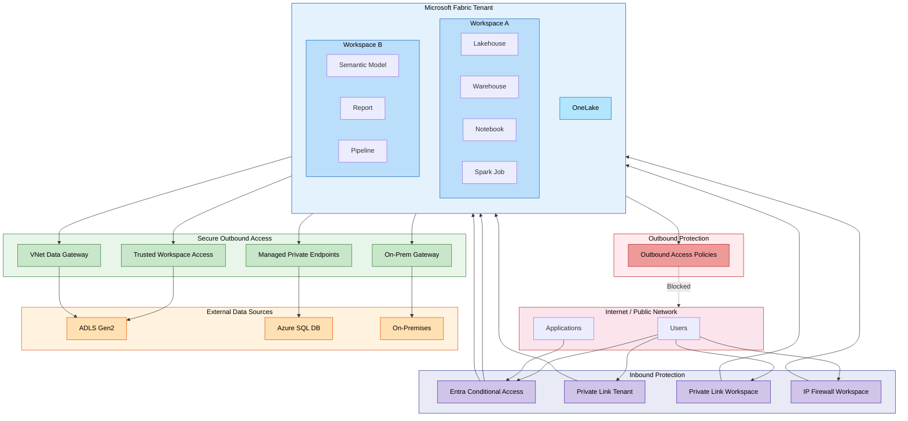

### End-to-End Reference Architecture

The diagram below consolidates the full Fabric network-security approach across five layers — identity, inbound protection, the Fabric workspace and its Managed VNet, outbound targets, and governance & operations. It is the visual companion to the rest of this document.

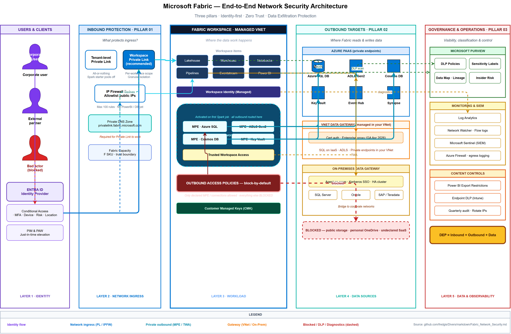{width=100%}

> Editable source: [`images/Fabric_Network_Security_Architecture.drawio`](../images/Fabric_Network_Security_Architecture.drawio) — open with [draw.io](https://app.diagrams.net) or the desktop app.

## Secure by Default

Microsoft Fabric is **secure by default** without any additional configuration:

- **Authentication**: Every interaction is authenticated via **Microsoft Entra ID**
- **Encryption in transit**: All traffic is encrypted using **TLS 1.2** minimum (TLS 1.3 negotiation when available)
- **Encryption at rest**: All data in OneLake is automatically encrypted
- **Microsoft backbone network**: Internal communications between Fabric experiences travel through the Microsoft private network, never over the public internet
- **Secure endpoints**: The Fabric backend is protected by a virtual network and is not directly accessible from the public internet

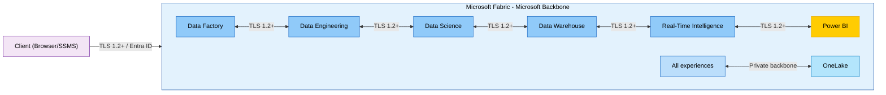

## Inbound Protection

Inbound protection controls traffic entering Fabric from the internet or corporate networks.

### Tenant Setting: Workspace-Level Inbound Network Rules

Before workspace administrators can configure Private Link or IP Firewall at the workspace level, a **tenant administrator** must enable the **"Workspace-level inbound network rules"** setting in the Fabric Admin portal (under **Tenant settings > Network security**).

When this setting is **disabled** (default), workspace-level Private Link and IP Firewall options are hidden from workspace administrators. Enabling it delegates inbound network control to individual workspace admins, allowing them to restrict public access independently per workspace.

> **Important:** This tenant setting does not enforce any network restriction by itself — it only **unlocks** the capability for workspace admins. Each workspace admin must then explicitly configure Private Link or IP Firewall rules on their workspace.

#### Interaction Between Tenant and Workspace Network Settings

The tenant-level public access setting and workspace-level inbound rules interact as follows:

| Tenant Public Access | Workspace Private Link | Workspace IP Firewall | Portal Access | API Access | Notes |
|:---:|:---:|:---:|---|---|---|
| **Allowed** | Not configured | Not configured | Public | Public | Default — no restriction |
| **Allowed** | Configured (public disabled) | — | Via WS Private Link only | Via WS Private Link only | Workspace locked down |
| **Allowed** | — | Configured | From allowed IPs only | From allowed IPs only | IP-based restriction |
| **Restricted** (Block Public Access) | Not configured | Not configured | Via Tenant PL only | Via Tenant PL only | Tenant-wide lockdown |
| **Restricted** (Block Public Access) | Configured | — | Via Tenant PL only | Via WS Private Link or Tenant PL | Portal requires tenant PL; API can use workspace PL |
| **Restricted** (Block Public Access) | — | Configured | Via Tenant PL only | Via Tenant PL only | IP firewall rules are overridden by tenant restriction |

> **Key takeaway:** When tenant-level public access is **restricted**, the tenant Private Link takes precedence for portal access. Workspace-level Private Link provides additional API-level access paths but does not bypass the tenant restriction for the Fabric portal.

### Entra Conditional Access

Microsoft Entra ID Conditional Access is the **Zero Trust** approach for securing access to Fabric. Access decisions are made at authentication time by evaluating contextual signals.

**Evaluated signals:**

| Signal | Policy examples |
|--------|----------------|
| Users and groups | Target specific populations |
| Location / IP | Allow only certain IP ranges or countries |
| Devices | Require compliant devices (Intune) |
| Applications | Apply rules per Fabric application |
| Sign-in risk | Block high-risk sign-ins |

**Possible decisions:** Block, Grant, Require MFA, Require compliant device.

**Prerequisites:** Microsoft Entra ID P1 license (often included in Microsoft 365 E3/E5).

> **Note:** Conditional Access policies apply to Fabric and related Azure services (Power BI, Azure Data Explorer, Azure SQL Database, Azure Storage). This may be considered too broad for some scenarios.

#### Zero Trust Identity Best Practices

As a SaaS service, Microsoft Fabric relies on **identity as the primary security perimeter**. Network controls complement but do not replace a robust identity strategy. The following practices should form the foundation of any Fabric security posture:

| Practice | Description |
|----------|-------------|
| **Phishing-resistant MFA** | Enforce multi-factor authentication using FIDO2 keys, Windows Hello for Business or certificate-based methods. Avoid SMS-based MFA where possible. |
| **Device Compliance** | Require managed or compliant devices (via Microsoft Intune) in Conditional Access policies to prevent access from untrusted endpoints. |
| **Privileged Identity Management (PIM)** | Use Entra PIM for just-in-time, time-limited elevation of Fabric admin and workspace admin roles. Avoid permanent high-privilege assignments. |
| **Service Principal Governance** | Audit and restrict Service Principal and Managed Identity access to Fabric APIs. Apply Conditional Access workload identity policies (Entra Workload ID Premium) to limit tokens to known IP ranges. |
| **Continuous Access Evaluation (CAE)** | Enable CAE so that revoked sessions, changed locations and risk events trigger near-real-time re-evaluation of Fabric access tokens. |

> **Recommendation:** Start with identity controls (MFA, Conditional Access, PIM) before layering network controls. This ensures baseline protection regardless of the user's network path.

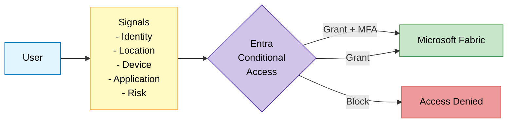

### Tenant-Level Private Link

Tenant-level Private Link provides **perimeter-based protection** for the entire Fabric tenant.

**Concept:** An Azure Private Endpoint is created in the customer's VNet, establishing a private tunnel to Fabric via the Microsoft backbone. Fabric becomes inaccessible from the public internet.

**Two key settings:**

| Setting | Effect |
|---------|--------|
| **Azure Private Links** (enabled) | Traffic from the VNet to supported endpoints goes through the Private Link |
| **Block Public Internet Access** (enabled) | Fabric is no longer accessible from the public internet; only Private Link is allowed |

**Configuration scenarios:**

| Private Link | Block Public Access | Behavior |
|:---:|:---:|---|
| Yes | Yes | Access only via Private Endpoint. Unsupported endpoints blocked. |
| Yes | No | VNet traffic via Private Link. Public internet traffic allowed. |
| No | - | Standard access via public internet. |

**Considerations:**

- **All users** must connect through the private network (VPN, ExpressRoute)
- **Bandwidth** impact: static resources (CSS, images) also transit through the Private Endpoint
- Some features have **limitations** (Publish to Web disabled, Copilot not supported, Power BI PDF/PowerPoint export disabled)
- **Spark Starter Pools** are disabled (replaced by custom pools in the managed VNet)
- **Cross-tenant access is not supported:** a Private Endpoint cannot be used to reach a Fabric tenant different from the one associated with the Private Link Service. This limitation is by design and applies to both tenant-level and workspace-level Private Link.
- **Private DNS Zone required:** to resolve Fabric public FQDNs (e.g., `*.fabric.microsoft.com`, `*.pbidedicated.windows.net`, `*.analysis.windows.net`) to private IP addresses, an Azure Private DNS Zone must be created and linked to the VNet. Without proper DNS configuration, clients will continue resolving public IPs and bypass the Private Endpoint. Use Azure Private DNS Zones or configure conditional DNS forwarding from on-premises DNS servers.

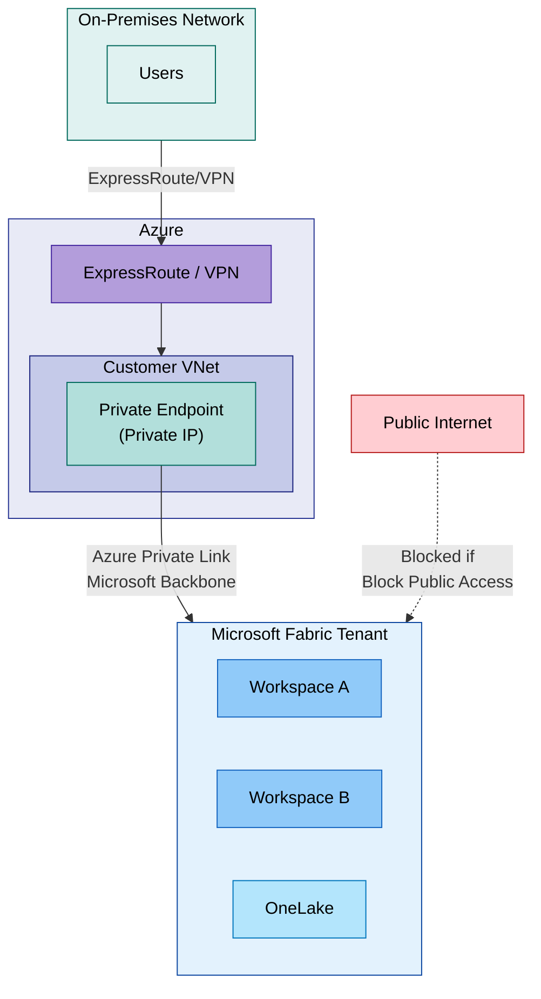

### Workspace-Level Private Link

Workspace-level Private Link offers **granular** control: specific workspaces are protected by Private Link while others remain publicly accessible.

**Key characteristics:**

- **1:1** relationship between a workspace and its Private Link Service
- A Private Link Service can have **multiple Private Endpoints** (from different VNets)
- A VNet can connect to **multiple workspaces** via separate Private Endpoints
- Public access can be restricted **independently** per workspace
- Public workspaces can be secured with Entra Conditional Access or IP Filtering

**Supported items (GA since September 2025):**
Lakehouse, Shortcut, Notebook, ML Experiment/Model, Pipeline, Warehouse, Dataflows, Eventstream, Mirrored DB. Access to workspace-level Private Link workspaces is available via both the Fabric portal and API.

> **Limitation — Unsupported item types:** Power BI reports/dashboards, Fabric databases, Data Activator, deployment pipelines, and default semantic models are **not yet covered** by workspace-level Private Link. These items remain accessible via public endpoints unless the entire tenant is secured with tenant-level Private Link or Microsoft Entra Conditional Access is used. Support for these item types is on the roadmap.

> **DNS configuration:** As with tenant-level Private Link, each workspace Private Endpoint requires a matching Azure Private DNS Zone record so that the workspace-specific FQDN resolves to the Private Endpoint's private IP. When connecting multiple VNets to multiple workspaces, plan the DNS zone topology carefully — a single centralized Private DNS Zone linked to all VNets is recommended over per-VNet zones to avoid resolution conflicts.

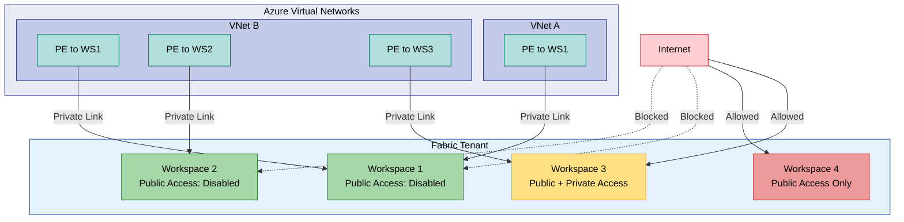

> **Key difference from Tenant-Level Private Link:** Workspace-level Private Link allows you to protect only sensitive workspaces without impacting the entire tenant. This is the recommended approach for organizations that cannot force all users onto a private network.

### Workspace IP Firewall

The workspace IP firewall is the simplest solution to restrict access to a workspace from specific public IP ranges.

**Concept:** Only explicitly allowed IP addresses or IP ranges can access the workspace. No Azure network infrastructure is required.

**Supported items (GA since Q1 2026):**
Lakehouse, Shortcut, Notebook, ML Experiment/Model, Pipeline, Warehouse, Dataflows, Eventstream, Mirrored DB. Both API and UI configuration are supported.

> **Limitation — Unsupported item types:** Power BI reports/dashboards, Fabric databases, Data Activator, deployment pipelines, and default semantic models are **not covered** by workspace IP Firewall rules. Traffic to these items bypasses the IP firewall and remains accessible from any network unless the entire tenant is locked down with tenant-level Private Link or Microsoft Entra Conditional Access. Support for these items is on the roadmap.

> **Note — API access:** Even with strict IP firewall rules, the **Fabric REST API** remains accessible for rule management. Administrators can create, update and delete IP firewall rules via the API regardless of their client IP. This is by design to prevent accidental lockout, but it means API-level governance (Conditional Access, Service Principal restrictions) is essential to avoid unauthorized rule changes.

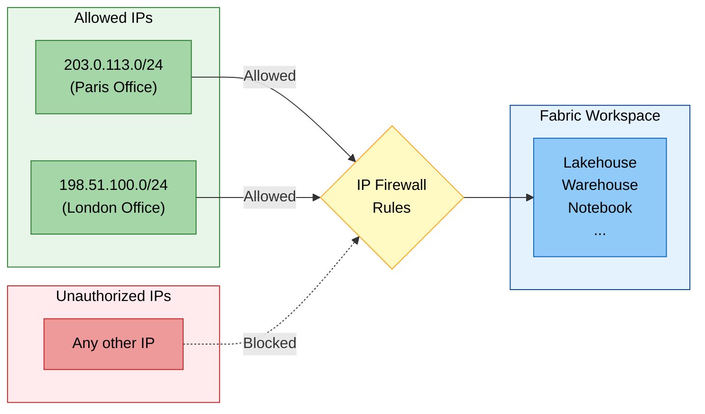

### Inbound Options Comparison

| Criteria | Conditional Access | Private Link Tenant | Private Link Workspace | IP Firewall |
|----------|:-:|:-:|:-:|:-:|
| **Granularity** | Tenant (per policy) | Tenant | Workspace | Workspace |
| **Azure infrastructure required** | No | VNet + PE | VNet + PE per WS | No |
| **Complexity** | Low | High | Medium | Low |
| **Approach** | Zero Trust (identity) | Perimeter (network) | Perimeter (network) | IP-based |
| **User impact** | Transparent (MFA) | VPN/ER mandatory | VPN/ER for protected WS | None if IP allowed |
| **Additional cost** | Entra ID P1 | VNet + PE + ER/VPN | VNet + PE | None |
| **Status** | GA | GA | GA | GA |

## Secure Outbound Access

Secure outbound access allows Fabric to connect to data sources protected by firewalls or private networks.

### Trusted Workspace Access

Trusted Workspace Access allows specific Fabric workspaces to securely access **firewall-enabled ADLS Gen2 accounts**.

**Concept:** The Fabric workspace has a **workspace identity** (managed identity). **Resource Instance Rules** are configured on the storage account to authorize only specified workspaces.

**Prerequisites:**
- Workspace associated with a **Fabric F SKU** capacity (not supported on Trial or Power BI Premium P SKU)
- **Workspace Identity** created and configured as Contributor on the workspace
- Authentication principal (user or service principal) with an **Azure RBAC data-plane role** on the ADLS Gen2 storage account: `Storage Blob Data Contributor`, `Storage Blob Data Owner`, or `Storage Blob Data Reader` depending on the operation
- **Resource Instance Rule** configured on the storage account's firewall to allow the specific Fabric workspace. This rule references the **Entra tenant ID** and the **workspace resource ID** and must be deployed via **ARM Template**, **Bicep**, or **PowerShell** (the Azure portal does not support resource instance rules natively)

> **Checklist:** If Trusted Workspace Access is not working, verify: (1) the workspace identity exists and is not disabled, (2) the RBAC role is assigned at the storage account or container level (not the resource group), (3) the resource instance rule uses the correct workspace resource ID (not just the workspace name), and (4) the storage account firewall allows "trusted Microsoft services" access.

**Supported scenarios:**

| Method | Description |
|--------|-------------|
| **OneLake Shortcut** | ADLS Gen2 shortcut in a Lakehouse |
| **Pipeline** | Data copy from firewall-enabled ADLS Gen2 |
| **T-SQL COPY INTO** | Ingestion into a Warehouse |
| **Semantic Model** (import) | Model connected to ADLS Gen2 |
| **AzCopy** | High-performance load to OneLake |

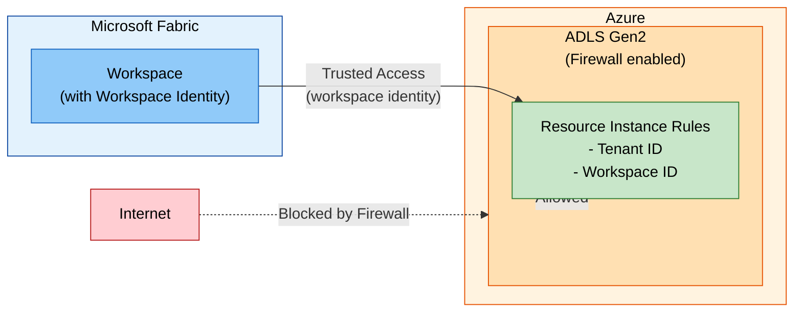

### Managed Private Endpoints

Managed Private Endpoints enable secure, private connections to Azure data sources from Fabric workloads without exposing them to the public network.

**Concept:** Microsoft Fabric creates and manages Private Endpoints in a **managed VNet** dedicated to the workspace. Workspace admins specify the resource ID of the source, the target sub-resource, and a justification.

**Supported sources:** Azure Storage, Azure SQL Database, Azure Cosmos DB, Azure Key Vault, and many more.

**Supported items:**
- Data Engineering (Spark/Python Notebooks, Lakehouses, Spark Job Definitions)
- Eventstream

**Prerequisites:**
- Supported on Fabric Trial and all F SKU capacities
- Data Engineering workload must be available in both the tenant region AND the capacity region

**Limitations:**
- OneLake shortcuts do not yet support ADLS Gen2 / Blob Storage connections via MPE
- Cross-region workspace migration not supported
- FQDN-based creation (Private Link Service) only via REST API

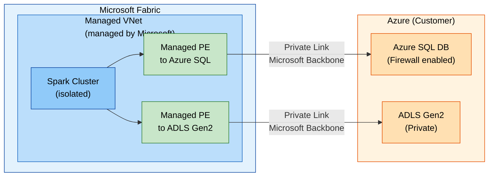

### Managed Virtual Networks

Managed VNets are virtual networks created and managed by Fabric for each workspace. They provide network isolation for Spark workloads.

**Automatically provisioned when:**
1. **Managed Private Endpoints** are added to the workspace
2. The **Private Link** setting is enabled and a Spark job is executed

**Characteristics:**
- Complete Spark cluster isolation (dedicated network)
- No need to size subnets (managed by Fabric)
- **Starter Pools** are disabled (on-demand Custom Pools, 3-5 min startup)
- Not supported in Switzerland West and West Central US regions

### Data Gateways

#### On-Premises Data Gateway

A gateway installed on a server within the corporate network, acting as a bridge between on-premises data sources and Fabric.

| Characteristic | Detail |
|---------------|--------|
| **Installation** | Windows server in the internal network |
| **Protocol** | Secure outbound channel (no inbound port opening) |
| **Sources** | Any source accessible from the gateway server |
| **Management** | Manual (updates, high availability) |

#### VNet Data Gateway

A managed gateway deployed into a customer's Azure VNet, enabling connections to Azure services within the VNet without an on-premises gateway.

| Characteristic | Detail |
|---------------|--------|
| **Deployment** | Injection into an existing Azure VNet |
| **Management** | Managed by Microsoft |
| **Sources** | Azure services in the VNet or peered VNets |
| **Workloads** | Dataflows Gen2, Semantic Models |
| **Enterprise proxy & cert auth** | **GA** — supports enterprise HTTP/HTTPS proxy servers and certificate-based authentication, allowing the gateway to route traffic through corporate proxies and authenticate with client certificates. Essential for organizations with mandatory proxy inspection policies. |

> **Reference:** [VNet Data Gateway documentation](https://learn.microsoft.com/en-us/data-integration/vnet/overview)

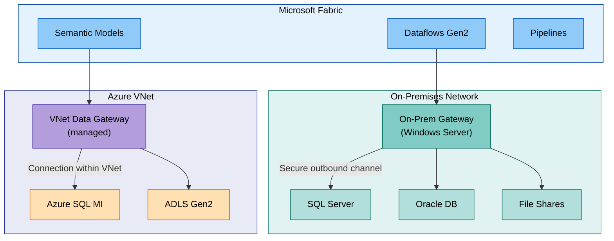

### Eventstream Private Network Support

*Preview — Q1 2026*

Fabric Eventstreams can now ingest data from private networks via a **managed VNet** and a **streaming data gateway**, enabling secure real-time data ingestion without exposing source endpoints to the public internet. This allows organizations to stream events from Azure Event Hubs, IoT Hub, or custom sources within a VNet directly into Fabric, with traffic routed entirely through the Microsoft backbone.

Key points:
- Eventstreams leverage the workspace's managed VNet for network isolation
- A streaming data gateway bridges the private network to the Eventstream ingestion endpoint
- Supports managed private endpoints for source connectivity
- Custom Endpoint as source/destination and Eventhouse direct ingestion remain unsupported

### Service Tags

Azure Service Tags are automatically managed groups of IP addresses, usable in NSGs, Azure Firewall and user-defined routes.

| Tag | Service | Direction | Regional |
|-----|---------|-----------|----------|
| `Power BI` | Power BI and Microsoft Fabric | Inbound/Outbound | Yes |
| `DataFactory` | Azure Data Factory | Inbound/Outbound | Yes |
| `DataFactoryManagement` | On-premises pipeline | Outbound | No |
| `EventHub` | Azure Event Hubs | Outbound | Yes |
| `KustoAnalytics` | Real-Time Analytics | Inbound/Outbound | No |
| `SQL` | Warehouse | Outbound | Yes |
| `PowerQueryOnline` | Power Query Online | Inbound/Outbound | No |

> **Tip:** When using regional tags, add the tag for the tenant's home region **and** the capacity region (if different), as well as the corresponding paired regions.

#### Using Service Tags with Network Security Groups (NSG)

NSGs can leverage Fabric-related service tags to enforce fine-grained inbound and outbound rules on subnets hosting Private Endpoints, VNet Data Gateways, or on-premises gateway servers.

**Example NSG rules:**

| Priority | Direction | Source/Destination | Service Tag | Action | Purpose |
|----------|-----------|-------------------|-------------|--------|---------|
| 100 | Outbound | VNet | `PowerBI` | Allow | Allow traffic to Fabric/Power BI endpoints |
| 110 | Outbound | VNet | `DataFactory` | Allow | Allow pipeline orchestration traffic |
| 120 | Outbound | VNet | `SQL` | Allow | Allow Warehouse connectivity |
| 200 | Outbound | VNet | `Internet` | Deny | Block all other internet-bound traffic |

#### Centralizing Outbound Traffic with Azure Firewall

For organizations that require centralized egress control, logging and static IP addresses:

- Deploy an **Azure Firewall** (or third-party NVA) in a hub VNet and route traffic from spoke VNets (hosting Private Endpoints or VNet Data Gateways) through the firewall via User Defined Routes (UDR).
- Use **application rules** with service tag-based FQDN filtering to allow only Fabric-related traffic.
- A **NAT Gateway** attached to the firewall subnet provides a **static outbound IP** — useful when external partners or data sources require IP whitelisting.
- All outbound connections are logged in Azure Firewall Diagnostics, enabling centralized auditing and threat detection.

### Secure Outbound Connectors Matrix

| Connection Method | Supported Sources | Fabric Workloads |
|-------------------|-------------------|-----------------|
| **Trusted Workspace Access** | ADLS Gen2 (firewall) | Shortcuts, Pipelines, COPY INTO, Semantic Models |
| **Managed Private Endpoints** | Azure SQL, ADLS Gen2, Cosmos DB, Key Vault... | Spark Notebooks, Lakehouses, Spark Jobs, Eventstream |
| **VNet Data Gateway** | Azure services in a VNet | Dataflows Gen2, Semantic Models |
| **On-Premises Gateway** | SQL Server, Oracle, files, SAP... | Dataflows Gen2, Semantic Models, Pipelines |
| **Service Tags** | Azure SQL VM, SQL MI, REST APIs | Pipelines, network integration |

## Outbound Protection

### Outbound Access Policies

Outbound Access Policies allow you to **restrict outbound connections** from a Fabric workspace to unauthorized destinations.

**Objective:** Prevent malicious users from exfiltrating data to unapproved destinations.

**Characteristics:**
- **Workspace-level** control
- Destinations are allow-listed via **Managed Private Endpoints** or **Data Connections**
- Any connection to a destination not explicitly allowed is **blocked**

**Status (as of April 2026):**

| Item Type | Status |
|-----------|--------|
| Lakehouse, Spark Notebooks, Spark Jobs | **GA** (since Sept 2025) |
| Dataflows, Pipelines, Copy Jobs, Warehouse, Mirrored DBs | **GA** (since Nov 2025) |
| Power BI, Databases | Planned (roadmap) |

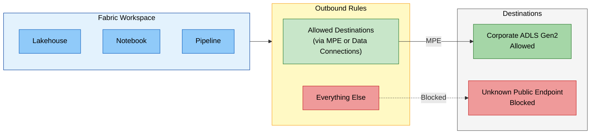

### Data Exfiltration Protection (DEP)

Complete **DEP** is achieved by combining inbound AND outbound protection:

| Component | Role |
|-----------|------|
| **Inbound** (Private Link / IP Firewall / Conditional Access) | Controls **who** can access data and **from where** |
| **Outbound** (Outbound Access Policies) | Prevents authorized users from **exfiltrating** data to unapproved destinations |

### Advanced Data Exfiltration Controls

Network-level DEP should be complemented by **data-level** controls to achieve defense in depth:

| Control | Mechanism | Scope |
|---------|-----------|-------|
| **Microsoft Purview Information Protection** | Classify and label sensitive data (sensitivity labels). Labels flow with data across Fabric items (Lakehouses, Warehouses, Semantic Models, Reports). | Tenant |
| **Data Loss Prevention (DLP)** | Define policies in Microsoft Purview DLP to detect and block sharing or export of items containing sensitive information (e.g., prevent download of datasets labeled "Highly Confidential"). | Tenant |
| **Power BI Export Restrictions** | Disable or restrict exports to Excel, CSV, PowerPoint, PDF and printing via tenant settings. When tenant-level Private Link is enabled, several export options are automatically disabled. | Tenant |
| **Endpoint DLP** | Use Microsoft Purview Endpoint DLP on managed devices to prevent copy/paste of Fabric data to USB drives, unauthorized cloud apps or personal email. | Device |
| **Conditional Access — Session Controls** | Leverage Defender for Cloud Apps session policies to monitor, block or limit downloads of sensitive content from the Fabric web portal in real time. | Session |

> **Recommendation:** Combine **Outbound Access Policies** (network) with **Purview sensitivity labels + DLP policies** (data) for a layered approach. Network controls prevent unauthorized destinations; data controls prevent unauthorized actions even on authorized destinations.

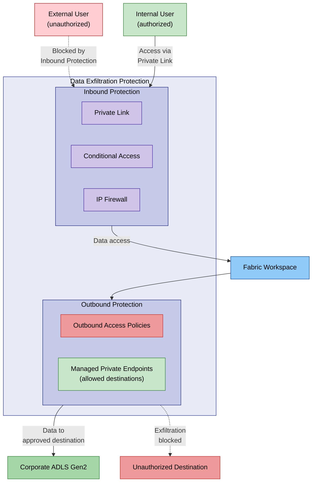

## Data Security

### Encryption

| Type | Mechanism | Detail |
|------|-----------|--------|
| **In transit** | TLS 1.2 / 1.3 | All client-to-Fabric and inter-experience traffic |
| **At rest** | Microsoft-managed keys (default) | Automatic encryption of all data in OneLake |
| **At rest (advanced)** | Customer Managed Keys (CMK) | Second layer of encryption with customer-managed Azure Key Vault keys |
| **Power BI** | BYOK | Bring Your Own Key for Power BI datasets |

### Customer Managed Keys (CMK)

CMK allows organizations to add an **additional encryption layer** with keys they manage themselves in Azure Key Vault.

**Status (as of April 2026):**

| Item Type | Status |
|-----------|--------|
| Lakehouse, Spark Job, Environment, Pipeline, Dataflow, API for GraphQL, ML Model/Experiment | **GA** (since Oct 2025) |
| Data Warehouse | **GA** (since Oct 2025) |
| Databases, Mirrored Experiences, Power BI | Planned (roadmap) |

## Data Residency and Multi-Geo

Microsoft Fabric supports **multi-geo** deployment with capacities spread across **54 data centers** worldwide.

**Characteristics:**
- Workspaces in different regions are still part of the same OneLake data lake
- The query execution layer, caches, and data remain in the Azure geography where they were created
- Some metadata and processing is stored at rest in the tenant's home geography
- **Data Residency compliant** by default

## DNS Configuration for Private Link

Proper DNS resolution is critical for Private Link deployments. Without correct DNS, clients resolve Fabric FQDNs to public IPs and bypass Private Endpoints entirely.

### Required Private DNS Zones

| DNS Zone | Used By |
|----------|---------|
| `privatelink.analysis.windows.net` | Power BI / Semantic Models |
| `privatelink.pbidedicated.windows.net` | Dedicated capacity endpoints |
| `privatelink.prod.powerapps.com` | Dataflows |
| `privatelink.blob.core.windows.net` | OneLake (ADLS Gen2 storage) |
| `privatelink.dfs.core.windows.net` | OneLake (DFS endpoint) |
| `privatelink.servicebus.windows.net` | Event Hubs / Eventstream |
| `privatelink.web.core.windows.net` | Fabric portal static content |

### DNS Architecture Patterns

| Pattern | Description | Best For |
|---------|-------------|----------|
| **Centralized Private DNS Zone** | Single zone linked to all VNets (hub-spoke topology). Managed in the hub subscription. | Multi-VNet environments with centralized IT |
| **Azure DNS Private Resolver** | Enables on-premises DNS servers to resolve Azure Private DNS Zones via conditional forwarding (forwarders pointing to 168.63.129.16 through the resolver's inbound endpoint). | Hybrid environments with on-premises DNS |
| **Conditional forwarders** | On-premises DNS forwards specific zones (e.g., `*.analysis.windows.net`) to Azure DNS. Requires VPN/ER connectivity. | Simple hybrid setups |

### IP Address Planning

When deploying multiple Private Endpoints (tenant-level + workspace-level), plan subnet sizing carefully:

- Each Private Endpoint consumes **one private IP** from the subnet
- Workspace-level Private Link requires **one PE per workspace** per VNet
- Reserve at least a `/27` (32 IPs) subnet for Fabric Private Endpoints to allow growth
- Use separate subnets for Fabric PEs and other Azure service PEs for clear NSG rule application

> **Common pitfall:** Forgetting to create or link Private DNS Zones is the most frequent cause of Private Link connectivity failures. Always verify with `nslookup` or `Resolve-DnsName` that Fabric FQDNs resolve to `10.x.x.x` (private IPs) rather than public IPs from the client's network.

### DNS Best Practices Checklist

> **DNS Quick Validation Guide**
>
> 1. **Create all required Private DNS Zones** listed above and link them to every VNet that hosts a Private Endpoint or from which users connect to Fabric.
> 2. **Test resolution before go-live** — from a VM inside the VNet, run:
>    - `nslookup <your-workspace>.fabric.microsoft.com` (Windows)
>    - `Resolve-DnsName <your-workspace>.pbidedicated.windows.net` (PowerShell)
>    - Expected: a `10.x.x.x` private IP, **not** a public IP.
> 3. **Hybrid DNS:** If using on-premises DNS servers, configure **conditional forwarders** for each `privatelink.*` zone pointing to Azure DNS (`168.63.129.16`) via an Azure DNS Private Resolver or a DNS forwarder VM in the VNet.
> 4. **Automate DNS record lifecycle:** Use Azure Policy (e.g., `Deploy-DINE-PrivateDNSZoneGroup`) to automatically create DNS records when new Private Endpoints are provisioned — manual record management is error-prone at scale.
> 5. **Monitor for DNS drift:** Periodically re-run resolution tests after infrastructure changes (VNet peering, new PEs, zone re-linking). A broken DNS zone link silently reverts traffic to the public path.

## Monitoring, Logging and Auditing

Network security controls are only effective if monitored. Fabric integrates with Azure's monitoring ecosystem to provide visibility into access patterns, threats and configuration drift.

### Diagnostic Logging

| Log Source | Destination | Key Signals |
|------------|------------|-------------|
| **Microsoft Entra ID Sign-in Logs** | Log Analytics | Failed/successful sign-ins, MFA challenges, Conditional Access policy hits, risky sign-ins |
| **Fabric Admin Audit Logs** | Log Analytics / Event Hub | Workspace creation, sharing changes, data exports, gateway operations |
| **Azure Private Link Metrics** | Azure Monitor | Bytes in/out through Private Endpoints, connection counts, NAT port utilization |
| **NSG Flow Logs** | Storage Account / Traffic Analytics | Source/dest IPs, ports, protocols, allow/deny decisions on PE subnets |
| **Azure Firewall Logs** | Log Analytics | Application/network rule hits, threat intelligence matches, DNS queries |

### Azure Monitor Integration

- Create **alerts** on Fabric capacity metrics (CU utilization, throttling events) and network metrics (PE connection failures, dropped packets)
- Use **Workbooks** to visualize Private Endpoint traffic patterns, top source IPs and blocked connections
- Set up **diagnostic settings** on Private Link Scopes and NSGs to stream logs to a central Log Analytics workspace

### Microsoft Sentinel Integration

For security-focused organizations, integrate Fabric signals with **Microsoft Sentinel**:

- **Data connectors:** Ingest Entra ID sign-in/audit logs, Fabric admin audit logs, and NSG flow logs into Sentinel
- **Analytics rules:** Detect anomalies such as logins from unexpected geolocations, sudden data export spikes, bulk permission changes, or sign-ins bypassing Conditional Access
- **Automated response:** Use Sentinel playbooks (Logic Apps) to respond to alerts — e.g., disable a compromised service principal, notify the SOC, or quarantine a workspace
- **Hunting queries:** Proactively search for lateral movement between workspaces, unusual API call patterns or data exfiltration indicators

### Audit Best Practices

- Review IP Firewall and Outbound Access Policy rules **quarterly** to remove stale entries
- Monitor Entra Conditional Access policy evaluation logs for unexpected "Not Applied" results
- Track Private Endpoint approval/rejection events on target Azure resources
- Validate that DNS resolution returns private IPs periodically (regression detection)

## Testing and Validation

After deploying network security controls, validate that they work as intended and do not introduce unacceptable latency or block legitimate traffic.

### Connectivity Validation

| Test | Tool | Expected Result |
|------|------|----------------|
| DNS resolution for Private Endpoint | `nslookup <workspace>.fabric.microsoft.com` or `Resolve-DnsName` | Returns private IP (10.x.x.x) |
| Fabric portal access via PE | Browser from within VNet or VPN-connected client | Portal loads; no public IP fallback |
| IP Firewall block test | Access from an IP not in the allow list | HTTP 403 Forbidden |
| Managed PE to Azure SQL | Run a notebook query from Fabric against a firewall-enabled SQL DB | Query succeeds; SQL audit log shows private IP source |
| Outbound policy block test | Attempt to connect to a non-allowed destination from a notebook | Connection refused / timed out |

### Performance Validation

- **Baseline first:** Measure query and pipeline performance **before** enabling Private Link or Managed VNets to establish a reference point
- **Spark startup time:** Custom pools in a Managed VNet take 3–5 minutes to start (vs. seconds for Starter Pools). Factor this into SLAs and user expectations
- **Private Endpoint throughput:** Monitor PE metrics for saturation. A single PE supports up to 8 Gbps; for high-throughput scenarios, verify that bandwidth is not a bottleneck
- **Cross-region latency:** When capacities and Private Endpoints are in different regions (multi-geo), measure added latency and consider co-locating PEs with capacities

### Periodic Reviews

| Review | Frequency | Responsible |
|--------|-----------|-------------|
| IP Firewall rules accuracy | Monthly | Workspace admin |
| Outbound policy allowed destinations | Quarterly | Security team |
| Private Endpoint approvals on target resources | Quarterly | Azure subscription owner |
| Conditional Access policy effectiveness | Quarterly | Identity team |
| DNS zone records and VNet links | Semi-annually | Network team |
| Penetration testing (Fabric-adjacent infrastructure) | Annually | Security team |

## Compliance and Certifications

Microsoft Fabric supports a wide range of compliance standards:

| Certification | Date |
|--------------|------|
| **ISO 27001, 27701, 27017, 27018** | December 2023 |
| **HIPAA** | January 2024 |
| **Australian IRAP** | February 2024 |
| **SOC 1 & 2 Type 2, SOX, CSA STAR** | May 2024 |
| **HITRUST** | September 2024 |
| **FedRAMP** (Azure Commercial) | November 2024 |
| **PCI DSS** | January 2025 |
| **K-ISMS** | May 2025 |
| **GDPR, EUDB** | Supported |

Fabric is a core **Microsoft Online Service**.

## Decision Guide

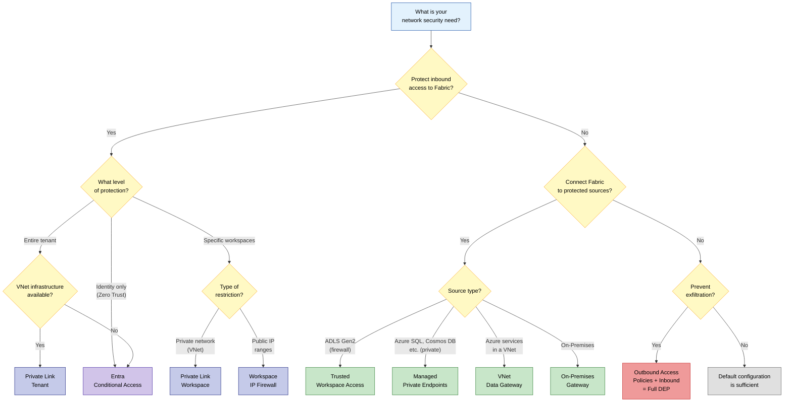

## Feature Summary and Status

*Updated as of April 2026*

| Feature | Level | Direction | Status | Primary Use Case |
|---------|-------|-----------|--------|-----------------|
| **Entra Conditional Access** | Tenant | Inbound | **GA** | Zero Trust, MFA, IP filtering |
| **Private Link Tenant** | Tenant | Inbound | **GA** | Full tenant network isolation |
| **Private Link Workspace** | Workspace | Inbound | **GA** | Granular per-workspace network isolation |
| **Workspace IP Firewall** | Workspace | Inbound | **GA** | IP-based restriction without VNet infrastructure |
| **Trusted Workspace Access** | Workspace | Outbound | **GA** | Firewall-enabled ADLS Gen2 access |
| **Managed Private Endpoints** | Workspace | Outbound | **GA** | Private connection to Azure sources |
| **Managed VNets** | Workspace | Outbound | **GA** | Spark isolation + MPE support |
| **VNet Data Gateway** | Org | Outbound | **GA** | Managed connection to Azure services in VNet; enterprise proxy & cert auth support |
| **On-Premises Gateway** | Org | Outbound | **GA** | Connection to on-premises sources |
| **Service Tags** | NSG/Firewall | Both | **GA** | Azure network rules |
| **Outbound Access Policies** | Workspace | Outbound | **GA** | Data exfiltration prevention |
| **Customer Managed Keys** | Workspace | Data | **GA** | Dual-layer encryption |
| **Eventstream Private Network** | Workspace | Outbound | **Preview** | Secure real-time ingestion from private networks |
| **Power BI Network Isolation** | Workspace | Inbound | **Planned** | WS-level Private Link and IP Firewall for Power BI items |
| **Fabric Databases Network Isolation** | Workspace | Inbound | **Planned** | WS-level Private Link and IP Firewall for Fabric databases |

## Feature Dependencies

The following diagram shows how Fabric network features depend on each other. It is centered on the **workspace-level** approach — the most common deployment model — where only sensitive workspaces are locked down via Workspace Private Link or IP Firewall, while the rest of the tenant remains accessible with identity-based controls.

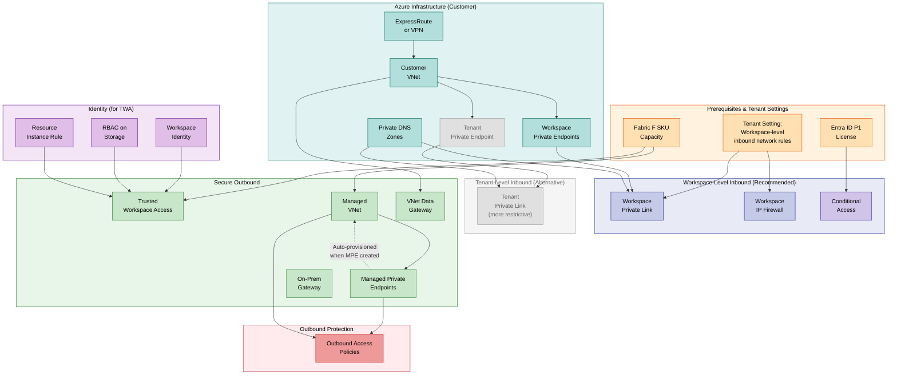

**Key dependency chains:**

| Chain | Steps | Notes |
|-------|-------|-------|
| Workspace Private Link | Tenant admin enables WS inbound rules → VNet + PE + Private DNS Zone → WS admin disables public access | DNS zone is often forgotten — verify with nslookup. Most recommended inbound approach. |
| Workspace IP Firewall | Tenant admin enables WS inbound rules → WS admin adds allowed IP ranges | No Azure infrastructure needed. Best for orgs with static office IPs. |
| Managed Private Endpoints | F SKU → Managed VNet (auto-provisioned) → MPE created → Source owner approves PE | Managed VNet is provisioned on first MPE creation or first Spark job with Private Link enabled |
| Trusted Workspace Access | F SKU → Workspace Identity → RBAC role on ADLS Gen2 → Resource Instance Rule on storage firewall | All 4 steps required; failure at any step silently blocks access |
| Outbound Access Policies | Managed VNet + MPE (or Data Connections) → Enable outbound policy → Non-listed destinations blocked | Must declare all legitimate destinations before enabling |
| Full DEP | Inbound (WS PL or IPFW or CA) + Outbound (OAP) | Both sides required for complete exfiltration protection |

**How to read this diagram:**

- **Orange boxes (top)** are prerequisites: a Fabric F SKU capacity, the tenant-level toggle for workspace inbound rules, or an Entra ID P1 license.
- **Blue boxes** (Workspace-Level Inbound) are the **recommended** inbound controls: Workspace Private Link, Workspace IP Firewall and Conditional Access. These protect individual workspaces without affecting the rest of the tenant.
- **Grey boxes** (Tenant-Level Inbound) show the alternative tenant-wide Private Link. It is intentionally de-emphasized (grey) because it locks down the **entire tenant** — all users must use VPN/ER, and several features are disabled. Use it only when regulations mandate zero public internet traffic.
- **Arrows** represent "requires" relationships — follow them top-down. For example, *Workspace Private Link* requires both the *tenant setting* (orange) and a *customer VNet with Private Endpoints + DNS* (teal).
- **Green boxes** (Secure Outbound) show outbound connectivity features. **Managed Private Endpoints** require a **Managed VNet** (auto-provisioned). **Trusted Workspace Access** requires a workspace identity with RBAC and resource instance rules (purple).
- **Red box** (Outbound Access Policies) sits at the end of the chain: it requires both Managed VNet and MPE, and blocks all undeclared destinations.
- **The dashed arrow** from MPE to Managed VNet indicates auto-provisioning — the VNet is created automatically when the first MPE is created.

## End-to-End Network Architecture

The following diagrams illustrate a **workspace-level** private network architecture — the most common and recommended approach. Rather than locking down the entire tenant (which impacts all users), this architecture protects **only the sensitive workspaces** via workspace Private Link and IP Firewall, while leaving self-service and BI workspaces accessible with identity-based controls.

### Inbound: From User to Fabric Workspace

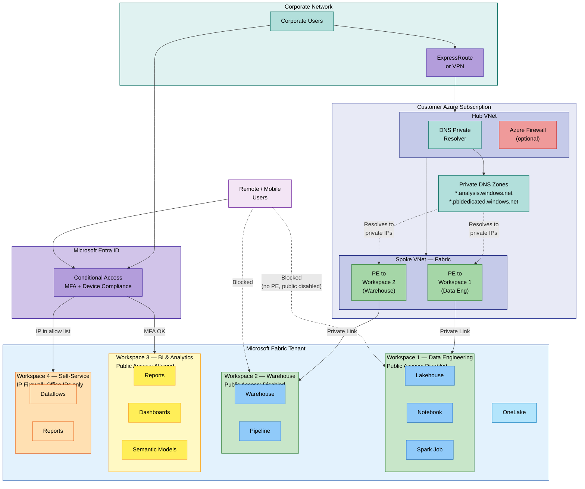

**How to read this diagram:**

- **Corporate users** (top-left) connect through ExpressRoute or VPN to the customer's Azure hub VNet, then reach Fabric workspaces via **workspace-level Private Endpoints** in a spoke VNet. DNS Private Resolver and Private DNS Zones ensure that Fabric FQDNs resolve to the PE's private IPs.
- **Workspace 1** (Data Engineering) and **Workspace 2** (Warehouse) are the sensitive workspaces: public access is **disabled**, only reachable via Private Link. They appear in **green**.
- **Workspace 3** (BI & Analytics) remains **publicly accessible** (yellow) — protected by Entra Conditional Access (MFA, device compliance). This is typical for reporting workspaces consumed by a broad audience.
- **Workspace 4** (Self-Service) uses **IP Firewall** (orange) — only office IPs are allowed, no VNet required.
- **Remote users** (bottom-left, purple) can access WS3 and WS4 (if CA/IP checks pass) but are **blocked** from WS1 and WS2 (dashed red arrows).
- **OneLake** sits at the bottom of the tenant — all workspaces share the same data lake.

### Outbound: From Fabric to Data Sources

```mermaid
flowchart TB
    subgraph FabricTenant["Microsoft Fabric Tenant"]
        subgraph WS1["Workspace 1 — Data Engineering"]
            subgraph MVNET["Managed VNet (auto)"]
                Spark["Spark Cluster"]
                MPE_SQL["MPE to\nAzure SQL"]
                MPE_ADLS["MPE to\nADLS Gen2"]
                MPE_KV["MPE to\nKey Vault"]
            end
        end
        subgraph WS2["Workspace 2 — Warehouse"]
            WH["Warehouse"]
            PIPE["Pipeline"]
            TWA_ID["Workspace Identity"]
        end
        subgraph WS3["Workspace 3 — BI"]
            SM["Semantic Models"]
            DF["Dataflows Gen2"]
        end
        OAP["Outbound Access\nPolicies\n(WS1 + WS2)"]
    end

    subgraph AzureData["Azure Data Sources"]
        ASQL["Azure SQL DB\n(Firewall enabled)"]
        ADLS["ADLS Gen2\n(Firewall enabled)"]
        KV["Azure Key Vault\n(Private)"]
        SQLMI["Azure SQL MI\n(in VNet)"]
    end

    subgraph OnPremData["On-Premises"]
        OGW["On-Prem Gateway"]
        SQLSrv["SQL Server"]
        SAP["SAP"]
    end

    subgraph VNetGW["Customer VNet"]
        VGW["VNet Data\nGateway"]
    end

    Spark --> MPE_SQL -->|"Private Link"| ASQL
    Spark --> MPE_ADLS -->|"Private Link"| ADLS
    Spark --> MPE_KV -->|"Private Link"| KV
    TWA_ID -->|"Trusted Access\n(Resource Instance Rule)"| ADLS
    PIPE -->|"via TWA"| ADLS

    SM --> VGW -->|"Within VNet"| SQLMI
    DF --> VGW

    SM --> OGW --> SQLSrv
    DF --> OGW --> SAP

    OAP -.->|"Blocked: any destination\nnot declared"| Unknown["Unknown\nDestination"]

    style FabricTenant fill:#e3f2fd,stroke:#0d47a1,color:#000
    style WS1 fill:#c8e6c9,stroke:#2e7d32,color:#000
    style WS2 fill:#c8e6c9,stroke:#2e7d32,color:#000
    style WS3 fill:#fff9c4,stroke:#f9a825,color:#000
    style MVNET fill:#bbdefb,stroke:#1565c0,color:#000
    style AzureData fill:#fff3e0,stroke:#e65100,color:#000
    style OnPremData fill:#e0f2f1,stroke:#00695c,color:#000
    style VNetGW fill:#e8eaf6,stroke:#283593,color:#000
    style Spark fill:#90caf9,stroke:#0d47a1,color:#000
    style MPE_SQL fill:#a5d6a7,stroke:#2e7d32,color:#000
    style MPE_ADLS fill:#a5d6a7,stroke:#2e7d32,color:#000
    style MPE_KV fill:#a5d6a7,stroke:#2e7d32,color:#000
    style WH fill:#90caf9,stroke:#1565c0,color:#000
    style PIPE fill:#90caf9,stroke:#1565c0,color:#000
    style TWA_ID fill:#e1bee7,stroke:#6a1b9a,color:#000
    style SM fill:#ffee58,stroke:#f9a825,color:#000
    style DF fill:#ffee58,stroke:#f9a825,color:#000
    style ASQL fill:#ffe0b2,stroke:#e65100,color:#000
    style ADLS fill:#ffe0b2,stroke:#e65100,color:#000
    style KV fill:#ffe0b2,stroke:#e65100,color:#000
    style SQLMI fill:#ffe0b2,stroke:#e65100,color:#000
    style OGW fill:#80cbc4,stroke:#00695c,color:#000
    style SQLSrv fill:#b2dfdb,stroke:#00695c,color:#000
    style SAP fill:#b2dfdb,stroke:#00695c,color:#000
    style VGW fill:#b39ddb,stroke:#4527a0,color:#000
    style OAP fill:#ef9a9a,stroke:#c62828,color:#000
    style Unknown fill:#ef9a9a,stroke:#c62828,color:#000
    style OL fill:#b3e5fc,stroke:#0277bd,color:#000
```

**How to read this diagram:**

- **Workspace 1** (Data Engineering, green) uses a **Managed VNet** with **Managed Private Endpoints** to reach Azure SQL, ADLS Gen2 and Key Vault — all traffic stays on the Microsoft backbone via Private Link.
- **Workspace 2** (Warehouse, green) uses **Trusted Workspace Access** to reach a firewall-enabled ADLS Gen2 account. The workspace identity (purple) authenticates via a Resource Instance Rule — no VNet required for this path.
- **Workspace 3** (BI, yellow) uses a **VNet Data Gateway** for Semantic Models/Dataflows Gen2 connecting to Azure SQL MI inside a VNet, and an **On-Premises Gateway** for SQL Server and SAP on-premises.
- **Outbound Access Policies** (red) are enabled on WS1 and WS2: any connection to a destination not explicitly declared via MPE or Data Connections is blocked (dashed arrow to "Unknown Destination").

### Monitoring and DNS (Cross-Cutting)

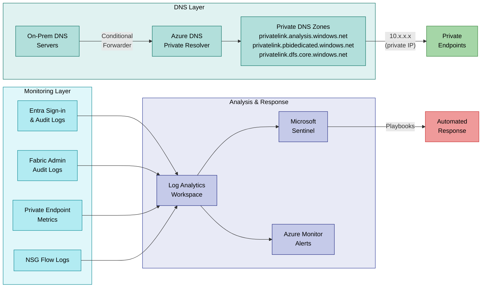

**How to read this diagram:**

- **DNS Layer** (left, teal): On-premises DNS servers forward Private Link zones to the Azure DNS Private Resolver, which queries Private DNS Zones. The zones return private IPs (10.x.x.x) so that traffic is routed through Private Endpoints instead of public internet.
- **Monitoring Layer** (center, cyan): Four log sources feed a central Log Analytics workspace — Entra sign-in logs, Fabric admin audit logs, Private Endpoint metrics, and NSG flow logs.
- **Analysis & Response** (right, blue): Log Analytics feeds Microsoft Sentinel for threat detection and Azure Monitor for operational alerts. Sentinel playbooks can trigger automated responses (e.g., disabling a compromised identity, notifying the SOC).

> **Alternative approach — Tenant-level Private Link:** The architecture above uses workspace-level privatization, which is the most flexible and widely adopted model. It is also possible to apply Private Link at the **tenant level**, which blocks public internet access for the **entire** Fabric tenant. This provides stronger isolation but is more restrictive: all users — including self-service BI consumers — must connect via ExpressRoute or VPN, and some features (Copilot, Publish to Web, certain exports) are disabled. Tenant-level Private Link is recommended only when regulatory requirements mandate that no Fabric traffic may traverse the public internet.

## Known Limitations by Item Type

The following table consolidates all known limitations for workspace-level network protection features as of April 2026.

| Item Type | WS Private Link | WS IP Firewall | Managed VNet / MPE | Outbound Access Policies | CMK |
|-----------|:---:|:---:|:---:|:---:|:---:|
| Lakehouse | **GA** | **GA** | **GA** | **GA** | **GA** |
| Warehouse | **GA** | **GA** | — | **GA** | **GA** |
| Notebook / Spark Job | **GA** | **GA** | **GA** | **GA** | **GA** |
| Pipeline / Dataflow | **GA** | **GA** | — | **GA** | **GA** |
| Eventstream | **GA** | **GA** | **GA** | **GA** | **GA** |
| ML Experiment / Model | **GA** | **GA** | **GA** | — | **GA** |
| Mirrored Database | **GA** | **GA** | — | **GA** | — |
| Shortcut (OneLake) | **GA** | **GA** | — | — | — |
| API for GraphQL | — | — | — | — | **GA** |
| Power BI Reports | **Planned** | **Planned** | — | **Planned** | **Planned** |
| Power BI Dashboards | **Planned** | **Planned** | — | **Planned** | **Planned** |
| Semantic Models | **Planned** | **Planned** | — | **Planned** | **Planned** |
| Fabric Databases | **Planned** | **Planned** | — | **Planned** | **Planned** |
| Data Activator | **Planned** | **Planned** | — | — | — |
| Deployment Pipelines | **Planned** | **Planned** | — | — | — |
| Default Semantic Models | **Planned** | **Planned** | — | — | — |

> **Key takeaway:** Power BI items (reports, dashboards, semantic models), Fabric Databases, Data Activator, deployment pipelines and default semantic models are **not yet protected** by workspace-level network controls. Until roadmap items ship, protect them with **tenant-level Private Link** (blocks all public access) or **Entra Conditional Access** (identity-based restriction).

## Recommended Architectures by Scenario

### Scenario 1 — Regulated Enterprise (GDPR / HIPAA / PCI DSS)

**Profile:** Multi-tenant organization with strict data residency requirements, sensitive PII/PHI data, mandatory audit trails.

| Layer | Recommendation |
|-------|---------------|
| **Inbound** | Tenant-level Private Link + Block Public Access. All users connect via ExpressRoute or VPN. |
| **Outbound** | Managed VNets + Managed Private Endpoints for all Azure data sources. Outbound Access Policies enabled on every workspace. |
| **Identity** | Entra Conditional Access: require MFA (phishing-resistant), compliant devices only, block sign-ins from non-approved countries. PIM for admin roles. |
| **Data** | CMK for all supported items. Purview sensitivity labels + DLP policies. Power BI export restrictions (disable CSV/Excel export). |
| **DNS** | Centralized Private DNS Zones in hub subscription. Azure DNS Private Resolver for hybrid resolution. |
| **Monitoring** | All diagnostic logs to Log Analytics. Microsoft Sentinel with analytics rules for anomaly detection. Quarterly rule reviews. |
| **Limitations** | Power BI items not covered by WS-level PL — tenant-level PL provides coverage. Plan for migration when WS-level support ships. |

### Scenario 2 — Data Platform Team with Mixed Sensitivity

**Profile:** Central data team serving multiple business units. Some workspaces contain sensitive data, others are for self-service analytics.

| Layer | Recommendation |
|-------|---------------|
| **Inbound** | Workspace-level Private Link for sensitive workspaces (data engineering, warehouse). IP Firewall for semi-restricted workspaces. Public access for self-service BI. |
| **Outbound** | Trusted Workspace Access for ADLS Gen2. Managed Private Endpoints for Azure SQL and Cosmos DB. VNet Data Gateway for Dataflows Gen2. |
| **Identity** | Conditional Access: MFA for all users, device compliance for admin roles. |
| **Data** | CMK on sensitive workspaces. Sensitivity labels propagated to downstream reports. |
| **DNS** | Private DNS Zones linked to spoke VNets hosting PEs. |
| **Monitoring** | Fabric admin audit logs + Azure Monitor alerts on PE connection failures. |

### Scenario 3 — Small Team / Startup (Cost-Optimized)

**Profile:** Small team, limited Azure infrastructure, no VPN/ExpressRoute. Need basic protection without complexity.

| Layer | Recommendation |
|-------|---------------|
| **Inbound** | Entra Conditional Access (MFA required, block risky sign-ins). Workspace IP Firewall for production workspaces (office IP only). |
| **Outbound** | VNet Data Gateway if connecting to Azure SQL in a VNet. On-premises gateway for local data sources. |
| **Identity** | MFA for all users. PIM if Entra P2 available. |
| **Data** | Microsoft-managed encryption (default). Sensitivity labels if M365 E5 available. |
| **DNS** | Not applicable (no Private Link). |
| **Monitoring** | Entra sign-in logs. Fabric admin audit logs in default storage. |

### Scenario 4 — Multi-Region Global Deployment

**Profile:** Global organization with capacities across multiple Azure regions and strict data residency per region.

| Layer | Recommendation |
|-------|---------------|
| **Inbound** | Workspace-level Private Link per region (PE co-located with capacity). Conditional Access with named locations per country. |
| **Outbound** | Managed Private Endpoints per region. Regional Managed VNets (one per capacity region). Azure Firewall in each regional hub for centralized egress logging. |
| **Identity** | Conditional Access with location-based policies. PIM with regional admin scoping. |
| **Data** | CMK with regional Key Vault instances. Multi-geo capacities ensuring data stays in-region. |
| **DNS** | Per-region Private DNS Zones with global zone peering. Regional DNS Private Resolvers. |
| **Monitoring** | Regional Log Analytics workspaces feeding a global Sentinel instance. Cross-region correlation rules. |

## References

- [Security overview - Microsoft Fabric](https://learn.microsoft.com/en-us/fabric/security/security-overview)
- [Private Links overview](https://learn.microsoft.com/en-us/fabric/security/security-private-links-overview)
- [Workspace-level Private Links](https://learn.microsoft.com/en-us/fabric/security/security-workspace-level-private-links-overview)
- [Managed VNets overview](https://learn.microsoft.com/en-us/fabric/security/security-managed-vnets-fabric-overview)
- [Managed Private Endpoints](https://learn.microsoft.com/en-us/fabric/security/security-managed-private-endpoints-overview)
- [Trusted Workspace Access](https://learn.microsoft.com/en-us/fabric/security/security-trusted-workspace-access)
- [Protect Inbound Traffic](https://learn.microsoft.com/en-us/fabric/security/protect-inbound-traffic)
- [Conditional Access in Fabric](https://learn.microsoft.com/en-us/fabric/security/security-conditional-access)
- [IP Firewall Rules in Fabric](https://learn.microsoft.com/en-us/fabric/security/security-ip-firewall-rules)
- [Service Tags](https://learn.microsoft.com/en-us/fabric/security/security-service-tags)
- [VNet Data Gateway](https://learn.microsoft.com/en-us/data-integration/vnet/overview)
- [Information Protection in Fabric](https://learn.microsoft.com/en-us/fabric/governance/information-protection)
- [Data Loss Prevention in Fabric](https://learn.microsoft.com/en-us/fabric/governance/data-loss-prevention-overview)
- [Azure Private DNS Zones](https://learn.microsoft.com/en-us/azure/private-link/private-endpoint-dns)
- [Microsoft Sentinel — Entra ID connector](https://learn.microsoft.com/en-us/azure/sentinel/data-connectors/microsoft-entra-id)
- [Fabric Security Whitepaper](https://aka.ms/FabricSecurityWhitepaper)
