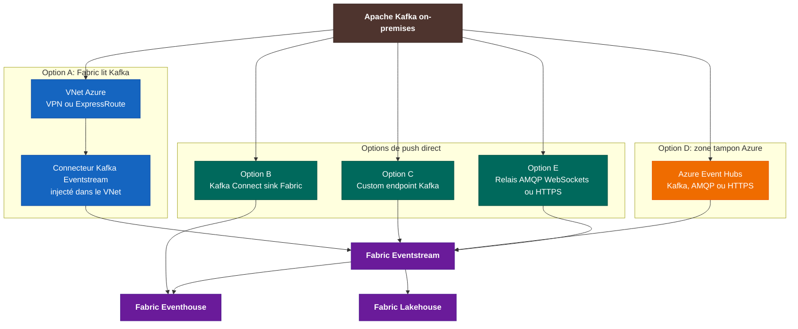
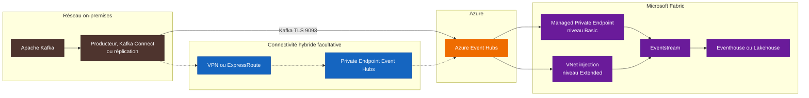
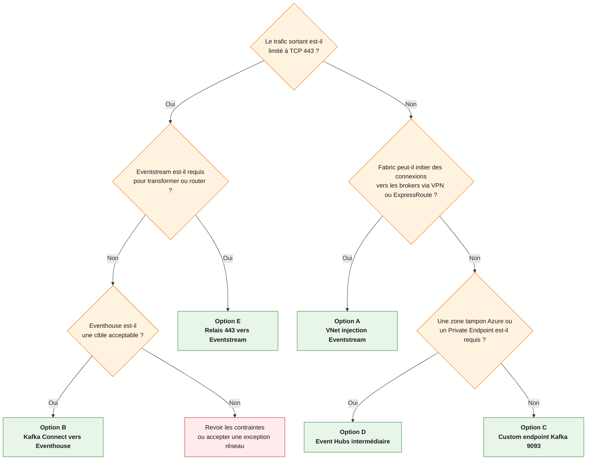

> **Périmètre.** Ce document traite d'un cluster Apache Kafka hébergé dans un réseau privé ou on-premises. Il ne dépend d'aucun contexte client et ne contient aucun nom d'organisation.
>
> **État des services.** Les informations de disponibilité et les limites produit ont été vérifiées le 11 septembre 2026. Microsoft peut les faire évoluer. Les liens de référence en fin de document restent la source à vérifier avant un déploiement de production.

## Résumé exécutif

L'architecture suivante est bien la voie native lorsque Microsoft Fabric doit lire un Kafka privé:

```text
Kafka on-premises
    |
VPN ou ExpressRoute
    |
VNet Azure avec sous-réseau délégué
    |
Connecteur Apache Kafka Eventstream injecté dans le VNet
    |
Eventstream
    |
Eventhouse, Lakehouse ou autre destination Fabric
```

Cette option est disponible en GA depuis juillet 2026. Elle conserve les transformations et le routage d'Eventstream, mais elle impose un point souvent bloquant: le connecteur Fabric initie les connexions vers Kafka. Le réseau on-premises doit donc accepter les flux provenant du sous-réseau Azure délégué vers les listeners annoncés par tous les brokers concernés.

Une politique "sortie HTTPS 443 uniquement" change le choix:

| Besoin prioritaire | Option recommandée |
| --- | --- |
| Conserver Eventstream et autoriser Fabric à joindre les brokers | Injection VNet du connecteur Eventstream |
| Utiliser uniquement une sortie HTTPS 443, sans code spécifique | Kafka Connect avec le sink Fabric vers Eventhouse |
| Conserver Eventstream et autoriser une sortie Kafka TLS sur 9093 | Endpoint Kafka d'un custom endpoint Eventstream |
| Ajouter une zone tampon Azure et une frontière réseau distincte | Azure Event Hubs entre Kafka et Eventstream |
| Conserver Eventstream avec une sortie limitée à 443 | Relais on-premises vers le custom endpoint via AMQP sur WebSockets ou HTTPS |

Le point "403 / HTTPS" doit être clarifié avant toute décision. `403` est un statut HTTP, pas un port. Il peut signaler un refus du proxy, une règle d'accès, une identité non autorisée ou une inspection TLS. Une contrainte "443 uniquement" est différente: elle interdit les chemins Kafka natifs sur le port 9093, même si le trafic est chiffré.

## Comprendre le sens des flux

Le choix d'architecture dépend d'abord de la partie qui ouvre la connexion.

| Modèle | Initiateur | Conséquence réseau |
| --- | --- | --- |
| Pull Eventstream | Fabric contacte Kafka | Le réseau on-premises accepte les connexions du VNet Azure vers les brokers |
| Push Kafka Connect | Un worker proche de Kafka contacte Fabric | Le réseau on-premises n'accepte aucun nouveau flux entrant |
| Push vers custom endpoint | Un producteur ou un outil de réplication contacte Eventstream | Une sortie vers l'endpoint Fabric est nécessaire |
| Push vers Event Hubs | Un producteur ou un relais contacte Azure Event Hubs | Event Hubs découple ensuite la source de Fabric |

La documentation Eventstream distingue les flux internes, entrants et sortants selon l'initiateur de la connexion. Une source Apache Kafka configurée dans Eventstream est un flux sortant du point de vue de Fabric: Eventstream récupère les événements depuis Kafka. Un custom endpoint est un flux entrant: une application externe pousse les événements vers Fabric.

## Le comportement réseau de Kafka à prendre en compte

Un client Kafka ne reste pas connecté uniquement au serveur bootstrap. Il utilise ce serveur pour obtenir les métadonnées du cluster, puis se connecte aux brokers qui portent les partitions. Les adresses renvoyées par `advertised.listeners` doivent donc être résolubles et joignables depuis le client.

Pour une intégration hybride, il faut vérifier:

- les FQDN ou adresses IP annoncés par chaque broker;
- le ou les ports réels des listeners Kafka, sans supposer qu'ils utilisent toujours 9092 ou 9093;
- la résolution DNS depuis le réseau Azure;
- le routage aller et retour entre le sous-réseau Azure et les réseaux on-premises;
- les ACL Kafka du consumer group et des topics;
- la chaîne de certificats présentée par chaque broker.

Autoriser seulement le bootstrap server ne suffit pas si les métadonnées renvoient d'autres brokers inaccessibles.

## Panorama des architectures



\optionbanner{1565C0}{OPTION A}{Pull privé via VNet}

## Option A: connecteur Apache Kafka Eventstream avec injection VNet

### Architecture


### Fonctionnement

Fabric crée une instance du connecteur de streaming dans un sous-réseau Azure préparé par l'entreprise. Le connecteur utilise ensuite la connectivité VPN ou ExpressRoute pour joindre le cluster Kafka. Le streaming virtual network data gateway ne déploie pas un cluster de passerelles. Il conserve dans Fabric la référence au VNet et au sous-réseau utilisés pour l'injection.

Cette architecture est la plus intégrée à Eventstream. Elle garde les transformations, le filtrage, le routage vers plusieurs destinations et l'exploitation dans Real-Time Intelligence.

### Prérequis Azure et Fabric

La configuration documentée par Microsoft impose les éléments suivants:

1. Enregistrer le resource provider `Microsoft.MessagingConnectors` dans l'abonnement qui héberge le VNet.
2. Créer ou réutiliser un VNet Azure dans la même région que l'eventstream.
3. Éviter tout chevauchement avec `10.240.0.0/16` et `10.224.0.0/12`.
4. Préparer un sous-réseau dédié et le déléguer au service **Messaging Connectors**.
5. Prévoir au moins un `/27` et au moins 16 adresses disponibles.
6. Connecter le VNet au réseau Kafka par VPN ou ExpressRoute.
7. Activer la workspace identity du workspace Fabric.
8. Attribuer le rôle Azure **Network Contributor** à cette identité sur le VNet.
9. Créer le streaming virtual network data gateway, puis une connexion marquée `[vNet]`.

Microsoft recommande un sous-réseau neuf. Un sous-réseau réutilisé ne doit pas déjà contenir de Private Endpoints, Load Balancers, Application Gateways, machines virtuelles, Virtual Machine Scale Sets ou interfaces réseau.

### Dimensionnement du sous-réseau

Azure réserve 15 adresses dans ce sous-réseau pour ce service. Chaque connecteur consomme au moins une adresse et peut monter jusqu'au nombre de partitions de la source lors d'une mise à l'échelle.

Exemple documenté:

```text
15 adresses réservées
+ 10 partitions x 2 connecteurs Kafka
= 35 adresses à prévoir au maximum
```

Le dimensionnement doit couvrir les connecteurs actuels, leur nombre de partitions et la croissance prévue. Un `/27` est un minimum technique, pas une taille universelle.

### Flux à autoriser

Le connecteur initie le trafic depuis le sous-réseau délégué vers Kafka. Les règles réseau doivent permettre:

- le port des listeners Kafka annoncés par les brokers;
- la résolution DNS nécessaire;
- le retour des sessions via le chemin VPN ou ExpressRoute;
- l'accès à Azure Key Vault si des certificats y sont stockés;
- les sorties requises par les services Azure et Fabric selon la politique de l'entreprise.

Du point de vue du pare-feu on-premises, il s'agit bien de connexions entrantes depuis le VNet Azure vers les brokers. C'est souvent le point de désaccord avec les équipes sécurité, même si le flux reste privé.

### Authentification et TLS

Le connecteur Apache Kafka Eventstream documente:

- `SASL_SSL` avec mécanisme `PLAIN`, `SCRAM-SHA-256` ou `SCRAM-SHA-512`;
- `SSL` avec authentification mutuelle;
- une autorité de certification publique reconnue, ou une CA interne fournie dans les paramètres TLS/mTLS;
- les certificats au format PEM dans Azure Key Vault;
- un certificat serveur dont le SAN contient les FQDN ou adresses utilisés pour joindre les brokers.

Pour une source privée, le Key Vault qui contient les certificats doit être connecté au VNet utilisé par le streaming virtual network data gateway, par exemple avec un Private Endpoint. L'utilisateur qui configure la source et prévisualise les données doit aussi disposer des droits Key Vault nécessaires.

### DNS

Le connecteur doit résoudre les noms renvoyés par Kafka. La documentation demande de valider qu'une machine virtuelle placée dans le VNet peut joindre la source avant de configurer Eventstream.

Le modèle DNS dépend de l'architecture de l'entreprise:

- une zone Azure Private DNS liée au VNet convient pour quelques enregistrements maîtrisés;
- Azure DNS Private Resolver peut transférer les requêtes vers le DNS on-premises;
- un DNS personnalisé dans le VNet doit connaître les zones internes et les zones Azure nécessaires;
- des adresses IP directes peuvent servir au diagnostic, mais elles sont rarement adaptées à l'exploitation Kafka.

Le test doit porter sur tous les FQDN annoncés par les brokers, pas seulement sur le bootstrap server.

### Limites et points d'attention

- Le test de connexion est désactivé lorsqu'une connexion utilise le streaming virtual network data gateway.
- La prévisualisation peut être vérifiée après publication sur le noeud central de l'eventstream. Elle dépend toutefois des droits Kafka, du format des messages et des droits Key Vault.
- La prévisualisation d'une source Kafka ne prend en charge que les messages JSON.
- La connectivité privée ne corrige pas une mauvaise configuration de `advertised.listeners`.
- Le fonctionnement exige une coordination entre les équipes Fabric, Azure réseau, Kafka, DNS et PKI.

### Variante: Connector IP Allowlist

Si l'entreprise ne peut pas préparer de VNet, Microsoft documente une variante sur réseau public. Le connecteur de streaming possède une adresse IP sortante unique par région. La source doit avoir une adresse résoluble publiquement et son pare-feu doit autoriser cette IP.

Cette variante:

- évite VPN et ExpressRoute;
- traverse le réseau public;
- expose la source sur une adresse publique protégée par allowlist;
- nécessite une demande au product team via le formulaire [Eventstream Streaming Connector IP allow list Request](https://aka.ms/EventStreamsConnIPAllowlistRequest).

Elle convient seulement si la politique de sécurité accepte une exposition publique contrôlée.

### Quand choisir cette option

Choisir l'option A si:

- Eventstream doit porter les transformations ou le routage;
- un VPN ou ExpressRoute existe déjà, ou peut être mis en place;
- les flux du sous-réseau Azure vers les brokers sont acceptables;
- l'équipe réseau peut gérer le DNS hybride et le routage retour.

Écarter cette option si tout flux initié depuis Azure vers le réseau on-premises est interdit.

\optionbanner{2E7D32}{OPTION B}{Push HTTPS 443 vers Eventhouse}

## Option B: Kafka Connect vers Eventhouse en HTTPS

### Architecture

```text
Kafka on-premises
    |
Kafka Connect en mode distribué
    |
Sink Microsoft Fabric
    |
HTTPS 443
    |
Eventhouse
    |
OneLake availability, Lakehouse, Warehouse, Notebook ou Power BI
```

Microsoft fournit un sink Kafka Connect pour écrire dans Eventhouse. Les workers Kafka Connect tournent dans l'environnement choisi par l'entreprise, idéalement à proximité du cluster. Ils lisent Kafka localement puis appellent les endpoints HTTPS d'ingestion et de requête d'Eventhouse.

### Atouts

- Le réseau on-premises initie le flux.
- Aucun VPN ou ExpressRoute n'est requis pour un endpoint public.
- Les appels vers Eventhouse utilisent des URL HTTPS.
- Le connecteur gère JSON, CSV et Avro, les mappings topics-tables, les retries et des dead-letter queues.
- L'ingestion en streaming peut viser une latence inférieure à la seconde si elle est activée et correctement dimensionnée.
- Les paramètres `proxy.host` et `proxy.port` sont documentés.

### Contraintes d'exploitation

- Le sink Fabric actuel écrit dans Eventhouse. Le support Eventstream reste indiqué dans sa roadmap.
- Kafka Connect doit être opéré en mode distribué pour la production.
- La version 2.x du connecteur demande Java 21 ou une version plus récente.
- La garantie de livraison est **at least once**. Les consommateurs doivent donc tolérer les doublons.
- Les tables, mappings, politiques d'ingestion et dead-letter queues doivent être administrés.
- Les paramètres de proxy documentés couvrent l'hôte et le port. L'authentification du proxy n'est pas décrite par le connecteur. Elle doit être testée avec le proxy réel, sans supposer qu'elle fonctionnera.

### Identité

Le connecteur documente trois stratégies:

- application Entra avec tenant ID, application ID et secret;
- managed identity lorsque le worker s'exécute dans un environnement Azure compatible;
- workload identity dans un environnement qui la prend en charge.

Pour un déploiement strictement on-premises, une application Entra est généralement la voie la plus directe. Le secret doit être stocké dans le gestionnaire de secrets de la plateforme Kafka Connect, pas dans un fichier de configuration en clair.

### Accès aux données depuis OneLake

L'activation de OneLake availability sur la base KQL crée une représentation Delta en lecture depuis les autres moteurs Fabric. Un Lakehouse peut y accéder directement ou via un shortcut.

Cette représentation n'est pas un remplacement instantané d'une destination Lakehouse Eventstream:

- le délai d'écriture par défaut peut atteindre trois heures si les fichiers n'ont pas atteint une taille adaptée;
- `TargetLatencyInMinutes` peut être configuré entre 5 minutes et 3 heures;
- le raccourcissement du délai peut produire de nombreux petits fichiers;
- certaines opérations sont bloquées pendant l'activation, notamment le renommage de table, le changement de type de colonne, la suppression ou purge de données et la row-level security.

Si la cible analytique principale est Eventhouse, cette option reste simple. Si une table Delta doit être visible en quelques secondes dans un Lakehouse, il faut tester précisément la latence obtenue.

### Quand choisir cette option

Choisir l'option B si:

- la politique réseau autorise uniquement une sortie HTTPS 443;
- Eventhouse est une cible acceptable;
- l'entreprise sait déjà exploiter Kafka Connect;
- les transformations peuvent être réalisées avant ingestion ou dans Eventhouse.

Cette option est souvent le meilleur point de départ pour une politique de sécurité sans flux entrant vers l'on-premises.

\optionbanner{6A1B9A}{OPTION C}{Push Kafka TLS 9093 vers Eventstream}

## Option C: push Kafka vers un custom endpoint Eventstream

Un custom endpoint Eventstream expose des informations de connexion compatibles avec les protocoles Event Hubs, AMQP et Kafka. Un producteur Kafka, un worker Kafka Connect ou un outil de réplication compatible peut envoyer les événements vers cet endpoint après adaptation de sa configuration.

La configuration Kafka documentée utilise:

```properties
bootstrap.servers=<endpoint fourni par Eventstream>
security.protocol=SASL_SSL
sasl.mechanism=PLAIN
sasl.jaas.config=org.apache.kafka.common.security.plain.PlainLoginModule required username="$ConnectionString" password="<connection-string>";
```

Le protocole Kafka d'Azure Event Hubs utilise TCP 9093. Le custom endpoint Eventstream repose sur cette compatibilité. Une règle limitée à TCP 443 ne permet donc pas d'utiliser cette variante Kafka telle quelle.

### Atouts

- Le flux est initié depuis l'on-premises.
- Eventstream reste disponible pour transformer et router les événements.
- L'endpoint présente un FQDN stable au lieu d'exiger l'accès à tous les brokers du cluster source.
- Aucun VPN ou ExpressRoute n'est obligatoire si l'endpoint public est autorisé.

### Contraintes

- Une sortie TCP 9093 vers l'endpoint `*.servicebus.windows.net` doit être autorisée.
- Event Hubs implémente le protocole Kafka, mais ne reproduit pas toutes les fonctions d'un cluster Kafka natif. Il faut tester l'outil de réplication et ses API.
- Les secrets SAS ou les identités configurées doivent être gérés et renouvelés.
- MirrorMaker 2 et les connecteurs doivent être validés sur les fonctions réellement utilisées, notamment les transactions, la compression, les offsets et les stratégies de retry.

### Quand choisir cette option

Choisir l'option C si Eventstream est nécessaire, que les flux doivent partir de l'on-premises et que la sécurité accepte TCP 9093 vers un endpoint Azure précis.

\optionbanner{EF6C00}{OPTION D}{Zone tampon Azure}

## Option D: Azure Event Hubs comme zone tampon

### Architecture



Azure Event Hubs fournit un endpoint Kafka dans les niveaux Standard, Premium et Dedicated. Une application Kafka peut souvent s'y connecter en changeant sa configuration, sans changer son code. Le trafic Kafka chiffré utilise TCP 9093.

Event Hubs peut être exposé:

- par son endpoint public avec règles de pare-feu;
- par un Private Endpoint atteint depuis l'on-premises via VPN ou ExpressRoute;
- par les deux, selon la politique réseau.

Fabric Eventstream peut ensuite lire Event Hubs:

- avec un Managed Private Endpoint pour le niveau de fonctionnalités Basic;
- avec l'injection VNet du connecteur pour le niveau Extended.

Les deux fonctions sont GA.

### Atouts

- Event Hubs absorbe les coupures temporaires entre Azure et Fabric.
- La frontière réseau Azure est indépendante du cycle de vie de l'eventstream.
- Le namespace fournit un endpoint stable.
- Plusieurs consommateurs peuvent lire le même flux.
- Les options de rétention, Capture, métriques et contrôle d'accès Azure sont disponibles.

### Contraintes

- Un service Azure supplémentaire doit être dimensionné, sécurisé, supervisé et facturé.
- Kafka sur Event Hubs n'est pas un cluster Kafka complet.
- Le chemin Kafka natif demande TCP 9093, y compris vers un Private Endpoint.
- Un Private Endpoint Event Hubs n'est pas disponible sur le niveau Basic d'Event Hubs.
- Le DNS privé `privatelink.servicebus.windows.net` et le routage hybride doivent être configurés si l'endpoint privé est utilisé.

### Variante 443

Event Hubs accepte les producteurs via HTTPS 443 et via AMQP sur WebSockets 443. Cette possibilité nécessite un relais ou une application qui consomme Kafka puis publie avec le SDK Event Hubs ou l'API HTTPS. MirrorMaker 2 ne devient pas un client 443 par simple changement de port.

### Quand choisir cette option

Choisir l'option D si l'entreprise veut une zone tampon Azure, une séparation claire entre la source et Fabric, ou un endpoint privé Azure géré indépendamment du workspace Fabric.

\optionbanner{00838F}{OPTION E}{Relais 443 vers Eventstream}

## Option E: relais on-premises vers Eventstream sur HTTPS 443

Cette option complète les quatre architectures habituelles. Elle répond au cas où Eventstream est requis alors que le pare-feu n'autorise que TCP 443.

```text
Kafka on-premises
    |
Service de relais local
    |
Event Hubs SDK avec AMQP sur WebSockets 443
ou requêtes HTTPS POST
    |
Custom endpoint Eventstream
    |
Transformations et destinations Fabric
```

Le custom endpoint Eventstream fournit une connection string au format Event Hubs. Les SDK Event Hubs peuvent utiliser AMQP sur WebSockets. La FAQ Event Hubs confirme que ce mode fonctionne sur TCP 443 uniquement. L'API HTTPS permet aussi l'envoi d'événements, mais pas leur lecture.

### Atouts

- Le flux est initié depuis l'on-premises.
- Eventstream reste dans l'architecture.
- Le trafic sortant utilise TCP 443.
- Le relais peut intégrer la politique de proxy, le contrôle de débit et la journalisation exigés par l'entreprise.

### Contraintes

- Il faut développer ou maintenir un composant de relais.
- Les offsets Kafka, retries, doublons et dead-letter queues deviennent la responsabilité de ce composant.
- Une inspection TLS ou un proxy authentifié doit être testé avec le SDK choisi.
- Le débit et la taille des lots doivent être mesurés sous charge.

Cette option est plus coûteuse à maintenir que Kafka Connect vers Eventhouse. Elle se justifie lorsque les transformations Eventstream sont nécessaires et que TCP 9093 est interdit.

\resetsectioncolor

## Comparatif des options

| Option | Initiateur | Port principal côté sortie on-premises | VPN ou ExpressRoute | Eventstream | Composant à opérer |
| --- | --- | --- | --- | --- | --- |
| A. VNet injection | Fabric vers Kafka | Listener Kafka sur le réseau privé | Oui | Oui | Réseau hybride et configuration Eventstream |
| A2. IP allowlist | Fabric vers Kafka public | Listener Kafka exposé publiquement | Non | Oui | Exposition publique contrôlée |
| B. Kafka Connect vers Eventhouse | On-premises vers Fabric | HTTPS 443 | Non | Non | Cluster Kafka Connect |
| C. Custom endpoint Kafka | On-premises vers Fabric | Kafka TLS 9093 | Non | Oui | Producteur, connecteur ou réplication |
| D. Event Hubs intermédiaire | On-premises vers Azure | 9093, ou 443 avec relais | Facultatif, requis pour Private Endpoint | Oui | Event Hubs et producteur |
| E. Relais vers Eventstream | On-premises vers Fabric | HTTPS 443 | Non | Oui | Service de relais |

| Critère | A | B | C | D | E |
| --- | :---: | :---: | :---: | :---: | :---: |
| Aucun flux initié vers l'on-premises | Non | Oui | Oui | Oui | Oui |
| Compatible avec une politique 443 uniquement | Non | Oui | Non | Oui avec relais | Oui |
| Transformations Eventstream | Oui | Non | Oui | Oui | Oui |
| Zone tampon indépendante de Fabric | Non | Non | Non | Oui | Non |
| Faible quantité de code spécifique | Oui | Oui | Oui si outil compatible | Oui si Kafka 9093 | Non |
| Complexité réseau hybride | Forte | Faible | Faible | Moyenne à forte | Faible |
| Complexité d'exploitation applicative | Faible | Moyenne | Moyenne | Moyenne | Forte |

## Arbre de décision



## Diagnostiquer "403" et "443"

Avant de choisir une architecture, il faut identifier la contrainte exacte.

| Observation | Interprétation probable | Vérification |
| --- | --- | --- |
| Le proxy renvoie `HTTP 403 Forbidden` | La requête HTTPS arrive au proxy, mais une règle refuse le FQDN, la méthode `CONNECT`, l'identité ou la destination | Consulter les logs du proxy et la règle qui a produit le refus |
| La connexion expire sur 9093 | Le pare-feu bloque le port Kafka TLS ou le chemin réseau | Tester la résolution, le routage et `Test-NetConnection <fqdn> -Port 9093` |
| La connexion TLS échoue sur 443 | Inspection TLS, CA non approuvée, SNI ou version TLS | Capturer la chaîne de certificats et tester depuis le même runtime |
| Eventstream ne joint pas Kafka | Listener annoncé non résolu, port broker bloqué, route retour absente ou ACL Kafka | Lire les métadonnées Kafka depuis une VM dans le VNet |
| Le test de connexion Fabric est absent | Comportement attendu avec le streaming virtual network data gateway | Publier puis vérifier l'état et la prévisualisation du flux |
| La prévisualisation est vide | Format non JSON, droits du consumer group, Key Vault ou absence d'événements | Vérifier le topic avec un consumer de référence et les permissions |

Questions à poser aux équipes réseau et sécurité:

1. S'agit-il d'un statut HTTP 403 observé dans un proxy, ou d'une règle qui n'autorise que TCP 443?
2. Les connexions initiées depuis un VNet Azure vers les brokers on-premises sont-elles interdites?
3. Une exception TCP 9093 vers un FQDN Azure précis est-elle acceptable?
4. Le proxy autorise-t-il AMQP sur WebSockets, ou seulement des requêtes HTTP classiques?
5. L'inspection TLS remplace-t-elle le certificat présenté au client?
6. Les endpoints Fabric et Entra nécessaires sont-ils autorisés par FQDN?

## Socle de sécurité commun

### Réseau

- Restreindre les règles aux CIDR, FQDN et ports réellement utilisés.
- Ne pas exposer les brokers sur Internet pour contourner un problème de routage.
- Pour l'option A, séparer le sous-réseau délégué des Private Endpoints et des machines virtuelles.
- Pour Event Hubs privé, utiliser le Private Endpoint et désactiver l'accès public si la politique l'impose.
- Journaliser les refus dans le pare-feu, le proxy, les NSG et le VPN.

### Identité et secrets

- Préférer une identité Entra à un secret statique lorsque le runtime le permet.
- Stocker les secrets Kafka, SAS et Entra dans un coffre ou un secret provider.
- Séparer les identités d'ingestion, d'administration et de lecture.
- Donner seulement les droits nécessaires sur les topics, consumer groups, tables et bases.
- Préparer une procédure de rotation qui ne coupe pas le flux.

### TLS et certificats

- Utiliser `SASL_SSL` ou mTLS pour Kafka.
- Faire correspondre les SAN des certificats aux noms réellement annoncés.
- Importer les chaînes complètes et les clés requises au format attendu.
- Tester la CA interne depuis le runtime du connecteur, pas seulement depuis un poste administrateur.
- Documenter l'impact d'une inspection TLS sur Kafka, AMQP WebSockets et HTTPS.

### Fiabilité

- Concevoir les traitements pour une livraison at least once.
- Définir une clé d'idempotence exploitable dans Eventhouse ou dans la couche de transformation.
- Prévoir une dead-letter queue et une procédure de rejeu.
- Surveiller le lag Kafka, les offsets, les retries, les erreurs d'ingestion et le débit.
- Tester le comportement pendant une coupure réseau plus longue que les buffers locaux.

## Démarche de mise en oeuvre

### Étape 1: cadrage

Collecter les informations suivantes:

| Domaine | Informations attendues |
| --- | --- |
| Kafka | Distribution, version, nombre de brokers, topics, partitions, débit, taille des messages, rétention |
| Sécurité Kafka | SASL, SCRAM, mTLS, Kerberos éventuel, CA, ACL, schema registry |
| Réseau | CIDR, DNS, ports, VPN ou ExpressRoute, proxy, inspection TLS, règles entrantes et sortantes |
| Fabric | Région de capacité, workspace, niveau Eventstream, destination Eventhouse ou Lakehouse |
| Exploitation | RTO, RPO, latence cible, rejeu, monitoring, astreinte, responsabilités |

### Étape 2: choisir deux candidats

Ne lancer un PoC que sur les options compatibles avec les règles réseau réelles:

- option A et option B si l'entreprise hésite entre pull privé et push 443;
- option B et option E si la sortie est strictement limitée à 443;
- option C et option D si 9093 est accepté et qu'Eventstream doit être conservé.

### Étape 3: valider le réseau avant Fabric

Pour l'option A, déployer une VM de test dans un sous-réseau non délégué du même VNet et vérifier:

```powershell
Resolve-DnsName kafka-broker-1.example.internal
Test-NetConnection kafka-broker-1.example.internal -Port <listener-port>
```

Utiliser ensuite un client Kafka pour lire les métadonnées. Le résultat doit montrer des adresses de brokers joignables depuis Azure.

Pour les options C et D:

```powershell
Resolve-DnsName <namespace>.servicebus.windows.net
Test-NetConnection <namespace>.servicebus.windows.net -Port 9093
```

Pour les options B et E:

```powershell
Test-NetConnection <fabric-or-eventstream-endpoint> -Port 443
```

Les tests doivent partir du serveur ou du conteneur qui exécutera réellement Kafka Connect ou le relais. Un test depuis un poste utilisateur ne valide pas le chemin de production.

### Étape 4: preuve de concept fonctionnelle

Le PoC doit couvrir:

- plusieurs partitions et plusieurs brokers;
- arrêt et redémarrage d'un worker;
- perte temporaire du lien réseau;
- rotation d'un secret ou certificat;
- message mal formé et dead-letter queue;
- doublon et rejeu depuis un offset antérieur;
- charge représentative;
- mesure de la latence à chaque étape;
- consultation des données dans la destination Fabric finale.

### Étape 5: passage en production

Avant la production:

1. Automatiser les ressources Azure, les rôles et les configurations Fabric lorsque les API le permettent.
2. Mettre les workers Kafka Connect ou le relais en haute disponibilité.
3. Définir les alertes sur le lag, les erreurs d'authentification, les refus réseau et les échecs d'ingestion.
4. Écrire les procédures de reprise, rotation, rejeu et changement de certificat.
5. Tester la restauration après une coupure complète du chemin hybride.
6. Faire approuver les flux par les propriétaires réseau, sécurité, Kafka et Fabric.

## Recommandation par défaut

La recommandation dépend de la contrainte réseau, pas d'une préférence produit:

- Si ExpressRoute ou VPN existe et que le réseau autorise Fabric à joindre tous les brokers, utiliser l'option A.
- Si la sortie on-premises est limitée à HTTPS 443 et qu'Eventhouse convient, utiliser l'option B.
- Si Eventstream est obligatoire et que TCP 9093 est autorisé, utiliser l'option C.
- Si une zone tampon Azure ou un Private Endpoint indépendant est recherché, utiliser l'option D.
- Si Eventstream est obligatoire et que seul TCP 443 est autorisé, utiliser l'option E.

Pour beaucoup d'environnements fortement filtrés, le premier arbitrage réaliste oppose A et B. A maximise l'intégration Fabric. B simplifie le passage du pare-feu en gardant toutes les connexions initiées depuis l'on-premises.

## Questions ouvertes avant décision

1. La mention "403" désigne-t-elle une réponse HTTP, un blocage proxy ou une confusion avec le port 443?
2. Les flux entrants depuis un VNet Azure vers le réseau Kafka sont-ils autorisés?
3. Un VPN ou ExpressRoute existe-t-il déjà entre le site et la région Azure concernée?
4. Quelle région héberge la capacité Fabric et le workspace?
5. Quels FQDN et ports sont annoncés par les brokers?
6. Le cluster utilise-t-il SASL/SCRAM, mTLS, Kerberos ou une CA interne?
7. Le DNS Azure peut-il résoudre les noms internes Kafka?
8. Le besoin final porte-t-il sur Eventhouse, Lakehouse ou plusieurs destinations?
9. Les transformations Eventstream sont-elles nécessaires?
10. Quelle latence doit être tenue de bout en bout?
11. L'équipe exploite-t-elle déjà Kafka Connect?
12. Une zone tampon Azure est-elle souhaitée pour le rejeu et le découplage?

## Statut produit et réserves

| Fonction | État vérifié | Réserve |
| --- | --- | --- |
| Injection VNet du connecteur Eventstream | GA | VNet Azure, sous-réseau délégué et connectivité hybride requis |
| Managed Private Endpoint Eventstream vers Event Hubs ou IoT Hub | GA | Sources Azure limitées à Event Hubs et IoT Hub |
| Kafka Connect sink Microsoft Fabric | Projet Microsoft publié | Cible Eventhouse actuelle, Eventstream dans la roadmap |
| Custom endpoint Eventstream avec protocole Kafka | Documenté | Kafka TLS utilise 9093 |
| OneLake availability pour Eventhouse | Disponible | Latence Delta adaptative et restrictions sur certaines opérations |
| Connector IP Allowlist | Disponible sur demande | Réseau public et source publiquement résoluble |
| Private Links avec custom endpoint Eventstream | Documentation contradictoire | La page de choix indique le support, la matrice détaillée indique le contraire. Valider par PoC avant de retenir ce modèle |
| Eventhouse direct ingestion avec Private Links | Non pris en charge | Le mode preprocessing est indiqué comme pris en charge |

## Références

### Microsoft Fabric Eventstream

| Ressource | Lien |
| --- | --- |
| Choisir la fonction de sécurité réseau Eventstream | <https://learn.microsoft.com/en-us/fabric/real-time-intelligence/event-streams/choose-the-right-network-security-feature> |
| Guide VNet et on-premises | <https://learn.microsoft.com/en-us/fabric/real-time-intelligence/event-streams/streaming-connector-private-network-support-guide> |
| Vue d'ensemble VNet et on-premises | <https://learn.microsoft.com/en-us/fabric/real-time-intelligence/event-streams/streaming-connector-private-network-support-overview> |
| Gérer un streaming virtual network data gateway | <https://learn.microsoft.com/en-us/fabric/real-time-intelligence/event-streams/create-manage-streaming-virtual-network-data-gateways> |
| Ajouter une source Apache Kafka | <https://learn.microsoft.com/en-us/fabric/real-time-intelligence/event-streams/add-source-apache-kafka> |
| Ajouter un custom endpoint | <https://learn.microsoft.com/en-us/fabric/real-time-intelligence/event-streams/add-source-custom-app> |
| Utiliser l'endpoint Kafka Eventstream | <https://learn.microsoft.com/en-us/fabric/real-time-intelligence/event-streams/stream-consume-events-use-kafka-endpoint> |
| Managed Private Endpoint pour Eventstream | <https://learn.microsoft.com/en-us/fabric/real-time-intelligence/event-streams/set-up-private-endpoint> |
| Tenant et Workspace Private Links | <https://learn.microsoft.com/en-us/fabric/real-time-intelligence/event-streams/set-up-tenant-workspace-private-links> |

### Eventhouse et Kafka Connect

| Ressource | Lien |
| --- | --- |
| Sink Kafka Connect Microsoft Fabric | <https://github.com/microsoft/kafka-sink-ms-fabric> |
| Ingestion Kafka vers une base KQL Fabric | <https://learn.microsoft.com/en-us/fabric/real-time-intelligence/get-data-kafka> |
| OneLake availability pour Eventhouse | <https://learn.microsoft.com/en-us/fabric/real-time-intelligence/event-house-onelake-availability> |

### Azure Event Hubs

| Ressource | Lien |
| --- | --- |
| Support du protocole Apache Kafka | <https://learn.microsoft.com/en-us/azure/event-hubs/azure-event-hubs-apache-kafka-overview> |
| Ports, HTTPS et AMQP sur WebSockets | <https://learn.microsoft.com/en-us/azure/event-hubs/event-hubs-faq> |
| Private Endpoint Event Hubs | <https://learn.microsoft.com/en-us/azure/event-hubs/private-link-service> |

---

*Document vérifié le 11 septembre 2026.*
