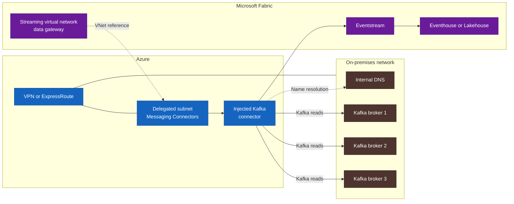
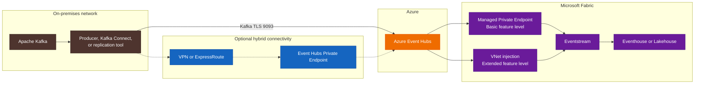
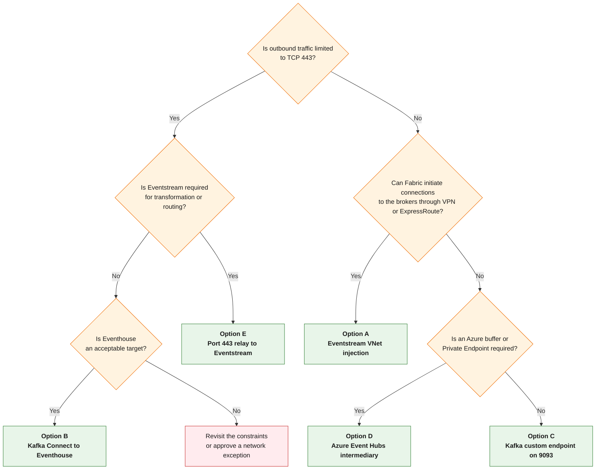

> **Scope.** This document covers Apache Kafka running on-premises or in another private network. It is independent of any customer context and contains no organization names.
>
> **Service status.** Product availability and limitations were checked on September 11, 2026. Microsoft can change them. Review the linked documentation before a production deployment.

## Executive summary

When Microsoft Fabric must read from a private Kafka cluster, the native architecture is:

```text
On-premises Kafka
    |
VPN or ExpressRoute
    |
Azure VNet with a delegated subnet
    |
Eventstream Apache Kafka connector injected into the VNet
    |
Eventstream
    |
Eventhouse, Lakehouse, or another Fabric destination
```

This option has been generally available since July 2026. It keeps Eventstream transformations and routing, but it has one network requirement that often decides the outcome: the Fabric connector initiates connections to Kafka. The on-premises network must accept traffic from the delegated Azure subnet to every broker listener returned in Kafka metadata.

A policy that permits only outbound HTTPS on port 443 changes the shortlist:

| Primary requirement | Recommended option |
| --- | --- |
| Keep Eventstream and allow Fabric to reach the brokers | Eventstream connector VNet injection |
| Use outbound HTTPS 443 only, without custom code | Kafka Connect with the Fabric sink to Eventhouse |
| Keep Eventstream and allow Kafka TLS on port 9093 | Kafka protocol on an Eventstream custom endpoint |
| Add an Azure buffer and a separate network boundary | Azure Event Hubs between Kafka and Eventstream |
| Keep Eventstream while limiting outbound traffic to 443 | On-premises relay to the custom endpoint over AMQP WebSockets or HTTPS |

### Document color key

\optionlegenditem{1565C0}{A}{Private pull through a VNet}
\optionlegenditem{2E7D32}{B}{HTTPS 443 push to Eventhouse}
\optionlegenditem{6A1B9A}{C}{Kafka TLS 9093 push to Eventstream}
\optionlegenditem{EF6C00}{D}{Azure Event Hubs as an intermediary}
\optionlegenditem{00838F}{E}{Port 443 relay to Eventstream}

Clarify the reported "403 / HTTPS" issue before choosing an architecture. `403` is an HTTP status, not a port. It can point to a proxy denial, an access rule, an unauthorized identity, or TLS inspection. A "port 443 only" policy is different. It rules out native Kafka paths on port 9093 even though those connections are encrypted.

## Start with connection direction

The first design question is which side opens the connection.

| Model | Initiator | Network consequence |
| --- | --- | --- |
| Eventstream pull | Fabric connects to Kafka | The on-premises network accepts connections from the Azure VNet to the brokers |
| Kafka Connect push | A worker near Kafka connects to Fabric | No new inbound connection to the on-premises network |
| Push to a custom endpoint | A producer or replication tool connects to Eventstream | The on-premises network needs an outbound path to Fabric |
| Push to Event Hubs | A producer or relay connects to Azure Event Hubs | Event Hubs then decouples the source from Fabric |

Eventstream documentation classifies traffic by the connection initiator. An Apache Kafka source configured in Eventstream is outbound from Fabric because Eventstream retrieves events from Kafka. A custom endpoint is inbound because an external application pushes events into Fabric.

## Kafka network behavior that matters

A Kafka client does not stay connected only to the bootstrap server. It uses that server to retrieve cluster metadata, then connects to the brokers that own the partitions. Every address returned through `advertised.listeners` must be resolvable and reachable from the client network.

For a hybrid connection, verify:

- every broker FQDN or IP address returned in metadata;
- the actual listener ports instead of assuming 9092 or 9093;
- DNS resolution from Azure;
- forward and return routing between the Azure subnet and the on-premises networks;
- Kafka ACLs for the topics and consumer group;
- the certificate chain presented by each broker.

Allowing only the bootstrap server is not enough when metadata points the client to other brokers.

## Architecture options


\clearpage
\optionbanner{1565C0}{OPTION A}{Private pull through a VNet}

## Option A: Eventstream Apache Kafka connector with VNet injection

### Architecture



### How it works

Fabric creates a streaming connector instance in an Azure subnet prepared by the organization. The connector reaches Kafka through VPN or ExpressRoute. The streaming virtual network data gateway does not deploy a gateway cluster. It stores the VNet and subnet reference that Eventstream uses for connector injection.

This is the closest fit with Eventstream. Transformations, filtering, routing to several destinations, and Real-Time Intelligence operations stay in Fabric.

### Azure and Fabric prerequisites

Microsoft documents the following setup:

1. Register the `Microsoft.MessagingConnectors` resource provider in the subscription that hosts the VNet.
2. Create or reuse an Azure VNet in the same region as the eventstream.
3. Avoid address overlap with `10.240.0.0/16` and `10.224.0.0/12`.
4. Prepare a dedicated subnet and delegate it to **Messaging Connectors**.
5. Use at least a `/27` with at least 16 available addresses.
6. Connect the VNet to the Kafka network through VPN or ExpressRoute.
7. Enable the Fabric workspace identity.
8. Grant that identity the Azure **Network Contributor** role on the VNet.
9. Create the streaming virtual network data gateway, then create a connection marked `[vNet]`.

Microsoft recommends a new subnet. If an existing subnet is reused, it must not contain Private Endpoints, Load Balancers, Application Gateways, virtual machines, Virtual Machine Scale Sets, or network interfaces.

### Subnet sizing

Azure reserves 15 addresses in this subnet for the service. Each connector uses at least one address and can scale up to the source partition count.

The documented example is:

```text
15 reserved addresses
+ 10 partitions x 2 Kafka connectors
= up to 35 addresses required
```

Size the subnet for the current connectors, their partition counts, and planned growth. A `/27` is a technical minimum, not a universal recommendation.

### Network flows

The connector initiates traffic from the delegated subnet to Kafka. Network rules must allow:

- the Kafka listener ports advertised by the brokers;
- the required DNS queries;
- return traffic through VPN or ExpressRoute;
- Azure Key Vault access when it stores certificates;
- any Azure and Fabric service egress required by the organization's policy.

From the on-premises firewall's point of view, these are inbound connections from the Azure VNet to the brokers. This is often the disputed part of the design even though the path is private.

### Authentication and TLS

The Eventstream Apache Kafka connector documents:

- `SASL_SSL` with `PLAIN`, `SCRAM-SHA-256`, or `SCRAM-SHA-512`;
- `SSL` with mutual TLS;
- a public trusted certificate authority, or an internal CA configured through the TLS/mTLS settings;
- PEM certificates stored in Azure Key Vault;
- a server certificate whose SAN includes the names or addresses used to reach the brokers.

For a private source, connect the Key Vault that holds the certificates to the VNet used by the streaming virtual network data gateway, for example through a Private Endpoint. The person who configures the source and previews data also needs the required Key Vault permissions.

### DNS

The connector must resolve every broker name returned by Kafka. Microsoft recommends proving that a virtual machine in the VNet can reach the source before Eventstream is configured.

The DNS design depends on the existing environment:

- an Azure Private DNS zone linked to the VNet works for a small set of managed records;
- Azure DNS Private Resolver can forward queries to on-premises DNS;
- custom DNS configured on the VNet must resolve both internal names and the required Azure zones;
- direct IP addresses can help during diagnosis, but they are rarely a sound Kafka operating model.

Test every broker FQDN returned in metadata, not just the bootstrap server.

### Limitations and operating notes

- The connection test is disabled when the connection uses a streaming virtual network data gateway.
- Data preview can be checked on the central eventstream node after publication. It still depends on Kafka permissions, message format, and Key Vault access.
- Kafka source preview supports JSON messages only.
- Private connectivity does not repair an incorrect `advertised.listeners` configuration.
- Delivery depends on coordination across the Fabric, Azure networking, Kafka, DNS, and PKI teams.

### Variant: Connector IP Allowlist

If the organization cannot prepare a VNet, Microsoft documents a public-network variant. Each regional streaming connector has a single outbound IP address. The source must have a publicly resolvable address, and its firewall must allow that IP.

This variant:

- avoids VPN and ExpressRoute;
- crosses the public network;
- exposes the source through a public address protected by an allowlist;
- requires a request through the [Eventstream Streaming Connector IP allow list Request](https://aka.ms/EventStreamsConnIPAllowlistRequest) form.

Use it only when the security policy accepts controlled public exposure.

### When to use this option

Choose option A when:

- Eventstream must handle transformations or routing;
- VPN or ExpressRoute already exists or can be established;
- traffic from the Azure subnet to every broker is allowed;
- the network team can operate hybrid DNS and return routing.

Reject this option when policy forbids all connections initiated from Azure toward the on-premises network.

\clearpage
\optionbanner{2E7D32}{OPTION B}{HTTPS 443 push to Eventhouse}

## Option B: Kafka Connect to Eventhouse over HTTPS

### Architecture

```text
On-premises Kafka
    |
Kafka Connect in distributed mode
    |
Microsoft Fabric sink
    |
HTTPS 443
    |
Eventhouse
    |
OneLake availability, Lakehouse, Warehouse, Notebook, or Power BI
```

Microsoft publishes a Kafka Connect sink for Eventhouse. Kafka Connect workers run in the organization's chosen environment, preferably close to the cluster. They read Kafka locally, then call the Eventhouse ingestion and query endpoints over HTTPS.

### Advantages

- The on-premises environment initiates the connection.
- A public endpoint does not require VPN or ExpressRoute.
- Eventhouse ingestion and query endpoints use HTTPS URLs.
- The connector handles JSON, CSV, and Avro, topic-to-table mappings, retries, and dead-letter queues.
- Streaming ingestion can target subsecond latency when it is enabled and sized correctly.
- The connector documents `proxy.host` and `proxy.port`.

### Operating constraints

- The current Fabric sink writes to Eventhouse. Eventstream support remains on its roadmap.
- Production requires Kafka Connect in distributed mode.
- Connector version 2.x requires Java 21 or later.
- Delivery is **at least once**, so downstream processing must tolerate duplicates.
- Teams must administer tables, mappings, ingestion policies, and dead-letter queues.
- The documented proxy settings cover host and port. The connector does not document proxy authentication. Test it with the actual corporate proxy rather than assuming support.

### Identity

The connector documents three authentication strategies:

- a Microsoft Entra application with tenant ID, application ID, and secret;
- managed identity when the worker runs in a compatible Azure environment;
- workload identity in a platform that supports it.

For a fully on-premises deployment, a Microsoft Entra application is usually the most direct choice. Store its secret in the Kafka Connect platform's secret provider, not in plain text configuration.

### Access through OneLake

Enabling OneLake availability on the KQL database creates a read-only Delta representation for other Fabric engines. A Lakehouse can access it directly or through a shortcut.

This is not an immediate replacement for an Eventstream Lakehouse destination:

- the default write delay can reach three hours when files have not reached an efficient size;
- `TargetLatencyInMinutes` can be set between 5 minutes and 3 hours;
- shorter delays can create many small files;
- some operations are blocked while the feature is enabled, including table rename, column type changes, data deletion or purge, and row-level security.

If Eventhouse is the main analytics target, this option is straightforward. If a Delta table must appear in a Lakehouse within seconds, measure the actual latency before selecting it.

### When to use this option

Choose option B when:

- policy permits outbound HTTPS 443 only;
- Eventhouse is an acceptable target;
- the organization already operates Kafka Connect or is prepared to do so;
- transformations can run before ingestion or inside Eventhouse.

For a tightly filtered network with no inbound path to Kafka, this is often the simplest starting point.

\clearpage
\optionbanner{6A1B9A}{OPTION C}{Kafka TLS 9093 push to Eventstream}

## Option C: push Kafka data to an Eventstream custom endpoint

An Eventstream custom endpoint exposes connection details compatible with Event Hubs, AMQP, and Kafka. A Kafka producer, Kafka Connect worker, or compatible replication tool can send events to it after a configuration change.

The documented Kafka configuration uses:

```properties
bootstrap.servers=<endpoint-provided-by-eventstream>
security.protocol=SASL_SSL
sasl.mechanism=PLAIN
sasl.jaas.config=org.apache.kafka.common.security.plain.PlainLoginModule required username="$ConnectionString" password="<connection-string>";
```

Azure Event Hubs uses TCP 9093 for its Kafka protocol, and the Eventstream custom endpoint uses that compatibility layer. A policy limited to TCP 443 cannot use this Kafka path as-is.

### Advantages

- The on-premises environment initiates the connection.
- Eventstream remains available for transformation and routing.
- The destination is one stable FQDN rather than every source-cluster broker.
- A public endpoint does not require VPN or ExpressRoute.

### Constraints

- The firewall must allow outbound TCP 9093 to the `*.servicebus.windows.net` endpoint.
- Event Hubs implements the Kafka protocol but is not a complete Kafka broker. Test the replication tool and the APIs it uses.
- SAS secrets or configured identities require controlled storage and rotation.
- Validate MirrorMaker 2 and other connectors against the features they use, including transactions, compression, offsets, and retry behavior.

### When to use this option

Choose option C when Eventstream is required, the connection must start on-premises, and security permits TCP 9093 to a specific Azure endpoint.

\clearpage
\optionbanner{EF6C00}{OPTION D}{Azure Event Hubs as an intermediary}

## Option D: Azure Event Hubs as an intermediary

### Architecture



Azure Event Hubs provides a Kafka endpoint in its Standard, Premium, and Dedicated tiers. Many Kafka applications can use it after a configuration change. Encrypted Kafka traffic uses TCP 9093.

Event Hubs can be exposed through:

- its public endpoint with firewall rules;
- a Private Endpoint reached from on-premises through VPN or ExpressRoute;
- both paths when policy permits them.

Eventstream can then read Event Hubs through:

- a Managed Private Endpoint at the Basic feature level;
- connector VNet injection at the Extended feature level.

Both Fabric network features are generally available.

### Advantages

- Event Hubs absorbs temporary interruptions between Azure and Fabric.
- The Azure network boundary has its own lifecycle, separate from the eventstream.
- The namespace exposes one stable endpoint.
- Several consumers can read the same stream.
- Azure retention, Capture, metrics, and access controls are available.

### Constraints

- The additional Azure service needs capacity planning, security, monitoring, and a budget.
- Event Hubs for Kafka is not a complete Kafka cluster.
- The native Kafka path requires TCP 9093, including through a Private Endpoint.
- Event Hubs Private Endpoint is unavailable in the Event Hubs Basic tier.
- Private connectivity requires DNS for `privatelink.servicebus.windows.net` and the correct hybrid route.

### Port 443 variant

Event Hubs accepts producers over HTTPS 443 and AMQP WebSockets on 443. This requires a relay or application that consumes Kafka and publishes through the Event Hubs SDK or HTTPS API. MirrorMaker 2 does not become a port 443 client by changing its destination port.

### When to use this option

Choose option D when the architecture needs an Azure buffer, a separate network boundary, or a Private Endpoint managed independently from the Fabric workspace.

\clearpage
\optionbanner{00838F}{OPTION E}{Port 443 relay to Eventstream}

## Option E: on-premises relay to Eventstream over HTTPS 443

This option covers the case where Eventstream is required but the firewall permits only outbound TCP 443.

```text
On-premises Kafka
    |
Local relay service
    |
Event Hubs SDK with AMQP WebSockets on port 443
or HTTPS POST requests
    |
Eventstream custom endpoint
    |
Fabric transformations and destinations
```

The Eventstream custom endpoint provides an Event Hubs-format connection string. Event Hubs SDKs can use AMQP WebSockets, and the Event Hubs FAQ confirms that this transport can run entirely on TCP 443. The HTTPS API can also send events, but it cannot receive them.

### Advantages

- The on-premises environment initiates the connection.
- Eventstream stays in the architecture.
- Outbound traffic uses TCP 443.
- The relay can implement the organization's proxy policy, rate control, and logging requirements.

### Constraints

- The organization must develop or maintain a relay.
- The relay owns Kafka offsets, retries, duplicate handling, and dead-letter processing.
- Test TLS inspection and authenticated proxy behavior with the selected SDK.
- Measure throughput and batch sizes under representative load.

This option costs more to operate than Kafka Connect to Eventhouse. It is justified when Eventstream transformations are required and TCP 9093 is not allowed.

\clearpage
\resetsectioncolor

## Option comparison

| Option | Initiator | Main outbound port from on-premises | VPN or ExpressRoute | Eventstream | Component to operate |
| --- | --- | --- | --- | --- | --- |
| A. VNet injection | Fabric to Kafka | Private Kafka listener port | Yes | Yes | Hybrid network and Eventstream configuration |
| A2. IP allowlist | Fabric to public Kafka | Publicly exposed Kafka listener | No | Yes | Controlled public exposure |
| B. Kafka Connect to Eventhouse | On-premises to Fabric | HTTPS 443 | No | No | Kafka Connect cluster |
| C. Kafka custom endpoint | On-premises to Fabric | Kafka TLS 9093 | No | Yes | Producer, connector, or replication tool |
| D. Event Hubs intermediary | On-premises to Azure | 9093, or 443 with a relay | Optional, required for Private Endpoint | Yes | Event Hubs and producer |
| E. Relay to Eventstream | On-premises to Fabric | HTTPS 443 | No | Yes | Relay service |

| Criterion | A | B | C | D | E |
| --- | :---: | :---: | :---: | :---: | :---: |
| No connection initiated toward on-premises | No | Yes | Yes | Yes | Yes |
| Compatible with a port 443 only policy | No | Yes | No | Yes with a relay | Yes |
| Eventstream transformations | Yes | No | Yes | Yes | Yes |
| Buffer independent from Fabric | No | No | No | Yes | No |
| Little custom code | Yes | Yes | Yes if the tool is compatible | Yes with Kafka 9093 | No |
| Hybrid network complexity | High | Low | Low | Medium to high | Low |
| Application operating effort | Low | Medium | Medium | Medium | High |

## Decision tree



## Diagnosing "403" and "443"

Identify the actual restriction before selecting an option.

| Observation | Likely meaning | Check |
| --- | --- | --- |
| The proxy returns `HTTP 403 Forbidden` | The HTTPS request reached the proxy, but a rule rejected the FQDN, `CONNECT` method, identity, or destination | Read the proxy log and the rule that produced the denial |
| The connection to 9093 times out | The firewall blocks Kafka TLS or the network path is incomplete | Check DNS, routing, and `Test-NetConnection <fqdn> -Port 9093` |
| TLS fails on port 443 | TLS inspection, an untrusted CA, SNI handling, or protocol version | Capture the certificate chain from the production runtime |
| Eventstream cannot reach Kafka | An advertised listener does not resolve, a broker port is blocked, return routing is missing, or Kafka ACLs reject the client | Read Kafka metadata from a VM in the VNet |
| Fabric does not offer a connection test | Expected with the streaming virtual network data gateway | Publish, then inspect source state and eventstream data preview |
| Preview is empty | Non-JSON data, consumer-group permissions, Key Vault access, or no current events | Read the topic with a reference consumer and check permissions |

Ask the network and security teams:

1. Does "403" mean an HTTP response from a proxy, or was it shorthand for a port 443 only rule?
2. Are connections from an Azure VNet to the on-premises Kafka brokers forbidden?
3. Can the firewall allow TCP 9093 to one specific Azure FQDN?
4. Does the proxy permit AMQP over WebSockets, or only conventional HTTP requests?
5. Does TLS inspection replace the certificate presented to the client?
6. Are the required Fabric and Microsoft Entra endpoints allowed by FQDN?

## Common security baseline

### Network

- Restrict rules to the CIDRs, FQDNs, and ports actually used.
- Do not expose Kafka brokers to the internet to work around a routing problem.
- For option A, keep the delegated subnet separate from Private Endpoints and virtual machines.
- For private Event Hubs, use a Private Endpoint and disable public access when policy requires it.
- Log denials in the firewall, proxy, NSGs, and VPN platform.

### Identity and secrets

- Prefer Microsoft Entra identities over static secrets when the runtime supports them.
- Store Kafka, SAS, and Microsoft Entra secrets in a vault or secret provider.
- Separate ingestion, administration, and read identities.
- Grant only the required rights on topics, consumer groups, tables, and databases.
- Define a rotation procedure that does not interrupt the stream.

### TLS and certificates

- Use `SASL_SSL` or mTLS for Kafka.
- Match certificate SANs to the advertised broker names.
- Import complete certificate chains and required private keys in the expected format.
- Test the internal CA from the connector runtime, not only from an administrator workstation.
- Document how TLS inspection affects Kafka, AMQP WebSockets, and HTTPS.

### Reliability

- Design downstream processing for at-least-once delivery.
- Define an idempotency key that Eventhouse or the transformation layer can use.
- Provide a dead-letter path and a replay procedure.
- Monitor Kafka lag, offsets, retries, ingestion failures, and throughput.
- Test an outage that lasts longer than local buffers.

## Implementation approach

### Step 1: collect the facts

Gather the following information:

| Area | Required information |
| --- | --- |
| Kafka | Distribution, version, broker count, topics, partitions, throughput, message size, retention |
| Kafka security | SASL, SCRAM, mTLS, optional Kerberos, CA, ACLs, schema registry |
| Network | CIDRs, DNS, ports, VPN or ExpressRoute, proxy, TLS inspection, inbound and outbound rules |
| Fabric | Capacity region, workspace, Eventstream feature level, Eventhouse or Lakehouse destination |
| Operations | RTO, RPO, target latency, replay, monitoring, on-call ownership |

### Step 2: shortlist two options

Run a proof of concept only for options that satisfy the real network rules:

- options A and B when the choice is between a private pull path and a port 443 push path;
- options B and E when outbound traffic is strictly limited to 443;
- options C and D when 9093 is allowed and Eventstream must remain in the design.

### Step 3: prove the network before configuring Fabric

For option A, deploy a test VM in a nondelegated subnet of the same VNet and run:

```powershell
Resolve-DnsName kafka-broker-1.example.internal
Test-NetConnection kafka-broker-1.example.internal -Port <listener-port>
```

Then use a Kafka client to read cluster metadata. Every returned broker address must be reachable from Azure.

For options C and D:

```powershell
Resolve-DnsName <namespace>.servicebus.windows.net
Test-NetConnection <namespace>.servicebus.windows.net -Port 9093
```

For options B and E:

```powershell
Test-NetConnection <fabric-or-eventstream-endpoint> -Port 443
```

Run these tests from the server or container that will host Kafka Connect or the relay. A test from a user workstation does not prove the production path.

### Step 4: run a functional proof of concept

The proof of concept should cover:

- several partitions and brokers;
- worker stop and restart;
- a temporary network outage;
- secret or certificate rotation;
- a malformed message and dead-letter handling;
- duplicate delivery and replay from an earlier offset;
- representative load;
- latency measurement at each boundary;
- access to data in the final Fabric destination.

### Step 5: prepare production operations

Before production:

1. Automate Azure resources, role assignments, and Fabric configuration where APIs support them.
2. Make Kafka Connect workers or the relay highly available.
3. Alert on lag, authentication failures, network denials, and ingestion errors.
4. Write recovery, rotation, replay, and certificate-change procedures.
5. Test recovery after a complete hybrid-path outage.
6. Obtain approval from the network, security, Kafka, and Fabric owners.

## Default recommendation

Choose based on the network constraint:

- If VPN or ExpressRoute exists and Fabric may connect to every broker, use option A.
- If the on-premises network permits only outbound HTTPS 443 and Eventhouse is suitable, use option B.
- If Eventstream is required and TCP 9093 is allowed, use option C.
- If the design needs an Azure buffer or separately managed Private Endpoint, use option D.
- If Eventstream is required and TCP 443 is the only allowed port, use option E.

In many tightly filtered environments, the practical first comparison is A versus B. Option A keeps more work inside Fabric. Option B is easier to pass through a restrictive firewall because every connection starts on-premises.

## Questions to answer before selection

1. Does "403" mean an HTTP response, a proxy denial, or confusion with port 443?
2. Can an Azure VNet initiate connections to the Kafka network?
3. Is VPN or ExpressRoute already available in the relevant Azure region?
4. Which region hosts the Fabric capacity and workspace?
5. Which FQDNs and ports do the brokers advertise?
6. Does the cluster use SASL/SCRAM, mTLS, Kerberos, or an internal CA?
7. Can Azure DNS resolve the internal Kafka names?
8. Is the final target Eventhouse, Lakehouse, or several destinations?
9. Are Eventstream transformations required?
10. What end-to-end latency must the design meet?
11. Does the organization already operate Kafka Connect?
12. Is an Azure buffer useful for replay and decoupling?

## Product status and caveats

| Feature | Verified status | Caveat |
| --- | --- | --- |
| Eventstream connector VNet injection | GA | Requires an Azure VNet, delegated subnet, and hybrid connectivity |
| Eventstream Managed Private Endpoint to Event Hubs or IoT Hub | GA | Azure source support is limited to Event Hubs and IoT Hub |
| Microsoft Fabric Kafka Connect sink | Microsoft project available | Current target is Eventhouse; Eventstream remains on the roadmap |
| Eventstream custom endpoint with Kafka protocol | Documented | Kafka TLS uses port 9093 |
| OneLake availability for Eventhouse | Available | Adaptive Delta latency and restrictions on some table operations |
| Connector IP Allowlist | Available by request | Uses the public network and requires a publicly resolvable source |
| Private Links with an Eventstream custom endpoint | Microsoft documentation is inconsistent | The selection guide says it is supported, while the detailed matrix says it is not. Prove the exact configuration before adopting it |
| Eventhouse direct ingestion with Private Links | Not supported | Preprocessing mode is listed as supported |

## References

### Microsoft Fabric Eventstream

| Resource | Link |
| --- | --- |
| Choose the right Eventstream network security feature | <https://learn.microsoft.com/en-us/fabric/real-time-intelligence/event-streams/choose-the-right-network-security-feature> |
| VNet and on-premises support guide | <https://learn.microsoft.com/en-us/fabric/real-time-intelligence/event-streams/streaming-connector-private-network-support-guide> |
| VNet and on-premises support overview | <https://learn.microsoft.com/en-us/fabric/real-time-intelligence/event-streams/streaming-connector-private-network-support-overview> |
| Create and manage a streaming virtual network data gateway | <https://learn.microsoft.com/en-us/fabric/real-time-intelligence/event-streams/create-manage-streaming-virtual-network-data-gateways> |
| Add an Apache Kafka source | <https://learn.microsoft.com/en-us/fabric/real-time-intelligence/event-streams/add-source-apache-kafka> |
| Add a custom endpoint source | <https://learn.microsoft.com/en-us/fabric/real-time-intelligence/event-streams/add-source-custom-app> |
| Use the Eventstream Kafka endpoint | <https://learn.microsoft.com/en-us/fabric/real-time-intelligence/event-streams/stream-consume-events-use-kafka-endpoint> |
| Managed Private Endpoint for Eventstream | <https://learn.microsoft.com/en-us/fabric/real-time-intelligence/event-streams/set-up-private-endpoint> |
| Tenant and Workspace Private Links | <https://learn.microsoft.com/en-us/fabric/real-time-intelligence/event-streams/set-up-tenant-workspace-private-links> |

### Eventhouse and Kafka Connect

| Resource | Link |
| --- | --- |
| Microsoft Fabric Kafka Connect sink | <https://github.com/microsoft/kafka-sink-ms-fabric> |
| Ingest Kafka data into a Fabric KQL database | <https://learn.microsoft.com/en-us/fabric/real-time-intelligence/get-data-kafka> |
| OneLake availability for Eventhouse | <https://learn.microsoft.com/en-us/fabric/real-time-intelligence/event-house-onelake-availability> |

### Azure Event Hubs

| Resource | Link |
| --- | --- |
| Apache Kafka protocol support | <https://learn.microsoft.com/en-us/azure/event-hubs/azure-event-hubs-apache-kafka-overview> |
| Ports, HTTPS, and AMQP WebSockets | <https://learn.microsoft.com/en-us/azure/event-hubs/event-hubs-faq> |
| Event Hubs Private Endpoint | <https://learn.microsoft.com/en-us/azure/event-hubs/private-link-service> |

---

*Verified on September 11, 2026.*
