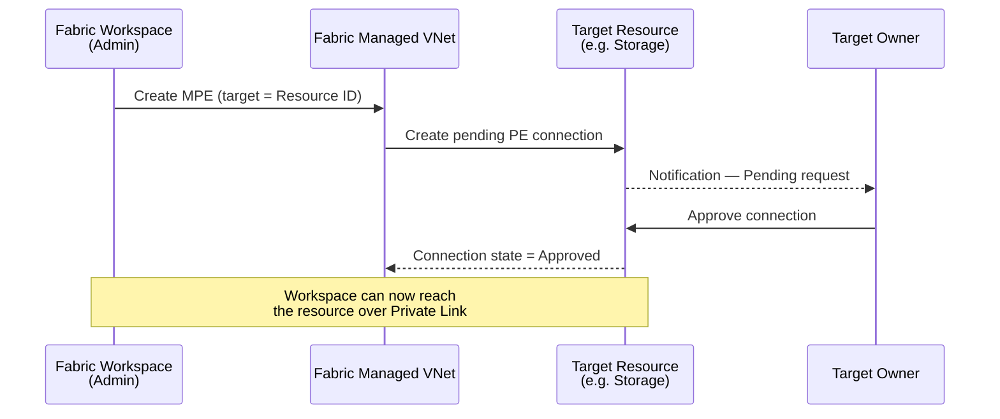
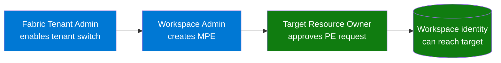

> Quick reference for everything you need **before** creating a **Managed Private Endpoint (MPE)** at the workspace level in Microsoft Fabric — capacity, tenant settings, identity, target resource, networking and approval workflow.

---

## Overview

A **Managed Private Endpoint (MPE)** lets a Fabric workspace reach an Azure data source (Storage, SQL, Key Vault, Synapse, Cosmos DB...) over **Azure Private Link**, without exposing that source to the public Internet. Fabric provisions the endpoint inside its own **managed virtual network** — you do not bring your own VNet, you do not configure DNS, you do not deploy a NIC.

This document focuses on **outbound Fabric → data source** MPEs at the **workspace level**. It is distinct from **tenant-level inbound Private Link** (browser → Fabric), which is a separate feature with different prerequisites.

---

## Capacity & Licensing

| Prerequisite | Detail |
|---|---|
| **Fabric capacity SKU** | **F64 or higher** (or **Fabric Trial**). Lower SKUs (F2–F32) are not supported. |
| **Capacity region** | The capacity must live in a region where the Fabric Data Engineering workload is generally available. |
| **Workspace assignment** | The workspace must be bound to that F64+ capacity. **My Workspace** is not supported. |

> Capacity Units (CUs) are consumed by every active MPE — even when idle — through the workspace's capacity. Plan for it.

---

## Tenant-Level Settings

These two switches are owned by a **Fabric Administrator** in *Admin portal → Tenant settings*:

| Setting | Why it matters |
|---|---|
| **Users can create Fabric items that can have managed private endpoints** | Master switch — without it, the MPE option does not appear in workspace settings. |
| **Block public Internet access** *(optional, recommended)* | Forces every outbound call from the workspace to go through an MPE. Without this, public traffic remains allowed in parallel. |

---

## Azure Subscription Prerequisites

| Prerequisite | Detail |
|---|---|
| **`Microsoft.Network` resource provider** | Must be registered on the subscription that hosts the **target** resource. Run `az provider register --namespace Microsoft.Network` if needed. |
| **No customer VNet, NSG or DNS zone is required on Fabric side** | Fabric runs the MPE inside its managed network. |

---

## Permissions

| Role | On what scope | Why |
|---|---|---|
| **Workspace Admin** (or Member with the right Fabric tenant policy) | The Fabric workspace | Create the MPE entry |
| **Owner** or **Network Contributor** | Target resource (Storage / SQL / etc.) | **Approve** the pending Private Endpoint connection request |
| Data-plane RBAC (`Storage Blob Data Reader`, `SQL DB Reader`, `Key Vault Secrets User`...) | Target resource | Actually read or write data once the network path is open. Typically granted to the Fabric workspace identity or to the user/SP performing the call. |
| **Capacity Admin** | The Fabric capacity | Bind the workspace to F64+ |

> The Microsoft.Network RP registration above also requires **Contributor** on the target subscription.

---

## Target Resource Requirements

The data source you want to reach must:

1. **Support Azure Private Link** and be on the [list of MPE-supported targets](https://learn.microsoft.com/fabric/security/security-managed-private-endpoints-create) — Azure Storage (Blob, ADLS Gen2, File, Queue, Table), Azure SQL Database, Azure Synapse, Azure Cosmos DB, Azure Key Vault, Azure Event Hubs, Azure Service Bus, Azure Databricks, Azure Functions, Azure App Service, plus **custom targets** (any service exposed behind a Private Link Service).
2. Be addressable by its **Azure Resource ID** — Fabric does not accept arbitrary FQDNs for built-in target types.
3. Have an **owner ready to approve** the Private Endpoint connection request (manual unless the resource is configured for auto-approval).
4. Ideally have **public network access disabled**, so that the private path is enforced rather than merely available.

---

## Approval Workflow



Until the target owner approves, the MPE shows **Pending** in the workspace settings and **traffic does not flow**.

---

## Item-Level Compatibility

Not every Fabric item type honors MPEs yet. Validate per workload before designing:

| Fabric item | MPE support |
|---|---|
| Spark Notebook | Supported |
| Spark Job Definition | Supported |
| Lakehouse (via Spark) | Supported |
| Eventstream | Supported (preview on some sources) |
| Eventhouse / KQL Database | Supported |
| Data Pipeline | Depends on the connector — verify per source |
| Data Warehouse | Preview |
| Dataflow Gen2 | Limited |
| Power BI semantic model / report | Limited |
| OneLake Shortcuts to Azure Storage | Not supported via MPE today |

---

## Limits & Operational Considerations

| Topic | Detail |
|---|---|
| **MPE quota** | Default soft limit of **200 MPEs per workspace** and a tenant-level cap. Raise via Microsoft support ticket. |
| **Cost** | Billed in **Fabric Capacity Units** (CUs) consumed by the workspace, not in standard Azure Private Link pricing. Idle endpoints still consume a small baseline. |
| **No Spark Starter Pool** | Workspaces with MPEs cannot use the Spark Starter Pool — Spark sessions take longer to start (cold pool only). |
| **DNS** | Fully managed by Fabric — no customer DNS, no Private DNS Zone, no hosts file to maintain. |
| **Region migration** | Moving a workspace to a capacity in another region may **not preserve** MPE settings — recreate them. |
| **Outbound only** | MPEs only carry traffic *from* Fabric to the target. Inbound user access is governed by the separate tenant-level Private Link. |

---

## Required Personas on the Customer Side

Deploying an MPE is a **multi-team activity**. None of the profiles below can do it alone — at least the Fabric Admin, the Workspace Admin and the Target Resource Owner must coordinate. Map them to your RACI before you start.

| # | Persona | Org / Team (typical) | Responsibility for the MPE | Required role / permission |
|---|---|---|---|---|
| 1 | **Fabric Tenant Administrator** | Data Platform / Power Platform Admins | Enables the tenant switch *"Users can create Fabric items that can have managed private endpoints"*; optionally enables *"Block public Internet access"*. | **Fabric Administrator** Entra role (or Power Platform Administrator / Global Administrator) |
| 2 | **Fabric Capacity Administrator** | Data Platform | Provisions / sizes the F64+ capacity, assigns the workspace to it, monitors CU consumption (MPEs cost CUs). | **Capacity Admin** on the Fabric capacity |
| 3 | **Fabric Workspace Administrator** | Business unit / data product team | Creates the MPE entry in workspace settings, picks the target Resource ID, monitors connection state. | **Admin** (or Member, depending on tenant policy) on the workspace |
| 4 | **Azure Subscription Owner / Cloud Foundation lead** | Cloud Center of Excellence / FinOps | Registers `Microsoft.Network` resource provider on the target subscription; validates landing-zone alignment and chargeback. | **Owner** or **Contributor** at subscription scope |
| 5 | **Target Resource Owner** | Data domain owner (e.g. Finance for SQL DB, ML team for Storage…) | **Approves** the pending Private Endpoint connection request — the workflow blocks until they act. | **Owner** or **Network Contributor** on the target resource |
| 6 | **Network / Security Engineer** | Network or CloudOps team | Confirms the target's Private Link configuration (PE subnet, public access disabled, NSG rules, firewall exceptions), validates DNS strategy on the *target* side. | **Network Contributor** on the target VNet; **Security Reader** for audit |
| 7 | **Identity / IAM Administrator** | Identity team | Grants data-plane RBAC (e.g. `Storage Blob Data Reader`, `Key Vault Secrets User`, `SQL DB Reader`) to the workspace identity or to the calling user/SP. | **User Access Administrator** or **Owner** on the target resource |
| 8 | **Information Security Officer** *(advisory)* | InfoSec / GRC | Validates that public access disablement, Conditional Access, audit logging and data-egress controls meet policy. | Read access on Defender for Cloud / Purview / audit logs |
| 9 | **Data Engineer / Workspace User** *(consumer)* | Business unit | Tests the connection from a Spark notebook, pipeline or eventstream after approval; reports back. | **Contributor** on the workspace |
| 10 | **Service Owner / Product Owner** *(governance)* | Business sponsor | Owns the MPE life-cycle (request, decommission), tracks dependencies in the CMDB. | No technical role — accountable, not responsible |

### Minimum viable team — three people

If you have to ship a single MPE in a hurry, you can collapse the list to **three actors**:



The remaining personas become **must-have at scale** (capacity sizing, IAM hygiene, compliance, FinOps), but are not on the critical path of the very first endpoint.

---

## Pre-Deployment Checklist

```text
Capacity & licensing
  [ ] Workspace on a Fabric SKU >= F64 (or Trial)
  [ ] Capacity in a Fabric Data Engineering supported region

Tenant settings
  [ ] "Users can create Fabric items that can have managed private endpoints" = ON
  [ ] (Recommended) "Block public Internet access" = ON on the workspace

Subscription
  [ ] Microsoft.Network resource provider registered on the target subscription

Permissions
  [ ] Caller has Workspace Admin / Member on the Fabric workspace
  [ ] Owner / Network Contributor available on the target resource for approval
  [ ] Data-plane RBAC granted on the target

Target resource
  [ ] Service is on the MPE-supported targets list
  [ ] Resource ID identified
  [ ] (Recommended) Public network access disabled
  [ ] Approver ready

Workload compatibility
  [ ] Item types you plan to use are confirmed to honor MPEs
```

---

## Annex — Official References

- [Overview of managed private endpoints for Microsoft Fabric](https://learn.microsoft.com/fabric/security/security-managed-private-endpoints-overview)
- [Create and use managed private endpoints in Microsoft Fabric](https://learn.microsoft.com/fabric/security/security-managed-private-endpoints-create)
- [Manage approval of managed private endpoints](https://learn.microsoft.com/fabric/security/security-managed-private-endpoints-manage)
- [Microsoft Fabric features by SKU (Managed Private Endpoints row)](https://learn.microsoft.com/fabric/enterprise/fabric-features)
- [Fabric capacity SKUs and licensing](https://learn.microsoft.com/fabric/admin/capacity-skus)
- [Network security overview for Microsoft Fabric](https://learn.microsoft.com/fabric/security/security-network-security-overview)
- [Tenant-level Private Link (inbound) — overview](https://learn.microsoft.com/fabric/security/security-private-links-overview) *(distinct feature, listed for clarity)*
- [Block public Internet access for the workspace](https://learn.microsoft.com/fabric/security/security-managed-private-endpoints-block-public-internet-access)
- [Trusted workspace access — companion outbound pattern](https://learn.microsoft.com/fabric/security/security-trusted-workspace-access)
- [Azure Private Link — service overview](https://learn.microsoft.com/azure/private-link/private-link-overview)
- [Register an Azure resource provider](https://learn.microsoft.com/azure/azure-resource-manager/management/resource-providers-and-types)
- [Azure RBAC built-in roles — Network Contributor](https://learn.microsoft.com/azure/role-based-access-control/built-in-roles/networking#network-contributor)

### Companion documents in this repo

- [Fabric_Network_Security](Fabric_Network_Security.md) — full inbound + outbound networking story for Fabric
- [Fabric_PrivateLink_MFA_Loop_Resolution](Fabric_PrivateLink_MFA_Loop_Resolution.md) — troubleshooting MFA loops behind tenant-level Private Link
- [SAP_Fabric_Connectivity](SAP_Fabric_Connectivity.md) — SAP connectivity patterns including MPE use cases
