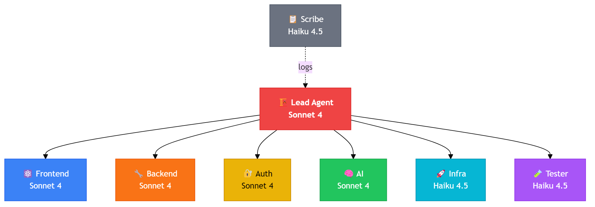
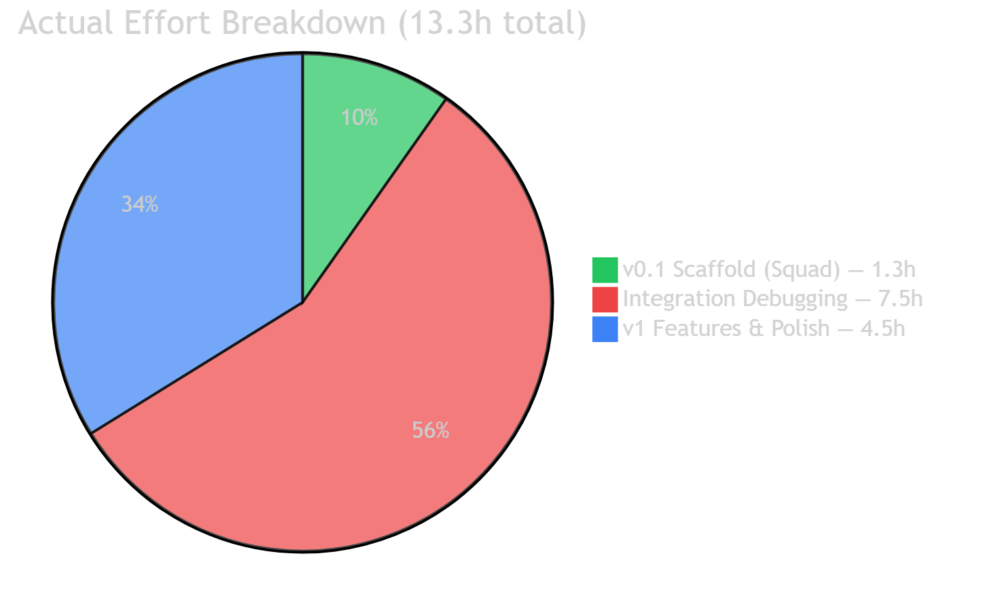
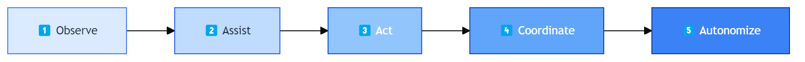

## Context

**Fabric Storyboard Copilot** is a PowerPoint Office Add-in that turns Microsoft Fabric / Power BI content into board-ready slides in two clicks. It browses workspaces, exports report pages as PNG into the active slide, and generates an executive narrative through Azure OpenAI GPT-4o Vision — all from inside PowerPoint Desktop or Web, with single sign-on against the user's Entra identity.

The product itself is interesting. **The way it was built is the real story.** A solo developer assembled a Squad of eight Copilot agents, supervised them with the GitHub Copilot CLI, and shipped a production-grade add-in — Bicep infrastructure, Entra app registration, GPT-4o Vision integration, end-to-end tests, AI code review — in **13.3 hours**. The same scope estimated by traditional methods: **43 man-days**. A **26× compression**.

This document captures both halves: the project (what was built, how it works) and the methodology (Spec Kit → Agent Forge → Squad → Copilot CLI → production). It closes on the broader thesis the project illustrates: **the System Integrator model is collapsing into a System Agency model** — selling outcomes instead of man-days, with margin structure inverting from 30 % to 90 %+.

Source repository: <https://github.com/fredgis/OfficeAddin>.

## End-to-End Architecture


The diagram above traces the complete request path from PowerPoint client to Microsoft Fabric, plus the build pipeline that produced the application. Five lanes:

1. **PowerPoint Client** — Office Add-in taskpane (React 18 + Fluent UI v9), MSAL.js authentication module with SSO and dialog fallback, Office.js APIs for slide manipulation. Distributed as a sideloaded `manifest.xml` or organisation-deployed catalog.
2. **Azure Static Web App (Standard tier)** — hosts both the static bundle and the integrated Azure Functions API. System-assigned managed identity gives the Functions runtime keyless access to Azure OpenAI and Key Vault.
3. **Identity & AI** — Microsoft Entra ID issues delegated tokens for Power BI and Cognitive Services scopes. Azure OpenAI runs a GPT-4o Vision deployment that ingests report PNG + DAX summary statistics and returns a 3-to-5-bullet executive narrative.
4. **Microsoft Fabric / Power BI** — the data plane: Power BI REST API for navigation, Export-to-File API (async PNG export), `executeQueries` for DAX summaries.
5. **Build Pipeline** — Spec Kit captures the structured spec, Agent Forge engineers the context (rules, memory, knowledge), Agent Store provides reusable domain agents, the Squad of eight specialised agents scaffolds and codes, the Copilot CLI handles integration debugging, an AI code-review pass surfaces 19 issues (15 fixed), and `azd up` deploys via Bicep + GitHub Actions.

## 1. The Project — Fabric Storyboard Copilot

### 1.1 What it does


Three core experiences inside the taskpane:

- **Browse & Insert** — list Power BI workspaces and reports the user has access to, expand to page level, click *Insert as image*. The selected page is exported as a PNG via the Power BI Export-to-File API and dropped into the current slide via `Office.js` `addImageFromBase64`.
- **AI Insights** — the same page is sent to GPT-4o Vision along with summary statistics computed from `executeQueries` (DAX). The model returns 3-5 executive bullets which are inserted as a Fluent-styled text box next to the chart.
- **Single sign-on** — MSAL acquires an Entra token using Office SSO when available; falls back to a popup dialog for browsers/tenants that disable nested auth.


### 1.2 Tech stack

| Layer | Technology | Why |
|-------|------------|-----|
| Frontend | React 18 · TypeScript · Fluent UI v9 · MSAL.js | Native Microsoft 365 look; SSO support |
| Backend | Azure Functions v4 (Node.js 20) · Azure SDK | Per-route handlers, OBO token exchange, no key rotation |
| AI | Azure OpenAI · GPT-4o Vision | Multimodal (image + text) one-shot insight generation |
| Identity | Microsoft Entra ID · OAuth 2.0 OBO | Delegated permissions, no client secret in the taskpane |
| Hosting | Azure Static Web App (Standard) | Static + API in one resource; managed identity built in |
| Secrets | Azure Key Vault + System-assigned MSI | RBAC, no API keys in code or settings |
| Observability | Application Insights | Distributed traces taskpane → API → AOAI |
| IaC | Bicep modules · azd · GitHub Actions | One-command provisioning + CI/CD |

### 1.3 Auth flow (OBO)

1. Taskpane calls `OfficeRuntime.auth.getAccessToken({ allowSignInPrompt: true })` (SSO) or falls back to `OfficeRuntime.auth.openDialog` (popup).
2. The Entra access token is sent to the Functions API in a custom header `X-Fabric-Storyboard-Authorization` — Static Web App overwrites the standard `Authorization` header, so we use a custom one.
3. The `authMiddleware` validates the JWT using `jsonwebtoken` + `jwks-rsa`.
4. `authService.acquireTokenOnBehalfOf(...)` exchanges that token for a Power BI or Azure OpenAI access token using the OBO flow.
5. Downstream calls (Power BI REST, Export API) use the OBO token. Azure OpenAI uses `DefaultAzureCredential` (managed identity), not OBO — Vision is treated as a service capability, not a per-user resource.

```javascript
// api/middleware/auth.js — verified JWT, returned in req.user
const decoded = jwt.verify(token, getKey, {
  audience: process.env.ENTRA_API_AUDIENCE,
  issuer: `https://login.microsoftonline.com/${tenantId}/v2.0`,
  algorithms: ['RS256']
});
req.user = decoded;
req.userToken = token; // forwarded to OBO
```

### 1.4 One-click deployment

```powershell
.\deploy.ps1 -EnvName fabric-storyboard-prod -Location westeurope
# → azd provision (Bicep)
# → Entra app registration + scope grant
# → manifest.xml regeneration with deployed URLs
# → azd deploy (SWA + Functions)
# → smoke test /api/health
```


## 2. How It Was Built — The Squad

### 2.1 Eight specialised agents



The Squad is a roster of eight Copilot agents, each with a narrow role, tuned model, and curated context. Models are picked per role: heavy reasoning runs on Sonnet 4 / Opus 4.6, repetitive structural work runs on Haiku 4.5.

| Agent | Model | Mission |
|-------|-------|---------|
| Lead | Sonnet 4 | Spec interpretation, task decomposition, coordination |
| Frontend | Sonnet 4 | React 18 + Fluent UI v9 components, Office.js calls |
| Backend | Sonnet 4 | Azure Functions endpoints, service layer, error handling |
| Auth | Sonnet 4 | MSAL + Entra OBO, JWT validation, scope management |
| AI | Sonnet 4 | Prompt engineering, GPT-4o Vision integration |
| Infra | Haiku 4.5 | Bicep modules, RBAC, Key Vault, App Insights |
| Tester | Haiku 4.5 | 68 Jest + Playwright tests, fixtures, mocks |
| Scribe | Haiku 4.5 | README, architecture docs, deployment guide |
| Coordinator | Opus 4.6 | Cross-agent integration, conflict resolution |

### 2.2 Timeline — 13.3 hours, end to end



| Phase | Duration | What happened |
|-------|----------|---------------|
| Spec & Forge | 1.0 h | Spec Kit document, agent context engineering |
| Squad scaffold | 1.3 h | Eight agents in parallel — first compileable scaffold |
| Integration | 7.5 h | Copilot CLI debugging the seams between agent outputs |
| V1 features | 4.5 h | AI Insights, polish, telemetry, copy refinement |
| Code review | 0.5 h | Four parallel review agents, 19 findings, 15 fixes |
| Deploy | 0.5 h | `azd up`, manifest regeneration, smoke test |
| **Total** | **13.3 h** | vs **43 man-days** estimated traditionally |

The headline number masks where the work actually lives: **scaffold is fast, integration is slow.** Eight agents in parallel produce eight locally-correct fragments that don't always agree on contracts. Most of the 7.5 h integration phase was the Copilot CLI tracing why a JWT validated in one place was rejected in another, why a Bicep output didn't flow into an app setting, why the SWA dropped the `Authorization` header.

### 2.3 The integration bugs that ate the day

A representative sample of issues that the Squad produced and the CLI had to resolve:

1. **SWA strips `Authorization`.** Static Web App's auth proxy reserves the header for its own EasyAuth product. Solution: custom header `X-Fabric-Storyboard-Authorization`, validated in middleware.
2. **`@Microsoft.KeyVault()` not supported on SWA.** App settings can't reference Key Vault on Static Web App (works on App Service / Functions Premium). Solution: read the secret at provisioning time and inject as plain app setting; runtime calls Vault directly via MSI.
3. **Bicep circular dependency** between the SWA module (needed Entra app ID) and the Entra module (needed SWA URL for redirect URIs). Solution: two-pass deployment — SWA first with placeholder, Entra second, SWA app settings updated at the end.
4. **Office.js `addImageFromBase64` size limit** (~ 1 MB). Solution: PNG resize to 1600 px wide before insertion.
5. **OBO refresh on long-running export.** Power BI Export-to-File can take 10-60 s; the user token can expire mid-poll. Solution: cache the OBO token and refresh once on `401`.

### 2.4 AI code review

Four parallel review agents (security, performance, style, architecture) ran on the final tree:

- **19 issues raised** — 6 security (e.g. JWT issuer not pinned in dev mode), 5 performance (missing memoisation in workspace tree), 4 style, 4 architecture.
- **15 fixed** within the same session. The 4 deferred were design decisions (e.g. "consider distributed cache" — out of scope for v1).

## 3. The Tooling Ecosystem

### 3.1 Copilot CLI as the conductor


The Copilot CLI plays a different role than the Squad agents. The Squad produces code; the CLI **integrates, debugs, and iterates** with the developer in the loop. It is the conductor sitting between the human intent and the chorus of specialised agents.

### 3.2 Spec Kit, Agent Forge, Agent Store


- **Spec Kit** — structured markdown spec (problem, scope, contracts, acceptance criteria). The deliverable is the spec; the code is generated from it. Spec-first inverts the traditional flow.
- **Agent Forge** — context engineering: rules, memory, knowledge base, MCP server bindings. The forge produces the agent definition; the agent produces the code.
- **Agent Store** — reusable domain agents (Auth, Power BI, Fluent UI, Bicep). Pulled into the Squad for any project that touches the same surface area. Compounds across projects.

### 3.3 Fleet vs Squad



| Pattern | When | Example |
|---------|------|---------|
| **Solo** | One agent, one task | "Add a settings page" |
| **Squad** | 5-10 agents, one project | This add-in: 8 agents, 13.3 h |
| **Fleet** | 50-500 agents, one programme | Enterprise migration: per-team Squads, shared Agent Store |

Squads compose into Fleets. The same agent definitions, memory, and review pipeline scale from one developer to an enterprise programme.

### 3.4 Agents vs Skills

- **Agents** are autonomous, model-driven, with tools and memory. They reason, plan, ask questions.
- **Skills** are declarative scripts the agent calls. They are deterministic and cheap.

The right pattern is Agent + Skill: the agent reasons about *what* and *why*, the skill executes the *how* reproducibly.

## 4. The Cost Model


### 4.1 Premium requests

The Copilot subscription bills on **premium requests** — heavy-reasoning calls (Opus, Sonnet thinking modes). Repetitive structural work (Haiku) is much cheaper. Optimising the model mix is half the cost story; the other half is **caching, RAG, and prompt economy**.

### 4.2 Cost comparison

| | Traditional SI | System Agency |
|---|---|---|
| Effort | 43 man-days | 13.3 h human + agent compute |
| Loaded cost | ~ $31,000 (3 senior devs × 5 days × $720 + 2 specialists × $720 × 4 + PM 2 days) | ~ $2,340 ($1,800 compute + $540 human) |
| Margin | ~ 30 % on T&M | ~ 92 % on outcome billing |
| Lead time | 6-8 weeks calendar | 2 days |

Numbers are illustrative — they vary by project and by how much of the Agent Store is reusable. The structure does not.

## 5. From SI to System Agency

### 5.1 The shift

The classic System Integrator sells **man-days**. The economics work when delivery cost ≈ delivery price minus ~30 % margin. Generative agents drop the delivery cost by an order of magnitude. If the price stays anchored to man-days, margins collapse to zero. If the price anchors to **outcomes**, margins explode.

That is the System Agency model: **price the outcome, not the input.**

### 5.2 Why now

Four converging forces:

1. **Models** — Sonnet 4 / Opus 4.6 / Haiku 4.5 cross the threshold for full feature delivery, not just code completion.
2. **Tooling** — Copilot CLI, Spec Kit, MCP, Agent Store make Squad orchestration accessible to a single developer.
3. **Buyer expectation** — clients have started benchmarking AI-augmented vendors against traditional ones. The price gap is becoming visible.
4. **Talent** — senior engineers gravitate towards agency models where they capture upside.

### 5.3 Old world vs new world

| | Old (SI) | New (System Agency) |
|---|---|---|
| Unit | Man-day | Outcome / feature |
| Pricing | Time & materials | Fixed-price per outcome |
| Margin | 25-35 % | 70-90 % |
| Team | 5-50 humans | 1 human + Squad of agents |
| Differentiator | Headcount | Agent Store + IP |
| Sales cycle | RFP, proposals | Show, don't tell |

### 5.4 Three phases

1. **Copilot phase** — agents assist humans. Productivity 2-3×. Most teams are here.
2. **Agency phase** — agents deliver outcomes; humans supervise. Productivity 10-30×. This project sits here.
3. **Autonomous phase** — agents close the full loop with the customer; humans set strategy. Productivity 100×+. Emerging.

### 5.5 Encoding IP

The competitive moat shifts from *people* to **agent definitions, prompts, knowledge bases, and Skills**. Every project enriches the Agent Store. Every Spec Kit becomes a template. Every fix in code review becomes a memory. Compounding is the new differentiator.

### 5.6 Emerging roles

- **Spec Author** — translates business intent into Spec Kit documents.
- **Agent Engineer** — designs, forges, and maintains agents.
- **Conductor / Squad Lead** — orchestrates agents through the CLI.
- **Reviewer** — domain expert who validates outcomes; not a line-by-line code reviewer.
- **Rainmaker** — sells outcomes, not headcount.

### 5.7 Getting started

1. Pick one **non-critical** project. Run it end-to-end with a Squad.
2. Capture **everything** — prompts, agent definitions, memories, fixes — in the Agent Store.
3. Re-use on the second project. Measure compression.
4. After three projects, refactor the Store. Promote the most-reused agents to first-class.
5. Start pricing the **fourth** project on outcome.

### 5.8 Lessons learned

- **Scaffold is free, integration is the work.** Plan time accordingly.
- **Pick the right model per role.** Haiku for structure, Sonnet/Opus for reasoning.
- **AI code review is non-negotiable.** Four parallel agents catch what one human misses.
- **The CLI is the conductor.** Don't let the agents run unsupervised on critical paths.
- **Spec quality dominates.** A bad spec produces eight bad agents in parallel.

## 6. Conclusion

A working PowerPoint add-in, fully integrated with Microsoft Fabric, GPT-4o Vision, Entra ID, Bicep, and CI/CD — built in **13.3 hours** by **one developer** orchestrating **eight agents**. The artefact matters less than the production system that made it possible: Spec Kit, Agent Forge, Squad, Copilot CLI, Agent Store, Fleet.

The same playbook scales. The compression is real. The margin shift is structural. The System Integrator model is not dead — but the System Agency model is what wins the next decade.

## Resources

- Source repository — <https://github.com/fredgis/OfficeAddin>
- GitHub Copilot CLI — <https://github.com/github/gh-copilot>
- Spec Kit — <https://github.com/github/spec-kit>
- Microsoft Fabric — <https://learn.microsoft.com/fabric/>
- Power BI Export API — <https://learn.microsoft.com/rest/api/power-bi/reports/export-to-file>
- Office Add-ins (manifest, taskpane, SSO) — <https://learn.microsoft.com/office/dev/add-ins/>
- Azure OpenAI GPT-4o Vision — <https://learn.microsoft.com/azure/ai-services/openai/concepts/gpt-with-vision>
- Static Web App auth — <https://learn.microsoft.com/azure/static-web-apps/authentication-authorization>
