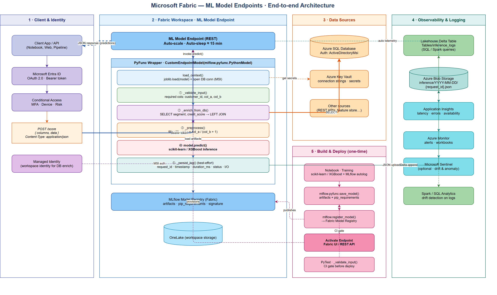
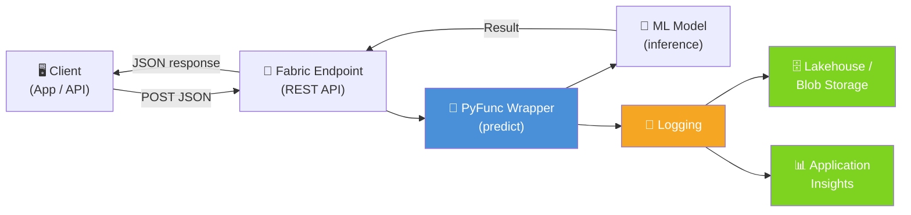
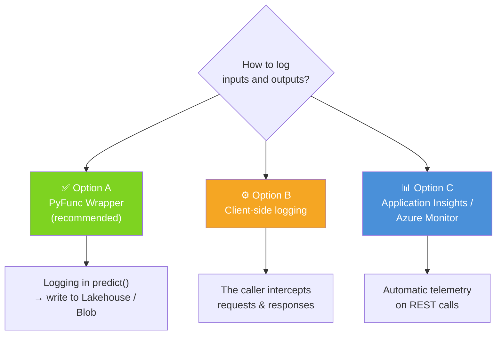
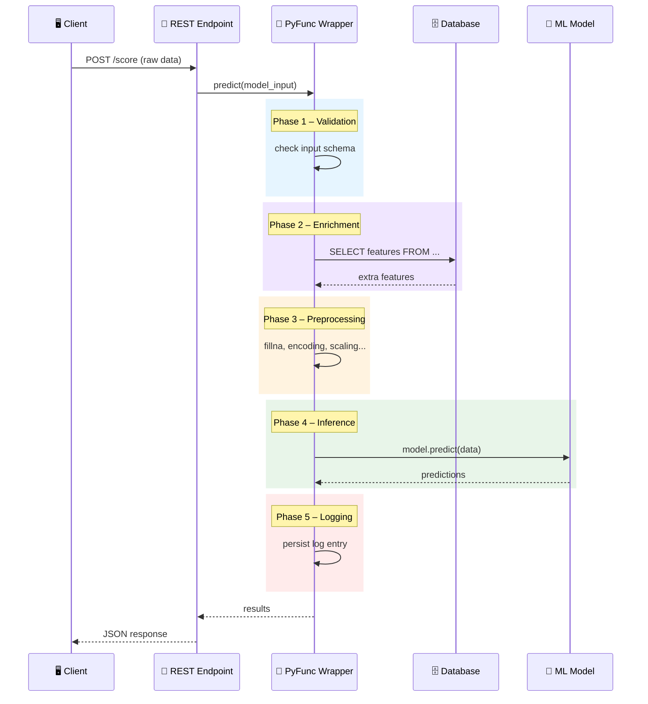
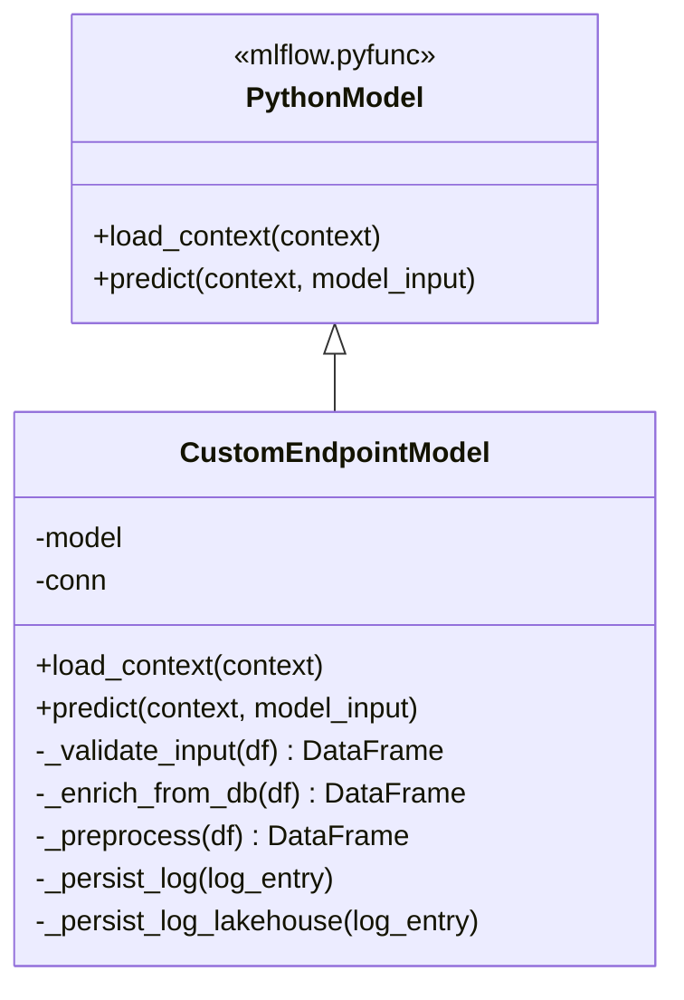
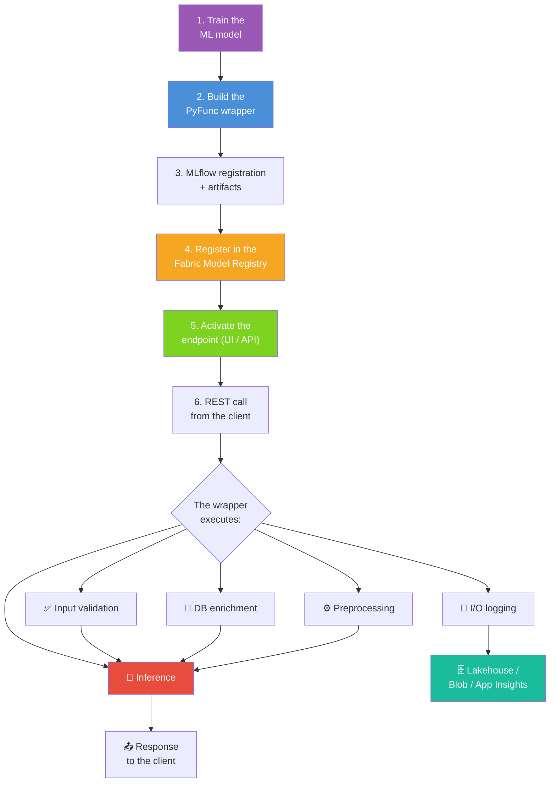
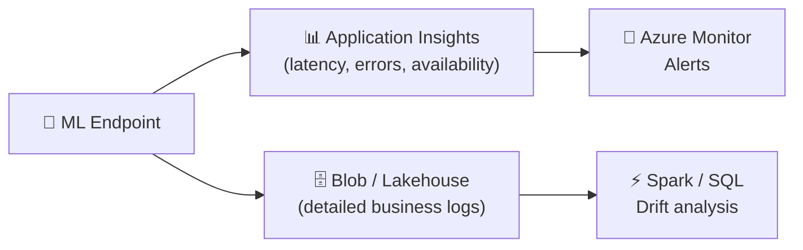

> **Context**: This document answers frequently asked questions about using **ML Model Endpoints (Preview)** in Microsoft Fabric for real-time inference. It covers systematic input/output logging, customizing endpoints with an MLflow PyFunc wrapper, and provides complete, ready-to-adapt code examples.

---

## 🏛️ End-to-end Architecture

The diagram below summarizes the end-to-end architecture covered by this document: client/identity flow, Fabric workspace with the ML Model Endpoint and the PyFunc wrapper internals (5 phases), data sources accessed with managed identity, observability and logging targets, and the one-time build & deploy pipeline.

{width=100%}

---

## 💬 Context

> This document addresses three key challenges encountered when using **ML Model Endpoints (Preview)** in Microsoft Fabric:
>
> 1. **How to set up systematic input/output logging** for auto-deployed endpoints, and which persistence method to favor in Fabric.
> 2. **How to customize endpoint behavior** to embed preprocessing, database calls, or any other business logic around inference.
> 3. **Which concrete code examples** make it possible to implement these solutions end to end.

**Short answers**:
- ✅ **I/O logging** → The recommended approach is to use an **`mlflow.pyfunc.PythonModel` wrapper** that intercepts inputs and outputs in the `predict()` method and persists them to a **Lakehouse**, **Azure Blob Storage**, or **Application Insights**.
- ✅ **Customization (preprocessing, DB calls)** → Yes, the official method is the **MLflow PyFunc wrapper**. It is the main extension point in the Fabric ML Model Endpoints architecture.
- ✅ **Examples** → This document contains complete, commented code examples.

---

## 📌 Table of Contents

1. [Endpoint input/output logging](#1--endpoint-inputoutput-logging)
2. [Endpoint customization (preprocessing, DB calls)](#2--endpoint-customization-preprocessing-db-calls)
3. [End-to-end workflow](#3--end-to-end-workflow)
4. [Production best practices](#4--production-best-practices)
5. [Calling the endpoint over REST](#5--calling-the-endpoint-over-rest)
6. [Unit tests (PyTest)](#6--unit-tests-pytest)

---

## 1. 📋 Endpoint input/output logging

### Why log?

| Reason | Detail |
|---|---|
| **Audit & compliance** | Track who requested what, when, and with which model version |
| **Debugging** | Reproduce an unexpected result by replaying the input |
| **Drift monitoring** | Detect a change in the distribution of inputs or outputs |
| **Billing / metrics** | Count calls, measure latency |

### Recommended architecture



### The 3 possible options



| Option | Pros | Cons |
|---|---|---|
| **A – PyFunc Wrapper** ⭐ | Full control, access to raw and transformed data, same workspace | Adds latency if writing synchronously |
| **B – Client side** | No model changes required | Does not capture internal transformations |
| **C – Application Insights** | Automatic telemetry, Azure Monitor alerts | Less payload-level detail, possible cost |

> 💡 **Recommendation**: Combine A + C. The wrapper for detailed business logging, Application Insights for infrastructure monitoring (latency, HTTP errors, availability).

### Code example – Option A (recommended)

```python
import mlflow.pyfunc
import pandas as pd
import json
import datetime
import uuid
import logging

logger = logging.getLogger(__name__)

class LoggedModel(mlflow.pyfunc.PythonModel):
    """
    PyFunc wrapper that:
    1. Loads the model from artifacts
    2. Runs inference
    3. Persists a structured log (inputs + outputs) to Azure Blob Storage
    """

    def load_context(self, context):
        import joblib
        self.model = joblib.load(context.artifacts["model"])
        logger.info("Model loaded successfully")

    def predict(self, context, model_input: pd.DataFrame):
        request_id = str(uuid.uuid4())
        start_time = datetime.datetime.utcnow()

        # --- Inference ---
        predictions = self.model.predict(model_input)

        # --- Build the log entry ---
        log_entry = {
            "request_id": request_id,
            "timestamp": start_time.isoformat(),
            "duration_ms": (datetime.datetime.utcnow() - start_time).total_seconds() * 1000,
            "model_name": "MyModel",
            "input_shape": list(model_input.shape),
            "input": model_input.to_dict(orient="records"),
            "output": predictions.tolist()
        }

        # --- Asynchronous persistence (best-effort) ---
        try:
            self._persist_log(log_entry)
        except Exception as e:
            logger.error(f"Logging failed for {request_id}: {e}")

        return predictions

    def _persist_log(self, log_entry):
        """Write the log as JSON to Azure Blob Storage."""
        from azure.storage.blob import BlobServiceClient

        # In production, use a secret manager (Key Vault)
        # rather than a hard-coded connection string
        conn_str = self._get_connection_string()
        client = BlobServiceClient.from_connection_string(conn_str)

        # Partition by date to make queries easier
        ts = log_entry["timestamp"][:10]  # YYYY-MM-DD
        blob_name = f"inference/{ts}/{log_entry['request_id']}.json"

        blob = client.get_blob_client("logs", blob_name)
        blob.upload_blob(json.dumps(log_entry, default=str), overwrite=True)

    def _get_connection_string(self):
        """
        Retrieve the connection string from Azure Key Vault.
        In production, replace with a Key Vault call or an environment variable.
        """
        import os
        return os.environ.get("BLOB_CONN_STRING", "DefaultEndpointsProtocol=https;...")
```

### Variant – Logging to the Fabric Lakehouse

> ℹ️ This method is now built directly into the `CustomEndpointModel` class via `_persist_log_lakehouse()` (see [§2](#2--endpoint-customization-preprocessing-db-calls)). Here is the standalone version for reference:

```python
def _persist_log_lakehouse(self, log_entry):
    """Write the log directly to a Delta table in the Fabric Lakehouse.
    Useful if you want to query the logs with SQL / Spark.
    """
    from pyspark.sql import SparkSession
    spark = SparkSession.builder.getOrCreate()

    df = spark.createDataFrame([log_entry])
    df.write.format("delta").mode("append").save(
        "Tables/inference_logs"
    )
```

---

## 2. 🔧 Endpoint customization (preprocessing, DB calls)

### Why a PyFunc wrapper?

Fabric ML Model Endpoints execute an MLflow model. To customize behavior (enrichment, preprocessing, post-processing), the official method is to **wrap the model in an `mlflow.pyfunc.PythonModel` class** and override the `predict()` method.

This makes it possible to:
- 🔌 **Enrich** data by calling a database or an API
- ⚙️ **Transform** features (fillna, encoding, scaling…)
- 📝 **Log** inputs and outputs
- 🛡️ **Validate** inputs before inference
- 📊 **Post-process** predictions (calibration, thresholds, business rules)

### Execution flow inside the wrapper



### The 10 design requirements of the `CustomEndpointModel` class

The `CustomEndpointModel` class inherits from `mlflow.pyfunc.PythonModel` and implements a complete inference pipeline. Here are the 10 requirements that this class must satisfy:

| # | Requirement | Method | Description |
|---|---|---|---|
| 1 | **Input validation** | `_validate_input()` | Checks that all expected columns (`customer_id`, `col_a`, `col_b`) are present in the input DataFrame. Raises an explicit `ValueError` if columns are missing. |
| 2 | **SQL enrichment via managed identity** | `_enrich_from_db()` | Queries a SQL Server database via `pyodbc` using `ActiveDirectoryMsi` authentication (Azure managed identity). Retrieves extra features (`segment`, `credit_score`) and merges them with the input data. |
| 3 | **Data preprocessing** | `_preprocess()` | Applies transformations before inference: missing-value replacement (`fillna(0)`) and computation of new features (e.g. `ratio = col_a / (col_b + 1)`). |
| 4 | **scikit-learn inference** | `predict()` + `load_context()` | Loads the scikit-learn model from the MLflow artifacts via `joblib.load()` in `load_context()`, then calls `model.predict()` in `predict()`. |
| 5 | **Logging to Azure Blob Storage** | `_persist_log()` | Persists a structured log in JSON format to Azure Blob Storage. Each log contains: `request_id`, `timestamp`, `duration_ms`, inputs, outputs, status, and any errors. Partitioning is done by date (`inference/YYYY-MM-DD/<uuid>.json`). |
| 6 | **Traceability via `logging`** | All methods | Uses the standard `logging` library to trace key steps: model loading, DB connection initialization, start/end of inference, errors encountered. |
| 7 | **Robust error handling** | `predict()`, `_enrich_from_db()`, `_persist_log()` | Wraps critical calls (DB, enrichment, logging) in `try/except` blocks. Logging is best-effort: a logging failure does not block the response. DB enrichment errors are also captured and traced. |
| 8 | **Alternative Fabric Lakehouse logging** | `_persist_log_lakehouse()` | Alternative method that writes the logs to a Delta table in the Fabric Lakehouse via Spark, making it possible to query them with SQL/Spark. |
| 9 | **Explanatory docstrings** | All methods | Each method has a docstring describing its role, parameters, return values, and exceptions raised. |
| 10 | **PyTest unit test** | `test_validate_input()` | A PyTest test validates the behavior of `_validate_input()`: nominal case (columns present) and error case (missing columns → `ValueError`). See [§6](#6--unit-tests-pytest). |

### Wrapper structure



### Complete code example

> ℹ️ This code implements the **10 requirements** listed above. Each method is documented and the `try/except` blocks ensure robust error handling.

```python
import mlflow.pyfunc
import pandas as pd
import datetime
import uuid
import json
import logging

logger = logging.getLogger(__name__)

class CustomEndpointModel(mlflow.pyfunc.PythonModel):
    """
    MLflow PyFunc wrapper for a custom endpoint in Microsoft Fabric.

    This class inherits from mlflow.pyfunc.PythonModel and implements a complete
    inference pipeline with:
      1. Input data validation (expected columns).
      2. Enrichment via a SQL Server database (Azure managed identity / pyodbc).
      3. Preprocessing (fillna, ratio computation).
      4. Inference with a scikit-learn model loaded from artifacts.
      5. Structured logging (JSON) to Azure Blob Storage.
      6. Traceability via the logging library.
      7. Robust error handling (best-effort try/except).
      8. Alternative method _persist_log_lakehouse() to write to a Fabric Lakehouse.

    Attributes:
        model: The scikit-learn model loaded from artifacts.
        conn: The pyodbc connection to SQL Server (managed identity).
    """

    def load_context(self, context):
        """
        Load the scikit-learn model and initialize the database connection.

        This method is called once by MLflow when the endpoint is loaded. It loads
        the model from artifacts (joblib) and opens a persistent connection to
        SQL Server using ActiveDirectoryMsi authentication (Azure managed identity).

        Args:
            context: MLflow context containing the artifacts and configuration.

        Raises:
            FileNotFoundError: If the model artifact cannot be found.
            pyodbc.Error: If the database connection fails.
        """
        import joblib
        import pyodbc

        # Load the scikit-learn model from artifacts
        logger.info("Loading the model from artifacts...")
        self.model = joblib.load(context.artifacts["model"])
        logger.info("scikit-learn model loaded successfully")

        # DB connection with Azure managed identity (initialized only once)
        # In production: use Key Vault for the connection parameters
        try:
            self.conn = pyodbc.connect(
                "DRIVER={ODBC Driver 18 for SQL Server};"
                "SERVER=myserver.database.windows.net;"
                "DATABASE=mydb;"
                "Authentication=ActiveDirectoryMsi"  # Auth via managed identity
            )
            logger.info("DB connection initialized (ActiveDirectoryMsi)")
        except Exception as e:
            logger.error(f"DB connection failed: {e}")
            self.conn = None  # The model can run without DB enrichment

    def _validate_input(self, df: pd.DataFrame) -> pd.DataFrame:
        """
        Validate that the input DataFrame contains all the expected columns.

        Checks that the required columns are present: 'customer_id', 'col_a', 'col_b'.
        Raises a ValueError listing the missing columns if validation fails.

        Args:
            df (pd.DataFrame): The input DataFrame to validate.

        Returns:
            pd.DataFrame: The validated DataFrame (unchanged when validation succeeds).

        Raises:
            ValueError: If one or more required columns are missing.
        """
        required_cols = {"customer_id", "col_a", "col_b"}
        missing = required_cols - set(df.columns)
        if missing:
            logger.error(f"Missing columns: {missing}")
            raise ValueError(f"Missing columns: {missing}")
        logger.info("Input column validation succeeded")
        return df

    def _enrich_from_db(self, df: pd.DataFrame) -> pd.DataFrame:
        """
        Enrich the data by querying a SQL Server database via managed identity.

        Retrieves extra features (segment, credit_score) from the 'customers'
        table and merges them (LEFT JOIN) with the input DataFrame. If the DB
        connection is unavailable or the query fails, returns the original
        DataFrame without enrichment (degraded mode).

        Args:
            df (pd.DataFrame): The DataFrame containing at least the 'customer_id' column.

        Returns:
            pd.DataFrame: The DataFrame enriched with the 'segment' and 'credit_score'
                          columns, or the original DataFrame on error.
        """
        if self.conn is None:
            logger.warning("No DB connection - enrichment skipped")
            return df

        try:
            ids = tuple(df["customer_id"].tolist())
            if len(ids) == 1:
                ids = f"({ids[0]})"  # Handle the single-element tuple case

            query = f"""
                SELECT customer_id, segment, credit_score
                FROM customers
                WHERE customer_id IN {ids}
            """
            extra_features = pd.read_sql(query, self.conn)
            enriched = df.merge(extra_features, on="customer_id", how="left")
            logger.info(f"DB enrichment succeeded ({len(extra_features)} rows retrieved)")
            return enriched
        except Exception as e:
            logger.error(f"Error during DB enrichment: {e}")
            return df  # Degraded mode: continue without enrichment

    def _preprocess(self, df: pd.DataFrame) -> pd.DataFrame:
        """
        Apply preprocessing transformations before inference.

        Operations performed:
          - Replace missing values with 0 (fillna).
          - Compute a derived feature: ratio = col_a / (col_b + 1).

        Args:
            df (pd.DataFrame): The enriched DataFrame to preprocess.

        Returns:
            pd.DataFrame: The preprocessed DataFrame, ready for inference.
        """
        df = df.fillna(0)
        df["ratio"] = df["col_a"] / (df["col_b"] + 1)
        logger.info("Preprocessing applied (fillna + ratio)")
        return df

    def predict(self, context, model_input: pd.DataFrame):
        """
        Run the full pipeline: validation -> enrichment -> preprocessing -> inference -> logging.

        Orchestrates the 5 phases of the pipeline. Each critical phase is wrapped in
        a try/except block to ensure robustness. Logging is best-effort: a log
        persistence failure does not block the response to the client.

        Args:
            context: MLflow context (not used directly inside predict).
            model_input (pd.DataFrame): The input data sent by the client.

        Returns:
            numpy.ndarray: The model predictions.

        Raises:
            ValueError: If input validation fails (missing columns).
        """
        request_id = str(uuid.uuid4())
        start = datetime.datetime.utcnow()
        error_msg = None
        predictions = None

        try:
            # Phase 1 - Validation
            validated = self._validate_input(model_input)

            # Phase 2 - Enrichment (best-effort, degraded mode if DB unavailable)
            enriched = self._enrich_from_db(validated)

            # Phase 3 - Preprocessing
            processed = self._preprocess(enriched)

            # Phase 4 - Inference
            predictions = self.model.predict(processed)
            logger.info(f"Inference succeeded for {request_id} ({len(predictions)} predictions)")

        except ValueError:
            raise  # Validation error -> propagate to the client
        except Exception as e:
            error_msg = str(e)
            logger.error(f"Pipeline error for {request_id}: {e}")
            raise

        finally:
            # Phase 5 - Logging (best-effort, never blocks the response)
            duration_ms = (datetime.datetime.utcnow() - start).total_seconds() * 1000
            log_entry = {
                "request_id": request_id,
                "timestamp": start.isoformat(),
                "duration_ms": duration_ms,
                "input_rows": len(model_input),
                "input": model_input.to_dict(orient="records"),
                "output": predictions.tolist() if predictions is not None else None,
                "status": "success" if error_msg is None else "error",
                "error": error_msg
            }
            try:
                self._persist_log(log_entry)
            except Exception as log_err:
                logger.error(f"Logging failed for {request_id}: {log_err}")

        return predictions

    def _persist_log(self, log_entry):
        """
        Persist the inference log as JSON to Azure Blob Storage.

        The log is partitioned by date (YYYY-MM-DD) and named by request_id
        to make querying and auditing easier.

        Blob structure: inference/<YYYY-MM-DD>/<request_id>.json

        Args:
            log_entry (dict): Dictionary containing the log data
                              (request_id, timestamp, duration_ms, input, output, status, error).

        Raises:
            Exception: If writing to Blob Storage fails.
        """
        from azure.storage.blob import BlobServiceClient
        import os

        conn_str = os.environ.get("BLOB_CONN_STRING")
        if not conn_str:
            logger.warning("BLOB_CONN_STRING not set - Blob logging skipped")
            return

        client = BlobServiceClient.from_connection_string(conn_str)
        ts = log_entry["timestamp"][:10]  # YYYY-MM-DD
        blob_name = f"inference/{ts}/{log_entry['request_id']}.json"
        blob = client.get_blob_client("logs", blob_name)
        blob.upload_blob(json.dumps(log_entry, default=str), overwrite=True)
        logger.info(f"Log persisted to Blob Storage: {blob_name}")

    def _persist_log_lakehouse(self, log_entry):
        """
        Alternative method: persist the log to a Delta table in the Fabric Lakehouse.

        Uses PySpark to write the log to the 'Tables/inference_logs' table in
        Delta format, in append mode. This makes it possible to query the logs
        with SQL Analytics or Spark in Fabric.

        Args:
            log_entry (dict): Dictionary containing the log data
                              (request_id, timestamp, duration_ms, input, output, status, error).

        Raises:
            Exception: If writing to the Lakehouse fails.
        """
        try:
            from pyspark.sql import SparkSession
            spark = SparkSession.builder.getOrCreate()

            df = spark.createDataFrame([log_entry])
            df.write.format("delta").mode("append").save("Tables/inference_logs")
            logger.info("Log persisted to the Fabric Lakehouse (Delta)")
        except Exception as e:
            logger.error(f"Lakehouse write failed: {e}")
```

### Registration and deployment

```python
import mlflow

# 1. Define the artifacts (trained model + optionally a scaler, encoder, etc.)
artifacts = {
    "model": "path/to/trained_model.joblib"
}

# 2. Save the wrapped model
mlflow.pyfunc.save_model(
    path="custom_endpoint_model",
    python_model=CustomEndpointModel(),
    artifacts=artifacts,
    pip_requirements=[
        "pandas",
        "scikit-learn",
        "pyodbc",
        "joblib",
        "azure-storage-blob"
    ]
)

# 3. Register in the Fabric Model Registry
mlflow.register_model(
    "runs:/<run_id>/custom_endpoint_model",
    "MyCustomModel"
)

# 4. Activate the endpoint from the Fabric UI:
#    Model Registry -> MyCustomModel -> "Create ML Model Endpoint"
#    Or via the Fabric REST API
```

---

## 3. 🚀 End-to-end workflow



### Detailed steps

| Step | Action | Tool |
|---|---|---|
| 1 | Train the model (scikit-learn, XGBoost, etc.) | Fabric notebook + MLflow autolog |
| 2 | Build the `CustomEndpointModel(PythonModel)` class | Fabric notebook |
| 3 | `mlflow.pyfunc.save_model(...)` with artifacts and dependencies | MLflow |
| 4 | `mlflow.register_model(...)` in the Model Registry | MLflow / Fabric UI |
| 5 | Create the endpoint from the UI or the REST API | Fabric UI / API |
| 6 | Call via `POST https://<endpoint-url>/score` | HTTP client |

---

## 4. 🛡️ Production best practices

### Security

| Practice | Detail |
|---|---|
| **Do not store secrets in code** | Use Azure Key Vault or Fabric environment variables |
| **Managed authentication** | Prefer `Authentication=ActiveDirectoryMsi` for DB connections |
| **PII masking** | Do not log personal data in clear text (names, emails, etc.) |
| **RBAC** | Configure Contributor+ roles for endpoint access |

### Performance & reliability

| Practice | Detail |
|---|---|
| **Asynchronous / best-effort logging** | Do not block inference if logging fails |
| **Connection pooling** | Initialize the DB connection in `load_context()`, not in `predict()` |
| **Auto-sleep** | Fabric endpoints go to sleep after inactivity (~15 min). The first call after sleep takes ~30s. Plan a health check / warm-up if critical |
| **Timeouts** | Add timeouts on DB calls to avoid blocking |
| **MLflow signature** | Always set `infer_signature()` to avoid schema errors at inference time |

### Logging - Recommended fields

```json
{
  "request_id": "uuid-v4",
  "timestamp": "2026-03-12T14:30:00.000Z",
  "model_name": "MyModel",
  "model_version": "3",
  "duration_ms": 42.5,
  "input_rows": 1,
  "input": [{"customer_id": 123, "col_a": 10, "col_b": 5}],
  "output": [0.87],
  "status": "success",
  "error": null
}
```

### Recommended monitoring



---

## 5. 📡 Calling the endpoint over REST

### Python example (client)

```python
import requests

# Endpoint URL (visible in the Fabric UI after activation)
url = "https://<workspace>.fabric.microsoft.com/api/v1/workspaces/<ws-id>/mlmodels/<model-id>/score"

# Authentication via Azure AD token
headers = {
    "Authorization": "Bearer <access-token>",
    "Content-Type": "application/json"
}

# Inference payload
payload = {
    "input_data": {
        "columns": ["customer_id", "col_a", "col_b"],
        "data": [[123, 10.0, 5.0]]
    }
}

response = requests.post(url, json=payload, headers=headers)
print(response.json())
```

### cURL example

```bash
curl -X POST \
  "https://<workspace>.fabric.microsoft.com/api/v1/workspaces/<ws-id>/mlmodels/<model-id>/score" \
  -H "Authorization: Bearer <access-token>" \
  -H "Content-Type: application/json" \
  -d '{
    "input_data": {
        "columns": ["customer_id", "col_a", "col_b"],
        "data": [[123, 10.0, 5.0]]
    }
  }'
```

---

---

## 6. 🧪 Unit tests (PyTest)

### Why test `_validate_input()`?

Input validation is the endpoint's first line of defense. A unit test allows you to:
- ✅ Verify that valid columns are accepted without error.
- ✅ Verify that a clear `ValueError` is raised when columns are missing.
- ✅ Ensure the error message contains the names of the missing columns.
- ✅ Guarantee non-regression as the schema evolves.

### PyTest example

> ℹ️ **Prerequisite**: Save the `CustomEndpointModel` class code in a file named `custom_endpoint_model.py` in the same directory as the test file.

```python
import pytest
import pandas as pd
from custom_endpoint_model import CustomEndpointModel


@pytest.fixture
def model_instance():
    """Create an instance of CustomEndpointModel without loading a model or DB connection."""
    instance = CustomEndpointModel()
    instance.model = None  # No model needed to test validation
    instance.conn = None
    return instance


class TestValidateInput:
    """Unit tests for the _validate_input() method of CustomEndpointModel."""

    def test_valid_input(self, model_instance):
        """Verify that _validate_input accepts a DataFrame with all required columns."""
        df = pd.DataFrame({
            "customer_id": [1, 2, 3],
            "col_a": [10.0, 20.0, 30.0],
            "col_b": [5.0, 15.0, 25.0]
        })
        result = model_instance._validate_input(df)
        assert result.equals(df), "The returned DataFrame must match the input"

    def test_valid_input_with_extra_columns(self, model_instance):
        """Verify that extra columns do not trigger an error."""
        df = pd.DataFrame({
            "customer_id": [1],
            "col_a": [10.0],
            "col_b": [5.0],
            "extra_col": ["foo"]
        })
        result = model_instance._validate_input(df)
        assert "extra_col" in result.columns

    def test_missing_single_column(self, model_instance):
        """Verify that a ValueError is raised when a column is missing."""
        df = pd.DataFrame({
            "customer_id": [1],
            "col_a": [10.0]
            # col_b missing
        })
        with pytest.raises(ValueError, match="Missing columns"):
            model_instance._validate_input(df)

    def test_missing_multiple_columns(self, model_instance):
        """Verify that a ValueError is raised when several columns are missing."""
        df = pd.DataFrame({
            "customer_id": [1]
            # col_a and col_b missing
        })
        with pytest.raises(ValueError, match="Missing columns"):
            model_instance._validate_input(df)

    def test_empty_dataframe_with_correct_columns(self, model_instance):
        """Verify that an empty DataFrame with the right columns is accepted."""
        df = pd.DataFrame(columns=["customer_id", "col_a", "col_b"])
        result = model_instance._validate_input(df)
        assert len(result) == 0

    def test_all_columns_missing(self, model_instance):
        """Verify that a ValueError is raised when the DataFrame has none of the expected columns."""
        df = pd.DataFrame({"x": [1], "y": [2]})
        with pytest.raises(ValueError, match="Missing columns"):
            model_instance._validate_input(df)
```

### Running the tests

```bash
# From the project directory
pytest test_custom_endpoint_model.py -v
```

Expected output:

```
test_custom_endpoint_model.py::TestValidateInput::test_valid_input PASSED
test_custom_endpoint_model.py::TestValidateInput::test_valid_input_with_extra_columns PASSED
test_custom_endpoint_model.py::TestValidateInput::test_missing_single_column PASSED
test_custom_endpoint_model.py::TestValidateInput::test_missing_multiple_columns PASSED
test_custom_endpoint_model.py::TestValidateInput::test_empty_dataframe_with_correct_columns PASSED
test_custom_endpoint_model.py::TestValidateInput::test_all_columns_missing PASSED
```

---

## 📚 Resources

| Resource | Link |
|---|---|
| ML Model Endpoints (official docs) | [learn.microsoft.com](https://learn.microsoft.com/en-us/fabric/data-science/model-endpoints) |
| Blog – Real-time predictions | [blog.fabric.microsoft.com](https://blog.fabric.microsoft.com/en-us/blog/serve-real-time-predictions-seamlessly-with-ml-model-endpoints/) |
| PREDICT – Batch scoring | [learn.microsoft.com](https://learn.microsoft.com/en-us/fabric/data-science/model-scoring-predict) |
| Deploy MLflow models | [learn.microsoft.com](https://learn.microsoft.com/en-us/azure/machine-learning/how-to-deploy-mlflow-models) |
| MLflow in Fabric | [community.fabric.microsoft.com](https://community.fabric.microsoft.com/t5/Data-Science-Community-Blog/Getting-Started-with-MLflow-in-Microsoft-Fabric/ba-p/4729188) |
| Dataflow Gen2 + ML Endpoints | [learn.microsoft.com](https://learn.microsoft.com/en-us/fabric/data-factory/dataflow-gen2-machine-learning-model-endpoints) |

---

## ✅ Summary

| Need | Solution | Section |
|---|---|---|
| **I/O logging** | `PythonModel` wrapper -> Lakehouse / Blob / App Insights | [§1](#1--endpoint-inputoutput-logging) |
| **Preprocessing / DB calls** | `PythonModel` wrapper -> custom logic in `predict()` | [§2](#2--endpoint-customization-preprocessing-db-calls) |
| **Deployment** | Fabric Model Registry -> endpoint activation -> REST API | [§3](#3--end-to-end-workflow) |
| **Security** | Key Vault, MSI auth, PII masking, RBAC | [§4](#4--production-best-practices) |
| **Client call** | `POST /score` with Azure AD Bearer token | [§5](#5--calling-the-endpoint-over-rest) |
| **Unit tests** | PyTest to validate `_validate_input()` and the input schema | [§6](#6--unit-tests-pytest) |

---

*Document last updated: 2026-03-12*
