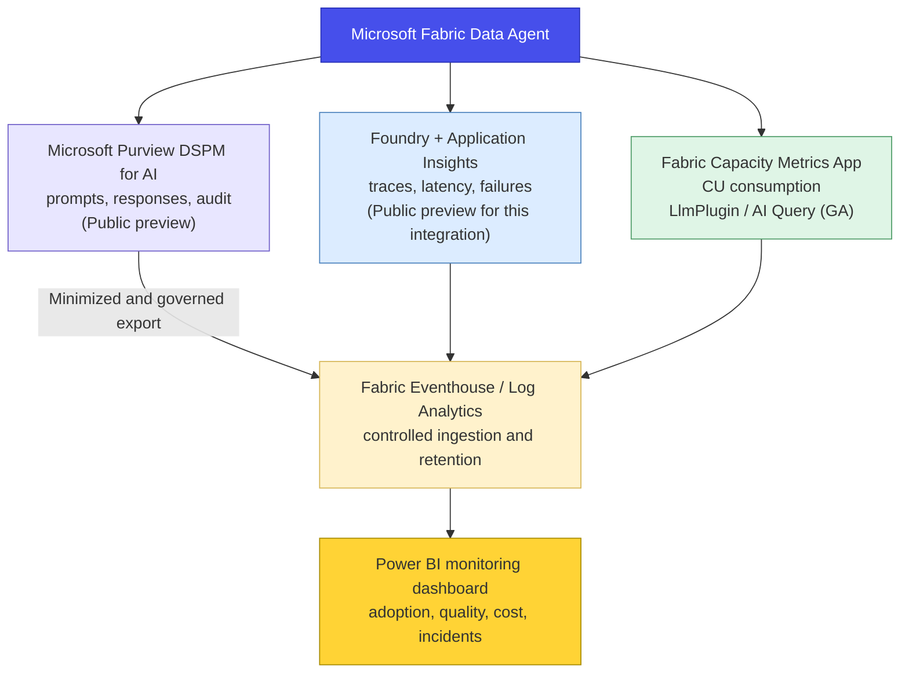

> **Scope.** Current monitoring capabilities for Microsoft Fabric Data Agents, their maturity, known gaps, and a deployable enterprise observability architecture.
>
> **Status note.** Product status, pricing, licensing, and regional availability can change. Validate every preview/GA statement against the linked Microsoft documentation before production deployment.

## Direct answers to the monitoring questions

**Is there a dedicated monitoring API?** No dedicated `/admin/activityevents` endpoint exposes Fabric Data Agent runtime activity. Official monitoring currently relies on three complementary channels:

1. **Fabric Capacity Metrics App (GA)** for Capacity Unit consumption.
2. **Microsoft Purview DSPM for AI (Public preview)** for prompts, responses, identities, and audit metadata.
3. **Microsoft Foundry Observability with Application Insights (Public preview for this integration)** for execution traces when a Fabric Data Agent is called from Foundry.

Sources: [Data Agent consumption](https://learn.microsoft.com/en-us/fabric/fundamentals/data-agent-consumption), [Purview governance](https://learn.microsoft.com/en-us/fabric/data-science/data-agent-purview-governance), and [Foundry observability](https://learn.microsoft.com/en-us/fabric/data-science/fabric-data-agent-foundry-observability).

**Are feature flags required?** Yes. Purview auditing requires the following controls:

1. Enable **Microsoft Purview Audit**.
2. Enable the **DSPM for AI - Capture interactions for Copilot experiences** policy.
3. Enable the Fabric tenant setting **Allow Microsoft Purview to secure AI interactions**.

**What is the roadmap status?** *Data Agent Audit logs with Purview* has been available in **Public preview** since Q1 2026. Microsoft Learn is the source of truth for current availability. Fabric GPS can be useful as a community roadmap tracker, but it is not an official Microsoft publication.

## Current monitoring capabilities

### Capacity Metrics App: Capacity Unit consumption

Fabric Data Agents appear in the Capacity Metrics App under product terminology that can make them difficult to find:

| Metric | Documented value |
| --- | --- |
| **Item kind** | `LlmPlugin` |
| **Operation name** | `AI Query` |
| **Operation type** | Background operation |
| **Azure billing meter** | `Copilot and AI` |
| **Input meter** | 100 CU-seconds per 1,000 input tokens |
| **Output meter** | 400 CU-seconds per 1,000 output tokens |
| **Cached input meter** | 10 CU-seconds per 1,000 cached input tokens |

Sources: [Data Agent consumption](https://learn.microsoft.com/en-us/fabric/fundamentals/data-agent-consumption) and [Fabric operations](https://learn.microsoft.com/en-us/fabric/enterprise/fabric-operations).

For example, a request using 2,000 input tokens and 500 output tokens consumes:

`(2,000 x 100 + 500 x 400) / 1,000 = 400 CU-seconds`, or approximately 6.67 CU-minutes.

The SQL, DAX, or KQL query generated by the agent is billed separately against the target Warehouse, Semantic Model, or KQL Database.

> **Practical action.** In the Capacity Metrics App, open *Matrix by item and operation* and filter on item kind `LlmPlugin` and operation `AI Query`.

### Microsoft Purview DSPM for AI: prompts and responses

Microsoft Purview is the official channel that captures the textual content of Fabric Data Agent interactions. The feature is documented as **Public preview**.

#### Required configuration

1. Activate **Microsoft Purview Audit**.
2. Enable the **DSPM for AI - Capture interactions for Copilot experiences** policy.
3. Enable **Allow Microsoft Purview to secure AI interactions** in the Fabric Admin portal.

#### Captured information

Purview can capture:

- timestamp;
- user identity;
- application and agent details;
- associated resources and metadata;
- the full user prompt;
- the full AI response, including generated code or queries.

In the Microsoft Purview portal, use **DSPM for AI > Activity Explorer**, then filter on:

- Activity type: `Copilot Interaction`
- App: `Fabric-Data Agent`

The records are also written to the Microsoft 365 unified audit log. A `CopilotInteraction` record can include attributes such as `AccessedResources`, `AgentId`, `AgentName`, `AgentVersion`, `AISystemPlugin`, `AppHost`, `AppIdentity`, `CapacityId`, `ClientRegion`, `Contexts`, `Messages`, `ModelTransparencyDetails`, `Operation`, `RecordType`, and `Workload`.

Sources: [Audit logging for Fabric Data Agent with Microsoft Purview](https://learn.microsoft.com/en-us/fabric/data-science/data-agent-purview-governance) and [Audit logs for Copilot and AI applications](https://learn.microsoft.com/en-us/purview/audit-copilot).

Licensing, retention, and advanced investigation features depend on the Microsoft Purview and Microsoft 365 subscriptions in use. Verify the current terms before defining retention or export policies.

#### Protecting personal data in telemetry

Prompts and responses may contain personal data, confidential business information, or generated code. Purview and Application Insights records must therefore be treated as sensitive production data:

- apply least-privilege access through dedicated roles;
- do not export full prompt and response text by default;
- favor aggregated metrics and pseudonymized user identifiers;
- define retention according to a documented audit purpose;
- remove secrets, direct identifiers, and regulated data before secondary ingestion;
- document the collection purpose and processing responsibilities with privacy, security, and compliance teams;
- apply sensitivity labels and audit access to the monitoring workspace itself.

### Microsoft Foundry Observability: end-to-end tracing

When a Fabric Data Agent is consumed through a Foundry agent, traces can be sent to the Azure Monitor Application Insights resource connected to the Foundry project.

A request produces a hierarchy similar to:

```text
Request trace
└─ Foundry agent run
   └─ Fabric Data Agent tool call
      └─ Agent span
         ├─ Tool span: first data source
         └─ Tool span: second data source
```

| Trace level | Producer | Example metadata |
| --- | --- | --- |
| Foundry agent run | Foundry | Conversation ID, status, duration |
| Fabric Data Agent tool call | Foundry | Agent display name, status, duration |
| Agent span | Fabric Data Agent | Agent name, conversation ID, status, duration |
| Tool span | Fabric Data Agent | Data source name, reasoning step ID, status, duration |

This enables:

- latency analysis by span;
- visibility into the data sources queried;
- identification of the failing execution step;
- correlation of a Fabric Data Agent call with the parent Foundry trace.

Access requires suitable permissions such as `Monitoring Reader` or `Log Analytics Reader` on Application Insights and `Foundry User` on the project. Configure the connection from **Agents > Traces > Connect** in the Foundry portal.

Source: [Observability for Fabric Data Agents in Microsoft Foundry](https://learn.microsoft.com/en-us/fabric/data-science/fabric-data-agent-foundry-observability).

### Fabric Data Agent Python SDK: management and evaluation

The `fabric-data-agent-sdk` package supports:

- agent lifecycle and configuration operations;
- runtime calls through a published endpoint;
- programmatic evaluation against a ground-truth dataset.

`evaluate_data_agent()` can execute test questions and store summary and step-level results. This is a quality-validation capability, not a production telemetry API.

Sources: [Fabric Data Agent Python SDK](https://learn.microsoft.com/en-us/fabric/data-science/fabric-data-agent-sdk) and [Evaluate your Data Agent](https://learn.microsoft.com/en-us/fabric/data-science/evaluate-data-agent).

### Fabric Data Agent REST API: management plane

The public REST API supports management-plane operations such as:

| API area | Purpose |
| --- | --- |
| Items | Create, delete, get, list, publish, and update a Data Agent |
| Published configuration | Read data sources, settings, and few-shot examples |

Sources: [Data Agent Items REST API](https://learn.microsoft.com/en-us/rest/api/fabric/dataagent/items) and [Published Data Agent REST API](https://learn.microsoft.com/en-us/rest/api/fabric/dataagent/published).

The management API does **not** provide an aggregated runtime telemetry feed for prompts, responses, latency, or execution history. Runtime diagnostics must come from Purview, Foundry/Application Insights, the application calling the agent, or controlled collection of per-request diagnostics.

## What is not exposed natively

### Activity Events API

The Fabric operation list does not define a dedicated `DataAgent` operation. `CopilotInteraction` exists for Copilot-related activity, while detailed prompt and response auditing is surfaced through Microsoft Purview and the Microsoft 365 unified audit log.

Sources: [Fabric operation list](https://learn.microsoft.com/en-us/fabric/admin/operation-list) and [Track user activities in Microsoft Fabric](https://learn.microsoft.com/en-us/fabric/admin/track-user-activities).

### XMLA dynamic management views

The Fabric Data Agent orchestration engine is not an Analysis Services session. A generated DAX query executed against a semantic model may open an Analysis Services session, but it appears as a semantic-model query rather than as an end-to-end Data Agent trace. XMLA DMVs therefore cannot provide complete agent observability.

### Fabric Monitoring Hub

The documented Monitoring Hub item types do not include Fabric Data Agents. Monitoring Hub focuses on supported Fabric jobs and item executions such as pipelines, notebooks, semantic models, lakehouses, and Spark job definitions.

Source: [Fabric Monitoring Hub](https://learn.microsoft.com/en-us/fabric/admin/monitoring-hub).

### Workspace Monitoring

The workloads documented for Workspace Monitoring do not currently include Fabric Data Agents. Agent interactions are therefore not automatically ingested into the workspace Eventhouse through this feature.

Source: [Workspace Monitoring overview](https://learn.microsoft.com/en-us/fabric/fundamentals/workspace-monitoring-overview).

## Product maturity and roadmap

### Purview audit integration

Microsoft Learn is the source of truth for the preview status and configuration of Data Agent auditing. The community-maintained Fabric GPS tracker can provide additional roadmap history, but it must not be treated as an official availability commitment.

The Purview integration is intended to support:

- audit and investigation;
- eDiscovery;
- retention and data lifecycle controls;
- communications compliance;
- classification of prompts and responses.

### Foundry Observability

Microsoft Foundry provides OpenTelemetry-based tracing for supported agent types. The Fabric Data Agent integration adds agent and tool spans when a Data Agent is called as a tool. Status can differ between Foundry agent types and the Fabric integration, so production design must validate each component independently.

Sources: [Set up tracing for AI agents](https://learn.microsoft.com/en-us/azure/foundry/observability/how-to/trace-agent-setup) and [Agent tracing overview](https://learn.microsoft.com/en-us/azure/foundry/observability/concepts/trace-agent-concept).

## Monitoring comparison

| Dimension | Native Fabric Data Agent | Fabric Data Agent through Foundry | Foundry Prompt/Hosted Agent |
| --- | --- | --- | --- |
| Prompt and response content | Purview DSPM for AI (preview) | Application Insights / Purview, subject to configuration | Application Insights |
| Execution spans | Not exposed through a native Fabric monitoring surface | Agent span and tool spans | Full supported trace hierarchy |
| Token consumption | `AI Query` / `LlmPlugin` in Capacity Metrics | Fabric capacity meter plus available trace attributes | Foundry/model telemetry |
| Capacity Unit consumption | Capacity Metrics App | Capacity Metrics App | Not applicable as a Fabric CU meter |
| Step-level latency | Not natively exposed | Duration by span | Duration by span |
| Queried data sources | Not natively exposed | Tool span metadata | Tool span metadata |
| Retention | Purview policy-dependent | Foundry portal and Application Insights retention | Foundry portal and Application Insights retention |
| Collection cost | License-dependent | Application Insights ingestion and retention | Application Insights ingestion and retention |
| Maturity | Mixed GA and preview components | Public preview integration | Depends on the Foundry agent type |

If detailed runtime observability is mandatory, orchestrating the Fabric Data Agent through a Foundry agent provides the strongest currently documented trace model. This design must still account for preview status, data minimization, cost, and regional requirements.

## Recommended monitoring architecture

### Deployable target architecture



The architecture deliberately separates:

- **audit content** in Purview;
- **runtime traces** in Application Insights;
- **capacity cost** in Fabric Capacity Metrics;
- **curated operational reporting** in Eventhouse, Log Analytics, and Power BI.

### Implementation checklist

1. **Licensing:** verify Microsoft 365 and Purview licensing for audit, retention, eDiscovery, and investigation.
2. **Fabric tenant:** enable **Allow Microsoft Purview to secure AI interactions**.
3. **Purview:** activate Audit and the DSPM for AI capture policy.
4. **Audit validation:** confirm `CopilotInteraction` records for `Fabric-Data Agent` in Activity Explorer.
5. **Capacity validation:** confirm `AI Query` operations under `LlmPlugin` in Capacity Metrics.
6. **Foundry integration:** connect Application Insights and expose the Fabric Data Agent as a tool when multi-agent tracing is required.
7. **Controlled ingestion:** export only required fields to Eventhouse, Log Analytics, or Sentinel. Do not replicate full prompts and responses by default.
8. **Quality evaluation:** run a ground-truth evaluation pipeline with `fabric-data-agent-sdk`.
9. **Dashboarding:** provide adoption, quality, cost, and incident views.
10. **Operations:** define owners, alert thresholds, retention, access reviews, and a preview-feature exit strategy.

### Operational cautions

- **Preview features:** Purview Data Agent auditing and Foundry observability for this integration may change and do not carry the same commitments as GA services.
- **Data residency:** evaluate cross-geo processing settings against GDPR, EU Data Boundary, and organizational requirements.
- **Conversation history:** validate current retention behavior and user deletion controls in the tenant-settings documentation.
- **Tenant-wide controls:** confirm whether the required settings can be scoped to the intended population.
- **Collection cost:** use sampling, retention limits, and workspace-based Application Insights where appropriate.
- **Sensitive telemetry:** restrict access and avoid broad distribution of prompt and response content.
- **Operational dependency:** maintain separate health checks for Purview ingestion, Application Insights tracing, and Capacity Metrics availability.

## Primary public sources

| Source | URL |
| --- | --- |
| Audit logging for Fabric Data Agent with Microsoft Purview | `learn.microsoft.com/en-us/fabric/data-science/data-agent-purview-governance` |
| Observability for Fabric Data Agents in Microsoft Foundry | `learn.microsoft.com/en-us/fabric/data-science/fabric-data-agent-foundry-observability` |
| Data Agent consumption | `learn.microsoft.com/en-us/fabric/fundamentals/data-agent-consumption` |
| Fabric operations | `learn.microsoft.com/en-us/fabric/enterprise/fabric-operations` |
| Fabric Data Agent concepts | `learn.microsoft.com/en-us/fabric/data-science/concept-data-agent` |
| Fabric Data Agent Python SDK | `learn.microsoft.com/en-us/fabric/data-science/fabric-data-agent-sdk` |
| Evaluate your Data Agent | `learn.microsoft.com/en-us/fabric/data-science/evaluate-data-agent` |
| Configure Fabric Data Agent tenant settings | `learn.microsoft.com/en-us/fabric/data-science/data-agent-tenant-settings` |
| Data Agent Items REST API | `learn.microsoft.com/en-us/rest/api/fabric/dataagent/items` |
| Published Data Agent REST API | `learn.microsoft.com/en-us/rest/api/fabric/dataagent/published` |
| Fabric Data Agent as an MCP server | `learn.microsoft.com/en-us/fabric/data-science/data-agent-mcp-server` |
| Audit logs for Copilot and AI applications | `learn.microsoft.com/en-us/purview/audit-copilot` |
| Set up tracing for AI agents in Foundry | `learn.microsoft.com/en-us/azure/foundry/observability/how-to/trace-agent-setup` |
| Agent tracing overview | `learn.microsoft.com/en-us/azure/foundry/observability/concepts/trace-agent-concept` |
| Track user activities in Microsoft Fabric | `learn.microsoft.com/en-us/fabric/admin/track-user-activities` |
| Fabric operation list | `learn.microsoft.com/en-us/fabric/admin/operation-list` |
| Workspace Monitoring overview | `learn.microsoft.com/en-us/fabric/fundamentals/workspace-monitoring-overview` |
| Fabric Monitoring Hub | `learn.microsoft.com/en-us/fabric/admin/monitoring-hub` |
| Microsoft Fabric roadmap | `roadmap.fabric.microsoft.com` |
| Community roadmap tracker | `www.fabric-gps.com` |

## Summary

Fabric Data Agent monitoring is available today, but it is distributed across several services rather than provided by one native monitoring endpoint:

- **Capacity Metrics** provides GA consumption data under `LlmPlugin` and `AI Query`.
- **Microsoft Purview DSPM for AI** provides auditable interaction content in Public preview.
- **Foundry Observability and Application Insights** provide the richest runtime trace model when the Data Agent is called through Foundry.
- **The SDK and REST API** support lifecycle automation and evaluation, not an aggregated production telemetry feed.

An enterprise deployment can centralize selected data in Eventhouse or Log Analytics and report through Power BI. The design must preserve the authoritative systems, minimize exported prompt and response content, enforce least privilege, and explicitly manage preview risk.
