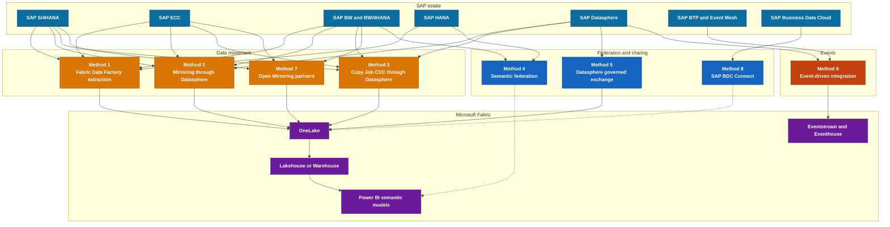
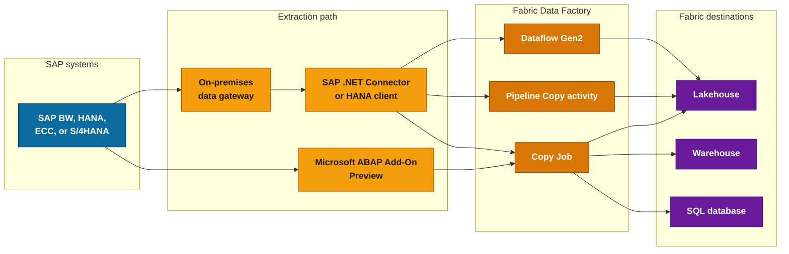
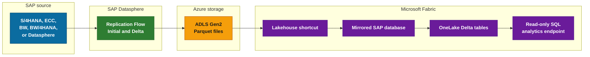
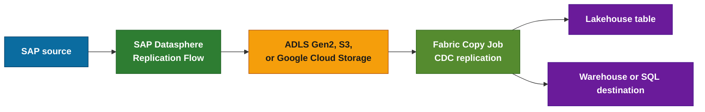
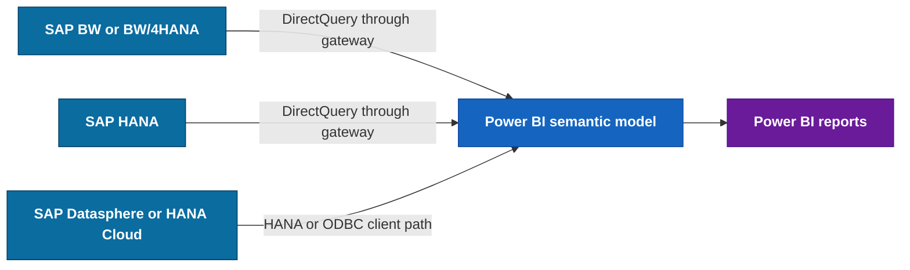
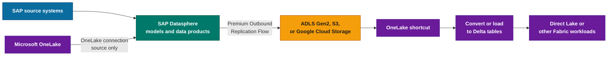
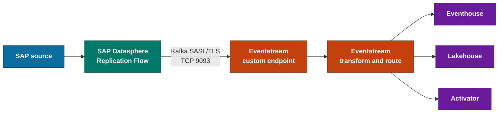
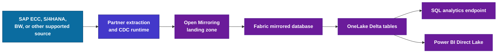
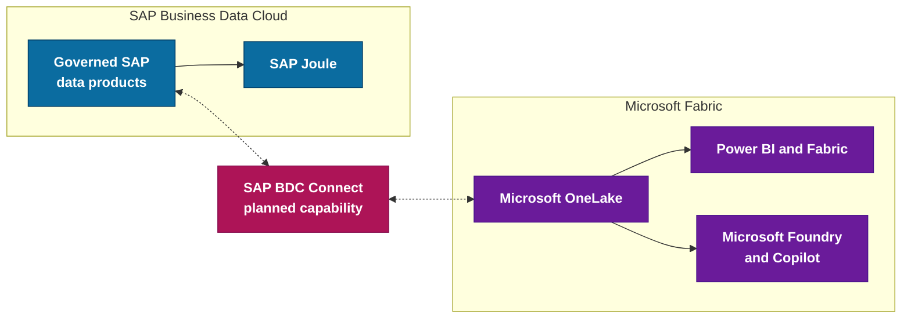
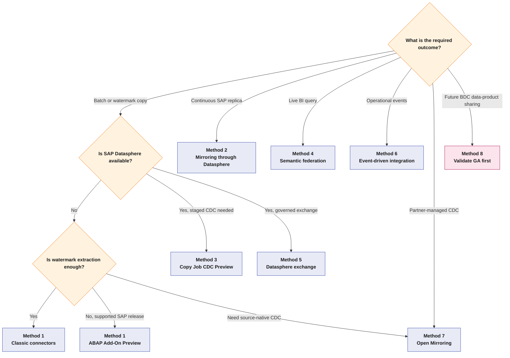

> **Scope.** Product status and technical claims were checked against Microsoft and SAP sources available on September 11, 2026. Preview features, partner capabilities, and planned release dates can change.
>
> **Important correction.** The current architecture has eight decision patterns, but Method 1 now contains two distinct extraction paths: the classic Fabric SAP connectors and the new Copy Job for SAP with Microsoft ABAP Add-On, which is in preview.

## Executive summary

Microsoft Fabric does not have one universal SAP connector. The right path depends on whether the requirement is batch extraction, change replication, source-side semantic queries, operational events, partner-managed CDC, or planned SAP Business Data Cloud sharing.

| Method | Current status | Data movement | Best fit |
| --- | --- | --- | --- |
| 1. Fabric Data Factory extraction | Classic connectors available; ABAP Add-On in Preview | Yes | Batch and watermark-based ingestion |
| 2. Mirroring through SAP Datasphere | GA | Yes, continuously merged into OneLake | Managed SAP replication with SAP Datasphere |
| 3. Copy Job CDC through SAP Datasphere | SAP source announced GA, but current Microsoft metadata conflicts | Yes | Controlled SAP delta replication through cloud staging |
| 4. Semantic federation | GA | No bulk replication | Live Power BI queries against SAP BW or SAP HANA |
| 5. SAP Datasphere governed exchange | Available building blocks | Depends on the chosen flow | SAP-owned data products and controlled exchange |
| 6. Event-driven integration | Available | Events or replicated changes | Operational analytics and alerting |
| 7. Open Mirroring partners | Open Mirroring available; partner scope varies | Yes | Near-real-time replication without SAP Datasphere |
| 8. SAP BDC Connect for Fabric | Planned for Q3 2026; public GA not confirmed on September 11 | Planned zero-copy sharing | Future governed SAP BDC and OneLake exchange |

### What changed since the June 2026 edition

| Change | Impact on this guide |
| --- | --- |
| Copy Job for SAP with Microsoft ABAP Add-On entered Preview on June 3, 2026 | Added as a first-class subpattern in Method 1 |
| Microsoft updated the Azure Data Factory SAP CDC guidance with the SAP Note 3255746 warning | The legacy ADF SAP CDC path is now treated as migration risk, not a strategic default |
| Microsoft announced SAP Datasphere as a GA CDC source, while the current connector page still labels CDC replication Preview | Method 3 now records the status conflict instead of claiming unconditional GA |
| SAP Datasphere added a Microsoft OneLake connection for replication-flow source objects | Method 5 now covers the Fabric-to-Datasphere direction accurately |
| Eventstream private-network connector support became GA in July 2026 | Method 6 now separates private pull patterns from the public custom Kafka endpoint |
| Mirrored Database Change Feed became an Eventstream source in Preview | The current source list does not name Mirrored SAP, so it is not presented as an SAP production route |
| Direct Lake documentation now distinguishes Direct Lake on OneLake from Direct Lake on SQL | The semantic-layer guidance no longer treats all Direct Lake models as equivalent |
| SAP BDC Connect was planned for Q3 2026, but no public GA confirmation was found by September 11 | Method 8 remains a planned architecture, not a production recommendation |
| The Open Mirroring partner page expanded its SAP-capable list | Method 7 now uses the current Microsoft-maintained partner list |
| SAP BW connector implementation 1.0 was deprecated | New SAP BW connections should use implementation 2.0 |

### Document color key

\optionlegenditem{D97706}{M1}{Fabric Data Factory extraction}
\optionlegenditem{2E7D32}{M2}{Mirroring through SAP Datasphere}
\optionlegenditem{558B2F}{M3}{Copy Job CDC through SAP Datasphere}
\optionlegenditem{1565C0}{M4}{Semantic federation}
\optionlegenditem{00796B}{M5}{SAP Datasphere governed exchange}
\optionlegenditem{C2410C}{M6}{Event-driven integration}
\optionlegenditem{4338CA}{M7}{Open Mirroring partners}
\optionlegenditem{AD1457}{M8}{SAP Business Data Cloud Connect}

### Revision history

| Version | Date | Change summary |
| --- | --- | --- |
| 1.0 | April 13, 2026 | Initial eight-pattern connectivity guide |
| 1.1 | May 15, 2026 | SAP Sapphire 2026 and BDC roadmap refresh |
| 1.2 | June 2, 2026 | Copy Job CDC status update |
| 2.0 | September 11, 2026 | Full source audit, architecture refresh, and PDF redesign |

## Architecture map

### End-to-end reference architecture

{width=100%}

> Editable source: [`images/SAP_Fabric_Connectivity_Architecture.drawio`](../images/SAP_Fabric_Connectivity_Architecture.drawio).

## Selection principles

Use four questions to narrow the design:

1. Must the data move into OneLake, or must it remain in SAP?
2. Is the requirement a full copy, watermark increment, source-native delta, or business event?
3. Which SAP-managed component is available: SAP Datasphere, SAP BTP, SAP BDC, or none?
4. Who will operate the integration: the Fabric team, the SAP team, or a partner product?

Do not select a method from freshness labels alone. "Near real-time" can mean seconds, minutes, or simply continuous operation. Measure end-to-end latency with the real source, network, staging layer, and destination.

\clearpage
\optionbanner{D97706}{METHOD 1}{Fabric Data Factory extraction}

## Method 1: Fabric Data Factory extraction

Method 1 covers two related but different paths:

- the established Fabric connectors for SAP BW, SAP BW Open Hub, SAP HANA, SAP Table, and OData;
- Copy Job for SAP with Microsoft Data Integration ABAP Add-On, introduced in Preview in June 2026.

### Architecture

### Classic connector support matrix

The current Fabric connector overview lists these capabilities:

| Connector | Dataflow Gen2 source | Pipeline source | Copy Job source | Gateway |
| --- | :---: | :---: | :---: | --- |
| SAP BW Application Server | Yes | No | No | On-premises |
| SAP BW Message Server | Yes | No | No | On-premises |
| SAP BW Open Hub Application Server | No | Yes | Yes, full load | On-premises |
| SAP BW Open Hub Message Server | No | Yes | Yes, full load | On-premises |
| SAP HANA | Yes | Yes | Yes, full and watermark incremental | On-premises |
| SAP Table Application Server | No | Yes | Yes, full and watermark incremental | On-premises |
| SAP Table Message Server | No | Yes | Yes, full load | On-premises |
| OData | Yes | Yes | Yes, full load | None, on-premises, or virtual network |

The Fabric connector pages describe each connector as a source. They do not provide an SAP destination connector.

SAP BW Open Hub supports SAP BW 7.01 and later but not SAP BW/4HANA. For BW/4HANA, use a supported BW query path, SAP Datasphere, the ABAP Add-On where applicable, or a verified partner connector.

The Power Query SAP BW connector implementation 1.0 is deprecated. New connections use implementation 2.0. Existing estates should inventory connector versions before changing gateway or Power BI deployments.

### Classic connector prerequisites

- SAP BW and SAP Table paths use an on-premises data gateway and SAP Connector for Microsoft .NET.
- SAP HANA uses an on-premises data gateway and the required SAP HANA client components.
- OData can use a cloud, on-premises, or virtual network gateway path depending on endpoint exposure.
- The SAP technical account needs only the RFC, table, view, or query permissions required by the selected connector.
- Network ports depend on the SAP instance and listener configuration. Do not treat `33xx` or `30015` as universal values.

### Copy Job with SAP ABAP Add-On

The ABAP Add-On path is a separate Preview feature. Microsoft installs a proprietary data integration add-on in SAP. During a Copy Job run:

1. The on-premises data gateway connects to the SAP application server over RFC.
2. The add-on extracts data with ABAP SQL.
3. SAP writes the extracted data to OneLake staging over HTTPS.
4. Copy Job writes from staging to the configured destination.

Supported source systems and objects are narrower than the classic connector estate:

| Area | Current Preview support |
| --- | --- |
| SAP systems | SAP S/4HANA all versions; SAP ECC 6.0 EhP 8 on NetWeaver 7.50 |
| Unsupported baseline | SAP ECC EhP 7 and earlier |
| Objects | Transparent, pool, and cluster tables; views; CDS SQL views |
| Modes | Full copy and watermark-based incremental copy |
| Gateway topology | Application Server only; Message Server is not supported |

This feature does not provide log-based CDC. Incremental mode depends on a timestamp, date, or supported numeric watermark. Deletes that do not produce a later source record are not inherently captured.

Known Preview limits include:

- source names containing special characters such as `/` are unsupported;
- SAP-to-OneLake staging times out after 12 hours and each table after 24 hours end to end;
- invalid SAP date values can fail destination type conversion;
- date-only watermarks can reread rows during repeated daily runs;
- large SAP catalogs can exceed the UI list, requiring manual object entry.

### When to use Method 1

Use the classic connectors for established batch and watermark patterns where the source object is supported and the gateway model is acceptable.

Use the ABAP Add-On Preview only when its system version, deployment model, and operational limits fit the project. It is strategically important because it does not use the ODP RFC API, but it still needs a production readiness review while in Preview.

Sources: [Fabric connector overview](https://learn.microsoft.com/en-us/fabric/data-factory/connector-overview), [Copy Job with SAP ABAP Add-On](https://learn.microsoft.com/en-us/fabric/data-factory/copy-job-tutorial-sap-abap).

\clearpage
\optionbanner{2E7D32}{METHOD 2}{Mirroring through SAP Datasphere}

## Method 2: Mirroring for SAP through SAP Datasphere

Mirroring for SAP is a two-stage replication pattern:

SAP Datasphere extracts an initial snapshot and subsequent changes into ADLS Gen2. Fabric points a Lakehouse shortcut at the storage path, creates a Mirrored SAP item, and continuously merges the files into Delta tables in OneLake.

### Status and supported scope

Mirroring for SAP through SAP Datasphere is generally available. Microsoft explicitly lists:

- SAP S/4HANA;
- SAP ECC;
- SAP BW/4HANA;
- SAP BW;
- SAP Datasphere itself.

The phrase "all sources supported by SAP Datasphere" should not be used to infer support for every SaaS application without checking the SAP replication-flow source matrix.

### Source and object eligibility

The SAP source name alone is not enough to establish support:

| Source area | Production check |
| --- | --- |
| SAP S/4HANA CDS extraction | Validate the S/4HANA release, required SAP Notes, and supported CDS extraction objects. Current SAP guidance starts CDS replication-flow support at S/4HANA 1909. |
| SAP ECC and SAP BW | Validate the ODP 2.0 BW/SAPI DataSources exposed to the replication flow. |
| SAP BW/4HANA | Validate the supported source container and object type rather than assuming BW Open Hub support. |
| SLT-backed extraction | Validate the SAP release, DMIS or SLT level, and source-table constraints. |
| Objects without a stable key | Expect Initial Only behavior unless the current source documentation states that delta replication is supported. |

Keep the required SAP Notes with the deployment record. They vary by SAP release and can change after security patches.

### Required configuration

- Fabric capacity or trial.
- SAP Datasphere with Premium Outbound Integration.
- An ADLS Gen2 target for the SAP Datasphere replication flow.
- A replication flow with **Group Delta = None** and **File Type = Parquet**.
- Load type **Initial and Delta** or **Initial Only**.
- A Lakehouse shortcut that points to the complete ADLS container path.
- A Mirrored SAP item that reads the shortcut path.

General Fabric Mirroring limits apply to SAP mirrors. Current guidance documents up to 1,000 tables and up to 1 TB of captured changes per mirrored database per day. Treat these as platform guardrails, then validate the lower practical limit created by SAP Datasphere, ADLS throughput, file counts, and Fabric capacity.

Fabric no longer creates a default Power BI semantic model automatically for new mirrored items. Create and govern the semantic model explicitly.

### Cost and operations

Fabric does not charge CUs for background mirroring replication, but a running capacity is required. Mirroring storage is included up to 1 TB per purchased CU, after which storage is charged. Storage charges continue while capacity is paused. SQL, Power BI, Spark, and direct OneLake access consume capacity normally. SAP Datasphere Premium Outbound Integration has its own capacity and commercial model.

Monitoring is split:

- SAP Datasphere monitors extraction from SAP to ADLS;
- Fabric monitors ADLS-to-OneLake mirroring.

A delay must be traced across both stages.

### When to use Method 2

Use Mirroring when SAP Datasphere is available, continuous managed replication is preferred, and the architecture can accept ADLS staging plus Premium Outbound Integration.

Do not call it zero-copy. SAP Datasphere writes Parquet to ADLS, and Fabric creates Delta data in OneLake.

Sources: [Mirrored databases from SAP](https://learn.microsoft.com/en-us/fabric/mirroring/sap), [SAP mirroring tutorial](https://learn.microsoft.com/en-us/fabric/mirroring/sap-datasphere-tutorial), [SAP mirroring limitations](https://learn.microsoft.com/en-us/fabric/mirroring/sap-limitations), [Mirroring overview and cost](https://learn.microsoft.com/en-us/fabric/mirroring/overview), [Mirroring troubleshooting and limits](https://learn.microsoft.com/en-us/fabric/mirroring/troubleshooting).

\clearpage
\optionbanner{558B2F}{METHOD 3}{Copy Job CDC through SAP Datasphere}

## Method 3: Copy Job CDC through SAP Datasphere Outbound

This path uses the same SAP Datasphere extraction layer as Mirroring but gives Fabric a Copy Job that reads the staged change files and writes to a supported destination.

### Current status

Copy Job itself is generally available. Microsoft announced SAP Datasphere among the GA CDC sources in May 2026, and the current CDC matrix lists SAP Datasphere Outbound without a source-specific Preview marker.

The metadata is still inconsistent: the current Copy Job connector page labels the overall CDC replication section **Preview**, and the Fabric roadmap retains older Preview status. Record this conflict in the architecture decision. Do not describe the full SAP pattern as unconditionally production-ready.

### Behavior

1. SAP Datasphere extracts an initial snapshot and changed records.
2. It writes Parquet files to ADLS Gen2, Amazon S3, or Google Cloud Storage.
3. Copy Job reads the staged folders and applies inserts, updates, and deletes to a supported destination.

This is a Copy Job item, not a multi-source transformation pipeline. It does not perform arbitrary joins or business transformations between SAP and other systems.

### Requirements and limits

- SAP Datasphere Premium Outbound Integration.
- Source and target connections in SAP Datasphere.
- **Group Delta = None** and **File Type = Parquet**.
- Load type **Initial and Delta**.
- A supported Copy Job destination.
- Separate monitoring for the Datasphere replication flow and the Fabric Copy Job.

The current CDC matrix lists SCD Type 2 as unavailable for the SAP Datasphere Outbound source entries. Do not promise built-in SAP history tracking without validating the specific source-destination pair.

Schema handling also needs attention. New columns are not automatically synchronized into an existing mapping, and incompatible type changes can fail the run.

### When to use Method 3

Use this method when cloud staging is acceptable and the Fabric team needs explicit scheduling, destination choice, and Copy Job monitoring.

Choose Mirroring instead when the goal is a continuously managed SAP replica in OneLake. Choose the ABAP Add-On path when SAP Datasphere is unavailable and watermark-based extraction is sufficient.

Sources: [SAP Datasphere Outbound Copy Job tutorial](https://learn.microsoft.com/en-us/fabric/data-factory/copy-job-tutorial-sap-datasphere), [CDC in Copy Job](https://learn.microsoft.com/en-us/fabric/data-factory/cdc-copy-job), [Copy Job connectors](https://learn.microsoft.com/en-us/fabric/data-factory/copy-job-connectors).

\clearpage
\optionbanner{1565C0}{METHOD 4}{Semantic federation}

## Method 4: semantic federation

Semantic federation keeps the primary data in SAP and sends queries from Power BI to the SAP engine.

### SAP BW DirectQuery

Power BI selects an InfoCube or BEx Query, then exposes the dimensions and key figures returned through the SAP public interface.

Important limits include:

- no Power Query Editor for shaping the BW model;
- no calculated columns or user-defined relationships;
- restricted DAX and visual behavior;
- SAP local calculations, hidden key figures, currency formatting, units, hierarchy versions, and some totals can differ from SAP front-end tools;
- reports must be tested against authoritative SAP outputs, especially for currencies and non-additive measures.

### SAP HANA DirectQuery

Power BI supports two distinct modes:

- **Multidimensional mode**, the default, uses one analytic or calculation view and preserves SAP-defined measures and hierarchies.
- **Relational mode** allows relationships, calculated columns, and multiple sources, but it can mis-handle non-additive SAP measures if the model aggregates them again.

The mode is chosen when the report connection is created and cannot be switched later.

### SAP Datasphere

SAP Datasphere separates analytical models from exposed views. Analytical models can be consumed through supported analytical interfaces, while exposed views can use an Open SQL schema through ODBC or JDBC.

Microsoft documents a Fabric notebook pattern that uses the SAP HANA ODBC driver against a Datasphere Open SQL schema. It requires:

- an exposed Datasphere view;
- a database user and Open SQL schema;
- SAP HANA Client 2.0 in the notebook environment;
- network allowlisting;
- secure credential handling.

This avoids a persistent OneLake copy, but query-result data still moves into the notebook runtime. It is a custom notebook connection, not Direct Lake.

### Security

Source-side SAP authorization is enforced only when the connection identity and single sign-on design preserve the intended user context. A fixed gateway credential does not automatically provide per-user SAP authorization.

### When to use Method 4

Use semantic federation when data must remain in SAP, SAP calculations must remain authoritative, and the SAP platform can carry interactive query load.

Avoid it for large Spark workloads, offline access, or reports that need unrestricted Power BI modeling.

Sources: [DirectQuery and SAP BW](https://learn.microsoft.com/en-us/power-bi/connect-data/desktop-directquery-sap-bw), [DirectQuery for SAP HANA](https://learn.microsoft.com/en-us/power-bi/connect-data/desktop-directquery-sap-hana), [Extract SAP data from Fabric](https://learn.microsoft.com/en-us/azure/sap/workloads/extract-sap-data), [Gateway single sign-on overview](https://learn.microsoft.com/en-us/power-bi/connect-data/service-gateway-sso-overview).

\clearpage
\optionbanner{00796B}{METHOD 5}{SAP Datasphere governed exchange}

## Method 5: SAP Datasphere governed data exchange

SAP Datasphere can act as the SAP-owned curation and exchange layer, but the direction and storage format matter.

### Datasphere outbound direction

Premium Outbound Integration is required when a replication flow targets non-SAP systems such as:

- Amazon S3;
- Google Cloud Storage;
- Azure Data Lake Storage Gen2;
- Google BigQuery;
- Apache Kafka or Confluent Kafka;
- SFTP.

Premium Outbound is capacity-based. SAP documentation describes blocks sized by transferred data volume. Confirm the commercial allocation with the SAP contract owner.

### Fabric consumption

A OneLake shortcut can expose files stored in ADLS Gen2, S3, or compatible locations without another physical copy into the Lakehouse Files area.

The shortcut does not turn arbitrary Parquet files into Delta tables. Direct Lake requires Delta tables. Use one of these paths:

- Mirroring for SAP, which converts staged data into managed Delta tables;
- Copy Job into a Lakehouse table;
- a Fabric transformation that writes a Delta table.

### OneLake to Datasphere direction

SAP Datasphere now provides a Microsoft OneLake connection. Current SAP documentation lists it as a **replication-flow source**, not a target. The supported load type is **Initial Only**. It does not support remote tables or data flows.

The connection uses OAuth 2.0 and can use SAP Cloud Connector as a TLS tunnel when the OneLake workspace is not publicly reachable.

This direction is useful when an SAP-owned process needs to ingest Fabric-managed files into Datasphere. It is not the same product as SAP BDC Connect.

### When to use Method 5

Use this pattern when the SAP data team owns curation and outbound governance, or when Datasphere must ingest selected OneLake data.

Do not describe the storage-mediated outbound flow as zero-copy end to end. SAP first creates files in the target storage, and Fabric may still need to create Delta tables.

Sources: [SAP Premium Outbound Integration](https://github.com/SAP-docs/sap-datasphere/blob/main/docs/Acquiring-Preparing-Modeling-Data/Acquiring-and-Preparing-Data-in-the-Data-Builder/premium-outbound-integration-4e9c6ac.md), [SAP Microsoft OneLake connection](https://github.com/SAP-docs/sap-datasphere/blob/main/docs/Integrating-data-and-managing-spaces/Integrating-Data-Via-Connections/microsoft-onelake-connections-057fa4b.md), [OneLake shortcuts](https://learn.microsoft.com/en-us/fabric/onelake/onelake-shortcuts), [Direct Lake overview](https://learn.microsoft.com/en-us/fabric/fundamentals/direct-lake-overview).

\clearpage
\optionbanner{C2410C}{METHOD 6}{Event-driven integration}

## Method 6: event-driven integration

There are two different event patterns. They should not be presented as one native connector.

### Pattern A: SAP Datasphere Replication Flow to Eventstream

Microsoft documents this path directly:

The configuration requires:

- SAP Datasphere Premium Outbound Integration;
- an Eventstream custom endpoint source;
- the endpoint bootstrap server, topic, and connection string;
- `SASL_SSL` with `PLAIN`;
- `$ConnectionString` as the Kafka user name;
- the Eventstream connection string as the password;
- the Eventstream topic name as the Replication Flow target object name.

The Kafka protocol uses TCP 9093. Fabric Private Link does not support custom endpoint sources or destinations, so this is not a private-link inbound path.

### Pattern B: SAP business events through SAP BTP

SAP S/4HANA business events can be published through SAP Event Mesh or SAP Integration Suite. Azure Event Grid can receive events through a custom connector or webhook design, and Eventstream supports Azure Event Grid Namespace as a source.

The SAP Event Mesh connector to Azure Event Grid has appeared in SAP beta and community material rather than a current jointly documented GA reference architecture. Treat it as a custom integration that needs support confirmation from SAP and Microsoft.

SAP Event Mesh Lite is being discontinued. New designs should use a currently supported Event Mesh plan. SAP Integration Suite, advanced event mesh is a separate offering with its own migration process, not a renamed Lite plan.

### Private Kafka sources

If Eventstream must pull from a private Kafka cluster, use the GA Streaming Connector VNet injection pattern with VPN or ExpressRoute. This is different from the custom endpoint push path used by SAP Datasphere.

### When to use Method 6

Use Eventstream for operational records that need routing, filtering, windowing, Eventhouse analysis, or Activator actions.

Do not use events as a substitute for a complete historical dataset. Event payloads leave SAP and may be retained in Eventstream or downstream destinations, so data residency and personal-data controls still apply. Eventstream retains data for one day by default and can be configured for longer retention up to the documented limit. Pair the event stream with a batch or change-replication method when completeness and replay beyond event retention matter.

Sources: [Replicate SAP Datasphere data to Eventstream](https://learn.microsoft.com/en-us/fabric/real-time-intelligence/event-streams/replicate-data-with-replication-flow), [Eventstream network security selection](https://learn.microsoft.com/en-us/fabric/real-time-intelligence/event-streams/choose-the-right-network-security-feature), [Azure Event Grid source](https://learn.microsoft.com/en-us/fabric/real-time-intelligence/event-streams/add-source-azure-event-grid), [Eventstream settings and retention](https://learn.microsoft.com/en-us/fabric/real-time-intelligence/event-streams/configure-settings), [SAP Event Mesh Lite lifecycle](https://help.sap.com/docs/SAP_EM/bf82e6b26456494cbdd197057c09979f/ef79898d432a4553b48186dc1d745945.html).

\clearpage
\optionbanner{4338CA}{METHOD 7}{Open Mirroring partners}

## Method 7: Open Mirroring partner solutions

Open Mirroring lets a data provider write change files to a Fabric mirrored database landing zone. Fabric validates and merges those changes into Delta tables in OneLake.

### Current SAP-capable partner entries

The Microsoft-maintained partner page explicitly describes SAP support for:

| Partner | Microsoft-listed SAP scope |
| --- | --- |
| AecorSoft | SAP-certified replication into Fabric through Open Mirroring |
| ASAPIO | SAP-certified add-on with CDC, scheduled replication, and predefined data products |
| CData | SAP among more than 150 supported enterprise sources |
| dab | SAP-certified extraction from ECC and S/4HANA on-premises or Private Cloud Edition |
| Qlik | Log-based CDC including SAP among supported source families |
| Simplement | SAP-certified extraction from several SAP source systems |
| SNP | SNP Glue support for S/4HANA and Open Mirroring |
| Theobald | Xtract Universal support for S/4HANA, ECC, and BW |

The partner page also lists general-purpose Open Mirroring vendors that may support SAP through their own product matrices. Do not call every Open Mirroring partner an SAP partner.

### Publisher contract

Open Mirroring publishers do not write Delta tables directly. They write specification-compliant files into the landing zone:

- `_metadata.json` defines table metadata;
- Parquet or delimited files carry row data;
- `__rowMarker__` identifies inserts, updates, deletes, and upserts;
- update records must contain the complete resulting row;
- key columns must remain stable;
- uploads must be atomic so Fabric never reads partial files.

Fabric applies those changes and maintains the target Delta tables.

### Status note

Current Microsoft Learn treats base Open Mirroring as generally available because it is not marked Preview in the current source list. The roadmap still contains an older overall Preview record. Record the conflict and validate the selected partner release.

### Selection checks

- supported SAP product, release, and deployment model;
- extraction mechanism and response to SAP Note 3255746;
- SAP certification stated for the exact product and version;
- initial-load and delta behavior;
- delete handling and replay;
- source-system load;
- partner license and infrastructure;
- support ownership across SAP, the partner, and Microsoft.

### When to use Method 7

Use Open Mirroring when SAP Datasphere is unavailable or undesirable, and a partner product has a verified support matrix for the source.

The main trade-off is not technical capability alone. The organization accepts a partner runtime, partner licensing, and a three-party support boundary.

Sources: [Open Mirroring partner ecosystem](https://learn.microsoft.com/en-us/fabric/mirroring/open-mirroring-partners-ecosystem), [Open Mirroring overview](https://learn.microsoft.com/en-us/fabric/mirroring/open-mirroring), [Open Mirroring landing-zone format](https://learn.microsoft.com/en-us/fabric/mirroring/open-mirroring-landing-zone-format).

\clearpage
\optionbanner{AD1457}{METHOD 8}{SAP Business Data Cloud Connect}

## Method 8: SAP Business Data Cloud Connect for Microsoft Fabric

SAP and Microsoft announced SAP Business Data Cloud Connect for Microsoft Fabric as a bidirectional, zero-copy data-product sharing capability between SAP BDC and Microsoft OneLake.

### Status on September 11, 2026

The joint announcement states that general availability was **planned for Q3 2026**. The SAP Sapphire 2026 update said delta sharing was coming in the second half of 2026.

No public Microsoft Learn setup guide, SAP Help configuration guide, or explicit GA announcement was found by September 11, 2026. This guide therefore classifies BDC Connect as **planned, with GA not publicly confirmed**.

Do not describe it as an available production service until the owning product documentation confirms:

- supported SAP data products;
- supported Fabric item types;
- identity and authorization flow;
- regional availability;
- read and publish semantics;
- lineage and audit behavior;
- quotas, latency, and consistency;
- commercial prerequisites.

### Confirmed product intent

The official announcement confirms:

- bidirectional, zero-copy sharing;
- SAP data products integrated into OneLake;
- OneLake datasets made available to SAP BDC;
- analytics and AI scenarios across Power BI, Fabric, Microsoft Foundry, Copilot, and SAP Joule.

Zero-copy does not mean that data bytes never cross the boundary or that consumers can write through to provider datasets. Current generic SAP BDC Connect guidance allows caching in some consumption scenarios.

SAP BDC is a separately entitled suite whose core components include SAP Datasphere. Generic BDC Connect uses capacity-unit metering, but Fabric-specific metering and entitlements remain undocumented. Current public SAP Help lists supported BDC Connect systems without Microsoft Fabric, which supports the decision to keep this method in planned status.

It does not yet provide enough implementation detail to infer an ORD requirement, an admin workflow, write consistency, or exact Fabric region support.

### When to use Method 8

Use Method 8 for architecture planning and vendor discussions. Do not use it as the sole committed production path until GA and technical documentation are public for the required region.

Sources: [SAP announcement](https://news.sap.com/2025/11/sap-bdc-connect-for-microsoft-fabric-business-insights-ai-innovation/), [Microsoft Fabric announcement](https://community.fabric.microsoft.com/t5/Fabric-Updates-Blog/SAP-and-Microsoft-accelerate-business-insights-and-AI-innovation/ba-p/5172482), [SAP Sapphire 2026 update](https://azure.microsoft.com/en-us/blog/advancing-enterprise-ai-new-sap-on-azure-announcements-from-sap-sapphire-2026/), [SAP BDC Connect provisioning](https://help.sap.com/docs/SAP_BUSINESS_DATA_CLOUD/f7acf8c9dad54e99b5ce5ebc633ed8e1/ccbd8fe7c2394009b546b73b1dd6c164.html), [SAP BDC entitlements](https://help.sap.com/docs/SAP_BUSINESS_DATA_CLOUD/f7acf8c9dad54e99b5ce5ebc633ed8e1/89e883e695724b53a140bef43bfb6ada.html).

\clearpage
\resetsectioncolor

## Legacy Azure Data Factory SAP CDC: review required

Azure Data Factory and Azure Synapse still document the SAP CDC connector and a direct sink into Fabric Lakehouse tables. The path uses:

- the SAP ODP framework;
- a self-hosted integration runtime;
- SAP Connector for Microsoft .NET;
- an ADLS Gen2 staging area;
- Mapping Data Flow;
- a Fabric Lakehouse linked service.

Microsoft updated the architecture guidance in August 2026 with an important warning: SAP Note 3255746 announces a security patch that blocks ODP RFC API calls from third-party clients, including the Azure Data Factory SAP CDC connector.

Microsoft names these alternatives:

- Mirroring for SAP through SAP Datasphere;
- SAP Business Data Cloud Connect when available;
- Copy Job for SAP with ABAP Add-On;
- SAP-certified partner solutions through Open Mirroring.

Existing ADF SAP CDC deployments need an impact assessment before the SAP patch is installed. Confirm the SAP Note version, patch state, allowed transition window, and chosen migration path with SAP. This document does not provide legal or licensing advice.

Sources: [ADF SAP CDC architecture](https://learn.microsoft.com/en-us/azure/data-factory/sap-change-data-capture-introduction-architecture), [ADF SAP CDC to Fabric](https://learn.microsoft.com/en-us/azure/data-factory/change-data-capture-from-sap-to-onelake-with-azure-data-factory).

## Direct Lake and the semantic layer

Direct Lake is a Power BI semantic-model storage mode for Delta tables in OneLake. It should not be described as a connector from SAP.

### Direct Lake on OneLake

- Reached general availability in March 2026.
- Can use Delta tables from more than one Fabric data source.
- Does not fall back to DirectQuery through a SQL analytics endpoint.
- Can combine with Import tables and, through supported tooling, DirectQuery tables.
- Loads required columns into memory and refreshes metadata through framing.

### Direct Lake on SQL

- Uses one Lakehouse or Warehouse SQL analytics endpoint.
- Can fall back to DirectQuery for SQL views or granular SQL security.
- Has different composite-model limits from Direct Lake on OneLake.

For SAP architectures, Direct Lake is a consumption choice after data has become a supported Delta table. It is not available directly over arbitrary Parquet files or live SAP BW/HANA connections. Reports see the state from the most recent successful framing operation, so freshness measurement must include ingestion, Delta commit, framing, and report behavior.

Source: [Direct Lake overview](https://learn.microsoft.com/en-us/fabric/fundamentals/direct-lake-overview).

## Network and security design

| Path | Main network components | Security focus |
| --- | --- | --- |
| Classic Fabric SAP connectors | On-premises data gateway, SAP NCo or HANA client | Gateway hardening, outbound Fabric access, SAP technical account |
| ABAP Add-On Preview | Gateway to SAP over RFC; SAP and gateway to OneLake over HTTPS | Add-on transport governance, SAP outbound access, OneLake identity |
| Mirroring and Copy Job through Datasphere | SAP to Datasphere; Datasphere to cloud storage; Fabric to storage | Storage identity, staging retention, separate monitoring boundaries |
| Semantic federation | Power BI gateway to SAP BW or HANA | SSO or fixed identity, source capacity, result correctness |
| Eventstream custom Kafka endpoint | SAP Datasphere to `*.servicebus.windows.net` on 9093 | Connection-string rotation, public endpoint policy |
| Open Mirroring partner | Partner-specific SAP connection and Fabric landing-zone access | Vendor runtime, secret storage, least privilege |
| SAP BDC Connect | Not yet publicly documented | Do not invent the identity or network model |

Workspace-level Private Link support is workload-specific. Current matrices support items such as Copy Job, Eventstream, Mirrored SAP, Open Mirroring, Lakehouse, SQL analytics endpoints, and shortcuts. Power BI semantic models are not supported in a workspace where workspace-level Private Link is enabled and public access is denied.

ADLS shortcuts do not use Fabric managed private endpoints. For a firewall-enabled ADLS account, evaluate trusted workspace access. That path requires a purchased Fabric capacity, workspace identity, Azure RBAC and ACL permissions, and a storage resource-instance rule.

Apply these controls across all production paths:

- use dedicated technical identities and rotate their secrets;
- restrict SAP authorizations to required objects;
- log gateway, storage, Copy Job, mirroring, and source-side failures;
- define who owns replay after partial failure;
- test schema drift and invalid SAP values;
- document data residency at every persisted copy or staging layer;
- avoid treating encrypted public traffic and private networking as equivalent controls.

Sources: [Fabric security feature availability](https://learn.microsoft.com/en-us/fabric/security/security-feature-availability), [Workspace Private Link support](https://learn.microsoft.com/en-us/fabric/security/security-workspace-level-private-links-support), [Create an ADLS Gen2 shortcut](https://learn.microsoft.com/en-us/fabric/onelake/create-adls-shortcut), [Trusted workspace access](https://learn.microsoft.com/en-us/fabric/security/security-trusted-workspace-access).

## Licensing and commercial checkpoints

| Topic | Methods | Check before approval |
| --- | --- | --- |
| SAP Datasphere Premium Outbound Integration | 2, 3, 5, 6A | Capacity blocks, transferred volume, source and target eligibility |
| SAP BTP and Event Mesh | 6B | Service entitlement and connector support |
| Partner licensing | 7 | Source coverage, runtime, support terms, and SAP certification |
| SAP BDC | 8 | Product availability, contract entitlement, and region |
| Fabric capacity | All Fabric paths | Ingestion, transformation, query, and concurrency load |
| SAP ODP RFC | Legacy ADF CDC and any partner using it | SAP Note 3255746 impact and migration plan |

Avoid categorical claims such as "always licensed" or "always prohibited" without the customer's SAP agreement and current SAP Notes. Product documentation and commercial rights are separate questions.

## Comparison matrix

| Method | Status | Freshness model | SAP Datasphere | Fabric landing | Main trade-off |
| --- | --- | --- | :---: | --- | --- |
| 1. Data Factory extraction | GA connectors; ABAP Add-On Preview | Batch or watermark | No | Lakehouse, Warehouse, SQL, other supported target | Gateway and source load |
| 2. Mirroring | GA | Continuous two-stage replication | Yes | Mirrored Delta tables in OneLake | Premium Outbound plus ADLS staging |
| 3. Copy Job CDC | SAP source announced GA; metadata conflict remains | Datasphere deltas plus Copy Job | Yes | Supported Copy Job destination | Two schedulers, no SAP SCD2, and status conflict |
| 4. Semantic federation | GA | Query time | Optional | No bulk landing | SAP query load and modeling limits |
| 5. Datasphere exchange | Available building blocks | Replication-flow schedule | Yes | Files, then Delta conversion or mirroring | Format and direction must be designed |
| 6. Event-driven | Available | Event or replication flow | Optional | Eventstream destinations | Completeness and public Kafka endpoint |
| 7. Open Mirroring | Current Learn treats base feature as GA; older roadmap says Preview | Partner CDC or schedule | No | Mirrored Delta tables in OneLake | Partner cost and support boundary |
| 8. SAP BDC Connect | Planned; GA not confirmed | Planned zero-copy sharing | No | OneLake integration | No public implementation guide yet |

## Decision guide

## Production readiness checklist

### Source and data contract

- Confirm the exact SAP release, deployment model, and source objects.
- Identify keys, delete semantics, late-arriving changes, and schema evolution.
- Reconcile representative outputs with an SAP-authoritative report.
- Define the acceptable source-system load window.

### Platform status

- Record GA, Preview, or planned status for every required feature.
- Validate regional availability.
- Check current connector and partner versions.
- Recheck the owning documentation before go-live.

### Network and identity

- Prove DNS and port reachability from the production runtime.
- Use separate identities for extraction, staging, and consumption.
- Test secret and certificate rotation.
- Confirm whether a public endpoint, gateway path, or private route is permitted.

### Reliability and operations

- Test initial load, incremental run, restart, replay, and duplicate handling.
- Measure latency at SAP, staging, Fabric ingestion, and semantic consumption.
- Define monitoring ownership across every platform boundary.
- Document recovery after a partial batch or schema failure.

### Governance and cost

- Record every persisted copy and its retention.
- Apply sensitivity labels and downstream access controls.
- Confirm Premium Outbound, partner, BTP, BDC, and Fabric capacity costs.
- Review SAP terms and SAP Note 3255746 with the SAP contract and Basis owners.

## Recommendations by scenario

| Scenario | Preferred starting point |
| --- | --- |
| Established nightly SAP extraction | Method 1 classic connectors |
| Large table extraction without ODP RFC | Method 1 ABAP Add-On Preview, subject to production review |
| Continuous SAP replica with Datasphere | Method 2 Mirroring |
| Controlled SAP CDC through cloud staging | Method 3 Copy Job CDC Preview |
| Data must remain in SAP | Method 4 semantic federation |
| SAP team owns curated outbound datasets | Method 5 Datasphere exchange |
| Operational alerts and streaming analytics | Method 6 Eventstream |
| Near-real-time replication without Datasphere | Method 7 Open Mirroring partner |
| Future bidirectional SAP BDC and OneLake sharing | Method 8 after public GA confirmation |
| Existing ADF SAP CDC estate | Immediate SAP Note 3255746 impact assessment and migration plan |

## References

### Fabric SAP connectors and Copy Job

| Resource | Link |
| --- | --- |
| Fabric connector overview | <https://learn.microsoft.com/en-us/fabric/data-factory/connector-overview> |
| Copy Job connectors | <https://learn.microsoft.com/en-us/fabric/data-factory/copy-job-connectors> |
| Copy Job with SAP ABAP Add-On | <https://learn.microsoft.com/en-us/fabric/data-factory/copy-job-tutorial-sap-abap> |
| SAP HANA connector | <https://learn.microsoft.com/en-us/fabric/data-factory/connector-sap-hana-overview> |
| SAP Table Application Server | <https://learn.microsoft.com/en-us/fabric/data-factory/connector-sap-table-application-server-overview> |
| SAP Table Message Server | <https://learn.microsoft.com/en-us/fabric/data-factory/connector-sap-table-message-server-overview> |
| SAP BW Application Server | <https://learn.microsoft.com/en-us/fabric/data-factory/connector-sap-bw-application-server-overview> |
| SAP BW Message Server | <https://learn.microsoft.com/en-us/fabric/data-factory/connector-sap-bw-message-server-overview> |
| SAP BW connector setup and implementation lifecycle | <https://learn.microsoft.com/en-us/power-query/connectors/sap-bw/application-setup-and-connect> |
| SAP BW Open Hub Application Server | <https://learn.microsoft.com/en-us/fabric/data-factory/connector-sap-bw-open-hub-application-server-overview> |
| SAP BW Open Hub Message Server | <https://learn.microsoft.com/en-us/fabric/data-factory/connector-sap-bw-open-hub-message-server-overview> |
| OData connector | <https://learn.microsoft.com/en-us/fabric/data-factory/connector-odata-overview> |

### Mirroring and SAP Datasphere Outbound

| Resource | Link |
| --- | --- |
| Mirrored databases from SAP | <https://learn.microsoft.com/en-us/fabric/mirroring/sap> |
| SAP mirroring tutorial | <https://learn.microsoft.com/en-us/fabric/mirroring/sap-datasphere-tutorial> |
| SAP mirroring limitations | <https://learn.microsoft.com/en-us/fabric/mirroring/sap-limitations> |
| Mirroring overview and cost | <https://learn.microsoft.com/en-us/fabric/mirroring/overview> |
| Mirroring troubleshooting and limits | <https://learn.microsoft.com/en-us/fabric/mirroring/troubleshooting> |
| SAP Datasphere Outbound Copy Job tutorial | <https://learn.microsoft.com/en-us/fabric/data-factory/copy-job-tutorial-sap-datasphere> |
| CDC in Copy Job | <https://learn.microsoft.com/en-us/fabric/data-factory/cdc-copy-job> |
| SAP Premium Outbound Integration | <https://github.com/SAP-docs/sap-datasphere/blob/main/docs/Acquiring-Preparing-Modeling-Data/Acquiring-and-Preparing-Data-in-the-Data-Builder/premium-outbound-integration-4e9c6ac.md> |
| SAP Microsoft OneLake connection | <https://github.com/SAP-docs/sap-datasphere/blob/main/docs/Integrating-data-and-managing-spaces/Integrating-Data-Via-Connections/microsoft-onelake-connections-057fa4b.md> |

### Power BI and OneLake

| Resource | Link |
| --- | --- |
| DirectQuery and SAP BW | <https://learn.microsoft.com/en-us/power-bi/connect-data/desktop-directquery-sap-bw> |
| DirectQuery for SAP HANA | <https://learn.microsoft.com/en-us/power-bi/connect-data/desktop-directquery-sap-hana> |
| Extract SAP data from Fabric notebooks | <https://learn.microsoft.com/en-us/azure/sap/workloads/extract-sap-data> |
| Gateway single sign-on overview | <https://learn.microsoft.com/en-us/power-bi/connect-data/service-gateway-sso-overview> |
| Direct Lake overview | <https://learn.microsoft.com/en-us/fabric/fundamentals/direct-lake-overview> |
| Direct Lake on OneLake GA announcement | <https://community.fabric.microsoft.com/blog/fbc_pbiupdatesblog/power-bi-march-2026-feature-summary/5173928> |
| OneLake shortcuts | <https://learn.microsoft.com/en-us/fabric/onelake/onelake-shortcuts> |

### Eventstream and Open Mirroring

| Resource | Link |
| --- | --- |
| SAP Datasphere to Eventstream tutorial | <https://learn.microsoft.com/en-us/fabric/real-time-intelligence/event-streams/replicate-data-with-replication-flow> |
| Eventstream network security selection | <https://learn.microsoft.com/en-us/fabric/real-time-intelligence/event-streams/choose-the-right-network-security-feature> |
| Azure Event Grid source | <https://learn.microsoft.com/en-us/fabric/real-time-intelligence/event-streams/add-source-azure-event-grid> |
| Eventstream settings and retention | <https://learn.microsoft.com/en-us/fabric/real-time-intelligence/event-streams/configure-settings> |
| Open Mirroring partner ecosystem | <https://learn.microsoft.com/en-us/fabric/mirroring/open-mirroring-partners-ecosystem> |
| Open Mirroring overview | <https://learn.microsoft.com/en-us/fabric/mirroring/open-mirroring> |
| Open Mirroring landing-zone format | <https://learn.microsoft.com/en-us/fabric/mirroring/open-mirroring-landing-zone-format> |
| SAP Event Mesh Lite lifecycle | <https://help.sap.com/docs/SAP_EM/bf82e6b26456494cbdd197057c09979f/ef79898d432a4553b48186dc1d745945.html> |

### SAP BDC Connect

| Resource | Link |
| --- | --- |
| SAP and Microsoft announcement | <https://news.sap.com/2025/11/sap-bdc-connect-for-microsoft-fabric-business-insights-ai-innovation/> |
| Microsoft Fabric announcement | <https://community.fabric.microsoft.com/t5/Fabric-Updates-Blog/SAP-and-Microsoft-accelerate-business-insights-and-AI-innovation/ba-p/5172482> |
| SAP Sapphire 2026 Microsoft update | <https://azure.microsoft.com/en-us/blog/advancing-enterprise-ai-new-sap-on-azure-announcements-from-sap-sapphire-2026/> |
| SAP BDC Connect provisioning and metering | <https://help.sap.com/docs/SAP_BUSINESS_DATA_CLOUD/f7acf8c9dad54e99b5ce5ebc633ed8e1/ccbd8fe7c2394009b546b73b1dd6c164.html> |
| SAP BDC entitlements | <https://help.sap.com/docs/SAP_BUSINESS_DATA_CLOUD/f7acf8c9dad54e99b5ce5ebc633ed8e1/89e883e695724b53a140bef43bfb6ada.html> |

### Legacy ADF SAP CDC

| Resource | Link |
| --- | --- |
| ADF SAP CDC architecture and SAP Note warning | <https://learn.microsoft.com/en-us/azure/data-factory/sap-change-data-capture-introduction-architecture> |
| ADF SAP CDC to Fabric Lakehouse | <https://learn.microsoft.com/en-us/azure/data-factory/change-data-capture-from-sap-to-onelake-with-azure-data-factory> |

### Fabric network security

| Resource | Link |
| --- | --- |
| Security feature availability | <https://learn.microsoft.com/en-us/fabric/security/security-feature-availability> |
| Workspace Private Link support | <https://learn.microsoft.com/en-us/fabric/security/security-workspace-level-private-links-support> |
| ADLS Gen2 shortcut networking | <https://learn.microsoft.com/en-us/fabric/onelake/create-adls-shortcut> |
| Trusted workspace access | <https://learn.microsoft.com/en-us/fabric/security/security-trusted-workspace-access> |

## Glossary

| Term | Definition |
| --- | --- |
| ABAP | SAP application programming language and runtime |
| BDC | SAP Business Data Cloud |
| BTP | SAP Business Technology Platform |
| CDC | Change data capture |
| CDS | Core Data Services |
| Direct Lake | Power BI storage mode for supported Delta tables in OneLake |
| DQ | DirectQuery |
| NCo | SAP Connector for Microsoft .NET |
| ODP | SAP Operational Data Provisioning |
| OPDG | On-premises data gateway |
| RFC | SAP Remote Function Call |
| SHIR | Azure Data Factory self-hosted integration runtime |
| SLT | SAP Landscape Transformation Replication Server |

---

*Verified against public Microsoft and SAP sources available on September 11, 2026.*
