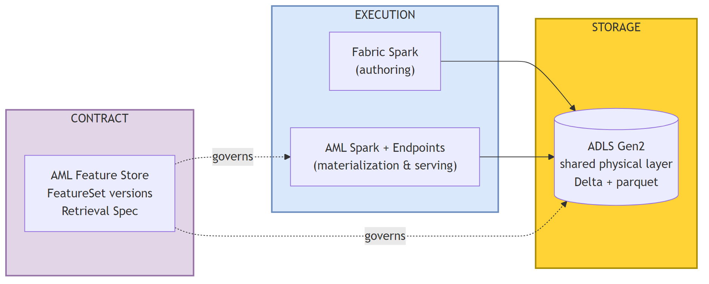
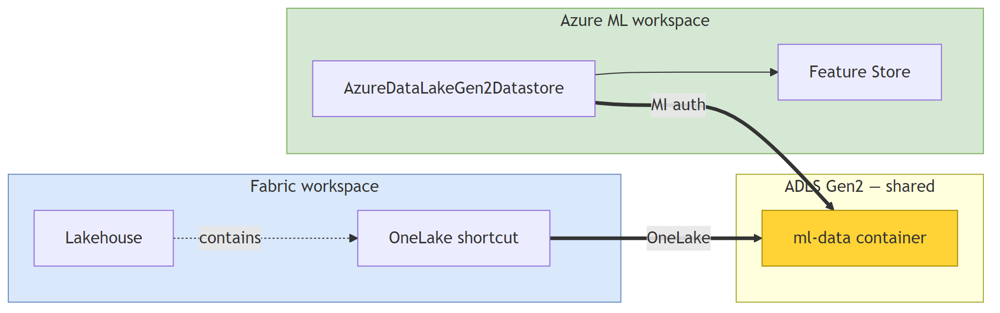
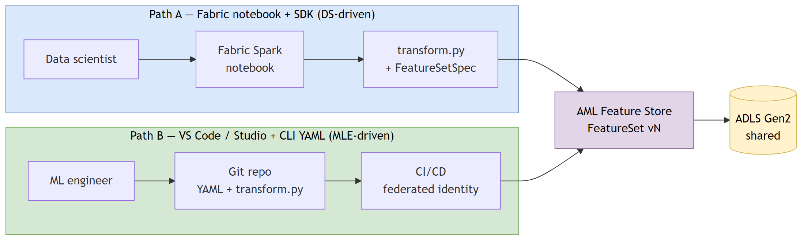
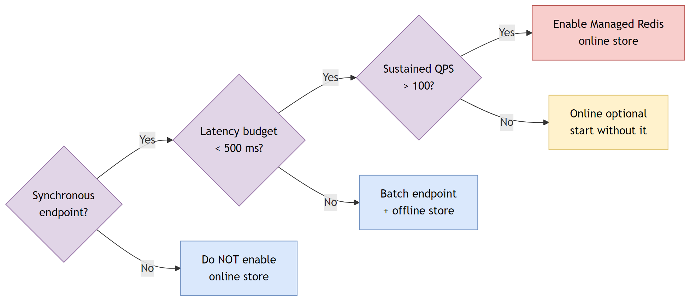
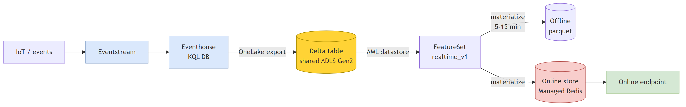
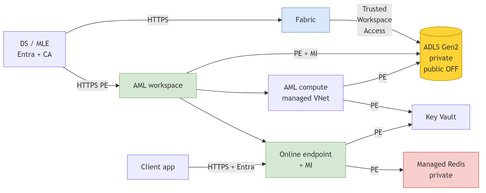
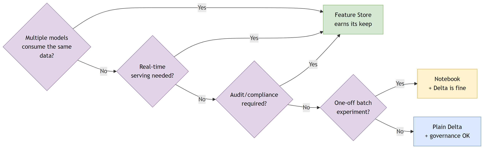

<!-- _class: lead -->
<!-- _paginate: false -->
<!-- _header: '' -->
<!-- _footer: '' -->

Architecture Brief · April 2026

# Feature engineering at scale. Fabric × Azure ML.

## One physical store. Two logical views. Three layers of responsibility. The defensible production pattern for ML platforms running on Microsoft Fabric.

### fredgis · github.com/fredgis/fabric-foundry-kb/

<!--
This deck distills the Fabric × Azure ML Feature Store guide into the architecture decisions a steering committee actually needs to take. Goal: leave the room with a single defensible target architecture, the rules to enforce it, and the FinOps + governance model around it.
-->

---

<!-- _class: chapter -->
<!-- _header: '' -->

01

# The Problem

Microsoft Fabric does not ship a native feature store. So how do we run feature engineering at industrial scale on Fabric without inventing a one-off?

---

# What is a feature store?

A **feature store** is the contract between data engineering and ML serving. It guarantees that a feature computed for training is the **same** feature computed for inference.

It owns four things data alone cannot:

- **Definition** — versioned, immutable, named transformations
- **Lineage** — source-to-prediction graph
- **Materialization** — offline (training) and online (sub-ms serving)
- **Point-in-time correctness** — no leakage

×3

platforms it has to interface — Fabric, Azure ML, ADLS Gen2

0

native feature store in Fabric today

1

defensible production pattern

<!--
The feature store is not a database. It is a contract. The whole point is that a column called customer_avg_basket_30d is computed exactly the same way at training time and at serving time, otherwise the model collapses in production. Fabric does not provide that primitive today, so we borrow it from Azure ML Managed Feature Store.
-->

---

# A Lakehouse table is *not* a feature store

### A Lakehouse Delta table gives you

- Schema, ACID, time travel
- Spark and SQL access
- Lineage in Purview
- Sharing via OneLake

### A Lakehouse Delta table does *not* give you

- Versioned, immutable feature definitions
- A feature retrieval spec embedded in the model
- Online serving in sub-millisecond
- Point-in-time joins primitive
- A registry of which model uses which feature

> The Lakehouse table is the *raw material*. The feature store is the *finished product* with a part number on it.

<!--
This is the slide that ends every "we don't need a feature store, we have Fabric" debate. A Delta table is a great storage primitive. It is not a contract between training and serving. The day you have two models reading the same Gold table with two slightly different aggregation windows, you are paying the feature store debt without the feature store.
-->

---

<!-- _class: chapter -->
<!-- _header: '' -->

02

# The Fundamental Insight

Storage ≠ contract ≠ execution. Three layers, three responsibilities, three Azure components — designed to never overlap.

---

# Three layers, three roles

> **Storage** is one product. **Contract** is another. **Execution** is a third. The day someone tries to merge two of them, push back: storage in Fabric, contract in AML, execution split — that is the rule.

<!--
This is the only architecture diagram you need to memorize. Storage is one product, contract is another, execution is a third. The day someone in your organization tries to merge two of them, you push back: storage in Fabric, contract in AML, execution split — that is the rule.
-->

---

# Why Fabric and Azure ML are *complementary*

| What you need                                | Fabric provides     | Azure ML provides       |
| -------------------------------------------- | ------------------- | ----------------------- |
| Lakehouse storage on OneLake                 | **Native (GA)**     | None                    |
| Spark for feature engineering                | **Native (GA)**     | Yes (managed clusters)  |
| Feature store + versioning + retrieval spec  | None                | **Native (GA)**         |
| Online sub-millisecond serving               | None                | **Native (GA)**         |
| Managed online & batch endpoints             | Limited (preview)   | **Native (GA)**         |
| Model registry + lineage                     | Limited             | **Native (GA)**         |
| OneLake datastore (preview)                  | n/a                 | Public preview          |

> **They are not redundant.** They are two products built for two adjacent problems. The integration is what makes them an industrial platform.

---

<!-- _class: chapter -->
<!-- _header: '' -->

03

# The Recommended Architecture

One ADLS Gen2 account per environment. Two logical views. Zero duplication. The defensible default for production today.

---

# Reference architecture — simple view

<!--
This is the architecture you draw on a whiteboard for the steering committee. Three swimlanes: Fabric on the left, the shared ADLS Gen2 in the middle, Azure ML on the right. Both sides see the same physical bytes. There is no sync job and no second copy. Says: ADLS Gen2 is the single physical contract; Fabric and AML each see it through their own native object; identity is Entra everywhere; predictions land back on the same ADLS Gen2 and reappear in Fabric via the shortcut.
-->

---

# The contract — ADLS Gen2 + OneLake shortcut

> *"Azure Machine Learning can't directly access data stored in Fabric OneLake, but you can configure a OneLake shortcut and an Azure Machine Learning datastore to both access the same Azure Data Lake storage account."* — **Microsoft Learn**, `how-to-use-batch-fabric`

<!--
Read this Microsoft Learn quote carefully. It rules out the tempting but unsupported pattern of giving AML a connector directly into OneLake, and it prescribes the exact pattern: a dedicated ADLS Gen2 account seen in parallel by both products.
-->

---

# Recommended target architecture (single page)

| Domain          | Recommendation                                                                                                                                                |
| --------------- | ------------------------------------------------------------------------------------------------------------------------------------------------------------- |
| **Storage**     | One ADLS Gen2 per environment, OneLake shortcut on Fabric, datastore on AML. **No blob versioning** on Delta containers — Delta `_delta_log` owns history. |
| **Authoring**   | Path A (Fabric notebook) **and** Path B (Studio / VS Code + CLI YAML) coexist. Same artifacts in AML.                                                          |
| **Lifecycle**   | AML Feature Store is the single source of truth. A Lakehouse table is *not* a feature set until it is registered.                                              |
| **Serving**     | Offline by default. Online (Managed Redis) only if a sync endpoint needs it.                                                                                  |
| **Orchestration** | AML pipelines or ADF for SLA-bound batches. Fabric Data Factory AML activity (preview) for non-critical only.                                                |
| **Identity**    | Managed Identity everywhere. Entra for humans. Federated workload identity for CI/CD. **No SAS, no keys, no long-lived secrets.**                              |
| **Network**     | Private endpoints on storage, AML, online store. Trusted Workspace Access for Fabric. Public access OFF.                                                      |
| **Governance**  | Purview ingests both lineages. Sensitivity labels propagate. Each model embeds its retrieval spec.                                                            |

---

<!-- _class: chapter -->
<!-- _header: '' -->

04

# Two Authoring Paths

DS-driven from Fabric, MLE-driven from CI. Same artifacts. Same storage. Different humans, different ergonomics.

---

# Path A vs Path B — both end up in the same place

<!--
Both paths produce byte-identical artifacts in the AML Feature Store and write to the same ADLS Gen2. The difference is the human plus the local environment. Materialization is always done by AML Spark — never by Fabric Spark, even on Path A. This slide kills the "we have to choose one" debate.
-->

---

# Decision: which path for *this* feature set?

| Criterion                                           | Path A — Fabric notebook | Path B — VS Code + CLI YAML |
| --------------------------------------------------- | :----------------------: | :-------------------------: |
| Author is a data scientist                          | ✅                       |                             |
| Author is an ML engineer                            |                          | ✅                          |
| Feature set is exploratory / Spark-heavy            | ✅                       |                             |
| Feature set is industrialized / CI-first            |                          | ✅                          |
| Heavy use of Fabric semantic models / mirrored data | ✅                       |                             |
| Strong CI/CD discipline required                    |                          | ✅                          |
| Both paths in the same team                         | ✅                       | ✅                          |

> Both paths in the same organization is *not* a smell — it is the realistic outcome.

---

<!-- _class: chapter -->
<!-- _header: '' -->

05

# Materialization, Streaming, Serving

Where the bytes physically live, and how often they get rewritten. This is where the bill is decided.

---

# Offline vs online store

OFFLINE
<h3>ADLS Gen2 parquet</h3>
Partitioned by index + timestamp. Serves training, batch inference, exploration, backfills. Latency: seconds (Spark scan).

ONLINE
<h3>Azure Managed Redis</h3>
Sub-millisecond key-value. Serves real-time inference. <strong>Always-on cost</strong> — enable only when a sync endpoint actually needs it.

### Cost levers

- **Frequency** — every minute is 60× the cost of every hour. Align with the model's actual decision cadence.
- **Compute size** — start small (`Standard_E4s_v3` × 2). Scale only when SLA misses.
- **Lookback window** — `source_lookback.days` should reflect what you actually need.

---

# Decision tree — enable the online store?

<!--
The single biggest avoidable cost on a feature platform is enabling Redis for a batch-only model. This decision tree is the rule: no synchronous endpoint => no online store. Period.
-->

---

# Real-time / streaming features

> Fabric **Eventstream → Eventhouse → Delta on shared ADLS → AML FeatureSet** is the production-safe path today. Same storage contract as the batch flow. Pattern alternative: direct push to the online store when sub-second latency is non-negotiable.

---

<!-- _class: chapter -->
<!-- _header: '' -->

06

# Governance

Identity, network, lineage, audit. Where the platform either earns "production-grade" or quietly fails its first audit.

---

# Minimum-viable production network flow

<!--
This is the network minimum. Lacking any private endpoint above, or exposing ADLS Gen2 publicly, fails an architecture review on day one. Managed Identity on every edge — no account keys, no SAS, no long-lived secrets.
-->

---

# Identity rules

<strong>Managed Identity for everything that runs.</strong>AML compute, endpoints, datastore. `ManagedIdentityConfiguration`. No account keys.

<strong>Entra ID for every human.</strong>Conditional Access enforced on Fabric and on Azure ML. No service principal with stored secret unless absolutely required.

<strong>Federated workload identity for CI/CD.</strong>GitHub OIDC → Entra. No long-lived secret in pipeline variables.

<strong>RBAC on Key Vault, not access policies.</strong>`Key Vault Secrets User`, `Key Vault Crypto Service Encryption User`.

---

# Data contracts — the missing validation gate

The Gold table silently degrades. The FeatureSet keeps materializing on noise. Every downstream model is wrong, and the audit trail says everything is fine.

| Check                | Example                                                          | Tooling                                      |
| -------------------- | ---------------------------------------------------------------- | -------------------------------------------- |
| **Schema**           | `customer_id` is `string`, non-nullable                          | Fabric DQ rules / Great Expectations         |
| **Freshness**        | `MAX(last_event_ts) ≥ now() - 24h`                               | KQL or SQL probe                             |
| **Cardinality**      | `COUNT(DISTINCT customer_id)` within ±10 % of 7-day rolling avg  | Great Expectations                           |
| **Null ratio**       | Per column, null ratio within `baseline ± 5 pp`                  | Great Expectations                           |
| **Distribution**     | KS-statistic vs previous run below threshold                     | Great Expectations / AML Data Drift          |

> Validation runs **before** the AML Feature Store materialization. A failed contract halts materialization, alerts the Gold owner, and the FeatureSet keeps serving the previous valid version.

---

<!-- _class: chapter -->
<!-- _header: '' -->

07

# FinOps

Two billing units. Three rules. One way to keep the bill explainable.

---

# Two platforms, two billing units

| Platform          | Unit                                                             | Granularity                          | Cost owner                             |
| ----------------- | ---------------------------------------------------------------- | ------------------------------------ | -------------------------------------- |
| **Fabric**        | Capacity Units (F-SKU or PPU)                                    | Per-second on a *shared* capacity    | Business domain owning the Lakehouse  |
| **Azure ML**      | Compute hours, per-job (batch), per-instance-hour (online), per-tier-hour (online store) | Per-second on dedicated clusters     | AML workspace cost center; chargeback to model owner if dominant |
| **Shared infra**  | ADLS Gen2, Key Vault, Purview, App Insights, private endpoints  | Per-GB / per-asset / hour-based      | Platform team budget                   |

### Three chargeback rules

1. **Author features close to the cheaper compute** — Fabric for exploration when the capacity has headroom; AML for production materialization (right-sizable per FeatureSet).
2. **Tag every AML compute target** with `cost_center` / `model_name` / `feature_set`. Same on Fabric items.
3. **Cap the Fabric capacity for the ML workspace** — a runaway Spark notebook can saturate a capacity shared with Power BI.

---

# Cost map

| Component             | Driver                                                   | Lever                                                   |
| --------------------- | -------------------------------------------------------- | ------------------------------------------------------- |
| **ADLS Gen2**         | GB × redundancy × tier                                   | Lifecycle policy → cool/archive. Soft delete sized.     |
| **AML materialization** | Cluster size × runtime × frequency                     | Right-frequency. Right-size. Spot for non-critical.     |
| **AML training**      | GPU hours × cluster × experiments                        | Quotas per DS. Auto-shutdown idle clusters.             |
| **AML online endpoint** | vCPU/RAM × hours × instances                           | Realistic min/max. Serverless for spiky low-volume.     |
| **Online store (Redis)** | Tier × shards × hours (always-on)                     | **Enable only when an online endpoint exists.**         |
| **AML batch endpoint** | Per-job compute hours                                   | No standing cost. Cheapest for non-real-time scoring.   |
| **Network**           | PE per hour + cross-region egress                        | One PE per service per env. Same region for ADLS/AML/Fabric. |

---

<!-- _class: chapter -->
<!-- _header: '' -->

08

# Operations & Decision

SLOs, alerts, lifecycle. And the question: *do I really need a feature store?*

---

# Per-FeatureSet SLOs (suggested defaults)

| SLO                                    | Target                                | Why                                              |
| -------------------------------------- | ------------------------------------- | ------------------------------------------------ |
| **Materialization success rate**       | ≥ 99 % over 30 days                   | Primary indicator of offline freshness            |
| **Materialization end-to-end latency** | P95 ≤ 2× scheduled interval           | A run longer than the cadence will pile up        |
| **Feature freshness**                  | ≤ scheduled interval + 15 min          | The contract DS and consumers depend on           |
| **Schema conformance**                 | 100 %                                 | Schema drift breaks training/serving parity       |

### Pre-promotion test gate (CI before `stage = Production`)

- **Point-in-time correctness** — regenerated training set matches the prior captured set
- **Null ratio** within `baseline ± 5 pp`
- **Entity cardinality** within `±10 %` of the 7-day rolling average
- **Distribution drift** — KS-statistic below threshold (e.g., 0.1)

---

# Decision tree — feature store or plain Delta table?

<!--
A feature store is not a dogma. For a single batch model with 15 simple columns and one consumer, a well-governed Delta table is enough. For a multi-model platform with real-time serving and audit obligations, the feature store earns its keep.
-->

---

# Top 5 anti-patterns

A1
<h3>Two storage accounts with sync jobs</h3>
Fabric and AML each keep their tooling, two truths drift. Use one shared ADLS Gen2.

A2
<h3>Blob versioning on Delta containers</h3>
Conflicts with the Delta `_delta_log`. Breaks `OPTIMIZE` / `VACUUM`. Cost rises 2–10×.

A3
<h3>Online store for a batch-only model</h3>
Pays Redis 24/7 for nothing. Enable only with an active sync endpoint.

A4
<h3>Account keys / SAS tokens in notebooks</h3>
Security review will block production. Use Managed Identity.

A5
<h3>Production SLA on a Preview activity</h3>
Fabric DF AML activity is in Preview. Use AML pipelines for SLA-bound batches.

A6
<h3>Registering a Gold table without a data contract</h3>
Silent degradation propagates to every model. Validate before each materialization.

---

# Production checklist (excerpt)

### Storage

- HNS enabled, PE enabled, public access OFF
- CMK via Key Vault
- Soft delete on, **blob versioning OFF on Delta containers**
- Trusted Workspace Access for Fabric
- AML MI = `Storage Blob Data Contributor`

### Identity & CI/CD

- Workload identity federation in CI
- PR gates on `feature_sets/**`
- `az ml feature-set validate` on every PR
- Environment-promoted CD, no long-lived secrets

### FeatureSet & model

- Source data has timestamp + entity columns
- Online store **only** when sync endpoint exists
- Each model embeds its `feature_retrieval_spec.yaml`
- MLflow tracks every training run

### Governance

- Purview ingests Fabric + AML lineages
- Each model has owner, business case, monitoring plan
- Audit retention ≥ 5 years (EU AI Act high-risk)
- Quarterly access reviews
- **Data contract per Gold source enforced before materialization**

---

<!-- _class: closing -->

## Take-aways

# One contract. Two views. Three layers.

ADLS Gen2 shared. AML owns the contract. Fabric and AML both run execution.

Build everything else on those four sentences.

<!--
If the meeting forgets every slide, they should remember this. One physical store. Two logical views. Three layers of responsibility — storage, contract, execution. And the production-grade pattern is GA today: shared ADLS Gen2 + OneLake shortcut + AzureDataLakeGen2Datastore.
-->

---

<!-- _header: '' -->

# References

- **Full guide** — `markdown/Fabric_AzureML_Feature_Store.md` (`pdf/`)
- **Microsoft Learn — Fabric × Azure ML batch endpoints** — [`how-to-use-batch-fabric`](https://learn.microsoft.com/en-us/azure/machine-learning/how-to-use-batch-fabric?view=azureml-api-2)
- **Microsoft Learn — AML Managed Feature Store** — [`concept-what-is-managed-feature-store`](https://learn.microsoft.com/en-us/azure/machine-learning/concept-what-is-managed-feature-store?view=azureml-api-2)
- **Microsoft Learn — OneLake datastore (preview)** — [`how-to-datastore` — section *Create a OneLake datastore (preview)*](https://learn.microsoft.com/en-us/azure/machine-learning/how-to-datastore?view=azureml-api-2#create-a-onelake-microsoft-fabric-datastore-preview)
- **Tech Community — Build your feature engineering system on AML Managed FS and Microsoft Fabric (2024)** — [techcommunity.microsoft.com](https://techcommunity.microsoft.com/blog/azurearchitectureblog/build-your-feature-engineering-system-on-aml-managed-feature-store-and-microsoft/4076722)
- **Repository** — [github.com/fredgis/fabric-foundry-kb](https://github.com/fredgis/fabric-foundry-kb)
