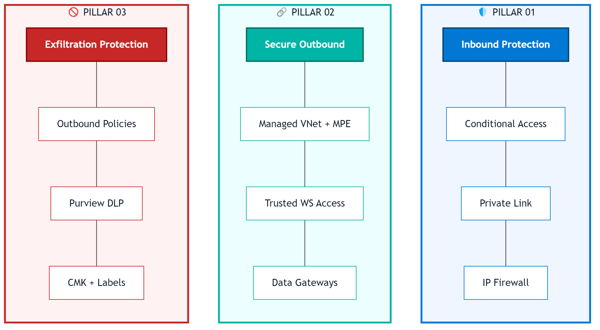
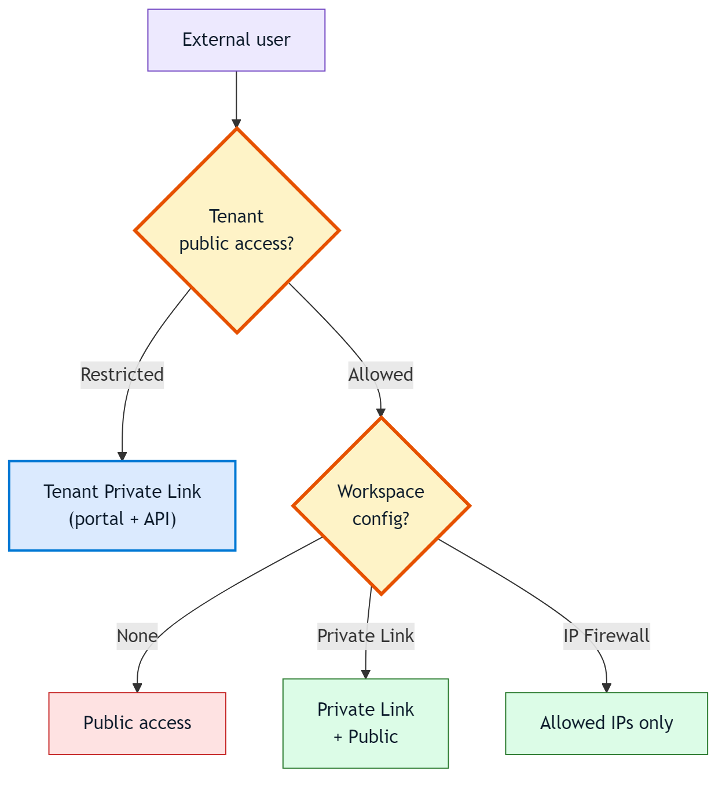
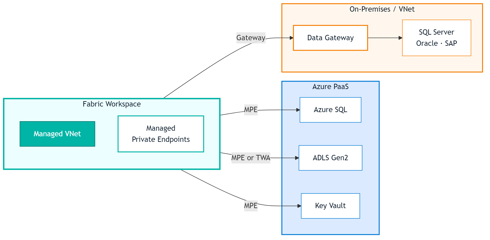
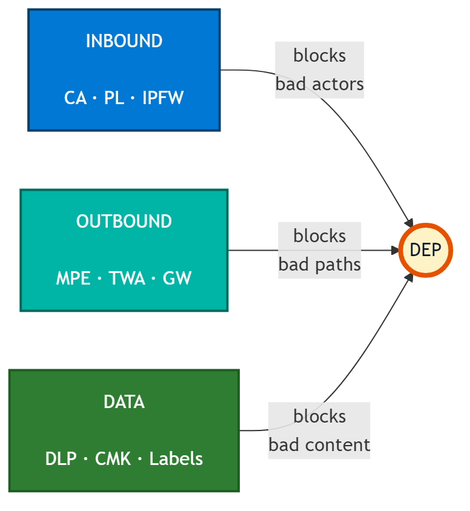
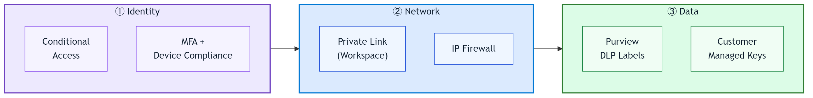

<!-- _class: lead -->
<!-- _paginate: false -->
<!-- _header: '' -->
<!-- _footer: '' -->

Architecture Brief · April 2026

# Network Security in Microsoft Fabric.

## Three pillars. Zero public exposure. One coherent architecture for enterprise-grade data platforms.

### fredgis · github.com/fredgis/Divers

---

<!-- _header: '' -->

# The Shift

Fabric is **SaaS**. The public endpoint *is* the platform.

Network security becomes a **composition of controls** — each addressing a threat surface, none of them sufficient alone.

The goal: **layered containment** that assumes breach at every tier.

3

pillars of network defense

0

trust assumptions — Zero Trust by design

1

coherent DEP architecture

---

# The Three Pillars

---

# Each Pillar Answers a Different Question

PILLAR 01

<h3>Inbound Protection</h3>

<strong>Who</strong> can access Fabric?

Conditional Access Private Link IP Firewall

PILLAR 02

<h3>Secure Outbound</h3>

<strong>How</strong> does Fabric reach private sources?

Managed VNet MPE TWA Gateways

PILLAR 03

<h3>Exfiltration Protection</h3>

<strong>Where</strong> can data go?

Outbound Policies Purview DLP

---

# End-to-End Flow

---

<!-- _class: chapter -->

01

# Inbound Protection.

Controlling who — and from where — can reach the Fabric tenant.

---

# Conditional Access

<h3>Policies evaluate</h3>

- **User / Group** · per business unit
- **Location** · untrusted countries
- **Device** · Intune compliance
- **Risk level** · P2 licence
- **App** · per-client granularity

<h3>Enforce</h3>

MFA Session lifetime PIM

<h3>Requirements</h3>

| Component | Level |
|-----------|-------|
| Entra ID | **P1** |
| MFA | **Required** |
| Device compliance | Intune |
| Risk-based CA | **P2** |

> **Rule of thumb.** If CA isn't configured, nothing below matters.

---

# Private Link — Tenant vs Workspace

TENANT-LEVEL

<h3>All-or-Nothing</h3>

Single service for the entire tenant.

Simpler deploy
Spark starter pools off
Some features unsupported

WORKSPACE-LEVEL · RECOMMENDED

<h3>Surgical Isolation</h3>

One service per workspace. Isolate only what needs it.

Per-workspace scope
Share a VNet
Tenant admin toggle

> Both require a **Private DNS Zone** (`privatelink.fabric.microsoft.com`). Forgetting it is the #1 reason PL "doesn't work" on first deployment.

---

# IP Firewall Rules

Allow Fabric on the public internet — but only from **declared IP ranges**. No VNet needed.

**Limits**

- No Power BI items yet
- No Fabric databases yet
- REST API always reachable
- Max **100 rules** per WS

<h3>Supported items</h3>

Lakehouse
Warehouse
Notebook
Pipeline
Dataflow Gen2
Eventstream
Mirrored DB

<h3>Combines with</h3>

Private Link + IP Firewall → private paths and allowed public IPs both permitted. Everything else denied.

GA since early 2026

---

# Tenant × Workspace Interaction

Two knobs, combined:

- **Tenant** `Allowed` or `Restricted`
- **Workspace** `None`, `PL`, or `IP Firewall`

<strong>Non-obvious:</strong> when tenant public access is <em>restricted</em>, workspace-level PL enables <strong>API access only</strong>. Portal needs tenant-level PL.

---

<!-- _class: chapter -->

02

# Secure Outbound.

Reaching private data sources — without crossing the public internet.

---

# Outbound Architecture

---

# Managed VNet & Private Endpoints

<h3>Managed VNet</h3>

- **Microsoft-managed** per workspace
- Activated on first Spark job
- All outbound routed through it

<h3>Managed Private Endpoints</h3>

- Private connections to Azure PaaS
- Traffic on Microsoft backbone
- Target service can block public access

<h3>Supported targets</h3>

Azure SQL DB
ADLS Gen2
Cosmos DB
Key Vault
Synapse
Purview
Event Hub

> **MPE flow.** Create → target admin approves → private traffic flows. Approval is intentional — prevents bypass.

---

# Trusted Workspace Access

TWA reaches **firewalled ADLS Gen2** *without* deploying a Private Endpoint.

Useful when MPE is overkill — single target, simple RBAC.

<h3>Pick TWA over MPE when</h3>

- Target is **ADLS Gen2 only**
- No VNet infra desired
- Speed > isolation purity

<h3>Prerequisites</h3>

<strong>F SKU capacity</strong>Trial / PPU don't qualify

<strong>Workspace Identity</strong>Generated by admin

<strong>Storage RBAC</strong>Storage Blob Data Contributor

<strong>Resource Instance Rule</strong>On the storage firewall

---

# Data Gateways

ON-PREMISES DATA GATEWAY

<h3>Bridge to corporate networks</h3>

Agent on a server inside your network. Encrypts outbound to Fabric.

✓ SQL Server, Oracle, SAP, Teradata 
✓ Clustering for HA 
✓ Kerberos SSO supported

VNET DATA GATEWAY

<h3>Managed gateway in your VNet</h3>

No VM to maintain. Fully managed, deployed in your VNet.

✓ SQL on IaaS, private endpoints 
✓ <strong>Certificate auth · GA</strong> 
✓ <strong>Enterprise proxy · GA</strong>

---

# Outbound Connector Matrix

| Target | MPE | TWA | On-Prem GW | VNet GW |
|--------|:---:|:---:|:----------:|:-------:|
| **ADLS Gen2** | ✓ | ✓ | — | ✓ |
| **Azure SQL** | ✓ | — | ✓ | ✓ |
| **Cosmos DB** | ✓ | — | — | ✓ |
| **Key Vault** | ✓ | — | — | — |
| **SQL Server IaaS / on-prem** | — | — | ✓ | ✓ |
| **Synapse** | ✓ | — | — | ✓ |
| **Purview** | ✓ | — | — | — |
| **Event Hub / Service Bus** | ✓ | — | — | ✓ |
| **SAP / Oracle on-prem** | — | — | ✓ | — |

> **Heuristic.** Azure PaaS → MPE. On-prem → On-Prem GW. Your VNet → VNet GW. ADLS only → TWA.

---

<!-- _class: chapter -->

03

# Exfiltration Protection.

Controlling *where* data goes — not just how it gets out.

---

# Outbound Access Policies

Traffic must match a <strong>declared destination</strong> — MPE or Data Connection. Anything else: blocked by default.

---

# The Full DEP Picture

Data Exfiltration Protection isn't a single feature — it's the **convergence of three layers**.

- **Inbound** blocks *bad actors* at the door
- **Outbound** blocks *bad paths* to the outside
- **Data** blocks *bad content* even on authorized paths

<strong>Remove any one layer and DEP leaks.</strong> Network alone won't stop an authenticated user emailing a spreadsheet. Labels alone won't stop a rogue notebook posting to an unknown endpoint.

---

# Content Controls · Layer 3

EXPORTS

<h3>Power BI Export Restrictions</h3>

Disable Excel / CSV / PPTX exports on sensitive workspaces.

ENDPOINT

<h3>Endpoint DLP</h3>

Purview + Intune to block copy to USB or personal cloud.

CLASSIFY

<h3>Sensitivity Labels</h3>

Auto-apply via Purview — labels travel with the data.

ENCRYPT

<h3>Customer Managed Keys</h3>

Additional encryption boundary with full key control.

---

<!-- _class: chapter -->

04

# Operations.

DNS, monitoring, testing — the layers that make it actually work.

---

# DNS · The Silent Killer

Without the Private DNS Zone, clients resolve the public IP — Private Link then blocks. The result: <em>"works from one machine but not another."</em>

---

# Monitoring Stack

DIAGNOSTICS

<h3>Log Analytics</h3>

Access patterns, query perf, errors.

NETWORK

<h3>Network Watcher</h3>

VNet flows, connectivity tests, PE reachability.

SECURITY

<h3>Azure Sentinel</h3>

SIEM correlation. Anomalous access, failed CA.

COMPLIANCE

<h3>Microsoft Purview</h3>

Classification, DLP, sensitivity audit.

FIREWALL

<h3>Azure Firewall</h3>

Centralized egress logging. Static egress IP.

AUDIT

<h3>Quarterly review</h3>

Rotate IPs, re-validate CA policies.

---

# Validation Checklist

<strong>Resolve DNS from a client</strong><code>nslookup workspace.fabric.microsoft.com</code> must return a <strong>private IP (10.x)</strong>.

<strong>Test blocked public access</strong>From a non-allowed IP the connection must fail explicitly.

<strong>Spark cold start</strong>First Spark job activates the Managed VNet — measure latency.

<strong>MPE approval flow</strong>Verify the target service admin receives and can approve the request.

<strong>Exfiltration attempt</strong>Write to an undeclared destination. The policy must block it.

---

<!-- _class: chapter -->

05

# Recommendations.

What would I deploy in your context? Scenario-driven blueprints.

---

# Zero Trust · Reference Posture

Identity is the primary perimeter. Network is the second. Data is the last line.

---

# Architectures by Scenario

STANDARD ENTERPRISE

<h3>Balanced · Default choice</h3>

CA + Workspace PL + MPE + Outbound Policies.

REGULATED · GDPR · PCI

<h3>Maximum Control</h3>

CA + WS PL + MPE + Outbound Policies + <strong>Purview DLP</strong> + <strong>CMK</strong>.

HYBRID DATA ESTATE

<h3>On-prem integration</h3>

CA + IP Firewall + <strong>VNet Gateway</strong> + <strong>On-Prem Gateway</strong>.

MULTI-TEAM ISOLATION

<h3>Segregated workloads</h3>

CA + <strong>Per-workspace PL</strong> + Per-workspace outbound + <strong>PIM</strong>.

---

# Feature Roadmap

| Feature | Status | Notes |
|---------|:------:|-------|
| Conditional Access | GA | Since day one |
| Private Link (Tenant) | GA | All-or-nothing |
| Private Link (Workspace) | GA | **Recommended** |
| IP Firewall | GA | Early 2026 |
| Managed VNet / MPE | GA | Core outbound |
| Trusted Workspace Access | GA | ADLS Gen2 only |
| Outbound Access Policies | GA | End 2025 |
| VNet GW · Cert + Proxy | GA | April 2026 |
| Customer Managed Keys | GA | All workloads |
| Eventstream Private Network | Preview | Early 2026 |
| **Power BI** network protection | Planned | Late 2026 |
| **Fabric Database** network protection | Planned | No ETA |

---

<!-- _class: closing -->
<!-- _paginate: false -->
<!-- _header: '' -->
<!-- _footer: '' -->

## Takeaways

# Three pillars. Defense in depth. Zero blind spots.

Start with identity. Layer network controls. Finish with data classification. Test every layer. Monitor the whole stack.

Source: github.com/fredgis/Divers/markdown/Fabric_Network_Security.md

