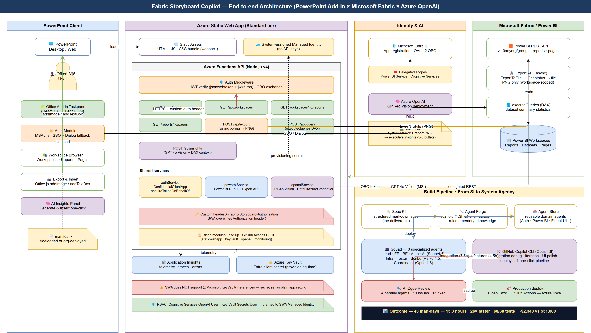
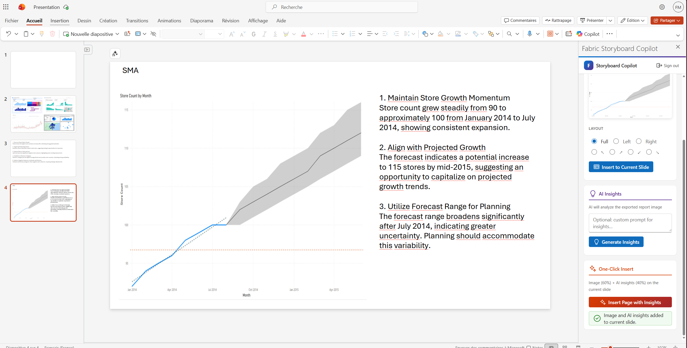
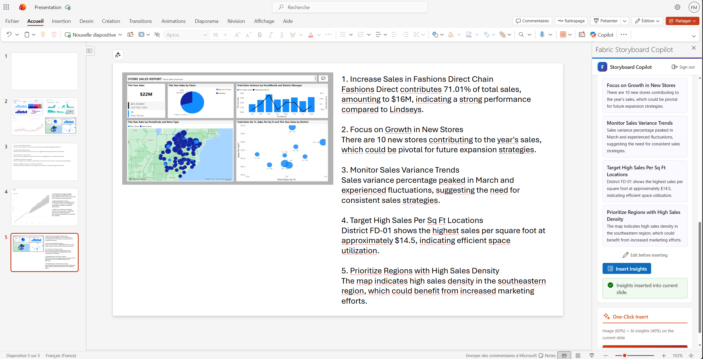
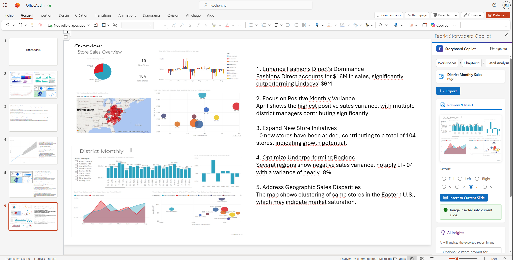
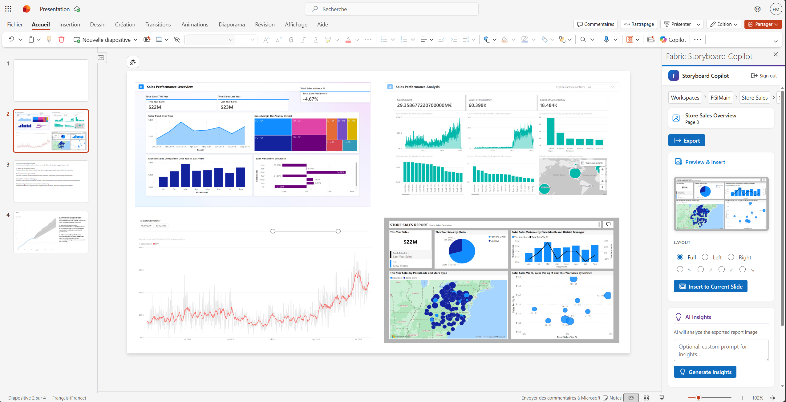
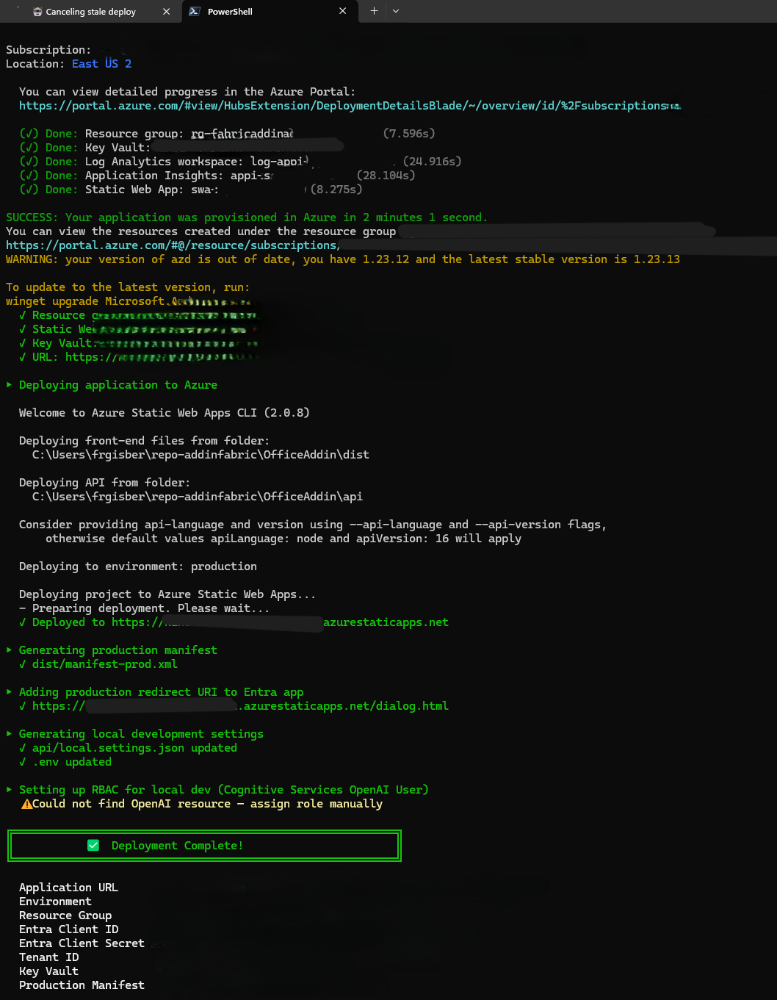
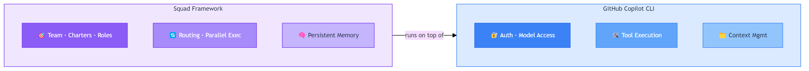
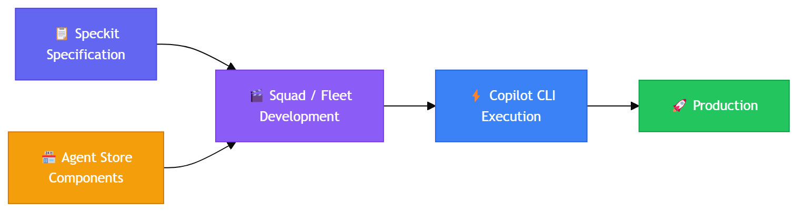

<!-- _class: lead -->
<!-- _paginate: false -->
<!-- _header: '' -->
<!-- _footer: '' -->

<div class="tag">Case Study · April 2026</div>

# From SI to System Agency.

## A PowerPoint × Microsoft Fabric add-in built in 13.3 hours.<br>By one developer. With eight Copilot agents.

### fredgis · github.com/fredgis/OfficeAddin

---

# The Question

<div class="split">

<div>

A Microsoft Fabric add-in for PowerPoint with **SSO**, **GPT-4o Vision**, **Bicep IaC**, **CI/CD**, and **end-to-end tests**.

Estimated by a traditional SI: **43 man-days**.

Delivered by a Squad: **13.3 hours**.

The interesting question isn't *how* — it's *what this means for the next decade of services*.

</div>

<div>

<div class="stat">
<div class="big">43</div>
<div class="label">man-days estimated · traditional SI</div>
</div>

<div class="stat">
<div class="big">13.3h</div>
<div class="label">actual · solo developer + Squad</div>
</div>

<div class="stat">
<div class="big">26×</div>
<div class="label">compression · same scope</div>
</div>

</div>

</div>

---

<!-- _class: chapter -->

<div class="num">01</div>

# The Project

Fabric Storyboard Copilot — a PowerPoint add-in that turns Power BI report pages into board-ready slides with one click, then writes the narrative with GPT-4o Vision.

---

# Reference Architecture



_PowerPoint client · Static Web App + Functions · Entra OBO · Power BI REST · GPT-4o Vision · Bicep + azd._

---

# What it does

<div class="cards">

<div class="card">
<div class="card-num">EXPERIENCE 1</div>
<h3>Browse & Insert</h3>
<p>List workspaces, expand reports, drop a page as <strong>PNG</strong> into the active slide.</p>
<p style="margin-top:8px"><span class="pill">Power BI REST</span> <span class="pill">Export-to-File</span></p>
</div>

<div class="card teal">
<div class="card-num">EXPERIENCE 2</div>
<h3>AI Insights</h3>
<p>Page + DAX summary → <strong>GPT-4o Vision</strong> → 3-5 executive bullets inserted as Fluent text box.</p>
<p style="margin-top:8px"><span class="pill">Vision</span> <span class="pill">executeQueries</span></p>
</div>

<div class="card orange">
<div class="card-num">EXPERIENCE 3</div>
<h3>Single Sign-On</h3>
<p>Office SSO via MSAL with <strong>OBO</strong> exchange. Dialog fallback when nested auth is disabled.</p>
<p style="margin-top:8px"><span class="pill">MSAL</span> <span class="pill">Entra OBO</span></p>
</div>

</div>

---

# The Taskpane



_Fluent UI v9 · React 18 · MSAL.js · Office.js — native Microsoft 365 look._

---

# Workspace Browser & Insert

<div class="split">

<div>



</div>

<div>



</div>

</div>

_Hierarchical browser — workspaces → reports → pages. One click inserts the rendered PNG._

---

# AI Insights with GPT-4o Vision

<div class="split right-wide">

<div>

The same exported PNG, plus DAX summary statistics from `executeQueries`, are sent to **GPT-4o Vision**.

The model returns **3-5 executive bullets** focused on:

- Trend or anomaly detected
- Magnitude vs prior period
- Suggested next action

Inserted next to the chart as a Fluent-styled text box.

</div>

<div>



</div>

</div>

---

# Tech Stack

<div class="cards two">

<div class="card">
<div class="card-num">FRONTEND</div>
<h3>React 18 · Fluent UI v9 · TypeScript · MSAL.js · Office.js</h3>
<p>Native M365 look · SSO with dialog fallback · `addImageFromBase64` / `addTextBox`.</p>
</div>

<div class="card teal">
<div class="card-num">BACKEND</div>
<h3>Azure Functions v4 · Node.js 20</h3>
<p>OBO middleware · service layer (auth · powerbi · openai) · async export polling.</p>
</div>

<div class="card purple">
<div class="card-num">AI &amp; IDENTITY</div>
<h3>Azure OpenAI GPT-4o Vision · Entra ID OBO · Managed Identity</h3>
<p>Per-user Power BI delegation · keyless AOAI access via MSI · DefaultAzureCredential.</p>
</div>

<div class="card orange">
<div class="card-num">PLATFORM</div>
<h3>Azure Static Web App · Key Vault · App Insights · Bicep · azd</h3>
<p>Static + API in one resource · MSI to Vault &amp; AOAI · one-command provisioning.</p>
</div>

</div>

---

<!-- _class: chapter -->

<div class="num">02</div>

# How We Built It

A roster of eight specialised agents, supervised by one developer through the GitHub Copilot CLI. Spec-first. Outcome-driven. Reviewable.

---

# The Squad


_Eight specialised agents · per-role model selection · curated context · shared memory._

---

# Roster — model picked per role

| Agent | Model | Mission |
|-------|-------|---------|
| Lead | Sonnet 4 | Spec interpretation, decomposition |
| Frontend | Sonnet 4 | React + Fluent UI + Office.js |
| Backend | Sonnet 4 | Functions, services, error handling |
| Auth | Sonnet 4 | MSAL, Entra OBO, JWT |
| AI | Sonnet 4 | Prompts, GPT-4o Vision integration |
| Infra | Haiku 4.5 | Bicep, RBAC, Key Vault, App Insights |
| Tester | Haiku 4.5 | 68 Jest + Playwright tests |
| Scribe | Haiku 4.5 | README, architecture, deployment guide |
| Coordinator | Opus 4.6 | Cross-agent integration & arbitration |

---

# Effort Distribution

<div class="split right-wide">

<div>

The headline 13.3 h hides where the work lives.

**Scaffold is fast** (1.3 h for 8 parallel agents).

**Integration is slow** (7.5 h of CLI debugging seams between agent outputs).

The rest: features (4.5 h), spec & forge (1 h), code review (0.5 h), deploy (0.5 h).

</div>

<div>


</div>

</div>

---

# The Bugs that Ate the Day

<div class="steps">

<div class="step"><div class="step-content"><strong>SWA strips <code>Authorization</code></strong><span>Custom header <code>X-Fabric-Storyboard-Authorization</code> + middleware.</span></div></div>

<div class="step"><div class="step-content"><strong>SWA does NOT support <code>@Microsoft.KeyVault()</code></strong><span>Read secret at provision time, inject as plain app setting; runtime reads Vault via MSI.</span></div></div>

<div class="step"><div class="step-content"><strong>Bicep circular dep · SWA ↔ Entra app</strong><span>Two-pass deploy — SWA placeholder, Entra registration, SWA settings update.</span></div></div>

<div class="step"><div class="step-content"><strong>Office.js <code>addImageFromBase64</code> ~1 MB limit</strong><span>Resize PNG to 1600 px before insertion.</span></div></div>

<div class="step"><div class="step-content"><strong>OBO token expiry mid Export-to-File poll</strong><span>Cache OBO token + single refresh on 401.</span></div></div>

</div>

---

# AI Code Review — 4 parallel agents

<div class="cards">

<div class="card red">
<div class="card-num">SECURITY · 6</div>
<h3>Issuer pinning, token cache</h3>
<p>JWT issuer must be pinned in dev; OBO cache eviction on logout.</p>
</div>

<div class="card orange">
<div class="card-num">PERF · 5</div>
<h3>Memoisation, polling</h3>
<p>Workspace tree memoisation; poll backoff for export.</p>
</div>

<div class="card">
<div class="card-num">STYLE · 4</div>
<h3>Naming, dead code</h3>
<p>Service-level naming, removed unused error helpers.</p>
</div>

<div class="card teal">
<div class="card-num">ARCH · 4</div>
<h3>Boundaries</h3>
<p>Auth middleware extracted, service interfaces typed.</p>
</div>

</div>

> **15 of 19 issues fixed in the same session. 4 deferred as v2 design decisions.**

---

# Deployment

<div class="split">

<div>



</div>

<div>


</div>

</div>

```powershell
.\deploy.ps1 -EnvName fabric-storyboard-prod -Location westeurope
# azd provision (Bicep) → Entra registration → manifest regen → azd deploy
```

---

<!-- _class: chapter -->

<div class="num">03</div>

# The Tooling Ecosystem

The CLI is not another agent. It's the conductor.

---

# Copilot CLI × Squad



_The Squad produces code. The CLI integrates, debugs, iterates — with the developer in the loop._

---

# Spec Kit · Agent Forge · Agent Store



_Spec is the deliverable. Forge engineers context. Store compounds across projects._

---

# Three Pillars

<div class="cards">

<div class="card">
<div class="card-num">PILLAR 1</div>
<h3>Spec Kit</h3>
<p>Structured markdown spec — problem, scope, contracts, acceptance criteria. <strong>Spec-first inverts the flow.</strong></p>
</div>

<div class="card teal">
<div class="card-num">PILLAR 2</div>
<h3>Agent Forge</h3>
<p>Context engineering — rules, memory, knowledge, MCP bindings. <strong>Forge produces the agent.</strong></p>
</div>

<div class="card purple">
<div class="card-num">PILLAR 3</div>
<h3>Agent Store</h3>
<p>Reusable domain agents — Auth, Power BI, Fluent UI, Bicep. <strong>Compounds across projects.</strong></p>
</div>

</div>

---

# Fleet vs Squad — scaling the model


_Solo (1 task) → Squad (one project, 5-10 agents) → Fleet (one programme, 50-500 agents)._

---

# Agents vs Skills

<div class="two-col">

<div>

### Agents

- Autonomous · model-driven
- Reason, plan, ask questions
- Have tools and memory
- **Cost**: per call, scales with model

</div>

<div>

### Skills

- Declarative scripts
- Deterministic, cheap
- Called *by* the agent
- **Cost**: near-zero per call

</div>

</div>

> **Right pattern: Agent + Skill.** Agent decides *what* and *why*. Skill executes *how* reproducibly.

---

<!-- _class: chapter -->

<div class="num">04</div>

# The Cost Model

What changes when delivery cost drops by an order of magnitude.

---

# Cost Tiers — Premium vs Standard


_Heavy reasoning on Opus / Sonnet · structural work on Haiku · caching + RAG do the rest._

---

# Side-by-side

| | Traditional SI | System Agency |
|---|---|---|
| Effort | 43 man-days | 13.3 h human + agent compute |
| Loaded cost | ~ **$31,000** | ~ **$2,340** |
| Margin | ~ 30 % on T&M | ~ 92 % on outcome billing |
| Lead time | 6-8 weeks calendar | 2 days |

> Numbers are illustrative — they vary by project. **The structure does not.**

---

<!-- _class: chapter -->

<div class="num">05</div>

# From SI to System Agency

The unit of value shifts from man-day to outcome. Margin shifts with it.

---

# The Shift

<div class="split right-wide">

<div>

The classic SI sells **man-days**. Margin works at delivery cost ≈ price − ~30 %.

Generative agents drop delivery cost by an order of magnitude. If price stays anchored to man-days, margin → 0.

If price anchors to **outcomes**, margin → 90 %+.

That is the System Agency model: **price the outcome, not the input.**

</div>

<div>

<div class="stat">
<div class="big">30%</div>
<div class="label">old margin · SI on T&amp;M</div>
</div>

<div class="stat">
<div class="big">92%</div>
<div class="label">new margin · agency on outcome</div>
</div>

<div class="stat">
<div class="big">10×</div>
<div class="label">delivery cost compression</div>
</div>

</div>

</div>

---

# Old World vs New World

| | Old (SI) | New (System Agency) |
|---|---|---|
| Unit | Man-day | Outcome / feature |
| Pricing | Time & materials | Fixed-price per outcome |
| Margin | 25-35 % | 70-90 % |
| Team | 5-50 humans | 1 human + Squad of agents |
| Differentiator | Headcount | Agent Store + IP |
| Sales cycle | RFP, proposals | Show, don't tell |

---

# Three Phases

<div class="cards">

<div class="card">
<div class="card-num">PHASE 1</div>
<h3>Copilot</h3>
<p>Agents <strong>assist</strong> humans. 2-3× productivity. <em>Most teams are here.</em></p>
</div>

<div class="card teal">
<div class="card-num">PHASE 2</div>
<h3>Agency</h3>
<p>Agents <strong>deliver</strong> outcomes; humans supervise. 10-30× productivity. <em>This project sits here.</em></p>
</div>

<div class="card purple">
<div class="card-num">PHASE 3</div>
<h3>Autonomous</h3>
<p>Agents close the loop with the customer; humans set strategy. 100×+. <em>Emerging.</em></p>
</div>

</div>

---

# Encoding IP — the new moat

<div class="split">

<div>

The competitive moat shifts from *people* to:

- **Agent definitions**
- **Prompts & memories**
- **Knowledge bases**
- **Skills & MCP servers**
- **Spec Kit templates**

Every project enriches the Agent Store. Every fix becomes a memory. Every spec becomes a template.

</div>

<div>

> **Compounding is the new differentiator.**
>
> Old SIs accumulate headcount. Agencies accumulate IP. The growth curves diverge.

</div>

</div>

---

# Emerging Roles

<div class="cards two">

<div class="card">
<div class="card-num">SPEC AUTHOR</div>
<h3>Translates business intent into Spec Kit documents.</h3>
<p>The deliverable is the spec. Quality dominates everything downstream.</p>
</div>

<div class="card teal">
<div class="card-num">AGENT ENGINEER</div>
<h3>Designs, forges, and maintains agents.</h3>
<p>Curates the Store. Owns memory hygiene and prompt economy.</p>
</div>

<div class="card purple">
<div class="card-num">CONDUCTOR</div>
<h3>Orchestrates the Squad through the CLI.</h3>
<p>Resolves integration conflicts. Decides when to ship.</p>
</div>

<div class="card orange">
<div class="card-num">RAINMAKER</div>
<h3>Sells outcomes, not headcount.</h3>
<p>"Show, don't tell." Live demos beat 60-page proposals.</p>
</div>

</div>

---

# Getting Started

<div class="steps">

<div class="step"><div class="step-content"><strong>Pick one non-critical project</strong><span>Run it end-to-end with a Squad. Measure honestly.</span></div></div>

<div class="step"><div class="step-content"><strong>Capture everything</strong><span>Prompts, agent definitions, memories, fixes — all into the Agent Store.</span></div></div>

<div class="step"><div class="step-content"><strong>Re-use on the second project</strong><span>Measure compression. The number will surprise you.</span></div></div>

<div class="step"><div class="step-content"><strong>Refactor the Store after three projects</strong><span>Promote the most-reused agents to first-class.</span></div></div>

<div class="step"><div class="step-content"><strong>Price the fourth project on outcome</strong><span>That's the inflection. Margin structure flips here.</span></div></div>

</div>

---

# Lessons Learned

<div class="cards two">

<div class="card red">
<div class="card-num">LESSON 1</div>
<h3>Scaffold is free. Integration is the work.</h3>
<p>Plan calendar around the seams between agent outputs, not the agents themselves.</p>
</div>

<div class="card">
<div class="card-num">LESSON 2</div>
<h3>Pick the right model per role.</h3>
<p>Haiku for structure, Sonnet/Opus for reasoning. The cost curve is non-linear.</p>
</div>

<div class="card teal">
<div class="card-num">LESSON 3</div>
<h3>AI code review is non-negotiable.</h3>
<p>Four parallel reviewers catch what one human misses. Cheap and fast.</p>
</div>

<div class="card purple">
<div class="card-num">LESSON 4</div>
<h3>Spec quality dominates.</h3>
<p>A bad spec produces eight bad agents in parallel. Invest there first.</p>
</div>

</div>

---

<!-- _class: closing -->

## CASE STUDY · CONCLUSION

# 13.3 hours.<br>One developer.<br>Eight agents.

A working PowerPoint × Microsoft Fabric add-in — SSO, GPT-4o Vision, Bicep, CI/CD, end-to-end tests. The artefact matters less than the production system that built it.

The compression is real. The margin shift is structural. **The System Agency model is what wins the next decade.**

_github.com/fredgis/OfficeAddin · github.com/fredgis/fabric-foundry-kb_
