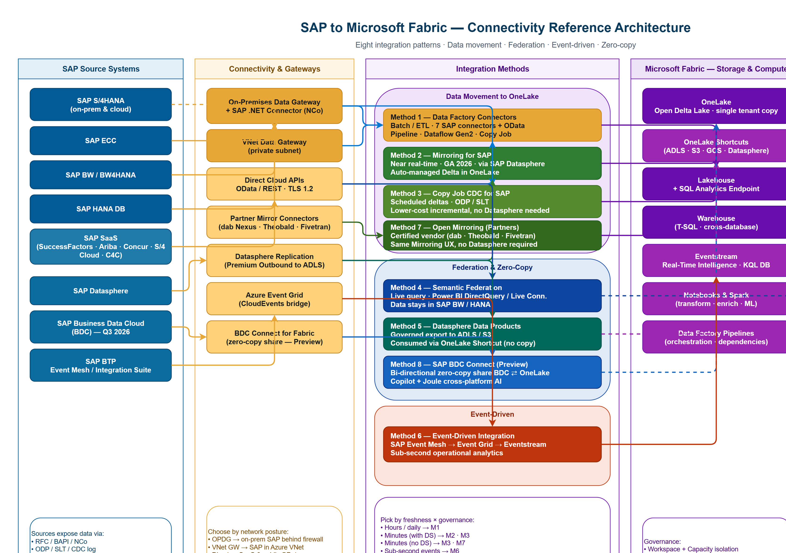

<!-- _class: lead -->
<!-- _paginate: false -->
<!-- _header: '' -->
<!-- _footer: '' -->

Architecture Brief · April 2026

# SAP to Microsoft Fabric.

## Eight integration patterns. One unified data estate. From batch ETL to zero-copy AI.

### fredgis · github.com/fredgis/fabric-foundry-kb/

---

# The Question

Every SAP-to-Fabric project starts with the same trade-off:

**move the data, federate it, or stream it?**

The right answer depends on freshness, governance ownership, source system, and whether SAP Datasphere is licensed.

Fabric exposes **eight** distinct patterns — picking wisely avoids re-platforming a year later.

8

integration patterns in 2026

3

categories: movement · federation · events

1

copy of the data — OneLake

---

# Reference Architecture

_Five layers · sources → connectivity → methods → Fabric storage → consumption._

---

# The Three Categories

CATEGORY A

<h3>Data Movement</h3>

Land SAP data in <strong>OneLake</strong> as Delta tables. Best freshness for analytics & AI.

M1 Batch M2 Mirroring M3 Copy CDC M7 Open Mirror

CATEGORY B

<h3>Federation & Zero-Copy</h3>

Data <strong>stays in SAP</strong>. Fabric queries live or via shortcut.

M4 Semantic M5 Datasphere DP M8 BDC Connect

CATEGORY C

<h3>Event-Driven</h3>

Sub-second operational signals via <strong>SAP Event Mesh → Fabric RTI</strong>.

M6 Eventstream

---

<!-- _class: chapter -->

A

# Data Movement.

---

# M1 — Data Factory Connectors

The **default**, mature path. Seven dedicated SAP connectors plus OData for SaaS sources.

- **SAP HANA**, **SAP BW Application Server**, **SAP BW Open Hub**, **SAP Table**, **SAP ECC**, **SAP S/4HANA**, **SAP Cloud for Customer**
- Built-in to **Pipelines**, **Dataflow Gen2**, and **Copy Job**
- On-prem SAP requires **OPDG + SAP .NET Connector (NCo)**

**Best for:** historical loads, daily refresh, predictable batch windows.

7

native SAP connectors

3

authoring surfaces (Pipeline · DFG2 · Copy Job)

GA

since 2023 — proven at scale

---

# M2 — Mirroring for SAP

**Near real-time replication** of SAP data to OneLake — orchestrated through SAP Datasphere.

- Continuous CDC pushed to a managed **Delta Lake** in OneLake
- **No custom ETL.** Schema and table list configured once
- SQL Analytics Endpoint auto-provisioned
- Direct Lake semantic models read it instantly

**Trade-off:** requires **SAP Datasphere** licensing.

GA

2026 · production-ready

~min

end-to-end latency

0

ETL code to write

---

# M3 — Copy Job CDC for SAP

A **lighter alternative** to Mirroring — scheduled deltas via the **Copy Job** experience, no Datasphere required.

- Uses **ODP** / **SAP SLT** to capture changes
- Configurable frequency (minutes → hours)
- Cheaper compute than continuous mirroring
- Ideal companion to multi-source Pipelines

**Best for:** mid-volume incremental loads, cost-conscious teams.

Preview

FabCon 2026 announcement

No DS

SAP Datasphere not required

CDC

native delta capture

---

# M7 — Open Mirroring (Partner-led)

Same Mirroring **UX and SQL endpoint**, but the replication is driven by a **certified partner connector**.

- **dab Nexus**, **Theobald Xtract Universal**, **Fivetran**, others
- No SAP Datasphere licensing required
- Partner handles ODP / SLT / log-based capture
- Fabric handles storage, governance, BI

**Best for:** mid-market without Datasphere, or teams already invested in a partner tool.

3+

certified partners GA

~min

near real-time

No DS

vendor-managed pipe

---

<!-- _class: chapter -->

B

# Federation & Zero-Copy.

---

# M4 — Semantic Federation

Data **never leaves SAP**. Power BI queries SAP BW or HANA **live**.

- **Live Connection** to SAP BW (BEx queries, multi-providers)
- **DirectQuery** to SAP HANA (calc views, native SQL)
- Single sign-on with Entra ID
- SAP-side row-level security honored

**Best when:** governance, regulation, or contracts forbid copying SAP data.

0

bytes copied

SAP

retains governance &amp; security

BI

Power BI consumption only

---

# M5 — Datasphere Data Products

The **SAP team owns the data product**. They publish governed datasets to cloud storage; Fabric mounts them.

- Datasphere **Premium Outbound** writes Delta to **ADLS / S3 / GCS**
- Fabric mounts via **OneLake Shortcut** — no copy
- SAP-side semantics, lineage, contracts preserved
- Fabric adds enrichment, ML, BI on top

**Best when:** SAP CoE drives "data as a product" governance.

DS

SAP Datasphere required

0

copy in Fabric (shortcut)

→

SAP-owned governance

---

# M8 — SAP BDC Connect for Fabric

The **strategic 2026 milestone**: bi-directional **zero-copy** sharing between SAP Business Data Cloud and OneLake.

- Single source of truth across both platforms
- **Microsoft Copilot** + **SAP Joule** collaborate on the same data
- No replication, no schema drift
- Native BDC governance preserved

**Status:** Preview now · GA Q3 2026.

⇄

bi-directional zero-copy

AI

Copilot + Joule cross-platform

Q3

2026 GA target

---

<!-- _class: chapter -->

C

# Event-Driven.

---

# M6 — Event-Driven Integration

For **operational analytics** that can't wait for the next CDC cycle.

- **SAP Event Mesh** (BTP) emits CloudEvents
- **Azure Event Grid** bridges into Azure
- **Fabric Eventstream** lands them in **KQL DB** or **Lakehouse**
- **Activator** triggers reflexes (alerts, workflows, downstream calls)

**Best for:** order tracking, SLA monitoring, real-time inventory.

&lt;1s

end-to-end latency

BTP

requires SAP BTP Event Mesh

RTI

Real-Time Intelligence target

---

<!-- _class: chapter -->

04

# How to Choose.

---

# Decision Heuristics

<strong>Need data physically in OneLake (BI · ML · cross-source joins)?</strong>→ M1 (batch) · M2 (Mirroring + DS) · M3 (Copy Job CDC) · M7 (Partner)

<strong>Data must remain in SAP for governance or regulatory reasons?</strong>→ M4 (Semantic Federation) · M5 (Datasphere Data Products) · M8 (BDC Connect)

<strong>Sub-second operational events, alerting, reflexes?</strong>→ M6 (Event Mesh → Eventstream → Activator)

<strong>Cross-platform AI with Copilot and SAP Joule on one truth?</strong>→ M8 (BDC Connect, Q3 2026)

<strong>No SAP Datasphere license available?</strong>→ M1 + OPDG · M3 Copy Job CDC · M7 Open Mirroring (partner)

---

# Pattern Comparison

| | Movement | Freshness | Datasphere | Custom ETL | Status |
|---|:---:|:---:|:---:|:---:|:---:|
| **M1 · Batch ETL** | OneLake | Hours / daily | ✘ | High | GA 2023 |
| **M2 · Mirroring** | OneLake | Near real-time | ✔ | None | GA 2026 |
| **M3 · Copy Job CDC** | OneLake | Minutes | ✘ | Minimal | Preview |
| **M4 · Semantic Federation** | None | Live query | ✘ | None | GA |
| **M5 · Datasphere Products** | Storage + shortcut | Scheduled | ✔ | DS-side | GA |
| **M6 · Event-Driven** | Events | Sub-second | ✘ | Routing | GA |
| **M7 · Open Mirroring** | OneLake | Near real-time | ✘ | Partner | GA |
| **M8 · BDC Connect** | Zero-copy | Live | ✘ | None | Preview |

---

# Network & Governance — Don't Skip

### Network posture

- **OPDG** for on-prem SAP behind firewalls
- **VNet Data Gateway** when SAP runs in your Azure VNet
- **Private Link** to OneLake for inbound enterprise access
- Pair with **Fabric Network Security** patterns (separate brief)

### Governance

- **OneLake = single tenant copy** — federate, don't duplicate
- **Purview** lineage spans connectors, mirrors, shortcuts
- **Direct Lake** for BI freshness without re-import
- Decide **owner** early: Fabric team vs. SAP CoE

---

# Headline Announcements

IGNITE 2025

<h3>Mirroring for SAP — GA</h3>

Continuous near-real-time replication to OneLake via Datasphere reaches general availability.

IGNITE 2025

<h3>Direct Lake — GA March 2026</h3>

Power BI semantic models read OneLake Delta directly — Import speed, DirectQuery freshness.

FABCON 2026

<h3>Copy Job CDC for SAP</h3>

Scheduled incremental deltas via ODP / SLT — no Datasphere required.

FABCON 2026

<h3>SAP BDC Connect — Preview</h3>

Bi-directional zero-copy share between BDC and OneLake. GA target Q3 2026.

---

<!-- _class: closing -->

# One platform. Eight paths in. Pick by freshness, governance, and AI ambition.

## fredgis · github.com/fredgis/fabric-foundry-kb/markdown/SAP_Fabric_Connectivity.md
