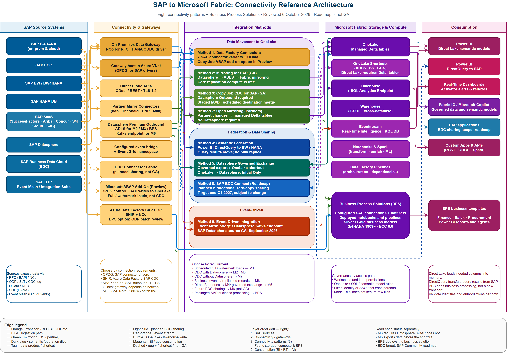

<!-- _class: lead -->
<!-- _paginate: false -->
<!-- _header: '' -->
<!-- _footer: '' -->

Architecture Brief · October 2026

# SAP to Microsoft Fabric.

## Eight connectivity patterns, plus BPS. SAP ingestion, live queries and business solutions.

### fredgis · github.com/fredgis/fabric-foundry-kb/

---

# The Question

Choose the data path before choosing the reporting tool:

**move the data, federate it, or stream it?**

Check freshness, source objects, extraction rights, and whether SAP Datasphere is available.

**BPS** adds a separate choice: deploy SAP connections, notebooks, pipelines, and business models as a packaged Fabric solution.

8

connectivity patterns

BPS

business processing above connectivity

06/10

2026 source review, including FabCon Europe

---

# Reference Architecture

_Five layers with BPS connections and processing. [Full-resolution diagram](images/architecture.png)._

---

# The Three Categories

CATEGORY A

<h3>Data Movement</h3>

Land SAP data in <strong>OneLake</strong>. Choose full loads, watermark extraction, or delete-aware CDC.

M1 Batch M2 Mirroring M3 Copy CDC M7 Open Mirror

CATEGORY B

<h3>Federation & Sharing</h3>

M4 queries SAP. M5 exports to storage, then uses a shortcut. M8 remains a <strong>roadmap</strong> option.

M4 Semantic M5 Datasphere DP M8 BDC Connect

CATEGORY C

<h3>Event-Driven</h3>

Business events or replicated records feed <strong>Fabric RTI</strong>. Measure end-to-end latency.

M6 Eventstream

---

<!-- _class: chapter -->

A

# Data Movement.

---

# M1: Data Factory Connectors

Seven dedicated SAP connector variants, plus OData where the source exposes a suitable API.

- **BW Application / Message Server**, **BW Open Hub Application / Message Server**, **HANA**, **SAP Table Application / Message Server**
- Support differs across Pipelines, Dataflow Gen2, and Copy Job
- Use **OPDG**, with NCo for RFC or the HANA ODBC driver

**Best for:** historical loads, daily refresh, predictable batch windows.

7

dedicated SAP connector variants

3

authoring surfaces (Pipeline · DFG2 · Copy Job)

GA

classic connectors; add-on Preview is separate

---

# M1 Option: Microsoft ABAP Add-On

Copy Job starts extraction through OPDG. The SAP add-on writes **directly to OneLake staging**.

- Tables, views, and CDS SQL views
- Full loads or **watermark-based incremental** loads
- SAP Basis installs the Microsoft transports
- Both SAP and the gateway need outbound HTTPS to OneLake

**Hard deletes are not captured by a watermark.** Message Server is not supported.

PRE

Preview, not the Datasphere CDC connector

7.50

NetWeaver baseline for ECC EhP 8 / BW 7.50

No DS

S/4HANA and BW/4HANA also supported

---

# M2: Mirroring for SAP

**SAP → Datasphere → ADLS Gen2 → Fabric mirroring.**

- Datasphere lands snapshots and deltas in ADLS
- Fabric reads the staging shortcut and maintains **Delta tables**
- SQL analytics endpoint is created automatically
- Direct Lake freshness also depends on model and report refresh

**Costs remain** for SAP outbound, staging, consumption, and optional extensions.

GA

2026 · production-ready

DS

Datasphere Premium Outbound required

0

Fabric core replication compute charge

---

# M3: Copy Job CDC for SAP

**Datasphere Outbound is required.** Copy Job applies its staged changes on your schedule.

- Reads Datasphere files from **ADLS, S3, or GCS**
- Applies inserts, updates, and deletes
- Runs independently or within a pipeline
- September: SCD Type 2, audit columns, and workspace monitoring announced GA

**Best for:** controlled processing windows and orchestrated CDC. Check the destination's supported write modes.

GA

Datasphere CDC source since May 2026

DS

Premium Outbound plus staging storage

I/U/D

different from the ABAP add-on's watermark

---

# M7: Open Mirroring (Partner-led)

A partner extracts SAP data; Fabric maintains the mirrored tables and SQL endpoint.

- **dab Nexus**, **Theobald**, **SNP**, **Simplement**, **Qlik**, **CData**, and others
- No SAP Datasphere licensing required
- The connector publishes **Parquet change files** in the landing zone
- Fabric converts and merges them into Delta tables

**Check:** source coverage, extraction mode, SAP rights, and partner licensing.

ISV

product-specific SAP extraction

~min

near real-time

No DS

partner licensing still applies

---

<!-- _class: chapter -->

B

# Federation & Sharing.

---

# M4: Semantic Federation

Power BI **DirectQuery** avoids a bulk SAP replica. Query results still leave SAP and may be cached.

- **DirectQuery** to SAP BW queries and InfoProviders
- **DirectQuery** to SAP HANA (calc views, native SQL)
- Source permissions apply to the **connection identity**
- Configure supported SSO for per-user SAP authorizations

**Check:** connector modeling limits and whether result transfer/caching is permitted.

DQ

source executes the queries

SAP

authorizations depend on the connection identity

BI

primary use; SQL/ODBC is a separate interface

---

# M5: Datasphere Data Products

The SAP team prepares the dataset and **exports it to external storage**. Fabric reads it through a shortcut.

- Datasphere export produces files such as **Parquet**
- A shortcut avoids another copy of those exported files
- Plain Parquet needs processing into **Delta tables** for Direct Lake
- **OneLake → Datasphere** is also available as a replication-flow source, with Initial Only loading

**Best when:** the SAP team owns the published data product.

DS

SAP Datasphere required

Files

exported outside SAP before the shortcut

Delta

required for Direct Lake consumption

---

# M8: SAP BDC Connect (Roadmap)

Planned **bidirectional sharing** between SAP Business Data Cloud and OneLake.

- The original announcement targeted Q3 2026
- An SAP employee's **31 August roadmap reply** now targets **end Q1 2027**, subject to change
- FabCon Europe did not confirm GA
- Sharing does not imply SAP writeback or automatic Copilot/Joule integration

**For production today:** use a released ingestion or query path.

⇄

intended sharing model

Plan

not a confirmed public release

Q1

2027 target, subject to change

---

<!-- _class: chapter -->

C

# Event-Driven.

---

# M6: Event-Driven Integration

Two SAP paths feed Fabric operational analytics.

- Business events: **Event Mesh → configured bridge → Event Grid namespace → Eventstream**
- Replicated records: **Datasphere → dedicated Eventstream Kafka endpoint**
- Route events to Eventhouse, Lakehouse, or Activator
- Define replay, deduplication, and delete handling

**Freshness is path-dependent.** There is no blanket sub-second end-to-end SLA.

GA

Datasphere Eventstream source, September 2026

2

paths with different SAP prerequisites

RTI

Real-Time Intelligence target

---

<!-- _class: chapter -->

D

# Business Process Solutions.

---

# BPS: Connections, Notebooks and Models

**BPS is a Fabric workload**, with more than a connection wizard.

- Configure the SAP source and required datasets
- Deploy notebooks and pipelines for extraction and processing
- Build **Silver and Gold** business models; Bronze is optional
- Use finance, sales, and procurement templates, including hierarchy and currency handling

It reuses supported extraction paths rather than introducing another transport protocol.

F2

minimum Fabric capacity in the deployment guide

F32+

recommended capacity; size for the workload

3

business domains: finance, sales, procurement

---

# BPS: Choose the SAP Connection

| Source | Supported BPS paths | Fabric processing |
|---|---|---|
| **S/4HANA 1909+** | ADF SAP CDC + SHIR (patch review); partner Open Mirroring; Datasphere through ADLS | Deployed notebooks, pipelines, Silver/Gold models |
| **ECC 6.0** | Partner Open Mirroring | ECC-specific processing and business models |
| **Salesforce** | Fabric pipelines | CRM data for supported business scenarios |

DEPLOYMENT CHECK

<h3>BPS does not remove source restrictions</h3>

ADF SAP CDC inherits the SAP Note 3255746 ODP RFC blocking risk. Datasphere and Open Mirroring require DD03ND type metadata. Check region, rights, and costs.

ARTIFACTS 1.0.5

<h3>Processing and monitoring updates</h3>

Contextual telemetry, selected-table orchestration, high-concurrency sessions, and ECC Record-to-Report views.

---

<!-- _class: chapter -->

04

# How to Choose.

---

# Decision Heuristics

<strong>Need data physically in OneLake (BI · ML · cross-source joins)?</strong>→ M1 (batch) · M2 (Mirroring + DS) · M3 (Copy Job CDC) · M7 (Partner)

<strong>No bulk SAP replica, but query results may leave SAP?</strong>→ M4 DirectQuery, with verified SSO, permissions, and caching rules

<strong>Operational events or replicated records for alerts?</strong>→ M6 Event Mesh bridge or the Datasphere Eventstream source

<strong>Need SAP finance, sales, or procurement models and processing?</strong>→ BPS, with its supported source connection and deployed notebooks/pipelines

<strong>No SAP Datasphere license available?</strong>→ M1 batch · M7 partner CDC · ABAP Preview; legacy ADF requires ODP patch review

---

# Pattern Comparison

| | Movement | Freshness | Datasphere | Custom ETL | Status |
|---|:---:|:---:|:---:|:---:|:---:|
| **M1 · Batch ETL** | OneLake | Scheduled | ✘ | Required | GA / ABAP Preview |
| **M2 · Mirroring** | OneLake | Near real-time | ✔ | None | GA 2026 |
| **M3 · Copy Job CDC** | OneLake | Scheduled | ✔ | Minimal | GA |
| **M4 · Semantic Federation** | Query results | Query time | Optional | None | GA |
| **M5 · Datasphere Products** | Storage + shortcut | Scheduled | ✔ | DS-side | GA |
| **M6 · Event-Driven** | Events | Path-dependent | Option B | Routing | DS source GA |
| **M7 · Open Mirroring** | OneLake | Near real-time | ✘ | Partner | GA |
| **M8 · BDC Connect** | Planned sharing | Unconfirmed | BDC scope | Unconfirmed | Roadmap |

_BPS is a solution layer over supported ingestion paths, not a ninth transport._

---

# Network & Governance

### Network posture

- **OPDG** for on-prem SAP behind firewalls
- An **OPDG host in Azure** still needs the SAP drivers
- **ABAP add-on:** SAP also needs outbound HTTPS to OneLake
- **SHIR** for the ADF SAP CDC path
- Pair with **Fabric Network Security** patterns (separate brief)

### Governance

- Validate SAP extraction rights and source-object coverage
- Reapply permissions at each storage and query boundary
- DirectQuery uses the configured identity; SSO is not automatic
- Confirm **BPS region support** and feature-specific preview access

---

# Costs: Separate Ingestion from Consumption

MIRRORING

<h3>Core replication compute is free</h3>

Mirrored storage has a capacity-based allowance. Optional CDF and other extended capabilities incur additional compute charges.

SOURCE AND TRANSPORT

<h3>SAP and staging still have costs</h3>

Include Datasphere Premium Outbound, ADLS/S3/GCS, gateway or SHIR hosts, and partner licenses where used.

FABRIC PROCESSING

<h3>Size for the actual workload</h3>

Copy Job, BPS notebooks, transformations, SQL, and Power BI consume resources. Scheduled CDC is not automatically cheaper than mirroring.

---

# FabCon Europe: Released Updates

BARCELONA · SEPTEMBER 2026

<h3>SAP Datasphere → Eventstream: GA</h3>

A dedicated Kafka endpoint receives replication flows. Premium Outbound is required; no separate ADLS staging.

COPY JOB · GA

<h3>History, audit and monitoring</h3>

CDC, SCD Type 2, audit columns, and workspace monitoring. Check source/destination compatibility.

MIRRORING · GA ANNOUNCED

<h3>Extended capabilities</h3>

Optional paid CDF supports downstream change processing. The announcement does not establish SAP view mirroring support.

PIPELINES · GA

<h3>Maintenance and retry back-off</h3>

Orchestrate Lakehouse maintenance after loads and increase retry delays to reduce source pressure.

---

# Preview and Roadmap Boundaries

ABAP ADD-ON · PREVIEW

<h3>Full and watermark loads</h3>

Requires supported SAP releases, imported transports, OPDG, and SAP outbound access. It is not delete-aware CDC.

COPY JOB · PREVIEW

<h3>Eventstream source and destination</h3>

Connect supported batch and streaming paths. Do not assume every connector combination is supported.

FABCON EUROPE · PREVIEW

<h3>Dependencies and network isolation</h3>

Pipeline-level dependencies and workspace Private Link for Eventstream need workload-specific evaluation.

BDC CONNECT · ROADMAP

<h3>No confirmed GA at FabCon</h3>

The SAP Community planning target is end Q1 2027, subject to change. Use released paths for production now.

---

# Sources and Review Scope

### SAP connection paths

- [Fabric connector matrix](https://learn.microsoft.com/fabric/data-factory/connector-overview)
- [SAP ABAP Add-On tutorial](https://learn.microsoft.com/fabric/data-factory/copy-job-tutorial-sap-abap)
- [Mirroring SAP](https://learn.microsoft.com/fabric/mirroring/sap)
- [Datasphere Outbound in Copy Job](https://learn.microsoft.com/fabric/data-factory/copy-job-tutorial-sap-datasphere)
- [Datasphere Eventstream source](https://learn.microsoft.com/fabric/real-time-intelligence/event-streams/add-source-sap-datasphere)

### BPS and release status

- [Business Process Solutions](https://learn.microsoft.com/azure/sap/business-process-solutions/about-business-process-solutions)
- [BPS release notes](https://learn.microsoft.com/azure/sap/business-process-solutions/release-notes)
- [September 2026 feature summary](https://community.fabric.microsoft.com/blog/fbc_fabricupdatesblogs/fabric-september-2026-feature-summary/5325825)
- [FabCon Europe announcement](https://aka.ms/FabCon-SQLCon-Barcelona)
- [SAP Community BDC roadmap reply](https://community.sap.com/t5/data-and-ai-professionals-q-a/sap-bdc-connect-for-microsoft-fabric-ga/qaq-p/14469254)

_Reviewed 6 October 2026. September release announcements postdate some Learn Preview labels._

---

<!-- _class: closing -->

# SAP connectivity, with the business model in view.

## fredgis · github.com/fredgis/fabric-foundry-kb

Use released paths for production. Add BPS when its business models and processing match the requirement.
