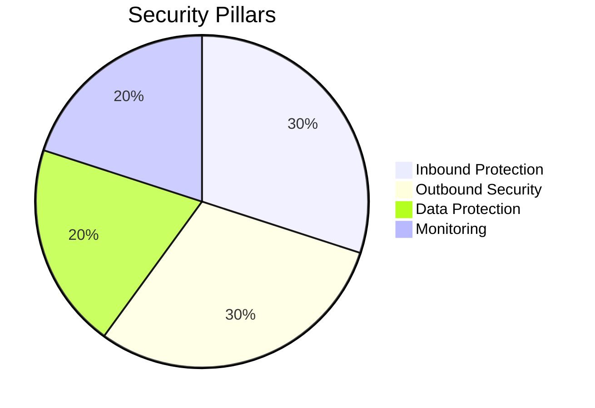
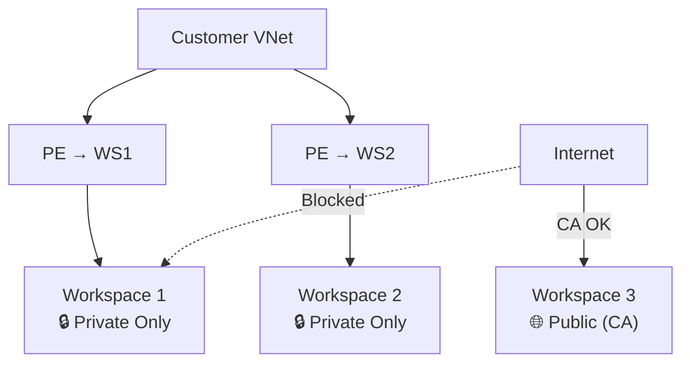
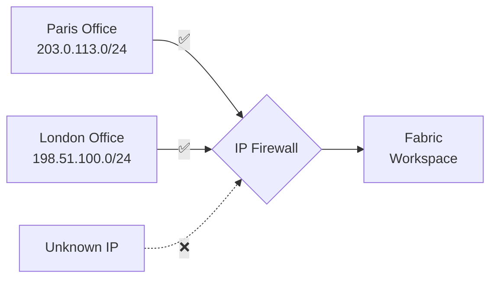
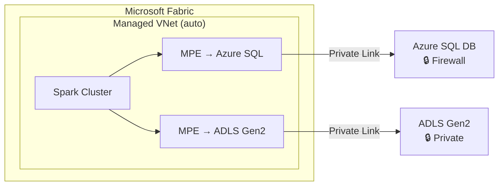
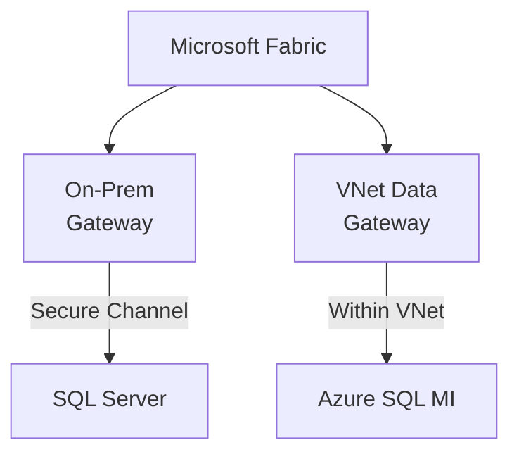
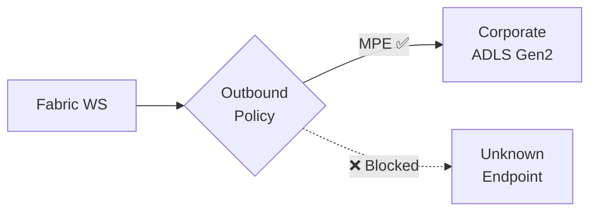
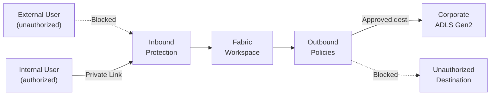
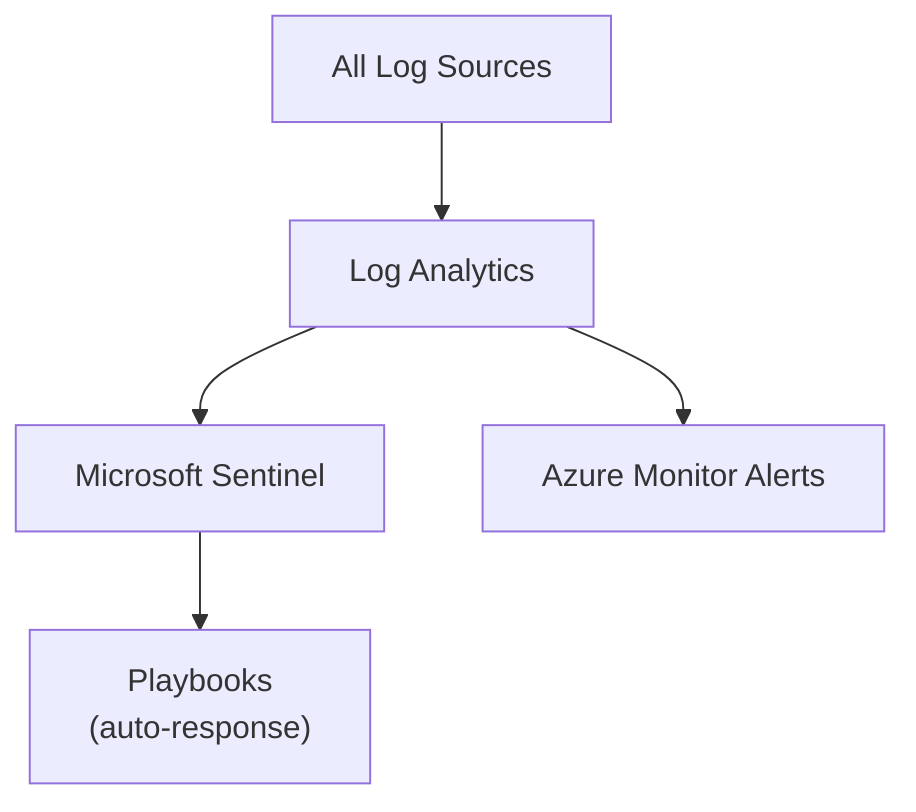
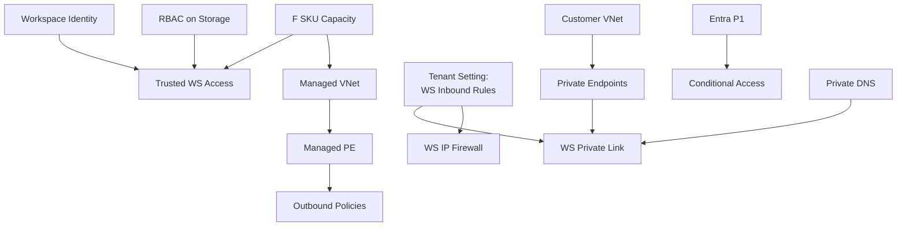
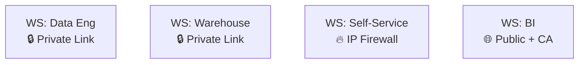

# Network Security in Microsoft Fabric

Architecture, Security & Best Practices

  April 2026

---
transition: fade-out
layout: two-cols
layoutClass: gap-16
---

# Agenda

<v-clicks>

1. 🔐 Fabric Security Foundations
2. 🛡️ Inbound Protection
3. 🔗 Secure Outbound Access
4. 🚫 Outbound Protection & DEP
5. 🔑 Data Security & Encryption
6. 🌐 DNS Configuration
7. 📊 Monitoring & Auditing
8. ✅ Testing & Validation
9. 🏗️ Architecture Patterns
10. 📋 Feature Status & Roadmap

</v-clicks>

::right::

---
layout: section
---

# Fabric Security Foundations
Understanding the baseline

---
layout: default
---

# What is Microsoft Fabric?

A **unified SaaS analytics platform** bringing together:

  
🏭

  
Data Factory

  
ETL & Orchestration

  
⚙️

  
Data Engineering

  
Spark & Notebooks

  
🧬

  
Data Science

  
ML & Experiments

  
🏢

  
Data Warehouse

  
SQL Analytics

  
⚡

  
Real-Time Intelligence

  
Streaming & KQL

  
📊

  
Power BI

  
Reports & Dashboards

  <strong>OneLake</strong> — Unified data lake for all experiences

---

# Three Pillars of Network Security

  
🛡️

  <h3 class="text-center text-indigo-800 font-bold">Inbound Protection</h3>
  
Control <strong>who</strong> accesses Fabric and <strong>from where</strong>

  <ul class="text-xs mt-2 text-gray-600">
    <li>Conditional Access</li>
    <li>Private Links</li>
    <li>IP Firewall</li>
  </ul>

  
🔗

  <h3 class="text-center text-green-800 font-bold">Secure Outbound</h3>
  
Connect Fabric to <strong>protected data sources</strong> securely

  <ul class="text-xs mt-2 text-gray-600">
    <li>Trusted Workspace Access</li>
    <li>Managed Private Endpoints</li>
    <li>Data Gateways</li>
  </ul>

  
🚫

  <h3 class="text-center text-red-800 font-bold">Outbound Protection</h3>
  
Prevent data <strong>exfiltration</strong> to unauthorized destinations

  <ul class="text-xs mt-2 text-gray-600">
    <li>Outbound Access Policies</li>
    <li>Allowed destinations only</li>
  </ul>

  

    <strong>Inbound + Outbound = Data Exfiltration Protection (DEP)</strong>
  

---

# Secure by Default

Fabric is **secure out of the box** — no configuration needed:

| Feature | Detail |
|---------|--------|
| **Authentication** | Every interaction authenticated via **Microsoft Entra ID** |
| **Encryption in transit** | TLS 1.2 minimum (TLS 1.3 negotiated when available) |
| **Encryption at rest** | All OneLake data automatically encrypted |
| **Microsoft backbone** | Internal Fabric traffic never traverses the public internet |
| **Secure endpoints** | Fabric backend protected by VNet, not directly accessible |

💡 <strong>Key point:</strong> Even without any configuration, Fabric provides enterprise-grade security. The features that follow add <em>additional</em> layers.

---
layout: section
---

# Inbound Protection
Controlling access to Fabric

---

# Inbound Options at a Glance

| Criteria | Conditional Access | Private Link (Tenant) | Private Link (Workspace) | IP Firewall |
|----------|:--:|:--:|:--:|:--:|
| **Granularity** | Tenant | Tenant | Workspace | Workspace |
| **Azure infra needed** | No | VNet + PE | VNet + PE | No |
| **Complexity** | Low | High | Medium | Low |
| **Approach** | Zero Trust | Perimeter | Perimeter | IP-based |
| **User impact** | Transparent | VPN/ER required | VPN/ER for protected WS | None if IP allowed |
| **Status** | **GA** | **GA** | **GA** | **GA** |

⚠️ <strong>Prerequisite:</strong> A <strong>tenant admin</strong> must enable "Workspace-level inbound network rules" before WS admins can configure Private Link or IP Firewall per workspace.

---

# Entra Conditional Access — Zero Trust

The **first gate** for every request to Fabric.

**Evaluated Signals:**
- 👤 Users and groups
- 📍 Location / IP ranges
- 💻 Device compliance (Intune)
- 📱 Applications
- ⚠️ Sign-in risk level

**Decisions:**
- ✅ Grant
- ✅ Grant + MFA
- 🚫 Block

**Zero Trust Best Practices:**

| Practice | Description |
|----------|-------------|
| **Phishing-resistant MFA** | FIDO2, Windows Hello |
| **Device Compliance** | Require managed devices |
| **PIM** | Just-in-time admin access |
| **Service Principal Gov.** | Limit SPN surface area |
| **CAE** | Real-time token revocation |

📋 <strong>Prerequisite:</strong> Microsoft Entra ID P1 license (included in M365 E3/E5)

---

# Tenant-Level Private Link

**Full tenant** network isolation — Fabric becomes inaccessible from the public internet.

**How it works:**
1. Create Private Endpoint in customer VNet
2. Private tunnel to Fabric via Microsoft backbone
3. Enable "Block Public Internet Access"

**Two settings:**

| Setting | Effect |
|---------|--------|
| Azure Private Links | VNet traffic goes through PL |
| Block Public Access | No public internet access |

**Considerations:**
- ⚠️ **All users** must use VPN/ExpressRoute
- ⚠️ Bandwidth impact (static resources via PE)
- ⚠️ Copilot, Publish to Web **disabled**
- ⚠️ Spark Starter Pools disabled
- ⚠️ Cross-tenant access not supported
- ⚠️ **Private DNS Zone required**

🔒 <strong>Best for:</strong> Regulated industries (healthcare, finance) where NO Fabric traffic may traverse the public internet. Most restrictive option — consider workspace-level PL first.

---

# Workspace-Level Private Link
★ Recommended Approach

**Granular** control: protect only sensitive workspaces while others remain publicly accessible.

**Key characteristics:**
- 1:1 relationship: workspace ↔ PL Service
- Multiple PEs from different VNets
- Public access disabled **per workspace**
- GA since September 2025

**Supported items:**
- ✅ Lakehouse, Warehouse, Notebook
- ✅ Pipeline, Dataflow, Eventstream
- ✅ Mirrored DB, ML Experiment/Model
- ❌ Power BI Reports/Dashboards *(planned)*
- ❌ Fabric Databases *(planned)*

---

# Workspace IP Firewall

The **simplest** solution — no Azure infrastructure required.

**Concept:** Allow only specific IP ranges to access the workspace.

**GA since Q1 2026** — supported items:
- ✅ Lakehouse, Notebook, Pipeline
- ✅ Warehouse, Dataflow, Eventstream
- ✅ Mirrored DB, ML Experiment/Model
- ❌ Power BI items *(planned)*
- ❌ Fabric Databases *(planned)*

**Important notes:**
- Fabric REST API remains accessible for rule management (by design)
- Use Conditional Access to govern API access

💡 <strong>Best for:</strong> Organizations with static office IPs, no VNet infrastructure, need quick protection.

---

# Tenant vs Workspace Access Interaction

When both tenant-level and workspace-level settings are configured:

| Tenant Public Access | WS Private Link | WS IP Firewall | Portal Access | API Access |
|:---:|:---:|:---:|---|---|
| **Allowed** | — | — | Public | Public |
| **Allowed** | ✅ (public disabled) | — | WS PL only | WS PL only |
| **Allowed** | — | ✅ | Allowed IPs | Allowed IPs |
| **Restricted** | — | — | Tenant PL only | Tenant PL only |
| **Restricted** | ✅ | — | Tenant PL only | WS PL or Tenant PL |
| **Restricted** | — | ✅ | Tenant PL only | Tenant PL only |

⚠️ <strong>Key takeaway:</strong> When tenant public access is <strong>restricted</strong>, tenant Private Link takes precedence for portal access. Workspace PL only adds API-level paths — it does not bypass the tenant restriction for the Fabric portal.

---
layout: section
---

# Secure Outbound Access
Connecting Fabric to protected data sources

---

# Outbound Options Overview

<h3 class="text-green-800">🔐 Trusted Workspace Access</h3>

Access firewall-enabled <strong>ADLS Gen2</strong> via workspace identity + Resource Instance Rules

Shortcuts, Pipelines, COPY INTO, Semantic Models

<h3 class="text-green-800">🔗 Managed Private Endpoints</h3>

Private Link to Azure SQL, Cosmos DB, Key Vault etc. in a <strong>Managed VNet</strong>

Spark Notebooks, Lakehouses, Spark Jobs, Eventstream

<h3 class="text-blue-800">🌐 VNet Data Gateway</h3>

Managed gateway in customer VNet. <strong>GA:</strong> enterprise proxy + cert auth

Dataflows Gen2, Semantic Models

<h3 class="text-teal-800">🏢 On-Premises Gateway</h3>

Bridge to on-prem SQL Server, Oracle, SAP, file shares

Dataflows Gen2, Semantic Models, Pipelines

---

# Trusted Workspace Access

Secure access to **firewall-enabled ADLS Gen2** without opening the firewall.

**Prerequisites checklist:**

<v-clicks>

1. ✅ Workspace on a **Fabric F SKU** capacity (not Trial or P SKU)
2. ✅ **Workspace Identity** created and enabled
3. ✅ RBAC role on ADLS Gen2: `Storage Blob Data Contributor/Owner/Reader`
4. ✅ **Resource Instance Rule** on storage firewall (ARM/Bicep/PowerShell)
5. ✅ Storage account allows "trusted Microsoft services"

</v-clicks>

⚠️ <strong>Troubleshooting:</strong> All 4 steps are required. Failure at any step <strong>silently blocks</strong> access — no error message, just empty results.

---

# Managed Private Endpoints & Managed VNets

**How it works:**
- Fabric creates a **Managed VNet** per workspace
- MPEs connect privately to Azure services
- All traffic on Microsoft backbone
- **Auto-provisioned** on first MPE creation

**Key limitations:**
- Starter Pools disabled (3-5 min startup)
- OneLake shortcuts don't support MPE yet
- Not available in all regions
- Cross-region migration not supported

---

# Data Gateways

### On-Premises Gateway

| | Detail |
|---|---|
| **Install** | Windows server on-prem |
| **Protocol** | Secure outbound (no inbound ports) |
| **Sources** | Any accessible source |
| **Management** | Manual updates + HA |

### VNet Data Gateway

| | Detail |
|---|---|
| **Deploy** | Into customer Azure VNet |
| **Managed** | By Microsoft |
| **Sources** | Azure services in VNet |
| **New GA** | Enterprise proxy + cert auth ✅ |

🆕 VNet Data Gateway now supports <strong>enterprise HTTP/HTTPS proxy</strong> and <strong>certificate authentication</strong> (GA 2026).

---

# Eventstream Private Network Support

Preview — Q1 2026

Fabric Eventstreams can ingest data from **private networks** via:

  
🌐

  
Managed VNet

  
Network isolation

  
🔗

  
Streaming Data Gateway

  
Bridge to private sources

  
🔒

  
Managed PE

  
Private connectivity

**Supported:** Azure Event Hubs, IoT Hub, custom sources within a VNet

**Not yet supported:** Custom Endpoint as source/destination, Eventhouse direct ingestion

---

# Secure Outbound Connectors Matrix

| Method | Sources | Fabric Workloads |
|--------|---------|-----------------|
| **Trusted Workspace Access** | ADLS Gen2 (firewall) | Shortcuts, Pipelines, COPY INTO, Semantic Models |
| **Managed Private Endpoints** | Azure SQL, ADLS Gen2, Cosmos DB, Key Vault... | Spark Notebooks, Lakehouses, Eventstream |
| **VNet Data Gateway** | Azure services in a VNet | Dataflows Gen2, Semantic Models |
| **On-Premises Gateway** | SQL Server, Oracle, SAP, files... | Dataflows Gen2, Semantic Models, Pipelines |
| **Service Tags** | Azure SQL VM, SQL MI, REST APIs | Pipelines, network integration |

---
layout: section
---

# Outbound Protection & DEP
Preventing data exfiltration

---

# Outbound Access Policies

**Restrict outbound connections** to authorized destinations only.

**How it works:**
1. Declare allowed destinations via **MPE** or **Data Connections**
2. Enable **Outbound Access Policy** on workspace
3. Any connection to undeclared destination → **Blocked**

**Status (April 2026):**

| Item Type | Status |
|-----------|--------|
| Lakehouse, Spark, Notebooks | **GA** |
| Pipelines, Warehouse, Mirrored DBs | **GA** |
| Power BI, Databases | **Planned** |

⚠️ <strong>Important:</strong> Declare <strong>all</strong> legitimate destinations before enabling the policy — otherwise you'll break existing connections.

---

# Data Exfiltration Protection (DEP)

Complete DEP = **Inbound + Outbound Protection**

### Advanced Exfiltration Controls (Layered Defense)

| Control | Mechanism |
|---------|-----------|
| **Purview Information Protection** | Sensitivity labels on Lakehouses, Warehouses, Reports |
| **Data Loss Prevention (DLP)** | Block export of "Highly Confidential" items |
| **Power BI Export Restrictions** | Disable CSV/Excel/PowerPoint export |
| **Endpoint DLP** | Prevent copy to USB/unauthorized cloud |
| **Defender Session Controls** | Monitor/block downloads in real time |

---
layout: section
---

# Data Security & Encryption
Protecting data at rest and in transit

---

# Encryption & Customer Managed Keys

### Encryption Layers

| Type | Mechanism |
|------|-----------|
| **In transit** | TLS 1.2 / 1.3 |
| **At rest** | Microsoft-managed keys |
| **At rest (CMK)** | Customer-managed Key Vault keys |
| **Power BI** | BYOK (Bring Your Own Key) |

### CMK Status (April 2026)

| Items | Status |
|-------|--------|
| Lakehouse, Pipeline, Warehouse... | **GA** |
| Databases, Power BI | **Planned** |

### Multi-Geo & Data Residency

- **54 data centers** worldwide
- Data stays in the capacity's Azure region
- Metadata stored in tenant's home region
- **Data Residency compliant** by default

### Compliance Certifications

ISO 27001/27701, HIPAA, SOC 1&2, SOX, FedRAMP, PCI DSS, GDPR, HITRUST, K-ISMS, CSA STAR

---
layout: section
---

# DNS Configuration
The most common Private Link failure point

---

# DNS — Required Private Zones

| DNS Zone | Used By |
|----------|---------|
| `privatelink.analysis.windows.net` | Power BI / Semantic Models |
| `privatelink.pbidedicated.windows.net` | Dedicated capacity |
| `privatelink.prod.powerapps.com` | Dataflows |
| `privatelink.blob.core.windows.net` | OneLake (Blob) |
| `privatelink.dfs.core.windows.net` | OneLake (DFS) |
| `privatelink.servicebus.windows.net` | Event Hubs |

### Architecture Patterns

| Pattern | Best For |
|---------|----------|
| **Centralized DNS Zone** | Multi-VNet, hub-spoke |
| **DNS Private Resolver** | Hybrid with on-prem DNS |
| **Conditional Forwarders** | Simple hybrid |

### IP Planning
- 1 Private IP per PE
- 1 PE per workspace per VNet
- Reserve at least a `/27` subnet

🔴 <strong>#1 failure cause:</strong> Forgetting to create or link Private DNS Zones. Always verify: <code>nslookup &lt;workspace&gt;.fabric.microsoft.com</code> → must return <code>10.x.x.x</code>

---

# DNS Best Practices Checklist

<v-clicks>

1. ✅ **Create all required Private DNS Zones** and link to every VNet with PEs
2. ✅ **Test before go-live** — `Resolve-DnsName <workspace>.pbidedicated.windows.net`
   - Expected: `10.x.x.x` private IP, **not** a public IP
3. ✅ **Hybrid DNS:** Configure conditional forwarders for `privatelink.*` zones → Azure DNS (`168.63.129.16`) via DNS Private Resolver
4. ✅ **Automate DNS records** — Use Azure Policy (`Deploy-DINE-PrivateDNSZoneGroup`) to auto-create records on PE creation
5. ✅ **Monitor for DNS drift** — Re-run resolution tests after infra changes (VNet peering, new PEs, zone re-linking)

</v-clicks>

💡 A broken DNS zone link <strong>silently reverts</strong> traffic to the public path — no error, no warning, just bypassed Private Endpoints.

---
layout: section
---

# Monitoring & Auditing
Visibility into network security

---

# Monitoring Stack

### Diagnostic Logging

| Source | Key Signals |
|--------|------------|
| **Entra Sign-in Logs** | MFA, CA hits, risky sign-ins |
| **Fabric Admin Audit** | Sharing, exports, gateways |
| **PE Metrics** | Bytes in/out, connections |
| **NSG Flow Logs** | Allow/deny on PE subnets |
| **Azure Firewall** | Rule hits, threat intel |

### Sentinel Integration

**Analytics rules detect:**
- 🌍 Logins from unexpected geos
- 📤 Sudden data export spikes
- 🔑 Bulk permission changes
- 🕵️ Sign-ins bypassing CA

---

# Audit Best Practices

| Review | Frequency | Responsible |
|--------|-----------|-------------|
| IP Firewall rules accuracy | Monthly | Workspace admin |
| Outbound policy allowed destinations | Quarterly | Security team |
| Private Endpoint approvals | Quarterly | Azure subscription owner |
| Conditional Access effectiveness | Quarterly | Identity team |
| DNS zone records and VNet links | Semi-annually | Network team |
| Penetration testing | Annually | Security team |

💡 <strong>Using NSG + Azure Firewall:</strong> Apply service tags (<code>PowerBI</code>, <code>DataFactory</code>, <code>SQL</code>) in NSG rules. Route outbound traffic through Azure Firewall for centralized logging. Use NAT Gateway for static outbound IP.

---
layout: section
---

# Testing & Validation
Verifying network security controls

---

# Connectivity & Performance Tests

### Connectivity Validation

| Test | Expected |
|------|----------|
| DNS for PE | `10.x.x.x` (private IP) |
| Portal via PE | Portal loads correctly |
| IP Firewall block | HTTP 403 |
| MPE to Azure SQL | Query succeeds |
| Outbound policy block | Connection refused |

### Performance Considerations

- 📊 **Baseline first** — measure before enabling PL/MVNet
- ⏱️ **Spark startup:** 3-5 min with custom pools (vs seconds for Starter Pools)
- 📶 **PE throughput:** Up to 8 Gbps per PE
- 🌍 **Cross-region:** Co-locate PEs with capacities

✅ <strong>Pro tip:</strong> Run <code>nslookup</code> from inside the VNet, not from your local machine — local DNS may not have the private zone.

---
layout: section
---

# Architecture Patterns
Real-world deployment scenarios

---

# Feature Dependencies

Understanding prerequisites before configuring features:

| Chain | Steps |
|-------|-------|
| **WS Private Link** | Tenant setting → VNet + PE + DNS → WS admin disables public access |
| **Managed PE** | F SKU → Managed VNet (auto) → MPE → Source owner approves |
| **Trusted WS Access** | F SKU → WS Identity → RBAC → Resource Instance Rule |

---

# Scenario 1 — Regulated Enterprise
GDPR / HIPAA / PCI DSS

| Layer | Recommendation |
|-------|---------------|
| **Inbound** | Tenant PL + Block Public Access |
| **Outbound** | MVNet + MPE + Outbound Policies |
| **Identity** | MFA (phishing-resistant) + PIM |
| **Data** | CMK + Purview labels + DLP |
| **DNS** | Centralized zones + Resolver |
| **Monitoring** | Full Sentinel integration |

**Key characteristics:**
- 🔒 Zero public internet traffic
- 🏥 All users on VPN/ExpressRoute
- 📋 Full audit trail
- 🔑 Customer-managed encryption
- 🌍 Multi-geo for residency

⚠️ Most restrictive. Disables Copilot, Publish to Web, some exports.

---

# Scenario 2 — Mixed Sensitivity
Data Platform Team

| Layer | Recommendation |
|-------|---------------|
| **Inbound** | WS PL (sensitive) + IP FW (semi) + Public (BI) |
| **Outbound** | TWA + MPE + VNet Gateway |
| **Identity** | MFA all + device compliance for admins |
| **Data** | CMK on sensitive WS + labels |
| **Monitoring** | Audit logs + PE failure alerts |

**Architecture:**

✅ <strong>Best balance</strong> of security and usability. Most common pattern.

---

# Scenario 3 & 4

### Scenario 3 — Startup (Cost-Optimized)

| Layer | Recommendation |
|-------|---------------|
| **Inbound** | Conditional Access + IP FW |
| **Outbound** | VNet GW or On-Prem GW |
| **Identity** | MFA for all |
| **Data** | Default encryption |
| **DNS** | N/A (no PL) |
| **Monitoring** | Entra + Admin logs |

💰 Minimal cost. No VNet infrastructure.

### Scenario 4 — Multi-Region Global

| Layer | Recommendation |
|-------|---------------|
| **Inbound** | WS PL per region |
| **Outbound** | Regional MVNets + MPE |
| **Identity** | CA with named locations |
| **Data** | Regional Key Vaults + multi-geo |
| **DNS** | Per-region zones + resolver |
| **Monitoring** | Regional → global Sentinel |

🌍 Data stays in-region. Cross-region correlation.

---
layout: section
---

# Feature Status & Roadmap
As of April 2026

---

# Feature Summary

| Feature | Level | Status | Use Case |
|---------|-------|--------|----------|
| Entra Conditional Access | Tenant | **GA** | Zero Trust, MFA |
| Private Link — Tenant | Tenant | **GA** | Full tenant isolation |
| Private Link — Workspace | Workspace | **GA** | Granular WS isolation |
| IP Firewall — Workspace | Workspace | **GA** | IP-based restriction |
| Trusted Workspace Access | Workspace | **GA** | ADLS Gen2 (firewall) |
| Managed Private Endpoints | Workspace | **GA** | Private Azure connections |
| Managed VNets | Workspace | **GA** | Spark isolation |
| VNet Data Gateway | Org | **GA** | Azure services in VNet |
| Outbound Access Policies | Workspace | **GA** | DEP |
| Customer Managed Keys | Workspace | **GA** | Dual-layer encryption |
| Eventstream Private Network | Workspace | **Preview** | Real-time private ingestion |
| Power BI Network Isolation | Workspace | **Planned** | WS-level PL/IPFW for PBI |
| Fabric DB Network Isolation | Workspace | **Planned** | WS-level PL/IPFW for DBs |

---

# Known Limitations by Item Type

| Item Type | WS Private Link | WS IP Firewall | Managed VNet | Outbound Policies | CMK |
|-----------|:---:|:---:|:---:|:---:|:---:|
| Lakehouse | ✅ | ✅ | ✅ | ✅ | ✅ |
| Warehouse | ✅ | ✅ | — | ✅ | ✅ |
| Notebook / Spark | ✅ | ✅ | ✅ | ✅ | ✅ |
| Pipeline / Dataflow | ✅ | ✅ | — | ✅ | ✅ |
| Eventstream | ✅ | ✅ | ✅ | ✅ | ✅ |
| Mirrored DB | ✅ | ✅ | — | ✅ | — |
| **Power BI Reports** | 🔜 | 🔜 | — | 🔜 | 🔜 |
| **Fabric Databases** | 🔜 | 🔜 | — | 🔜 | 🔜 |
| **Data Activator** | 🔜 | 🔜 | — | — | — |

⚠️ Until Power BI and Fabric DB items are covered, protect them with <strong>tenant-level PL</strong> or <strong>Conditional Access</strong>.

---
layout: center
class: text-center
---

# Key Takeaways

  
🆔

  <strong>Identity First</strong>
  
Start with Conditional Access, MFA, PIM — network controls complement but don't replace identity.

  
🏢

  <strong>Workspace-Level Preferred</strong>
  
Use workspace PL/IPFW for sensitive workspaces. Tenant PL only when regulation mandates it.

  
🔄

  <strong>Layered Defense</strong>
  
Combine inbound + outbound + data controls for full DEP. No single control is sufficient alone.

  
🌐

  <strong>DNS is Critical</strong>
  
Private DNS Zones are the #1 failure point. Test resolution before go-live, monitor for drift.

---
layout: center
class: text-center
---

# References

- [Security Overview](https://learn.microsoft.com/en-us/fabric/security/security-overview)
- [Private Links Overview](https://learn.microsoft.com/en-us/fabric/security/security-private-links-overview)
- [Workspace-level Private Links](https://learn.microsoft.com/en-us/fabric/security/security-workspace-level-private-links-overview)
- [Managed VNets](https://learn.microsoft.com/en-us/fabric/security/security-managed-vnets-fabric-overview)
- [Managed Private Endpoints](https://learn.microsoft.com/en-us/fabric/security/security-managed-private-endpoints-overview)
- [Trusted Workspace Access](https://learn.microsoft.com/en-us/fabric/security/security-trusted-workspace-access)
- [IP Firewall Rules](https://learn.microsoft.com/en-us/fabric/security/security-ip-firewall-rules)
- [Conditional Access](https://learn.microsoft.com/en-us/fabric/security/security-conditional-access)
- [VNet Data Gateway](https://learn.microsoft.com/en-us/data-integration/vnet/overview)
- [Azure Private DNS Zones](https://learn.microsoft.com/en-us/azure/private-link/private-endpoint-dns)
- [Fabric Security Whitepaper](https://aka.ms/FabricSecurityWhitepaper)

---
layout: end
---

# Thank You

Network Security in Microsoft Fabric — April 2026

Questions? Reach out to your Fabric administrator or security team.

