# Network Security in Microsoft Fabric

Architecture, Security & Best Practices

April 2026

---
layout: two-cols
layoutClass: gap-8
---

# Agenda

 

<v-clicks>

**1.** Fabric Security Foundations

**2.** Inbound Protection

**3.** Secure Outbound Access

**4.** Outbound Protection & DEP

**5.** DNS Configuration

**6.** Monitoring & Auditing

**7.** Architecture Patterns

**8.** Feature Status & Roadmap

</v-clicks>

::right::

 
 

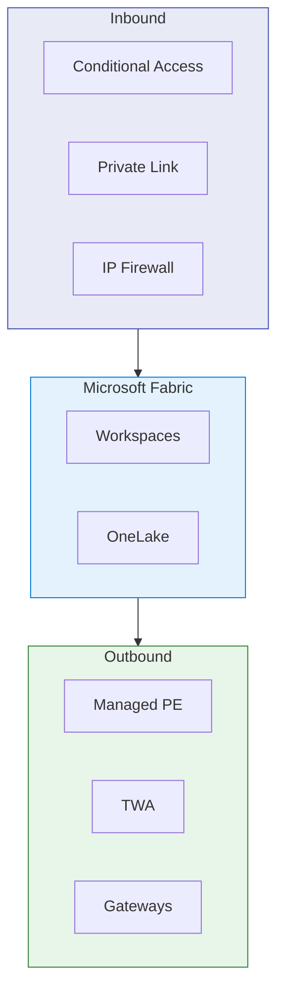

---

# Three Pillars of Network Security

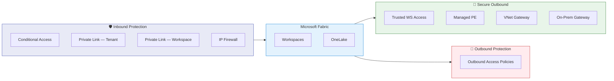

> **Inbound + Outbound Protection = Data Exfiltration Protection (DEP)**

---

# Secure by Default

No configuration needed — Fabric is secure out of the box.

 

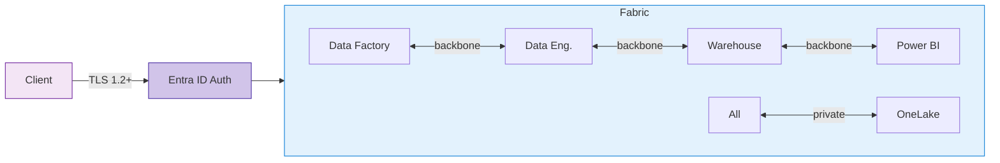

| Layer | Mechanism |
|-------|-----------|
| Authentication | Entra ID on every request |
| Transit encryption | TLS 1.2 min, 1.3 negotiated |
| Rest encryption | Microsoft-managed keys, all OneLake data |
| Internal traffic | Microsoft backbone only — never public internet |

---
layout: section
---

# Inbound Protection
Controlling access to Fabric

---

# Inbound Options at a Glance

 

| | Conditional Access | PL Tenant | PL Workspace | IP Firewall |
|---|:---:|:---:|:---:|:---:|
| **Scope** | Tenant | Tenant | Workspace | Workspace |
| **Infra needed** | None | VNet + PE | VNet + PE | None |
| **Complexity** | Low | High | Medium | Low |
| **Approach** | Zero Trust | Perimeter | Perimeter | IP-based |
| **User impact** | Transparent | VPN/ER mandatory | VPN/ER for target WS | None |
| **Status** | **GA** | **GA** | **GA** | **GA** |

 

> **Prerequisite:** Tenant admin must enable *Workspace-level inbound network rules* before WS admins can configure PL or IP FW per workspace.

---

# Entra Conditional Access

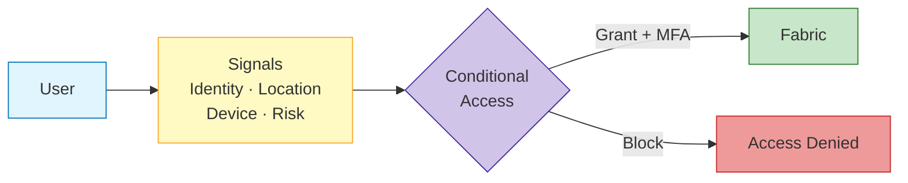

| Practice | Detail |
|----------|--------|
| **Phishing-resistant MFA** | FIDO2, Windows Hello, cert-based |
| **Device compliance** | Require Intune-managed devices |
| **PIM** | Just-in-time admin elevation |
| **CAE** | Near-real-time token revocation |

**Prerequisite:** Entra ID P1 (included in M365 E3/E5)

---

# Private Link — Tenant vs Workspace

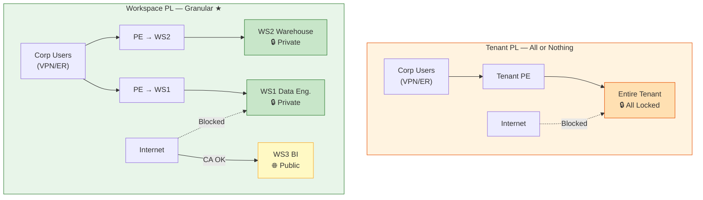

| | Tenant PL | Workspace PL ★ |
|---|---|---|
| **Scope** | Entire tenant | Per workspace |
| **Impact** | All users need VPN/ER | Only users of protected WS |
| **Limitations** | Copilot disabled, exports limited | Power BI items not yet covered |
| **Best for** | Strict regulation | Most organizations |

---

# Workspace IP Firewall

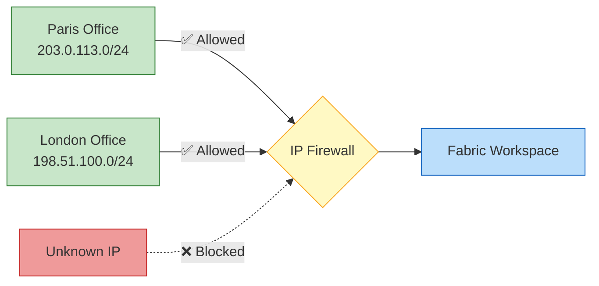

- **GA Q1 2026** — Lakehouse, Warehouse, Notebook, Pipeline, Dataflow, Eventstream, Mirrored DB
- No Azure infrastructure needed
- Fabric REST API stays accessible (by design — prevents lockout)
- Power BI items and Fabric DBs **not covered** (planned)

---

# Tenant ↔ Workspace Interaction

| Tenant Public | WS PL | WS IP FW | Portal | API |
|:---:|:---:|:---:|---|---|
| Allowed | — | — | Public | Public |
| Allowed | ✅ | — | WS PL only | WS PL only |
| Allowed | — | ✅ | Allowed IPs | Allowed IPs |
| Restricted | — | — | Tenant PL | Tenant PL |
| Restricted | ✅ | — | Tenant PL | WS PL or Tenant PL |
| Restricted | — | ✅ | Tenant PL | Tenant PL |

 

> When tenant access is **restricted**, tenant PL takes precedence for portal. Workspace PL adds API paths only.

---
layout: section
---

# Secure Outbound Access
Connecting Fabric to protected data sources

---

# Outbound Connectors

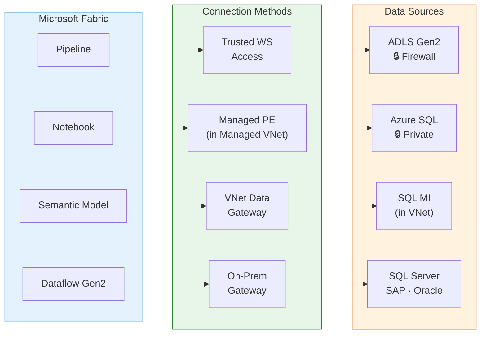

| Method | Sources | Workloads |
|--------|---------|-----------|
| **TWA** | ADLS Gen2 (firewall) | Shortcuts, Pipelines, COPY INTO |
| **Managed PE** | Azure SQL, Cosmos DB, Key Vault | Spark, Lakehouses, Eventstream |
| **VNet GW** | Azure services in VNet | Dataflows Gen2, Semantic Models |
| **On-Prem GW** | SQL Server, Oracle, SAP | Dataflows, Semantic Models, Pipelines |

---

# Trusted Workspace Access — Prerequisites

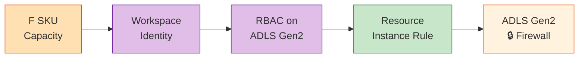

All **four** prerequisites are required:

1. Workspace on **Fabric F SKU** (not Trial or P SKU)
2. **Workspace Identity** created and enabled
3. **RBAC role** on storage: `Storage Blob Data Contributor/Owner/Reader`
4. **Resource Instance Rule** on storage firewall (ARM / Bicep / PowerShell)

> ⚠️ Failure at any step **silently blocks** access — no error, just empty results.

---

# Managed Private Endpoints

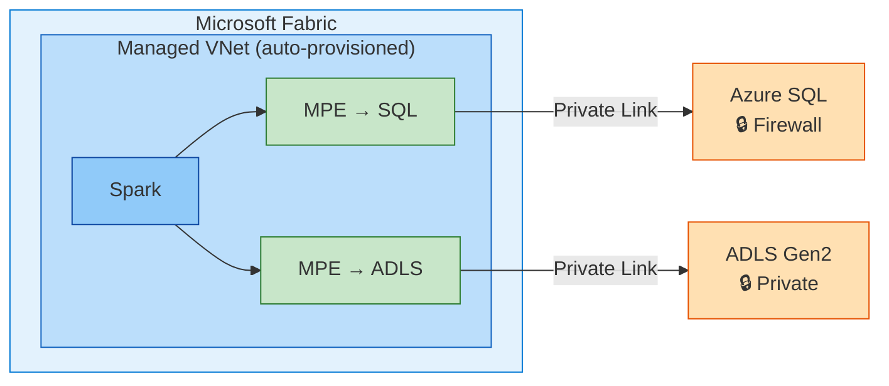

- Managed VNet auto-provisioned on first MPE or Spark job
- Source owner must **approve** the PE
- All traffic on Microsoft backbone
- **Limitations:** Starter Pools disabled (3-5 min startup), not all regions

---

# Data Gateways

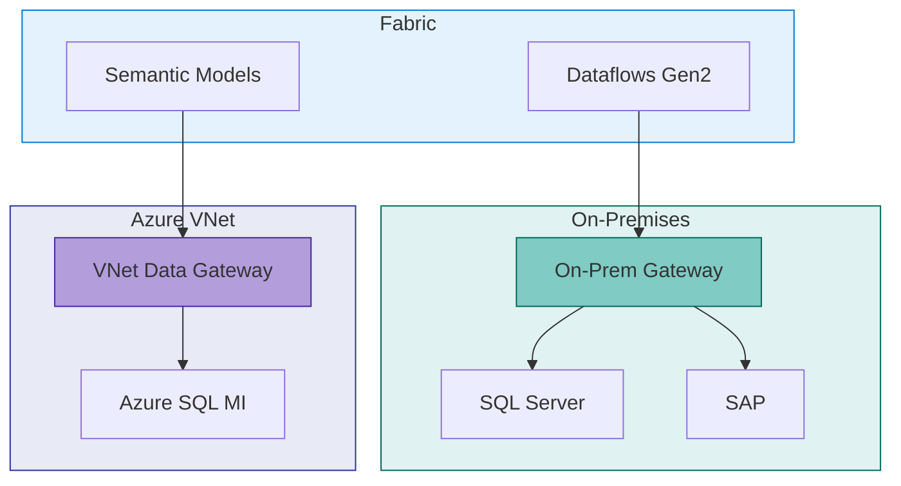

| | On-Premises GW | VNet Data GW |
|---|---|---|
| Management | Manual | Managed by Microsoft |
| Sources | Any on-prem | Azure VNet services |
| **Proxy + Cert Auth** | — | **GA** (2026) |

---
layout: section
---

# Outbound Protection & DEP
Preventing data exfiltration

---

# Outbound Access Policies + DEP

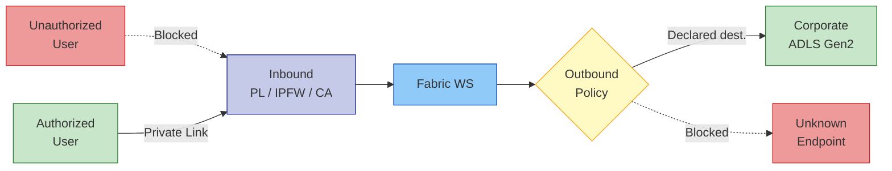

**DEP = Inbound + Outbound.** Complementary data controls:

| Control | Mechanism |
|---------|-----------|
| Purview labels | Sensitivity labels across all Fabric items |
| DLP | Block export of classified data |
| PBI export restrictions | Disable CSV/Excel/PPT export |
| Endpoint DLP | Block USB / unauthorized cloud copy |
| Defender session | Monitor & block downloads in real time |

---
layout: section
---

# DNS Configuration
The #1 Private Link failure point

---

# DNS — Required Zones & Architecture

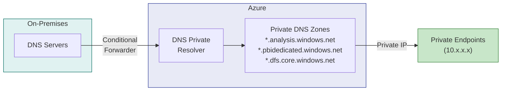

| Zone | Used By |
|------|---------|
| `privatelink.analysis.windows.net` | Power BI / Semantic Models |
| `privatelink.pbidedicated.windows.net` | Dedicated capacity |
| `privatelink.dfs.core.windows.net` | OneLake (DFS) |
| `privatelink.blob.core.windows.net` | OneLake (Blob) |
| `privatelink.servicebus.windows.net` | Event Hubs |

> Missing DNS zones = traffic bypasses PE silently. Always `nslookup` → expect `10.x.x.x`.

---

# DNS Best Practices

<v-clicks>

1. **Create all zones** + link to every VNet hosting PEs
2. **Test:** `Resolve-DnsName <ws>.pbidedicated.windows.net` → private IP
3. **Hybrid:** conditional forwarders → Azure DNS (`168.63.129.16`) via Private Resolver
4. **Automate:** Azure Policy `Deploy-DINE-PrivateDNSZoneGroup` for DNS records
5. **Monitor:** re-test after infra changes — broken links revert silently to public

</v-clicks>

 

**IP Planning:** 1 PE = 1 IP. Reserve `/27` (32 IPs) minimum for Fabric PEs.

---
layout: section
---

# Monitoring & Auditing

---

# Monitoring Stack

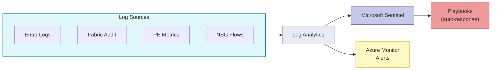

| Review | Frequency | Owner |
|--------|-----------|-------|
| IP FW rules | Monthly | WS admin |
| Outbound allowed destinations | Quarterly | Security |
| PE approvals | Quarterly | Azure sub owner |
| CA effectiveness | Quarterly | Identity team |
| DNS records | Semi-annually | Network team |

---
layout: section
---

# Architecture Patterns

---

# Feature Dependencies

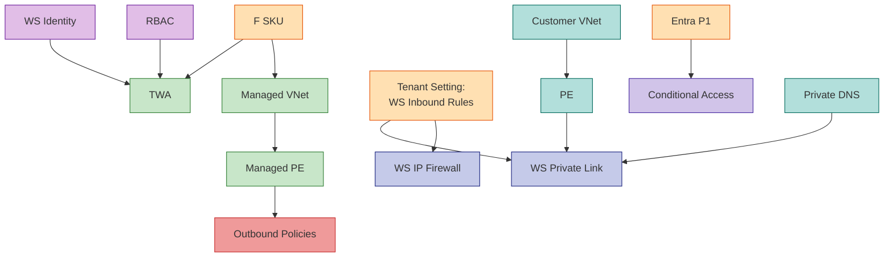

| Chain | Steps |
|-------|-------|
| **WS PL** | Tenant setting → VNet + PE + DNS → disable public |
| **MPE** | F SKU → MVNet (auto) → MPE → source approves |
| **TWA** | F SKU → WS Identity → RBAC → Resource Instance Rule |

---

# End-to-End Architecture — Workspace-Level

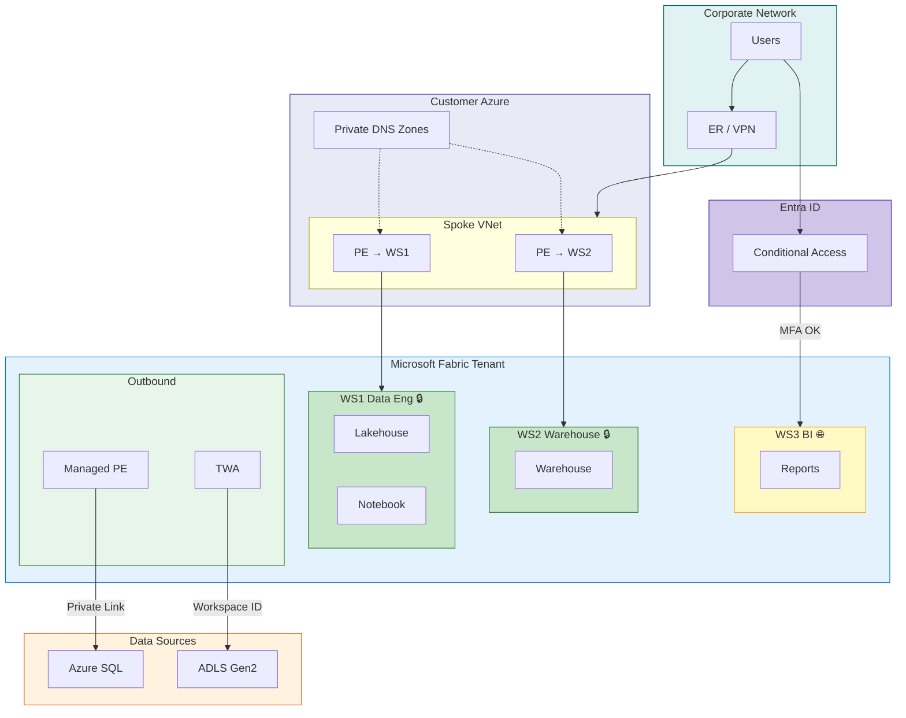

> **Workspace-level** = protect sensitive WS only. Tenant PL possible but more restrictive.

---

# Scenario 1 — Regulated Enterprise

GDPR / HIPAA / PCI DSS

| Layer | Recommendation |
|-------|---------------|
| **Inbound** | Tenant PL + Block Public. All users VPN/ER. |
| **Outbound** | MVNet + MPE + Outbound Policies everywhere |
| **Identity** | Phishing-resistant MFA + PIM + compliant devices |
| **Data** | CMK + Purview labels + DLP. Disable PBI exports. |
| **DNS** | Centralized zones + DNS Private Resolver |
| **Monitoring** | Full Sentinel. Quarterly reviews. |

> Most restrictive. Disables Copilot, Publish to Web, some exports.

---

# Scenario 2 — Mixed Sensitivity ★

Most common pattern

| Layer | Recommendation |
|-------|---------------|
| **Inbound** | WS PL (sensitive) + IP FW (semi) + Public+CA (BI) |
| **Outbound** | TWA for ADLS. MPE for SQL/Cosmos. VNet GW for DF. |
| **Identity** | MFA all. Device compliance for admins. |
| **Data** | CMK on sensitive WS. Labels to reports. |
| **Monitoring** | Audit logs + PE failure alerts |

> Best balance of security and usability for enterprise data platforms.

---

# Scenarios 3 & 4

### Startup — Cost-Optimized

| Layer | Choice |
|-------|--------|
| Inbound | CA + IP Firewall |
| Outbound | VNet GW / On-Prem GW |
| Data | Default encryption |
| Monitoring | Entra + Fabric logs |

No VNet infra. Minimal cost.

### Multi-Region Global

| Layer | Choice |
|-------|--------|
| Inbound | WS PL per region |
| Outbound | Regional MVNet + MPE |
| Data | Regional KV + multi-geo |
| Monitoring | Regional LA → Sentinel |

PEs co-located with capacity.

---
layout: section
---

# Feature Status & Roadmap
April 2026

---

# Feature Summary

| Feature | Scope | Status |
|---------|-------|:---:|
| Entra Conditional Access | Tenant | **GA** |
| Private Link — Tenant | Tenant | **GA** |
| Private Link — Workspace | Workspace | **GA** |
| IP Firewall — Workspace | Workspace | **GA** |
| Trusted Workspace Access | Workspace | **GA** |
| Managed Private Endpoints | Workspace | **GA** |
| Managed VNets | Workspace | **GA** |
| VNet Data Gateway (+ proxy/cert) | Org | **GA** |
| Outbound Access Policies | Workspace | **GA** |
| Customer Managed Keys | Workspace | **GA** |
| Eventstream Private Network | Workspace | *Preview* |
| Power BI Network Isolation | Workspace | *Planned* |
| Fabric DB Network Isolation | Workspace | *Planned* |

---

# Known Limitations

| Item | WS PL | IP FW | MVNet | Outbound | CMK |
|------|:---:|:---:|:---:|:---:|:---:|
| Lakehouse | ✅ | ✅ | ✅ | ✅ | ✅ |
| Warehouse | ✅ | ✅ | — | ✅ | ✅ |
| Notebook / Spark | ✅ | ✅ | ✅ | ✅ | ✅ |
| Pipeline / Dataflow | ✅ | ✅ | — | ✅ | ✅ |
| Eventstream | ✅ | ✅ | ✅ | ✅ | ✅ |
| Mirrored DB | ✅ | ✅ | — | ✅ | — |
| **Power BI** | 🔜 | 🔜 | — | 🔜 | 🔜 |
| **Fabric DBs** | 🔜 | 🔜 | — | 🔜 | 🔜 |
| **Data Activator** | 🔜 | 🔜 | — | — | — |

> Until PBI/DBs covered → protect with **tenant PL** or **Conditional Access**.

---

# Key Takeaways

 

**Identity first** — CA + MFA + PIM before network controls

**Workspace-level ★** — PL/IPFW per workspace, not tenant-wide

**Layered defense** — Inbound + Outbound + Data = full DEP

**DNS is #1 failure** — Private DNS Zones, test with `nslookup`, monitor drift

**Monitor everything** — Sentinel + playbooks + quarterly reviews

 

---
layout: center
class: text-center
---

# Thank You

 

Network Security in Microsoft Fabric — April 2026

 

[Fabric Security Overview](https://learn.microsoft.com/en-us/fabric/security/security-overview) ·
[Private Links](https://learn.microsoft.com/en-us/fabric/security/security-private-links-overview) ·
[Managed VNets](https://learn.microsoft.com/en-us/fabric/security/security-managed-vnets-fabric-overview)

[TWA](https://learn.microsoft.com/en-us/fabric/security/security-trusted-workspace-access) ·
[IP Firewall](https://learn.microsoft.com/en-us/fabric/security/security-ip-firewall-rules) ·
[Whitepaper](https://aka.ms/FabricSecurityWhitepaper)
