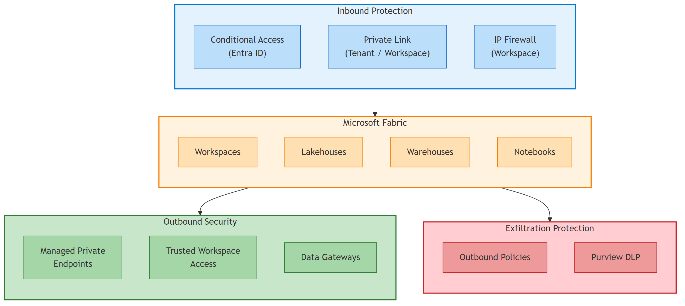
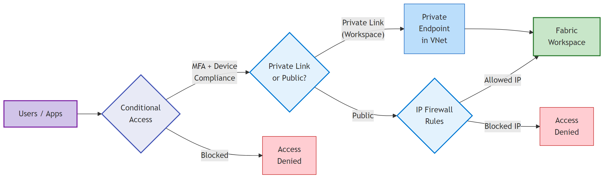
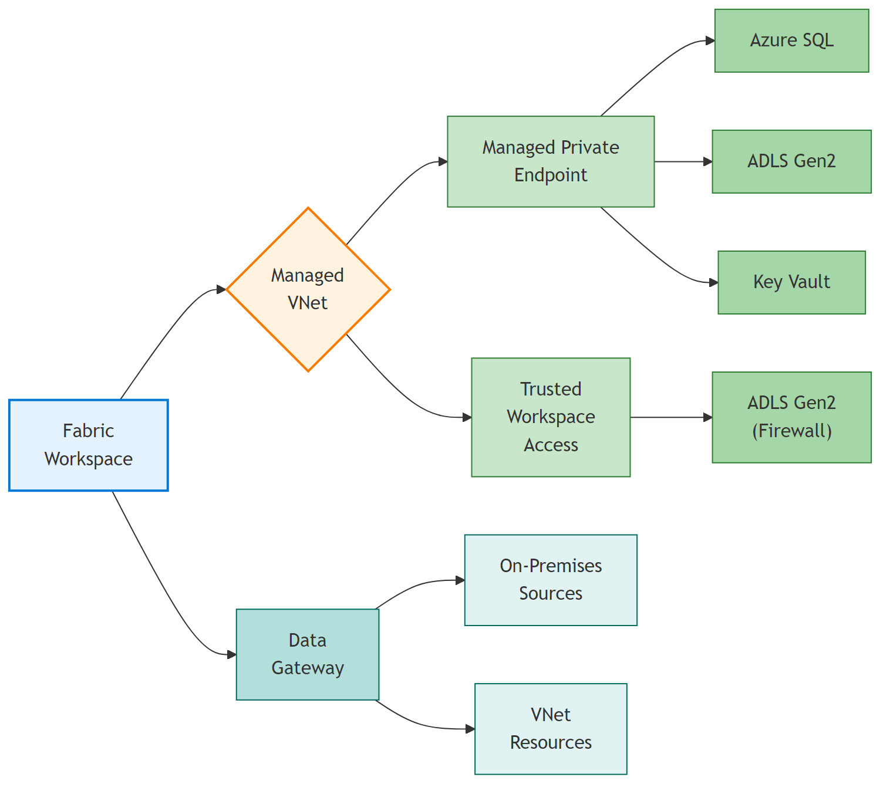
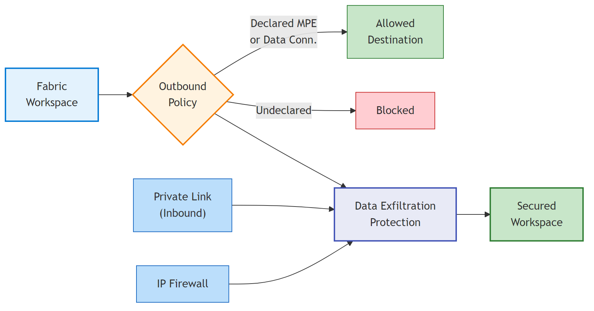
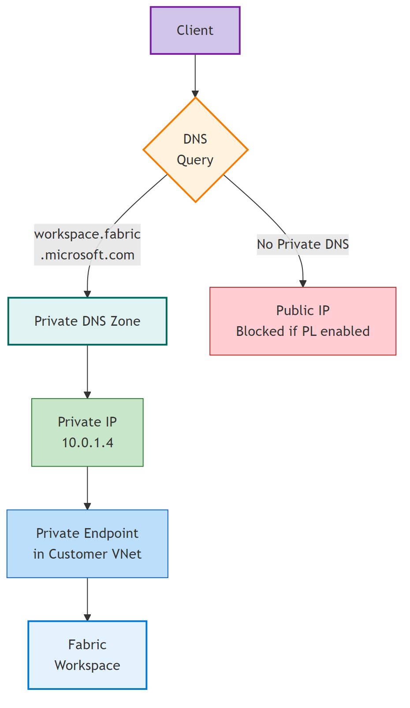
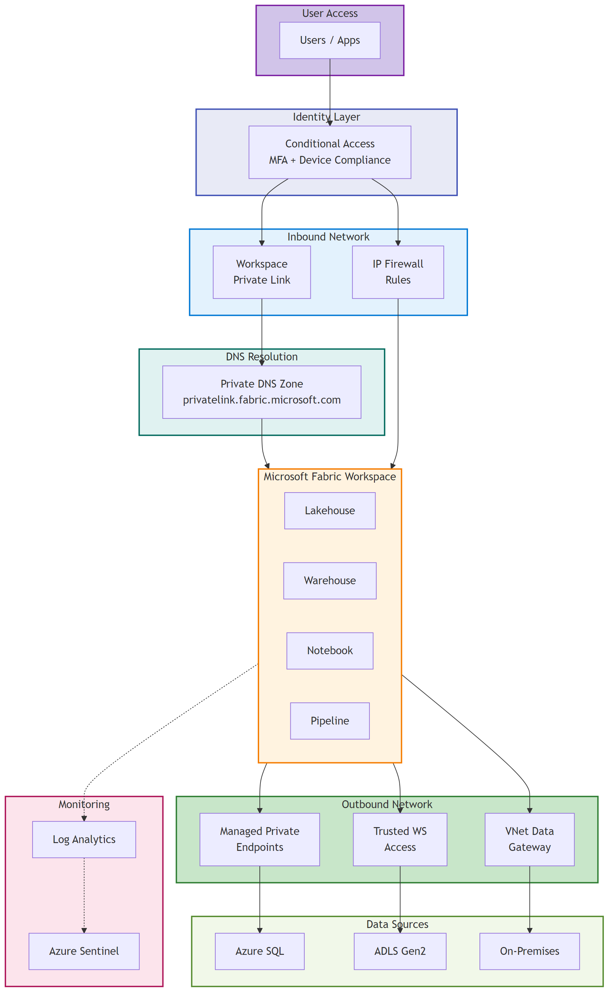

<!-- _class: lead -->
<!-- _paginate: false -->
<!-- _header: '' -->
<!-- _footer: '' -->

# Network Security in Microsoft Fabric

## Architecture & Configuration Guide

### April 2026

---

# Agenda

1. **Network Security Pillars** — Overview of the 3 layers
2. **Inbound Protection** — Conditional Access, Private Link, IP Firewall
3. **Outbound Security** — Managed VNet, MPE, TWA, Data Gateways
4. **Data Exfiltration Protection** — Outbound Policies + DLP
5. **DNS Configuration** — Private DNS Zones & best practices
6. **Monitoring & Auditing** — Log Analytics, Sentinel
7. **Zero Trust Identity** — MFA, PIM, Device Compliance
8. **End-to-End Architecture** — Putting it all together
9. **Feature Status & Recommendations**

---

# Network Security — Three Pillars



Fabric network security is built on **three pillars**: controlling who comes in (**inbound**), securing how data goes out (**outbound**), and preventing unauthorized export (**exfiltration protection**).

---

<!-- _class: divider -->

# Inbound Protection

Controlling who accesses Microsoft Fabric

---

# Conditional Access (Entra ID)

First line of defense — applies **before** any network control.

| Signal | Example |
|--------|---------|
| User / Group | Restrict to specific teams |
| Location | Block from untrusted countries |
| Device | Require Intune-compliant device |
| Risk Level | Block risky sign-ins (Entra ID P2) |

**Requirements:** Entra ID P1 license minimum

> **Best Practice:** Always enable Conditional Access — in a SaaS model, identity is your primary security perimeter. Network controls complement identity, they don't replace it.

---

# Private Link — Workspace Level



**Preferred approach** for granular isolation.

- Each workspace gets its own Private Link service
- Private Endpoint deployed in customer VNet
- Public access can be restricted per workspace
- Multiple workspaces can share a VNet

### Prerequisites

- Fabric **F SKU** capacity
- Azure VNet with available IP addresses
- Private DNS Zone configuration
- Tenant admin must enable **workspace-level inbound network rules**

> Tenant-level Private Link is also available but more restrictive — it blocks public access for the entire tenant.

---

# IP Firewall Rules (Workspace)

Allow access only from **declared IP ranges** — no Azure infrastructure needed.

### Supported Items
Lakehouse · Warehouse · Notebook · Pipeline · Dataflow · Eventstream · Mirrored DB

### Known Limitations
- **Power BI** items and **Fabric databases**: not yet supported (roadmap)
- Fabric REST API remains accessible even with strict IP rules
- Maximum **100 rules** per workspace

| Setting | Effect |
|---------|--------|
| No rules | All public IPs allowed |
| Rules defined | Only matching IPs allowed |
| Combined with PL | Private + allowed public IPs only |

**Status:** GA since early 2026

---

# Tenant vs Workspace Interaction

Tenant admin must enable **workspace-level inbound network rules** to allow workspace admins to configure Private Link or IP Firewall.

| Tenant Public Access | WS Private Link | WS IP Firewall | Portal Access | API Access |
|:--------------------:|:---------------:|:--------------:|:-------------:|:----------:|
| Allowed | — | — | Public | Public |
| Allowed | Configured | — | PL + Public | PL + Public |
| Allowed | — | Configured | Allowed IPs | Allowed IPs |
| Restricted | Configured | — | Tenant PL only | WS PL (API only) |
| Restricted | — | — | Tenant PL only | Tenant PL only |

> When tenant public access is **restricted**, workspace-level Private Link only enables API access — not full portal access.

---

<!-- _class: divider -->

# Outbound Security

Securing connections from Fabric to data sources

---

# Managed VNet & Private Endpoints



### Managed Virtual Network
- Microsoft-managed VNet per workspace
- Activated on first Spark job execution
- All outbound traffic routed through managed VNet

### Managed Private Endpoints (MPE)
- Private connections to Azure PaaS services
- Traffic stays on Microsoft backbone network
- Target service can block all public access

**Supported targets:** Azure SQL · ADLS Gen2 · Cosmos DB · Key Vault · Synapse · Purview · Event Hub

---

# Trusted Workspace Access (TWA)

Connect to **firewall-protected ADLS Gen2** without deploying Private Endpoints.

| Prerequisite | Detail |
|-------------|--------|
| Capacity | **F SKU** required |
| Workspace Identity | Must be enabled |
| RBAC | Storage Blob Data Contributor on ADLS Gen2 |
| Resource Instance Rule | Configured on the storage account firewall |

### Supported Workloads
Lakehouse shortcuts · Spark notebooks · Dataflows Gen2 · Pipelines · KQL

> **TWA vs MPE:** TWA is simpler (no VNet infrastructure) but limited to ADLS Gen2. Use MPE for Azure SQL, Cosmos DB, Key Vault, etc.

---

# Data Gateways

### On-Premises Data Gateway
- Software agent installed on a server in your network
- Bridges Fabric with on-premises data sources (SQL Server, Oracle, SAP…)
- Supports **clustering** for high availability

### VNet Data Gateway
- Managed gateway deployed in your Azure VNet
- **No VM to manage** — fully Microsoft-managed
- Access VNet-internal resources (SQL on IaaS, private endpoints)
- **GA:** Certificate authentication + enterprise proxy support

> [VNet Data Gateway documentation](https://learn.microsoft.com/data-integration/vnet/overview)

---

# Outbound Connectors Matrix

| Target Service | MPE | TWA | On-Prem GW | VNet GW |
|---------------|:---:|:---:|:----------:|:-------:|
| ADLS Gen2 | ✅ | ✅ | — | ✅ |
| Azure SQL | ✅ | — | ✅ | ✅ |
| Cosmos DB | ✅ | — | — | ✅ |
| Key Vault | ✅ | — | — | — |
| SQL Server (IaaS / on-prem) | — | — | ✅ | ✅ |
| Synapse Analytics | ✅ | — | — | ✅ |
| Azure Purview | ✅ | — | — | — |
| Event Hub | ✅ | — | — | ✅ |
| On-premises sources | — | — | ✅ | — |

---

<!-- _class: divider -->

# Data Exfiltration Protection

Preventing unauthorized data export

---

# Outbound Policies + DEP



### Outbound Access Policies (GA)
- Restrict workspace outbound to **declared destinations only**
- Allowed: Managed Private Endpoints + Data Connections
- All other destinations: **blocked**

### Data Exfiltration Protection
Combine **three layers** for full DEP:
1. **Inbound** — Private Link or IP Firewall
2. **Outbound** — Outbound access policies
3. **DLP** — Purview sensitivity labels + export restrictions

### Additional Controls
- Disable Power BI export to Excel / CSV / PPTX
- Endpoint DLP on client devices
- Microsoft Purview data classification & labeling

---

<!-- _class: divider -->

# DNS & Monitoring

Essential operational layers

---

# DNS Configuration for Private Link



### Private DNS Zones Required
- `privatelink.fabric.microsoft.com`
- `privatelink.dfs.core.windows.net` (ADLS)
- `privatelink.database.windows.net` (SQL)

### Best Practices
- Link DNS zones to **all relevant VNets**
- Use **Azure Private DNS Resolver** for hybrid scenarios
- Test with `nslookup` or `Resolve-DnsName`
- Expect: private IP (10.x.x.x), not public

> **#1 cause of Private Link failure** = missing or misconfigured Private DNS zones. Always validate DNS resolution before declaring Private Link operational.

---

# Monitoring & Auditing

| Layer | Tool | Purpose |
|-------|------|---------|
| Diagnostics | **Log Analytics** | Access logs, query performance |
| Network | **Network Watcher** | VNet flow analysis, connectivity tests |
| Security | **Azure Sentinel** | Threat detection, SIEM correlation |
| Compliance | **Microsoft Purview** | Data classification, sensitivity audit |
| Firewall | **Azure Firewall** | Centralized outbound logging + static IP |

### Key Actions
- Enable diagnostic logs → Log Analytics workspace
- Create Sentinel rules for anomalous access patterns
- Review IP firewall & PL configs **quarterly**
- Monitor Managed VNet bandwidth
- Use **NSG** with Fabric service tags (PowerBI, DataFactory)

---

<!-- _class: divider -->

# Zero Trust & Architecture

Identity as the primary perimeter

---

# Zero Trust Identity Layer

In a **SaaS model**, identity is the primary security perimeter — not the network.

| Control | Purpose |
|---------|---------|
| **MFA** | Phishing-resistant authentication |
| **Device Compliance** | Only managed / compliant devices |
| **PIM** | Just-in-time privileged access |
| **Service Principals** | Governed application identities |
| **Managed Identity** | Credential-free workload authentication |

### Layered Defense Model

```
Identity (Entra + CA)  →  Network (PL / IP FW)  →  Data (Purview / DLP)
```

> Network controls **complement** identity — they don't replace it. Start with strong identity, then layer network controls for defense in depth.

---

# End-to-End Architecture



**Workspace-level privatization** — recommended for most enterprises.
Isolate sensitive workspaces without impacting the entire tenant.

---

# Feature Status — April 2026

| Feature | Status | Scope |
|---------|:------:|-------|
| Conditional Access | **GA** | Tenant |
| Private Link (Tenant) | **GA** | Tenant |
| Private Link (Workspace) | **GA** | Workspace |
| IP Firewall Rules | **GA** | Workspace |
| Managed VNet | **GA** | Workspace |
| Managed Private Endpoints | **GA** | Workspace |
| Trusted Workspace Access | **GA** | Workspace |
| Outbound Access Policies | **GA** | Workspace |
| VNet Data Gateway | **GA** | VNet |
| Customer Managed Keys | **GA** | Capacity |
| Eventstream Private Network | **Preview** | Workspace |
| Power BI Network Protection | **Planned** | — |
| Fabric Database Network | **Planned** | — |

---

# Known Limitations

| Item | Private Link | IP Firewall | Managed VNet | Outbound Policy |
|------|:----------:|:---------:|:-----------:|:--------------:|
| Lakehouse | ✅ | ✅ | ✅ | ✅ |
| Warehouse | ✅ | ✅ | ✅ | ✅ |
| Notebook | ✅ | ✅ | ✅ | ✅ |
| Pipeline | ✅ | ✅ | ✅ | ✅ |
| Dataflow Gen2 | ✅ | ✅ | ✅ | ✅ |
| Power BI Report | ❌ | ❌ | N/A | N/A |
| Fabric Database | ❌ | ❌ | ❌ | ❌ |
| Data Activator | ❌ | ❌ | ❌ | ❌ |
| Eventstream | ✅ | ✅ | Preview | Preview |

**Power BI** and **Fabric Database** network protection is on the roadmap but not yet available.

---

# Recommended Architectures

### Standard Enterprise
> **Conditional Access** + Workspace Private Link + MPE + Outbound Policies

### Regulated / GDPR
> CA + Workspace PL + MPE + Outbound Policies + **Purview DLP** + **CMK**

### Hybrid (on-premises data)
> CA + IP Firewall + VNet Data Gateway + On-Premises Gateway

### Multi-team Isolation
> CA + **Per-workspace PL** + Per-workspace Outbound Policies + **PIM**

---

<!-- _class: lead -->
<!-- _paginate: false -->
<!-- _header: '' -->
<!-- _footer: '' -->

# Thank You

### Questions?

Network security is a journey, not a destination.
Keep reviewing, testing, and adapting.
