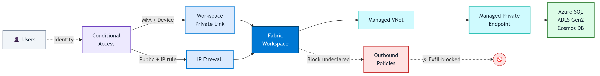
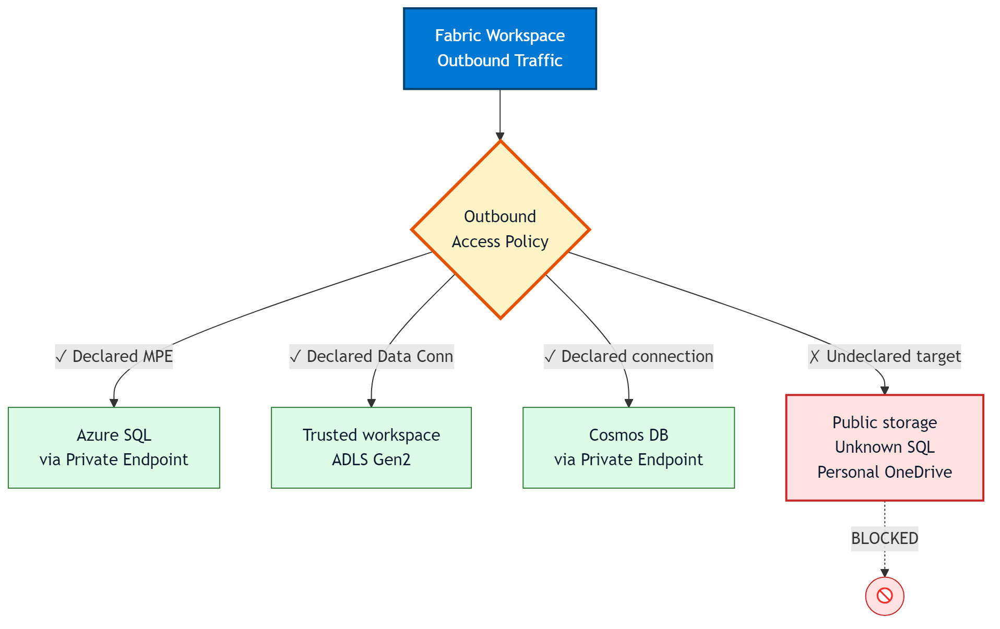
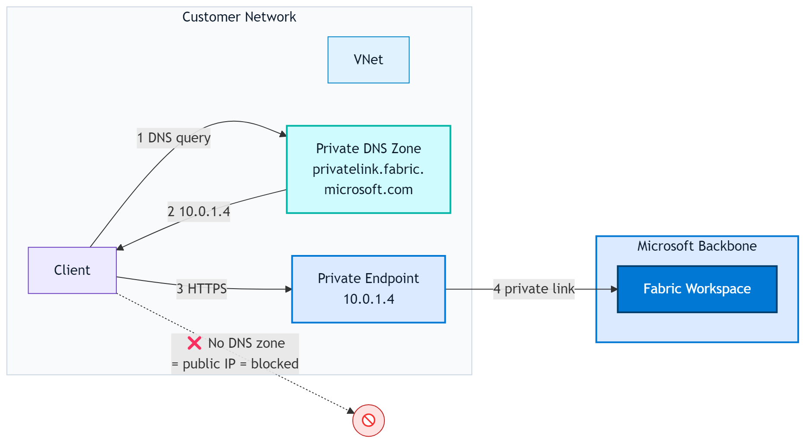

<!-- _class: lead -->
<!-- _paginate: false -->
<!-- _header: '' -->
<!-- _footer: '' -->

Architecture Brief · April 2026

# Network Security in Microsoft Fabric.

## Three pillars. Zero public exposure. One coherent architecture for enterprise-grade data platforms.

### fredgis · github.com/fredgis/Divers

---

<!-- _header: '' -->

# The Shift

## From "network perimeter" to "identity + data boundary"

Fabric is **SaaS**. The public endpoint *is* the platform. You cannot put it behind a firewall and call it a day.

Network security becomes a **composition of controls** — each addressing a specific threat surface, none of them sufficient alone.

The goal is not to replicate on-premises isolation. The goal is **layered containment** that assumes breach at every tier.

3

pillars of network defense

0

trust assumptions — Zero Trust by design

1

coherent DEP architecture — Data Exfiltration Protection

---

# The Three Pillars

## Each answers a different question

PILLAR 01

<h3>Inbound Protection</h3>

<strong>Who</strong> can access Fabric? Identity-first, network-second.

Conditional Access Private Link IP Firewall

PILLAR 02

<h3>Secure Outbound</h3>

<strong>How</strong> does Fabric reach protected sources? Private paths, not public ones.

Managed VNet MPE TWA Gateways

PILLAR 03

<h3>Exfiltration Protection</h3>

<strong>Where</strong> can data go? Allowlisted destinations only.

Outbound Policies Purview DLP

> **Inbound + Outbound = DEP.** Combining both pillars produces Data Exfiltration Protection — the state where data cannot leave via any unauthorized path.

---

# End-to-End Flow

## The complete request path through a secured Fabric

Identity gate → network gate → workspace → managed VNet → private data path. Outbound policies kill anything that doesn't match a declared destination.

---

<!-- _class: chapter -->

01

# Inbound Protection.

Controlling who — and from where — can reach the Fabric tenant.

---

# Conditional Access

## Identity is the primary perimeter

<h3>Policies evaluate</h3>

- **User / Group** — restrict to business units
- **Location** — block untrusted countries
- **Device** — require Intune-compliant
- **Risk Level** — block risky sign-ins (P2)
- **Application** — per-client granularity

<h3>Enforcement</h3>

- MFA · phishing-resistant preferred
- Session controls · limit token lifetime
- Just-in-time elevation (PIM)

<h3>Requirements</h3>

| Component | Level |
|-----------|-------|
| Entra ID license | **P1** minimum |
| MFA | **Required** |
| Device compliance | Intune recommended |
| Risk-based CA | **P2** license |

> **Rule of thumb.** If Conditional Access isn't configured, nothing below matters. Identity is always first.

---

# Private Link — Tenant vs Workspace

## Two different tools. Pick based on isolation granularity.

TENANT-LEVEL

<h3>All-or-Nothing</h3>

A single Private Link service for the entire tenant. Blocks public access globally.

Simpler to deploy
Spark starter pools disabled
Some features unsupported

<strong>Use when:</strong> the entire tenant handles sensitive data.

WORKSPACE-LEVEL · RECOMMENDED

<h3>Surgical Isolation</h3>

One Private Link service per workspace. Isolate only what needs to be isolated.

Per-workspace granularity
Share a VNet across workspaces
Needs tenant admin to enable

<strong>Use when:</strong> mixed sensitivity workspaces — the common case.

> Both require a **Private DNS Zone** (`privatelink.fabric.microsoft.com`). Forgetting it is the #1 reason Private Link "doesn't work" on first deployment.

---

# IP Firewall Rules

## The simplest public-access lockdown

<h3>When to use</h3>

Allow Fabric on the public internet — but only from **declared IP ranges**. No Azure VNet infrastructure required.

<h3>Limitations</h3>

- Power BI items · **not yet supported**
- Fabric databases · **not yet supported**
- Fabric REST API · remains accessible (by design)
- Max **100 rules** per workspace

<h3>Supported items</h3>

Lakehouse
Warehouse
Notebook
Pipeline
Dataflow Gen2
Eventstream
Mirrored DB

<h3>Combines with</h3>

Private Link +
IP Firewall → Private paths and allowed public IPs both permitted. Everything else denied.

GA since early 2026

---

# Tenant × Workspace Interaction

## The matrix that trips up every deployment

| Tenant Public | WS Private Link | WS IP Firewall | Portal Access | API Access |
|:-------------:|:---------------:|:--------------:|:-------------:|:----------:|
| Allowed | — | — | Public ✓ | Public ✓ |
| Allowed | ✓ | — | PL + Public | PL + Public |
| Allowed | — | ✓ | Allowed IPs only | Allowed IPs only |
| **Restricted** | ✓ | — | Tenant PL only | WS PL + Tenant PL |
| **Restricted** | — | — | Tenant PL only | Tenant PL only |

> **Non-obvious:** when tenant public access is **restricted**, workspace-level Private Link enables **API access only** — not full portal access. The portal requires a tenant-level Private Link.

<strong>Prerequisite:</strong> tenant admin must enable <em>workspace-level inbound network rules</em> before workspace admins can configure PL or IP Firewall.

---

<!-- _class: chapter -->

02

# Secure Outbound.

Reaching private data sources — without crossing the public internet.

---

# Managed VNet & Private Endpoints

## Fabric's default outbound path, once activated

<h3>Managed Virtual Network</h3>

- **Microsoft-managed** VNet per workspace
- Activated on first Spark job execution
- All outbound traffic routed through it
- No configuration burden for the customer

<h3>Managed Private Endpoints (MPE)</h3>

- Private connections to Azure PaaS
- Traffic stays on Microsoft backbone
- Target service can **block all public access**

<h3>Supported targets</h3>

Azure SQL DB
ADLS Gen2
Cosmos DB
Key Vault
Synapse
Purview
Event Hub

> **MPE request flow.** Create MPE → target service admin approves → traffic flows on the private backbone. The approval step is intentional — it prevents rogue teams from bypassing security.

---

# Trusted Workspace Access (TWA)

## The shortcut to firewalled ADLS Gen2

TWA lets a Fabric workspace reach **firewall-protected ADLS Gen2** *without* deploying a Private Endpoint.

Useful when MPE would be overkill — only one target storage, simple RBAC model.

<h3>When to choose TWA over MPE</h3>

- Target is **ADLS Gen2 only**
- No VNet infrastructure to manage
- Speed of deployment > network isolation purity

<h3>Prerequisites</h3>

<strong>Fabric F SKU capacity</strong>Trial and PPU do not qualify

<strong>Workspace Identity enabled</strong>Generated by the workspace admin

<strong>Storage RBAC</strong>Storage Blob Data Contributor on ADLS Gen2

<strong>Resource Instance Rule</strong>Configured on the storage account firewall

---

# Data Gateways

## When the source is not on Azure

ON-PREMISES DATA GATEWAY

<h3>Bridge to corporate networks</h3>

Software agent on a server inside your network. Encrypts outbound to the Fabric service.

✓ SQL Server, Oracle, SAP, Teradata 
✓ Clustering for HA 
✓ Kerberos SSO supported

Install on a VM close to the data source. Size for peak concurrent refreshes.

VNET DATA GATEWAY

<h3>Managed gateway in your Azure VNet</h3>

No VM to maintain. Fully managed by Microsoft, deployed in your VNet.

✓ SQL on IaaS, private endpoints 
✓ <strong>Certificate authentication · GA</strong> 
✓ <strong>Enterprise proxy support · GA</strong>

Preferred for new deployments when sources are reachable via VNet peering.

---

# Outbound Connector Matrix

## Which mechanism reaches which target?

| Target | MPE | TWA | On-Prem GW | VNet GW |
|--------|:---:|:---:|:----------:|:-------:|
| **ADLS Gen2** | ✓ | ✓ | — | ✓ |
| **Azure SQL** | ✓ | — | ✓ | ✓ |
| **Cosmos DB** | ✓ | — | — | ✓ |
| **Key Vault** | ✓ | — | — | — |
| **SQL Server (IaaS / on-prem)** | — | — | ✓ | ✓ |
| **Synapse Analytics** | ✓ | — | — | ✓ |
| **Azure Purview** | ✓ | — | — | — |
| **Event Hub / Service Bus** | ✓ | — | — | ✓ |
| **On-premises SAP / Oracle** | — | — | ✓ | — |

> **Decision heuristic.** If the target is Azure PaaS: prefer **MPE**. If it's on-premises: **On-Prem Gateway**. If it's in your Azure VNet: **VNet Gateway**. If it's ADLS Gen2 and you want speed: **TWA**.

---

<!-- _class: chapter -->

03

# Exfiltration Protection.

The third pillar. Controlling where data goes — not just how it gets out.

---

# Outbound Access Policies

## The gate that turns Fabric into a closed circuit

Traffic leaving the workspace must match a **declared destination** — either a Managed Private Endpoint or a Data Connection. Anything else: blocked by default.

---

# The Full DEP Picture

## Three controls that must combine

<h3>Layer 1 · Inbound</h3>
Block unauthorized users. Private Link, IP Firewall, Conditional Access.

<h3>Layer 2 · Outbound</h3>
Block unauthorized destinations. Outbound Access Policies.

<h3>Layer 3 · Data</h3>
Block unauthorized *content*. Purview DLP labels, export restrictions.

<h3>Additional content controls</h3>

Power BI exports Disable Excel / CSV / PPTX exports on sensitive workspaces.

Endpoint DLP Microsoft Purview + Intune to block copy to USB, personal cloud.

Sensitivity labels Classify and auto-apply via Purview — labels travel with the data.

CMK Customer Managed Keys for an additional encryption boundary.

> **A DEP architecture without Layer 3 is incomplete.** Network controls stop data from leaving via unauthorized paths. DLP stops data from leaving via authorized paths but as unauthorized content.

---

<!-- _class: chapter -->

04

# Operations.

DNS, monitoring, testing — the layers that make it actually work.

---

# DNS · The Silent Killer

## Misconfigured DNS is the #1 Private Link failure cause

Without the Private DNS Zone, clients resolve the public IP — which Private Link then blocks. The result: "it works from one machine but not another."

---

# Monitoring Stack

## Network security without visibility is theater

DIAGNOSTICS

<h3>Log Analytics</h3>

Fabric diagnostic logs: access patterns, query performance, errors.

NETWORK

<h3>Network Watcher</h3>

VNet flow logs, connectivity tests, reachability checks for Private Endpoints.

SECURITY

<h3>Azure Sentinel</h3>

SIEM correlation. Detect anomalous access patterns, failed CA evaluations.

COMPLIANCE

<h3>Microsoft Purview</h3>

Data classification, sensitivity audit, DLP policy evaluation.

FIREWALL

<h3>Azure Firewall</h3>

Centralized outbound logging. Static egress IP for partner allowlists.

AUDIT

<h3>Quarterly review</h3>

Rotate IP rules, review PL config, re-validate CA policies against threat model.

---

# Validation Checklist

## Never deploy a network config you haven't tested

<strong>Resolve DNS from a client</strong><code>nslookup workspace.fabric.microsoft.com</code> — must return a <strong>private IP (10.x)</strong>, not a public one.

<strong>Test blocked public access</strong>Attempt from a non-allowed IP when rules are active — the connection must fail explicitly.

<strong>Spark cold start timing</strong>First Spark job triggers Managed VNet activation — measure the latency impact in your setup.

<strong>MPE approval flow</strong>Create a test MPE, verify the target service admin receives the approval request and can approve it.

<strong>Exfiltration attempt</strong>Try to write to an undeclared destination from a notebook. The outbound policy must block it.

---

<!-- _class: chapter -->

05

# Recommendations.

What would I deploy in your context? Scenario-driven architectures.

---

# Zero Trust · Reference Posture

## The layered model you should start from

Identity is the primary perimeter. Network is the second. Data is the last line of defense. Each layer assumes the previous one can be breached.

> **Common pitfall.** Teams invest months in Private Link deployment while Conditional Access remains permissive. The weakest link dictates the security posture.

---

# Architectures by Scenario

## Stop debating features. Pick a blueprint.

STANDARD ENTERPRISE

<h3>Balanced · Default choice</h3>

Conditional Access + Workspace Private Link + MPE + Outbound Policies.

Protection for most mixed-sensitivity tenants.

REGULATED · GDPR · PCI

<h3>Maximum Control</h3>

CA + WS PL + MPE + Outbound Policies + <strong>Purview DLP</strong> + <strong>CMK</strong>.

All three DEP layers active. Audit-ready.

HYBRID DATA ESTATE

<h3>On-premises integration</h3>

CA + IP Firewall + <strong>VNet Gateway</strong> + <strong>On-Prem Gateway</strong>.

For legacy sources that aren't cloud-native.

MULTI-TEAM ISOLATION

<h3>Segregated workloads</h3>

CA + <strong>Per-workspace PL</strong> + Per-workspace outbound + <strong>PIM</strong>.

Different teams, different sensitivity. No shared blast radius.

---

# Feature Roadmap

## What's GA · What's coming · What's blocked

| Feature | Status | Notes |
|---------|:------:|-------|
| Conditional Access | GA | Since day one |
| Private Link (Tenant) | GA | All-or-nothing scope |
| Private Link (Workspace) | GA | **Recommended** default |
| IP Firewall | GA | Early 2026 |
| Managed VNet / MPE | GA | Core outbound path |
| Trusted Workspace Access | GA | ADLS Gen2 only |
| Outbound Access Policies | GA | End 2025 |
| VNet Data Gateway · Cert Auth + Proxy | GA | New in April 2026 |
| Customer Managed Keys | GA | All workloads |
| Eventstream Private Network | Preview | Early 2026 |
| **Power BI** network protection | Planned | Expected late 2026 |
| **Fabric Database** network protection | Planned | No ETA |

---

<!-- _class: closing -->
<!-- _paginate: false -->
<!-- _header: '' -->
<!-- _footer: '' -->

## Takeaways

# Three pillars. Defense in depth. Zero blind spots.

Fabric's network security is not a single feature — it's an architecture. Start with identity, layer network controls, finish with data classification. Test every layer. Monitor the whole stack.

Source: github.com/fredgis/Divers/markdown/Fabric_Network_Security.md

